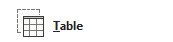

## **Översikt**

En bildlayout definierar positionerna och formateringen av platshållare såsom rubriker, text, bilder, diagram och tabeller. Att tillämpa en layout ger bilder en konsekvent struktur samtidigt som varje bild kan innehålla sitt eget innehåll.

De vanligaste layouterna inkluderar:

- **Title Slide**: Innehåller rubrik- och underrubriksplatshållare.
- **Title and Content**: Innehåller en rubrikplatshållare och en allmänt använd innehållsplatshållare.
- **Blank**: Innehåller inga innehållsplatshållare och är användbar när varje form placeras manuellt.

## **Förstå Layoutarv**

En presentation har tre relaterade nivåer:

1. En [master slide](https://reference.aspose.com/slides/sv/java/com.aspose.slides/imasterslide/) definierar temat, gemensam formatering, bakgrunder och vanliga objekt.
2. En [layout slide](https://reference.aspose.com/slides/sv/java/com.aspose.slides/ilayoutslide/) tillhör en master och definierar en specifik placering av platshållare.
3. En [normal slide](https://reference.aspose.com/slides/sv/java/com.aspose.slides/islide/) använder en layout och lagrar innehållet som matats in för den bilden.

En normal bild ärver tema och formatering från sin layout, och layouten ärver från sin master. Ett värde som sätts direkt på en normal bild åsidosätter det ärvda värdet på den nivån. När en normal bild skapas genereras dess platshållarformer från den valda layouten, medan innehållet som matas in i dessa platshållare tillhör den normala bilden.

Lägg till nödvändiga platshållare i en layout innan du skapar bilder från den. Att senare lägga till en ny platshållare i en layout lägger inte automatiskt till motsvarande platshållarform i befintliga normalbilder.

Denna relation har två viktiga konsekvenser:

- Att ändra ärvd formatering eller befintlig platshållargeometri i en layout kan uppdatera varje bild som är beroende av den. Innan du redigerar en layout som redan är i bruk, inspektera dess beroende bilder och granska den resulterande presentationen.
- En layout som fortfarande används av en bild kan inte tas bort. Tilldela dess beroende bilder till en annan layout först, eller ta bara bort oanvända layouter.

För mer information om det översta lagret i denna hierarki, se [Slide Master](/slides/sv/java/slide-master/).

För att dölja ärvda logotyper eller dekorativa masterformer på en bild eller via en gemensam layout, se [Control the Visibility of Master Graphics](/slides/sv/java/slide-master/). Exemplet jämför två bilder som använder samma master.

## **Välj och Tillämpa en Bildlayout**

Använd en layouttyp när presentationen följer standarddefinitioner för PowerPoints layouter. Layoutnamn är redigerbara av användaren och kan lokalanpassas, så namnbaserad urval är mindre pålitligt om du inte kontrollerar källmallen.

Följande exempel söker efter **Title and Content** på den första masteren. Om den layouten saknas återgår det avsiktligt till **Blank**. Den andra null‑kontrollen behövs eftersom en presentation kan innehålla enbart anpassade layouter. Den valda layouten tillämpas sedan på den första normalbilden via [ISlide.setLayoutSlide](https://reference.aspose.com/slides/sv/java/com.aspose.slides/islide/#setLayoutSlide-com.aspose.slides.ILayoutSlide-)‑metoden.

```java
import com.aspose.slides.*;

Presentation presentation = new Presentation("input.pptx");
try {
    IMasterLayoutSlideCollection layoutSlides = presentation.getMasters().get_Item(0).getLayoutSlides();
    ILayoutSlide targetLayout = layoutSlides.getByType(SlideLayoutType.TitleAndObject);

    if (targetLayout == null) {
        targetLayout = layoutSlides.getByType(SlideLayoutType.Blank);
    }

    if (targetLayout == null) {
        throw new IllegalStateException("The first master does not contain a suitable layout slide.");
    }

    presentation.getSlides().get_Item(0).setLayoutSlide(targetLayout);
    presentation.save("output-with-new-layout.pptx", SaveFormat.Pptx);
} finally {
    presentation.dispose();
}
```

Att ändra en bilds layout tar inte bort vanliga former som lagts till direkt på bilden. Dock kan platshållarpositioner, ärvd formatering och motsvarande mellan befintliga platshållare och den nya layouten förändras, så inspektera resultatet när du byter mellan väsentligt olika layouter.

## **Lägg till en Layoutbild**

Urval och skapande är separata operationer. Det föregående exemplet väljer en befintlig layout; det skapar ingen. För att skapa en layout, anropa [IMasterLayoutSlideCollection.add](https://reference.aspose.com/slides/sv/java/com.aspose.slides/imasterlayoutslidecollection/#add-byte-java.lang.String-)‑metoden på målets masters layoutsamling.

Följande exempel lägger alltid till en ny **Title and Content**‑layout med namnet `Report Title and Content`, och lägger sedan till en normal bild baserad på den. Layoutnamn måste vara unika inom samlingen.

```java
import com.aspose.slides.*;

Presentation presentation = new Presentation("input.pptx");
try {
    IMasterSlide masterSlide = presentation.getMasters().get_Item(0);
    ILayoutSlide reportLayout = masterSlide.getLayoutSlides().add(SlideLayoutType.TitleAndObject, "Report Title and Content");
    presentation.getSlides().addEmptySlide(reportLayout);

    presentation.save("output-with-report-layout.pptx", SaveFormat.Pptx);
} finally {
    presentation.dispose();
}
```

Lägg bara till en layout när mallen verkligen behöver en ytterligare återanvändbar struktur. Om en lämplig layout redan finns, välj och återanvänd den i stället för att skapa en dublett.

## **Lägg till Platshållare i en Layoutbild**

[ILayoutSlide.getPlaceholderManager](https://reference.aspose.com/slides/sv/java/com.aspose.slides/ilayoutslide/#getPlaceholderManager--)‑metoden returnerar en [ILayoutPlaceholderManager](https://reference.aspose.com/slides/sv/java/com.aspose.slides/ilayoutplaceholdermanager/) för att lägga till platshållarformer i en layout.

| PowerPoint‑platshållare            | `ILayoutPlaceholderManager`‑metod |
| ---------------------------------- | --------------------------------- |
|             | [`addContentPlaceholder(float x, float y, float width, float height)`](https://reference.aspose.com/slides/sv/java/com.aspose.slides/ilayoutplaceholdermanager/#addContentPlaceholder-float-float-float-float-) |
|  | [`addVerticalContentPlaceholder(float x, float y, float width, float height)`](https://reference.aspose.com/slides/sv/java/com.aspose.slides/ilayoutplaceholdermanager/#addVerticalContentPlaceholder-float-float-float-float-) |
|                   | [`addTextPlaceholder(float x, float y, float width, float height)`](https://reference.aspose.com/slides/sv/java/com.aspose.slides/ilayoutplaceholdermanager/#addTextPlaceholder-float-float-float-float-) |
|       | [`addVerticalTextPlaceholder(float x, float y, float width, float height)`](https://reference.aspose.com/slides/sv/java/com.aspose.slides/ilayoutplaceholdermanager/#addVerticalTextPlaceholder-float-float-float-float-) |
|             | [`addPicturePlaceholder(float x, float y, float width, float height)`](https://reference.aspose.com/slides/sv/java/com.aspose.slides/ilayoutplaceholdermanager/#addPicturePlaceholder-float-float-float-float-) |
|                 | [`addChartPlaceholder(float x, float y, float width, float height)`](https://reference.aspose.com/slides/sv/java/com.aspose.slides/ilayoutplaceholdermanager/#addChartPlaceholder-float-float-float-float-) |
|                 | [`addTablePlaceholder(float x, float y, float width, float height)`](https://reference.aspose.com/slides/sv/java/com.aspose.slides/ilayoutplaceholdermanager/#addTablePlaceholder-float-float-float-float-) |
|           | [`addSmartArtPlaceholder(float x, float y, float width, float height)`](https://reference.aspose.com/slides/sv/java/com.aspose.slides/ilayoutplaceholdermanager/#addSmartArtPlaceholder-float-float-float-float-) |
|                 | [`addMediaPlaceholder(float x, float y, float width, float height)`](https://reference.aspose.com/slides/sv/java/com.aspose.slides/ilayoutplaceholdermanager/#addMediaPlaceholder-float-float-float-float-) |
|    | [`addOnlineImagePlaceholder(float x, float y, float width, float height)`](https://reference.aspose.com/slides/sv/java/com.aspose.slides/ilayoutplaceholdermanager/#addOnlineImagePlaceholder-float-float-float-float-) |

Följande exempel verifierar att **Blank**‑layouten finns, lägger till fyra platshållare i den och skapar sedan en normal bild som använder den modifierade layouten. Ordningen är avsiktlig: platshållarna läggs till innan den normala bilden skapas, så att Aspose.Slides kan generera motsvarande platshållarformer på den bilden.

```java
import com.aspose.slides.*;

Presentation presentation = new Presentation();
try {
    ILayoutSlide blankLayout = presentation.getLayoutSlides().getByType(SlideLayoutType.Blank);

    if (blankLayout == null) {
        throw new IllegalStateException("The presentation does not contain a Blank layout slide.");
    }

    ILayoutPlaceholderManager placeholderManager = blankLayout.getPlaceholderManager();
    placeholderManager.addContentPlaceholder(20, 20, 310, 270);
    placeholderManager.addVerticalTextPlaceholder(350, 20, 350, 270);
    placeholderManager.addChartPlaceholder(20, 310, 310, 180);
    placeholderManager.addTablePlaceholder(350, 310, 350, 180);

    presentation.getSlides().addEmptySlide(blankLayout);
    presentation.save("output-with-placeholders.pptx", SaveFormat.Pptx);
} finally {
    presentation.dispose();
}
```

Resultatet:


{}
Att ändra ärvd formatering eller geometrin för befintliga layout‑platshållare kan påverka beroende bilder. En nyligen tillagd layout‑platshållare fylls inte i i befintliga normalbilder. Testa layoutändringar på en kopia av presentationen och inspektera varje beroende bild.
{}

## **Ta Bort Oanvända Layoutbilder**

Använd [Compress.removeUnusedLayoutSlides](https://reference.aspose.com/slides/sv/java/com.aspose.slides/compress/#removeUnusedLayoutSlides-com.aspose.slides.Presentation-)‑metoden för att ta bort layouter som ingen normal bild refererar till. Metoden lämnar intakta de layouter som fortfarande är i bruk.

```java
import com.aspose.slides.*;

Presentation presentation = new Presentation("input.pptx");
try {
    Compress.removeUnusedLayoutSlides(presentation);
    presentation.save("output-without-unused-layouts.pptx", SaveFormat.Pptx);
} finally {
    presentation.dispose();
}
```

För att ta bort en specifik layout, använd först dess [hasDependingSlides](https://reference.aspose.com/slides/sv/java/com.aspose.slides/ilayoutslide/#hasDependingSlides--)‑ eller [getDependingSlides](https://reference.aspose.com/slides/sv/java/com.aspose.slides/ilayoutslide/#getDependingSlides--)‑metod. Tilldela eventuella beroende bilder innan du anropar [ILayoutSlide.remove](https://reference.aspose.com/slides/sv/java/com.aspose.slides/ilayoutslide/#remove--). Att försöka ta bort en layout som används ger ett [PptxEditException](https://reference.aspose.com/slides/sv/java/com.aspose.slides/pptxeditexception/).

## **Styr Sidfots Synlighet på en Layoutbild**

En layout har egna sidfot-, bildnummer‑ och datum‑tid‑platshållare. Använd [ILayoutSlide.getHeaderFooterManager](https://reference.aspose.com/slides/sv/java/com.aspose.slides/ilayoutslide/#getHeaderFooterManager--)‑metoden för att kontrollera dessa platshållare för en layout. Detta är användbart när exempelvis innehålls‑layouter ska visa sidfot men titellayouter inte ska göra det.

Följande exempel väljer en layout på ett säkert sätt och gör dess sidfots‑element synliga:

```java
import com.aspose.slides.*;

Presentation presentation = new Presentation("input.pptx");
try {
    ILayoutSlide layoutSlide = presentation.getLayoutSlides().getByType(SlideLayoutType.TitleAndObject);

    if (layoutSlide == null) {
        layoutSlide = presentation.getLayoutSlides().getByType(SlideLayoutType.Blank);
    }

    if (layoutSlide == null) {
        throw new IllegalStateException("The presentation does not contain a suitable layout slide.");
    }

    ILayoutSlideHeaderFooterManager headerFooterManager = layoutSlide.getHeaderFooterManager();
    headerFooterManager.setFooterVisibility(true);
    headerFooterManager.setSlideNumberVisibility(true);
    headerFooterManager.setDateTimeVisibility(true);
    headerFooterManager.setFooterText("Footer text");
    headerFooterManager.setDateTimeText("Date and time text");

    presentation.save("output-with-layout-footers.pptx", SaveFormat.Pptx);
} finally {
    presentation.dispose();
}
```

## **Styr Sidfots Synlighet på en Master och Dess Barnlayouter**

För att tillämpa konsekventa sidfot‑inställningar över en master‑hierarki, använd [IMasterSlide.getHeaderFooterManager](https://reference.aspose.com/slides/sv/java/com.aspose.slides/imasterslide/#getHeaderFooterManager--)‑metoden. Spridnings‑metoderna i [IMasterSlideHeaderFooterManager](https://reference.aspose.com/slides/sv/java/com.aspose.slides/imasterslideheaderfootermanager/) verkar på masteren samt dess beroende layout‑ och normalbilder; de riktar sig inte bara mot en enskild normal bild.

```java
import com.aspose.slides.*;

Presentation presentation = new Presentation("input.pptx");
try {
    IMasterSlideHeaderFooterManager headerFooterManager = presentation.getMasters().get_Item(0).getHeaderFooterManager();
    headerFooterManager.setFooterAndChildFootersVisibility(true);
    headerFooterManager.setSlideNumberAndChildSlideNumbersVisibility(true);
    headerFooterManager.setDateTimeAndChildDateTimesVisibility(true);
    headerFooterManager.setFooterAndChildFootersText("Footer text");
    headerFooterManager.setDateTimeAndChildDateTimesText("Date and time text");

    presentation.save("output-with-master-footers.pptx", SaveFormat.Pptx);
} finally {
    presentation.dispose();
}
```

## **FAQ**

**Vad är skillnaden mellan en Master‑bild och en Layout‑bild?**

En master‑bild definierar presentationens tema och delad formatering. En layout‑bild tillhör en master och definierar ett återanvändbart arrangemang av platshållare. Normal‑bilder använder dessa layouter och lagrar bildspecifikt innehåll.

**Kan jag kopiera en Layout‑bild från en presentation till en annan?**

Ja. Lägg till en kopia i destinationssamlingen med [addClone](https://reference.aspose.com/slides/sv/java/com.aspose.slides/igloballayoutslidecollection/#addClone-com.aspose.slides.ILayoutSlide-)‑metoden. Vid kopiering mellan presentationer bör du även verifiera teckensnitt, teman, bilder och andra resurser som layouten använder.

**Vad händer när jag modifierar en layout som redan är i bruk?**

Beroende bilder ärver layout‑ändringarna såvida de inte lokalt åsidosätter den påverkade formateringen eller objekten. Platshållargeometri och ärvd stil kan därför förändras på många bilder samtidigt. Använd [getDependingSlides](https://reference.aspose.com/slides/sv/java/com.aspose.slides/ilayoutslide/#getDependingSlides--) för att identifiera de berörda bilderna innan du redigerar layouten.

**Vad händer om jag tar bort en layout som fortfarande är i bruk?**

Aspose.Slides kastar ett [PptxEditException](https://reference.aspose.com/slides/sv/java/com.aspose.slides/pptxeditexception/). Tilldela de beroende bilderna först, eller använd [removeUnusedLayoutSlides](https://reference.aspose.com/slides/sv/java/com.aspose.slides/compress/#removeUnusedLayoutSlides-com.aspose.slides.Presentation-) för att ta bort endast orefererade layouter.