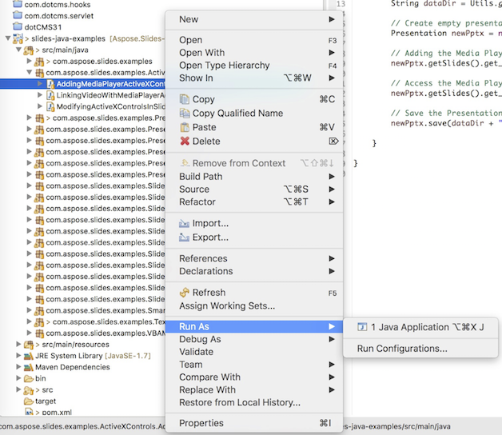

## **Ladda ner Aspose.Slides från GitHub**
Alla exempel för Aspose.Slides för Java finns på [GitHub](https://github.com/aspose-slides/Aspose.Slides-for-Java). Du kan antingen klona arkivet med din favorit‑GitHub‑klient eller ladda ner ZIP‑filen från [här](https://codeload.github.com/aspose-slides/Aspose.Slides-for-Java/zip/master).

Extrahera innehållet i ZIP‑filen till valfri mapp på din dator. Alla exempel finns i mappen **Examples**.


## **Importera exempel till IDE:n**
Projektet använder Maven‑byggsystemet. Alla moderna IDE:er kan enkelt öppna eller importera projektet och dess beroenden. Nedan visar vi hur du använder populära IDE:er för att bygga och köra exemplen.

### **IntelliJ IDEA**
Klicka på menyn **File** och välj **Open**. Bläddra till projektmappen och markera filen **pom.xml**.


IDE:n öppnar projektet och laddar ner beroenden automatiskt. Från fliken *Project* bläddrar du till exemplen i mappen **src/main/java**. För att köra ett exempel, högerklicka på filen och välj ”Run ..”, så körs exemplet och utdata visas i den inbyggda konsolutmatningsfönstret.


### **Eclipse**
Klicka på menyn **File** och välj **Import**. Välj **Maven** – Existing Maven Projects.


Bläddra till den mapp du klonade eller laddade ner från GitHub och markera filen **pom.xml**. IDE:n öppnar projektet och laddar ner beroenden automatiskt. Från fliken *Package Explorer* bläddrar du till exemplen i mappen **src/main/java**. För att köra ett exempel, högerklicka på filen och välj **Run As** – **Java Application**, så körs exemplet och utdata visas i den inbyggda konsolutmatningsfönstret.



### **NetBeans**
Klicka på menyn **File** och välj **Open Project**. Bläddra till den mapp du klonade eller laddade ner från GitHub. Ikonen för mappen **Examples** visar att det är ett Maven‑projekt. Markera **Examples** och öppna den.


IDE:n öppnar projektet och laddar ner beroenden automatiskt. Från fliken *Projects* bläddrar du till exemplen i **source packages**. För att köra ett exempel, högerklicka på filen och välj **Run File**, så körs exemplet och utdata visas i den inbyggda konsolutmatningsfönstret.


## **Lägg till Aspose.Slides‑biblioteket i Maven‑lokalarkivet**
När du importerar **Aspose.Slides‑exempel**‑projektet till IDE:n laddar Maven automatiskt ner aspose.slides‑JAR‑filen från [Aspose Maven Repository](https://releases.aspose.com/java/repo/com/aspose/). Om du inte har internetåtkomst kan du manuellt lägga till JAR‑filen i ditt lokala arkiv.

### **mvn install**
Ladda ner [aspose.slides](https://releases.aspose.com/java/repo/com/aspose/aspose-slides/), extrahera den och kopiera filen aspose.slides‑version.jar till någon annanstans, till exempel C‑enheten. Kör följande kommando:

```
mvn install:install-file
    - Dfile=c:\aspose.slides-version.jar
    - DgroupId=com.aspose
    - DartifactId=aspose-slides
    - Dversion={version}
    - Dpackaging=jar
```

Nu är **aspose.slides**‑JAR‑filen kopierad till ditt Maven‑lokalarkiv.

### **pom.xml**
Efter installationen deklarerar du bara **aspose.slides**‑koordinaten i pom.xml. Lägg till följande arkiv i fliken *repositories* och beroende i fliken *dependencies*.

``` xml
<repository>
    <id>AsposeJavaAPI</id>
    <name>Aspose Java API</name>
    <url>https://releases.aspose.com/java/repo/</url>
</repository>

<dependency>
    <groupId>com.aspose</groupId>
    <artifactId>aspose-slides</artifactId>
    <version>26.10</version>
    <classifier>jdk8</classifier>
</dependency>
```

### **Klart**
Bygg projektet, så kan **aspose.slides**‑JAR‑filen hämtas från ditt Maven‑lokalarkiv.

## **Bidra**
Om du vill lägga till eller förbättra ett exempel uppmuntrar vi dig att bidra till projektet. Alla exempel och showcase‑projekt i detta arkiv är öppen källkod och kan fritt användas i dina egna applikationer.

För att bidra kan du grena (fork) arkivet, redigera källkoden och skicka in en Pull Request. Vi kommer att granska ändringarna och inkludera dem i arkivet om de är användbara.