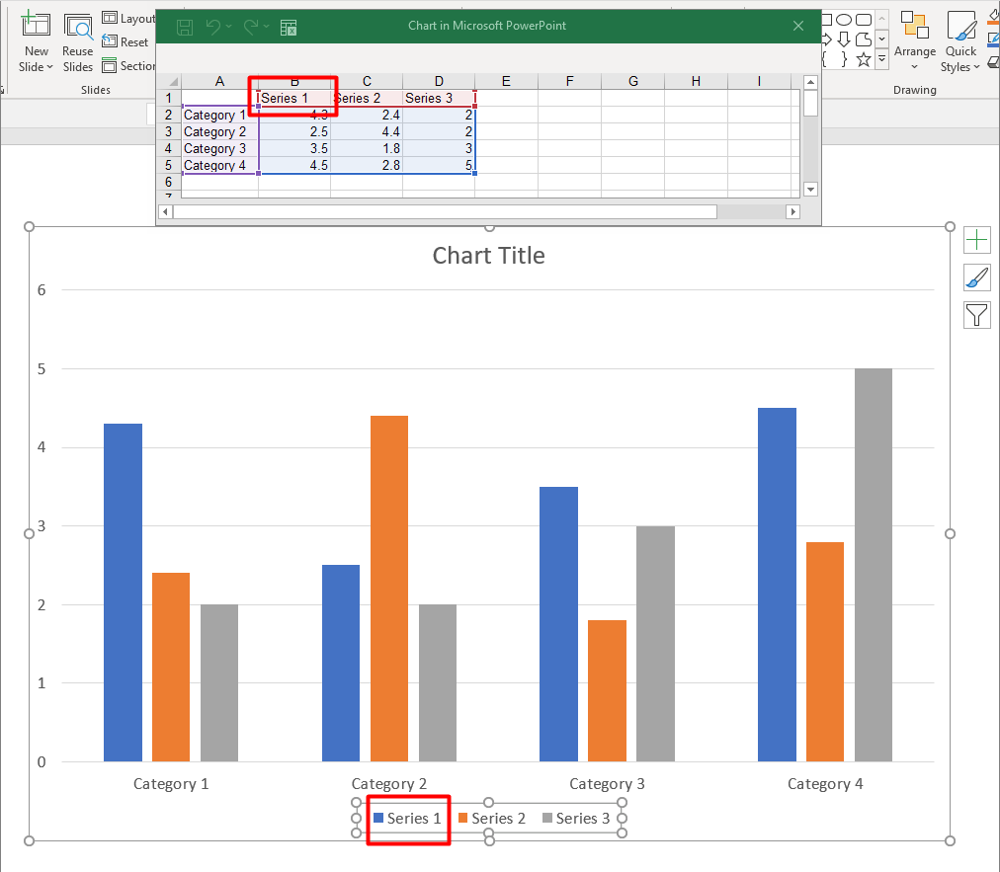
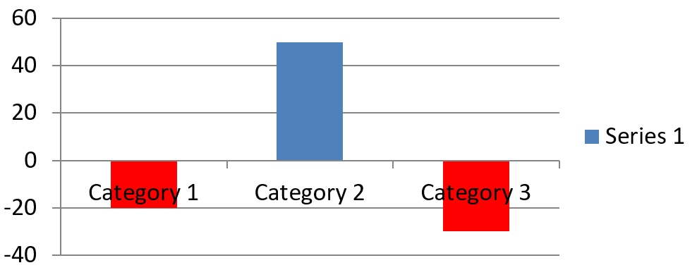

## **Översikt**

Denna artikel beskriver rollen för [ChartSeries](https://reference.aspose.com/slides/sv/net/aspose.slides.charts/chartseries/) i Aspose.Slides för .NET, med fokus på hur data struktureras och visualiseras i presentationer. Dessa objekt tillhandahåller de grundläggande elementen som definierar enskilda uppsättningar av datapunkter, kategorier och visuella parametrar i ett diagram. Genom att arbeta med [ChartSeries](https://reference.aspose.com/slides/sv/net/aspose.slides.charts/chartseries/), kan utvecklare sömlöst integrera underliggande datakällor och behålla full kontroll över hur information visas, vilket resulterar i dynamiska, datadrivna presentationer som tydligt förmedlar insikter och analyser.

En serie är en rad eller kolumn med tal som plottas i ett diagram.



## **Ställ in överlappning för diagramserier**

Egenskapen [IChartSeriesOverlap](https://reference.aspose.com/slides/sv/net/aspose.slides.charts/ichartseries/properties/overlap) styr hur staplar och kolumner överlappar i ett 2D‑diagram genom att ange ett intervall från -100 till 100. Eftersom den här egenskapen är kopplad till seriegruppen snarare än enskilda diagramserier, är den skrivskyddad på serienivå. För att konfigurera överlappningsvärden, använd den läs‑/skrivbara egenskapen `ParentSeriesGroup.Overlap`, som tillämpar den angivna överlappningen på alla serier i den gruppen.

Nedan visas ett C#‑exempel som demonstrerar hur man skapar en presentation, lägger till ett grupperat kolumndiagram, får åtkomst till den första diagramserien, konfigurerar överlappningsinställningen och sedan sparar resultatet som en PPTX‑fil:

```cs
sbyte overlap = 30;

using (Presentation presentation = new Presentation())
{
    ISlide slide = presentation.Slides[0];

    // Lägg till ett grupperat kolumndiagram med standarddata.
    IChart chart = slide.Shapes.AddChart(ChartType.ClusteredColumn, 20, 20, 500, 200);

    IChartSeries series = chart.ChartData.Series[0];
    if (series.Overlap == 0)
    {
        // Ställ in serieröverlappning.
        series.ParentSeriesGroup.Overlap = overlap;
    }

    // Spara presentationsfilen till disk.
    presentation.Save("series_overlap.pptx", SaveFormat.Pptx);
}
```

Resultatet:


## **Ändra fyllningsfärg för serie**

Aspose.Slides gör det enkelt att anpassa fyllningsfärgerna för diagramserier, vilket låter dig markera specifika datapunkter och skapa visuellt tilltalande diagram. Detta uppnås via objektet [IFormat](https://reference.aspose.com/slides/sv/net/aspose.slides.charts/iformat/), som stöder olika fyllningstyper, färgkonfigurationer och andra avancerade stilalternativ. Efter att ha lagt till ett diagram på en bild och fått åtkomst till den önskade serien, hämta helt enkelt serien och tillämpa den lämpliga fyllningsfärgen. Förutom solida fyllningar kan du även utnyttja gradient‑ eller mönsterfyllningar för ökad designflexibilitet. När du har ställt in färgerna enligt dina krav, spara presentationen för att slutföra den uppdaterade utformningen.

Följande C#‑kodexempel visar hur man ändrar färgen på den första serien:

```cs
Color seriesColor = Color.Blue;

using (Presentation presentation = new Presentation())
{
    ISlide slide = presentation.Slides[0];

    // Lägg till ett grupperat kolumndiagram med standarddata.
    IChart chart = slide.Shapes.AddChart(ChartType.ClusteredColumn, 20, 20, 500, 200);

    // Ställ in färgen för den första serien.
    IChartSeries series = chart.ChartData.Series[0];
    series.Format.Fill.FillType = FillType.Solid;
    series.Format.Fill.SolidFillColor.Color = seriesColor;

    // Spara presentationsfilen till disk.
    presentation.Save("series_color.pptx", SaveFormat.Pptx);
}
```

Resultatet:


## **Ändra seriens namn**

Aspose.Slides erbjuder ett enkelt sätt att ändra namnen på diagramserier, vilket gör det lättare att märka data på ett tydligt och meningsfullt sätt. Genom att komma åt den relevanta kalkylblads-cellen i diagramdata kan utvecklare anpassa hur data visas. Denna förändring är särskilt användbar när serienamn måste uppdateras eller förtydligas baserat på dataens kontext. Efter att ha bytt namn på serien kan presentationen sparas för att bevara ändringarna.

Nedan visas ett C#‑kodsnutt som demonstrerar processen i praktiken.

```cs
string seriesName = "New name";

using (Presentation presentation = new Presentation())
{
    ISlide slide = presentation.Slides[0];

    // Lägg till ett grupperat kolumndiagram med standarddata.
    IChart chart = slide.Shapes.AddChart(ChartType.ClusteredColumn, 20, 20, 500, 200);

    // Ställ in namnet på den första serien.
    IChartDataCell seriesCell = chart.ChartData.ChartDataWorkbook.GetCell(0, 0, 1);
    seriesCell.Value = seriesName;

    // Spara presentationsfilen till disk.
    presentation.Save("series_name.pptx", SaveFormat.Pptx);
}
```

Följande C#‑kod visar ett alternativt sätt att ändra seriens namn:

```cs
string seriesName = "New name";

using (Presentation presentation = new Presentation())
{
    ISlide slide = presentation.Slides[0];

    // Lägg till ett grupperat kolumndiagram med standarddata.
    IChart chart = slide.Shapes.AddChart(ChartType.ClusteredColumn, 20, 20, 500, 200);

    // Ställ in namnet på den första serien.
    IChartSeries series = chart.ChartData.Series[0];
    series.Name.AsCells[0].Value = seriesName;

    // Spara presentationsfilen till disk.
    presentation.Save("series_name.pptx", SaveFormat.Pptx);
}
```

Resultatet:


## **Hämta automatisk fyllningsfärg för serie**

Aspose.Slides för .NET låter dig hämta den automatiska fyllningsfärgen för diagramserier inom ett plot‑område. Efter att ha skapat en instans av klassen [Presentation](https://reference.aspose.com/slides/sv/net/aspose.slides/presentation/) kan du få en referens till önskad bild genom dess index, sedan lägga till ett diagram med önskad typ (t.ex. `ChartType.ClusteredColumn`). Genom att komma åt serierna i diagrammet kan du hämta den automatiska fyllningsfärgen.

C#‑koden nedan demonstrerar processen i detalj.

```cs
using (Presentation presentation = new Presentation())
{
    ISlide slide = presentation.Slides[0];

    // Lägg till ett grupperat kolumndiagram med standarddata.
    IChart chart = slide.Shapes.AddChart(ChartType.ClusteredColumn, 20, 20, 500, 200);

    for (int i = 0; i < chart.ChartData.Series.Count; i++)
    {
        // Hämta fyllningsfärgen för serien.
        Color color = chart.ChartData.Series[i].GetAutomaticSeriesColor();
        Console.WriteLine($"Series {i} color: {color.Name}");
    }
}
```

Utdata:
```text
Series 0 color: ff4f81bd
Series 1 color: ffc0504d
Series 2 color: ff9bbb59
```

## **Ställ in inverterad fyllningsfärg för en diagramserie**

När din dataserie innehåller både positiva och negativa värden kan det göra diagrammet svårt att läsa om varje kolumn eller stapel färgas likadant. Aspose.Slides för .NET låter dig tilldela en inverterad fyllningsfärg – en separat fyllning som automatiskt appliceras på datapunkter som ligger under noll – så att negativa värden framträder omedelbart. I det här avsnittet lär du dig hur du aktiverar alternativet, väljer en lämplig färg och sparar den uppdaterade presentationen.

Följande kodexempel demonstrerar operationen:

```cs
Color inverColor = Color.Red;

using (Presentation presentation = new Presentation())
{
    ISlide slide = presentation.Slides[0];

    IChart chart = slide.Shapes.AddChart(ChartType.ClusteredColumn, 20, 20, 500, 200);
    IChartDataWorkbook workBook = chart.ChartData.ChartDataWorkbook;

    chart.ChartData.Series.Clear();
    chart.ChartData.Categories.Clear();

    // Lägg till nya kategorier.
    chart.ChartData.Categories.Add(workBook.GetCell(0, 1, 0, "Category 1"));
    chart.ChartData.Categories.Add(workBook.GetCell(0, 2, 0, "Category 2"));
    chart.ChartData.Categories.Add(workBook.GetCell(0, 3, 0, "Category 3"));

    // Lägg till en ny serie.
    IChartSeries series = chart.ChartData.Series.Add(workBook.GetCell(0, 0, 1, "Series 1"), chart.Type);

    // Fyll i seriedatan.
    series.DataPoints.AddDataPointForBarSeries(workBook.GetCell(0, 1, 1, -20));
    series.DataPoints.AddDataPointForBarSeries(workBook.GetCell(0, 2, 1, 50));
    series.DataPoints.AddDataPointForBarSeries(workBook.GetCell(0, 3, 1, -30));

    // Ställ in färginställningarna för serien.
    var seriesColor = series.GetAutomaticSeriesColor();
    series.InvertIfNegative = true;
    series.Format.Fill.FillType = FillType.Solid;
    series.Format.Fill.SolidFillColor.Color = seriesColor;
    series.InvertedSolidFillColor.Color = inverColor;

    presentation.Save("inverted_solid_fill_color.pptx", SaveFormat.Pptx);
}
```

Resultatet:



Du kan invertera fyllningsfärgen för en enskild datapunkt istället för hela serien. Få helt enkelt åtkomst till det önskade `IChartDataPoint` och sätt dess `InvertIfNegative`‑egenskap till true.

Följande kodexempel visar hur man gör detta:

```cs
using (Presentation presentation = new Presentation())
{
    ISlide slide = presentation.Slides[0];

    IChart chart = slide.Shapes.AddChart(ChartType.ClusteredColumn, 20, 20, 500, 200, true);

    chart.ChartData.Series.Clear();
    IChartSeries series = chart.ChartData.Series.Add(chart.ChartData.ChartDataWorkbook.GetCell(0, "B1"), chart.Type);

    series.DataPoints.AddDataPointForBarSeries(chart.ChartData.ChartDataWorkbook.GetCell(0, "B2", -5));
    series.DataPoints.AddDataPointForBarSeries(chart.ChartData.ChartDataWorkbook.GetCell(0, "B3", 3));
    series.DataPoints.AddDataPointForBarSeries(chart.ChartData.ChartDataWorkbook.GetCell(0, "B4", -3));
    series.DataPoints.AddDataPointForBarSeries(chart.ChartData.ChartDataWorkbook.GetCell(0, "B5", 1));

    // Invertera färgen om datapunkten på index 2 är negativ.
    series.InvertIfNegative = false;
    series.DataPoints[2].InvertIfNegative = true;
                
    presentation.Save("data_point_invert_color_if_negative.pptx", SaveFormat.Pptx);
}
```

## **Rensa specifika datapunktvärden**

Ibland innehåller ett diagram testvärden, avvikande värden eller föråldrade poster som du behöver ta bort utan att bygga om hela serien. Aspose.Slides för .NET låter dig rikta in dig på valfri datapunkt via dess index, rensa dess innehåll och omedelbart uppdatera diagrammet så att de återstående punkterna förskjuts och axlarna skalas om automatiskt.

Följande kodexempel demonstrerar operationen:

```cs
using (Presentation presentation = new Presentation("test_chart.pptx"))
{
    ISlide slide = presentation.Slides[0];
    IChart chart = (IChart)slide.Shapes[0];
    IChartSeries series = chart.ChartData.Series[0];

    foreach (IChartDataPoint dataPoint in series.DataPoints)
    {
        dataPoint.XValue.AsCell.Value = null;
        dataPoint.YValue.AsCell.Value = null;
    }

    series.DataPoints.Clear();

    presentation.Save("clear_data_points.pptx", SaveFormat.Pptx);
}
```

## **Ställ in seriegapets bredd**

Gap‑bredd styr mängden tomt utrymme mellan intilliggande kolumner eller staplar – bredare gap betonar enskilda kategorier, medan smalare gap skapar ett tätare, mer kompakt utseende. Med Aspose.Slides för .NET kan du finjustera denna parameter för en hel serie, vilket ger exakt den visuella balansen din presentation kräver utan att ändra den underliggande datan.

Följande kodexempel visar hur du ställer in gap‑bredden för en serie:

```cs
ushort gapWidth = 30;

// Skapa en tom presentation.
using (Presentation presentation = new Presentation())
{
    // Åtkomst till den första bilden.
    ISlide slide = presentation.Slides[0];

    // Lägg till ett diagram med standarddata.
    IChart chart = slide.Shapes.AddChart(ChartType.StackedColumn, 20, 20, 500, 200);

    // Spara presentationen till disk.
    presentation.Save("default_gap_width.pptx", SaveFormat.Pptx);

    // Ställ in GapWidth‑värdet.
    IChartSeries series = chart.ChartData.Series[0];
    series.ParentSeriesGroup.GapWidth = gapWidth;

    // Spara presentationen till disk.
    presentation.Save("gap_width_30.pptx", SaveFormat.Pptx);
}
```

Resultatet:


## **FAQ**

**Finns det en gräns för hur många serier ett enskilt diagram kan innehålla?**

Aspose.Slides har ingen fast begränsning för antalet serier du lägger till. Den praktiska gränsen bestäms av diagrammets läsbarhet och av det minne som finns tillgängligt för din applikation.

**Vad händer om kolumnerna inom ett kluster är för nära varandra eller för långt ifrån varandra?**

Justera inställningen `GapWidth` för den serien (eller dess överordnade seriegrupp). Att öka värdet breddar avståndet mellan kolumnerna, medan ett lägre värde för minskar avståndet och gör dem närmare varandra.