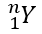

## **Översikt**

PowerPoint lagrar ekvationer som Office Math Markup Language (OMML). Med Aspose.Slides för .NET kan du skapa samma typ av matematiskt innehåll programmässigt: bråktal, rötter, funktioner, gränsvärden, N-ära operatorer, matriser, arrayer och formaterade matematikblock.

I PowerPoint lägger användare normalt till ekvationer via **Insert > Equation**:


Resultatet är redigerbar matematisk text på bilden:


Aspose.Slides bygger den matematiska texten genom tre huvudobjekt:

- En matematisk form, skapad med [AddMathShape](https://reference.aspose.com/slides/sv/net/aspose.slides/ishapecollection/addmathshape/), är den form som innehåller ekvationen.
- [MathPortion](https://reference.aspose.com/slides/sv/net/aspose.slides.mathtext/mathportion/) lagrar matematikinnehåll i formens textruta.
- [MathParagraph](https://reference.aspose.com/slides/sv/net/aspose.slides.mathtext/mathparagraph/) innehåller ett eller flera [MathBlock](https://reference.aspose.com/slides/sv/net/aspose.slides.mathtext/mathblock/)-objekt.

De flesta exempel nedan använder [MathematicalText](https://reference.aspose.com/slides/sv/net/aspose.slides.mathtext/mathematicaltext/) och de flödande metoderna från [IMathElement](https://reference.aspose.com/slides/sv/net/aspose.slides.mathtext/imathelement/) för att hålla koden kort och läsbar.

För MathML-exportscenarier, se [Exportera matematiska ekvationer från presentationer i .NET](/slides/sv/net/exporting-math-equations/).

## **Skapa en ekvation**

Detta exempel skapar en matematisk form och lägger till Pythagoras sats:


```csharp
using var presentation = new Presentation();
var slide = presentation.Slides[0];

var mathShape = slide.Shapes.AddMathShape(20, 20, 700, 120);
var mathParagraph = ((MathPortion)mathShape.TextFrame.Paragraphs[0].Portions[0]).MathParagraph;

var equation = new MathematicalText("c")
    .SetSuperscript("2")
    .Join("=")
    .Join(new MathematicalText("a").SetSuperscript("2"))
    .Join("+")
    .Join(new MathematicalText("b").SetSuperscript("2"));

mathParagraph.Add(equation);

presentation.Save("pythagorean-theorem.pptx", SaveFormat.Pptx);
```

{}
`AddMathShape` skapar en form som redan innehåller ett matematiskt stycke. Få åtkomst till den första `MathPortion`, hämta dess `MathParagraph` och lägg till matematiska block eller matematiska element i den.
{}

## **Lägg till bråk**

Använd `Divide` för att skapa ett bråk. Du kan välja en bråktalsstil med [MathFractionTypes](https://reference.aspose.com/slides/sv/net/aspose.slides.mathtext/mathfractiontypes/).


```csharp
using var presentation = new Presentation();
var slide = presentation.Slides[0];

var mathShape = slide.Shapes.AddMathShape(20, 20, 700, 100);
var mathParagraph = ((MathPortion)mathShape.TextFrame.Paragraphs[0].Portions[0]).MathParagraph;

var fraction = new MathematicalText("1")
    .Divide("x", MathFractionTypes.Skewed);

mathParagraph.Add(new MathBlock(fraction));

presentation.Save("fraction.pptx", SaveFormat.Pptx);
```

För ett staplat bråk, använd `MathFractionTypes.Bar`:

```csharp
var stackedFraction = new MathematicalText("x + 1").Divide("y - 1", MathFractionTypes.Bar);
```

## **Lägg till rötter**

Använd `Radical` för att skapa en kvadratrot, kubrot eller annan rot. Det aktuella elementet blir basen och argumentet blir graden.


```csharp
using var presentation = new Presentation();
var slide = presentation.Slides[0];

var mathShape = slide.Shapes.AddMathShape(20, 20, 700, 100);
var mathParagraph = ((MathPortion)mathShape.TextFrame.Paragraphs[0].Portions[0]).MathParagraph;

var radical = new MathematicalText("x")
    .Radical("n");

mathParagraph.Add(new MathBlock(radical));

presentation.Save("radical.pptx", SaveFormat.Pptx);
```

## **Lägg till funktioner och gränsvärden**

Använd `AsArgumentOfFunction` eller `Function` för funktioner såsom `sin(x)`, `log(x)` eller egna funktionsnamn. För gränsvärden, placera `lim` i en [MathLimit](https://reference.aspose.com/slides/sv/net/aspose.slides.mathtext/mathlimit/) eller använd `SetLowerLimit`.


```csharp
using var presentation = new Presentation();
var slide = presentation.Slides[0];

var mathShape = slide.Shapes.AddMathShape(20, 20, 700, 100);
var mathParagraph = ((MathPortion)mathShape.TextFrame.Paragraphs[0].Portions[0]).MathParagraph;

var limit = new MathematicalText("lim")
    .SetLowerLimit("x→∞")
    .Function("x");

mathParagraph.Add(new MathBlock(limit));

presentation.Save("functions-and-limits.pptx", SaveFormat.Pptx);
```

För ett eget funktionsnamn, gör funktionsnamnet till det aktuella elementet:

```csharp
var customFunction = new MathematicalText("f").Function("x + 1");
```

## **Lägg till N‑ära operatorer och integraler**

Använd `Nary` för summor, unioner, snitt och andra stora operatorer. Använd `Integral` för integraler. Båda metoderna låter dig sätta låg‑ och högre begränsning.


```csharp
using var presentation = new Presentation();
var slide = presentation.Slides[0];

var mathShape = slide.Shapes.AddMathShape(20, 20, 700, 120);
var mathParagraph = ((MathPortion)mathShape.TextFrame.Paragraphs[0].Portions[0]).MathParagraph;

var summationBase = new MathematicalText("x")
    .SetSuperscript("k")
    .Join(new MathematicalText("a").SetSuperscript("n-k"));

var summation = summationBase.Nary(MathNaryOperatorTypes.Summation, "k=0", "n");

mathParagraph.Add(new MathBlock(summation));

presentation.Save("nary-operators.pptx", SaveFormat.Pptx);
```

N‑ära operatorer är för stora operatorer med valfria gränser. Enkla operatorer såsom `+`, `-` och `=` läggs vanligtvis till som `MathematicalText` och förenas i uttrycket.

För en integral, använd `Integral`:

```csharp
var integralBase = new MathematicalText("x").Join(new MathematicalText("dx").ToBox());
var integral = integralBase.Integral(MathIntegralTypes.Simple, "0", "1");
```

## **Lägg till matriser**

Använd [MathMatrix](https://reference.aspose.com/slides/sv/net/aspose.slides.mathtext/mathmatrix/) för rader och kolumner. Matriser inkluderar inte hakparenteser som standard, så omge matrisen med parenteser, hakparenteser eller måsvingar när så behövs.


```csharp
using var presentation = new Presentation();
var slide = presentation.Slides[0];

var mathShape = slide.Shapes.AddMathShape(20, 20, 700, 120);
var mathParagraph = ((MathPortion)mathShape.TextFrame.Paragraphs[0].Portions[0]).MathParagraph;

var matrix = new MathMatrix(2, 3);
matrix[0, 0] = new MathematicalText("1");
matrix[0, 1] = new MathematicalText("x");
matrix[1, 0] = new MathematicalText("x");
matrix[1, 1] = new MathematicalText("2");
matrix[1, 2] = new MathematicalText("y");

mathParagraph.Add(new MathBlock(matrix));

presentation.Save("matrix.pptx", SaveFormat.Pptx);
```

## **Lägg till ekvationsarrayer**

Använd `ToMathArray` när du behöver justerade ekvationer eller en vertikal stapel av uttryck.


```csharp
using var presentation = new Presentation();
var slide = presentation.Slides[0];

var mathShape = slide.Shapes.AddMathShape(20, 20, 700, 140);
var mathParagraph = ((MathPortion)mathShape.TextFrame.Paragraphs[0].Portions[0]).MathParagraph;

var equationArray = new MathematicalText("x")
    .Join("y")
    .ToMathArray();

mathParagraph.Add(new MathBlock(equationArray));

presentation.Save("equation-array.pptx", SaveFormat.Pptx);
```

## **Lägg till trigonometriska funktioner**

Använd `AsArgumentOfFunction` när argumentet är det aktuella elementet och funktionsnamnet är känt.


```csharp
using var presentation = new Presentation();
var slide = presentation.Slides[0];

var mathShape = slide.Shapes.AddMathShape(20, 20, 700, 100);
var mathParagraph = ((MathPortion)mathShape.TextFrame.Paragraphs[0].Portions[0]).MathParagraph;

var cosine = new MathematicalText("2x")
    .AsArgumentOfFunction(MathFunctionsOfOneArgument.Cos);

mathParagraph.Add(new MathBlock(cosine));

presentation.Save("trigonometric-function.pptx", SaveFormat.Pptx);
```

## **Lägg till subskript och superskript**

Använd hjälpmetoderna för subskript och superskript för index och exponenter. När indexen måste visas på vänster sida av basen, använd `SetSubSuperscriptOnTheLeft`.



```csharp
using var presentation = new Presentation();
var slide = presentation.Slides[0];

var mathShape = slide.Shapes.AddMathShape(20, 20, 700, 100);
var mathParagraph = ((MathPortion)mathShape.TextFrame.Paragraphs[0].Portions[0]).MathParagraph;

var scripts = new MathematicalText("Y")
    .SetSubSuperscriptOnTheLeft("1", "n");

mathParagraph.Add(new MathBlock(scripts));

presentation.Save("subscript-superscript.pptx", SaveFormat.Pptx);
```

## **Lägg till avgränsare**

Använd `Enclose` för att placera ett uttryck inom avgränsare. Du kan också ange ett separations­tecken för avgränsare som innehåller flera element.


```csharp
using var presentation = new Presentation();
var slide = presentation.Slides[0];

var mathShape = slide.Shapes.AddMathShape(20, 20, 700, 100);
var mathParagraph = ((MathPortion)mathShape.TextFrame.Paragraphs[0].Portions[0]).MathParagraph;

var delimiter = new MathematicalText("x")
    .Join("y")
    .Join("z")
    .Enclose('<', '>');
delimiter.SeparatorCharacter = '|';

mathParagraph.Add(new MathBlock(delimiter));

presentation.Save("delimiters.pptx", SaveFormat.Pptx);
```

## **Lägg till en ramruta**

Använd `ToBorderBox` när själva ekvationen ska omges av en ram.


```csharp
using var presentation = new Presentation();
var slide = presentation.Slides[0];

var mathShape = slide.Shapes.AddMathShape(20, 20, 700, 100);
var mathParagraph = ((MathPortion)mathShape.TextFrame.Paragraphs[0].Portions[0]).MathParagraph;

var boxedEquation = new MathematicalText("a")
    .SetSuperscript("2")
    .Join("=")
    .Join(new MathematicalText("b").SetSuperscript("2"))
    .Join("+")
    .Join(new MathematicalText("c").SetSuperscript("2"))
    .ToBorderBox();

mathParagraph.Add(new MathBlock(boxedEquation));

presentation.Save("border-box.pptx", SaveFormat.Pptx);
```

## **Gruppera termer**

Använd `Group` för att placera en grupperingstecken ovanför eller under ett uttryck. Lägg till en gräns för att märka de grupperade termerna.


```csharp
using var presentation = new Presentation();
var slide = presentation.Slides[0];

var mathShape = slide.Shapes.AddMathShape(20, 20, 700, 120);
var mathParagraph = ((MathPortion)mathShape.TextFrame.Paragraphs[0].Portions[0]).MathParagraph;

var grouped = new MathematicalText("x + y")
    .Group('\u23DF', MathTopBotPositions.Bottom, MathTopBotPositions.Top)
    .SetLowerLimit("any text");

mathParagraph.Add(new MathBlock(grouped));

presentation.Save("grouped-terms.pptx", SaveFormat.Pptx);
```

## **Formatera matematiska element**

Använd formateringshjälpmedel endast där de klargör formeln. Till exempel placerar `Overbar` ett streck ovanför ett matematiskt element.


```csharp
using var presentation = new Presentation();
var slide = presentation.Slides[0];

var mathShape = slide.Shapes.AddMathShape(20, 20, 700, 100);
var mathParagraph = ((MathPortion)mathShape.TextFrame.Paragraphs[0].Portions[0]).MathParagraph;

var overbar = new MathematicalText("ABC").Overbar();

mathParagraph.Add(new MathBlock(overbar));

presentation.Save("overbar.pptx", SaveFormat.Pptx);
```

## **Snabbreferens**

| Uppgift | Huvud‑API |
| --- | --- |
| Skapa matematisk text | [MathematicalText](https://reference.aspose.com/slides/sv/net/aspose.slides.mathtext/mathematicaltext/) |
| Kombinera element | [IMathElement.Join](https://reference.aspose.com/slides/sv/net/aspose.slides.mathtext/imathelement/join/) |
| Skapa bråktal | [IMathElement.Divide](https://reference.aspose.com/slides/sv/net/aspose.slides.mathtext/imathelement/divide/) |
| Lägg till superskript eller subskript | [SetSuperscript](https://reference.aspose.com/slides/sv/net/aspose.slides.mathtext/imathelement/setsuperscript/), [SetSubscript](https://reference.aspose.com/slides/sv/net/aspose.slides.mathtext/imathelement/setsubscript/) |
| Lägg till funktioner | [Function](https://reference.aspose.com/slides/sv/net/aspose.slides.mathtext/imathelement/function/), [AsArgumentOfFunction](https://reference.aspose.com/slides/sv/net/aspose.slides.mathtext/imathelement/asargumentoffunction/) |
| Lägg till rötter | [IMathElement.Radical](https://reference.aspose.com/slides/sv/net/aspose.slides.mathtext/imathelement/radical/) |
| Lägg till gränsvärden | [SetLowerLimit](https://reference.aspose.com/slides/sv/net/aspose.slides.mathtext/imathelement/setlowerlimit/), [SetUpperLimit](https://reference.aspose.com/slides/sv/net/aspose.slides.mathtext/imathelement/setupperlimit/) |
| Lägg till vänstersidiga skript | [SetSubSuperscriptOnTheLeft](https://reference.aspose.com/slides/sv/net/aspose.slides.mathtext/imathelement/setsubsuperscriptontheleft/) |
| Lägg till summor och integraler | [Nary](https://reference.aspose.com/slides/sv/net/aspose.slides.mathtext/imathelement/nary/), [Integral](https://reference.aspose.com/slides/sv/net/aspose.slides.mathtext/imathelement/integral/) |
| Lägg till matriser | [MathMatrix](https://reference.aspose.com/slides/sv/net/aspose.slides.mathtext/mathmatrix/) |
| Lägg till ekvationsarrayer | [ToMathArray](https://reference.aspose.com/slides/sv/net/aspose.slides.mathtext/imathelement/tomatharray/) |
| Lägg till avgränsare | [Enclose](https://reference.aspose.com/slides/sv/net/aspose.slides.mathtext/imathelement/enclose/) |
| Lägg till streck och ramar | [Overbar](https://reference.aspose.com/slides/sv/net/aspose.slides.mathtext/imathelement/overbar/), [ToBorderBox](https://reference.aspose.com/slides/sv/net/aspose.slides.mathtext/imathelement/toborderbox/) |
| Gruppera termer | [Group](https://reference.aspose.com/slides/sv/net/aspose.slides.mathtext/imathelement/group/) |

## **FAQ**

**Kan jag redigera en befintlig PowerPoint‑ekvation?**

Ja. Öppna presentationen, hitta formen som innehåller en `MathPortion`, hämta dess `MathParagraph` och uppdatera de matematiska blocken i det stycket.

**Sparas ekvationer som redigerbar PowerPoint‑matematik?**

Ja. När du sparar till PPTX skriver Aspose.Slides ekvationen som redigerbart Office‑matematikinnehåll.

**Kan jag exportera ekvationer till LaTeX?**

Ja. Hämta ekvationens [IMathParagraph](https://reference.aspose.com/slides/sv/net/aspose.slides.mathtext/imathparagraph/) från dess [MathPortion](https://reference.aspose.com/slides/sv/net/aspose.slides.mathtext/mathportion/), och anropa [IMathParagraph.ToLatex](https://reference.aspose.com/slides/sv/net/aspose.slides.mathtext/imathparagraph/tolatex/) för att exportera den direkt. För ett komplett exempel, se [Exportera matematiska ekvationer från presentationer i .NET](/slides/sv/net/exporting-math-equations/#export-math-equations-to-latex).