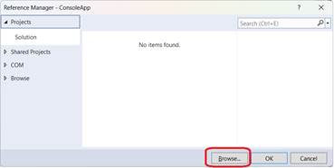

## **Översikt**

Den här artikeln förklarar hur du använder Aspose.Slides för .NET 6 Cross-Platform från ett ZIP‑paket. Den beskriver hur du laddar ner paketet, packar upp filerna från `net6.0/crossplatform`‑mappen, lägger till en referens till `Aspose.Slides.dll` och konfigurerar projektfilen så att de erforderliga beroende biblioteken kopieras till applikationens utmatningskatalog.

Artikeln beskriver också innehållet i cross‑platform‑paketet, inklusive huvud‑Aspose.Slides‑.NET‑assemblyn och plattforms‑specifika grafik‑underdelningsbibliotek för Windows, Linux och macOS.

{}
Aspose.Slides för .NET 6 Cross-Platform finns också tillgänglig från [NuGet](https://www.nuget.org/packages/Aspose.Slides.NET6.CrossPlatform).
{}

## **Använda Cross‑Platform Aspose.Slides från ett ZIP‑paket**

1. Ladda ner ZIP‑paketet med den senaste versionen av Aspose.Slides från [Utsläppsidan](https://releases.aspose.com/slides/sv/net/).

2. Packa upp filerna från *Aspose.Slides.zip\Aspose.Slides\net6.0\crossplatform* och placera dem i den mapp som kommer att användas för beroenden i ditt projekt.

3. Lägg till en referens till Aspose.Slides.dll.

   

   I vårt exempel (nedan) finns biblioteken i projektmappen längs denna sökväg: *ConsoleApp\libs\Aspose.Slides\net6.0\crossplatform\...*

   

4. Placera de återstående filerna (som Aspose.Slides är beroende av) i utmatningskatalogen genom att lägga till instruktioner i csproj‑projektfilen på följande sätt:

```xml
<ItemGroup>

   <None Update="libs\Aspose.Slides\net6.0\crossplatform\aspose.slides.drawing.capi_vc14x64.dll">
         <CopyToOutputDirectory>PreserveNewest</CopyToOutputDirectory>
         <TargetPath>aspose.slides.drawing.capi_vc14x64.dll</TargetPath>
   </None>

   <None Update="libs\Aspose.Slides\net6.0\crossplatform\aspose.slides.drawing.capi_vc14x86.dll">
         <CopyToOutputDirectory>PreserveNewest</CopyToOutputDirectory>
         <TargetPath>aspose.slides.drawing.capi_vc14x86.dll</TargetPath>
   </None>

   <None Update="libs\Aspose.Slides\net6.0\crossplatform\Aspose.Slides.xml">
         <CopyToOutputDirectory>PreserveNewest</CopyToOutputDirectory>
         <TargetPath>Aspose.Slides.xml</TargetPath>
   </None>

   <None Update="libs\Aspose.Slides\net6.0\crossplatform\libaspose.slides.drawing.capi_appleclang_x86_64.dylib">
         <CopyToOutputDirectory>PreserveNewest</CopyToOutputDirectory>
         <TargetPath>libaspose.slides.drawing.capi_appleclang_x86_64.dylib</TargetPath>
   </None>

   <None Update="libs\Aspose.Slides\net6.0\crossplatform\libaspose.slides.drawing.capi_appleclang_arm64.dylib">
         <CopyToOutputDirectory>PreserveNewest</CopyToOutputDirectory>
         <TargetPath>libaspose.slides.drawing.capi_appleclang_arm64.dylib</TargetPath>
   </None>

   <None Update="libs\Aspose.Slides\net6.0\crossplatform\libaspose.slides.drawing.capi_x86_64_libstdcpp_libc2.23.so">
         <CopyToOutputDirectory>PreserveNewest</CopyToOutputDirectory>
         <TargetPath>libaspose.slides.drawing.capi_x86_64_libstdcpp_libc2.23.so</TargetPath>
   </None>

</ItemGroup>
```

5. Observera `TargetPath`.

   Som standard kopierar `<CopyToOutputDirectory>` filer samtidigt som den bevarar deras relativa sökväg, men vi behöver att de beroende biblioteken placeras i samma mapp som utdata genereras (Aspose.Slides.dll‑platsen).

## **Noteringar**

### **Proprietärt grafik‑undersystem**

| Aspose.Slides.dll                                          | Huvudsaklig .NET‑assembly som ansvarar för all Aspose.Slides‑logik |
| ---------------------------------------------------------- | ----------------------------------------------------------------- |
| aspose.slides.drawing.capi_vc14x64.dll                     | Beroende: grafik‑undersystemimplementation för Win x64           |
| aspose.slides.drawing.capi_vc14x86.dll                     | Beroende: grafik‑undersystemimplementation för Win x64           |
| libaspose.slides.drawing.capi_x86_64_libstdcpp_libc2.23.so | Beroende: grafik‑undersystemimplementation för Linux (x86/x64)   |
| libaspose.slides.drawing.capi_appleclang_x86_64.dylib      | Beroende: grafik‑undersystemimplementation för macOS AMD64 (x86-64/x64) |
| libaspose.slides.drawing.capi_appleclang_arm64.dylib       | Beroende: grafik‑undersystemimplementation för macOS ARM64 (AArch64) |

Aspose.Slides.dll använder det bibliotek som systemet den körs på kräver. Biblioteken finns vanligtvis på samma plats som Aspose.Slides.dll i något filsystem.

### **ZIP‑paketstruktur**

ZIP‑paketet innehåller följande mappstruktur:

  Aspose.Slides

  ├─── net6.0

  │  ├─── crossplatform

  │  └─── default

  ├─── net20

  ├─── net462

  └─── netstandard2.0

* Varje mapp innehåller assemblyn för motsvarande .NET‑version. Det finns två versioner för net6.0: default och crossplatform. Den senare innehåller den cross‑platform‑Aspose.Slides.dll och alla dess beroenden. Det uppackade innehållet i den här mappen kan användas som ett beroende i ett projekt för cross‑platform‑utveckling och andra Aspose.Slides‑användningsfall.

## **Se även**

- [Systemkrav](/slides/sv/net/system-requirements/)