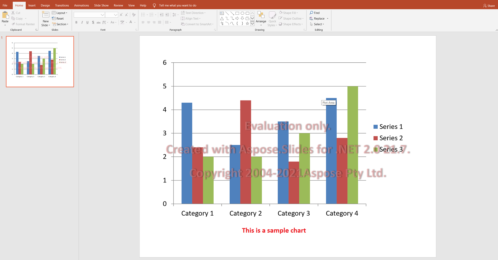

## **Aspose.Slides Utvärdering**

Du kan ladda ner Aspose.Slides för utvärdering. Utvärderingspaketet är detsamma som det köpta paketet; det blir licensierat efter att du har lagt till några kodrader för att tillämpa licensen.

Utan licens ger Aspose.Slides hela sin funktionalitet i utvärderingsläge, med två begränsningar: det lägger till en vattenstämpel‑textruta i varje bild i varje presentation den sparar, och text som din kod läser från en presentation trunkeras till de första tecknen följt av ett meddelande om utvärderingsbegränsningen. Text som din kod skriver sparas i sin helhet.



{}

Om du vill testa Aspose.Slides utan begränsningarna i utvärderingsversionen kan du begära en **30‑dagars tillfällig licens**. Se gärna [How to get a Temporary License?](https://purchase.aspose.com/temporary-license) för mer information.

{}

## **Installera Utvärderingspaketet**

```bash
dotnet add package Aspose.Slides.NET
```

På Linux och macOS kan du istället använda paketet Aspose.Slides.NET6.CrossPlatform; se [Installation](/slides/sv/net/installation/).

## **Tillämpa en Licens**

Detta är de ”några kodraderna” som omvandlar utvärderingspaketet till ett licensierat. Tillämpa licensen en gång vid applikationens start, innan något `Presentation`‑objekt skapas — en presentation som skapats tidigare behåller utvärderingsvattensämpeln.

```csharp
using Aspose.Slides;

var license = new License();
license.SetLicense("Aspose.Slides.NET.lic");
```

`SetLicense` accepterar också en `Stream`, vilket är det bättre alternativet när licensen levereras som en inbäddad resurs snarare än en fil på disk. Om sökvägen är fel eller filen har gått ut kastas ett undantag, så fel visas omedelbart vid start istället för att tyst återgå till utvärderingsläge.

När licensen har tillämpats bär inte sparade presentationer längre vattenstämpeln, och text läses i sin helhet.

## **FAQ**

### Kan jag testa flera presentationer parallellt i olika trådar i utvärderingsläge?

Ja. Du kan bearbeta olika dokument parallellt; du bör inte dela samma presentation‑objekt [across threads](/slides/sv/net/multithreading/). Utvärderingsläge påverkar inte detta.

### Behöver jag installera Microsoft PowerPoint för att utvärdera biblioteket på en server eller i CI?

Nej. Aspose.Slides är en fristående motor och kräver inte att PowerPoint är installerat, varken för utvärdering eller produktion.

### Kan jag fullt ut testa konvertering av PPT/PPTX till PDF och bilder i utvärderingsläge?

Ja. [Converts](/slides/sv/net/convert-presentation/) fungerar; resultatet kommer att innehålla en vattenstämpel.

### Kan jag använda en tillfällig licens för belastningstest utan vattenstämpel?

Ja. En 30‑dagars tillfällig licens tar bort begränsningarna i utvärderingsläget och möjliggör testning utan vattenstämpel.