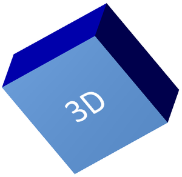

## **Översikt**

Aspose.Slides för Node.js via Java kan skapa, redigera, bevara och rendera PowerPoint‑liknande 3D‑formatering för former och text. Den här artikeln täcker 3D‑effekter såsom rotation, extrusion, avfasningar, belysning, material, gradient‑ eller bildfyllningar samt 3D‑text.

{}
Den här artikeln handlar om 3D‑formateringseffekter på PowerPoint‑former och text. Den handlar inte om att infoga eller redigera fristående 3D‑modelfiler. När du exporterar en bild till en bild, PDF eller HTML renderar Aspose.Slides dessa 3D‑effekter i den exporterade 2D‑utdata.
{}

## **3D‑formateringskoncept**

Använd [Shape](https://reference.aspose.com/slides/sv/nodejs-java/aspose.slides/shape/).`getThreeDFormat()` för att tillämpa 3D‑formatering på en form. Det returnerade [ThreeDFormat](https://reference.aspose.com/slides/sv/nodejs-java/aspose.slides/threedformat/).‑objektet styr 3D‑scenen för den formen.

För text, använd [TextFrameFormat](https://reference.aspose.com/slides/sv/nodejs-java/aspose.slides/textframeformat/).`getThreeDFormat()`. Detta tillämpar 3D‑formatering på textramen istället för formens kropp.

De viktigaste API‑medlemmarna är:

| API‑medlem | Vad den styr | När den ska användas |
|---|---|---|
| [getCamera](https://reference.aspose.com/slides/sv/nodejs-java/aspose.slides/threedformat/#getCamera) | Vypunkt, förinställd kamerasort, rotation, zoom och perspektiv. | Rotera objektet i 3D‑rymden eller matcha en förinställd PowerPoint‑rotationsinställning. |
| [getLightRig](https://reference.aspose.com/slides/sv/nodejs-java/aspose.slides/threedformat/#getLightRig) | Ljusförinställning, riktning och ljusrotation. | Ändra hur högdagrar och skuggor visas på 3D‑ytan. |
| [getMaterial](https://reference.aspose.com/slides/sv/nodejs-java/aspose.slides/threedformat/#getMaterial) och [setMaterial](https://reference.aspose.com/slides/sv/nodejs-java/aspose.slides/threedformat/#setMaterial) | Ytmaterial, t.ex. slätt, matt, plast eller metall. | Få samma geometri att se plattare, mjukare, glansigare eller metallisk ut. |
| [getExtrusionHeight](https://reference.aspose.com/slides/sv/nodejs-java/aspose.slides/threedformat/#getExtrusionHeight) och [setExtrusionHeight](https://reference.aspose.com/slides/sv/nodejs-java/aspose.slides/threedformat/#setExtrusionHeight) | Hur långt formen sträcker sig bakåt från sin framsida. | Omvandla en platt form till ett synligt tjockt 3D‑objekt. |
| [getExtrusionColor](https://reference.aspose.com/slides/sv/nodejs-java/aspose.slides/threedformat/#getExtrusionColor) | Färg på de extruderade sidorna. | Gör djupet synligt eller matcha sidfärgen med framsidans fyllning. |
| [getDepth](https://reference.aspose.com/slides/sv/nodejs-java/aspose.slides/threedformat/#getDepth) och [setDepth](https://reference.aspose.com/slides/sv/nodejs-java/aspose.slides/threedformat/#setDepth) | Ytterligare 3D‑djup som används av PowerPoint‑3D‑formatering. | Finjustera djupet för former eller text, särskilt i kombination med avfasning‑ och materialinställningar. |
| [getBevelTop](https://reference.aspose.com/slides/sv/nodejs-java/aspose.slides/threedformat/#getBevelTop) och [getBevelBottom](https://reference.aspose.com/slides/sv/nodejs-java/aspose.slides/threedformat/#getBevelBottom) | Upphöjda eller avrundade kanter på fram- och baksidan. | Lägg till en mjukad eller formad kant istället för en skarp plan yta. |
| [getContourColor](https://reference.aspose.com/slides/sv/nodejs-java/aspose.slides/threedformat/#getContourColor), [getContourWidth](https://reference.aspose.com/slides/sv/nodejs-java/aspose.slides/threedformat/#getContourWidth) och [setContourWidth](https://reference.aspose.com/slides/sv/nodejs-java/aspose.slides/threedformat/#setContourWidth) | Kontur runt 3D‑objektet. | Betona objektets gräns i den renderade utdata. |

## **Skapa en 3D‑form**

En form behöver vanligtvis fyra typer av inställningar innan den ser övertygande 3D‑ut.

- Kamerainställningar, eftersom standardframvy kan dölja extrusionen.
- Ljusinställningar, eftersom belysning gör ytorna och sidorna läsbara.
- Materialinställningar, eftersom ytan påverkar hur ljuset renderas.
- Extrusion‑ eller djupinställningar, eftersom en platt form behöver tjocklek.

Följande exempel skapar en rektangel, lägger till text på dess framsida, tillämpar 3D‑formatering, sparar presentationen som PPTX och renderar bilden till en PNG‑fil.

```javascript
const imageScale = 2;

const presentation = new aspose.slides.Presentation();
try {
    const slide = presentation.getSlides().get_Item(0);
    const shape = slide.getShapes().addAutoShape(aspose.slides.ShapeType.Rectangle, 200, 150, 200, 200);
    shape.getTextFrame().setText("3D");
    shape.getTextFrame().getParagraphs().get_Item(0).getParagraphFormat().getDefaultPortionFormat().setFontHeight(64);

    const blueColor = java.getStaticFieldValue("java.awt.Color", "BLUE");
    shape.getFillFormat().setFillType(java.newByte(aspose.slides.FillType.Solid));
    shape.getFillFormat().getSolidFillColor().setColor(blueColor);

    shape.getThreeDFormat().getCamera().setCameraType(aspose.slides.CameraPresetType.OrthographicFront);
    shape.getThreeDFormat().getCamera().setRotation(20, 30, 40);
    shape.getThreeDFormat().getLightRig().setLightType(aspose.slides.LightRigPresetType.Flat);
    shape.getThreeDFormat().getLightRig().setDirection(aspose.slides.LightingDirection.Top);
    shape.getThreeDFormat().setMaterial(aspose.slides.MaterialPresetType.Flat);
    shape.getThreeDFormat().setExtrusionHeight(100);
    shape.getThreeDFormat().getExtrusionColor().setColor(blueColor);

    const thumbnail = slide.getImage(imageScale, imageScale);
    try {
        thumbnail.save("shape_3d.png", aspose.slides.ImageFormat.Png);
    } finally {
        thumbnail.dispose();
    }

    presentation.save("shape_3d.pptx", aspose.slides.SaveFormat.Pptx);
} finally {
    presentation.dispose();
}
```

Den renderade bildspelet visar rektangeln som ett tjockt 3D‑block:



## **Rotera en form med kameran**

I PowerPoint konfigureras 3D‑rotation i panelen 3‑D‑rotation. X‑, Y‑ och Z‑rotationsvärdena motsvarar den rotation du anger via kamera‑API:et.


I Aspose.Slides ställer du in kameratyp och rotation via 3D‑formatet som returneras av `shape.getThreeDFormat()`:

```javascript
shape.getThreeDFormat().getCamera().setCameraType(aspose.slides.CameraPresetType.OrthographicFront);
shape.getThreeDFormat().getCamera().setRotation(20, 30, 40);
```

Använd kameran när du behöver ändra hur betraktaren ser objektet. Den ändrar inte 2D‑geometrin för formen på bilden. Den ändrar 3D‑vyn som PowerPoint och Aspose.Slides använder vid rendering.

## **Lägg till extrusion och djup**

Extrusion får en form att se tjock ut genom att sträcka den bakom framsidan. I PowerPoint styr djupkontrollen denna synliga tjocklek, och färgkontrollen anger färgen på sidoytorna.


Ställ in extrusion‑höjden för tjockleken och extrusion‑färgen för sidfärgen:

```javascript
const extrusionColor = java.newInstanceSync("java.awt.Color", 128, 0, 128);

shape.getThreeDFormat().getCamera().setRotation(20, 30, 40);
shape.getThreeDFormat().setExtrusionHeight(100);
shape.getThreeDFormat().getExtrusionColor().setColor(extrusionColor);
```

Använd djupinställningen när du behöver arbeta med PowerPoints djupvärde direkt eller kombinera djup med avfasning, material och texteffekter. I många form‑scenarier är extrusion‑höjden den tydligare inställningen eftersom den tydligt uttrycker den synliga extrusionen.

## **Använd gradient‑ eller bildfyllningar med 3D‑effekter**

3D‑formatering är oberoende av formens fyllning. Du kan applicera en solid färg, gradient, mönster eller bildfyllning på framsidan och ändå använda samma kamera-, ljus-, material- och extrusion‑inställningar.

Detta exempel applicerar en gradientfyllning på formen och en mörkare extrusion‑färg på sidorna:

```javascript
const imageScale = 2;

const presentation = new aspose.slides.Presentation();
try {
    const slide = presentation.getSlides().get_Item(0);
    const shape = slide.getShapes().addAutoShape(aspose.slides.ShapeType.Rectangle, 200, 150, 250, 250);
    shape.getTextFrame().setText("3D Gradient");
    shape.getTextFrame().getParagraphs().get_Item(0).getParagraphFormat().getDefaultPortionFormat().setFontHeight(64);

    const blueColor = java.getStaticFieldValue("java.awt.Color", "BLUE");
    const orangeColor = java.getStaticFieldValue("java.awt.Color", "ORANGE");
    shape.getFillFormat().setFillType(java.newByte(aspose.slides.FillType.Gradient));
    shape.getFillFormat().getGradientFormat().getGradientStops().add(0, blueColor);
    shape.getFillFormat().getGradientFormat().getGradientStops().add(100, orangeColor);

    const darkOrangeColor = java.newInstanceSync("java.awt.Color", 255, 140, 0);
    shape.getThreeDFormat().getCamera().setCameraType(aspose.slides.CameraPresetType.OrthographicFront);
    shape.getThreeDFormat().getCamera().setRotation(10, 20, 30);
    shape.getThreeDFormat().getLightRig().setLightType(aspose.slides.LightRigPresetType.Flat);
    shape.getThreeDFormat().getLightRig().setDirection(aspose.slides.LightingDirection.Top);
    shape.getThreeDFormat().setMaterial(aspose.slides.MaterialPresetType.Flat);
    shape.getThreeDFormat().setExtrusionHeight(150);
    shape.getThreeDFormat().getExtrusionColor().setColor(darkOrangeColor);

    const thumbnail = slide.getImage(imageScale, imageScale);
    try {
        thumbnail.save("gradient_3d.png", aspose.slides.ImageFormat.Png);
    } finally {
        thumbnail.dispose();
    }
} finally {
    presentation.dispose();
}
```

Den renderade utdata behåller gradienten på framsidan och renderar extrusionen separat:


För att använda en bildfyllning istället, lägg till bilden i presentationen och tilldela den till formens fyllning:

```javascript
const sourceImage = aspose.slides.Images.fromFile("image.jpg");
let presentationImage;
try {
    presentationImage = presentation.getImages().addImage(sourceImage);
} finally {
    sourceImage.dispose();
}

shape.getFillFormat().setFillType(java.newByte(aspose.slides.FillType.Picture));
shape.getFillFormat().getPictureFillFormat().getPicture().setImage(presentationImage);
shape.getFillFormat().getPictureFillFormat().setPictureFillMode(aspose.slides.PictureFillMode.Stretch);

const darkOrangeColor = java.newInstanceSync("java.awt.Color", 255, 140, 0);
shape.getThreeDFormat().getCamera().setRotation(10, 20, 30);
shape.getThreeDFormat().setExtrusionHeight(150);
shape.getThreeDFormat().getExtrusionColor().setColor(darkOrangeColor);
```


## **Applicera 3D‑formatering på text**

Formens 3D‑formatering påverkar formens kropp. Textens 3D‑formatering påverkar textramen. Detta är användbart för WordArt‑liknande effekter där bokstäverna själva behöver extrusion, material, belysning och kamerainställningar.

Följande exempel skapar text med en mönsterfyllning, tillämpar en WordArt‑transformering och konfigurerar 3D‑inställningar på [TextFrameFormat](https://reference.aspose.com/slides/sv/nodejs-java/aspose.slides/textframeformat/):

```javascript
const imageScale = 2;

const presentation = new aspose.slides.Presentation();
try {
    const slide = presentation.getSlides().get_Item(0);
    const shape = slide.getShapes().addAutoShape(aspose.slides.ShapeType.Rectangle, 200, 150, 250, 250);
    shape.getFillFormat().setFillType(java.newByte(aspose.slides.FillType.NoFill));
    shape.getLineFormat().getFillFormat().setFillType(java.newByte(aspose.slides.FillType.NoFill));
    shape.getTextFrame().setText("3D Text");

    const portion = shape.getTextFrame().getParagraphs().get_Item(0).getPortions().get_Item(0);
    portion.getPortionFormat().getFillFormat().setFillType(java.newByte(aspose.slides.FillType.Pattern));
    const darkOrangeColor = java.newInstanceSync("java.awt.Color", 255, 140, 0);
    const whiteColor = java.getStaticFieldValue("java.awt.Color", "WHITE");
    portion.getPortionFormat().getFillFormat().getPatternFormat().getForeColor().setColor(darkOrangeColor);
    portion.getPortionFormat().getFillFormat().getPatternFormat().getBackColor().setColor(whiteColor);
    portion.getPortionFormat().getFillFormat().getPatternFormat().setPatternStyle(java.newByte(aspose.slides.PatternStyle.LargeGrid));

    shape.getTextFrame().getParagraphs().get_Item(0).getParagraphFormat().getDefaultPortionFormat().setFontHeight(128);

    const textFrameFormat = shape.getTextFrame().getTextFrameFormat();
    textFrameFormat.setTransform(java.newByte(aspose.slides.TextShapeType.ArchUp));
    textFrameFormat.getThreeDFormat().setExtrusionHeight(3.5);
    textFrameFormat.getThreeDFormat().setDepth(3);
    textFrameFormat.getThreeDFormat().setMaterial(aspose.slides.MaterialPresetType.Plastic);
    textFrameFormat.getThreeDFormat().getLightRig().setDirection(aspose.slides.LightingDirection.Top);
    textFrameFormat.getThreeDFormat().getLightRig().setLightType(aspose.slides.LightRigPresetType.Balanced);
    textFrameFormat.getThreeDFormat().getLightRig().setRotation(0, 0, 40);
    textFrameFormat.getThreeDFormat().getCamera().setCameraType(aspose.slides.CameraPresetType.PerspectiveContrastingRightFacing);

    const thumbnail = slide.getImage(imageScale, imageScale);
    try {
        thumbnail.save("text_3d.png", aspose.slides.ImageFormat.Png);
    } finally {
        thumbnail.dispose();
    }

    presentation.save("text_3d.pptx", aspose.slides.SaveFormat.Pptx);
} finally {
    presentation.dispose();
}
```


## **Export‑ och renderingsbeteende**

Aspose.Slides bevarar 3D‑formatering vid sparande till PowerPoint‑format som PPTX. Vid rendering eller export till fasta layout‑format rasteriseras 3D‑scenen eller ritas in i utdata som ett 2D‑resultat. Detta gäller när du renderar bilder till [PNG](/slides/sv/nodejs-java/convert-powerpoint-to-png/), exporterar till [PDF](/slides/sv/nodejs-java/convert-powerpoint-to-pdf/), exporterar till [HTML](/slides/sv/nodejs-java/convert-powerpoint-to-html/), eller genererar bildrutor för [videokonvertering](/slides/sv/nodejs-java/convert-powerpoint-to-video/).

- Exporterade bilder och PDF‑filer är inte interaktiva. Objektet kan inte roteras av betraktaren efter export.
- Det slutgiltiga utseendet beror på kombinationen av kamera, ljusrigg, material, extrusion, fyllning och bildskalning.
- Om du behöver inspektera ärvda eller temabaserade formateringsvärden, läs [effektiva formegenskaper](/slides/sv/nodejs-java/shape-effective-properties/).
- Vissa utdataformat kan inte lagra redigerbar PowerPoint‑3D‑formatering. I dessa format renderas det visuella resultatet i stället för att bevaras som redigerbara 3D‑inställningar.

## **FAQ**

**Kan Aspose.Slides skapa interaktiva 3D‑presentationer?**

Aspose.Slides skapar och renderar PowerPoint‑3D‑effekter för former och text. Det gör inte exporterade bilder, PDF‑filer eller HTML‑sidor till interaktiva 3D‑scener som en betraktare kan rotera. I PPTX förblir 3D‑formateringen redigerbar i PowerPoint där formatet stödjer det.

**Vad är skillnaden mellan en 3D‑modell och en 3D‑effekt?**

En 3D‑modell är ett separat 3D‑objekt som infogas i en presentation. En 3D‑effekt är formatering som appliceras på en vanlig PowerPoint‑form eller text, såsom rotation, extrusion, avfasning, belysning och material. Denna artikel behandlar 3D‑effekter.

**Vilka inställningar krävs för en synlig 3D‑form?**

Som minimum måste du ställa in en kamerarotation och antingen extrusion eller djup. I praktiken bör du också ställa in en ljusrigg och material så att de renderade ytorna har tydliga högdagrar och skuggor.

**Kan jag applicera 3D‑effekter på både former och text?**

Ja. Använd [Shape](https://reference.aspose.com/slides/sv/nodejs-java/aspose.slides/shape/).`getThreeDFormat()` för formens kropp och [TextFrameFormat](https://reference.aspose.com/slides/sv/nodejs-java/aspose.slides/textframeformat/).`getThreeDFormat()` för text.

**Kommer 3D‑effekter att visas vid export till bilder, PDF, HTML eller videobildrutor?**

Ja. Aspose.Slides renderar 3D‑effekter när den producerar bildspel‑bilder, PDF‑utdata, HTML‑utdata och bildrutor som används för videokonvertering. Den exporterade utdata innehåller den renderade avbildningen, inte ett redigerbart 3D‑objekt.

**Kan jag läsa de slutgiltiga 3D‑värdena efter att arv och temainställningar har tillämpats?**

Ja. Använd de effektiva formaterings‑API:erna som beskrivs i [Shape Effective Properties](/slides/sv/nodejs-java/shape-effective-properties/) för att läsa slutgiltiga kamera‑, ljusrigg‑, avfasnings‑ och relaterade 3D‑värden.