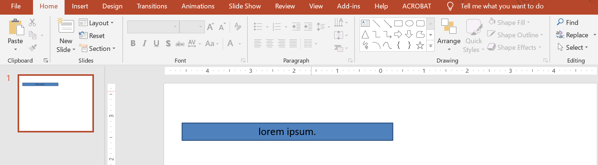

## **Introduktion**

Som standard, när du lägger till en textruta, använder Microsoft PowerPoint inställningen **Resize shape to fix text** för textrutan – den ändrar automatiskt storlek på textrutan för att säkerställa att dess text alltid får plats i den. 



* När texten i textrutan blir längre eller större, förstorar PowerPoint automatiskt textrutan – ökar dess höjd – för att den ska kunna rymma mer text. 
* När texten i textrutan blir kortare eller mindre, minskar PowerPoint automatiskt textrutan – minskar dess höjd – för att ta bort onödigt utrymme. 

I PowerPoint är detta de 4 viktiga parametrarna eller alternativen som styr autofit‑beteendet för en textruta: 

* **Do not Autofit**
* **Shrink text on overflow**
* **Resize shape to fit text**
* **Wrap text in shape.**


Aspose.Slides för Node.js via Java tillhandahåller liknande alternativ – vissa egenskaper under klassen [TextFrameFormat](https://reference.aspose.com/slides/sv/nodejs-java/aspose.slides/TextFrameFormat) – som låter dig styra autofit‑beteendet för textrutor i presentationer.

## **Resize Shape to Fit Text**

Om du vill att texten i en ruta alltid ska passa i den efter att du har gjort ändringar i texten, måste du använda alternativet **Resize shape to fix text**. För att ange denna inställning, anropa metoden [setAutofitType](https://reference.aspose.com/slides/sv/nodejs-java/aspose.slides/TextFrameFormat#setAutofitType) från klassen [TextFrameFormat](https://reference.aspose.com/slides/sv/nodejs-java/aspose.slides/TextFrameFormat) med värdet `Shape`.


```javascript
var pres = new aspose.slides.Presentation();
try {
    var slide = pres.getSlides().get_Item(0);
    var autoShape = slide.getShapes().addAutoShape(aspose.slides.ShapeType.Rectangle, 30, 30, 350, 100);
    var portion = new aspose.slides.Portion("lorem ipsum...");
    portion.getPortionFormat().getFillFormat().getSolidFillColor().setColor(java.getStaticFieldValue("java.awt.Color", "BLACK"));
    portion.getPortionFormat().getFillFormat().setFillType(java.newByte(aspose.slides.FillType.Solid));
    autoShape.getTextFrame().getParagraphs().get_Item(0).getPortions().add(portion);
    var textFrameFormat = autoShape.getTextFrame().getTextFrameFormat();
    textFrameFormat.setAutofitType(aspose.slides.TextAutofitType.Shape);
    pres.save("Output-presentation.pptx", aspose.slides.SaveFormat.Pptx);
} finally {
    if (pres != null) {
        pres.dispose();
    }
}
```

Om texten blir längre eller större kommer textrutan automatiskt att ändra storlek (öka i höjd) för att säkerställa att all text får plats i den. Om texten blir kortare sker motsatsen. 

## **Do Not Autofit**

Om du vill att en textruta eller form ska behålla sina dimensioner oavsett vilka ändringar som görs i den text den innehåller, måste du använda alternativet **Do not Autofit**. För att ange denna inställning, anropa metoden [setAutofitType](https://reference.aspose.com/slides/sv/nodejs-java/aspose.slides/TextFrameFormat#setAutofitType) från klassen [TextFrameFormat](https://reference.aspose.com/slides/sv/nodejs-java/aspose.slides/TextFrameFormat) med värdet `None`.


```javascript
var pres = new aspose.slides.Presentation();
try {
    var slide = pres.getSlides().get_Item(0);
    var autoShape = slide.getShapes().addAutoShape(aspose.slides.ShapeType.Rectangle, 30, 30, 350, 100);
    var portion = new aspose.slides.Portion("lorem ipsum...");
    portion.getPortionFormat().getFillFormat().getSolidFillColor().setColor(java.getStaticFieldValue("java.awt.Color", "BLACK"));
    portion.getPortionFormat().getFillFormat().setFillType(java.newByte(aspose.slides.FillType.Solid));
    autoShape.getTextFrame().getParagraphs().get_Item(0).getPortions().add(portion);
    var textFrameFormat = autoShape.getTextFrame().getTextFrameFormat();
    textFrameFormat.setAutofitType(aspose.slides.TextAutofitType.None);
    pres.save("Output-presentation.pptx", aspose.slides.SaveFormat.Pptx);
} finally {
    if (pres != null) {
        pres.dispose();
    }
}
```

När texten blir för lång för sin ruta läcker den ut. 

## **Shrink Text on Overflow**

Om en text blir för lång för sin ruta kan du, med alternativet **Shrink text on overflow**, ange att textens storlek och avstånd ska minskas för att få den att passa i rutan. För att ange denna inställning, anropa metoden [setAutofitType](https://reference.aspose.com/slides/sv/nodejs-java/aspose.slides/TextFrameFormat#setAutofitType) från klassen [TextFrameFormat](https://reference.aspose.com/slides/sv/nodejs-java/aspose.slides/TextFrameFormat) med värdet `Normal`.


```javascript
var pres = new aspose.slides.Presentation();
try {
    var slide = pres.getSlides().get_Item(0);
    var autoShape = slide.getShapes().addAutoShape(aspose.slides.ShapeType.Rectangle, 30, 30, 350, 100);
    var portion = new aspose.slides.Portion("lorem ipsum...");
    portion.getPortionFormat().getFillFormat().getSolidFillColor().setColor(java.getStaticFieldValue("java.awt.Color", "BLACK"));
    portion.getPortionFormat().getFillFormat().setFillType(java.newByte(aspose.slides.FillType.Solid));
    autoShape.getTextFrame().getParagraphs().get_Item(0).getPortions().add(portion);
    var textFrameFormat = autoShape.getTextFrame().getTextFrameFormat();
    textFrameFormat.setAutofitType(aspose.slides.TextAutofitType.Normal);
    pres.save("Output-presentation.pptx", aspose.slides.SaveFormat.Pptx);
} finally {
    if (pres != null) {
        pres.dispose();
    }
}
```

{}
När alternativet **Shrink text on overflow** används, tillämpas inställningen endast när texten blir för lång för sin ruta. 
{}

## **Wrap Text**

Om du vill att texten i en form ska radbrytas inom den formen när texten går bortom formens kant (endast bredd), måste du använda parametern **Wrap text in shape**. För att ange denna inställning måste du anropa metoden [setWrapText](https://reference.aspose.com/slides/sv/nodejs-java/aspose.slides/TextFrameFormat#setWrapText) från klassen [TextFrameFormat](https://reference.aspose.com/slides/sv/nodejs-java/aspose.slides/TextFrameFormat) med värdet `true`.

```javascript
var pres = new aspose.slides.Presentation();
try {
    var slide = pres.getSlides().get_Item(0);
    var autoShape = slide.getShapes().addAutoShape(aspose.slides.ShapeType.Rectangle, 30, 30, 350, 100);
    var portion = new aspose.slides.Portion("lorem ipsum...");
    portion.getPortionFormat().getFillFormat().getSolidFillColor().setColor(java.getStaticFieldValue("java.awt.Color", "BLACK"));
    portion.getPortionFormat().getFillFormat().setFillType(java.newByte(aspose.slides.FillType.Solid));
    autoShape.getTextFrame().getParagraphs().get_Item(0).getPortions().add(portion);
    var textFrameFormat = autoShape.getTextFrame().getTextFrameFormat();
    textFrameFormat.setWrapText(aspose.slides.NullableBool.True);
    pres.save("Output-presentation.pptx", aspose.slides.SaveFormat.Pptx);
} finally {
    if (pres != null) {
        pres.dispose();
    }
}
```

{} 
Om du anropar `setWrapText`‑metoden med värdet `False` för en form, så kommer texten som blir längre än formens bredd att fortsätta utanför formens kanter på en enda rad. 
{}

## **FAQ**

**Påverkar textrutans interna marginaler AutoFit?**

Ja. Padding (interna marginaler) minskar det användbara området för text, så AutoFit aktiveras tidigare – fonten krymps eller formen storleksändras tidigare. Kontrollera och justera marginalerna innan du finjusterar AutoFit.

**Hur samverkar AutoFit med manuella och mjuka radbrytningar?**

Tvingade radbrytningar kvarstår, och AutoFit anpassar teckenstorlek och avstånd runt dem. Att ta bort onödiga radbrytningar minskar ofta hur aggressivt AutoFit behöver krympa texten.

**Påverkar ändring av temafont eller fontsubstitution AutoFit‑resultaten?**

Ja. Att ersätta med en font som har andra glyf‑mått förändrar textens bredd/höjd, vilket kan ändra den slutliga teckenstorleken och radbrytningen. Efter någon fontändring eller -substitution bör du kontrollera bildspelet igen.