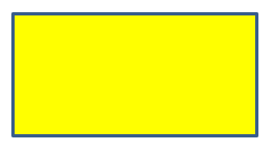

## **Introduktion**

I PowerPoint kan du lägga till former på bilder. Eftersom former består av linjer kan du formatera dem genom att ändra eller applicera effekter på deras konturer. Dessutom kan du formatera former genom att ange inställningar som styr hur deras inre fylls.


Aspose.Slides for Node.js via Java tillhandahåller klasser och metoder som låter dig formatera former med samma alternativ som finns i PowerPoint.

## **Formatera linjer**

Med Aspose.Slides kan du ange en anpassad linjestil för en form. Följande steg beskriver proceduren:

1. Skapa en instans av [Presentation](https://reference.aspose.com/slides/sv/nodejs-java/aspose.slides/presentation/)‑klassen.
1. Hämta en referens till en bild efter dess index.
1. Lägg till en [AutoShape](https://reference.aspose.com/slides/sv/nodejs-java/aspose.slides/autoshape/) på bilden.
1. Ställ in [linjestil](https://reference.aspose.com/slides/sv/nodejs-java/aspose.slides/linestyle/) för formen.
1. Ställ in linjebredden.
1. Ställ in [dashstil](https://reference.aspose.com/slides/sv/nodejs-java/aspose.slides/linedashstyle/) för linjen.
1. Ställ in linjefärgen för formen.
1. Spara den ändrade presentationen som en PPTX‑fil.

Följande kod demonstrerar hur du formaterar en rektangel‑AutoShape:

```js
// Skapa en instans av Presentation-klassen som representerar en presentationsfil.
let presentation = new aspose.slides.Presentation();
try {
    // Hämta den första bilden.
    let slide = presentation.getSlides().get_Item(0);

    // Lägg till en autoform av typen Rektangel.
    let shape = slide.getShapes().addAutoShape(aspose.slides.ShapeType.Rectangle, 50, 150, 150, 75);

    // Ställ in fyllningsfärgen för rektangelformen.
    shape.getFillFormat().setFillType(java.newByte(aspose.slides.FillType.NoFill));

    // Tillämpa formatering på rektangelns linjer.
    shape.getLineFormat().setStyle(java.newByte(aspose.slides.LineStyle.ThickThin));
    shape.getLineFormat().setWidth(7);
    shape.getLineFormat().setDashStyle(java.newByte(aspose.slides.LineDashStyle.Dash));

    // Ställ in färgen för rektangelns linje.
    shape.getLineFormat().getFillFormat().setFillType(java.newByte(aspose.slides.FillType.Solid));
    shape.getLineFormat().getFillFormat().getSolidFillColor().setColor(java.getStaticFieldValue("java.awt.Color", "BLUE"));

    // Spara PPTX-filen till disk.
    presentation.save("formatted_lines.pptx", aspose.slides.SaveFormat.Pptx);
} finally {
    presentation.dispose();
}
```

Resultatet:


## **Formatera anslutningsstilar**

Här är de tre möjliga anslutningstyperna:

* Rund
* Fas
* Avfasning

Som standard använder PowerPoint **Rund** när två linjer förenas i en vinkel (t.ex. vid en forms hörn). Om du däremot ritar en form med skarpa vinklar kan du föredra **Fas**‑alternativet.


Följande JavaScript‑kod visar hur tre rektanglar (som visas på bilden ovan) skapades med respektive Fas-, Avfasning‑ och Rund‑anslutningstyper:

```js
// Skapa en instans av Presentation-klassen som representerar en presentationsfil.
let presentation = new aspose.slides.Presentation();
try {
    // Hämta den första bilden.
    let slide = presentation.getSlides().get_Item(0);

    // Lägg till tre autoformer av typen Rektangel.
    let shape1 = slide.getShapes().addAutoShape(aspose.slides.ShapeType.Rectangle, 20, 20, 150, 75);
    let shape2 = slide.getShapes().addAutoShape(aspose.slides.ShapeType.Rectangle, 210, 20, 150, 75);
    let shape3 = slide.getShapes().addAutoShape(aspose.slides.ShapeType.Rectangle, 20, 135, 150, 75);

    // Ställ in fyllningsfärgen för varje rektangelform.
    shape1.getFillFormat().setFillType(java.newByte(aspose.slides.FillType.Solid));
    shape1.getFillFormat().getSolidFillColor().setColor(java.getStaticFieldValue("java.awt.Color", "BLACK"));
    shape2.getFillFormat().setFillType(java.newByte(aspose.slides.FillType.Solid));
    shape2.getFillFormat().getSolidFillColor().setColor(java.getStaticFieldValue("java.awt.Color", "BLACK"));
    shape3.getFillFormat().setFillType(java.newByte(aspose.slides.FillType.Solid));
    shape3.getFillFormat().getSolidFillColor().setColor(java.getStaticFieldValue("java.awt.Color", "BLACK"));

    // Ställ in linjebredden.
    shape1.getLineFormat().setWidth(15);
    shape2.getLineFormat().setWidth(15);
    shape3.getLineFormat().setWidth(15);

    // Ställ in färgen för varje rektangels linje.
    shape1.getLineFormat().getFillFormat().setFillType(java.newByte(aspose.slides.FillType.Solid));
    shape1.getLineFormat().getFillFormat().getSolidFillColor().setColor(java.getStaticFieldValue("java.awt.Color", "BLUE"));
    shape2.getLineFormat().getFillFormat().setFillType(java.newByte(aspose.slides.FillType.Solid));
    shape2.getLineFormat().getFillFormat().getSolidFillColor().setColor(java.getStaticFieldValue("java.awt.Color", "BLUE"));
    shape3.getLineFormat().getFillFormat().setFillType(java.newByte(aspose.slides.FillType.Solid));
    shape3.getLineFormat().getFillFormat().getSolidFillColor().setColor(java.getStaticFieldValue("java.awt.Color", "BLUE"));

    // Ställ in anslutningsstilen.
    shape1.getLineFormat().setJoinStyle(java.newByte(aspose.slides.LineJoinStyle.Miter));
    shape2.getLineFormat().setJoinStyle(java.newByte(aspose.slides.LineJoinStyle.Bevel));
    shape3.getLineFormat().setJoinStyle(java.newByte(aspose.slides.LineJoinStyle.Round));

    // Lägg till text i varje rektangel.
    shape1.getTextFrame().setText("Miter Join Style");
    shape2.getTextFrame().setText("Bevel Join Style");
    shape3.getTextFrame().setText("Round Join Style");

    // Spara PPTX-filen till disk.
    presentation.save("join_styles.pptx", aspose.slides.SaveFormat.Pptx);
} finally {
    presentation.dispose();
}
```

## **Gradientfyllning**

I PowerPoint är Gradientfyllning ett formateringsalternativ som låter dig applicera en kontinuerlig färgblandning på en form. Till exempel kan du applicera två eller fler färger så att den ena gradvis tonas över i den andra.

Så här applicerar du en gradientfyllning på en form med Aspose.Slides:

1. Skapa en instans av [Presentation](https://reference.aspose.com/slides/sv/nodejs-java/aspose.slides/presentation/)‑klassen.
1. Hämta en referens till en bild efter dess index.
1. Lägg till en [AutoShape](https://reference.aspose.com/slides/sv/nodejs-java/aspose.slides/autoshape/) på bilden.
1. Ställ in formens [FillType](https://reference.aspose.com/slides/sv/nodejs-java/aspose.slides/filltype/) till `Gradient`.
1. Lägg till dina två föredragna färger med definierade positioner med hjälp av `add`‑metoderna i gradientstopp‑samlingen som exponeras av [GradientFormat](https://reference.aspose.com/slides/sv/nodejs-java/aspose.slides/gradientformat/)-klassen.
1. Spara den ändrade presentationen som en PPTX‑fil.

Följande JavaScript‑kod demonstrerar hur du applicerar en gradientfyllning på en ellips:

```js
// Skapa en instans av Presentation-klassen som representerar en presentationsfil.
let presentation = new aspose.slides.Presentation();
try {
    // Hämta den första bilden.
    let slide = presentation.getSlides().get_Item(0);

    // Lägg till en autoform av typen Ellips.
    let shape = slide.getShapes().addAutoShape(aspose.slides.ShapeType.Ellipse, 50, 50, 150, 75);

    // Applicera gradientformatering på ellipsen.
    shape.getFillFormat().setFillType(java.newByte(aspose.slides.FillType.Gradient));
    shape.getFillFormat().getGradientFormat().setGradientShape(java.newByte(aspose.slides.GradientShape.Linear));

    // Ställ in riktningen för gradienten.
    shape.getFillFormat().getGradientFormat().setGradientDirection(aspose.slides.GradientDirection.FromCorner2);

    // Lägg till två gradientstopp.
    shape.getFillFormat().getGradientFormat().getGradientStops().addPresetColor(1.0, aspose.slides.PresetColor.Purple);
    shape.getFillFormat().getGradientFormat().getGradientStops().addPresetColor(0, aspose.slides.PresetColor.Red);

    // Spara PPTX-filen till disk.
    presentation.save("gradient_fill.pptx", aspose.slides.SaveFormat.Pptx);
} finally {
    presentation.dispose();
}
```

Resultatet:


## **Mönsterfyllning**

I PowerPoint är Mönsterfyllning ett formateringsalternativ som låter dig applicera ett tvåfärgsdesign – t.ex. prickar, ränder, korshatch eller schackrutor – på en form. Du kan välja egna färger för mönstrets förgrund och bakgrund.

Aspose.Slides erbjuder över 45 fördefinierade mönsterstilar som du kan applicera på former för att förbättra presentationens visuella intryck. Även efter att ha valt ett fördefinierat mönster kan du ange exakt vilka färger som ska användas.

Så här applicerar du en mönsterfyllning på en form med Aspose.Slides:

1. Skapa en instans av [Presentation](https://reference.aspose.com/slides/sv/nodejs-java/aspose.slides/presentation/)‑klassen.
1. Hämta en referens till en bild efter dess index.
1. Lägg till en [AutoShape](https://reference.aspose.com/slides/sv/nodejs-java/aspose.slides/autoshape/) på bilden.
1. Ställ in formens [FillType](https://reference.aspose.com/slides/sv/nodejs-java/aspose.slides/filltype/) till `Pattern`.
1. Välj en mönsterstil från de fördefinierade alternativen.
1. Ställ in [Background Color](https://reference.aspose.com/slides/sv/nodejs-java/aspose.slides/patternformat/#getBackColor--) för mönstret.
1. Ställ in [Foreground Color](https://reference.aspose.com/slides/sv/nodejs-java/aspose.slides/patternformat/#getForeColor--) för mönstret.
1. Spara den ändrade presentationen som en PPTX‑fil.

Följande JavaScript‑kod demonstrerar hur du applicerar en mönsterfyllning på en rektangel:

```js
// Skapa en instans av Presentation-klassen som representerar en presentationsfil.
let presentation = new aspose.slides.Presentation();
try {
    // Hämta den första bilden.
    let slide = presentation.getSlides().get_Item(0);

    // Lägg till en autoform av typen Rektangel.
    let shape = slide.getShapes().addAutoShape(aspose.slides.ShapeType.Rectangle, 50, 50, 150, 75);

    // Ställ in fyllningstypen till Mönster.
    shape.getFillFormat().setFillType(java.newByte(aspose.slides.FillType.Pattern));

    // Ställ in mönsterstilen.
    shape.getFillFormat().getPatternFormat().setPatternStyle(java.newByte(aspose.slides.PatternStyle.Trellis));

    // Ställ in mönstrets bakgrunds- och förgrundsfärger.
    shape.getFillFormat().getPatternFormat().getBackColor().setColor(java.getStaticFieldValue("java.awt.Color", "LIGHT_GRAY"));
    shape.getFillFormat().getPatternFormat().getForeColor().setColor(java.getStaticFieldValue("java.awt.Color", "YELLOW"));

    // Spara PPTX-filen till disk.
    presentation.save("pattern_fill.pptx", aspose.slides.SaveFormat.Pptx);
} finally {
    presentation.dispose();
}
```

Resultatet:


## **Bildfyllning**

I PowerPoint är Bildfyllning ett formateringsalternativ som låter dig infoga en bild i en form – i praktiken använder du bilden som formens bakgrund.

Så här använder du Aspose.Slides för att applicera en bildfyllning på en form:

1. Skapa en instans av [Presentation](https://reference.aspose.com/slides/sv/nodejs-java/aspose.slides/presentation/)‑klassen.
1. Hämta en referens till en bild efter dess index.
1. Lägg till en [AutoShape](https://reference.aspose.com/slides/sv/nodejs-java/aspose.slides/autoshape/) på bilden.
1. Ställ in formens [FillType](https://reference.aspose.com/slides/sv/nodejs-java/aspose.slides/filltype/) till `Picture`.
1. Ställ in bildfyllningsläget till `Tile` (eller ett annat föredraget läge).
1. Skapa ett [PPImage](https://reference.aspose.com/slides/sv/nodejs-java/aspose.slides/ppimage/)-objekt från den bild du vill använda.
1. Skicka bilden till metoden `ISlidesPicture.setImage`.
1. Spara den ändrade presentationen som en PPTX‑fil.

Anta att vi har en fil “lotus.png” med följande bild:


Följande JavaScript‑kod demonstrerar hur du fyller en form med bilden:

```js
// Skapa en instans av Presentation-klassen som representerar en presentationsfil.
let presentation = new aspose.slides.Presentation();
try {
    // Hämta den första bilden.
    let slide = presentation.getSlides().get_Item(0);

    // Lägg till en autoform av typen Rektangel.
    let shape = slide.getShapes().addAutoShape(aspose.slides.ShapeType.Rectangle, 50, 50, 255, 130);
    
    // Ställ in fyllningstypen till Bild.
    shape.getFillFormat().setFillType(java.newByte(aspose.slides.FillType.Picture));

    // Ställ in bildfyllningsläget.
    shape.getFillFormat().getPictureFillFormat().setPictureFillMode(aspose.slides.PictureFillMode.Tile);

    // Läs in en bild och lägg till den i presentationens resurser.
    let image = aspose.slides.Images.fromFile("lotus.png");
    let picture = presentation.getImages().addImage(image);
    image.dispose();

    // Ställ in bilden.
    shape.getFillFormat().getPictureFillFormat().getPicture().setImage(picture);

    // Spara PPTX-filen till disk.
    presentation.save("picture_fill.pptx", aspose.slides.SaveFormat.Pptx);
} finally {
    presentation.dispose();
}
```

Resultatet:


### **Kakelbild som textur**

Om du vill ange en kakelbild som textur och anpassa kakelns beteende kan du använda följande metoder i klassen [PictureFillFormat](https://reference.aspose.com/slides/sv/nodejs-java/aspose.slides/picturefillformat/):

- [setPictureFillMode](https://reference.aspose.com/slides/sv/nodejs-java/aspose.slides/picturefillformat/#setPictureFillMode): Anger bildfyllningsläget – antingen `Tile` eller `Stretch`.
- [setTileAlignment](https://reference.aspose.com/slides/sv/nodejs-java/aspose.slides/picturefillformat/#setTileAlignment): Specificerar justeringen av kakel inom formen.
- [setTileFlip](https://reference.aspose.com/slides/sv/nodejs-java/aspose.slides/picturefillformat/#setTileFlip): Styr om kaklet vänds horisontellt, vertikalt eller båda.
- [setTileOffsetX](https://reference.aspose.com/slides/sv/nodejs-java/aspose.slides/picturefillformat/#setTileOffsetX): Anger den horisontella förskjutningen av kaklet (i punkter) från formens ursprung.
- [setTileOffsetY](https://reference.aspose.com/slides/sv/nodejs-java/aspose.slides/picturefillformat/#setTileOffsetY): Anger den vertikala förskjutningen av kaklet (i punkter) från formens ursprung.
- [setTileScaleX](https://reference.aspose.com/slides/sv/nodejs-java/aspose.slides/picturefillformat/#setTileScaleX): Definierar den horisontella skalan av kaklet i procent.
- [setTileScaleY](https://reference.aspose.com/slides/sv/nodejs-java/aspose.slides/picturefillformat/#setTileScaleY): Definierar den vertikala skalan av kaklet i procent.

Följande kodexempel visar hur du lägger till en rektangel med kakelbildfyllning och konfigurerar kakelalternativen:

```js
// Skapa en instans av Presentation-klassen som representerar en presentationsfil.
let presentation = new aspose.slides.Presentation();
try {
    // Hämta den första bilden.
    let firstSlide = presentation.getSlides().get_Item(0);

    // Lägg till en rektangulär autoform.
    let shape = firstSlide.getShapes().addAutoShape(aspose.slides.ShapeType.Rectangle, 50, 50, 190, 95);

    // Ställ in fyllningstypen för formen till Bild.
    shape.getFillFormat().setFillType(java.newByte(aspose.slides.FillType.Picture));

    // Läs in bilden och lägg till den i presentationens resurser.
    let sourceImage = aspose.slides.Images.fromFile("lotus.png");
    let presentationImage = presentation.getImages().addImage(sourceImage);
    sourceImage.dispose();

    // Tilldela bilden till formen.
    let pictureFillFormat = shape.getFillFormat().getPictureFillFormat();
    pictureFillFormat.getPicture().setImage(presentationImage);

    // Konfigurera bildfyllningsläget och kaklagegenskaperna.
    pictureFillFormat.setPictureFillMode(aspose.slides.PictureFillMode.Tile);
    pictureFillFormat.setTileOffsetX(-32);
    pictureFillFormat.setTileOffsetY(-32);
    pictureFillFormat.setTileScaleX(50);
    pictureFillFormat.setTileScaleY(50);
    pictureFillFormat.setTileAlignment(java.newByte(aspose.slides.RectangleAlignment.BottomRight));
    pictureFillFormat.setTileFlip(aspose.slides.TileFlip.FlipBoth);

    // Spara PPTX-filen till disk.
    presentation.save("tile.pptx", aspose.slides.SaveFormat.Pptx);
} finally {
    presentation.dispose();
}
```

Resultatet:


## **Enfärgsfyllning**

I PowerPoint är Enfärgsfyllning ett formateringsalternativ som fyller en form med en enda, jämn färg. Denna enkla bakgrundsfärg appliceras utan gradienter, texturer eller mönster.

För att applicera en enfärgsfyllning på en form med Aspose.Slides, följ dessa steg:

1. Skapa en instans av [Presentation](https://reference.aspose.com/slides/sv/nodejs-java/aspose.slides/presentation/)‑klassen.
1. Hämta en referens till en bild efter dess index.
1. Lägg till en [AutoShape](https://reference.aspose.com/slides/sv/nodejs-java/aspose.slides/autoshape/) på bilden.
1. Ställ in formens [FillType](https://reference.aspose.com/slides/sv/nodejs-java/aspose.slides/filltype/) till `Solid`.
1. Tilldela din föredragna fyllningsfärg till formen.
1. Spara den ändrade presentationen som en PPTX‑fil.

Följande JavaScript‑kod demonstrerar hur du applicerar en enfärgsfyllning på en rektangel i en PowerPoint‑bild:

```js
// Skapa en instans av Presentation-klassen som representerar en presentationsfil.
let presentation = new aspose.slides.Presentation();
try {
    // Hämta den första bilden.
    let slide = presentation.getSlides().get_Item(0);

    // Lägg till en autoform av typen Rektangel.
    let shape = slide.getShapes().addAutoShape(aspose.slides.ShapeType.Rectangle, 50, 50, 150, 75);

    // Ställ in fyllningstypen till Solid.
    shape.getFillFormat().setFillType(java.newByte(aspose.slides.FillType.Solid));

    // Ställ in fyllningsfärgen.
    shape.getFillFormat().getSolidFillColor().setColor(java.getStaticFieldValue("java.awt.Color", "YELLOW"));

    // Spara PPTX-filen till disk.
    presentation.save("solid_color_fill.pptx", aspose.slides.SaveFormat.Pptx);
} finally {
    presentation.dispose();
}
```

Resultatet:



## **Ställ in transparens**

I PowerPoint kan du, när du applicerar en enfärgs‑, gradient‑, bild‑ eller texturfyllning på former, också ange en transparensnivå för att kontrollera fyllningens ogenomskinlighet. Ett högre transparensvärde gör formen mer genomskinlig, vilket låter bakgrunden eller underliggande objekt delvis synas.

Aspose.Slides låter dig ange transparensnivån genom att justera alfavärdet i färgen som används för fyllningen. Så här gör du:

1. Skapa en instans av [Presentation](https://reference.aspose.com/slides/sv/nodejs-java/aspose.slides/presentation/)‑klassen.
1. Hämta en referens till en bild efter dess index.
1. Lägg till en [AutoShape](https://reference.aspose.com/slides/sv/nodejs-java/aspose.slides/autoshape/) på bilden.
1. Ställ in [FillType](https://reference.aspose.com/slides/sv/nodejs-java/aspose.slides/filltype/) till `Solid`.
1. Använd `Color` för att definiera en färg med transparens (alfakomponenten styr transparensen).
1. Spara presentationen.

Följande JavaScript‑kod demonstrerar hur du applicerar en transparent fyllningsfärg på en rektangel:

```js
// Skapa en instans av Presentation-klassen som representerar en presentationsfil.
let presentation = new aspose.slides.Presentation();
try {
    // Hämta den första bilden.
    let slide = presentation.getSlides().get_Item(0);

    // Lägg till en solid rektangel-autoform.
    let solidShape = slide.getShapes().addAutoShape(aspose.slides.ShapeType.Rectangle, 50, 50, 150, 75);

    // Lägg till en transparent rektangel-autoform ovanpå den solida formen.
    let transparentShape = slide.getShapes().addAutoShape(aspose.slides.ShapeType.Rectangle, 80, 80, 150, 75);
    transparentShape.getFillFormat().setFillType(java.newByte(aspose.slides.FillType.Solid));
    transparentShape.getFillFormat().getSolidFillColor().setColor(java.newInstanceSync("java.awt.Color", 255, 255, 0, 204));

    // Spara PPTX-filen till disk.
    presentation.save("shape_transparency.pptx", aspose.slides.SaveFormat.Pptx);
} finally {
    presentation.dispose();
}
```

Resultatet:


## **Rotera former**

Aspose.Slides låter dig rotera former i PowerPoint‑presentationer. Detta kan vara användbart när du placerar visuella element med specifik justering eller designbehov.

För att rotera en form på en bild, följ dessa steg:

1. Skapa en instans av [Presentation](https://reference.aspose.com/slides/sv/nodejs-java/aspose.slides/presentation/)‑klassen.
1. Hämta en referens till en bild efter dess index.
1. Lägg till en [AutoShape](https://reference.aspose.com/slides/sv/nodejs-java/aspose.slides/autoshape/) på bilden.
1. Ställ in formens rotations‑egenskap till önskad vinkel.
1. Spara presentationen.

Följande JavaScript‑kod demonstrerar hur du roterar en form med 5 grader:

```js
// Skapa en instans av Presentation-klassen som representerar en presentationsfil.
let presentation = new aspose.slides.Presentation();
try {
    // Hämta den första bilden.
    let slide = presentation.getSlides().get_Item(0);

    // Lägg till en autoform av typen Rektangel.
    let shape = slide.getShapes().addAutoShape(aspose.slides.ShapeType.Rectangle, 50, 50, 150, 75);

    // Rotera formen med 5 grader.
    shape.setRotation(5);

    // Spara PPTX-filen till disk.
    presentation.save("shape_rotation.pptx", aspose.slides.SaveFormat.Pptx);
} finally {
    presentation.dispose();
}
```

Resultatet:


## **Lägg till 3D‑avfasningseffekter**

Aspose.Slides gör det möjligt att applicera 3D‑avfasningseffekter på former genom att konfigurera deras [ThreeDFormat](https://reference.aspose.com/slides/sv/nodejs-java/aspose.slides/threedformat/)-egenskaper.

För att lägga till 3D‑avfasningseffekter på en form, följ dessa steg:

1. Skapa en instans av [Presentation](https://reference.aspose.com/slides/sv/nodejs-java/aspose.slides/presentation/)‑klassen.
1. Hämta en referens till en bild efter dess index.
1. Lägg till en [AutoShape](https://reference.aspose.com/slides/sv/nodejs-java/aspose.slides/autoshape/) på bilden.
1. Konfigurera formens [ThreeDFormat](https://reference.aspose.com/slides/sv/nodejs-java/aspose.slides/threedformat/) för att definiera avfasningsinställningarna.
1. Spara presentationen.

Följande JavaScript‑kod visar hur du applicerar 3D‑avfasningseffekter på en form:

```js
// Skapa en instans av Presentation-klassen.
let presentation = new aspose.slides.Presentation();
try {
    let slide = presentation.getSlides().get_Item(0);

    // Lägg till en form på bilden.
    let shape = slide.getShapes().addAutoShape(aspose.slides.ShapeType.Ellipse, 50, 50, 100, 100);
    shape.getFillFormat().setFillType(java.newByte(aspose.slides.FillType.Solid));
    shape.getFillFormat().getSolidFillColor().setColor(java.getStaticFieldValue("java.awt.Color", "GREEN"));
    shape.getLineFormat().getFillFormat().setFillType(java.newByte(aspose.slides.FillType.Solid));
    shape.getLineFormat().getFillFormat().getSolidFillColor().setColor(java.getStaticFieldValue("java.awt.Color", "ORANGE"));
    shape.getLineFormat().setWidth(2.0);

    // Ställ in formens ThreeDFormat‑egenskaper.
    shape.getThreeDFormat().setDepth(4);
    shape.getThreeDFormat().getBevelTop().setBevelType(aspose.slides.BevelPresetType.Circle);
    shape.getThreeDFormat().getBevelTop().setHeight(6);
    shape.getThreeDFormat().getBevelTop().setWidth(6);
    shape.getThreeDFormat().getCamera().setCameraType(aspose.slides.CameraPresetType.OrthographicFront);
    shape.getThreeDFormat().getLightRig().setLightType(aspose.slides.LightRigPresetType.ThreePt);
    shape.getThreeDFormat().getLightRig().setDirection(aspose.slides.LightingDirection.Top);

    // Spara presentationen som en PPTX‑fil.
    presentation.save("3D_bevel_effect.pptx", aspose.slides.SaveFormat.Pptx);
} finally {
    presentation.dispose();
}
```

Resultatet:


## **Lägg till 3D‑rotationseffekter**

Aspose.Slides tillåter dig att applicera 3D‑rotationseffekter på former genom att konfigurera deras [ThreeDFormat](https://reference.aspose.com/slides/sv/nodejs-java/aspose.slides/threedformat/)-egenskaper.

För att applicera 3D‑rotation på en form:

1. Skapa en instans av [Presentation](https://reference.aspose.com/slides/sv/nodejs-java/aspose.slides/presentation/)‑klassen.
1. Hämta en referens till en bild efter dess index.
1. Lägg till en [AutoShape](https://reference.aspose.com/slides/sv/nodejs-java/aspose.slides/autoshape/) på bilden.
1. Använd [setCameraType](https://reference.aspose.com/slides/sv/nodejs-java/aspose.slides/camera/#setCameraType) och [setLightType](https://reference.aspose.com/slides/sv/nodejs-java/aspose.slides/lightrig/#setLightType) för att definiera 3D‑rotationen.
1. Spara presentationen.

Följande JavaScript‑kod demonstrerar hur du applicerar 3D‑rotationseffekter på en form:

```js
// Skapa en instans av Presentation-klassen.
let presentation = new aspose.slides.Presentation();
try {
    let slide = presentation.getSlides().get_Item(0);

    let autoShape = slide.getShapes().addAutoShape(aspose.slides.ShapeType.Rectangle, 50, 50, 150, 75);
    autoShape.getTextFrame().setText("Hello, Aspose!");

    autoShape.getThreeDFormat().setDepth(6);
    autoShape.getThreeDFormat().getCamera().setRotation(40, 35, 20);
    autoShape.getThreeDFormat().getCamera().setCameraType(aspose.slides.CameraPresetType.IsometricLeftUp);
    autoShape.getThreeDFormat().getLightRig().setLightType(aspose.slides.LightRigPresetType.Balanced);

    // Spara presentationen som en PPTX-fil.
    presentation.save("3D_rotation_effect.pptx", aspose.slides.SaveFormat.Pptx);
} finally {
    presentation.dispose();
}
```

Resultatet:


## **Återställ formatering**

Följande Java‑kod visar hur du återställer formateringen av en bild och återställer position, storlek och formatering för alla former med platshållare på [LayoutSlide](https://reference.aspose.com/slides/sv/nodejs-java/aspose.slides/layoutslide/) till deras standardinställningar:

```js
let presentation = new aspose.slides.Presentation("sample.pptx");
try {
    for (let i = 0; i < presentation.getSlides().size(); i++) {
        let slide = presentation.getSlides().get_Item(i);
        // Återställ varje form på bilden som har en platshållare på layouten.
        slide.reset();
    }
    presentation.save("reset_formatting.pptx", aspose.slides.SaveFormat.Pptx);
} finally {
    presentation.dispose();
}
```

## **Vanliga frågor**

**Påverkar formatering av former den slutliga filstorleken för presentationen?**

Endast marginellt. Inbäddade bilder och media upptar största delen av filutrymmet, medan formparametrar som färger, effekter och gradienter lagras som metadata och bidrar praktiskt taget ingen extra storlek.

**Hur kan jag identifiera former på en bild som har identisk formatering så att jag kan gruppera dem?**

Jämför varje forms nyckelformaterings‑egenskaper – fyllning, linje och effektinställningar. Om alla motsvarande värden matchar, behandla deras stilar som identiska och gruppera logiskt dessa former, vilket förenklar senare stilhantering.

**Kan jag spara en uppsättning anpassade formstilar i en separat fil för återanvändning i andra presentationer?**

Ja. Spara exempelformer med önskade stilar i en mall‑bildsamling eller en *.POTX‑mallfil. När du skapar en ny presentation, öppna mallen, klona de stilade former du behöver och återapplicera deras formatering där det behövs.