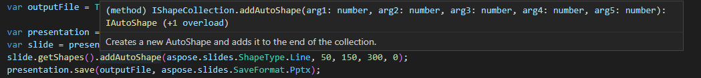

## **Introduktion**

Vi är glada att kunna meddela **inbyggt TypeScript-stöd** för [Aspose.Slides for Node.js via Java](https://www.npmjs.com/package/aspose.slides.via.java)! Denna stora förbättring ger moderna utvecklingsarbetsflöden till PowerPoint‑automatisering i Node.js.

## **Viktiga fördelar**

- **Full API-upptäckbarhet**: Få intelligent kodkomplettering för alla metoder
- **Typ‑säkerhet**: Fånga fel vid kompilering
- **Zero‑config**: Fungerar direkt utan konfiguration med de medföljande `.d.ts`‑definitionerna
- **Java‑paritet**: Alla offentliga metoder från Java‑paketet är korrekt typade

## **Teknisk implementering**

Typdefinitionerna laddas automatiskt via `package.json`:

```json
"types": "lib/aspose.slides.d.ts"
```

## **Utvecklarupplevelse**

### **Före (vanlig JavaScript)**
```javascript
import * as AsposeSlides from 'aspose.slides.via.java';

// Ingen autokomplettering eller typkontroll
const pres = new AsposeSlides.??? // Flyger blint
```

### **Efter (TypeScript)**
```typescript
import * as AsposeSlides from 'aspose.slides.via.java';

const pres = new AsposeSlides.Presentation(); // Full autokomplettering
const slide = pres.getSlides().get_Item(0); // Korrekt metodsignaturer
```

  


## **Komma igång**

1. Uppdatera till den senaste versionen:
```bash
npm install aspose.slides.via.java@latest
```

2. Om du använder TypeScript behövs ingen ytterligare konfiguration!