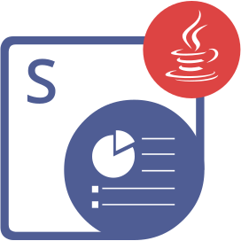

{}

**Välkommen till Aspose.Slides för PHP via Java**

Aspose.Slides för PHP via Java är ett klassbibliotek som gör det möjligt för dina applikationer att läsa och skriva PowerPoint®‑dokument utan att använda Microsoft PowerPoint®.

Aspose.Slides för PHP via Java är den första och enda komponenten som erbjuder funktionalitet för att hantera PowerPoint®‑dokument.

Aspose.Slides för PHP via Java erbjuder många viktiga funktioner, såsom hantering av text, former, tabeller och animationer, samt att lägga till ljud och video på bilder, förhandsgranska bilder, exportera bilder till SVG, PDF‑format och mer.

{}

## Aspose.Slides för PHP via Java‑resurser

{}

Aspose.Slides för PHP via Java är porterat från Aspose.Slides för Java, så du kan använda den senare dokumentationen och API‑referensen.

{}

Här är länkar till användbara resurser:

- [Aspose.Slides för PHP via Java Online-dokumentation](/slides/sv/php-java/)
- [Aspose.Slides för PHP via Java Funktioner](/slides/sv/php-java/features-overview/)
- [Aspose.Slides för PHP via Java Begränsningar och API‑skillnader](/slides/sv/php-java/limitations-and-api-differences/)
- [Aspose.Slides för PHP via Java Versionsanteckningar](https://releases.aspose.com/slides/sv/php-java/release-notes/)
- [Aspose.Slides för PHP via Java Produktsida](https://products.aspose.com/slides/sv/php-java/)
- [Ladda ner Aspose.Slides för PHP via Java‑paketet](https://releases.aspose.com/slides/sv/php-java/)
- [Installera Aspose.Slides för PHP via Java](/slides/sv/php-java/installation/)
- [Aspose.Slides för PHP via Java API‑referens](https://reference.aspose.com/slides/sv/php-java/)
- [Aspose.Slides för PHP via Java Gratis supportforum](https://forum.aspose.com/c/slides/sv/11)
- [Aspose.Slides för PHP via Java Betald supporthelpdesk](https://helpdesk.aspose.com/)