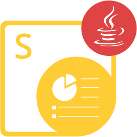

{}

**Välkommen till Aspose.Slides för Python via Java**

Aspose.Slides för Python via Java är ett klassbibliotek som gör det möjligt för dina applikationer att läsa och skriva PowerPoint®-dokument utan att använda Microsoft PowerPoint®.

Aspose.Slides för Python via Java är den första och enda komponenten som tillhandahåller funktionaliteten för att hantera PowerPoint®-dokument.

Aspose.Slides för Python via Java erbjuder många viktiga funktioner såsom hantering av text, former, tabeller och animationer, tillägg av ljud och video till bilder, förhandsgranskning av bilder, export av bilder till SVG, PDF-format och mer.

{}

## Resurser för Aspose.Slides for Python via Java

{}

Aspose.Slides för Python via Java är porterat från Aspose.Slides for Java, så du kan använda den senare dokumentationen och API‑referensen.

{}

Här är länkar till användbara resurser:

- [Aspose.Slides för Python via Java Online-dokumentation](/slides/sv/java/developer-guide/)
- [Aspose.Slides för Python via Java Funktioner](/slides/sv/python-java/features-overview/)
- [Aspose.Slides för Python via Java begränsningar och API‑skillnader](/slides/sv/python-java/limitations-and-api-differences/)
- [Aspose.Slides för Python via Java Versionsanteckningar](https://releases.aspose.com/slides/sv/python-java/release-notes/)
- [Aspose.Slides för Python via Java produktsida](https://products.aspose.com/slides/sv/python-java/)
- [Ladda ner Aspose.Slides för Python via Java paket](https://releases.aspose.com/slides/sv/python-java/)
- [Installera Aspose.Slides för Python via Java](/slides/sv/python-java/installation/)
- [Aspose.Slides för Python via Java API‑referens](https://reference.aspose.com/slides/sv/python-java/)
- [Aspose.Slides för Python via Java gratis supportforum](https://forum.aspose.com/c/slides/sv/11)
- [Aspose.Slides för Python via Java betald support‑helpdesk](https://helpdesk.aspose.com/)