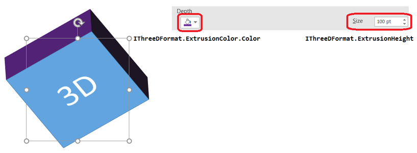

## **Översikt**

Aspose.Slides för Python via Java kan skapa, redigera, bevara och rendera PowerPoint‑liknande 3D‑formatering för former och text. Denna artikel täcker 3D‑effekter såsom rotation, extrusion, avfasningar, belysning, material, gradient‑ eller bildfyllningar samt 3D‑text.

{}
Denna artikel handlar om 3D‑formateringseffekter på PowerPoint‑former och text. Den handlar inte om att infoga eller redigera fristående 3D‑modellfiler. När du exporterar en bildruta till en bild, PDF eller HTML renderar Aspose.Slides dessa 3D‑effekter i den exporterade 2D‑utdata.
{}

Installera paketet enligt [Installation](/slides/sv/python-java/installation/). Varje exempel importerar `asposeslides`, startar JVM vid behov och importerar sedan API‑tjänsterna. Exemplet med bildfyllning kräver en `image.jpg`‑fil i arbetskatalogen.

## **3D‑formateringskoncept**

Använd [Shape.getThreeDFormat](https://reference.aspose.com/slides/sv/python-java/aspose.slides/shape/#getThreeDFormat) för att applicera 3D‑formatering på en form. Det returnerade formatobjektet styr 3D‑scenen för den formen.

För text, använd [TextFrameFormat.getThreeDFormat](https://reference.aspose.com/slides/sv/python-java/aspose.slides/textframeformat/#getThreeDFormat). Detta applicerar 3D‑formatering på textramen istället för på formkroppen.

De viktigaste API‑medlemmarna är:

| API-medlem | Vad den styr | När den ska användas |
|---|---|---|
| [getCamera](https://reference.aspose.com/slides/sv/python-java/aspose.slides/threedformat/#getCamera) | Vy‑punkt, förinställd kameraslag, rotation, zoom och perspektiv. | Rotera objektet i 3D‑rymd eller matcha en PowerPoint‑3D‑rotationsförinställning. |
| [getLightRig](https://reference.aspose.com/slides/sv/python-java/aspose.slides/threedformat/#getLightRig) | Ljusstyrka, riktning och ljusrotation. | Ändra hur högdagrar och skuggor visas på 3D‑ytan. |
| [getMaterial](https://reference.aspose.com/slides/sv/python-java/aspose.slides/threedformat/#getMaterial) och [setMaterial](https://reference.aspose.com/slides/sv/python-java/aspose.slides/threedformat/#setMaterial) | Ytmaterial, t.ex. platt, matt, plast eller metall. | Få samma geometri att se plattare, mjukare, glansigare eller metallisk ut. |
| [getExtrusionHeight](https://reference.aspose.com/slides/sv/python-java/aspose.slides/threedformat/#getExtrusionHeight) och [setExtrusionHeight](https://reference.aspose.com/slides/sv/python-java/aspose.slides/threedformat/#setExtrusionHeight) | Hur långt formen sträcks bakåt från sin främre yta. | Förvandla en platt form till ett tydligt tjockt 3D‑objekt. |
| [getExtrusionColor](https://reference.aspose.com/slides/sv/python-java/aspose.slides/threedformat/#getExtrusionColor) | Färg på de extruderade sidorna. | Gör djupet synligt eller anpassa sidfärgen till frontfyllningen. |
| [getDepth](https://reference.aspose.com/slides/sv/python-java/aspose.slides/threedformat/#getDepth) och [setDepth](https://reference.aspose.com/slides/sv/python-java/aspose.slides/threedformat/#setDepth) | Ytterligare 3D‑djup som används av PowerPoint‑3D‑formatering. | Finjustera djup för former eller text, särskilt i kombination med avfasning och materialinställningar. |
| [getBevelTop](https://reference.aspose.com/slides/sv/python-java/aspose.slides/threedformat/#getBevelTop) och [getBevelBottom](https://reference.aspose.com/slides/sv/python-java/aspose.slides/threedformat/#getBevelBottom) | Höjda eller avrundade kanter på fram‑ och bakytor. | Lägg till en mjukad eller formad kant istället för en skarp platt yta. |
| [getContourColor](https://reference.aspose.com/slides/sv/python-java/aspose.slides/threedformat/#getContourColor), [getContourWidth](https://reference.aspose.com/slides/sv/python-java/aspose.slides/threedformat/#getContourWidth) och [setContourWidth](https://reference.aspose.com/slides/sv/python-java/aspose.slides/threedformat/#setContourWidth) | Kontur runt 3D‑objektet. | Betona objektets gräns i den renderade utdata. |

## **Skapa en 3D‑form**

En form behöver vanligtvis fyra typer av inställningar innan den ser övertygande 3D‑utgående ut:

- Kamerainställningar, eftersom standardframvyn kan dölja extrusionen.
- Ljussättningar, eftersom belysning gör ytor och sidor läsbara.
- Materialinställningar, eftersom ytan påverkar hur ljus renderas.
- Extrusion‑ eller djupinställningar, eftersom en platt form behöver tjocklek.

Följande exempel skapar en rektangel, lägger till text på dess framyta, applicerar 3D‑formatering, sparar presentationen som PPTX och renderar bildrutan till en PNG‑bild.

```python
import jpype
import asposeslides

if not jpype.isJVMStarted():
    jpype.startJVM()

from asposeslides.api import CameraPresetType, FillType, ImageFormat, LightRigPresetType, LightingDirection, MaterialPresetType, Presentation, SaveFormat, ShapeType
from java.awt import Color

image_scale = 2.0

presentation = Presentation()
try:
    slide = presentation.getSlides().get_Item(0)
    shape = slide.getShapes().addAutoShape(ShapeType.Rectangle, 200, 150, 200, 200)
    shape.getTextFrame().setText("3D")
    shape.getTextFrame().getParagraphs().get_Item(0).getParagraphFormat().getDefaultPortionFormat().setFontHeight(64)

    shape.getFillFormat().setFillType(FillType.Solid)
    shape.getFillFormat().getSolidFillColor().setColor(Color.BLUE)

    shape.getThreeDFormat().getCamera().setCameraType(CameraPresetType.OrthographicFront)
    shape.getThreeDFormat().getCamera().setRotation(20, 30, 40)
    shape.getThreeDFormat().getLightRig().setLightType(LightRigPresetType.Flat)
    shape.getThreeDFormat().getLightRig().setDirection(LightingDirection.Top)
    shape.getThreeDFormat().setMaterial(MaterialPresetType.Flat)
    shape.getThreeDFormat().setExtrusionHeight(100)
    shape.getThreeDFormat().getExtrusionColor().setColor(Color.BLUE)

    thumbnail = slide.getImage(image_scale, image_scale)
    try:
        thumbnail.save("shape_3d.png", ImageFormat.Png)
    finally:
        thumbnail.dispose()

    presentation.save("shape_3d.pptx", SaveFormat.Pptx)
finally:
    presentation.dispose()
```

Den renderade bildrutan visar rektangeln som ett tjockt 3D‑block:


## **Rotera en form med kameran**

I PowerPoint konfigureras 3D‑rotationen i panelen 3‑D‑Rotation. Värdena för X, Y och Z‑rotation motsvarar rotationen du ställer in via kamera‑API‑t.


I Aspose.Slides anger du kameraslag och rotation genom 3D‑formatet som returneras av [Shape.getThreeDFormat](https://reference.aspose.com/slides/sv/python-java/aspose.slides/shape/#getThreeDFormat):

```python
import jpype
import asposeslides

if not jpype.isJVMStarted():
    jpype.startJVM()

from asposeslides.api import CameraPresetType, Presentation, ShapeType

presentation = Presentation()
try:
    slide = presentation.getSlides().get_Item(0)
    shape = slide.getShapes().addAutoShape(ShapeType.Rectangle, 200, 150, 200, 200)

    shape.getThreeDFormat().getCamera().setCameraType(CameraPresetType.OrthographicFront)
    shape.getThreeDFormat().getCamera().setRotation(20, 30, 40)
finally:
    presentation.dispose()
```

Använd kameran när du behöver ändra hur betraktaren ser objektet. Det ändrar inte den 2D‑geometri som bilden har på bildrutan. Det ändrar bara 3D‑vy‑punkten som PowerPoint och Aspose.Slides använder vid rendering.

## **Lägg till extrusion och djup**

Extrusion får en form att se tjock ut genom att den sträcks bakom framytan. I PowerPoint styr djupkontrollen denna synliga tjocklek, och färgkontrollen styr färgen på sidoytorna.



Ställ in extrusion‑höjden för tjockleken och extrusion‑färgen för sidofärgen:

```python
import jpype
import asposeslides

if not jpype.isJVMStarted():
    jpype.startJVM()

from asposeslides.api import Presentation, ShapeType
from java.awt import Color

presentation = Presentation()
try:
    slide = presentation.getSlides().get_Item(0)
    shape = slide.getShapes().addAutoShape(ShapeType.Rectangle, 200, 150, 200, 200)

    extrusion_color = Color(128, 0, 128)

    shape.getThreeDFormat().getCamera().setRotation(20, 30, 40)
    shape.getThreeDFormat().setExtrusionHeight(100)
    shape.getThreeDFormat().getExtrusionColor().setColor(extrusion_color)
finally:
    presentation.dispose()
```

Använd djupinställningen när du behöver arbeta direkt med PowerPoints djupvärde eller kombinera djup med avfasning, material och texteffekter. I många situationer är extrusion‑höjden den tydligare inställningen eftersom den direkt uttrycker den synliga extrusionen.

## **Använd gradient‑ eller bildfyllning med 3D‑effekter**

3D‑formatering är oberoende av formens fyllning. Du kan applicera en solid färg, gradient, mönster eller bildfyllning på framytan och ändå använda samma kamera‑, ljus‑, material‑ och extrusion‑inställningar.

Detta exempel applicerar en gradientfyllning på formen och en mörkare extrusion‑färg på sidorna:

```python
import jpype
import asposeslides

if not jpype.isJVMStarted():
    jpype.startJVM()

from asposeslides.api import CameraPresetType, FillType, ImageFormat, LightRigPresetType, LightingDirection, MaterialPresetType, Presentation, ShapeType
from java.awt import Color

image_scale = 2.0

presentation = Presentation()
try:
    slide = presentation.getSlides().get_Item(0)
    shape = slide.getShapes().addAutoShape(ShapeType.Rectangle, 200, 150, 250, 250)
    shape.getTextFrame().setText("3D Gradient")
    shape.getTextFrame().getParagraphs().get_Item(0).getParagraphFormat().getDefaultPortionFormat().setFontHeight(64)

    shape.getFillFormat().setFillType(FillType.Gradient)
    shape.getFillFormat().getGradientFormat().getGradientStops().add(0, Color.BLUE)
    shape.getFillFormat().getGradientFormat().getGradientStops().add(100, Color.ORANGE)

    shape.getThreeDFormat().getCamera().setCameraType(CameraPresetType.OrthographicFront)
    shape.getThreeDFormat().getCamera().setRotation(10, 20, 30)
    shape.getThreeDFormat().getLightRig().setLightType(LightRigPresetType.Flat)
    shape.getThreeDFormat().getLightRig().setDirection(LightingDirection.Top)
    shape.getThreeDFormat().setMaterial(MaterialPresetType.Flat)
    extrusion_color = Color(255, 140, 0)
    shape.getThreeDFormat().setExtrusionHeight(150)
    shape.getThreeDFormat().getExtrusionColor().setColor(extrusion_color)

    thumbnail = slide.getImage(image_scale, image_scale)
    try:
        thumbnail.save("gradient_3d.png", ImageFormat.Png)
    finally:
        thumbnail.dispose()
finally:
    presentation.dispose()
```

Den renderade utdata behåller gradienten på framytan och renderar extrusionen separat:


För att använda en bildfyllning istället, lägg till bilden i presentationen och tilldela den som formens fyllning:

```python
import jpype
import asposeslides

if not jpype.isJVMStarted():
    jpype.startJVM()

from asposeslides.api import FillType, PictureFillMode, Presentation, ShapeType
from java.awt import Color
from pathlib import Path

presentation = Presentation()
try:
    slide = presentation.getSlides().get_Item(0)
    shape = slide.getShapes().addAutoShape(ShapeType.Rectangle, 200, 150, 250, 250)

    image_data = Path("image.jpg").read_bytes()
    java_image_data = jpype.JArray(jpype.JByte)(image_data)
    image = presentation.getImages().addImage(java_image_data)

    shape.getFillFormat().setFillType(FillType.Picture)
    shape.getFillFormat().getPictureFillFormat().getPicture().setImage(image)
    shape.getFillFormat().getPictureFillFormat().setPictureFillMode(PictureFillMode.Stretch)

    extrusion_color = Color(255, 140, 0)
    shape.getThreeDFormat().getCamera().setRotation(10, 20, 30)
    shape.getThreeDFormat().setExtrusionHeight(150)
    shape.getThreeDFormat().getExtrusionColor().setColor(extrusion_color)
finally:
    presentation.dispose()
```

Bilden renderas på framytan, medan extrusionen renderas som 3D‑sidoyta:


## **Applicera 3D‑formatering på text**

Formens 3D‑formatering påverkar formkroppen. Textens 3D‑formatering påverkar textramen. Detta är användbart för WordArt‑liknande effekter där själva bokstäverna behöver extrusion, material, belysning och kamera‑inställningar.

Följande exempel skapar text med en mönsterfyllning, applicerar en WordArt‑transformering och konfigurerar 3D‑inställningar på [TextFrameFormat](https://reference.aspose.com/slides/sv/python-java/aspose.slides/textframeformat/):

```python
import jpype
import asposeslides

if not jpype.isJVMStarted():
    jpype.startJVM()

from asposeslides.api import CameraPresetType, FillType, ImageFormat, LightRigPresetType, LightingDirection, MaterialPresetType, PatternStyle, Presentation, SaveFormat, ShapeType, TextShapeType
from java.awt import Color

image_scale = 2.0

presentation = Presentation()
try:
    slide = presentation.getSlides().get_Item(0)
    shape = slide.getShapes().addAutoShape(ShapeType.Rectangle, 200, 150, 250, 250)
    shape.getFillFormat().setFillType(FillType.NoFill)
    shape.getLineFormat().getFillFormat().setFillType(FillType.NoFill)
    shape.getTextFrame().setText("3D Text")

    portion = shape.getTextFrame().getParagraphs().get_Item(0).getPortions().get_Item(0)
    portion.getPortionFormat().getFillFormat().setFillType(FillType.Pattern)
    pattern_color = Color(255, 140, 0)
    portion.getPortionFormat().getFillFormat().getPatternFormat().getForeColor().setColor(pattern_color)
    portion.getPortionFormat().getFillFormat().getPatternFormat().getBackColor().setColor(Color.WHITE)
    portion.getPortionFormat().getFillFormat().getPatternFormat().setPatternStyle(PatternStyle.LargeGrid)

    shape.getTextFrame().getParagraphs().get_Item(0).getParagraphFormat().getDefaultPortionFormat().setFontHeight(128)

    text_frame_format = shape.getTextFrame().getTextFrameFormat()
    text_frame_format.setTransform(TextShapeType.ArchUp)
    text_frame_format.getThreeDFormat().setExtrusionHeight(3.5)
    text_frame_format.getThreeDFormat().setDepth(3)
    text_frame_format.getThreeDFormat().setMaterial(MaterialPresetType.Plastic)
    text_frame_format.getThreeDFormat().getLightRig().setDirection(LightingDirection.Top)
    text_frame_format.getThreeDFormat().getLightRig().setLightType(LightRigPresetType.Balanced)
    text_frame_format.getThreeDFormat().getLightRig().setRotation(0, 0, 40)
    text_frame_format.getThreeDFormat().getCamera().setCameraType(CameraPresetType.PerspectiveContrastingRightFacing)

    thumbnail = slide.getImage(image_scale, image_scale)
    try:
        thumbnail.save("text_3d.png", ImageFormat.Png)
    finally:
        thumbnail.dispose()

    presentation.save("text_3d.pptx", SaveFormat.Pptx)
finally:
    presentation.dispose()
```

Texten renderas som böjd, extruderad 3D‑bokstav:


## **Export‑ och renderingsbeteende**

Aspose.Slides bevarar 3D‑formatering när du sparar till PowerPoint‑format såsom PPTX. Vid rendering eller export till fix‑layout‑format rasteriseras 3D‑scenen eller ritas in i utdata som ett 2D‑resultat. Detta gäller när du renderar bildrutor till PNG, exporterar till PDF, exporterar till HTML eller genererar bildrutor för videokonvertering.

Kom ihåg följande:

- Exporterade bilder och PDF‑filer är inte interaktiva. Objektet kan inte roteras av betraktaren efter export.
- Slutligt utseende beror på kombinationen av kamera, ljusrigg, material, extrusion, fyllning och bildruteskalning.
- Om du behöver inspektera ärvda eller temabaserade formateringsvärden, använd API‑t för effektiv formatering.
- Vissa exportformat kan inte lagra redigerbar PowerPoint‑3D‑formatering. I dessa format renderas det visuella resultatet i stället för att bevaras som redigerbara 3D‑inställningar.

## **Vanliga frågor**

**Kan Aspose.Slides skapa interaktiva 3D‑presentationer?**

Aspose.Slides skapar och renderar PowerPoint‑3D‑effekter för former och text. Det gör inte exporterade bilder, PDF‑filer eller HTML‑sidor till interaktiva 3D‑scener som en betraktare kan rotera. I PPTX förblir 3D‑formateringen redigerbar i PowerPoint där formatet stödjer det.

**Vad är skillnaden mellan en 3D‑modell och en 3D‑effekt?**

En 3D‑modell är ett separat 3D‑objekt som infogas i en presentation. En 3D‑effekt är formatering som appliceras på en vanlig PowerPoint‑form eller text, såsom rotation, extrusion, avfasning, belysning och material. Denna artikel behandlar 3D‑effekter.

**Vilka inställningar krävs för en synlig 3D‑form?**

Minst en kamera‑rotation och antingen extrusion eller djup måste anges. I praktiken bör även en ljusrigg och material anges så att de renderade ytorna får tydliga högdagrar och skuggor.

**Kan jag applicera 3D‑effekter på både former och text?**

Ja. Använd [Shape.getThreeDFormat](https://reference.aspose.com/slides/sv/python-java/aspose.slides/shape/#getThreeDFormat) för formkroppen och [TextFrameFormat.getThreeDFormat](https://reference.aspose.com/slides/sv/python-java/aspose.slides/textframeformat/#getThreeDFormat) för text.

**Visas 3D‑effekterna när man exporterar till bilder, PDF, HTML eller videobildrutor?**

Ja. Aspose.Slides renderar 3D‑effekter när den producerar bildrutesbilder, PDF‑utdata, HTML‑utdata och bildrutor för videokonvertering. Den exporterade utdata innehåller det renderade utseendet, inte ett redigerbart 3D‑objekt.

**Kan jag läsa de slutgiltiga 3D‑värdena efter arv och temainställningar?**

Ja. Använd [ThreeDFormat.getEffective](https://reference.aspose.com/slides/sv/python-java/aspose.slides/threedformat/#getEffective) för att läsa de slutgiltiga kamera‑, ljusrigg‑, avfasnings‑ och relaterade 3D‑värdena.