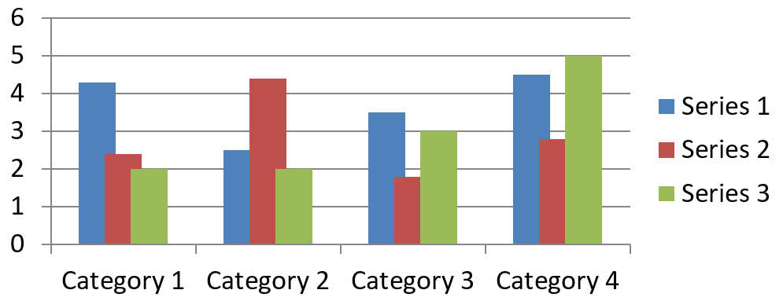

## **Översikt**

Ett diagram lagrar sina plottade data i en diagramdatabok. En [ChartSeries](https://reference.aspose.com/slides/python-java/aspose.slides/chartseries/) representerar en uppsättning relaterade värden, och varje [ChartDataPoint](https://reference.aspose.com/slides/python-java/aspose.slides/chartdatapoint/) i serien hänvisar till en eller flera celler i arbetsboken. [ChartCategory](https://reference.aspose.com/slides/python-java/aspose.slides/chartcategory/)-objekt tillhandahåller etiketter eller grupperingvärden som delas av serierna. Serienamnet, kategorierna och punktvärdena är därför kopplade till [ChartDataCell](https://reference.aspose.com/slides/python-java/aspose.slides/chartdatacell/)‑objekt istället för att enbart lagras som visningstext.

För ett typiskt kategoridiagram använder standardarbetsboken rad 0 för serienamn, kolumn 0 för kategorinamn och de återstående cellerna för serievärden. Arbetsblad, rad‑ och kolumnindex som skickas till [ChartDataWorkbook.getCell](https://reference.aspose.com/slides/python-java/aspose.slides/chartdataworkbook/#getCell) är nollbaserade. Denna layout är användbar när du skapar ett diagram med standarddata, men anta inte att varje befintligt diagram använder den. För en inläst presentation, inspektera cellerna som refereras av serierna, kategorierna och datapunkterna innan du ändrar arbetsbokens värden.

Diagraminställningar har tre olika räckvidder:

- Inställningar på serienivå, såsom [ChartSeries.getFormat](https://reference.aspose.com/slides/python-java/aspose.slides/chartseries/#getFormat), ger standardutseendet för alla punkter i en serie.
- Inställningar för datapunkter, såsom [ChartDataPoint.getFormat](https://reference.aspose.com/slides/python-java/aspose.slides/chartdatapoint/#getFormat), åsidosätter serieutseendet för en punkt.
- Gruppinställningar gäller för kompatibla serier som tillhör samma [ChartSeriesGroup](https://reference.aspose.com/slides/python-java/aspose.slides/chartseriesgroup/). Åtkomst till gruppen sker via [ChartSeries.getParentSeriesGroup](https://reference.aspose.com/slides/python-java/aspose.slides/chartseries/#getParentSeriesGroup) när du behöver ange alternativ som överlappning eller mellanrum.

När ingen explicit punkt‑ eller seriefyllning är angiven bestämmer diagramstilen och temat det automatiska utseendet. När både serie‑ och punktformatering finns, har punktformateringen företräde för den punkten.


## **Ställ in överlappning för diagramserier**

[ChartSeries.getOverlap](https://reference.aspose.com/slides/python-java/aspose.slides/chartseries/#getOverlap) rapporterar hur mycket staplar eller kolumner överlappar i ett 2D‑diagram, från -100 till 100 procent. Det är en skrivskyddad projektion av inställningen på den överordnade seriegruppen. Använd [ChartSeriesGroup.setOverlap](https://reference.aspose.com/slides/python-java/aspose.slides/chartseriesgroup/#setOverlap) för att uppdatera alla kompatibla serier i den gruppen. Detta alternativ gäller för diagramtyper som visar grupperade staplar eller kolumner; det påverkar inte orelaterade seriegrupper i ett kombinationsdiagram.

Följande exempel ställer in överlappningen för gruppen som innehåller den första serien:

```python
import jpype
import asposeslides

if not jpype.isJVMStarted():
    jpype.startJVM()

from asposeslides.api import ChartType, Presentation, SaveFormat

first_slide_index = 0
first_series_index = 0
overlap_percent = 30

presentation = Presentation()
try:
    slide = presentation.getSlides().get_Item(first_slide_index)

        # Det nya diagrammet innehåller exempelserier, kategorier och värden.
        chart = slide.getShapes().addChart(ChartType.ClusteredColumn, 20, 20, 500, 200)

    series = chart.getChartData().getSeries().get_Item(first_series_index)
    series.getParentSeriesGroup().setOverlap(overlap_percent)

    presentation.save("series_overlap.pptx", SaveFormat.Pptx)
finally:
    presentation.dispose()
```

Resultatet:



## **Ändra fyllningsfärg för serien**

Använd [ChartSeries.getFormat](https://reference.aspose.com/slides/python-java/aspose.slides/chartseries/#getFormat) för att ange standardfyllning för en hel serie. Om en punkt redan har en explicit fyllning, åsidosätter dess [ChartDataPoint.getFormat](https://reference.aspose.com/slides/python-java/aspose.slides/chartdatapoint/#getFormat)‑inställning seriefyllningen för den punkten.

Följande exempel tillämpar en solid blå fyllning på den första serien:

```python
import jpype
import asposeslides

if not jpype.isJVMStarted():
    jpype.startJVM()

from asposeslides.api import ChartType, FillType, Presentation, SaveFormat

Color = jpype.JClass("java.awt.Color")

first_slide_index = 0
first_series_index = 0

presentation = Presentation()
try:
    slide = presentation.getSlides().get_Item(first_slide_index)

    chart = slide.getShapes().addChart(ChartType.ClusteredColumn, 20, 20, 500, 200)

    series = chart.getChartData().getSeries().get_Item(first_series_index)
    series.getFormat().getFill().setFillType(FillType.Solid)
    series.getFormat().getFill().getSolidFillColor().setColor(Color.BLUE)

    presentation.save("series_color.pptx", SaveFormat.Pptx)
finally:
    presentation.dispose()
```

Resultatet:


## **Ändra seriens namn**

Ett serienamn lagras i diagramdataboken och visas normalt i förklaringen. I standardarbetsboken som skapas för ett grupperat stapeldiagram är cell B1 på rad 0, kolumn 1 och innehåller namnet på den första serien. De namngivna variablerna i följande exempel gör den strukturen tydlig:

```python
import jpype
import asposeslides

if not jpype.isJVMStarted():
    jpype.startJVM()

from asposeslides.api import ChartType, Presentation, SaveFormat

first_slide_index = 0
worksheet_index = 0
series_name_row_index = 0
first_series_column_index = 1

presentation = Presentation()
try:
    slide = presentation.getSlides().get_Item(first_slide_index)

    chart = slide.getShapes().addChart(ChartType.ClusteredColumn, 20, 20, 500, 200)

    workbook = chart.getChartData().getChartDataWorkbook()
    series_name_cell = workbook.getCell(worksheet_index, series_name_row_index, first_series_column_index)
    series_name_cell.setValue("Revenue")

    presentation.save("series_name.pptx", SaveFormat.Pptx)
finally:
    presentation.dispose()
```

Du kan också uppdatera den cell som redan refereras av [ChartSeries.getName](https://reference.aspose.com/slides/python-java/aspose.slides/chartseries/#getName). Detta tillvägagångssätt undviker att anta en viss rad och kolumn i ett befintligt diagram:

```python
import jpype
import asposeslides

if not jpype.isJVMStarted():
    jpype.startJVM()

from asposeslides.api import ChartType, Presentation, SaveFormat

first_slide_index = 0
first_series_index = 0
first_name_cell_index = 0

presentation = Presentation()
try:
    slide = presentation.getSlides().get_Item(first_slide_index)

    chart = slide.getShapes().addChart(ChartType.ClusteredColumn, 20, 20, 500, 200)

    series = chart.getChartData().getSeries().get_Item(first_series_index)
    series_name_cell = series.getName().getAsCells().get_Item(first_name_cell_index)
    series_name_cell.setValue("Revenue")

    presentation.save("series_name.pptx", SaveFormat.Pptx)
finally:
    presentation.dispose()
```

Resultatet:


### **Skapa en serie med ett namn från flera celler**

Ett sammansatt serienamn är användbart när ett produktnamn och en rapportperiod lagras i separata celler i arbetsboken. Till exempel kan du kombinera `Product A` i B1 och `2026` i C1 till ett enda serienamn samtidigt som båda delarna hålls länkade till sina källceller.

Använd [ChartDataWorkbook.getCellCollection](https://reference.aspose.com/slides/python-java/aspose.slides/chartdataworkbook/#getCellCollection) för att hämta namnintervallet, och skicka sedan den samlingen till [ChartSeriesCollection.add](https://reference.aspose.com/slides/python-java/aspose.slides/chartseriescollection/#add). Argumentet `skipHiddenCells` styr om dolda celler inkluderas: `True` exkluderar dem, medan `False` inkluderar dem. Detta exempel använder `False` för att inkludera varje cell i namnintervallet.

Följande exempel skapar en presentation med en serie och två datapunkter. Cellern B1:C1 tillhandahåller endast serienamnet; A2:A3 tillhandahåller kategorietiketter, och B2:B3 tillhandahåller de numeriska värdena.

```python
import jpype
import asposeslides

if not jpype.isJVMStarted():
    jpype.startJVM()

from asposeslides.api import ChartType, Presentation, SaveFormat

presentation = Presentation()
try:
    slide = presentation.getSlides().get_Item(0)

    chart = slide.getShapes().addChart(ChartType.ClusteredColumn, 50, 50, 620, 180)

    chart.getChartData().getSeries().clear()
    chart.getChartData().getCategories().clear()
    chart.setLegend(True)

    workbook = chart.getChartData().getChartDataWorkbook()
    workbook.clear(0)

    # Dessa två celler anger seriens namn.
    workbook.getCell(0, 0, 1, "Product A")
    workbook.getCell(0, 0, 2, "2026")
    name_cells = workbook.getCellCollection("Sheet1!$B$1:$C$1", False)
    series = chart.getChartData().getSeries().add(name_cells, ChartType.ClusteredColumn)

    # Separata celler anger kategorierna och numeriska datapunkter.
    north_category = workbook.getCell(0, 1, 0, "North")
    south_category = workbook.getCell(0, 2, 0, "South")
    chart.getChartData().getCategories().add(north_category)
    chart.getChartData().getCategories().add(south_category)
    north_value = workbook.getCell(0, 1, 1, jpype.JInt(120))
    south_value = workbook.getCell(0, 2, 1, jpype.JInt(150))
    series.getDataPoints().addDataPointForBarSeries(north_value)
    series.getDataPoints().addDataPointForBarSeries(south_value)

    presentation.save("composite_series_name.pptx", SaveFormat.Pptx)
finally:
    presentation.dispose()
```

Det resulterande serienamnet är `Product A 2026`, med ett mellanslag mellan de två cellvärdena. Legenden visar detta som ett enda inlägg för båda kolumnerna. Bilden nedan illustrerar resultatet:


## **Hämta automatisk fyllningsfärg för serien**

[ChartSeries.getAutomaticSeriesColor](https://reference.aspose.com/slides/python-java/aspose.slides/chartseries/#getAutomaticSeriesColor) returnerar färgen som beräknas från serieindexet och diagramstilen. Detta är färgen som används när seriefyllning inte har definierats explicit. Att anropa metoden läser den beräknade färgen; den tilldelar ingen ny fyllning.

Följande exempel skriver ut den automatiska färgen för varje standardserie:

```python
import jpype
import asposeslides

if not jpype.isJVMStarted():
    jpype.startJVM()

from asposeslides.api import ChartType, Presentation

first_slide_index = 0

presentation = Presentation()
try:
    slide = presentation.getSlides().get_Item(first_slide_index)

    chart = slide.getShapes().addChart(ChartType.ClusteredColumn, 20, 20, 500, 200)

    series_count = chart.getChartData().getSeries().size()
    for series_index in range(series_count):
        series = chart.getChartData().getSeries().get_Item(series_index)
        automatic_color = series.getAutomaticSeriesColor()
        print(f"Series {series_index}: {automatic_color}")
finally:
    presentation.dispose()
```

Exempelutdata för standarddiagramstilen:

```text
Series 0: java.awt.Color[r=79,g=129,b=189]
Series 1: java.awt.Color[r=192,g=80,b=77]
Series 2: java.awt.Color[r=155,g=187,b=89]
```

De exakta färgerna beror på diagramstilen och temat.

## **Ställ in inverterad fyllningsfärg för en diagramserie**

För stapel-, kolumn- och bubbelseerier kan [ChartSeries.setInvertIfNegative](https://reference.aspose.com/slides/python-java/aspose.slides/chartseries/#setInvertIfNegative) visa negativa värden med en annan fyllning. Ställ in den reguljära seriefyllningen till solid, aktivera invertering och tilldela färgen för negativa värden via [ChartSeries.getInvertedSolidFillColor](https://reference.aspose.com/slides/python-java/aspose.slides/chartseries/#getInvertedSolidFillColor). Negativa tal förblir oförändrade i arbetsboken; endast deras displayfärg ändras.

Följande exempel ersätter standarddiagramdata med en serie. Arbetsbladets rad 0 innehåller serienamnet, kolumn 0 innehåller kategorinamnen och kolumn 1 innehåller värdena:

```python
import jpype
import asposeslides

if not jpype.isJVMStarted():
    jpype.startJVM()

from asposeslides.api import ChartType, FillType, Presentation, SaveFormat

Color = jpype.JClass("java.awt.Color")

first_slide_index = 0
worksheet_index = 0
header_row_index = 0
category_column_index = 0
first_series_column_index = 1
first_data_row_index = 1

category_names = ["Category 1", "Category 2", "Category 3"]
series_values = [-20, 50, -30]

presentation = Presentation()
try:
    slide = presentation.getSlides().get_Item(first_slide_index)

    chart = slide.getShapes().addChart(ChartType.ClusteredColumn, 20, 20, 500, 200)
    chart_data = chart.getChartData()
    workbook = chart_data.getChartDataWorkbook()

    chart_data.getSeries().clear()
    chart_data.getCategories().clear()

    series_name_cell = workbook.getCell(worksheet_index, header_row_index, first_series_column_index, "Series 1")
    chart_type = chart.getType()
    series = chart_data.getSeries().add(series_name_cell, chart_type)

    for category_index in range(len(category_names)):
        data_row_index = first_data_row_index + category_index
        category_name = category_names[category_index]
        series_value = series_values[category_index]

        category_cell = workbook.getCell(worksheet_index, data_row_index, category_column_index, category_name)
        chart_data.getCategories().add(category_cell)

        value_cell = workbook.getCell(worksheet_index, data_row_index, first_series_column_index, series_value)
        series.getDataPoints().addDataPointForBarSeries(value_cell)

    automatic_series_color = series.getAutomaticSeriesColor()
    series.getFormat().getFill().setFillType(FillType.Solid)
    series.getFormat().getFill().getSolidFillColor().setColor(automatic_series_color)
    series.setInvertIfNegative(True)
    series.getInvertedSolidFillColor().setColor(Color.RED)

    presentation.save("inverted_solid_fill_color.pptx", SaveFormat.Pptx)
finally:
    presentation.dispose()
```

Resultatet:


Du kan aktivera inversion för en punkt via [ChartDataPoint.setInvertIfNegative](https://reference.aspose.com/slides/python-java/aspose.slides/chartdatapoint/#setInvertIfNegative). I följande exempel är inversion inaktiverad för serien och endast aktiverad för den valda punkten. Punkten tilldelas också ett negativt värde så att effekten blir synlig:

```python
import jpype
import asposeslides

if not jpype.isJVMStarted():
    jpype.startJVM()

from asposeslides.api import ChartType, FillType, Presentation, SaveFormat

Color = jpype.JClass("java.awt.Color")

first_slide_index = 0
first_series_index = 0
target_data_point_index = 2
negative_value = -30

presentation = Presentation()
try:
    slide = presentation.getSlides().get_Item(first_slide_index)

    chart = slide.getShapes().addChart(ChartType.ClusteredColumn, 20, 20, 500, 200)

    series = chart.getChartData().getSeries().get_Item(first_series_index)
    automatic_series_color = series.getAutomaticSeriesColor()
    series.getFormat().getFill().setFillType(FillType.Solid)
    series.getFormat().getFill().getSolidFillColor().setColor(automatic_series_color)
    series.getInvertedSolidFillColor().setColor(Color.RED)
    series.setInvertIfNegative(False)

    data_point = series.getDataPoints().get_Item(target_data_point_index)
    data_point.getValue().getAsCell().setValue(negative_value)
    data_point.setInvertIfNegative(True)

    presentation.save("data_point_invert_color_if_negative.pptx", SaveFormat.Pptx)
finally:
    presentation.dispose()
```

## **Rensa ett specifikt datapunktvärde**

För att göra en punkt tom utan att ta bort de andra punkterna, sätt dess underliggande arbetsboks cell till `None`. För ett stapeldiagram är det plottade värdet tillgängligt via [ChartDataPoint.getValue](https://reference.aspose.com/slides/python-java/aspose.slides/chartdatapoint/#getValue). Datapunkten förblir på samma kategori­position, men diagrammet behandlar dess värde som tomt enligt diagrammets inställningar för tomma värden.

Följande exempel rensar endast den andra punkten i den första serien:

```python
import jpype
import asposeslides

if not jpype.isJVMStarted():
    jpype.startJVM()

from asposeslides.api import ChartType, Presentation, SaveFormat

first_slide_index = 0
first_series_index = 0
target_data_point_index = 1

presentation = Presentation()
try:
    slide = presentation.getSlides().get_Item(first_slide_index)

    chart = slide.getShapes().addChart(ChartType.ClusteredColumn, 20, 20, 500, 200)

    series = chart.getChartData().getSeries().get_Item(first_series_index)
    data_point = series.getDataPoints().get_Item(target_data_point_index)
    data_point.getValue().getAsCell().setValue(None)

    presentation.save("clear_data_point_value.pptx", SaveFormat.Pptx)
finally:
    presentation.dispose()
```

Scatterdiagram använder separata X‑ och Y‑celler, och bubbeldiagram använder även en storlekscell. Rensa endast den cell som representerar det värde du avser att ta bort. Anropa inte [ChartDataPointCollection.clear](https://reference.aspose.com/slides/python-java/aspose.slides/chartdatapointcollection/#clear) när du vill behålla de andra punkterna, eftersom den metoden tar bort varje datapunkt från samlingen.

## **Styr visning av tomma celler**

Dolda celler som innehåller värden är ett separat fall från tomma celler. För att inkludera eller exkludera data från dolda rader och kolumner i arbetsblad, se [Include Data from Hidden Rows and Columns](/slides/sv/python-java/chart-workbook/#include-data-from-hidden-rows-and-columns).

En tom cell i arbetsboken representerar saknad data; en cell som innehåller `0` representerar ett känt numeriskt värde. Anropa [ChartDataCell.setValue](https://reference.aspose.com/slides/python-java/aspose.slides/chartdatacell/#setValue) med `None` för att göra en cell tom. En numerisk nolla förblir en nolla oavsett inställningen för tomma celler.

Använd [Chart.setDisplayBlanksAs](https://reference.aspose.com/slides/python-java/aspose.slides/chart/#setDisplayBlanksAs) för att välja hur diagrammet visar tomma celler. Denna inställning gäller för hela diagrammet. Den ändrar hur tomrum plottas, utan att fylla den tomma arbetsboks‑cellen med noll eller ett interpolerat värde.

Följande fristående exempel skapar ett linjediagram med en serie, rensar värdet för Dag 3 och sparar samma diagram med varje läge. Ingen indatafil krävs. [ChartDataWorkbook](https://reference.aspose.com/slides/python-java/aspose.slides/chartdataworkbook/) använder arbetsblad 0, kolumn 0 för kategorietiketter och kolumn 1 för värden; rad 0 innehåller serienamnet. De slutliga data är `10, 20, empty, 30, 40`.

```python
import jpype
import asposeslides

if not jpype.isJVMStarted():
    jpype.startJVM()

from asposeslides.api import ChartType, DisplayBlanksAsType, Presentation, SaveFormat

presentation = Presentation()
try:
    slide = presentation.getSlides().get_Item(0)

    chart = slide.getShapes().addChart(ChartType.LineWithMarkers, 40, 40, 640, 400)
    chart_data = chart.getChartData()
    workbook = chart_data.getChartDataWorkbook()

    chart_data.getSeries().clear()
    chart_data.getCategories().clear()

    series_name_cell = workbook.getCell(0, 0, 1, "Measurements")
    series = chart_data.getSeries().add(series_name_cell, chart.getType())
    values = [10, 20, 25, 30, 40]

    for i, value in enumerate(values):
        category_cell = workbook.getCell(0, i + 1, 0, f"Day {i + 1}")
        chart_data.getCategories().add(category_cell)
        value_cell = workbook.getCell(0, i + 1, 1, jpype.JInt(value))
        series.getDataPoints().addDataPointForLineSeries(value_cell)

    # Lämna dag 3 tom, men behåll dess kategori och datapunkt.
    workbook.getCell(0, 3, 1).setValue(None)

    modes = [DisplayBlanksAsType.Gap, DisplayBlanksAsType.Zero, DisplayBlanksAsType.Span]
    mode_names = ["Gap", "Zero", "Span"]
    for mode, mode_name in zip(modes, mode_names):
        chart.setDisplayBlanksAs(mode)
        presentation.save(f"empty_cells_{mode_name}.pptx", SaveFormat.Pptx)
finally:
    presentation.dispose()
```

Varje utdatafil lagrar läget som tilldelats innan sparning: `empty_cells_Gap.pptx`, `empty_cells_Zero.pptx` och `empty_cells_Span.pptx`. För att spara endast en version, tilldela önskat läge och spara presentationen en gång istället för att iterera över lägena.

Jämförelsen nedan visar samma data i alla tre filerna. Dag 3 är tom i arbetsboken i varje fall:


Den synliga effekten beror på diagramtypen. Ett linjediagram gör alla tre lägen enkla att jämföra. Stapel- och kolumndiagram har ingen linje att ansluta över en saknad kategori, så `Span` kan inte skapa det anslutna segmentet som visas ovan; en saknad kolumn och en kolumn med nollhöjd kan också se lika ut. På samma sätt har ett scatterdiagram med endast markörer ingen anslutande linje. Förvänta dig inte tre distinkta resultat för varje diagramtyp; kontrollera utdata för den typ du använder.

## **Ställ in gapbredd för serien**

Gapbredd är avståndet mellan intilliggande stapel‑ eller kolumnkluster, uttryckt som en procentandel av stapel‑ eller kolumnbredden. Liksom överlappning tillhör den den överordnade seriegruppen snarare än en enskild serie. Anropa [ChartSeriesGroup.setGapWidth](https://reference.aspose.com/slides/python-java/aspose.slides/chartseriesgroup/#setGapWidth) en gång för gruppen. Ett större värde skapar mer utrymme mellan kluster; ett mindre värde gör dem tätare.

Följande exempel ändrar gapbredden och sparar endast den slutliga presentationen:

```python
import jpype
import asposeslides

if not jpype.isJVMStarted():
    jpype.startJVM()

from asposeslides.api import ChartType, Presentation, SaveFormat

first_slide_index = 0
first_series_index = 0
gap_width_percent = 30

presentation = Presentation()
try:
    slide = presentation.getSlides().get_Item(first_slide_index)

    chart = slide.getShapes().addChart(ChartType.StackedColumn, 20, 20, 500, 200)

    series = chart.getChartData().getSeries().get_Item(first_series_index)
    series.getParentSeriesGroup().setGapWidth(gap_width_percent)

    presentation.save("gap_width_30.pptx", SaveFormat.Pptx)
finally:
    presentation.dispose()
```

Resultatet:


## **Vanliga frågor**

**Vilka diagramtyper stöder dataserier?**

Alla diagramtyper som representeras av [ChartType](https://reference.aspose.com/slides/python-java/aspose.slides/charttype/)‑enumerationen använder diagramdata, men deras serier har inte alla samma värdestruktur eller inställningar. Till exempel använder kategoridiagram kategorier och värden, scatter‑diagram använder X‑ och Y‑värden, och bubbeldiagram lägger till bubbla storlekar. Använd den datapunkt‑skapande metoden som matchar serietypen. Alternativ som överlappning och gapbredd gäller endast för kompatibla stapel‑ eller kolumngrupper.

**Vad är en diagramseriegrupp?**

En [ChartSeriesGroup](https://reference.aspose.com/slides/python-java/aspose.slides/chartseriesgroup/) innehåller kompatibla serier som delar gruppnivåinställningar för plotning. Ett kombinationsdiagram kan innehålla mer än en grupp, så att ändra gruppen som nås via en serie förändrar inte nödvändigtvis varje serie i diagrammet.

**Innehåller ett nyss skapat diagram standarddata?**

Ja. Som standard skapar [ShapeCollection.addChart](https://reference.aspose.com/slides/python-java/aspose.slides/shapecollection/#addChart) exempelserier, kategorier och värden. Du kan redigera dessa celler eller rensa både serie‑ och kategori­samlingarna innan du lägger till ett helt anpassat datamängd. En överlagring kan också skapa ett diagram utan standarddata.

**Hur är diagramobjekt kopplade till celler i arbetsboken?**

Serienamn, kategorietiketter och datapunktvärden refererar till celler i en [ChartDataWorkbook](https://reference.aspose.com/slides/python-java/aspose.slides/chartdataworkbook/). Att ändra en refererad cell uppdaterar motsvarande diagram‑element. När du bygger anpassade data, håll kategorirader och serie‑värderader alignerade så att varje punkt plottas under den avsedda kategorin.

**Hur rensar jag en punkt istället för hela serien?**

Sätt den relevanta värdecellen till `None` för att behålla punktens kategori­position som en tom punkt. Använd [ChartDataPointCollection.clear](https://reference.aspose.com/slides/python-java/aspose.slides/chartdatapointcollection/#clear) endast när du avser att ta bort alla punkter från den serien. Om du också tar bort kategorier, uppdatera varje serie så att deras värden förblir alignerade med kategori­samlingen.

**Hur visas tomma punkter?**

Resultatet beror på diagramtypen och det värde som konfigurerats via [Chart.setDisplayBlanksAs](https://reference.aspose.com/slides/python-java/aspose.slides/chart/#setDisplayBlanksAs). Stödda diagram kan visa tomrum som gap, som nollvärden eller genom att ansluta intilliggande punkter. Välj den inställning som matchar betydelsen av saknad data i din presentation. Se [Styr visning av tomma celler](#control-the-display-of-empty-cells) för ett komplett exempel och visuell jämförelse.

**Hur formateras negativa värden?**

För stödda stapel‑, kolumn‑ och bubbelseerier, anropa [ChartSeries.setInvertIfNegative](https://reference.aspose.com/slides/python-java/aspose.slides/chartseries/#setInvertIfNegative) och ange färgen som returneras av [ChartSeries.getInvertedSolidFillColor](https://reference.aspose.com/slides/python-java/aspose.slides/chartseries/#getInvertedSolidFillColor). Du kan åsidosätta beteendet för en enskild punkt med [ChartDataPoint.setInvertIfNegative](https://reference.aspose.com/slides/python-java/aspose.slides/chartdatapoint/#setInvertIfNegative). Dessa metoder påverkar formatering, inte de lagrade numeriska värdena.

**Vilken formatering vinner när både en serie och en punkt är formaterade?**

Explicit datapunkt‑formatering har företräde för den punkten. Andra punkter fortsätter att använda den explicita serie‑formatet eller, när serieformatet inte är definierat, den automatiska diagramstilen och temat. Gruppinställningar som överlappning och gapbredd styr layouten och är inte punktnivå‑formateringsöverskrivningar.

**Finns det en gräns för hur många serier ett diagram kan innehålla?**

Aspose.Slides påför ingen separat fast gräns för antalet serier. I praktiken bestäms en rimlig gräns av presentationsfilens begränsningar, tillgängligt minne, renderingtid och diagramläsbarhet.

**Vad bör jag ändra när kolumner är för nära varandra eller för långt ifrån varandra?**

Anropa [ChartSeriesGroup.setGapWidth](https://reference.aspose.com/slides/python-java/aspose.slides/chartseriesgroup/#setGapWidth) på lämplig överordnad seriegrupp. Öka värdet för att bredda avståndet mellan kluster, eller minska det för att föra klustren närmare varandra.