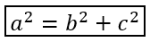

## **Översikt**

PowerPoint lagrar ekvationer som Office Math Markup Language (OMML). Med Aspose.Slides för Python via Java kan du skapa samma typ av matematiskt innehåll programmässigt: bråk, radikaler, funktioner, gränser, N-ary-operatorer, matriser, arrayer och formaterade matematikblock.

I PowerPoint lägger användare normalt till ekvationer via **Insert > Equation**:


Resultatet blir redigerbar matematiktext på bilden:


Aspose.Slides bygger den matematiska texten genom tre huvudobjekt:

- En matematikform, skapad med [addMathShape](https://reference.aspose.com/slides/sv/python-java/aspose.slides/shapecollection/#addMathShape), är formen som innehåller ekvationen.
- [MathPortion](https://reference.aspose.com/slides/sv/python-java/aspose.slides/mathportion/) lagrar matematikinnehåll i formens textram.
- [MathParagraph](https://reference.aspose.com/slides/sv/python-java/aspose.slides/mathparagraph/) innehåller ett eller flera [MathBlock](https://reference.aspose.com/slides/sv/python-java/aspose.slides/mathblock/)-objekt.

De flesta exempel nedan använder [MathematicalText](https://reference.aspose.com/slides/sv/python-java/aspose.slides/mathematicaltext/) och de kedjade metoderna från [MathElementBase](https://reference.aspose.com/slides/sv/python-java/aspose.slides/mathelementbase/) för att hålla koden kort och läsbar.

För MathML‑exportscenarier, se [Export Math Equations from Presentations in Python](/slides/sv/python-java/exporting-math-equations/).

## **Skapa en ekvation**

Detta exempel skapar en matematikform och lägger till Pythagoras sats:


```python
import jpype
import asposeslides

if not jpype.isJVMStarted():
    jpype.startJVM()

from asposeslides.api import MathematicalText, Presentation, SaveFormat

presentation = Presentation()
try:
    slide = presentation.getSlides().get_Item(0)

    math_shape = slide.getShapes().addMathShape(20, 20, 700, 120)
    math_paragraph = math_shape.getTextFrame().getParagraphs().get_Item(0).getPortions().get_Item(0).getMathParagraph()

    a_squared = MathematicalText("a").setSuperscript("2")
    b_squared = MathematicalText("b").setSuperscript("2")
    equation = MathematicalText("c").setSuperscript("2").join("=").join(a_squared).join("+").join(b_squared)

    math_paragraph.add(equation)

    presentation.save("pythagorean-theorem.pptx", SaveFormat.Pptx)
finally:
    presentation.dispose()
```

{}
[addMathShape](https://reference.aspose.com/slides/sv/python-java/aspose.slides/shapecollection/#addMathShape) skapar en form som redan innehåller ett matematik‑avsnitt. Hämta den första [MathPortion](https://reference.aspose.com/slides/sv/python-java/aspose.slides/mathportion/), få dess [MathParagraph](https://reference.aspose.com/slides/sv/python-java/aspose.slides/mathparagraph/), och lägg till matematikblock eller matematik‑element i den.
{}

## **Lägg till bråk**

Använd [divide](https://reference.aspose.com/slides/sv/python-java/aspose.slides/mathelementbase/#divide) för att skapa ett bråk. Du kan välja en bråksstil med [MathFractionTypes](https://reference.aspose.com/slides/sv/python-java/aspose.slides/mathfractiontypes/).


```python
import jpype
import asposeslides

if not jpype.isJVMStarted():
    jpype.startJVM()

from asposeslides.api import MathBlock, MathFractionTypes, MathematicalText, Presentation, SaveFormat

presentation = Presentation()
try:
    slide = presentation.getSlides().get_Item(0)

    math_shape = slide.getShapes().addMathShape(20, 20, 700, 100)
    math_paragraph = math_shape.getTextFrame().getParagraphs().get_Item(0).getPortions().get_Item(0).getMathParagraph()

    fraction = MathematicalText("1").divide("x", MathFractionTypes.Skewed)

    math_block = MathBlock(fraction)
    math_paragraph.add(math_block)

    presentation.save("fraction.pptx", SaveFormat.Pptx)
finally:
    presentation.dispose()
```

För ett staplat bråk, använd [MathFractionTypes.Bar](https://reference.aspose.com/slides/sv/python-java/aspose.slides/mathfractiontypes/#Bar):

```python
import jpype
import asposeslides

if not jpype.isJVMStarted():
    jpype.startJVM()

from asposeslides.api import MathFractionTypes, MathematicalText

stacked_fraction = MathematicalText("x + 1").divide("y - 1", MathFractionTypes.Bar)
```

## **Lägg till radikaler**

Använd [radical](https://reference.aspose.com/slides/sv/python-java/aspose.slides/mathelementbase/#radical) för att skapa en kvadratrots, kubikroten eller annan rot. Det aktuella elementet blir basen och argumentet blir graden.


```python
import jpype
import asposeslides

if not jpype.isJVMStarted():
    jpype.startJVM()

from asposeslides.api import MathBlock, MathematicalText, Presentation, SaveFormat

presentation = Presentation()
try:
    slide = presentation.getSlides().get_Item(0)

    math_shape = slide.getShapes().addMathShape(20, 20, 700, 100)
    math_paragraph = math_shape.getTextFrame().getParagraphs().get_Item(0).getPortions().get_Item(0).getMathParagraph()

    radical = MathematicalText("x").radical("n")

    math_block = MathBlock(radical)
    math_paragraph.add(math_block)

    presentation.save("radical.pptx", SaveFormat.Pptx)
finally:
    presentation.dispose()
```

## **Lägg till funktioner och gränser**

Använd [asArgumentOfFunction](https://reference.aspose.com/slides/sv/python-java/aspose.slides/mathelementbase/#asArgumentOfFunction) eller [function](https://reference.aspose.com/slides/sv/python-java/aspose.slides/mathelementbase/#function) för funktioner såsom `sin(x)`, `log(x)` eller egna funktionsnamn. För gränser, placera `lim` i ett [MathLimit](https://reference.aspose.com/slides/sv/python-java/aspose.slides/mathlimit/) eller använd [setLowerLimit](https://reference.aspose.com/slides/sv/python-java/aspose.slides/mathelementbase/#setLowerLimit).


```python
import jpype
import asposeslides

if not jpype.isJVMStarted():
    jpype.startJVM()

from asposeslides.api import MathBlock, MathematicalText, Presentation, SaveFormat

presentation = Presentation()
try:
    slide = presentation.getSlides().get_Item(0)

    math_shape = slide.getShapes().addMathShape(20, 20, 700, 100)
    math_paragraph = math_shape.getTextFrame().getParagraphs().get_Item(0).getPortions().get_Item(0).getMathParagraph()

    limit = MathematicalText("lim").setLowerLimit("x\u2192\u221E").function("x")

    math_block = MathBlock(limit)
    math_paragraph.add(math_block)

    presentation.save("functions-and-limits.pptx", SaveFormat.Pptx)
finally:
    presentation.dispose()
```

För ett eget funktionsnamn, gör funktionsnamnet till det aktuella elementet:

```python
import jpype
import asposeslides

if not jpype.isJVMStarted():
    jpype.startJVM()

from asposeslides.api import MathematicalText

custom_function = MathematicalText("f").function("x + 1")
```

## **Lägg till N‑ary‑operatorer och integraler**

Använd [nary](https://reference.aspose.com/slides/sv/python-java/aspose.slides/mathelementbase/#nary) för summor, unioner, snitt och andra stora operatorer. Använd [integral](https://reference.aspose.com/slides/sv/python-java/aspose.slides/mathelementbase/#integral) för integraler. Båda metoderna låter dig ange nedre och övre gränser.


```python
import jpype
import asposeslides

if not jpype.isJVMStarted():
    jpype.startJVM()

from asposeslides.api import MathBlock, MathNaryOperatorTypes, MathematicalText, Presentation, SaveFormat

presentation = Presentation()
try:
    slide = presentation.getSlides().get_Item(0)

    math_shape = slide.getShapes().addMathShape(20, 20, 700, 120)
    math_paragraph = math_shape.getTextFrame().getParagraphs().get_Item(0).getPortions().get_Item(0).getMathParagraph()

    a_power = MathematicalText("a").setSuperscript("n-k")
    summation_base = MathematicalText("x").setSuperscript("k").join(a_power)

    summation = summation_base.nary(MathNaryOperatorTypes.Summation, "k=0", "n")

    math_block = MathBlock(summation)
    math_paragraph.add(math_block)

    presentation.save("nary-operators.pptx", SaveFormat.Pptx)
finally:
    presentation.dispose()
```

N‑ary‑operatorer är för stora operatorer med valfria gränser. Enkla operatorer såsom `+`, `-` och `=` läggs vanligtvis till som [MathematicalText](https://reference.aspose.com/slides/sv/python-java/aspose.slides/mathematicaltext/) och sammanfogas i uttrycket.

För en integral, använd [integral](https://reference.aspose.com/slides/sv/python-java/aspose.slides/mathelementbase/#integral):

```python
import jpype
import asposeslides

if not jpype.isJVMStarted():
    jpype.startJVM()

from asposeslides.api import MathIntegralTypes, MathematicalText

differential = MathematicalText("dx").toBox()
integral_base = MathematicalText("x").join(differential)
integral = integral_base.integral(MathIntegralTypes.Simple, "0", "1")
```

## **Lägg till matriser**

Använd [MathMatrix](https://reference.aspose.com/slides/sv/python-java/aspose.slides/mathmatrix/) för rader och kolumner. Matriser inkluderar inte hakparenteser som standard, så omge matrisen när du behöver parenteser, hakparenteser eller måsvingar.


```python
import jpype
import asposeslides

if not jpype.isJVMStarted():
    jpype.startJVM()

from asposeslides.api import MathBlock, MathMatrix, MathematicalText, Presentation, SaveFormat

presentation = Presentation()
try:
    slide = presentation.getSlides().get_Item(0)

    math_shape = slide.getShapes().addMathShape(20, 20, 700, 120)
    math_paragraph = math_shape.getTextFrame().getParagraphs().get_Item(0).getPortions().get_Item(0).getMathParagraph()

    matrix = MathMatrix(2, 3)
    cell_0_0 = MathematicalText("1")
    matrix.set_Item(0, 0, cell_0_0)
    cell_0_1 = MathematicalText("x")
    matrix.set_Item(0, 1, cell_0_1)
    cell_1_0 = MathematicalText("x")
    matrix.set_Item(1, 0, cell_1_0)
    cell_1_1 = MathematicalText("2")
    matrix.set_Item(1, 1, cell_1_1)
    cell_1_2 = MathematicalText("y")
    matrix.set_Item(1, 2, cell_1_2)

    math_block = MathBlock(matrix)
    math_paragraph.add(math_block)

    presentation.save("matrix.pptx", SaveFormat.Pptx)
finally:
    presentation.dispose()
```

## **Lägg till ekvationsarrayer**

Använd [toMathArray](https://reference.aspose.com/slides/sv/python-java/aspose.slides/mathelementbase/#toMathArray) när du behöver justerade ekvationer eller en vertikal stapel av uttryck.


```python
import jpype
import asposeslides

if not jpype.isJVMStarted():
    jpype.startJVM()

from asposeslides.api import MathBlock, MathematicalText, Presentation, SaveFormat

presentation = Presentation()
try:
    slide = presentation.getSlides().get_Item(0)

    math_shape = slide.getShapes().addMathShape(20, 20, 700, 140)
    math_paragraph = math_shape.getTextFrame().getParagraphs().get_Item(0).getPortions().get_Item(0).getMathParagraph()

    equation_array = MathematicalText("x").join("y").toMathArray()

    math_block = MathBlock(equation_array)
    math_paragraph.add(math_block)

    presentation.save("equation-array.pptx", SaveFormat.Pptx)
finally:
    presentation.dispose()
```

## **Lägg till trigonometriska funktioner**

Använd [asArgumentOfFunction](https://reference.aspose.com/slides/sv/python-java/aspose.slides/mathelementbase/#asArgumentOfFunction) när argumentet är det aktuella elementet och funktionsnamnet är känt.


```python
import jpype
import asposeslides

if not jpype.isJVMStarted():
    jpype.startJVM()

from asposeslides.api import MathBlock, MathFunctionsOfOneArgument, MathematicalText, Presentation, SaveFormat

presentation = Presentation()
try:
    slide = presentation.getSlides().get_Item(0)

    math_shape = slide.getShapes().addMathShape(20, 20, 700, 100)
    math_paragraph = math_shape.getTextFrame().getParagraphs().get_Item(0).getPortions().get_Item(0).getMathParagraph()

    cosine = MathematicalText("2x").asArgumentOfFunction(MathFunctionsOfOneArgument.Cos)

    math_block = MathBlock(cosine)
    math_paragraph.add(math_block)

    presentation.save("trigonometric-function.pptx", SaveFormat.Pptx)
finally:
    presentation.dispose()
```

## **Lägg till nedsänkta och upphöjda index**

Använd subscript‑ och superscript‑hjälparna för index och potenser. När indexen ska visas på vänster sida av basen, använd [setSubSuperscriptOnTheLeft](https://reference.aspose.com/slides/sv/python-java/aspose.slides/mathelementbase/#setSubSuperscriptOnTheLeft).


```python
import jpype
import asposeslides

if not jpype.isJVMStarted():
    jpype.startJVM()

from asposeslides.api import MathBlock, MathematicalText, Presentation, SaveFormat

presentation = Presentation()
try:
    slide = presentation.getSlides().get_Item(0)

    math_shape = slide.getShapes().addMathShape(20, 20, 700, 100)
    math_paragraph = math_shape.getTextFrame().getParagraphs().get_Item(0).getPortions().get_Item(0).getMathParagraph()

    scripts = MathematicalText("Y").setSubSuperscriptOnTheLeft("1", "n")

    math_block = MathBlock(scripts)
    math_paragraph.add(math_block)

    presentation.save("subscript-superscript.pptx", SaveFormat.Pptx)
finally:
    presentation.dispose()
```

## **Lägg till avgränsare**

Använd [enclose](https://reference.aspose.com/slides/sv/python-java/aspose.slides/mathelementbase/#enclose) för att placera ett uttryck inom avgränsare. Du kan också ange ett avgränsartecken för avgränsaruttryck som innehåller flera element.


```python
import jpype
import asposeslides

if not jpype.isJVMStarted():
    jpype.startJVM()

from asposeslides.api import MathBlock, MathematicalText, Presentation, SaveFormat

presentation = Presentation()
try:
    slide = presentation.getSlides().get_Item(0)

    math_shape = slide.getShapes().addMathShape(20, 20, 700, 100)
    math_paragraph = math_shape.getTextFrame().getParagraphs().get_Item(0).getPortions().get_Item(0).getMathParagraph()

    delimiter = MathematicalText("x").join("y").join("z").enclose('<', '>')
    delimiter.setSeparatorCharacter('|')

    math_block = MathBlock(delimiter)
    math_paragraph.add(math_block)

    presentation.save("delimiters.pptx", SaveFormat.Pptx)
finally:
    presentation.dispose()
```

## **Lägg till en ramruta**

Använd [toBorderBox](https://reference.aspose.com/slides/sv/python-java/aspose.slides/mathelementbase/#toBorderBox) när själva ekvationen ska ramas in.



```python
import jpype
import asposeslides

if not jpype.isJVMStarted():
    jpype.startJVM()

from asposeslides.api import MathBlock, MathematicalText, Presentation, SaveFormat

presentation = Presentation()
try:
    slide = presentation.getSlides().get_Item(0)

    math_shape = slide.getShapes().addMathShape(20, 20, 700, 100)
    math_paragraph = math_shape.getTextFrame().getParagraphs().get_Item(0).getPortions().get_Item(0).getMathParagraph()

    b_squared = MathematicalText("b").setSuperscript("2")
    c_squared = MathematicalText("c").setSuperscript("2")
    boxed_equation = MathematicalText("a").setSuperscript("2").join("=").join(b_squared).join("+").join(c_squared).toBorderBox()

    math_block = MathBlock(boxed_equation)
    math_paragraph.add(math_block)

    presentation.save("border-box.pptx", SaveFormat.Pptx)
finally:
    presentation.dispose()
```

## **Gruppera termer**

Använd [group](https://reference.aspose.com/slides/sv/python-java/aspose.slides/mathelementbase/#group) för att placera ett grupperingstecken ovanför eller under ett uttryck. Lägg till en gräns för att märka de grupperade termerna.


```python
import jpype
import asposeslides

if not jpype.isJVMStarted():
    jpype.startJVM()

from asposeslides.api import MathBlock, MathTopBotPositions, MathematicalText, Presentation, SaveFormat

presentation = Presentation()
try:
    slide = presentation.getSlides().get_Item(0)

    math_shape = slide.getShapes().addMathShape(20, 20, 700, 120)
    math_paragraph = math_shape.getTextFrame().getParagraphs().get_Item(0).getPortions().get_Item(0).getMathParagraph()

    grouped = MathematicalText("x + y").group('\u23DF', MathTopBotPositions.Bottom, MathTopBotPositions.Top).setLowerLimit("any text")

    math_block = MathBlock(grouped)
    math_paragraph.add(math_block)

    presentation.save("grouped-terms.pptx", SaveFormat.Pptx)
finally:
    presentation.dispose()
```

## **Formatera matematik­element**

Använd formateringshjälparna endast där de förtydligar formeln. Till exempel placerar [overbar](https://reference.aspose.com/slides/sv/python-java/aspose.slides/mathelementbase/#overbar) en balk över ett matematik­element.


```python
import jpype
import asposeslides

if not jpype.isJVMStarted():
    jpype.startJVM()

from asposeslides.api import MathBlock, MathematicalText, Presentation, SaveFormat

presentation = Presentation()
try:
    slide = presentation.getSlides().get_Item(0)

    math_shape = slide.getShapes().addMathShape(20, 20, 700, 100)
    math_paragraph = math_shape.getTextFrame().getParagraphs().get_Item(0).getPortions().get_Item(0).getMathParagraph()

    overbar = MathematicalText("ABC").overbar()

    math_block = MathBlock(overbar)
    math_paragraph.add(math_block)

    presentation.save("overbar.pptx", SaveFormat.Pptx)
finally:
    presentation.dispose()
```

## **Snabbreferens**

| Task | Main API |
| --- | --- |
| Skapa matematisk text | [MathematicalText](https://reference.aspose.com/slides/sv/python-java/aspose.slides/mathematicaltext/) |
| Kombinera element | [MathElementBase.join](https://reference.aspose.com/slides/sv/python-java/aspose.slides/mathelementbase/#join) |
| Skapa bråk | [MathElementBase.divide](https://reference.aspose.com/slides/sv/python-java/aspose.slides/mathelementbase/#divide) |
| Lägg till upphöjt eller nedsänkt index | [setSuperscript](https://reference.aspose.com/slides/sv/python-java/aspose.slides/mathelementbase/#setSuperscript), [setSubscript](https://reference.aspose.com/slides/sv/python-java/aspose.slides/mathelementbase/#setSubscript) |
| Lägg till funktioner | [function](https://reference.aspose.com/slides/sv/python-java/aspose.slides/mathelementbase/#function), [asArgumentOfFunction](https://reference.aspose.com/slides/sv/python-java/aspose.slides/mathelementbase/#asArgumentOfFunction) |
| Lägg till radikaler | [MathElementBase.radical](https://reference.aspose.com/slides/sv/python-java/aspose.slides/mathelementbase/#radical) |
| Lägg till gränser | [setLowerLimit](https://reference.aspose.com/slides/sv/python-java/aspose.slides/mathelementbase/#setLowerLimit), [setUpperLimit](https://reference.aspose.com/slides/sv/python-java/aspose.slides/mathelementbase/#setUpperLimit) |
| Lägg till skript på vänster sida | [setSubSuperscriptOnTheLeft](https://reference.aspose.com/slides/sv/python-java/aspose.slides/mathelementbase/#setSubSuperscriptOnTheLeft) |
| Lägg till summor och integraler | [nary](https://reference.aspose.com/slides/sv/python-java/aspose.slides/mathelementbase/#nary), [integral](https://reference.aspose.com/slides/sv/python-java/aspose.slides/mathelementbase/#integral) |
| Lägg till matriser | [MathMatrix](https://reference.aspose.com/slides/sv/python-java/aspose.slides/mathmatrix/) |
| Lägg till ekvationsarrayer | [toMathArray](https://reference.aspose.com/slides/sv/python-java/aspose.slides/mathelementbase/#toMathArray) |
| Lägg till avgränsare | [enclose](https://reference.aspose.com/slides/sv/python-java/aspose.slides/mathelementbase/#enclose) |
| Lägg till streck och ramar | [overbar](https://reference.aspose.com/slides/sv/python-java/aspose.slides/mathelementbase/#overbar), [toBorderBox](https://reference.aspose.com/slides/sv/python-java/aspose.slides/mathelementbase/#toBorderBox) |
| Gruppera termer | [group](https://reference.aspose.com/slides/sv/python-java/aspose.slides/mathelementbase/#group) |

## **Vanliga frågor**

**Kan jag redigera en befintlig PowerPoint‑ekvation?**

Ja. Öppna presentationen, hitta formen som innehåller en [MathPortion](https://reference.aspose.com/slides/sv/python-java/aspose.slides/mathportion/), hämta dess [MathParagraph](https://reference.aspose.com/slides/sv/python-java/aspose.slides/mathparagraph/) och uppdatera matematikblocken i det avsnittet.

**Sparas ekvationer som redigerbar PowerPoint‑matematik?**

Ja. När du sparar till PPTX skriver Aspose.Slides ekvationen som redigerbart Office‑matematikinnehåll.

**Kan jag exportera ekvationer till LaTeX?**

Ja. Hämta ekvationens [MathParagraph](https://reference.aspose.com/slides/sv/python-java/aspose.slides/mathparagraph/) från dess [MathPortion](https://reference.aspose.com/slides/sv/python-java/aspose.slides/mathportion/) och anropa [MathParagraph.toLatex](https://reference.aspose.com/slides/sv/python-java/aspose.slides/mathparagraph/#toLatex) för att exportera den direkt. För ett komplett exempel, se [Export Math Equations from Presentations in Python](/slides/sv/python-java/exporting-math-equations/#export-math-equations-to-latex).