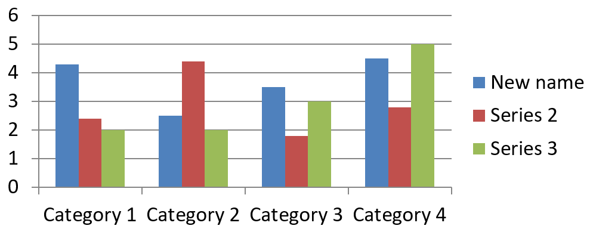

## **Översikt**

Ett diagram lagrar sina plottade data i en diagramdataarbetsbok. En [ChartSeries](https://reference.aspose.com/slides/sv/python-net/aspose.slides.charts/chartseries/) representerar en uppsättning relaterade värden, och varje [ChartDataPoint](https://reference.aspose.com/slides/sv/python-net/aspose.slides.charts/chartdatapoint/) i serien refererar till en eller flera celler i arbetsboken. [ChartCategory](https://reference.aspose.com/slides/sv/python-net/aspose.slides.charts/chartcategory/)‑objekt tillhandahåller etiketter eller grupperingvärden som delas av serierna. Serienamnet, kategorierna och punktvärdena är därför kopplade till [ChartDataCell](https://reference.aspose.com/slides/sv/python-net/aspose.slides.charts/chartdatacell/)‑objekt snarare än att bara lagras som visningstext.

För ett typiskt kategoridiagram använder standardarbetsboken rad 0 för serienamn, kolumn 0 för kategorinamn och de återstående cellerna för serievärden. Arbetsblad, rad‑ och kolumnindex som skickas till [ChartDataWorkbook.get_cell](https://reference.aspose.com/slides/sv/python-net/aspose.slides.charts/chartdataworkbook/get_cell/) är nollbaserade. Denna layout är användbar när du skapar ett diagram med standarddata, men anta inte att varje befintligt diagram använder den. För en inläst presentation, inspektera cellerna som refereras av serierna, kategorierna och datapunkterna innan du ändrar arbetsbokens värden.

Diagraminställningar har tre olika omfattningar:

- Inställningar på serienivå, såsom [ChartSeries.format](https://reference.aspose.com/slides/sv/python-net/aspose.slides.charts/chartseries/format/), ger standardutseendet för alla punkter i en serie.
- Datapunktinställningar, såsom [ChartDataPoint.format](https://reference.aspose.com/slides/sv/python-net/aspose.slides.charts/chartdatapoint/format/), åsidosätter serieutseendet för en punkt.
- Gruppinställningar gäller för kompatibla serier som tillhör samma [ChartSeriesGroup](https://reference.aspose.com/slides/sv/python-net/aspose.slides.charts/chartseriesgroup/). Åtkomst till gruppen sker via [ChartSeries.parent_series_group](https://reference.aspose.com/slides/sv/python-net/aspose.slides.charts/chartseries/parent_series_group/) när du behöver ställa in alternativ som överlappning eller mellanrum.

När ingen explicit punkt‑ eller seriefyllning är angiven bestämmer diagramstil och tema det automatiska utseendet. När både serie‑ och punktformatering finns, har punktformateringen företräde för den punkten.


## **Ställ in diagramseriens överlappning**

[ChartSeries.overlap](https://reference.aspose.com/slides/sv/python-net/aspose.slides.charts/chartseries/overlap/) rapporterar hur mycket staplar eller kolumner överlappar i ett 2D‑diagram, från -100 till 100 procent. Det är en skrivskyddad projektion av inställningen på den överordnade serieggruppen. Ställ in [ChartSeriesGroup.overlap](https://reference.aspose.com/slides/sv/python-net/aspose.slides.charts/chartseriesgroup/overlap/) för att uppdatera varje kompatibel serie i den gruppen. Detta alternativ gäller för diagramtyper som visar grupperade staplar eller kolumner; det påverkar inte orelaterade serieggrupper i ett kombinationsdiagram.

Följande exempel ställer in överlappning för gruppen som innehåller den första serien:

```py
import aspose.slides as slides
import aspose.slides.charts as charts

first_slide_index = 0
first_series_index = 0
overlap_percent = 30

with slides.Presentation() as presentation:
    slide = presentation.slides[first_slide_index]

    # Det nya diagrammet innehåller exempelserier, kategorier och värden.
    chart = slide.shapes.add_chart(charts.ChartType.CLUSTERED_COLUMN, 20, 20, 500, 200)

    series = chart.chart_data.series[first_series_index]
    series.parent_series_group.overlap = overlap_percent

    presentation.save("series_overlap.pptx", slides.export.SaveFormat.PPTX)
```

Resultatet:


## **Ändra seriens fyllningsfärg**

Använd [ChartSeries.format](https://reference.aspose.com/slides/sv/python-net/aspose.slides.charts/chartseries/format/) för att ange standardfyllningen för en hel serie. Om en punkt redan har en explicit fyllning, åsidosätter dess [ChartDataPoint.format](https://reference.aspose.com/slides/sv/python-net/aspose.slides.charts/chartdatapoint/format/) inställning seriefyllningen för den punkten.

Följande exempel tillämpar en solid blå fyllning på den första serien:

```py
import aspose.pydrawing as drawing
import aspose.slides as slides
import aspose.slides.charts as charts

first_slide_index = 0
first_series_index = 0

with slides.Presentation() as presentation:
    slide = presentation.slides[first_slide_index]

    chart = slide.shapes.add_chart(charts.ChartType.CLUSTERED_COLUMN, 20, 20, 500, 200)

    series = chart.chart_data.series[first_series_index]
    series.format.fill.fill_type = slides.FillType.SOLID
    series.format.fill.solid_fill_color.color = drawing.Color.blue

    presentation.save("series_color.pptx", slides.export.SaveFormat.PPTX)
```

Resultatet:


## **Ändra seriens namn**

Ett serienamn lagras i diagramdataarbetsboken och visas normalt i förklaringen. I standardarbetsboken som skapas för ett grupperat stapeldiagram är cell B1 på rad 0, kolumn 1 och innehåller namnet på den första serien. De namngivna konstanterna i följande exempel gör den strukturen explicit:

```py
import aspose.slides as slides
import aspose.slides.charts as charts

first_slide_index = 0
worksheet_index = 0
series_name_row_index = 0
first_series_column_index = 1

with slides.Presentation() as presentation:
    slide = presentation.slides[first_slide_index]

    chart = slide.shapes.add_chart(charts.ChartType.CLUSTERED_COLUMN, 20, 20, 500, 200)

    workbook = chart.chart_data.chart_data_workbook
    series_name_cell = workbook.get_cell(worksheet_index, series_name_row_index, first_series_column_index)
    series_name_cell.value = "Revenue"

    presentation.save("series_name.pptx", slides.export.SaveFormat.PPTX)
```

Du kan också uppdatera cellen som redan refereras av [ChartSeries.name](https://reference.aspose.com/slides/sv/python-net/aspose.slides.charts/chartseries/name/). Detta tillvägagångssätt undviker att anta en specifik rad och kolumn i ett befintligt diagram:

```py
import aspose.slides as slides
import aspose.slides.charts as charts

first_slide_index = 0
first_series_index = 0
first_name_cell_index = 0

with slides.Presentation() as presentation:
    slide = presentation.slides[first_slide_index]

    chart = slide.shapes.add_chart(charts.ChartType.CLUSTERED_COLUMN, 20, 20, 500, 200)

    series = chart.chart_data.series[first_series_index]
    series_name_cell = series.name.as_cells[first_name_cell_index]
    series_name_cell.value = "Revenue"

    presentation.save("series_name.pptx", slides.export.SaveFormat.PPTX)
```

Resultatet:



## **Hämta automatisk serielfyllningsfärg**

[ChartSeries.get_automatic_series_color](https://reference.aspose.com/slides/sv/python-net/aspose.slides.charts/chartseries/get_automatic_series_color/) returnerar färgen som beräknas från seriens index och diagramstilen. Detta är färgen som används när seriefyllningen inte har definierats explicit. Att anropa metoden läser den beräknade färgen; den tilldelar ingen ny fyllning.

Följande exempel skriver ut den automatiska färgen för varje standardserie:

```py
import aspose.slides as slides
import aspose.slides.charts as charts

first_slide_index = 0

with slides.Presentation() as presentation:
    slide = presentation.slides[first_slide_index]

    chart = slide.shapes.add_chart(charts.ChartType.CLUSTERED_COLUMN, 20, 20, 500, 200)

    series_count = len(chart.chart_data.series)
    for series_index in range(series_count):
        series = chart.chart_data.series[series_index]
        automatic_color = series.get_automatic_series_color()
        print(f"Series {series_index}: {automatic_color.name}")
```

Exempeloutput för standarddiagramstilen:

```text
Series 0: ff4f81bd
Series 1: ffc0504d
Series 2: ff9bbb59
```

De exakta färgerna beror på diagramstilen och temat.

## **Ställ in inverterad fyllningsfärg för en diagramserie**

För stapel-, kolumn- och bubbelseerier kan [ChartSeries.invert_if_negative](https://reference.aspose.com/slides/sv/python-net/aspose.slides.charts/chartseries/invert_if_negative/) visa negativa värden med en annan fyllning. Ställ in den vanliga seriefyllningen till solid, aktivera inversion och tilldela den negativa värdefärgen via [ChartSeries.inverted_solid_fill_color](https://reference.aspose.com/slides/sv/python-net/aspose.slides.charts/chartseries/inverted_solid_fill_color/). Negativa tal förblir oförändrade i arbetsboken; endast deras visningsfärg ändras.

Följande exempel ersätter standarddiagramdata med en serie. Arbetsbladets rad 0 innehåller serienamnet, kolumn 0 innehåller kategorinamn och kolumn 1 innehåller värdena:

```py
import aspose.pydrawing as drawing
import aspose.slides as slides
import aspose.slides.charts as charts

first_slide_index = 0
worksheet_index = 0
header_row_index = 0
category_column_index = 0
first_series_column_index = 1
first_data_row_index = 1

category_names = ["Category 1", "Category 2", "Category 3"]
series_values = [-20, 50, -30]

with slides.Presentation() as presentation:
    slide = presentation.slides[first_slide_index]

    chart = slide.shapes.add_chart(charts.ChartType.CLUSTERED_COLUMN, 20, 20, 500, 200)
    chart_data = chart.chart_data
    workbook = chart_data.chart_data_workbook

    chart_data.series.clear()
    chart_data.categories.clear()

    series_name_cell = workbook.get_cell(worksheet_index, header_row_index, first_series_column_index, "Series 1")
    series = chart_data.series.add(series_name_cell, chart.type)

    category_count = len(category_names)
    for category_index in range(category_count):
        data_row_index = first_data_row_index + category_index
        category_name = category_names[category_index]
        series_value = series_values[category_index]

        category_cell = workbook.get_cell(worksheet_index, data_row_index, category_column_index, category_name)
        chart_data.categories.add(category_cell)

        value_cell = workbook.get_cell(worksheet_index, data_row_index, first_series_column_index, series_value)
        series.data_points.add_data_point_for_bar_series(value_cell)

    automatic_series_color = series.get_automatic_series_color()
    series.format.fill.fill_type = slides.FillType.SOLID
    series.format.fill.solid_fill_color.color = automatic_series_color
    series.invert_if_negative = True
    series.inverted_solid_fill_color.color = drawing.Color.red

    presentation.save("inverted_solid_fill_color.pptx", slides.export.SaveFormat.PPTX)
```

Resultatet:


Du kan aktivera inversion för en punkt via [ChartDataPoint.invert_if_negative](https://reference.aspose.com/slides/sv/python-net/aspose.slides.charts/chartdatapoint/invert_if_negative/). I följande exempel är inversion inaktiverad för serien och endast aktiverad för den valda punkten. Punkten tilldelas också ett negativt värde så att effekten syns:

```py
import aspose.pydrawing as drawing
import aspose.slides as slides
import aspose.slides.charts as charts

first_slide_index = 0
first_series_index = 0
target_data_point_index = 2
negative_value = -30

with slides.Presentation() as presentation:
    slide = presentation.slides[first_slide_index]

    chart = slide.shapes.add_chart(charts.ChartType.CLUSTERED_COLUMN, 20, 20, 500, 200)

    series = chart.chart_data.series[first_series_index]
    automatic_series_color = series.get_automatic_series_color()
    series.format.fill.fill_type = slides.FillType.SOLID
    series.format.fill.solid_fill_color.color = automatic_series_color
    series.inverted_solid_fill_color.color = drawing.Color.red
    series.invert_if_negative = False

    data_point = series.data_points[target_data_point_index]
    data_point.value.as_cell.value = negative_value
    data_point.invert_if_negative = True

    presentation.save("data_point_invert_color_if_negative.pptx", slides.export.SaveFormat.PPTX)
```

## **Rensa ett specifikt datapunktvärde**

För att göra en punkt tom utan att ta bort de andra punkterna, sätt dess underliggande arbetsboks cell till `None`. För ett stapeldiagram är det plottade värdet tillgängligt via [ChartDataPoint.value](https://reference.aspose.com/slides/sv/python-net/aspose.slides.charts/chartdatapoint/value/). Datapunkten förblir på samma kategoriposition, men diagrammet behandlar dess värde som tomt enligt diagrammets inställningar för tomma värden.

Följande exempel rensar endast den andra punkten i den första serien:

```py
import aspose.slides as slides
import aspose.slides.charts as charts

first_slide_index = 0
first_series_index = 0
target_data_point_index = 1

with slides.Presentation() as presentation:
    slide = presentation.slides[first_slide_index]

    chart = slide.shapes.add_chart(charts.ChartType.CLUSTERED_COLUMN, 20, 20, 500, 200)

    series = chart.chart_data.series[first_series_index]
    data_point = series.data_points[target_data_point_index]
    data_point.value.as_cell.value = None

    presentation.save("clear_data_point_value.pptx", slides.export.SaveFormat.PPTX)
```

Spridningsdiagram använder separata X‑ och Y‑celler, och bubbeldiagram använder också en storlekscell. Rensa bara den cell som representerar värdet du avser att ta bort. Anropa inte [ChartDataPointCollection.clear](https://reference.aspose.com/slides/sv/python-net/aspose.slides.charts/chartdatapointcollection/clear/) när du vill behålla de andra punkterna, eftersom den metoden tar bort varje datapunkt från samlingen.

## **Styr visning av tomma celler**

Dolda celler som innehåller värden är ett separat fall från tomma celler. För att inkludera eller exkludera data från dolda arbetsbladsrader och -kolumner, se [Include Data from Hidden Rows and Columns](/slides/sv/python-net/chart-workbook/#include-data-from-hidden-rows-and-columns).

En tom arbetsboks cell representerar saknad data; en cell som innehåller `0` representerar ett känt numeriskt värde. Sätt [ChartDataCell.value](https://reference.aspose.com/slides/sv/python-net/aspose.slides.charts/chartdatacell/value/) till `None` för att göra en cell tom. En numerisk nolla förblir en nolla oavsett inställningen för tom cell.

Använd [Chart.display_blanks_as](https://reference.aspose.com/slides/sv/python-net/aspose.slides.charts/chart/display_blanks_as/) för att välja hur diagrammet visar tomma celler. Denna inställning gäller för hela diagrammet. Den ändrar hur tomrum plottas, utan att fylla den tomma arbetsboks cellen med noll eller ett interpolerat värde.

Följande fristående exempel skapar ett linjediagram med en serie, rensar värdet för Dag 3, och sparar samma diagram med varje läge. Ingen indatafil krävs. [ChartDataWorkbook](https://reference.aspose.com/slides/sv/python-net/aspose.slides.charts/chartdataworkbook/) använder arbetsblad 0, kolumn 0 för kategorietiketter och kolumn 1 för värden; rad 0 innehåller serienamnet. De slutliga data är `10, 20, empty, 30, 40`.

```py
import aspose.slides as slides
import aspose.slides.charts as charts

with slides.Presentation() as presentation:
    slide = presentation.slides[0]

    chart = slide.shapes.add_chart(charts.ChartType.LINE_WITH_MARKERS, 40, 40, 640, 400)
    chart_data = chart.chart_data
    workbook = chart_data.chart_data_workbook

    chart_data.series.clear()
    chart_data.categories.clear()

    series_name_cell = workbook.get_cell(0, 0, 1, "Measurements")
    series = chart_data.series.add(series_name_cell, chart.type)
    values = [10, 20, 25, 30, 40]

    for i, value in enumerate(values):
        category_cell = workbook.get_cell(0, i + 1, 0, f"Day {i + 1}")
        chart_data.categories.add(category_cell)
        value_cell = workbook.get_cell(0, i + 1, 1, value)
        series.data_points.add_data_point_for_line_series(value_cell)

    # Lämna dag 3 riktigt tom, samtidigt som du behåller dess kategori och datapunkt.
    workbook.get_cell(0, 3, 1).value = None

    modes = [("Gap", charts.DisplayBlanksAsType.GAP), ("Zero", charts.DisplayBlanksAsType.ZERO), ("Span", charts.DisplayBlanksAsType.SPAN)]
    for mode_name, mode in modes:
        chart.display_blanks_as = mode
        presentation.save(f"empty_cells_{mode_name}.pptx", slides.export.SaveFormat.PPTX)
```

Varje utdatafil lagrar läget som tilldelats innan sparning: `empty_cells_Gap.pptx`, `empty_cells_Zero.pptx` och `empty_cells_Span.pptx`. För att spara endast en version, tilldela önskat läge och spara presentationen en gång istället för att iterera över lägena.

Jämförelsen nedan visar samma data i alla tre filerna. Dag 3 är tom i arbetsboken i varje fall:


Den synliga effekten beror på diagramtypen. Ett linjediagram gör alla tre lägen enkla att jämföra. Stapel- och kolumndiagram har ingen linje att ansluta över en saknad kategori, så `SPAN` kan inte producera det anslutande segmentet som visas ovan; en saknad kolumn och en kolumn med nollhöjd kan också se lika ut. På samma sätt har ett spridningsdiagram med endast markörer ingen anslutningslinje. Förvänta dig inte tre olika resultat för varje diagramtyp; kontrollera resultatet för den typ du använder.

## **Ställ in seriens mellanrum**

Mellanrum (gap width) är avståndet mellan intilliggande stapel‑ eller kolumnkluster, uttryckt som en procentandel av stapel‑ eller kolumnbredden. Liksom överlappning tillhör det den överordnade serieggruppen snarare än en enskild serie. Ställ in [ChartSeriesGroup.gap_width](https://reference.aspose.com/slides/sv/python-net/aspose.slides.charts/chartseriesgroup/gap_width/) en gång för gruppen. Ett större värde skapar mer utrymme mellan klustren; ett mindre värde gör dem tätare.

Följande exempel ändrar mellanrummets bredd och sparar endast den slutliga presentationen:

```py
import aspose.slides as slides
import aspose.slides.charts as charts

first_slide_index = 0
first_series_index = 0
gap_width_percent = 30

with slides.Presentation() as presentation:
    slide = presentation.slides[first_slide_index]

    chart = slide.shapes.add_chart(charts.ChartType.STACKED_COLUMN, 20, 20, 500, 200)

    series = chart.chart_data.series[first_series_index]
    series.parent_series_group.gap_width = gap_width_percent

    presentation.save("gap_width_30.pptx", slides.export.SaveFormat.PPTX)
```

Resultatet:


## **FAQ**

**Vilka diagramtyper stöder dataserier?**

Alla diagramtyper som representeras av [ChartType](https://reference.aspose.com/slides/sv/python-net/aspose.slides.charts/charttype/)-enumerationen använder diagramdata, men deras serier har inte alla samma värdestruktur eller inställningar. Till exempel använder kategoridiagram kategorier och värden, spridningsdiagram använder X‑ och Y‑värden, och bubbeldiagram lägger till bubbelformer. Använd den datapunkt‑skapandemetod som matchar serietypen. Alternativ såsom överlappning och mellanrum gäller bara för kompatibla stapel‑ eller kolumngrupper.

**Vad är en diagramserieggrupp?**

En [ChartSeriesGroup](https://reference.aspose.com/slides/sv/python-net/aspose.slides.charts/chartseriesgroup/) innehåller kompatibla serier som delar gruppnivå‑plotteringsinställningar. Ett kombinationsdiagram kan innehålla mer än en grupp, så att ändra gruppen som nås via en serie förändrar inte nödvändigtvis alla serier i diagrammet.

**Innehåller ett nyskapat diagram standarddata?**

Ja. Som standard skapar [ShapeCollection.add_chart](https://reference.aspose.com/slides/sv/python-net/aspose.slides/shapecollection/add_chart/) exempelserier, -kategorier och -värden. Du kan redigera dessa celler eller rensa både serie‑ och kategori‑samlingarna innan du lägger till ett helt eget datauppsättning. En overload kan också skapa ett diagram utan standarddata.

**Hur är diagramobjekt kopplade till arbetsboks‑celler?**

Serienamn, kategori‑etiketter och datapunktvärden refererar celler i en [ChartDataWorkbook](https://reference.aspose.com/slides/sv/python-net/aspose.slides.charts/chartdataworkbook/). Att ändra en refererad cell uppdaterar motsvarande diagramdel. När du bygger eget data, håll kategori‑rader och serie‑värdes‑rader i linje så att varje punkt plottas under avsedd kategori.

**Hur rensar jag en punkt istället för hela serien?**

Sätt den relevanta värdecellen till `None` för att behålla punktens kategoriposition som en tom punkt. Använd [ChartDataPointCollection.clear](https://reference.aspose.com/slides/sv/python-net/aspose.slides.charts/chartdatapointcollection/clear/) endast när du avser att ta bort alla punkter från den serien. Om du dessutom tar bort kategorier, uppdatera alla serier så att deras värden förblir i linje med kategorialistorna.

**Hur visas tomma punkter?**

Resultatet beror på diagramtypen och [Chart.display_blanks_as](https://reference.aspose.com/slides/sv/python-net/aspose.slides.charts/chart/display_blanks_as/). Stödda diagram kan visa tomrum som luckor, som nollvärden eller genom att ansluta närliggande punkter. Välj den inställning som matchar innebörden av saknad data i din presentation. Se [Styr visning av tomma celler](#styr-visning-av-tomma-celler) för ett komplett exempel och visuell jämförelse.

**Hur formateras negativa värden?**

För stapel‑, kolumn‑ och bubbelseerier, aktivera [ChartSeries.invert_if_negative](https://reference.aspose.com/slides/sv/python-net/aspose.slides.charts/chartseries/invert_if_negative/) och sätt [ChartSeries.inverted_solid_fill_color](https://reference.aspose.com/slides/sv/python-net/aspose.slides.charts/chartseries/inverted_solid_fill_color/). Du kan åsidosätta beteendet för en enskild punkt med [ChartDataPoint.invert_if_negative](https://reference.aspose.com/slides/sv/python-net/aspose.slides.charts/chartdatapoint/invert_if_negative/). Dessa egenskaper påverkar formatering, inte de lagrade numeriska värdena.

**Vilken formatering vinner när både en serie och en punkt är formaterade?**

Explicit datapunkt‑formatering har företräde för den punkten. Andra punkter fortsätter att använda den explicita serie‑formatet eller, när serie‑formatet inte är definierat, den automatiska diagramstilen och temat. Grupp‑egenskaper såsom överlappning och mellanrum styr layout och är inte punkt‑nivå‑formateringsöverskrivningar.

**Finns det någon gräns för hur många serier ett diagram kan innehålla?**

Aspose.Slides har ingen separat fast gräns för antalet serier. I praktiken bestäms en användbar gräns av presentationsfilens begränsningar, tillgängligt minne, renderingtid och diagrammets läsbarhet.

**Vad bör jag justera när kolumner är för nära eller för långt ifrån varandra?**

Ställ in [ChartSeriesGroup.gap_width](https://reference.aspose.com/slides/sv/python-net/aspose.slides.charts/chartseriesgroup/gap_width/) på den lämpliga överordnade serieggruppen. Öka värdet för att bredda avståndet mellan klustren, eller minska det för att föra klustren närmare varandra.