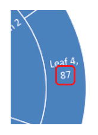

## **Introduktion**

Bland andra PowerPoint-diagramtyper finns det två hierarkiska — **Treemap** och **Sunburst** (även kända som Sunburst Graph, Sunburst Diagram, Radial Chart, Radial Graph eller Multi-Level Pie Chart). Dessa diagram visar hierarkisk data organiserad som ett träd — från blad till toppen av en gren. Bladen definieras av serie‑datapunkterna, och varje efterföljande inbäddad gruppering definieras av motsvarande kategori. Aspose.Slides for Python via .NET låter dig formatera datapunkter i Sunburst‑diagram och Treemap‑diagram i Python.

Här är ett Sunburst‑diagram där data i kolumnen Series1 definierar bladnoderna, medan de andra kolumnerna definierar hierarkiska datapunkter:


Låt oss börja med att lägga till ett nytt Sunburst‑diagram i presentationen:

```py
with slides.Presentation() as presentation:
    slide = presentation.slides[0]
    chart = slide.shapes.add_chart(charts.ChartType.SUNBURST, 30, 30, 450, 400)
```

{}
- [**Create Sunburst Charts**](/slides/sv/python-net/create-chart/#create-sunburst-charts)
{}

Om du behöver formatera diagramdatapunkter, använd följande API:

[ChartDataPointLevelsManager](https://reference.aspose.com/slides/sv/python-net/aspose.slides.charts/chartdatapointlevelsmanager/), [ChartDataPointLevel](https://reference.aspose.com/slides/sv/python-net/aspose.slides.charts/chartdatapointlevel/), och egenskapen [ChartDataPoint.data_point_levels](https://reference.aspose.com/slides/sv/python-net/aspose.slides.charts/chartdatapoint/data_point_levels/). De ger åtkomst till formatering av datapunkter i Treemap‑ och Sunburst‑diagram. [ChartDataPointLevelsManager](https://reference.aspose.com/slides/sv/python-net/aspose.slides.charts/chartdatapointlevelsmanager/) används för att komma åt flernivåkategorier; den representerar en behållare av [ChartDataPointLevel](https://reference.aspose.com/slides/sv/python-net/aspose.slides.charts/chartdatapointlevel/)‑objekt. Den är i praktiken ett omslag runt [ChartCategoryLevelsManager](https://reference.aspose.com/slides/sv/python-net/aspose.slides.charts/chartcategorylevelsmanager/) med ytterligare egenskaper som är specifika för datapunkter. Typen [ChartDataPointLevel](https://reference.aspose.com/slides/sv/python-net/aspose.slides.charts/chartdatapointlevel/) exponeras med två egenskaper — [format](https://reference.aspose.com/slides/sv/python-net/aspose.slides.charts/chartdatapointlevel/format/) och [label](https://reference.aspose.com/slides/sv/python-net/aspose.slides.charts/chartdatapointlevel/label/) — som ger åtkomst till motsvarande inställningar.

## **Visa värden för datapunkter**

Detta avsnitt visar hur du visar värdet för enskilda datapunkter i Treemap‑ och Sunburst‑diagram. Du får se hur du aktiverar värdelappar för valda punkter.

Visa värdet för datapunkten "Leaf 4":

```py
data_points = chart.chart_data.series[0].data_points
data_points[3].data_point_levels[0].label.data_label_format.show_value = True
```



## **Ange etiketter och färger för datapunkter**

Detta avsnitt visar hur du anger anpassade etiketter och färger för enskilda datapunkter i Treemap‑ och Sunburst‑diagram. Du kommer att lära dig hur du får åtkomst till en specifik datapunkt, tilldelar en etikett och tillämpar en solid fyllning för att markera viktiga noder.

Ange dataetiketten för "Branch 1" så att den visar serienamnet ("Series1") istället för kategorinamnet, och sätt sedan textfärgen till gult:

```py
branch1_label = data_points[0].data_point_levels[2].label
branch1_label.data_label_format.show_category_name = False
branch1_label.data_label_format.show_series_name = True

branch1_label.data_label_format.text_format.portion_format.fill_format.fill_type = slides.FillType.SOLID
branch1_label.data_label_format.text_format.portion_format.fill_format.solid_fill_color.color = draw.Color.yellow
```


## **Ange grenfärger för datapunkter**

Använd grenfärger för att kontrollera hur föräldra‑ och barnnoder grupperas visuellt i Treemap‑ och Sunburst‑diagram. Detta avsnitt visar hur du anger en anpassad grenfärg för en specifik datapunkt så att du kan markera viktiga underträd och förbättra diagrammets läsbarhet.

Ändra färgen på grenen "Stem 4":

```py
import aspose.slides as slides
import aspose.slides.charts as charts
import aspose.pydrawing as draw

with slides.Presentation() as presentation:
    slide = presentation.slides[0]

    chart = slide.shapes.add_chart(charts.ChartType.SUNBURST, 30, 30, 450, 400)
    data_points = chart.chart_data.series[0].data_points

    stem4_branch = data_points[9].data_point_levels[1]
    
    stem4_branch.format.fill.fill_type = slides.FillType.SOLID
    stem4_branch.format.fill.solid_fill_color.color = draw.Color.red
      
    presentation.save("branch_color.pptx", slides.export.SaveFormat.PPTX)
```


## **FAQ**

**Kan jag ändra ordningen (sorteringen) av segment i Sunburst/Treemap?**

Nej. PowerPoint sorterar segment automatiskt (vanligtvis efter fallande värden, medurs). Aspose.Slides speglar detta beteende: du kan inte ändra ordningen direkt; du uppnår det genom att förbehandla data.

**Hur påverkar presentationstemat färgerna på segment och etiketter?**

Diagrammets färger ärver presentationens [theme/palette](/slides/sv/python-net/presentation-theme/) om du inte explicit anger fyllningar/typsnitt. För konsekventa resultat, lås fast solida fyllningar och textformatering på de nödvändiga nivåerna.

**Kommer export till PDF/PNG att bevara anpassade grenfärger och etikettinställningar?**

Ja. Vid export av presentationen bevaras diagraminställningarna (fyllningar, etiketter) i de exporterade formaten eftersom Aspose.Slides renderar med diagrammets formatering tillämpad.

**Kan jag beräkna de faktiska koordinaterna för en etikett/element för anpassad överlagring ovanpå diagrammet?**

Ja. Efter att diagrammets layout har validerats är `actual_x`/`actual_y` tillgängliga för element (till exempel en [DataLabel](https://reference.aspose.com/slides/sv/python-net/aspose.slides.charts/datalabel/)), vilket underlättar exakt positionering av överlagringar.