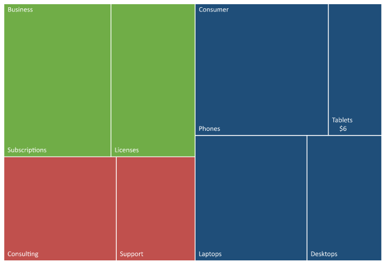

## **Översikt**

Treemap‑ och Sunburst‑diagram visar samma typ av hierarkisk data, men de använder olika layouter. En Treemap ritar hierarkin som nästlade rektanglar vars områden representerar lövvärden. En Sunburst ritar den som koncentriska ringar: top‑nivågrupper är nära centrum och lövkategorierna ligger på den yttre ringen.

I Aspose.Slides for Python via .NET är varje numeriskt värde ett [ChartDataPoint](https://reference.aspose.com/slides/sv/python-net/aspose.slides.charts/chartdatapoint/). Dess [ChartDataPoint.data_point_levels](https://reference.aspose.com/slides/sv/python-net/aspose.slides.charts/chartdatapoint/data_point_levels/)‑samling ger åtkomst till lövet och dess föräldragrupper. Den här artikeln förklarar den mappningen och visar hur du skapar och formaterar båda diagramtyperna från samma exempeldata.




## **Förstå kategorier, datapunkter och nivåer**

Exemplet nedan har tre kategorinivåer och en numerisk serie:

| Gren | Stam | Löv | Intäkt |
| --- | --- | --- | ---: |
| Consumer | Computers | Laptops | 12 |
| Consumer | Computers | Desktops | 8 |
| Consumer | Mobile | Phones | 15 |
| Consumer | Mobile | Tablets | 6 |
| Business | Services | Consulting | 10 |
| Business | Services | Support | 7 |
| Business | Software | Licenses | 11 |
| Business | Software | Subscriptions | 14 |

Varje rad skapar en lövkategori och en datapunkt. Kategorigrupperingsnivåerna beskriver vägen från det lövet till dess föräldrar. För den första raden är vägen `Consumer > Computers > Laptops`.

Indexen i [ChartDataPoint.data_point_levels](https://reference.aspose.com/slides/sv/python-net/aspose.slides.charts/chartdatapoint/data_point_levels/) går från lövet uppåt:

| `data_point_levels`‑index | Logisk nivå | Treemap‑representation | Sunburst‑representation |
| ---: | --- | --- | --- |
| `0` | Löv | Värderektangel | Segment i ytterring |
| `1` | Stam | Föräldrarektangel eller rubrik | Segment i mellanföring |
| `2` | Gren | Rektangel eller rubrik på top‑nivå | Segment i innerring |

Denna ordning är densamma för båda diagramtyperna även om deras visuella layouter skiljer sig. Ett föräldrasegment delas av flera löv. För att formatera det, använd motsvarande nivå från den första datapunkten i gruppen. Till exempel börjar grenen `Consumer` med datapunkten `Laptops`, medan stammen `Software` börjar med datapunkten `Licenses`. Att hålla referenser till dessa punkter är tydligare och säkrare än att använda oklara uttryck som `data_points[0]` eller `data_points[6]`.

## **Skapa och anpassa båda diagramtyperna**

Det följande kompletta exemplet skapar en Treemap på den första bilden och en Sunburst på den andra bilden. Det bygger hierarkin, visar värdet för `Tablets`, tillämpar fasta färger på utvalda nivåer, formaterar en grenetikett och sparar presentationen.

```py
import aspose.pydrawing as drawing
import aspose.slides as slides
import aspose.slides.charts as charts


def set_solid_fill(fill_format, color):
    fill_format.fill_type = slides.FillType.SOLID
    fill_format.solid_fill_color.color = color


def add_hierarchy_chart(slide, chart_type):
    worksheet_index = 0
    leaf_level_index = 0
    stem_level_index = 1
    branch_level_index = 2

    chart = slide.shapes.add_chart(chart_type, 40, 40, 640, 440)
    chart.has_title = False
    chart.has_legend = False
    chart.chart_data.categories.clear()
    chart.chart_data.series.clear()

    workbook = chart.chart_data.chart_data_workbook
    workbook.clear(worksheet_index)

    def add_category(row_index, leaf_name):
        category_cell = workbook.get_cell(worksheet_index, row_index, 2, leaf_name)
        return chart.chart_data.categories.add(category_cell)

    # Lägg till lövkategorierna. Ett grupperingselement sätts endast när en ny grupp påbörjas;
    # de följande kategorierna förblir i den gruppen tills ett annat element sätts.
    laptops_category = add_category(1, "Laptops")
    laptops_category.grouping_levels.set_grouping_item(stem_level_index, "Computers")
    laptops_category.grouping_levels.set_grouping_item(branch_level_index, "Consumer")

    add_category(2, "Desktops")

    phones_category = add_category(3, "Phones")
    phones_category.grouping_levels.set_grouping_item(stem_level_index, "Mobile")

    add_category(4, "Tablets")

    consulting_category = add_category(5, "Consulting")
    consulting_category.grouping_levels.set_grouping_item(stem_level_index, "Services")
    consulting_category.grouping_levels.set_grouping_item(branch_level_index, "Business")

    add_category(6, "Support")

    licenses_category = add_category(7, "Licenses")
    licenses_category.grouping_levels.set_grouping_item(stem_level_index, "Software")

    add_category(8, "Subscriptions")

    series_name_cell = workbook.get_cell(worksheet_index, 0, 3, "Revenue")
    series = chart.chart_data.series.add(series_name_cell, chart_type)
    series.labels.default_data_label_format.show_category_name = True

    def add_data_point(row_index, value):
        value_cell = workbook.get_cell(worksheet_index, row_index, 3, value)

        if chart_type == charts.ChartType.TREEMAP:
            return series.data_points.add_data_point_for_treemap_series(value_cell)

        return series.data_points.add_data_point_for_sunburst_series(value_cell)

    laptops_data_point = add_data_point(1, 12)
    add_data_point(2, 8)
    add_data_point(3, 15)
    tablets_data_point = add_data_point(4, 6)
    add_data_point(5, 10)
    add_data_point(6, 7)
    licenses_data_point = add_data_point(7, 11)
    add_data_point(8, 14)

    # Visa kategorin och värdet på Tablets-lövet.
    tablets_label_format = tablets_data_point.data_point_levels[leaf_level_index].label.data_label_format
    tablets_label_format.show_category_name = True
    tablets_label_format.show_value = True
    tablets_label_format.separator = "\n"
    tablets_label_format.number_format = "$0"

    # Formatera Consumer-grenen via det första lövet i den grenen.
    consumer_branch_level = laptops_data_point.data_point_levels[branch_level_index]
    consumer_branch_fill = consumer_branch_level.format.fill
    consumer_branch_color = drawing.Color.from_argb(31, 78, 121)
    set_solid_fill(consumer_branch_fill, consumer_branch_color)

    consumer_label_format = consumer_branch_level.label.data_label_format
    consumer_label_format.show_category_name = True
    consumer_label_format.show_series_name = False
    consumer_label_text_fill = consumer_label_format.text_format.portion_format.fill_format
    set_solid_fill(consumer_label_text_fill, drawing.Color.white)

    # Formatera Software-stammen via det första lövet i den stammen.
    software_stem_level = licenses_data_point.data_point_levels[stem_level_index]
    software_stem_fill = software_stem_level.format.fill
    software_stem_color = drawing.Color.from_argb(112, 173, 71)
    set_solid_fill(software_stem_fill, software_stem_color)

    # parent_label_layout påverkar föräldraetiketter i Treemap; Sunburst använder ringsegment.
    if chart_type == charts.ChartType.TREEMAP:
        series.parent_label_layout = charts.ParentLabelLayoutType.OVERLAPPING


with slides.Presentation() as presentation:
    treemap_slide = presentation.slides[0]
    add_hierarchy_chart(treemap_slide, charts.ChartType.TREEMAP)

    layout_slide = presentation.layout_slides[0]
    sunburst_slide = presentation.slides.add_empty_slide(layout_slide)
    add_hierarchy_chart(sunburst_slide, charts.ChartType.SUNBURST)

    presentation.save("hierarchical-charts.pptx", slides.export.SaveFormat.PPTX)
```

Kategoricellerna och värdecellerna använder samma rad i kalkylbladet, så deras positionssamlingar förblir synkroniserade. När du arbetar med ett befintligt diagram istället för att skapa ett, inspektera först kategori‑raderna och lagra namngivna referenser till datapunkterna och nivåerna du avser att formatera.

## **Beteende och praktiska överväganden**

### **Skillnader mellan Treemap och Sunburst**

- En Treemap använder area för att kommunicera värde och nästlade rektanglar för att kommunicera hierarki. Egenskapen [ChartSeries.parent_label_layout](https://reference.aspose.com/slides/sv/python-net/aspose.slides.charts/chartseries/parent_label_layout/) styr hur föräldraetiketter visas i den här diagramtypen.
- En Sunburst använder vinkel för att kommunicera värde och ringdjup för att kommunicera hierarki. [ChartSeries.parent_label_layout](https://reference.aspose.com/slides/sv/python-net/aspose.slides.charts/chartseries/parent_label_layout/) styr inte ringetiketterna.
- Båda diagramtyperna använder samma kategorigrupperingsnivåer och samma löv‑till‑förälder‑ordning i `data_point_levels`, så kod för databyggande och nivåformatering kan delas.
- Föräldravärden beräknas från deras underliggande löv. Lägg inte till separata numeriska punkter för grenar eller stammar.

### **Sortering och segmentordning**

Diagramlayoutmotorn bestämmer den slutgiltiga placeringen av rektanglar och ringsegment. Gruppera relaterade kategorirader tillsammans innan du lägger till dem, men förlita dig inte på en specifik rektangelposition eller startvinkel. Om sekvensen har betydelse, inkludera den i etiketterna eller använd en diagramtyp med en explicit kategori‑axel.

### **Tema och fasta färger**

Oformaterade diagramnivåer ärver färger från presentationens tema. Exemplet använder explicita RGB‑fyllningar för förutsägbart resultat. Om diagrammet ska följa temaförändringar, använd schemafärger istället för fasta RGB‑värden och undvik att åsidosätta varje nivå. Kontrollera även etikettkontrast efter att du ändrat en gren‑ eller stam‑fyllning.

### **Etiketter och tillgängligt utrymme**

PowerPoint kan dölja eller trunkera etiketter när ett segment är för litet. Att öka diagrammets storlek, förkorta kategorinamnen eller visa färre etikettfält ger oftast ett tydligare resultat. En etikett kan kombinera kategorinamnet, serienamnet och värdet via [DataLabelFormat](https://reference.aspose.com/slides/sv/python-net/aspose.slides.charts/datalabelformat/), men att aktivera varje fält gör ofta hierarkiska diagram svåra att läsa.

### **Export och rendering**

Att spara som PPTX behåller diagrammet redigerbart. När Aspose.Slides renderar presentationen till PDF eller en bild, renderas de stödda fyllningarna och etikettinställningarna tillsammans med diagrammet. Teckensnittsersättning och små skillnader i tillgängligt layoututrymme kan förändra radbrytning eller etikettens synlighet, så installera de nödvändiga teckensnitten och verifiera viktiga exportmål.

## **FAQ**

**Varför påverkar en förändring av en föräldranivå flera löv?**

En gren eller stam är ett delat visuellt segment. Dess [ChartDataPointLevel](https://reference.aspose.com/slides/sv/python-net/aspose.slides.charts/chartdatapointlevel/) kan nås via ett underliggande löv, men formatering gäller det delade föräldrasegmentet snarare än bara det lövet.

**Varför saknas en datalabel?**

Aktivera först de behövda fälten på label‑objektets [DataLabelFormat](https://reference.aspose.com/slides/sv/python-net/aspose.slides.charts/datalabelformat/). Kontrollera sedan om segmentet har tillräckligt med utrymme. Treemap‑föräldra‑etikettlayout, diagramdimensioner, etikettlängd, teckensnittsstorlek och antalet aktiverade fält påverkar alla om en etikett kan visas.

**Kan jag ange exakt ordning eller koordinater för segmenten?**

Du kan styra källradens ordning och hålla varje grupp sammanhängande, men du kan inte tilldela exakta Treemap‑rektanglar eller Sunburst‑vinklar. Diagramlayoutmotorn beräknar dem utifrån hierarkin, värdena och tillgängligt utrymme.

**Varför ändras färgerna efter att presentationens tema har bytts?**

Tema‑baserade fyllningar är avsedda att följa presentationens palett. Applicera explicita RGB‑färger på nivåer som måste förbli fasta, eller behåll schemafärger när anpassning till ett nytt tema är önskad.

**Behålls anpassad formatering i PDF‑ och bildexport?**

Ja, stödda diagramfyllningar och etikettinställningar inkluderas vid rendering. För konsistenta resultat på olika system, se till att nödvändiga teckensnitt är tillgängliga och testa den slutgiltiga exportstorleken eftersom etikettpassning är layout‑beroende.

## **Se även**

- [Create Treemap charts](/slides/sv/python-net/create-chart/#create-tree-map-charts)
- [Create Sunburst charts](/slides/sv/python-net/create-chart/#create-sunburst-charts)
- [Export presentation charts](/slides/sv/python-net/export-chart/)
- [Manage presentation themes](/slides/sv/python-net/presentation-theme/)