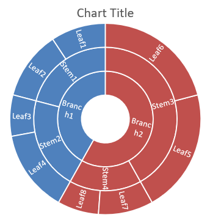

## **Översikt**

Den här artikeln förklarar hur du skapar och anpassar diagram med Aspose.Slides för Python via .NET. Du kommer att lära dig hur du lägger till ett diagram på en bild, fyller det med data och formaterar det för att matcha dina designkrav. Kodexemplen täcker skapande av presentationer och diagram, konfiguration av serier, axlar och förklaringar samt integration av diagramgenerering i dina applikationer.

## **Skapa ett diagram**

Diagram hjälper personer att snabbt visualisera data och få insikter som kanske inte är omedelbart uppenbara från en tabell eller ett kalkylblad.

**Varför skapa diagram?**

Med diagram kan du:

* samla, komprimera eller sammanfatta stora mängder data på en enda bild i en presentation;
* avslöja mönster och trender i data;
* härleda riktning och momentum för data över tid eller i förhållande till en specifik enhet;
* upptäcka avvikande värden, anomalier, fel och osammanhängande data;
* kommunicera eller presentera komplex data.

I PowerPoint kan du skapa diagram via funktionen *Infoga*, som erbjuder mallar för att designa många typer av diagram. Med Aspose.Slides kan du skapa både vanliga diagram (baserade på populära diagramtyper) och anpassade diagram.

{}
Använd [ChartType](https://reference.aspose.com/slides/python-net/aspose.slides.charts/charttype/)‑uppräkningen under [Aspose.Slides.Charts](https://reference.aspose.com/slides/python-net/aspose.slides.charts/)-namnutrymmet. Värdena i denna uppräkning motsvarar olika diagramtyper.
{}

### **Skapa gruppade stapeldiagram**

Detta avsnitt förklarar hur du skapar gruppade stapeldiagram med Aspose.Slides för Python via .NET. Du får lära dig att initiera en presentation, lägga till ett diagram och anpassa dess element som titel, data, serier, kategorier och stil. Följ stegen nedan för att se hur ett standardgrupperat stapeldiagram genereras:

1. Skapa en instans av [Presentation](https://reference.aspose.com/slides/python-net/aspose.slides/presentation/)-klassen.
1. Hämta en referens till en bild med dess index.
1. Lägg till ett diagram med någon data och ange typen `ChartType.CLUSTERED_COLUMN`.
1. Lägg till en titel på diagrammet.
1. Åtkomst till diagrammets datablad.
1. Rensa alla standardserier och -kategorier.
1. Lägg till nya serier och kategorier.
1. Lägg till ny diagramdata för diagramserierna.
1. Applicera en fyllningsfärg på diagramserierna.
1. Lägg till etiketter på diagramserierna.
1. Spara den ändrade presentationen som en PPTX‑fil.

Denna Python‑kod demonstrerar hur du skapar ett grupperat stapeldiagram:

```py
import aspose.slides.charts as charts
import aspose.slides as slides
import aspose.pydrawing as draw

# Instansiera Presentation-klassen som representerar en PPTX-fil.
with slides.Presentation() as presentation:

    # Åtkomst till den första bilden.
    slide = presentation.slides[0]

    # Lägg till ett grupperat stapeldiagram med dess standarddata.
    chart = slide.shapes.add_chart(charts.ChartType.CLUSTERED_COLUMN, 20, 20, 500, 300)

    # Sätt diagramtiteln.
    chart.chart_title.add_text_frame_for_overriding("Sample Title")
    chart.chart_title.text_frame_for_overriding.text_frame_format.center_text = slides.NullableBool.TRUE
    chart.chart_title.height = 20
    chart.has_title = True

    # Sätt indexet för diagrammets datablad.
    worksheet_index = 0

    # Hämta diagrammets dataarbok.
    workbook = chart.chart_data.chart_data_workbook

    # Ta bort de standardgenererade serierna och kategorierna.
    chart.chart_data.series.clear()
    chart.chart_data.categories.clear()

    # Lägg till nya serier.
    chart.chart_data.series.add(workbook.get_cell(worksheet_index, 0, 1, "Series 1"), chart.type)
    chart.chart_data.series.add(workbook.get_cell(worksheet_index, 0, 2, "Series 2"), chart.type)

    # Lägg till nya kategorier.
    chart.chart_data.categories.add(workbook.get_cell(worksheet_index, 1, 0, "Category 1"))
    chart.chart_data.categories.add(workbook.get_cell(worksheet_index, 2, 0, "Category 2"))
    chart.chart_data.categories.add(workbook.get_cell(worksheet_index, 3, 0, "Category 3"))

    # Hämta den första diagramserien.
    series = chart.chart_data.series[0]

    # Fyll i seriedatan.
    series.data_points.add_data_point_for_bar_series(workbook.get_cell(worksheet_index, 1, 1, 20))
    series.data_points.add_data_point_for_bar_series(workbook.get_cell(worksheet_index, 2, 1, 50))
    series.data_points.add_data_point_for_bar_series(workbook.get_cell(worksheet_index, 3, 1, 30))

    # Ställ in fyllningsfärgen för serien.
    series.format.fill.fill_type = slides.FillType.SOLID
    series.format.fill.solid_fill_color.color = draw.Color.red

    # Hämta den andra diagramserien.
    series = chart.chart_data.series[1]

    # Fyll i seriedatan.
    series.data_points.add_data_point_for_bar_series(workbook.get_cell(worksheet_index, 1, 2, 30))
    series.data_points.add_data_point_for_bar_series(workbook.get_cell(worksheet_index, 2, 2, 10))
    series.data_points.add_data_point_for_bar_series(workbook.get_cell(worksheet_index, 3, 2, 60))

    # Ställ in fyllningsfärgen för serien.
    series.format.fill.fill_type = slides.FillType.SOLID
    series.format.fill.solid_fill_color.color = draw.Color.green

    # Ställ in den första etiketten för att visa kategorinamnet.
    label = series.data_points[0].label
    label.data_label_format.show_category_name = True

    label = series.data_points[1].label
    label.data_label_format.show_series_name = True

    # Ställ in serien för att visa värdet för den tredje etiketten.
    label = series.data_points[2].label
    label.data_label_format.show_value = True
    label.data_label_format.show_series_name = True
    label.data_label_format.separator = "/"
                
    # Spara presentationen till disk som en PPTX-fil.
    presentation.save("ClusteredColumnChart.pptx", slides.export.SaveFormat.PPTX)
```

Resultatet:


### **Skapa spridningsdiagram**

Spridningsdiagram (även kända som spridningsplottar eller x‑y‑grafer) används ofta för att kontrollera mönster eller demonstrera korrelationer mellan två variabler.

Använd ett spridningsdiagram när:

* du har parade numeriska data;
* du har två variabler som passar bra ihop;
* du vill avgöra om de två variablerna är relaterade;
* du har en oberoende variabel som har flera värden för en beroende variabel.

Denna Python‑kod visar hur du skapar ett spridningsdiagram med olika markörer för varje serie:

```py
import aspose.slides.charts as charts
import aspose.slides as slides
import aspose.pydrawing as draw

# Instansiera Presentation-klassen.
with slides.Presentation() as presentation:

    # Åtkomst till den första bilden.
    slide = presentation.slides[0]

    # Skapa standard spridningsdiagram.
    chart = slide.shapes.add_chart(charts.ChartType.SCATTER_WITH_SMOOTH_LINES, 20, 20, 500, 300)

    # Sätt indexet för diagrammets datablad.
    worksheet_index = 0

    # Hämta diagrammets dataarbok.
    workbook = chart.chart_data.chart_data_workbook

    # Ta bort standardserien.
    chart.chart_data.series.clear()

    # Lägg till nya serier.
    chart.chart_data.series.add(workbook.get_cell(worksheet_index, 1, 1, "Series 1"), chart.type)
    chart.chart_data.series.add(workbook.get_cell(worksheet_index, 1, 3, "Series 2"), chart.type)

    # Hämta den första diagramserien.
    series = chart.chart_data.series[0]

    # Lägg till en ny punkt (1:3) till serien.
    series.data_points.add_data_point_for_scatter_series(workbook.get_cell(worksheet_index, 2, 1, 1), workbook.get_cell(worksheet_index, 2, 2, 3))

    # Lägg till en ny punkt (2:10).
    series.data_points.add_data_point_for_scatter_series(workbook.get_cell(worksheet_index, 3, 1, 2), workbook.get_cell(worksheet_index, 3, 2, 10))

    # Ändra serietypen.
    series.type = charts.ChartType.SCATTER_WITH_STRAIGHT_LINES_AND_MARKERS

    # Ändra diagramseriens markör.
    series.marker.size = 10
    series.marker.symbol = charts.MarkerStyleType.STAR

    # Hämta den andra diagramserien.
    series = chart.chart_data.series[1]

    # Lägg till en ny punkt (5:2) till diagramserien.
    series.data_points.add_data_point_for_scatter_series(workbook.get_cell(worksheet_index, 2, 3, 5), workbook.get_cell(worksheet_index, 2, 4, 2))

    # Lägg till en ny punkt (3:1).
    series.data_points.add_data_point_for_scatter_series(workbook.get_cell(worksheet_index, 3, 3, 3), workbook.get_cell(worksheet_index, 3, 4, 1))

    # Lägg till en ny punkt (2:2).
    series.data_points.add_data_point_for_scatter_series(workbook.get_cell(worksheet_index, 4, 3, 2), workbook.get_cell(worksheet_index, 4, 4, 2))

    # Lägg till en ny punkt (5:1).
    series.data_points.add_data_point_for_scatter_series(workbook.get_cell(worksheet_index, 5, 3, 5), workbook.get_cell(worksheet_index, 5, 4, 1))

    # Ändra diagramseriens markör.
    series.marker.size = 10
    series.marker.symbol = charts.MarkerStyleType.CIRCLE

    presentation.save("ScatterChart.pptx", slides.export.SaveFormat.PPTX)
```

Resultatet:


### **Skapa cirkeldiagram**

Cirkeldiagram används bäst för att visa förhållandet del‑till‑helhet i data, särskilt när data innehåller kategoriska etiketter med numeriska värden. Om dina data innehåller många delar eller etiketter kan det vara bättre att överväga ett stapeldiagram.

1. Skapa en instans av [Presentation](https://reference.aspose.com/slides/python-net/aspose.slides/presentation/)-klassen.
1. Hämta en referens till en bild med dess index.
1. Lägg till ett diagram med standarddata och ange typen `ChartType.PIE`.
1. Åtkomst till diagrammets datarbok ([ChartDataWorkbook](https://reference.aspose.com/slides/python-net/aspose.slides.charts/chartdataworkbook/)).
1. Rensa standardserier och -kategorier.
1. Lägg till nya serier och kategorier.
1. Lägg till ny diagramdata för diagramserierna.
1. Lägg till nya punkter för diagrammet och applicera anpassade färger på cirkeldiagrammets sektorer.
1. Ställ in etiketter för serierna.
1. Aktivera ledarlinjer för serieetiketterna.
1. Ställ in rotationsvinkeln för cirkeldiagrammet.
1. Spara den ändrade presentationen som en PPTX‑fil.

Denna Python‑kod visar hur du skapar ett cirkeldiagram:

```py
import aspose.slides.charts as charts
import aspose.slides as slides
import aspose.pydrawing as draw

# Instansiera Presentation-klassen som representerar en PPTX-fil.
with slides.Presentation() as presentation:

    # Åtkomst till den första bilden.
    slide = presentation.slides[0]

    # Lägg till ett diagram med dess standarddata.
    chart = slide.shapes.add_chart(charts.ChartType.PIE, 20, 20, 500, 300)

    # Sätt diagramtiteln.
    chart.chart_title.add_text_frame_for_overriding("Sample Title")
    chart.chart_title.text_frame_for_overriding.text_frame_format.center_text = slides.NullableBool.TRUE
    chart.chart_title.height = 20
    chart.has_title = True

    # Sätt indexet för diagrammets datablad.
    worksheet_index = 0

    # Hämta diagrammets dataarbok.
    workbook = chart.chart_data.chart_data_workbook

    # Ta bort de standardgenererade serierna och kategorierna.
    chart.chart_data.series.clear()
    chart.chart_data.categories.clear()

    # Lägg till nya kategorier.
    chart.chart_data.categories.add(workbook.get_cell(0, 1, 0, "First Qtr"))
    chart.chart_data.categories.add(workbook.get_cell(0, 2, 0, "2nd Qtr"))
    chart.chart_data.categories.add(workbook.get_cell(0, 3, 0, "3rd Qtr"))

    # Lägg till nya serier.
    series = chart.chart_data.series.add(workbook.get_cell(0, 0, 1, "Series 1"), chart.type)

    # Fyll i seriedatan.
    series.data_points.add_data_point_for_pie_series(workbook.get_cell(worksheet_index, 1, 1, 20))
    series.data_points.add_data_point_for_pie_series(workbook.get_cell(worksheet_index, 2, 1, 50))
    series.data_points.add_data_point_for_pie_series(workbook.get_cell(worksheet_index, 3, 1, 30))

    # Ställ in sektorens färg.
    chart.chart_data.series_groups[0].is_color_varied = True

    point = series.data_points[0]
    point.format.fill.fill_type = slides.FillType.SOLID
    point.format.fill.solid_fill_color.color = draw.Color.cyan

    # Ställ in sektorens kant.
    point.format.line.fill_format.fill_type = slides.FillType.SOLID
    point.format.line.fill_format.solid_fill_color.color = draw.Color.gray
    point.format.line.width = 3.0
    point.format.line.style = slides.LineStyle.THIN_THICK
    point.format.line.dash_style = slides.LineDashStyle.DASH_DOT

    point1 = series.data_points[1]
    point1.format.fill.fill_type = slides.FillType.SOLID
    point1.format.fill.solid_fill_color.color = draw.Color.brown

    # Ställ in sektorens kant.
    point1.format.line.fill_format.fill_type = slides.FillType.SOLID
    point1.format.line.fill_format.solid_fill_color.color = draw.Color.blue
    point1.format.line.width = 3.0
    point1.format.line.style = slides.LineStyle.SINGLE
    point1.format.line.dash_style = slides.LineDashStyle.LARGE_DASH_DOT

    point2 = series.data_points[2]
    point2.format.fill.fill_type = slides.FillType.SOLID
    point2.format.fill.solid_fill_color.color = draw.Color.coral

    # Ställ in sektorens kant.
    point2.format.line.fill_format.fill_type = slides.FillType.SOLID
    point2.format.line.fill_format.solid_fill_color.color = draw.Color.red
    point2.format.line.width = 2.0
    point2.format.line.style = slides.LineStyle.THIN_THIN
    point2.format.line.dash_style = slides.LineDashStyle.LARGE_DASH_DOT_DOT

    # Skapa anpassade etiketter för varje kategori i den nya serien.
    label1 = series.data_points[0].label

    label1.data_label_format.show_value = True

    label2 = series.data_points[1].label
    label2.data_label_format.show_value = True
    label2.data_label_format.show_legend_key = True
    label2.data_label_format.show_percentage = True

    label3 = series.data_points[2].label
    label3.data_label_format.show_series_name = True
    label3.data_label_format.show_percentage = True

    # Ställ in serien för att visa ledarlinjer i diagrammet.
    series.labels.default_data_label_format.show_leader_lines = True

    # Ställ in rotationsvinkeln för cirkeldiagrammets sektorer.
    chart.chart_data.series_groups[0].first_slice_angle = 180

    # Spara presentationen till disk som en PPTX-fil.
    presentation.save("PieChart.pptx", slides.export.SaveFormat.PPTX)
```

Resultatet:


### **Skapa linjediagram**

Linjediagram (även kända som linjediagram) används bäst när du vill demonstrera förändringar i värde över tid. Med ett linjediagram kan du jämföra en stor mängd data på en gång, spåra förändringar och trender över tid, framhäva avvikelser i dataserier och mer.

1. Skapa en instans av [Presentation](https://reference.aspose.com/slides/python-net/aspose.slides/presentation/)-klassen.
1. Hämta en referens till en bild med dess index.
1. Lägg till ett diagram med standarddata och ange typen `ChartType.LINE`.
1. Spara den ändrade presentationen som en PPTX‑fil.

Denna Python‑kod visar hur du skapar ett linjediagram:

```python
import aspose.slides as slides

with slides.Presentation() as presentation:
    line_chart = presentation.slides[0].shapes.add_chart(slides.charts.ChartType.LINE, 20, 20, 500, 300)
    
    presentation.save("LineChart.pptx", slides.export.SaveFormat.PPTX)
```

Som standard är punkterna i ett linjediagram sammankopplade med raka, kontinuerliga linjer. Om du vill att punkterna ska kopplas ihop med streck istället kan du ange önskad strecktyp så här:

```python
import aspose.slides as slides

with slides.Presentation() as presentation:
    line_chart = presentation.slides[0].shapes.add_chart(slides.charts.ChartType.LINE, 10, 50, 600, 350)

    for series in line_chart.chart_data.series:
        series.format.line.dash_style = slides.LineDashStyle.DASH

    presentation.save("LineChart.pptx", slides.export.SaveFormat.PPTX)
```

Resultatet:


### **Skapa trädkartsdiagram**

Trädkartsdiagram används bäst för försäljningsdata när du vill visa den relativa storleken på datakategorier och snabbt rikta uppmärksamheten mot de poster som är stora bidragsgivare inom varje kategori.

1. Skapa en instans av [Presentation](https://reference.aspose.com/slides/python-net/aspose.slides/presentation/)-klassen.
1. Hämta en referens till en bild med dess index.
1. Lägg till ett diagram med standarddata och ange typen `ChartType.TREEMAP`.
1. Åtkomst till diagrammets datarbok ([ChartDataWorkbook](https://reference.aspose.com/slides/python-net/aspose.slides.charts/chartdataworkbook/)).
1. Rensa standardserier och -kategorier.
1. Lägg till nya serier och kategorier.
1. Lägg till ny diagramdata för diagramserierna.
1. Spara den ändrade presentationen som en PPTX‑fil.

Denna Python‑kod visar hur du skapar ett trädkartsdiagram:

```py
import aspose.slides.charts as charts
import aspose.slides as slides
import aspose.pydrawing as draw

with slides.Presentation() as presentation:
    chart = presentation.slides[0].shapes.add_chart(charts.ChartType.TREEMAP, 20, 20, 500, 300)
    chart.chart_data.categories.clear()
    chart.chart_data.series.clear()

    workbook = chart.chart_data.chart_data_workbook
    workbook.clear(0)

    # Gren 1
    leaf = chart.chart_data.categories.add(workbook.get_cell(0, "C1", "Leaf1"))
    leaf.grouping_levels.set_grouping_item(1, "Stem1")
    leaf.grouping_levels.set_grouping_item(2, "Branch1")

    chart.chart_data.categories.add(workbook.get_cell(0, "C2", "Leaf2"))

    leaf = chart.chart_data.categories.add(workbook.get_cell(0, "C3", "Leaf3"))
    leaf.grouping_levels.set_grouping_item(1, "Stem2")

    chart.chart_data.categories.add(workbook.get_cell(0, "C4", "Leaf4"))

    # Gren 2
    leaf = chart.chart_data.categories.add(workbook.get_cell(0, "C5", "Leaf5"))
    leaf.grouping_levels.set_grouping_item(1, "Stem3")
    leaf.grouping_levels.set_grouping_item(2, "Branch2")

    chart.chart_data.categories.add(workbook.get_cell(0, "C6", "Leaf6"))

    leaf = chart.chart_data.categories.add(workbook.get_cell(0, "C7", "Leaf7"))
    leaf.grouping_levels.set_grouping_item(1, "Stem4")

    chart.chart_data.categories.add(workbook.get_cell(0, "C8", "Leaf8"))

    series = chart.chart_data.series.add(charts.ChartType.TREEMAP)
    series.labels.default_data_label_format.show_category_name = True
    series.data_points.add_data_point_for_treemap_series(workbook.get_cell(0, "D1", 4))
    series.data_points.add_data_point_for_treemap_series(workbook.get_cell(0, "D2", 5))
    series.data_points.add_data_point_for_treemap_series(workbook.get_cell(0, "D3", 3))
    series.data_points.add_data_point_for_treemap_series(workbook.get_cell(0, "D4", 6))
    series.data_points.add_data_point_for_treemap_series(workbook.get_cell(0, "D5", 9))
    series.data_points.add_data_point_for_treemap_series(workbook.get_cell(0, "D6", 9))
    series.data_points.add_data_point_for_treemap_series(workbook.get_cell(0, "D7", 4))
    series.data_points.add_data_point_for_treemap_series(workbook.get_cell(0, "D8", 3))

    series.parent_label_layout = charts.ParentLabelLayoutType.OVERLAPPING

    presentation.save("TreeMap.pptx", slides.export.SaveFormat.PPTX)
```

Resultatet:


### **Skapa börsdiagram**

Börsdiagram används för att visa finansiella data såsom öppnings-, högsta-, lägsta- och stängningspriser, vilket hjälper till att analysera marknadstrender och volatilitet. De ger viktiga insikter om aktiens prestanda och stödjer investerare och analytiker i att fatta välgrundade beslut.

1. Skapa en instans av [Presentation](https://reference.aspose.com/slides/python-net/aspose.slides/presentation/)-klassen.
1. Hämta en referens till en bild med dess index.
1. Lägg till ett diagram med standarddata och ange typen `ChartType.OPEN_HIGH_LOW_CLOSE`.
1. Åtkomst till diagrammets datarbok ([ChartDataWorkbook](https://reference.aspose.com/slides/python-net/aspose.slides.charts/chartdataworkbook/)).
1. Rensa standardserier och -kategorier.
1. Lägg till nya serier och kategorier.
1. Lägg till ny diagramdata för diagramserierna.
1. Ange format för hög‑låg‑linjer.
1. Spara den ändrade presentationen som en PPTX‑fil.

Denna Python‑kod visar hur du skapar ett börsdiagram:

```py
import aspose.slides.charts as charts
import aspose.slides as slides
import aspose.pydrawing as draw

with slides.Presentation() as presentation:
    chart = presentation.slides[0].shapes.add_chart(charts.ChartType.OPEN_HIGH_LOW_CLOSE, 20, 20, 500, 300, False)

    chart.chart_data.series.clear()
    chart.chart_data.categories.clear()

    workbook = chart.chart_data.chart_data_workbook

    chart.chart_data.categories.add(workbook.get_cell(0, 1, 0, "A"))
    chart.chart_data.categories.add(workbook.get_cell(0, 2, 0, "B"))
    chart.chart_data.categories.add(workbook.get_cell(0, 3, 0, "C"))

    chart.chart_data.series.add(workbook.get_cell(0, 0, 1, "Open"), chart.type)
    chart.chart_data.series.add(workbook.get_cell(0, 0, 2, "High"), chart.type)
    chart.chart_data.series.add(workbook.get_cell(0, 0, 3, "Low"), chart.type)
    chart.chart_data.series.add(workbook.get_cell(0, 0, 4, "Close"), chart.type)

    series = chart.chart_data.series[0]

    series.data_points.add_data_point_for_stock_series(workbook.get_cell(0, 1, 1, 72))
    series.data_points.add_data_point_for_stock_series(workbook.get_cell(0, 2, 1, 25))
    series.data_points.add_data_point_for_stock_series(workbook.get_cell(0, 3, 1, 38))

    series = chart.chart_data.series[1]
    series.data_points.add_data_point_for_stock_series(workbook.get_cell(0, 1, 2, 172))
    series.data_points.add_data_point_for_stock_series(workbook.get_cell(0, 2, 2, 57))
    series.data_points.add_data_point_for_stock_series(workbook.get_cell(0, 3, 2, 57))

    series = chart.chart_data.series[2]
    series.data_points.add_data_point_for_stock_series(workbook.get_cell(0, 1, 3, 12))
    series.data_points.add_data_point_for_stock_series(workbook.get_cell(0, 2, 3, 12))
    series.data_points.add_data_point_for_stock_series(workbook.get_cell(0, 3, 3, 13))

    series = chart.chart_data.series[3]
    series.data_points.add_data_point_for_stock_series(workbook.get_cell(0, 1, 4, 25))
    series.data_points.add_data_point_for_stock_series(workbook.get_cell(0, 2, 4, 38))
    series.data_points.add_data_point_for_stock_series(workbook.get_cell(0, 3, 4, 50))

    chart.chart_data.series_groups[0].up_down_bars.has_up_down_bars = True
    chart.chart_data.series_groups[0].hi_low_lines_format.line.fill_format.fill_type = slides.FillType.SOLID

    for ser in chart.chart_data.series:
        ser.format.line.fill_format.fill_type = slides.FillType.NO_FILL

    presentation.save("StockChart.pptx", slides.export.SaveFormat.PPTX)
```

Resultatet:


### **Skapa låd- och whisker‑diagram**

Låddiagram och whisker‑diagram används för att visa fördelningen av data genom att sammanfatta viktiga statistiska mått, såsom median, kvartiler och potentiella avvikande värden. De är särskilt användbara vid utforskande dataanalys och statistiska studier för att snabbt förstå dataspridning och identifiera avvikelser.

1. Skapa en instans av [Presentation](https://reference.aspose.com/slides/python-net/aspose.slides/presentation/)-klassen.
1. Hämta en referens till en bild med dess index.
1. Lägg till ett diagram med standarddata och ange typen `ChartType.BOX_AND_WHISKER`.
1. Åtkomst till diagrammets datarbok ([ChartDataWorkbook](https://reference.aspose.com/slides/python-net/aspose.slides.charts/chartdataworkbook/)).
1. Rensa standardserier och -kategorier.
1. Lägg till nya serier och kategorier.
1. Lägg till ny diagramdata för diagramserierna.
1. Spara den ändrade presentationen som en PPTX‑fil.

Denna Python‑kod visar hur du skapar ett låd‑ och whisker‑diagram:

```py
import aspose.slides.charts as charts
import aspose.slides as slides
import aspose.pydrawing as draw

with slides.Presentation() as presentation:
    chart = presentation.slides[0].shapes.add_chart(charts.ChartType.BOX_AND_WHISKER, 20, 20, 500, 300)
    chart.chart_data.categories.clear()
    chart.chart_data.series.clear()

    workbook = chart.chart_data.chart_data_workbook
    workbook.clear(0)

    chart.chart_data.categories.add(workbook.get_cell(0, "A1", "Category 1"))
    chart.chart_data.categories.add(workbook.get_cell(0, "A2", "Category 1"))
    chart.chart_data.categories.add(workbook.get_cell(0, "A3", "Category 1"))
    chart.chart_data.categories.add(workbook.get_cell(0, "A4", "Category 1"))
    chart.chart_data.categories.add(workbook.get_cell(0, "A5", "Category 1"))
    chart.chart_data.categories.add(workbook.get_cell(0, "A6", "Category 1"))

    series = chart.chart_data.series.add(charts.ChartType.BOX_AND_WHISKER)

    series.quartile_method = charts.QuartileMethodType.EXCLUSIVE
    series.show_mean_line = True
    series.show_mean_markers = True
    series.show_inner_points = True
    series.show_outlier_points = True

    series.data_points.add_data_point_for_box_and_whisker_series(workbook.get_cell(0, "B1", 15))
    series.data_points.add_data_point_for_box_and_whisker_series(workbook.get_cell(0, "B2", 41))
    series.data_points.add_data_point_for_box_and_whisker_series(workbook.get_cell(0, "B3", 16))
    series.data_points.add_data_point_for_box_and_whisker_series(workbook.get_cell(0, "B4", 10))
    series.data_points.add_data_point_for_box_and_whisker_series(workbook.get_cell(0, "B5", 23))
    series.data_points.add_data_point_for_box_and_whisker_series(workbook.get_cell(0, "B6", 16))

    presentation.save("BoxAndWhiskerChart.pptx", slides.export.SaveFormat.PPTX)
```

### **Skapa tratt‑diagram**

Tratt‑diagram används för att visualisera processer med sekventiella steg, där datavolymen minskar när den går från ett steg till nästa. De är särskilt hjälpsamma för att analysera konverteringsgrader, identifiera flaskhalsar och följa effektiviteten i försäljnings‑ eller marknadsföringsprocesser.

1. Skapa en instans av [Presentation](https://reference.aspose.com/slides/python-net/aspose.slides/presentation/)-klassen.
1. Hämta en referens till en bild med dess index.
1. Lägg till ett diagram med standarddata och ange typen `ChartType.FUNNEL`.
1. Spara den ändrade presentationen som en PPTX‑fil.

Denna Python‑kod visar hur du skapar ett tratt‑diagram:

```py
import aspose.slides.charts as charts
import aspose.slides as slides
import aspose.pydrawing as draw

with slides.Presentation() as presentation:
    chart = presentation.slides[0].shapes.add_chart(charts.ChartType.FUNNEL, 50, 50, 500, 400)
    chart.chart_data.categories.clear()
    chart.chart_data.series.clear()

    workbook = chart.chart_data.chart_data_workbook
    workbook.clear(0)

    chart.chart_data.categories.add(workbook.get_cell(0, "A1", "Category 1"))
    chart.chart_data.categories.add(workbook.get_cell(0, "A2", "Category 2"))
    chart.chart_data.categories.add(workbook.get_cell(0, "A3", "Category 3"))
    chart.chart_data.categories.add(workbook.get_cell(0, "A4", "Category 4"))
    chart.chart_data.categories.add(workbook.get_cell(0, "A5", "Category 5"))
    chart.chart_data.categories.add(workbook.get_cell(0, "A6", "Category 6"))

    series = chart.chart_data.series.add(charts.ChartType.FUNNEL)

    series.data_points.add_data_point_for_funnel_series(workbook.get_cell(0, "B1", 50))
    series.data_points.add_data_point_for_funnel_series(workbook.get_cell(0, "B2", 100))
    series.data_points.add_data_point_for_funnel_series(workbook.get_cell(0, "B3", 200))
    series.data_points.add_data_point_for_funnel_series(workbook.get_cell(0, "B4", 300))
    series.data_points.add_data_point_for_funnel_series(workbook.get_cell(0, "B5", 400))
    series.data_points.add_data_point_for_funnel_series(workbook.get_cell(0, "B6", 500))

    presentation.save("FunnelChart.pptx", slides.export.SaveFormat.PPTX)
```

Resultatet:


### **Skapa sol‑diagram**

Sol‑diagram används för att visualisera hierarkisk data, där nivåerna visas som koncentriska ringar. De hjälper till att illustrera del‑till‑helhetsförhållanden och är idealiska för att representera nästlade kategorier och underkategorier på ett tydligt och kompakt sätt.

1. Skapa en instans av [Presentation](https://reference.aspose.com/slides/python-net/aspose.slides/presentation/)-klassen.
1. Hämta en referens till en bild med dess index.
1. Lägg till ett diagram med standarddata och ange typen `ChartType.SUNBURST`.
1. Spara den ändrade presentationen som en PPTX‑fil.

Denna Python‑kod visar hur du skapar ett sol‑diagram:

```py
import aspose.slides.charts as charts
import aspose.slides as slides
import aspose.pydrawing as draw

with slides.Presentation() as presentation:
    chart = presentation.slides[0].shapes.add_chart(charts.ChartType.SUNBURST, 20, 20, 500, 300)
    chart.chart_data.categories.clear()
    chart.chart_data.series.clear()

    workbook = chart.chart_data.chart_data_workbook
    workbook.clear(0)

    # Gren 1
    leaf = chart.chart_data.categories.add(workbook.get_cell(0, "C1", "Leaf1"))
    leaf.grouping_levels.set_grouping_item(1, "Stem1")
    leaf.grouping_levels.set_grouping_item(2, "Branch1")

    chart.chart_data.categories.add(workbook.get_cell(0, "C2", "Leaf2"))

    leaf = chart.chart_data.categories.add(workbook.get_cell(0, "C3", "Leaf3"))
    leaf.grouping_levels.set_grouping_item(1, "Stem2")

    chart.chart_data.categories.add(workbook.get_cell(0, "C4", "Leaf4"))

    # Gren 2
    leaf = chart.chart_data.categories.add(workbook.get_cell(0, "C5", "Leaf5"))
    leaf.grouping_levels.set_grouping_item(1, "Stem3")
    leaf.grouping_levels.set_grouping_item(2, "Branch2")

    chart.chart_data.categories.add(workbook.get_cell(0, "C6", "Leaf6"))

    leaf = chart.chart_data.categories.add(workbook.get_cell(0, "C7", "Leaf7"))
    leaf.grouping_levels.set_grouping_item(1, "Stem4")

    chart.chart_data.categories.add(workbook.get_cell(0, "C8", "Leaf8"))

    series = chart.chart_data.series.add(charts.ChartType.SUNBURST)
    series.labels.default_data_label_format.show_category_name = True
    series.data_points.add_data_point_for_sunburst_series(workbook.get_cell(0, "D1", 4))
    series.data_points.add_data_point_for_sunburst_series(workbook.get_cell(0, "D2", 5))
    series.data_points.add_data_point_for_sunburst_series(workbook.get_cell(0, "D3", 3))
    series.data_points.add_data_point_for_sunburst_series(workbook.get_cell(0, "D4", 6))
    series.data_points.add_data_point_for_sunburst_series(workbook.get_cell(0, "D5", 9))
    series.data_points.add_data_point_for_sunburst_series(workbook.get_cell(0, "D6", 9))
    series.data_points.add_data_point_for_sunburst_series(workbook.get_cell(0, "D7", 4))
    series.data_points.add_data_point_for_sunburst_series(workbook.get_cell(0, "D8", 3))

    presentation.save("SunburstChart.pptx", slides.export.SaveFormat.PPTX)
```

Resultatet:



### **Skapa histogram‑diagram**

Histogram‑diagram används för att representera fördelningen av numerisk data genom att gruppera värden i intervall eller korgar. De är särskilt användbara för att identifiera datamönster såsom frekvens, skevhet och spridning samt för att upptäcka avvikande värden i en datamängd.

1. Skapa en instans av [Presentation](https://reference.aspose.com/slides/python-net/aspose.slides/presentation/)-klassen.
1. Hämta en referens till en bild med dess index.
1. Lägg till ett diagram med någon data och ange typen `ChartType.HISTOGRAM`.
1. Åtkomst till diagrammets datarbok ([ChartDataWorkbook](https://reference.aspose.com/slides/python-net/aspose.slides.charts/chartdataworkbook/)).
1. Rensa standardserier och -kategorier.
1. Lägg till en ny serie och fyll den med datapunkter. Ett histogram har inga kategorier; korgarna beräknas från värdena.
1. Spara den ändrade presentationen som en PPTX‑fil.

Denna Python‑kod visar hur du skapar ett histogram‑diagram:

```py
import aspose.slides.charts as charts
import aspose.slides as slides
import aspose.pydrawing as draw

with slides.Presentation() as presentation:
    chart = presentation.slides[0].shapes.add_chart(charts.ChartType.HISTOGRAM, 20, 20, 500, 300)
    chart.chart_data.categories.clear()
    chart.chart_data.series.clear()

    workbook = chart.chart_data.chart_data_workbook
    workbook.clear(0)

    series = chart.chart_data.series.add(charts.ChartType.HISTOGRAM)
    series.data_points.add_data_point_for_histogram_series(workbook.get_cell(0, "A1", 15))
    series.data_points.add_data_point_for_histogram_series(workbook.get_cell(0, "A2", -41))
    series.data_points.add_data_point_for_histogram_series(workbook.get_cell(0, "A3", 16))
    series.data_points.add_data_point_for_histogram_series(workbook.get_cell(0, "A4", 10))
    series.data_points.add_data_point_for_histogram_series(workbook.get_cell(0, "A5", -23))
    series.data_points.add_data_point_for_histogram_series(workbook.get_cell(0, "A6", 16))

    chart.axes.horizontal_axis.aggregation_type = charts.AxisAggregationType.AUTOMATIC

    presentation.save("HistogramChart.pptx", slides.export.SaveFormat.PPTX)
```

Resultatet:


### **Skapa radar‑diagram**

Radar‑diagram används för att visa multivariata data i ett två‑dimensionellt format, vilket möjliggör enkel jämförelse av flera variabler samtidigt. De är särskilt användbara för att identifiera mönster, styrkor och svagheter över flera prestationsmått eller egenskaper.

1. Skapa en instans av [Presentation](https://reference.aspose.com/slides/python-net/aspose.slides/presentation/)-klassen.
1. Hämta en referens till en bild med dess index.
1. Lägg till ett diagram med någon data och ange typen `ChartType.RADAR`.
1. Spara den ändrade presentationen som en PPTX‑fil.

Denna Python‑kod visar hur du skapar ett radar‑diagram:

```python
import aspose.slides as slides

with slides.Presentation() as presentation:
    presentation.slides[0].shapes.add_chart(slides.charts.ChartType.RADAR, 20, 20, 500, 300)
    presentation.save("RadarChart.pptx", slides.export.SaveFormat.PPTX)
```

Resultatet:


### **Skapa fler‑kategoridiagram**

Fler‑kategoridiagram används för att visa data som involverar mer än en kategorisk gruppering, vilket låter dig jämföra värden över flera dimensioner samtidigt. De är särskilt hjälpsamma när du behöver analysera trender och relationer i komplexa, flerskiktsdatamängder.

1. Skapa en instans av [Presentation](https://reference.aspose.com/slides/python-net/aspose.slides/presentation/)-klassen.
1. Hämta en referens till en bild med dess index.
1. Lägg till ett diagram med standarddata och ange typen `ChartType.CLUSTERED_COLUMN`.
1. Åtkomst till diagrammets datarbok ([ChartDataWorkbook](https://reference.aspose.com/slides/python-net/aspose.slides.charts/chartdataworkbook/)).
1. Rensa standardserier och -kategorier.
1. Lägg till nya serier och kategorier.
1. Lägg till ny diagramdata för diagramserierna.
1. Spara den ändrade presentationen som en PPTX‑fil.

Denna Python‑kod visar hur du skapar ett fler‑kategoridiagram:

```py
import aspose.slides.charts as charts
import aspose.slides as slides
import aspose.pydrawing as draw

with slides.Presentation() as presentation:
    slide = presentation.slides[0]

    chart = presentation.slides[0].shapes.add_chart(charts.ChartType.CLUSTERED_COLUMN, 20, 20, 500, 300)
    chart.chart_data.series.clear()
    chart.chart_data.categories.clear()

    workbook = chart.chart_data.chart_data_workbook
    workbook.clear(0)

    worksheet_index = 0

    category = chart.chart_data.categories.add(workbook.get_cell(0, "c2", "A"))
    category.grouping_levels.set_grouping_item(1, "Group1")
    category = chart.chart_data.categories.add(workbook.get_cell(0, "c3", "B"))

    category = chart.chart_data.categories.add(workbook.get_cell(0, "c4", "C"))
    category.grouping_levels.set_grouping_item(1, "Group2")
    category = chart.chart_data.categories.add(workbook.get_cell(0, "c5", "D"))

    category = chart.chart_data.categories.add(workbook.get_cell(0, "c6", "E"))
    category.grouping_levels.set_grouping_item(1, "Group3")
    category = chart.chart_data.categories.add(workbook.get_cell(0, "c7", "F"))

    category = chart.chart_data.categories.add(workbook.get_cell(0, "c8", "G"))
    category.grouping_levels.set_grouping_item(1, "Group4")
    category = chart.chart_data.categories.add(workbook.get_cell(0, "c9", "H"))

    # Lägg till en serie.
    series = chart.chart_data.series.add(workbook.get_cell(0, "D1", "Series 1"), charts.ChartType.CLUSTERED_COLUMN)

    series.data_points.add_data_point_for_bar_series(workbook.get_cell(worksheet_index, "D2", 10))
    series.data_points.add_data_point_for_bar_series(workbook.get_cell(worksheet_index, "D3", 20))
    series.data_points.add_data_point_for_bar_series(workbook.get_cell(worksheet_index, "D4", 30))
    series.data_points.add_data_point_for_bar_series(workbook.get_cell(worksheet_index, "D5", 40))
    series.data_points.add_data_point_for_bar_series(workbook.get_cell(worksheet_index, "D6", 50))
    series.data_points.add_data_point_for_bar_series(workbook.get_cell(worksheet_index, "D7", 60))
    series.data_points.add_data_point_for_bar_series(workbook.get_cell(worksheet_index, "D8", 70))
    series.data_points.add_data_point_for_bar_series(workbook.get_cell(worksheet_index, "D9", 80))

    # Spara presentationen med diagrammet.
    presentation.save("MultiCategoryChart.pptx", slides.export.SaveFormat.PPTX)
```

Resultatet:


### **Skapa kart‑diagram**

Kart‑diagram används för att visualisera geografisk data genom att kartlägga information till specifika platser såsom länder, delstater eller städer. De är särskilt användbara för att analysera regionala trender, demografisk data och rumsliga fördelningar på ett tydligt och visuellt engagerande sätt.

Denna Python‑kod visar hur du skapar ett kart‑diagram:

```python
import aspose.slides as slides

with slides.Presentation() as presentation:
    chart = presentation.slides[0].shapes.add_chart(slides.charts.ChartType.MAP, 20, 20, 500, 300)
    presentation.save("mapChart.pptx", slides.export.SaveFormat.PPTX)
```

Resultatet:


### **Skapa kombinationsdiagram**

Ett kombinationsdiagram (eller kombidiagram) kombinerar två eller flera diagramtyper i ett enda diagram. Detta diagram låter dig framhäva, jämföra eller undersöka skillnader mellan två eller fler datamängder, vilket hjälper dig att identifiera relationer mellan dem.


Följande Python‑kod visar hur du skapar kombinationsdiagrammet som visas ovan i en PowerPoint‑presentation:

```python
import aspose.slides.charts as charts
import aspose.pydrawing as draw
import aspose.slides as slides

def create_combo_chart():
    with slides.Presentation() as presentation:
        chart = create_chart_with_first_series(presentation.slides[0])

        add_second_series_to_chart(chart)
        add_third_series_to_chart(chart)

        set_primary_axes_format(chart)
        set_secondary_axes_format(chart)

        presentation.save("combo-chart.pptx", slides.export.SaveFormat.PPTX)


def create_chart_with_first_series(slide):
    chart = slide.shapes.add_chart(charts.ChartType.CLUSTERED_COLUMN, 50, 50, 600, 400)

    # Ställ in diagramtiteln.
    chart.has_title = True
    chart.chart_title.add_text_frame_for_overriding("Chart Title")
    chart.chart_title.overlay = False
    title_paragraph = chart.chart_title.text_frame_for_overriding.paragraphs[0]
    title_format = title_paragraph.paragraph_format.default_portion_format

    title_format.font_bold = slides.NullableBool.FALSE
    title_format.font_height = 18

    # Ställ in diagramförklaringen.
    chart.legend.position = charts.LegendPositionType.BOTTOM
    chart.legend.text_format.portion_format.font_height = 12

    # Ta bort de standardgenererade serierna och kategorierna.
    chart.chart_data.series.clear()
    chart.chart_data.categories.clear()

    worksheet_index = 0
    workbook = chart.chart_data.chart_data_workbook

    # Lägg till nya kategorier.
    chart.chart_data.categories.add(workbook.get_cell(worksheet_index, 1, 0, "Category 1"))
    chart.chart_data.categories.add(workbook.get_cell(worksheet_index, 2, 0, "Category 2"))
    chart.chart_data.categories.add(workbook.get_cell(worksheet_index, 3, 0, "Category 3"))
    chart.chart_data.categories.add(workbook.get_cell(worksheet_index, 4, 0, "Category 4"))

    # Lägg till den första serien.
    series_name_cell = workbook.get_cell(worksheet_index, 0, 1, "Series 1")
    series = chart.chart_data.series.add(series_name_cell, chart.type)

    series.parent_series_group.overlap = -25
    series.parent_series_group.gap_width = 220

    series.data_points.add_data_point_for_bar_series(workbook.get_cell(worksheet_index, 1, 1, 4.3))
    series.data_points.add_data_point_for_bar_series(workbook.get_cell(worksheet_index, 2, 1, 2.5))
    series.data_points.add_data_point_for_bar_series(workbook.get_cell(worksheet_index, 3, 1, 3.5))
    series.data_points.add_data_point_for_bar_series(workbook.get_cell(worksheet_index, 4, 1, 4.5))

    return chart


def add_second_series_to_chart(chart):
    workbook = chart.chart_data.chart_data_workbook
    worksheet_index = 0

    series_name_cell = workbook.get_cell(worksheet_index, 0, 2, "Series 2")
    series = chart.chart_data.series.add(series_name_cell, charts.ChartType.CLUSTERED_COLUMN)

    series.parent_series_group.overlap = -25
    series.parent_series_group.gap_width = 220

    series.data_points.add_data_point_for_bar_series(workbook.get_cell(worksheet_index, 1, 2, 2.4))
    series.data_points.add_data_point_for_bar_series(workbook.get_cell(worksheet_index, 2, 2, 4.4))
    series.data_points.add_data_point_for_bar_series(workbook.get_cell(worksheet_index, 3, 2, 1.8))
    series.data_points.add_data_point_for_bar_series(workbook.get_cell(worksheet_index, 4, 2, 2.8))


def add_third_series_to_chart(chart):
    workbook = chart.chart_data.chart_data_workbook
    worksheet_index = 0

    series_name_cell = workbook.get_cell(worksheet_index, 0, 3, "Series 3")
    series = chart.chart_data.series.add(series_name_cell, charts.ChartType.LINE)

    series.data_points.add_data_point_for_line_series(workbook.get_cell(worksheet_index, 1, 3, 2.0))
    series.data_points.add_data_point_for_line_series(workbook.get_cell(worksheet_index, 2, 3, 2.0))
    series.data_points.add_data_point_for_line_series(workbook.get_cell(worksheet_index, 3, 3, 3.0))
    series.data_points.add_data_point_for_line_series(workbook.get_cell(worksheet_index, 4, 3, 5.0))

    series.plot_on_second_axis = True


def set_primary_axes_format(chart):
    # Ställ in den horisontella axeln.
    horizontal_axis = chart.axes.horizontal_axis
    horizontal_axis.text_format.portion_format.font_height = 12.0
    horizontal_axis.format.line.fill_format.fill_type = slides.FillType.NO_FILL

    set_axis_title(horizontal_axis, "X Axis")

    # Ställ in den vertikala axeln.
    vertical_axis = chart.axes.vertical_axis
    vertical_axis.text_format.portion_format.font_height = 12.0
    vertical_axis.format.line.fill_format.fill_type = slides.FillType.NO_FILL

    set_axis_title(vertical_axis, "Y Axis 1")

    # Ställ in färgen för den vertikala huvudrutnätslinjen.
    major_grid_lines_format = vertical_axis.major_grid_lines_format.line.fill_format
    major_grid_lines_format.fill_type = slides.FillType.SOLID
    major_grid_lines_format.solid_fill_color.color = draw.Color.from_argb(217, 217, 217)


def set_secondary_axes_format(chart):
    # Ställ in den sekundära horisontella axeln.
    secondary_horizontal_axis = chart.axes.secondary_horizontal_axis
    secondary_horizontal_axis.position = charts.AxisPositionType.BOTTOM
    secondary_horizontal_axis.cross_type = charts.CrossesType.MAXIMUM
    secondary_horizontal_axis.is_visible = False
    secondary_horizontal_axis.major_grid_lines_format.line.fill_format.fill_type = slides.FillType.NO_FILL
    secondary_horizontal_axis.minor_grid_lines_format.line.fill_format.fill_type = slides.FillType.NO_FILL

    # Ställ in den sekundära vertikala axeln.
    secondary_vertical_axis = chart.axes.secondary_vertical_axis
    secondary_vertical_axis.position = charts.AxisPositionType.RIGHT
    secondary_vertical_axis.text_format.portion_format.font_height = 12.0
    secondary_vertical_axis.format.line.fill_format.fill_type = slides.FillType.NO_FILL
    secondary_vertical_axis.major_grid_lines_format.line.fill_format.fill_type = slides.FillType.NO_FILL
    secondary_vertical_axis.minor_grid_lines_format.line.fill_format.fill_type = slides.FillType.NO_FILL

    set_axis_title(secondary_vertical_axis, "Y Axis 2")


def set_axis_title(axis, axis_title):
    axis.has_title = True
    axis.title.overlay = False
    title_portion_format = axis.title.add_text_frame_for_overriding(axis_title).paragraphs[0].paragraph_format.default_portion_format
    title_portion_format.font_bold = slides.NullableBool.FALSE
    title_portion_format.font_height = 12.0
```

## **Uppdatera diagram**

Aspose.Slides för Python via .NET låter dig uppdatera diagramdata, formatering och styling för att hålla dina PowerPoint‑presentationer aktuella.

1. Skapa en instans av [Presentation](https://reference.aspose.com/slides/python-net/aspose.slides/presentation/)-klassen för att öppna presentationen som innehåller diagrammet.
1. Hämta en referens till en bild med dess index.
1. Gå igenom alla former för att hitta diagrammet.
1. Åtkomst till diagrammets datablad.
1. Ändra diagramseriens data genom att byta serienvärden.
1. Lägg till en ny serie och fyll i dess data.
1. Spara den ändrade presentationen som en PPTX‑fil.

Denna Python‑kod visar hur du uppdaterar ett diagram:

```py
import aspose.slides.charts as charts
import aspose.slides as slides
import aspose.pydrawing as draw

chart_name = "My chart"

# Instansiera Presentation-klassen som representerar en PPTX-fil.
with slides.Presentation("ExistingChart.pptx") as presentation:

    # Åtkomst till den första bilden.
    slide = presentation.slides[0]

    for shape in slide.shapes:
        if isinstance(shape, charts.Chart) and shape.name == chart_name:
            chart = shape

            # Sätt indexet för diagrammets datablad.
            worksheet_index = 0

            # Hämta diagrammets dataarbok.
            workbook = chart.chart_data.chart_data_workbook

            # Ändra diagrammets kategorinamn.
            workbook.get_cell(worksheet_index, 1, 0, "Modified Category 1")
            workbook.get_cell(worksheet_index, 2, 0, "Modified Category 2")

            # Hämta den första diagramserien.
            series = chart.chart_data.series[0]

            # Uppdatera seriedatan.
            workbook.get_cell(worksheet_index, 0, 1, "New_Series1")  # Modifierar seriens namn.
            series.data_points[0].value.data = 90
            series.data_points[1].value.data = 123
            series.data_points[2].value.data = 44

            # Hämta den andra diagramserien.
            series = chart.chart_data.series[1]

            # Uppdatera seriedatan.
            workbook.get_cell(worksheet_index, 0, 2, "New_Series2")  # Modifierar seriens namn.
            series.data_points[0].value.data = 23
            series.data_points[1].value.data = 67
            series.data_points[2].value.data = 99

            # Lägg till en ny serie.
            series = chart.chart_data.series.add(workbook.get_cell(worksheet_index, 0, 3, "Series 3"), chart.type)

            # Fyll i seriedatan.
            series.data_points.add_data_point_for_bar_series(workbook.get_cell(worksheet_index, 1, 3, 20))
            series.data_points.add_data_point_for_bar_series(workbook.get_cell(worksheet_index, 2, 3, 50))
            series.data_points.add_data_point_for_bar_series(workbook.get_cell(worksheet_index, 3, 3, 30))

            chart.type = charts.ChartType.CLUSTERED_CYLINDER

            # Spara presentationen med diagrammet.
            presentation.save("ModifiedChart.pptx", slides.export.SaveFormat.PPTX)
```

## **Ange dataområde för ett diagram**

För att inspektera området som redan används av ett befintligt diagram, se [Retrieve a Chart's Data Range](/slides/sv/python-net/chart-workbook/#retrieve-a-charts-data-range).

Aspose.Slides för Python via .NET låter dig använda ett specifikt arbetsbladområde som datakälla för ett diagram. Detta styr vilka celler som levererar diagrammets serier och kategorier och låter dig uppdatera diagrammet så att det återspeglar förändringar i arbetsbladet.

1. Skapa en instans av [Presentation](https://reference.aspose.com/slides/python-net/aspose.slides/presentation/)-klassen för att öppna presentationen som innehåller diagrammet.
1. Hämta en referens till en bild med dess index.
1. Gå igenom alla former för att hitta diagrammet.
1. Åtkomst till diagramdata och ange intervallet.
1. Spara den ändrade presentationen som en PPTX‑fil.

Denna Python‑kod visar hur du anger dataområde för ett diagram:

```py
import aspose.slides.charts as charts
import aspose.slides as slides
import aspose.pydrawing as draw

chart_name = "My chart"

# Instansiera Presentation-klassen som representerar en PPTX-fil.
with slides.Presentation("ExistingChart.pptx") as presentation:

    # Åtkomst till den första bilden.
    slide = presentation.slides[0]

    for shape in slide.shapes:
        if isinstance(shape, charts.Chart) and shape.name == chart_name:
            chart = shape
            chart.chart_data.set_range("Sheet1!A1:B4")

    presentation.save("DataRange.pptx", slides.export.SaveFormat.PPTX)
```

## **Använd standardmarkörer i diagram**

När du använder standardmarkörer i diagram får varje diagramserie automatiskt en annan markörsymbol.

Denna Python‑kod visar hur du automatiskt sätter en diagramseriemarkör:

```py
import aspose.slides.charts as charts
import aspose.slides as slides
import aspose.pydrawing as draw

with slides.Presentation() as presentation:
    slide = presentation.slides[0]
    chart = slide.shapes.add_chart(charts.ChartType.LINE_WITH_MARKERS, 10, 10, 400, 400)

    chart.chart_data.series.clear()
    chart.chart_data.categories.clear()

    workbook = chart.chart_data.chart_data_workbook

    series = chart.chart_data.series.add(workbook.get_cell(0, 0, 1, "Series 1"), chart.type)

    chart.chart_data.categories.add(workbook.get_cell(0, 1, 0, "C1"))
    series.data_points.add_data_point_for_line_series(workbook.get_cell(0, 1, 1, 24))

    chart.chart_data.categories.add(workbook.get_cell(0, 2, 0, "C2"))
    series.data_points.add_data_point_for_line_series(workbook.get_cell(0, 2, 1, 23))

    chart.chart_data.categories.add(workbook.get_cell(0, 3, 0, "C3"))
    series.data_points.add_data_point_for_line_series(workbook.get_cell(0, 3, 1, -10))

    chart.chart_data.categories.add(workbook.get_cell(0, 4, 0, "C4"))
    series.data_points.add_data_point_for_line_series(workbook.get_cell(0, 4, 1, None))

    series2 = chart.chart_data.series.add(workbook.get_cell(0, 0, 2, "Series 2"), chart.type)

    # Fyll i seriedatan.
    series2.data_points.add_data_point_for_line_series(workbook.get_cell(0, 1, 2, 30))
    series2.data_points.add_data_point_for_line_series(workbook.get_cell(0, 2, 2, 10))
    series2.data_points.add_data_point_for_line_series(workbook.get_cell(0, 3, 2, 60))
    series2.data_points.add_data_point_for_line_series(workbook.get_cell(0, 4, 2, 40))

    chart.has_legend = True
    chart.legend.overlay = False

    presentation.save("DefaultMarkersInChart.pptx", slides.export.SaveFormat.PPTX)
```

## **FAQ**

**Vilka diagramtyper stöds av Aspose.Slides för Python via .NET?**

Aspose.Slides för Python via .NET stöder ett brett urval av diagramtyper, inklusive stapel, linje, cirkel, area, spridning, histogram, radar och många fler. Denna flexibilitet gör att du kan välja den mest lämpliga diagramtypen för dina data­visualiseringsbehov.

**Hur lägger jag till ett nytt diagram på en bild?**

För att lägga till ett diagram skapar du först en instans av [Presentation](https://reference.aspose.com/slides/python-net/aspose.slides/presentation/)-klassen, hämtar den önskade bilden med dess index och anropar sedan metoden för att lägga till ett diagram, där du specificerar diagramtyp och initial data. Detta integrerar diagrammet direkt i din presentation.

**Hur kan jag uppdatera data som visas i ett diagram?**

Du kan uppdatera ett diagrams data genom att få åtkomst till dess datarbok ([ChartDataWorkbook](https://reference.aspose.com/slides/python-net/aspose.slides.charts/chartdataworkbook/)), rensa eventuella standardserier och -kategorier och sedan lägga till dina egna data. Detta möjliggör programmatisk uppdatering av diagrammet så att det speglar den senaste informationen.

**Är det möjligt att anpassa diagrammets utseende?**

Ja, Aspose.Slides för Python via .NET erbjuder omfattande anpassningsmöjligheter. Du kan ändra färger, teckensnitt, etiketter, förklaringar och andra formaterings‑element för att skräddarsy diagrammets utseende efter dina specifika designkrav.