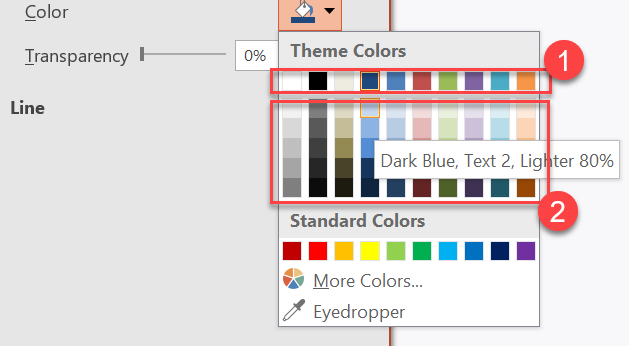

## **Introduktion**

Ett presentationstema definierar egenskaperna för dess designelement. När du väljer ett tema väljer du en samordnad uppsättning visuella element och deras egenskaper.

I PowerPoint innehåller ett tema färger, [typsnitt](/slides/sv/python-net/powerpoint-fonts/), [bakgrundsstilar](/slides/sv/python-net/presentation-background/), och effekter.


## **Ändra temafärgen**

Ett PowerPoint‑tema använder en specifik uppsättning färger för olika element på en bild. Om du inte gillar standardvärdena kan du ändra dem genom att tillämpa nya temafärger. För att låta dig välja en ny temafärg tillhandahåller Aspose.Slides värden i uppräkningen [SchemeColor](https://reference.aspose.com/slides/sv/python-net/aspose.slides/schemecolor/) .

```python
import aspose.pydrawing as draw
import aspose.slides as slides

with slides.Presentation() as presentation:
    slide = presentation.slides[0]

    shape = slide.shapes.add_auto_shape(slides.ShapeType.RECTANGLE, 10, 10, 100, 100)
    shape.fill_format.fill_type = slides.FillType.SOLID
    shape.fill_format.solid_fill_color.scheme_color = slides.SchemeColor.ACCENT4
```

Du kan bestämma det effektiva värdet för den resulterande färgen på följande sätt:

```python
fill_effective = shape.fill_format.get_effective()
print("{0} ({1})".format(fill_effective.solid_fill_color.name, fill_effective.solid_fill_color))

# Exempelutdata:
#
# ff8064a2 (Färg [A=255, R=128, G=100, B=162])
```

För att ytterligare demonstrera färgändringen skapar vi ett annat element, tilldelar det accentfärgen från det första steget och uppdaterar sedan temafärgen.

```python
other_shape = slide.shapes.add_auto_shape(slides.ShapeType.RECTANGLE, 10, 120, 100, 100)
other_shape.fill_format.fill_type = slides.FillType.SOLID
other_shape.fill_format.solid_fill_color.scheme_color = slides.SchemeColor.ACCENT4

presentation.master_theme.color_scheme.accent4.color = draw.Color.red
```

Den nya färgen tillämpas automatiskt på båda elementen.

### **Ställ in en temafärg från den extra paletten**

När du tillämpar luminans‑transformeringar på huvudtemafärgen (1) genereras färger från den extra paletten (2). Du kan sedan sätta och hämta dessa temafärger.



**1** — Huvudtemafärger  
**2** — Färger från den extra paletten  

Denna Python‑kod visar hur färger från den extra paletten härleds från huvudtemafärgen och sedan används i former:

```python
import aspose.slides as slides

with slides.Presentation() as presentation:
    slide = presentation.slides[0]

    # Accent 4
    shape1 = slide.shapes.add_auto_shape(slides.ShapeType.RECTANGLE, 10, 10, 50, 50)

    shape1.fill_format.fill_type = slides.FillType.SOLID
    shape1.fill_format.solid_fill_color.scheme_color = slides.SchemeColor.ACCENT4

    # Accent 4, Ljusare 80%
    shape2 = slide.shapes.add_auto_shape(slides.ShapeType.RECTANGLE, 10, 70, 50, 50)

    shape2.fill_format.fill_type = slides.FillType.SOLID
    shape2.fill_format.solid_fill_color.scheme_color = slides.SchemeColor.ACCENT4
    shape2.fill_format.solid_fill_color.color_transform.add(slides.ColorTransformOperation.MULTIPLY_LUMINANCE, 0.2)
    shape2.fill_format.solid_fill_color.color_transform.add(slides.ColorTransformOperation.ADD_LUMINANCE, 0.8)

    # Accent 4, Ljusare 60%
    shape3 = slide.shapes.add_auto_shape(slides.ShapeType.RECTANGLE, 10, 130, 50, 50)

    shape3.fill_format.fill_type = slides.FillType.SOLID
    shape3.fill_format.solid_fill_color.scheme_color = slides.SchemeColor.ACCENT4
    shape3.fill_format.solid_fill_color.color_transform.add(slides.ColorTransformOperation.MULTIPLY_LUMINANCE, 0.4)
    shape3.fill_format.solid_fill_color.color_transform.add(slides.ColorTransformOperation.ADD_LUMINANCE, 0.6)

    # Accent 4, Ljusare 40%
    shape4 = slide.shapes.add_auto_shape(slides.ShapeType.RECTANGLE, 10, 190, 50, 50)

    shape4.fill_format.fill_type = slides.FillType.SOLID
    shape4.fill_format.solid_fill_color.scheme_color = slides.SchemeColor.ACCENT4
    shape4.fill_format.solid_fill_color.color_transform.add(slides.ColorTransformOperation.MULTIPLY_LUMINANCE, 0.6)
    shape4.fill_format.solid_fill_color.color_transform.add(slides.ColorTransformOperation.ADD_LUMINANCE, 0.4)

    # Accent 4, Mörkare 25%
    shape5 = slide.shapes.add_auto_shape(slides.ShapeType.RECTANGLE, 10, 250, 50, 50)

    shape5.fill_format.fill_type = slides.FillType.SOLID
    shape5.fill_format.solid_fill_color.scheme_color = slides.SchemeColor.ACCENT4
    shape5.fill_format.solid_fill_color.color_transform.add(slides.ColorTransformOperation.MULTIPLY_LUMINANCE, 0.75)

    # Accent 4, Mörkare 50%
    shape6 = slide.shapes.add_auto_shape(slides.ShapeType.RECTANGLE, 10, 310, 50, 50)

    shape6.fill_format.fill_type = slides.FillType.SOLID
    shape6.fill_format.solid_fill_color.scheme_color = slides.SchemeColor.ACCENT4
    shape6.fill_format.solid_fill_color.color_transform.add(slides.ColorTransformOperation.MULTIPLY_LUMINANCE, 0.5)

    presentation.save("example.pptx", slides.export.SaveFormat.PPTX)
```

### **Mappa `SchemeColor` till `ColorScheme`‑färger**

När du arbetar med [SchemeColor](https://reference.aspose.com/slides/sv/python-net/aspose.slides/schemecolor/), kan du märka att den innehåller följande temafärgvärden:

`BACKGROUND1`, `BACKGROUND2`, `TEXT1` och `TEXT2`.

Men `Presentation.master_theme.color_scheme` returnerar [ColorScheme](https://reference.aspose.com/slides/sv/python-net/aspose.slides.theme/colorscheme/), som visar de motsvarande färgerna som:

`dark1`, `dark2`, `light1` och `light2`.

Denna skillnad är endast i namn. Dessa värden refererar till samma temafärgsplatser och mappningen är fast:

* `TEXT1` = `dark1`
* `BACKGROUND1` = `light1`
* `TEXT2` = `dark2`
* `BACKGROUND2` = `light2`

Det finns ingen dynamisk konvertering mellan `TEXT`/`BACKGROUND` och `dark`/`light`. De är helt enkelt alternativa namn för samma temafärger.

Denna namnskillnad kommer från Microsoft Office‑terminologi. Äldre Office‑versioner använde `Dark 1`, `Light 1`, `Dark 2` och `Light 2`, medan nyare UI‑versioner visar samma platser som `Text 1`, `Background 1`, `Text 2` och `Background 2`.

## **Ändra temats typsnitt**

För att låta dig välja typsnitt för teman och andra ändamål använder Aspose.Slides dessa speciella identifierare (liknande de i PowerPoint):

- **+mn-lt** — Kroppstypsnitt Latin (Minor Latin Font)
- **+mj-lt** — Rubriktypsnitt Latin (Major Latin Font)
- **+mn-ea** — Kroppstypsnitt Östasiatiskt (Minor East Asian Font)
- **+mj-ea** — Rubriktypsnitt Östasiatiskt (Major East Asian Font)

Denna Python‑kod visar hur du tilldelar Latin‑typsnittet till ett temaelement:

```python
portion = slides.Portion("Theme text format")
portion.portion_format.latin_font = slides.FontData("+mn-lt")

paragraph = slides.Paragraph()
paragraph.portions.add(portion)

shape = slide.shapes.add_auto_shape(slides.ShapeType.RECTANGLE, 10, 10, 100, 100)
shape.text_frame.paragraphs.add(paragraph)
```

Detta Python‑exempel visar hur du ändrar presentationens tematypsnitt:

```python
presentation.master_theme.font_scheme.minor.latin_font = slides.FontData("Arial")
```

Alla textrutor kommer att uppdateras till det nya typsnittet.

{}
För mer information, se [Master PowerPoint Fonts med Python](/slides/sv/python-net/powerpoint-fonts/).
{}

## **Ändra temats bakgrundsstil**

Som standard erbjuder PowerPoint 12 fördefinierade bakgrunder, men en typisk presentation sparar bara 3 av dem.


Till exempel, efter att du har sparat en presentation i PowerPoint kan du köra följande Python‑kod för att avgöra hur många fördefinierade bakgrunder den innehåller:

```python
with slides.Presentation() as presentation:
    number_of_background_fills = len(presentation.master_theme.format_scheme.background_fill_styles)
    print(f"Number of theme background fill styles: {number_of_background_fills}")
```

{}
Genom att använda egenskapen `background_fill_styles` från [FormatScheme](https://reference.aspose.com/slides/sv/python-net/aspose.slides.theme/formatscheme/)‑klassen kan du lägga till eller komma åt bakgrundsstilar i ett PowerPoint‑tema.
{}

Detta Python‑exempel visar hur du ställer in presentationens bakgrund:

```python
presentation.masters[0].background.style_index = 2  # 0 betyder ingen fyllning; indexering börjar på 1.
```

{}
För mer information, se [Hantera presentationsbakgrunder i Python](/slides/sv/python-net/presentation-background/).
{}

## **Ändra temaeffekterna**

Ett PowerPoint‑tema innehåller vanligtvis tre värden i varje stilarray. Dessa arrayer kombineras till tre effektnivåer: subtila, måttliga och intensiva. Till exempel, här är resultatet när dessa effekter appliceras på en specifik form:


Genom att använda de tre egenskaperna — `FillStyles`, `LineStyles` och `EffectStyles` — från [FormatScheme](https://reference.aspose.com/slides/sv/python-net/aspose.slides.theme/formatscheme/)‑klassen kan du modifiera temaelement (ännu mer flexibelt än i PowerPoint).

Denna Python‑kod visar hur du ändrar ett temaeffekt genom att förändra delar av dessa element:

```python
with slides.Presentation("sample.pptx") as presentation:
    presentation.master_theme.format_scheme.line_styles[0].fill_format.solid_fill_color.color = draw.Color.red
    presentation.master_theme.format_scheme.fill_styles[2].fill_type = slides.FillType.SOLID
    presentation.master_theme.format_scheme.fill_styles[2].solid_fill_color.color = draw.Color.forest_green
    presentation.master_theme.format_scheme.effect_styles[2].effect_format.outer_shadow_effect.distance = 10

    presentation.save("output.pptx", slides.export.SaveFormat.PPTX)
```

De resulterande ändringarna inkluderar uppdateringar av fyllningsfärgen, fyllningstypen, skuggeffekten och andra egenskaper:


## **FAQ**

**Kan jag applicera ett tema på en enskild bild utan att ändra mastern?**  
Ja. Aspose.Slides stödjer temaunderskrivningar på bildnivå, så du kan tillämpa ett lokalt tema på just den bilden samtidigt som huvudtemat förblir intakt (via [SlideThemeManager](https://reference.aspose.com/slides/sv/python-net/aspose.slides.theme/slidethememanager/)).

**Vad är det säkraste sättet att överföra ett tema från en presentation till en annan?**  
[Klona bilder](/slides/sv/python-net/clone-slides/) tillsammans med deras master till målpresentationen. Detta bevarar den ursprungliga mastern, layouterna och det associerade temat så att utseendet förblir konsekvent.

**Hur kan jag se de "effektiva" värdena efter all arv och överskrivningar?**  
Använd API:ets ["effective" views](/slides/sv/python-net/shape-effective-properties/) för tema/färg/typsnitt/effekt. Dessa returnerar de lösta, slutgiltiga egenskaperna efter att ha tillämpat mastern plus eventuella lokala överskrivningar.