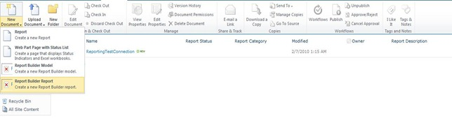

{} 

Nu när SharePoint är installerat och konfigurerat på RS‑servern och RS har konfigurerats via Reporting Services Configuration Manager, kan vi gå vidare till konfigurationen i Central Admin. RS 2008 R2 har förenklat denna process avsevärt. Tidigare behövde man gå igenom tre steg för att få det att fungera. Nu räcker ett steg. 

Vi ska gå till Central Administration‑webbplatsen och sedan till General Application Settings. Längst ner ser vi Reporting Services. 

{} 

**Figure 17**: SharePoint‑konfiguration 

{} 

Klicka på **Reporting Services Integration**. 

{} 
## **Web Service‑URL**
Vi anger URL‑en för Report Server som vi hittade i Reporting Services Configuration Manager. 
## **Autentiseringsläge**
Vi väljer också ett autentiseringsläge. Följande MSDN‑länk beskriver dessa i detalj. 
[Security Overview for Reporting Services in SharePoint Integrated Mode](https://docs.microsoft.com/en-us/previous-versions/sql/sql-server-2008-r2/bb283324(v=sql.105)) 

Kort sagt, om din webbplats använder **Claims Authentication** kommer du alltid att använda Trusted Authentication oavsett vad du väljer här. Om du vill skicka Windows‑uppgifter väljer du Windows Authentication. För Trusted Authentication skickar vi SPUser‑token och förlitar oss inte på Windows‑uppgifterna. 

Du bör också använda Trusted Authentication om du har konfigurerat dina Classic‑mode‑webbplatser för NTLM och RS är inställt på NTLM. Kerberos krävs för att använda Windows Authentication och för att vidarebefordra det till din datakälla. 

**Figure 18**: Inställning av autentiseringsuppgifter för Reporting Services Integration
## **Aktivera funktion**
Detta ger dig möjlighet att aktivera Reporting Services för alla webbplatskollektioner, eller så kan du välja vilka du vill aktivera den för. Det innebär i praktiken vilka webbplatser som kan använda Reporting Services. 
När det är klart bör du se följande figur. 

**Figure 19**: Lyckad integration av Reporting Services med SharePoint‑miljön 

När du går tillbaka till Report Server‑URL:en som visas i Figur 14 bör du se något liknande följande figur. 

**Figure 20**: Lyckad verifiering av Reporting Services med SharePoint‑miljön 

{} 

Om din SharePoint‑webbplats är konfigurerad för SSL visas den inte i den här listan. Det är ett känt problem och betyder inte att något är fel. Dina rapporter bör fortfarande fungera. 

{} 

Nu är vi redo att använda Reporting Services i SharePoint 2010. Precis som i den tidigare versionen har vi en funktion (aktiverad när vi konfigurerar Reporting Services Integration) i “Site Collection Feature”. Installationen lade också till tre innehållstyper som kan läggas till i vår webbplats. I Figur 21 kan vi se två av dessa innehållstyper som lagts till i ett dokumentbibliotek för att skapa en anpassad rapport, som vi ser i Figur 21. 

**Figure 21**: Report Builder 

“**Reporter Builder**” är en ActiveX‑kontroll som vi måste ladda ner till servern, vilket vi ser i Figur 22. 

**Figure 22**: Ladda ner och installera Report Builder 

När nedladdningen är klar kör du **Report Builder**. Nu är vi redo att designa vår första rapport, vilket vi ser i Figur 23. 

**Figure 23**: Report Builder – ny rapport‑genereringsguide 

Efter att vi har skapat rapporten kan vi spara den i det dokumentbibliotek som skapats för att lagra rapporterna i vår SharePoint 2010. 

Den andra innehållstypen används för att skapa delade anslutningar som datakälla och spara dem i ett dokumentbibliotek i SharePoint. Vi kan skapa ett dokumentbibliotek, lägga till den här innehållstypen och sedan ha våra anslutningar tillgängliga för att ändra datakällan för rapporterna. 

**Figure 24**: Lyckad export av rapport till Report Server