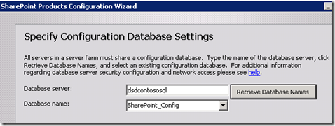

{} 

Så, vi behöver göra det vi gjorde för SharePoint WFE. Först måste vi gå igenom installationen av förutsättningarna och därefter starta SharePoint‑installationen. 

För installationen väljer vi Serverfarm och en fullständig installation för att matcha min SharePoint‑box, eftersom vi inte vill ha en fristående installation för SharePoint. 

{} 
### **SharePoint-konfiguration**
I SharePoint‑konfigurationsguiden vill vi ansluta till en befintlig farm. 

**Figur 13**: SharePoint‑konfigurationsguiden 

Vi pekar sedan på databasen **SharePoint_Config** som vår farm använder. Om du inte vet var den finns kan du ta reda på det via Central Admin under **Systeminställningar -> Hantera servrar i den här farmen.** 

**Figur 14**: SharePoint‑konfigurationsguiden 

**Figur 15**: SharePoint‑konfigurationsguiden 

När guiden är klar är det allt vi behöver göra på Report Server‑boxen för tillfället. När vi återgår till ReportServer‑URL:en kommer vi att se ett annat fel, men det beror på att vi inte har konfigurerat den via Central Administrator. 

**Figur 16**: Rapporteringsserverfel