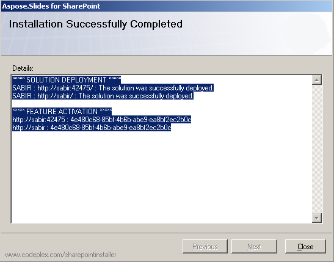

{} 

Aspose.Slides for SharePoint laddas ner som arkivet Aspose.Slides.SharePoint.zip. Arkivet innehåller: 

- **Aspose.Slides.SharePoint.wsp**: SharePoint‑lösningsfil. Aspose.Slides for SharePoint är paketerad som en SharePoint‑lösning för att underlätta aktivering och inaktivering i serverfarmens alla servrar.
- **Aspose_LicenseAgreement.rtf**: Slutanvändarens licensavtal.
- **Setup.exe**: Installationsprogrammet.
- **Setup.exe.config**: Installationskonfigurationsfilen.

{} 
## **Installationsprocess**
Innan installationen körs kontrollerar installationsprogrammet att:

- WSS 3.0 eller MOSS 2007 är installerat.
- Användaren har behörighet att installera SharePoint‑lösningar.
- SharePoint‑databasen är online.
- WSS Administration Service är startad.
- WSS Timer Service är startad.

WSS Administration‑ och Timer‑tjänsterna behövs eftersom vissa installationsåtgärder förlitar sig på ett timerjobb för att spridas till alla servrar i serverfarmens.

### **Kör installationen**
För att installera Aspose.Slides for SharePoint: 

1. Packa upp Aspose.Slides.SharePoint zip till den lokala enheten på MOSS 7.0‑ eller WSS 3.0‑servern.
2. Kör setup.exe och följ instruktionerna på skärmen. Installationsprogrammet utför följande åtgärder: 
   1. Kontrollerar installationsförutsättningarna. Installationen fortsätter inte om någon kontroll misslyckas. 

      **Kör en systemkontroll** 

3. Visar slutanvändarens licensavtal. Du måste godkänna avtalet för att fortsätta. 

   **EULA** 

4. Visar val av implementeringsmål. Väljer de webbapplikationer och webbplatssamlingar som funktionen ska aktiveras för. 

   **Välja implementeringsmål** 

5. Distribuerar funktionen till serverfarm. 

   **Installationsförloppsindikatorn** 

6. Aktiverar Aspose.Slides för de valda webbplatssamlingarna och konfigurerar deras överordnade webbapplikationer.
7. Visar en lista över webbapplikationer och webbplatssamlingar som funktionen har distribuerats till och aktiverats för. 

   **Lyckad installation** 

