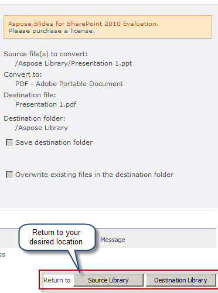

{} 

När Aspose.Slides for SharePoint är installerat på SharePoint‑servern läggs alternativet **Convert via Aspose.Slides.SharePoint** till i menyn för en presentation, som visas nedan: 

**Att installera Aspose.Slides för SharePoint lägger till alternativet Convert via Aspose.Slides i dokumentmenyer** 

{} 
## **Konvertera en presentation**
För att konvertera ett Microsoft PowerPoint‑dokument från ett SharePoint‑dokumentbibliotek: 

1. Välj ett Microsoft PowerPoint‑dokument i ett dokumentbibliotek.
2. Klicka på pilen nedåt för att visa en meny och klicka på **Convert via Aspose.Slides.SharePoint**. 

   **Meny för Presentation 2‑filen som visar alternativet Convert via Aspose.Slides** 

3. Välj önskat utdataformat i formuläret. Om du vill kan du ändra utdatafilens namn och destinationsmappen.
4. Klicka på **Convert** för att konvertera filen. 

   **Konverteringsformuläret låter dig välja filformat, namn och destination** 

5. När konverteringen är klar visas ett lyckat meddelande. 

   **Konverteringen lyckades** 

6. Klicka på **Source Library** (för att gå till källkatalogen) eller **Destination Library** (för att gå till katalogen där filen sparades). 

   Det konverterade dokumentet visas i dokumentbiblioteket. 

   **Det konverterade dokumentet visas i det bibliotek där det sparades** 

