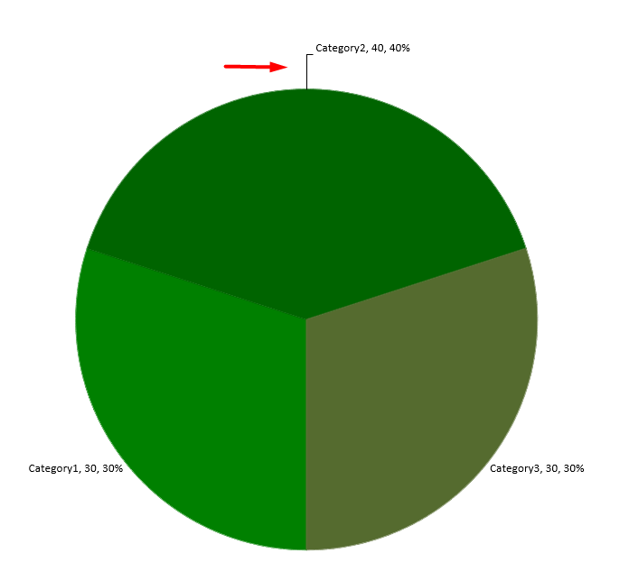

## **บทนำ**

ป้ายข้อมูลบนแผนภูมิแสดงรายละเอียดของชุดข้อมูลในแผนภูมิหรือจุดข้อมูลแต่ละจุด ช่วยให้ผู้อ่านสามารถระบุชุดข้อมูลได้อย่างรวดเร็วและทำให้แผนภูมิเข้าใจง่ายยิ่งขึ้น

## **ตั้งค่าความแม่นยำของข้อมูลในป้ายข้อมูลแผนภูมิ**

โค้ด Java นี้แสดงวิธีตั้งค่าความแม่นยำของข้อมูลในป้ายข้อมูลแผนภูมิ:

```java
Presentation pres = new Presentation();
try {
    IChart chart = pres.getSlides().get_Item(0).getShapes().addChart(ChartType.Line, 50, 50, 450, 300);
    
    chart.setDataTable(true);
    chart.getChartData().getSeries().get_Item(0).setNumberFormatOfValues("#,##0.00");

    pres.save("output.pptx",SaveFormat.Pptx);
} finally {
    if (pres != null) pres.dispose();
}
```

## **แสดงเปอร์เซ็นต์เป็นป้าย**

Aspose.Slides for Android ผ่าน Java ให้คุณตั้งค่าป้ายเปอร์เซ็นต์บนแผนภูมิที่แสดงอยู่ โค้ด Java นี้สาธิตการทำงาน:

```java
// สร้างอินสแตนซ์ของคลาส Presentation
Presentation pres = new Presentation();
try {
    // ดึงสไลด์แรก
    ISlide slide = pres.getSlides().get_Item(0);
    
    IChart chart = slide.getShapes().addChart(ChartType.StackedColumn, 20, 20, 400, 400);
    IChartSeries series;
    double[] total_for_Cat = new double[chart.getChartData().getCategories().size()];
    for (int k = 0; k < chart.getChartData().getCategories().size(); k++) {
        IChartCategory cat = chart.getChartData().getCategories().get_Item(k);
    
        for (int i = 0; i < chart.getChartData().getSeries().size(); i++) {
            total_for_Cat[k] = total_for_Cat[k] + (double) (chart.getChartData().getSeries().get_Item(i).getDataPoints().get_Item(k).getValue().getData());
        }
    }
    
    double dataPontPercent = 0f;
    for (int x = 0; x < chart.getChartData().getSeries().size(); x++) {
        series = chart.getChartData().getSeries().get_Item(x);
        series.getLabels().getDefaultDataLabelFormat().setShowLegendKey(false);
    
        for (int j = 0; j < series.getDataPoints().size(); j++) {
            IDataLabel lbl = series.getDataPoints().get_Item(j).getLabel();
            dataPontPercent = (double) ((series.getDataPoints().get_Item(j).getValue().getData())) / (double) (total_for_Cat[j]) * 100;
    
            IPortion port = new Portion();
            port.setText(String.format("{0:F2} %.2f", dataPontPercent));
            port.getPortionFormat().setFontHeight(8f);
            lbl.getTextFrameForOverriding().setText("");
            IParagraph para = lbl.getTextFrameForOverriding().getParagraphs().get_Item(0);
            para.getPortions().add(port);
    
            lbl.getDataLabelFormat().setShowSeriesName(false);
            lbl.getDataLabelFormat().setShowPercentage(false);
            lbl.getDataLabelFormat().setShowLegendKey(false);
            lbl.getDataLabelFormat().setShowCategoryName(false);
            lbl.getDataLabelFormat().setShowBubbleSize(false);
        }
    }
    
    // บันทึกงานนำเสนอที่มีแผนภูมิ
    pres.save("output.pptx", SaveFormat.Pptx);
} finally {
    if (pres != null) pres.dispose();
}
```

## **ตั้งสัญลักษณ์เปอร์เซ็นต์ในป้ายข้อมูลแผนภูมิ**

โค้ด Java นี้แสดงวิธีตั้งสัญลักษณ์เปอร์เซ็นต์สำหรับป้ายข้อมูลแผนภูมิ:

```java
// สร้างอินสแตนซ์ของคลาส Presentation
Presentation pres = new Presentation();
try {
    // ดึงอ้างอิงสไลด์ผ่านดัชนีของมัน
    ISlide slide = pres.getSlides().get_Item(0);
    
    // สร้างแผนภูมิ PercentsStackedColumn บนสไลด์
    IChart chart = slide.getShapes().addChart(ChartType.PercentsStackedColumn, 20, 20, 500, 400);
    
    // ตั้งค่าตัวแปร NumberFormatLinkedToSource เป็น false
    chart.getAxes().getVerticalAxis().setNumberFormatLinkedToSource(false);
    chart.getAxes().getVerticalAxis().setNumberFormat("0.00%");
    
    chart.getChartData().getSeries().clear();
    int defaultWorksheetIndex = 0;
    
    // ดึงเวิร์กชีตข้อมูลของแผนภูมิ
    IChartDataWorkbook workbook = chart.getChartData().getChartDataWorkbook();
    
    // เพิ่มซีรีส์ใหม่
    IChartSeries series = chart.getChartData().getSeries().add(workbook.getCell(defaultWorksheetIndex, 0, 1, "Reds"), chart.getType());
    series.getDataPoints().addDataPointForBarSeries(workbook.getCell(defaultWorksheetIndex, 1, 1, 0.30));
    series.getDataPoints().addDataPointForBarSeries(workbook.getCell(defaultWorksheetIndex, 2, 1, 0.50));
    series.getDataPoints().addDataPointForBarSeries(workbook.getCell(defaultWorksheetIndex, 3, 1, 0.80));
    series.getDataPoints().addDataPointForBarSeries(workbook.getCell(defaultWorksheetIndex, 4, 1, 0.65));
    
    // ตั้งค่าสีเติมของซีรีส์
    series.getFormat().getFill().setFillType(FillType.Solid);
    series.getFormat().getFill().getSolidFillColor().setColor(Color.RED);
    
    // ตั้งค่าคุณสมบัติของ LabelFormat
    series.getLabels().getDefaultDataLabelFormat().setShowValue(true);
    series.getLabels().getDefaultDataLabelFormat().setNumberFormatLinkedToSource(false);
    series.getLabels().getDefaultDataLabelFormat().setNumberFormat("0.0%");
    series.getLabels().getDefaultDataLabelFormat().getTextFormat().getPortionFormat().setFontHeight(10);
    series.getLabels().getDefaultDataLabelFormat().getTextFormat().getPortionFormat().getFillFormat().setFillType(FillType.Solid);
    series.getLabels().getDefaultDataLabelFormat().getTextFormat().getPortionFormat().getFillFormat().getSolidFillColor().setColor(Color.WHITE);
    series.getLabels().getDefaultDataLabelFormat().setShowValue(true);
    
    // เพิ่มซีรีส์ใหม่
    IChartSeries series2 = chart.getChartData().getSeries().add(workbook.getCell(defaultWorksheetIndex, 0, 2, "Blues"), chart.getType());
    series2.getDataPoints().addDataPointForBarSeries(workbook.getCell(defaultWorksheetIndex, 1, 2, 0.70));
    series2.getDataPoints().addDataPointForBarSeries(workbook.getCell(defaultWorksheetIndex, 2, 2, 0.50));
    series2.getDataPoints().addDataPointForBarSeries(workbook.getCell(defaultWorksheetIndex, 3, 2, 0.20));
    series2.getDataPoints().addDataPointForBarSeries(workbook.getCell(defaultWorksheetIndex, 4, 2, 0.35));
    
    // ตั้งค่าชนิดและสีการเติม
    series2.getFormat().getFill().setFillType(FillType.Solid);
    series2.getFormat().getFill().getSolidFillColor().setColor(Color.BLUE);
    series2.getLabels().getDefaultDataLabelFormat().setShowValue(true);
    series2.getLabels().getDefaultDataLabelFormat().setNumberFormatLinkedToSource(false);
    series2.getLabels().getDefaultDataLabelFormat().setNumberFormat("0.0%");
    series2.getLabels().getDefaultDataLabelFormat().getTextFormat().getPortionFormat().setFontHeight(10);
    series2.getLabels().getDefaultDataLabelFormat().getTextFormat().getPortionFormat().getFillFormat().setFillType(FillType.Solid);
    series2.getLabels().getDefaultDataLabelFormat().getTextFormat().getPortionFormat().getFillFormat().getSolidFillColor().setColor(Color.WHITE);
    
    // บันทึกงานนำเสนอลงดิสก์
    pres.save("SetDataLabelsPercentageSign_out.pptx", SaveFormat.Pptx);
} finally {
    if (pres != null) pres.dispose();
}
```

## **ตั้งระยะห่างของป้ายจากแกน**

โค้ด Java นี้แสดงวิธีตั้งระยะห่างของป้ายจากแกนหมวดหมู่เมื่อคุณทำงานกับแผนภูมิที่วางจากแกน:

```java
// สร้างอินสแตนซ์ของคลาส Presentation
Presentation pres = new Presentation();
try {
    // ดึงอ้างอิงสไลด์
    ISlide sld = pres.getSlides().get_Item(0);
    
    // สร้างแผนภูมิบนสไลด์
    IChart ch = sld.getShapes().addChart(ChartType.ClusteredColumn, 20, 20, 500, 300);
    
    // ตั้งค่าระยะห่างของป้ายจากแกน
    ch.getAxes().getHorizontalAxis().setLabelOffset(500);
    
    // บันทึกงานนำเสนอลงดิสก์
    pres.save("output.pptx", SaveFormat.Pptx);
} finally {
    if (pres != null) pres.dispose();
}
```

## **ปรับตำแหน่งป้าย**

เมื่อคุณสร้างแผนภูมิที่ไม่พึ่งพาแกนใด ๆ เช่น พายชาร์ต ป้ายข้อมูลของแผนภูมิอาจอยู่ใกล้ขอบมากเกินไป ในกรณีดังกล่าวคุณต้องปรับตำแหน่งของป้ายข้อมูลเพื่อให้เส้นนำ (leader lines) แสดงอย่างชัดเจน

โค้ด Java นี้แสดงวิธีปรับตำแหน่งป้ายบนพายชาร์ต:

```java
Presentation pres = new Presentation();
try {
    IChart chart = pres.getSlides().get_Item(0).getShapes().addChart(ChartType.Pie, 50, 50, 200, 200);

    IChartSeriesCollection series = chart.getChartData().getSeries();
    IDataLabel label = series.get_Item(0).getLabels().get_Item(0);

    label.getDataLabelFormat().setShowValue(true);
    label.getDataLabelFormat().setPosition(LegendDataLabelPosition.OutsideEnd);
    label.setX(0.71f);
    label.setY(0.04f);

    pres.save("pres.pptx", SaveFormat.Pptx);
} finally {
    if (pres != null) pres.dispose();
}
```



## **คำถามที่พบบ่อย**

**ฉันจะป้องกันไม่ให้ป้ายข้อมูลซ้อนทับกันในแผนภูมิที่แน่นได้อย่างไร?**

ผสานการวางป้ายอัตโนมัติ, เส้นนำ, และลดขนาดฟอนต์; หากจำเป็นให้ซ่อนบางฟิลด์ (เช่น หมวดหมู่) หรือแสดงป้ายเฉพาะจุดสุดขีด/สำคัญ

**ฉันจะปิดการแสดงป้ายเฉพาะค่าที่เป็นศูนย์, ลบ, หรือว่างได้อย่างไร?**

กรองจุดข้อมูลก่อนเปิดใช้งานป้ายและปิดการแสดงสำหรับค่าที่เป็น 0, ค่าลบ, หรือค่าที่หายไปตามกฎที่กำหนด

**ฉันจะทำให้สไตล์ของป้ายคงที่เมื่อส่งออกเป็น PDF/รูปภาพได้อย่างไร?**

ตั้งค่าแบบอักษร (family, size) อย่างชัดเจนและตรวจสอบว่าแบบอักษรพร้อมใช้งานบนด้านการเรนเดอร์เพื่อหลีกเลี่ยงการใช้ฟอนต์สำรอง