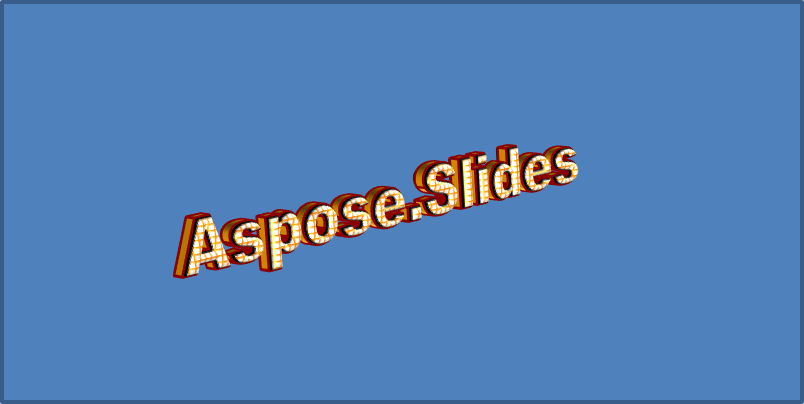

## **ภาพรวม**

WordArt effects ช่วยให้คุณจัดรูปแบบข้อความด้วยการเติมสี, เส้นขอบ, เงา, การสะท้อน, แสงเรืองแสง, การแปลงรูปแบบ, และการจัดรูปแบบ 3 มิติ บทความนี้อธิบายวิธีสร้างและปรับแต่งเอฟเฟกต์เหล่านี้ในงานนำเสนอ PowerPoint ด้วย Aspose.Slides for C++ โดยไม่ต้องติดตั้ง Microsoft Office

## **สร้างแม่แบบ WordArt อย่างง่ายและนำไปใช้กับข้อความ**

ตัวอย่างต่อไปนี้สร้างสไตล์ WordArt อย่างง่ายโดยกำหนดข้อความ, แบบอักษร, การเติมลวดลาย, และเส้นขอบ

แต่ละตัวอย่างสร้างการนำเสนอใหม่และเพิ่มสี่เหลี่ยมผืนผ้าลงในสไลด์แรก; ไม่ต้องใช้ไฟล์อินพุต ตัวอย่างแรกกำหนดข้อความเป็น "Aspose.Slides" ตำแหน่งและขนาดของรูปร่างจะวัดเป็นหน่วยจุด:

```cpp
#include <DOM/IAutoShape.h>
#include <DOM/IParagraph.h>
#include <DOM/IParagraphCollection.h>
#include <DOM/IPortion.h>
#include <DOM/IPortionCollection.h>
#include <DOM/IShapeCollection.h>
#include <DOM/ISlide.h>
#include <DOM/ITextFrame.h>
#include <DOM/Presentation.h>
#include <DOM/ShapeType.h>

using namespace Aspose::Slides;

auto presentation = System::MakeObject<Presentation>();
auto slide = presentation->get_Slide(0);

auto autoShape = slide->get_Shapes()->AddAutoShape(ShapeType::Rectangle, 20.0f, 20.0f, 400.0f, 200.0f);
auto textFrame = autoShape->get_TextFrame();

auto portion = textFrame->get_Paragraphs()->idx_get(0)->get_Portions()->idx_get(0);
portion->set_Text(u"Aspose.Slides");
```

ตั้งแบบอักษรเป็น Arial Black ขนาด 36 จุดเพื่อให้รูปแบบเด่นชัดขึ้น:

```cpp
#include <DOM/Fonts/FontData.h>
#include <DOM/IAutoShape.h>
#include <DOM/IParagraph.h>
#include <DOM/IParagraphCollection.h>
#include <DOM/IPortion.h>
#include <DOM/IPortionCollection.h>
#include <DOM/IPortionFormat.h>
#include <DOM/IShapeCollection.h>
#include <DOM/ISlide.h>
#include <DOM/ITextFrame.h>
#include <DOM/Presentation.h>
#include <DOM/ShapeType.h>

using namespace Aspose::Slides;

auto presentation = System::MakeObject<Presentation>();
auto slide = presentation->get_Slide(0);

auto autoShape = slide->get_Shapes()->AddAutoShape(ShapeType::Rectangle, 20.0f, 20.0f, 400.0f, 200.0f);
auto textFrame = autoShape->get_TextFrame();

auto portion = textFrame->get_Paragraphs()->idx_get(0)->get_Portions()->idx_get(0);
portion->set_Text(u"Aspose.Slides");

auto fontData = System::MakeObject<FontData>(u"Arial Black");
portion->get_PortionFormat()->set_LatinFont(fontData);
portion->get_PortionFormat()->set_FontHeight(36.0f);
```

ใช้ลายแบบ [SmallGrid](https://reference.aspose.com/slides/th/cpp/aspose.slides/patternstyle/) ที่มีสีพื้นหน้าเป็นสีส้มเข้มและพื้นหลังสีขาว จากนั้นเพิ่มเส้นขอบข้อความสีดำที่ความกว้าง 1 จุด:

```cpp
#include <DOM/Fonts/FontData.h>
#include <DOM/FillType.h>
#include <DOM/IAutoShape.h>
#include <DOM/IColorFormat.h>
#include <DOM/IFillFormat.h>
#include <DOM/ILineFillFormat.h>
#include <DOM/ILineFormat.h>
#include <DOM/IParagraph.h>
#include <DOM/IParagraphCollection.h>
#include <DOM/IPortion.h>
#include <DOM/IPortionCollection.h>
#include <DOM/IPortionFormat.h>
#include <DOM/IShapeCollection.h>
#include <DOM/ISlide.h>
#include <DOM/ITextFrame.h>
#include <DOM/IPatternFormat.h>
#include <DOM/PatternStyle.h>
#include <DOM/Presentation.h>
#include <DOM/ShapeType.h>
#include <drawing/color.h>

using namespace Aspose::Slides;
using namespace System::Drawing;

auto presentation = System::MakeObject<Presentation>();
auto slide = presentation->get_Slide(0);

auto autoShape = slide->get_Shapes()->AddAutoShape(ShapeType::Rectangle, 20.0f, 20.0f, 400.0f, 200.0f);
auto textFrame = autoShape->get_TextFrame();

auto portion = textFrame->get_Paragraphs()->idx_get(0)->get_Portions()->idx_get(0);
portion->set_Text(u"Aspose.Slides");

auto fontData = System::MakeObject<FontData>(u"Arial Black");
portion->get_PortionFormat()->set_LatinFont(fontData);
portion->get_PortionFormat()->set_FontHeight(36.0f);

auto fillFormat = portion->get_PortionFormat()->get_FillFormat();
fillFormat->set_FillType(FillType::Pattern);
fillFormat->get_PatternFormat()->get_ForeColor()->set_Color(Color::get_DarkOrange());
fillFormat->get_PatternFormat()->get_BackColor()->set_Color(Color::get_White());
fillFormat->get_PatternFormat()->set_PatternStyle(PatternStyle::SmallGrid);

portion->get_PortionFormat()->get_LineFormat()->set_Width(1);
auto lineFillFormat = portion->get_PortionFormat()->get_LineFormat()->get_FillFormat();
lineFillFormat->set_FillType(FillType::Solid);
lineFillFormat->get_SolidFillColor()->set_Color(Color::get_Black());
```

ข้อความที่ได้:


## **ใช้เอฟเฟกต์ WordArt อื่นๆ**

ตัวอย่างต่อไปนี้แสดงวิธีนำเอาเงา, การสะท้อน, แสงเรืองแสง, การแปลงรูปแบบ, และเอฟเฟกต์ 3 มิติ ไปใช้กับข้อความ

### **ใช้เอฟเฟกต์เงานอก**

เงานอกเพิ่มความลึกโดยวางเงาที่ด้านหลังข้อความ คุณสามารถปรับแต่งสี, ทิศทาง, ระยะทาง, รัศมีเบลอ, สเกล, และการเอียงของเงาได้

ตัวอย่างนี้เรียกใช้ [EnableOuterShadowEffect](https://reference.aspose.com/slides/th/cpp/aspose.slides/ieffectformat/enableoutershadoweffect/) และตั้งค่าเงาสีดำที่มีรัศมีเบลอ 4 จุด, ทิศทาง 230 องศา, ระยะ 30 จุด ค่าสเกล 100 จะรักษาขนาดเงาไว้, ขณะที่การเอียงแนวนอนทำให้เงาเอียง 20 องศา การแปลงอัลฟ่า ตั้งค่าความทึบที่ 32%:

```cpp
#include <DOM/Fonts/FontData.h>
#include <DOM/ColorTransformOperation.h>
#include <DOM/Effects/IOuterShadow.h>
#include <DOM/IAutoShape.h>
#include <DOM/IColorFormat.h>
#include <DOM/IColorOperationCollection.h>
#include <DOM/IEffectFormat.h>
#include <DOM/IParagraph.h>
#include <DOM/IParagraphCollection.h>
#include <DOM/IPortion.h>
#include <DOM/IPortionCollection.h>
#include <DOM/IPortionFormat.h>
#include <DOM/IShapeCollection.h>
#include <DOM/ISlide.h>
#include <DOM/ITextFrame.h>
#include <DOM/Presentation.h>
#include <DOM/ShapeType.h>
#include <drawing/color.h>

using namespace Aspose::Slides;
using namespace System::Drawing;

auto presentation = System::MakeObject<Presentation>();
auto slide = presentation->get_Slide(0);

auto autoShape = slide->get_Shapes()->AddAutoShape(ShapeType::Rectangle, 20.0f, 20.0f, 400.0f, 200.0f);
auto textFrame = autoShape->get_TextFrame();

auto portion = textFrame->get_Paragraphs()->idx_get(0)->get_Portions()->idx_get(0);
portion->set_Text(u"Aspose.Slides");

auto fontData = System::MakeObject<FontData>(u"Arial Black");
portion->get_PortionFormat()->set_LatinFont(fontData);
portion->get_PortionFormat()->set_FontHeight(36.0f);

auto effectFormat = portion->get_PortionFormat()->get_EffectFormat();
effectFormat->EnableOuterShadowEffect();

auto outerShadowEffect = effectFormat->get_OuterShadowEffect();
outerShadowEffect->get_ShadowColor()->set_Color(Color::get_Black());
outerShadowEffect->set_ScaleHorizontal(100);
outerShadowEffect->set_ScaleVertical(100);
outerShadowEffect->set_BlurRadius(4);
outerShadowEffect->set_Direction(230.0f);
outerShadowEffect->set_Distance(30);
outerShadowEffect->set_SkewHorizontal(20);
outerShadowEffect->set_SkewVertical(0);
outerShadowEffect->get_ShadowColor()->get_ColorTransform()->Add(ColorTransformOperation::SetAlpha, 0.32f);
```

ข้อความที่ได้:


{}
- เมื่อใช้เงานอกและเงาตั้งล่วงหน้าร่วมกัน จะใช้เฉพาะเงานอกเท่านั้น
- หากใช้เงานอกและเงาภายในพร้อมกัน ผลลัพธ์จะขึ้นกับเวอร์ชันของ PowerPoint ตัวอย่างเช่น ใน PowerPoint 2013 เอฟเฟกต์จะถูกเพิ่มเป็นสองเท่า ในขณะที่ใน PowerPoint 2007 จะใช้เฉพาะเงานอกเท่านั้น
{}

### **ใช้เอฟเฟกต์การสะท้อน**

การสะท้อนสร้างสำเนาแบบประทับของข้อความ ปรับตำแหน่ง, สเกล, เบลอ, และความทึบเพื่อควบคุมลักษณะการแสดงผล

ตัวอย่างนี้เรียกใช้ [EnableReflectionEffect](https://reference.aspose.com/slides/th/cpp/aspose.slides/ieffectformat/enablereflectioneffect/) และพลิกการสะท้อนในแนวตั้งโดยสเกล -100% ใช้รัศมีเบลอ 0.5 จุดและระยะ 4.72 จุด ความทึบลดลงจาก 60% ถึง 0.9% ระหว่างตำแหน่ง 0% ถึง 60% ของการสะท้อน:

```cpp
#include <DOM/Fonts/FontData.h>
#include <DOM/Effects/IReflection.h>
#include <DOM/IAutoShape.h>
#include <DOM/IEffectFormat.h>
#include <DOM/IParagraph.h>
#include <DOM/IParagraphCollection.h>
#include <DOM/IPortion.h>
#include <DOM/IPortionCollection.h>
#include <DOM/IPortionFormat.h>
#include <DOM/IShapeCollection.h>
#include <DOM/ISlide.h>
#include <DOM/ITextFrame.h>
#include <DOM/Presentation.h>
#include <DOM/RectangleAlignment.h>
#include <DOM/ShapeType.h>

using namespace Aspose::Slides;

auto presentation = System::MakeObject<Presentation>();
auto slide = presentation->get_Slide(0);

auto autoShape = slide->get_Shapes()->AddAutoShape(ShapeType::Rectangle, 20.0f, 20.0f, 400.0f, 200.0f);
auto textFrame = autoShape->get_TextFrame();

auto portion = textFrame->get_Paragraphs()->idx_get(0)->get_Portions()->idx_get(0);
portion->set_Text(u"Aspose.Slides");

auto fontData = System::MakeObject<FontData>(u"Arial Black");
portion->get_PortionFormat()->set_LatinFont(fontData);
portion->get_PortionFormat()->set_FontHeight(36.0f);

auto effectFormat = portion->get_PortionFormat()->get_EffectFormat();
effectFormat->EnableReflectionEffect();

auto reflectionEffect = effectFormat->get_ReflectionEffect();
reflectionEffect->set_BlurRadius(0.5);
reflectionEffect->set_Distance(4.72);
reflectionEffect->set_StartPosAlpha(0.f);
reflectionEffect->set_EndPosAlpha(60.f);
reflectionEffect->set_Direction(90.0f);
reflectionEffect->set_ScaleHorizontal(100);
reflectionEffect->set_ScaleVertical(-100);
reflectionEffect->set_StartReflectionOpacity(60.f);
reflectionEffect->set_EndReflectionOpacity(0.9f);
reflectionEffect->set_RectangleAlign(RectangleAlignment::BottomLeft);
```

ข้อความที่ได้:


### **ใช้เอฟเฟกต์แสงเรืองแสง**

แสงเรืองแสงเพิ่มเส้นขอบสีอ่อนรอบข้อความ ปรับสี, ความทึบ, และรัศมีเพื่อควบคุมเอฟเฟกต์

ตัวอย่างนี้เรียกใช้ [EnableGlowEffect](https://reference.aspose.com/slides/th/cpp/aspose.slides/ieffectformat/enablegloweffect/) และใช้แสงเรืองแสงสีแดงที่ความทึบ 54% และรัศมี 7 จุด:

```cpp
#include <drawing/color.h>
#include <DOM/Fonts/FontData.h>
#include <DOM/ColorTransformOperation.h>
#include <DOM/Effects/IGlow.h>
#include <DOM/IAutoShape.h>
#include <DOM/IColorFormat.h>
#include <DOM/IColorOperationCollection.h>
#include <DOM/IEffectFormat.h>
#include <DOM/IParagraph.h>
#include <DOM/IParagraphCollection.h>
#include <DOM/IPortion.h>
#include <DOM/IPortionCollection.h>
#include <DOM/IPortionFormat.h>
#include <DOM/IShapeCollection.h>
#include <DOM/ISlide.h>
#include <DOM/ITextFrame.h>
#include <DOM/Presentation.h>
#include <DOM/ShapeType.h>

using namespace Aspose::Slides;
using namespace System::Drawing;

auto presentation = System::MakeObject<Presentation>();
auto slide = presentation->get_Slide(0);

auto autoShape = slide->get_Shapes()->AddAutoShape(ShapeType::Rectangle, 20.0f, 20.0f, 400.0f, 200.0f);
auto textFrame = autoShape->get_TextFrame();

auto portion = textFrame->get_Paragraphs()->idx_get(0)->get_Portions()->idx_get(0);
portion->set_Text(u"Aspose.Slides");

auto fontData = System::MakeObject<FontData>(u"Arial Black");
portion->get_PortionFormat()->set_LatinFont(fontData);
portion->get_PortionFormat()->set_FontHeight(36.0f);

auto effectFormat = portion->get_PortionFormat()->get_EffectFormat();
effectFormat->EnableGlowEffect();

auto glowEffect = effectFormat->get_GlowEffect();
glowEffect->get_Color()->set_Color(Color::get_Red());
glowEffect->get_Color()->get_ColorTransform()->Add(ColorTransformOperation::SetAlpha, 0.54f);
glowEffect->set_Radius(7);
```

ข้อความที่ได้:


### **ใช้การแปลง WordArt**

การแปลง WordArt จะดัด, ยืด, หรือบิดบล็อกข้อความ

ตั้งค่า [ITextFrameFormat::set_Transform](https://reference.aspose.com/slides/th/cpp/aspose.slides/itextframeformat/set_transform/) เป็น [ArchUpPour](https://reference.aspose.com/slides/th/cpp/aspose.slides/textshapetype/) เพื่อโค้งกรอบข้อความทั้งหมดขึ้นด้านบน:

```cpp
#include <DOM/IAutoShape.h>
#include <DOM/IShapeCollection.h>
#include <DOM/ISlide.h>
#include <DOM/ITextFrame.h>
#include <DOM/ITextFrameFormat.h>
#include <DOM/Presentation.h>
#include <DOM/ShapeType.h>
#include <DOM/TextShapeType.h>

using namespace Aspose::Slides;

auto presentation = System::MakeObject<Presentation>();
auto slide = presentation->get_Slide(0);

auto autoShape = slide->get_Shapes()->AddAutoShape(ShapeType::Rectangle, 20.0f, 20.0f, 400.0f, 200.0f);

auto textFrame = autoShape->get_TextFrame();
textFrame->set_Text(u"Aspose.Slides");
textFrame->get_TextFrameFormat()->set_Transform(TextShapeType::ArchUpPour);
```

ข้อความที่ได้:


{}
Aspose.Slides for C++ มีชุดของ [ประเภทการแปลง](https://reference.aspose.com/slides/th/cpp/aspose.slides/textshapetype/) ที่กำหนดล่วงหน้า
{}

### **ใช้เอฟเฟกต์ 3 มิติกับรูปร่างและข้อความ**

คุณสามารถนำเอฟเฟกต์ 3 มิติไปใช้กับรูปร่างหรือข้อความของมันได้ การทำบีเวิล, การดันออก, แสงสว่าง, และการตั้งค่ากล้องจะควบคุมลักษณะที่ได้

ตัวอย่างต่อไปนี้ใช้ [IThreeDFormat](https://reference.aspose.com/slides/th/cpp/aspose.slides/ithreedformat/) เพื่อเพิ่มบีเวลแบบวงกลม, การดันออกสีส้ม, และเส้นขอบสีแดงเข้มให้กับสี่เหลี่ยมมิติ การวัดขนาดบีเวล, ความสูงการดันออก, ความกว้างเส้นขอบ, และความลึกทั้งหมดเป็นหน่วยจุด วัสดุพลาสติก, แสงสมดุลที่หมุน 40 องศารอบแกน Z, และกล้องแบบมุมมองทำให้รูปร่างมีลักษณะดังกล่าว:

```cpp
#include <DOM/BevelPresetType.h>
#include <DOM/CameraPresetType.h>
#include <DOM/IAutoShape.h>
#include <DOM/ICamera.h>
#include <DOM/IColorFormat.h>
#include <DOM/ILightRig.h>
#include <DOM/IShapeBevel.h>
#include <DOM/IShapeCollection.h>
#include <DOM/ISlide.h>
#include <DOM/ITextFrame.h>
#include <DOM/IThreeDFormat.h>
#include <DOM/LightRigPresetType.h>
#include <DOM/LightingDirection.h>
#include <DOM/MaterialPresetType.h>
#include <DOM/Presentation.h>
#include <DOM/ShapeType.h>
#include <drawing/color.h>

using namespace Aspose::Slides;
using namespace System::Drawing;

auto presentation = System::MakeObject<Presentation>();
auto slide = presentation->get_Slide(0);

auto autoShape = slide->get_Shapes()->AddAutoShape(ShapeType::Rectangle, 20.0f, 20.0f, 400.0f, 200.0f);
autoShape->get_TextFrame()->set_Text(u"Aspose.Slides");

auto threeDFormat = autoShape->get_ThreeDFormat();

threeDFormat->get_BevelBottom()->set_BevelType(BevelPresetType::Circle);
threeDFormat->get_BevelBottom()->set_Height(10.5);
threeDFormat->get_BevelBottom()->set_Width(10.5);

threeDFormat->get_BevelTop()->set_BevelType(BevelPresetType::Circle);
threeDFormat->get_BevelTop()->set_Height(12.5);
threeDFormat->get_BevelTop()->set_Width(11);

threeDFormat->get_ExtrusionColor()->set_Color(Color::get_Orange());
threeDFormat->set_ExtrusionHeight(6);

threeDFormat->get_ContourColor()->set_Color(Color::get_DarkRed());
threeDFormat->set_ContourWidth(1.5);

threeDFormat->set_Depth(3);

threeDFormat->set_Material(MaterialPresetType::Plastic);

threeDFormat->get_LightRig()->set_Direction(LightingDirection::Top);
threeDFormat->get_LightRig()->set_LightType(LightRigPresetType::Balanced);
threeDFormat->get_LightRig()->SetRotation(0.0f, 0.0f, 40.0f);

threeDFormat->get_Camera()->set_CameraType(CameraPresetType::PerspectiveContrastingRightFacing);
```

รูปร่างที่ได้:


ตัวอย่างนี้ใช้การจัดรูปแบบ 3 มิติที่คล้ายกันกับข้อความผ่าน [ITextFrameFormat::get_ThreeDFormat](https://reference.aspose.com/slides/th/cpp/aspose.slides/itextframeformat/get_threedformat/). บีเวลขนาดเล็กทำให้ขอบตัวอักษรมีรูปร่าง, ส่วนการดันออกและแสงสว่างให้ข้อความมีความลึก:

```cpp
#include <DOM/BevelPresetType.h>
#include <DOM/CameraPresetType.h>
#include <DOM/IAutoShape.h>
#include <DOM/ICamera.h>
#include <DOM/IColorFormat.h>
#include <DOM/ILightRig.h>
#include <DOM/IShapeBevel.h>
#include <DOM/IShapeCollection.h>
#include <DOM/ISlide.h>
#include <DOM/ITextFrame.h>
#include <DOM/ITextFrameFormat.h>
#include <DOM/IThreeDFormat.h>
#include <DOM/LightRigPresetType.h>
#include <DOM/LightingDirection.h>
#include <DOM/MaterialPresetType.h>
#include <DOM/Presentation.h>
#include <DOM/ShapeType.h>
#include <drawing/color.h>

using namespace Aspose::Slides;
using namespace System::Drawing;

auto presentation = System::MakeObject<Presentation>();
auto slide = presentation->get_Slide(0);

auto autoShape = slide->get_Shapes()->AddAutoShape(ShapeType::Rectangle, 20.0f, 20.0f, 400.0f, 200.0f);

auto textFrame = autoShape->get_TextFrame();
textFrame->set_Text(u"Aspose.Slides");

auto threeDFormat = textFrame->get_TextFrameFormat()->get_ThreeDFormat();

threeDFormat->get_BevelBottom()->set_BevelType(BevelPresetType::Circle);
threeDFormat->get_BevelBottom()->set_Height(3.5);
threeDFormat->get_BevelBottom()->set_Width(3.5);

threeDFormat->get_BevelTop()->set_BevelType(BevelPresetType::Circle);
threeDFormat->get_BevelTop()->set_Height(4);
threeDFormat->get_BevelTop()->set_Width(4);

threeDFormat->get_ExtrusionColor()->set_Color(Color::get_Orange());
threeDFormat->set_ExtrusionHeight(6);

threeDFormat->get_ContourColor()->set_Color(Color::get_DarkRed());
threeDFormat->set_ContourWidth(1.5);

threeDFormat->set_Depth(3);

threeDFormat->set_Material(MaterialPresetType::Plastic);

threeDFormat->get_LightRig()->set_Direction(LightingDirection::Top);
threeDFormat->get_LightRig()->set_LightType(LightRigPresetType::Balanced);
threeDFormat->get_LightRig()->SetRotation(0.0f, 0.0f, 40.0f);

threeDFormat->get_Camera()->set_CameraType(CameraPresetType::PerspectiveContrastingRightFacing);
```

ข้อความที่ได้:



{}
การใช้เอฟเฟกต์ 3 มิติกับข้อความหรือรูปร่างของมัน—และการโต้ตอบระหว่างเอฟเฟกต์เหล่านี้—ถูกกำหนดโดยกฎเฉพาะ พิจารณาฉากที่เกี่ยวข้องกับข้อความและรูปร่างที่บรรจุข้อความนั้น เอฟเฟกต์ 3 มิติรวมถึงการแสดงผล 3 มิติของวัตถุและฉากที่วัตถุตั้งอยู่

- หากมีการกำหนดฉากทั้งสำหรับรูปร่างและข้อความ ฉากของรูปร่างจะมีลำดับความสำคัญก่อนและฉากของข้อความจะถูกละเลย
- หากรูปร่างไม่มีฉากของตนเองแต่มีการแสดงผล 3 มิติ จะใช้ฉากของข้อความ
- หากรูปร่างไม่มีเอฟเฟกต์ 3 มิติเลย จะถือว่าเป็นแบนและเอฟเฟกต์ 3 มิติจะใช้กับข้อความเท่านั้น

พฤติกรรมเหล่านี้สัมพันธ์กับเมธอด [IThreeDFormat::get_LightRig](https://reference.aspose.com/slides/th/cpp/aspose.slides/ithreedformat/get_lightrig/) และ [IThreeDFormat::get_Camera](https://reference.aspose.com/slides/th/cpp/aspose.slides/ithreedformat/get_camera/) 
{}

เพื่อให้ข้อความคงอยู่ในลักษณะแบนและอ่านง่ายพร้อมกับคงการจัดรูปแบบ 3 มิติของรูปร่าง ดูที่ [Keep Text Flat on a 3D Shape](/slides/th/cpp/3d-presentation/) เพื่อเปรียบเทียบการตั้งค่าทั้งสองและตัวอย่าง C++ ครบถ้วน

## **คำถามที่พบบ่อย**

**ฉันสามารถใช้เอฟเฟกต์ WordArt กับฟอนต์หรือสคริปต์ที่ต่างกัน (เช่น อาหรับ, จีน) ได้หรือไม่?**

ใช่, Aspose.Slides for C++ รองรับ Unicode และทำงานกับฟอนต์และสคริปต์หลักทั้งหมด เอฟเฟกต์ WordArt เช่น เงา, เติมสี, และเส้นขอบสามารถใช้ได้โดยไม่คำนึงถึงภาษา แม้ว่าการมีฟอนต์และการเรนเดอร์อาจพึ่งพาฟอนต์ระบบ

**ฉันสามารถใช้เอฟเฟกต์ WordArt กับองค์ประกอบในมาสเตอร์สไลด์ได้หรือไม่?**

ได้, คุณสามารถใช้เอฟเฟกต์ WordArt กับรูปร่างในมาสเตอร์สไลด์ รวมถึงตัวยาวหัวข้อ, พื้นล่าง, หรือข้อความพื้นหลัง การเปลี่ยนแปลงที่ทำในเค้าโครงมาสเตอร์จะสะท้อนไปยังสไลด์ที่เกี่ยวข้องทั้งหมด

**เอฟเฟกต์ WordArt มีผลต่อขนาดไฟล์งานนำเสนอหรือไม่?**

มีเล็กน้อย. เอฟเฟกต์ WordArt เช่น เงา, แสงเรืองแสง, และการเติมแบบไล่สีอาจทำให้ขนาดไฟล์เพิ่มขึ้นเล็กน้อยเนื่องจากเมตาดาต้าการจัดรูปแบบที่เพิ่มเข้ามา แต่ความแตกต่างมักไม่มีนัยสำคัญ

**ฉันสามารถดูตัวอย่างผลของเอฟเฟกต์ WordArt ได้โดยไม่ต้องบันทึกงานนำเสนอหรือไม่?**

ได้, คุณสามารถเรนเดอร์สไลด์ที่มี WordArt เป็นภาพ (เช่น PNG, JPEG) โดยใช้ [ISlide::GetImage](https://reference.aspose.com/slides/th/cpp/aspose.slides/islide/getimage/), หรือเรนเดอร์รูปร่างเดี่ยวโดยใช้ [IShape::GetImage](https://reference.aspose.com/slides/th/cpp/aspose.slides/ishape/getimage/). วิธีนี้ทำให้คุณดูตัวอย่างผลในหน่วยความจำหรือบนหน้าจอก่อนบันทึกหรือส่งออกงานนำเสนอเต็มรูปแบบ