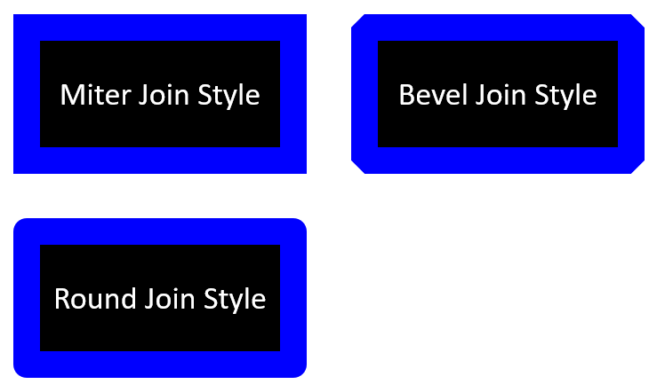

## **บทนำ**

ใน PowerPoint คุณสามารถเพิ่มรูปร่างลงในสไลด์ได้ เนื่องจากรูปร่างประกอบด้วยเส้น คุณจึงสามารถจัดรูปแบบได้โดยการแก้ไขหรือใช้เอฟเฟ็กต์กับโครงร่างของมัน นอกจากนี้ คุณยังสามารถจัดรูปแบบรูปร่างโดยระบุการตั้งค่าที่ควบคุมการเติมเต็มภายในของรูปร่างได้


Aspose.Slides สำหรับ C++ มีอินเทอร์เฟซและเมธอดที่ช่วยให้คุณจัดรูปแบบรูปร่างโดยใช้ตัวเลือกเดียวกับที่มีใน PowerPoint

## **จัดรูปแบบเส้น**

โดยใช้ Aspose.Slides คุณสามารถระบุสไตล์เส้นแบบกำหนดเองสำหรับรูปร่าง ขั้นตอนต่อไปนี้สรุปกระบวนการ:

1. สร้างอินสแตนซ์ของคลาส [Presentation](https://reference.aspose.com/slides/th/cpp/aspose.slides/presentation/) 
1. รับออพเจกต์อ้างอิงถึงสไลด์ตามดัชนีของมัน 
1. เพิ่ม [IAutoShape](https://reference.aspose.com/slides/th/cpp/aspose.slides/iautoshape/) ลงในสไลด์ 
1. ตั้งค่า [line style](https://reference.aspose.com/slides/th/cpp/aspose.slides/linestyle/) ของรูปร่าง 
1. ตั้งค่าความกว้างของเส้น 
1. ตั้งค่า [dash style](https://reference.aspose.com/slides/th/cpp/aspose.slides/linedashstyle/) ของเส้น 
1. ตั้งค่าสีเส้นสำหรับรูปร่าง 
1. บันทึกการนำเสนอที่แก้ไขเป็นไฟล์ PPTX 

โค้ดต่อไปนี้แสดงวิธีจัดรูปแบบ `AutoShape` สี่เหลี่ยมผืนผ้า:

```cpp
// สร้างอินสแตนซ์ของคลาส Presentation ที่แทนไฟล์การนำเสนอ
auto presentation = MakeObject<Presentation>();

// ดึงสไลด์แรก
auto slide = presentation->get_Slide(0);

// เพิ่มรูปร่างอัตโนมัติประเภทสี่เหลี่ยมผืนผ้า
auto shape = slide->get_Shapes()->AddAutoShape(ShapeType::Rectangle, 50, 150, 150, 75);

// ตั้งค่าสีเติมสำหรับรูปร่างสี่เหลี่ยมผืนผ้า
shape->get_FillFormat()->set_FillType(FillType::NoFill);

// ใช้การจัดรูปแบบกับเส้นของสี่เหลี่ยมผืนผ้า
shape->get_LineFormat()->set_Style(LineStyle::ThickThin);
shape->get_LineFormat()->set_Width(7);
shape->get_LineFormat()->set_DashStyle(LineDashStyle::Dash);

// ตั้งค่าสีสำหรับเส้นของสี่เหลี่ยมผืนผ้า
shape->get_LineFormat()->get_FillFormat()->set_FillType(FillType::Solid);
shape->get_LineFormat()->get_FillFormat()->get_SolidFillColor()->set_Color(Color::get_Blue());

// บันทึกไฟล์ PPTX ลงดิสก์
presentation->Save(u"formatted_lines.pptx", SaveFormat::Pptx);
presentation->Dispose();
```

ผลลัพธ์:


## **ใช้เอฟเฟ็กต์สเก็ตช์กับเส้นของรูปร่าง**

เอฟเฟ็กต์สเก็ตช์ทำให้เส้นของรูปร่างดูเหมือนวาดด้วยมือ ใช้ [IShape::get_LineFormat](https://reference.aspose.com/slides/th/cpp/aspose.slides/ishape/get_lineformat/) เพื่อเข้าถึงการตั้งค่าเส้น, [ILineFormat::get_SketchFormat](https://reference.aspose.com/slides/th/cpp/aspose.slides/ilineformat/get_sketchformat/) เพื่อเข้าถึงการตั้งค่าสเก็ตช์, และ [ISketchFormat::set_SketchType](https://reference.aspose.com/slides/th/cpp/aspose.slides/isketchformat/set_sketchtype/) เพื่อเลือกค่าจากการนับจำนวน [LineSketchType](https://reference.aspose.com/slides/th/cpp/aspose.slides/linesketchtype/) 

โค้ด C++ ต่อไปนี้แสดงวิธีใช้เอฟเฟ็กต์ [LineSketchType::Curved](https://reference.aspose.com/slides/th/cpp/aspose.slides/linesketchtype/) อ่านค่าที่กำหนดโดยตรง และลบเอฟเฟ็กต์ด้วย [LineSketchType::None](https://reference.aspose.com/slides/th/cpp/aspose.slides/linesketchtype/) :

```cpp
auto presentation = MakeObject<Presentation>();

auto slide = presentation->get_Slide(0);
auto shape = slide->get_Shapes()->AddAutoShape(ShapeType::Rectangle, 50, 50, 200, 100);

// Access the shape's line format and its sketch format.
auto sketchFormat = shape->get_LineFormat()->get_SketchFormat();

// Apply a sketch effect.
sketchFormat->set_SketchType(LineSketchType::Curved);

// Read the sketch effect assigned directly to the shape.
auto explicitSketchType = sketchFormat->get_SketchType();
Console::WriteLine(u"Explicit sketch type: {0}", explicitSketchType);

// Remove the sketch effect.
sketchFormat->set_SketchType(LineSketchType::None);

presentation->Dispose();
```

ค่าที่ส่งกลับโดย [ISketchFormat::get_SketchType](https://reference.aspose.com/slides/th/cpp/aspose.slides/isketchformat/get_sketchtype/) แสดงการตั้งค่าที่ถูกกำหนดโดยตรงกับรูปร่าง หากการจัดรูปแบบเส้นสามารถสืบทอดจากธีม, มาสเตอร์สไลด์ หรือเลเอาต์สไลด์ ให้ใช้ [ILineFormat::GetEffective](https://reference.aspose.com/slides/th/cpp/aspose.slides/ilineformat/geteffective/) แล้วเข้าถึง [ILineFormatEffectiveData::get_SketchFormat](https://reference.aspose.com/slides/th/cpp/aspose.slides/ilineformateffectivedata/get_sketchformat/) และอ่าน [ISketchFormatEffectiveData::get_SketchType](https://reference.aspose.com/slides/th/cpp/aspose.slides/isketchformateffectivedata/get_sketchtype/) ค่าที่มีประสิทธิผลจะแสดงการจัดรูปแบบที่ใช้งานจริงหลังจากการสืบทอดได้รับการแก้ไข:

```cpp
auto presentation = MakeObject<Presentation>(u"presentation.pptx");

auto shape = presentation->get_Slide(0)->get_Shape(0);
auto lineFormat = shape->get_LineFormat();

auto explicitSketchType = lineFormat->get_SketchFormat()->get_SketchType();
auto effectiveLineFormat = lineFormat->GetEffective();
auto effectiveSketchType = effectiveLineFormat->get_SketchFormat()->get_SketchType();

Console::WriteLine(u"Explicit sketch type: {0}", explicitSketchType);
Console::WriteLine(u"Effective sketch type: {0}", effectiveSketchType);

presentation->Dispose();
```

## **จัดรูปแบบสไตล์การเชื่อมต่อ**

ตัวเลือกประเภทการเชื่อมต่อสามแบบคือ:

* Round
* Miter
* Bevel

โดยค่าเริ่มต้น PowerPoint จะใช้การตั้งค่า **Round** เมื่อเชื่อมต่อสองเส้นที่มุม (เช่นที่มุมของรูปร่าง) อย่างไรก็ตาม หากคุณวาดรูปร่างที่มีมุมคม คุณอาจต้องการใช้ตัวเลือก **Miter** 



โค้ด C++ ต่อไปนี้แสดงวิธีที่สร้างสี่เหลี่ยมผืนผ้าสามรูป (ตามรูปด้านบน) โดยใช้การตั้งค่า Miter, Bevel, และ Round :

```cpp
// สร้างอินสแตนซ์ของคลาส Presentation ที่แทนไฟล์การนำเสนอ
auto presentation = MakeObject<Presentation>();

// ดึงสไลด์แรก
auto slide = presentation->get_Slide(0);

// เพิ่มรูปร่างอัตโนมัติสามรูปประเภทสี่เหลี่ยมผืนผ้า
auto shape1 = slide->get_Shapes()->AddAutoShape(ShapeType::Rectangle, 20, 20, 150, 75);
auto shape2 = slide->get_Shapes()->AddAutoShape(ShapeType::Rectangle, 210, 20, 150, 75);
auto shape3 = slide->get_Shapes()->AddAutoShape(ShapeType::Rectangle, 20, 135, 150, 75);

// ตั้งค่าสีเติมสำหรับแต่ละรูปร่างสี่เหลี่ยมผืนผ้า
shape1->get_FillFormat()->set_FillType(FillType::Solid);
shape1->get_FillFormat()->get_SolidFillColor()->set_Color(Color::get_Black());
shape2->get_FillFormat()->set_FillType(FillType::Solid);
shape2->get_FillFormat()->get_SolidFillColor()->set_Color(Color::get_Black());
shape3->get_FillFormat()->set_FillType(FillType::Solid);
shape3->get_FillFormat()->get_SolidFillColor()->set_Color(Color::get_Black());

// ตั้งค่าความกว้างของเส้น
shape1->get_LineFormat()->set_Width(15);
shape2->get_LineFormat()->set_Width(15);
shape3->get_LineFormat()->set_Width(15);

// ตั้งค่าสีสำหรับเส้นของแต่ละสี่เหลี่ยมผืนผ้า
shape1->get_LineFormat()->get_FillFormat()->set_FillType(FillType::Solid);
shape1->get_LineFormat()->get_FillFormat()->get_SolidFillColor()->set_Color(Color::get_Blue());
shape2->get_LineFormat()->get_FillFormat()->set_FillType(FillType::Solid);
shape2->get_LineFormat()->get_FillFormat()->get_SolidFillColor()->set_Color(Color::get_Blue());
shape3->get_LineFormat()->get_FillFormat()->set_FillType(FillType::Solid);
shape3->get_LineFormat()->get_FillFormat()->get_SolidFillColor()->set_Color(Color::get_Blue());

// ตั้งค่าสไตล์การเชื่อมต่อ
shape1->get_LineFormat()->set_JoinStyle(LineJoinStyle::Miter);
shape2->get_LineFormat()->set_JoinStyle(LineJoinStyle::Bevel);
shape3->get_LineFormat()->set_JoinStyle(LineJoinStyle::Round);

// เพิ่มข้อความลงในแต่ละสี่เหลี่ยมผืนผ้า
shape1->get_TextFrame()->set_Text(u"Miter Join Style");
shape2->get_TextFrame()->set_Text(u"Bevel Join Style");
shape3->get_TextFrame()->set_Text(u"Round Join Style");

// บันทึกไฟล์ PPTX ลงดิสก์
presentation->Save(u"join_styles.pptx", SaveFormat::Pptx);
presentation->Dispose();
```

## **การเติมสีแบบไล่สี**

ใน PowerPoint การเติมสีแบบไล่สีเป็นตัวเลือกการจัดรูปแบบที่ช่วยให้คุณใส่การผสมสีต่อเนื่องลงในรูปร่าง ตัวอย่างเช่น คุณสามารถใส่สองสีหรือมากกว่าโดยให้สีหนึ่งค่อย ๆ จางไปสู่สีอีกสีหนึ่ง

วิธีการใช้การเติมสีแบบไล่สีกับรูปร่างโดยใช้ Aspose.Slides:

1. สร้างอินสแตนซ์ของคลาส [Presentation](https://reference.aspose.com/slides/th/cpp/aspose.slides/presentation/) 
1. รับออพเจกต์อ้างอิงถึงสไลด์ตามดัชนีของมัน 
1. เพิ่ม [IAutoShape](https://reference.aspose.com/slides/th/cpp/aspose.slides/iautoshape/) ลงในสไลด์ 
1. ตั้งค่า [FillType](https://reference.aspose.com/slides/th/cpp/aspose.slides/filltype/) ของรูปร่างเป็น `Gradient` 
1. ใช้เมธอด `Add` ของคอลเลกชันจุดหยุดไล่สีที่เปิดเผยโดยอินเทอร์เฟซ [IGradientFormat](https://reference.aspose.com/slides/th/cpp/aspose.slides/igradientformat/) เพื่อเพิ่มสองสีที่คุณต้องการพร้อมตำแหน่งที่กำหนด 
1. บันทึกการนำเสนอที่แก้ไขเป็นไฟล์ PPTX 

โค้ด C++ ต่อไปนี้แสดงวิธีใช้เอฟเฟ็กต์การเติมสีแบบไล่สีกับรูปวงรี:

```cpp
// สร้างอินสแตนซ์ของคลาส Presentation ที่แทนไฟล์การนำเสนอ
auto presentation = MakeObject<Presentation>();

// ดึงสไลด์แรก
auto slide = presentation->get_Slide(0);

// เพิ่มรูปร่างอัตโนมัติประเภทวงรี
auto shape = slide->get_Shapes()->AddAutoShape(ShapeType::Ellipse, 50, 50, 150, 75);

// ใช้การจัดรูปแบบไล่สีกับวงร
shape->get_FillFormat()->set_FillType(FillType::Gradient);
shape->get_FillFormat()->get_GradientFormat()->set_GradientShape(GradientShape::Linear);

// ตั้งค่าทิศทางของไล่สี
shape->get_FillFormat()->get_GradientFormat()->set_GradientDirection(GradientDirection::FromCorner2);

// เพิ่มจุดหยุดไล่สีสองจุด
shape->get_FillFormat()->get_GradientFormat()->get_GradientStops()->Add(1.0f, PresetColor::Purple);
shape->get_FillFormat()->get_GradientFormat()->get_GradientStops()->Add(0.0f, PresetColor::Red);

// บันทึกไฟล์ PPTX ลงดิสก์
presentation->Save(u"gradient_fill.pptx", SaveFormat::Pptx);
presentation->Dispose();
```

ผลลัพธ์:


## **การเติมลายแบบ**

ใน PowerPoint การเติมลายแบบเป็นตัวเลือกการจัดรูปแบบที่ให้คุณใส่การออกแบบสองสี เช่น จุด, ลายเส้น, ลายตาราง หรือการตรวจสอบลงบนรูปร่าง คุณสามารถเลือกสีกำหนดเองสำหรับส่วนหน้าและพื้นหลังของลายได้

Aspose.Slides มีรูปแบบลายที่กำหนดล่วงหน้าเกิน 45 แบบที่คุณสามารถใช้กับรูปร่างเพื่อเพิ่มความสวยงามให้การนำเสนอของคุณ แม้เลือกลายที่กำหนดไว้แล้ว คุณยังสามารถกำหนดสีที่ต้องการให้ลายใช้ได้อีกด้วย

วิธีการใช้การเติมลายแบบกับรูปร่างโดยใช้ Aspose.Slides:

1. สร้างอินสแตนซ์ของคลาส [Presentation](https://reference.aspose.com/slides/th/cpp/aspose.slides/presentation/) 
1. รับออพเจกต์อ้างอิงถึงสไลด์ตามดัชนีของมัน 
1. เพิ่ม [IAutoShape](https://reference.aspose.com/slides/th/cpp/aspose.slides/iautoshape/) ลงในสไลด์ 
1. ตั้งค่า [FillType](https://reference.aspose.com/slides/th/cpp/aspose.slides/filltype/) ของรูปร่างเป็น `Pattern` 
1. เลือกรูปแบบลายจากตัวเลือกที่กำหนดไว้ล่วงหน้า 
1. ตั้งค่า [Background Color](https://reference.aspose.com/slides/th/cpp/aspose.slides/ipatternformat/get_backcolor/) ของลาย 
1. ตั้งค่า [Foreground Color](https://reference.aspose.com/slides/th/cpp/aspose.slides/ipatternformat/get_forecolor/) ของลาย 
1. บันทึกการนำเสนอที่แก้ไขเป็นไฟล์ PPTX 

โค้ด C++ ต่อไปนี้แสดงวิธีใช้การเติมลายแบบกับสี่เหลี่ยมผืนผ้า:

```cpp
// สร้างอินสแตนซ์ของคลาส Presentation ที่แทนไฟล์การนำเสนอ
auto presentation = MakeObject<Presentation>();

// ดึงสไลด์แรก
auto slide = presentation->get_Slide(0);

// เพิ่มรูปร่างอัตโนมัติประเภทสี่เหลี่ยมผืนผ้า
auto shape = slide->get_Shapes()->AddAutoShape(ShapeType::Rectangle, 50, 50, 150, 75);

// ตั้งค่าชนิดการเติมเป็น Pattern
shape->get_FillFormat()->set_FillType(FillType::Pattern);

// ตั้งค่าสไตล์ลาย
shape->get_FillFormat()->get_PatternFormat()->set_PatternStyle(PatternStyle::Trellis);

// ตั้งค่าสีพื้นหลังและสีพื้นหน้าของลาย
shape->get_FillFormat()->get_PatternFormat()->get_BackColor()->set_Color(Color::get_LightGray());
shape->get_FillFormat()->get_PatternFormat()->get_ForeColor()->set_Color(Color::get_Yellow());

// บันทึกไฟล์ PPTX ลงดิสก์
presentation->Save(u"pattern_fill.pptx", SaveFormat::Pptx);
presentation->Dispose();
```

ผลลัพธ์:


## **การเติมภาพ**

ใน PowerPoint การเติมภาพเป็นตัวเลือกการจัดรูปแบบที่ให้คุณแทรกรูปภาพภายในรูปร่าง—โดยใช้รูปภาพเป็นพื้นหลังของรูปร่าง

วิธีการใช้ Aspose.Slides เพื่อเติมภาพลงในรูปร่าง:

1. สร้างอินสแตนซ์ของคลาส [Presentation](https://reference.aspose.com/slides/th/cpp/aspose.slides/presentation/) 
1. รับออพเจกต์อ้างอิงถึงสไลด์ตามดัชนีของมัน 
1. เพิ่ม [IAutoShape](https://reference.aspose.com/slides/th/cpp/aspose.slides/iautoshape/) ลงในสไลด์ 
1. ตั้งค่า [FillType](https://reference.aspose.com/slides/th/cpp/aspose.slides/filltype/) ของรูปร่างเป็น `Picture` 
1. ตั้งค่าโหมดการเติมภาพเป็น `Tile` (หรือโหมดที่คุณต้องการอื่น) 
1. สร้างออพเจกต์ [IPPImage](https://reference.aspose.com/slides/th/cpp/aspose.slides/ippimage/) จากภาพที่คุณต้องการใช้ 
1. ส่งภาพไปยังเมธอด `ISlidesPicture.set_Image` 
1. บันทึกการนำเสนอที่แก้ไขเป็นไฟล์ PPTX 

สมมติว่ามีไฟล์ "lotus.png" พร้อมรูปภาพต่อไปนี้:


โค้ด C++ ต่อไปนี้แสดงวิธีเติมรูปร่างด้วยรูปภาพ:

```cpp
// สร้างอินสแตนซ์ของคลาส Presentation ที่แทนไฟล์การนำเสนอ
auto presentation = MakeObject<Presentation>();

// ดึงสไลด์แรก
auto slide = presentation->get_Slide(0);

// เพิ่มรูปร่างอัตโนมัติประเภทสี่เหลี่ยมผืนผ้า
auto shape = slide->get_Shapes()->AddAutoShape(ShapeType::Rectangle, 50, 50, 255, 130);

// ตั้งค่าชนิดการเติมเป็น Picture
shape->get_FillFormat()->set_FillType(FillType::Picture);

// ตั้งค่าโหมดการเติมภาพ
shape->get_FillFormat()->get_PictureFillFormat()->set_PictureFillMode(PictureFillMode::Tile);

// โหลดภาพและเพิ่มลงในทรัพยากรของการนำเสนอ
auto image = Images::FromFile(u"lotus.png");
auto picture = presentation->get_Images()->AddImage(image);
image->Dispose();

// ตั้งค่าภาพ
shape->get_FillFormat()->get_PictureFillFormat()->get_Picture()->set_Image(picture);

// บันทึกไฟล์ PPTX ลงดิสก์
presentation->Save(u"picture_fill.pptx", SaveFormat::Pptx);
presentation->Dispose();
```

ผลลัพธ์:


### **การวางภาพเป็นพื้นผิวแบบต่อกัน**

หากต้องการตั้งค่าภาพต่อกันเป็นพื้นผิวและปรับพฤติกรรมการต่อให้เป็นไปตามต้องการ คุณสามารถใช้เมธอดต่อไปนี้ของอินเทอร์เฟซ [IPictureFillFormat](https://reference.aspose.com/slides/th/cpp/aspose.slides/ipicturefillformat/) และคลาส [PictureFillFormat](https://reference.aspose.com/slides/th/cpp/aspose.slides/picturefillformat/) :

- [set_PictureFillMode](https://reference.aspose.com/slides/th/cpp/aspose.slides/ipicturefillformat/set_picturefillmode/): ตั้งค่าโหมดการเติมภาพ—`Tile` หรือ `Stretch` 
- [set_TileAlignment](https://reference.aspose.com/slides/th/cpp/aspose.slides/ipicturefillformat/set_tilealignment/): กำหนดการจัดตำแหน่งของภาพต่อภายในรูปร่าง 
- [set_TileFlip](https://reference.aspose.com/slides/th/cpp/aspose.slides/ipicturefillformat/set_tileflip/): ควบคุมว่าภาพต่อจะถูกพลิกแนวนอน, แนวตั้ง หรือทั้งสองอย่าง 
- [set_TileOffsetX](https://reference.aspose.com/slides/th/cpp/aspose.slides/ipicturefillformat/set_tileoffsetx/): ตั้งค่าการออฟเซ็ตแนวนอนของภาพต่อ (เป็นพ้อยต์) จากจุดเริ่มต้นของรูปร่าง 
- [set_TileOffsetY](https://reference.aspose.com/slides/th/cpp/aspose.slides/ipicturefillformat/set_tileoffsety/): ตั้งค่าการออฟเซ็ตแนวตั้งของภาพต่อ (เป็นพ้อยต์) จากจุดเริ่มต้นของรูปร่าง 
- [set_TileScaleX](https://reference.aspose.com/slides/th/cpp/aspose.slides/ipicturefillformat/set_tilescalex/): กำหนดสเกลแนวนอนของภาพต่อเป็นเปอร์เซ็นต์ 
- [set_TileScaleY](https://reference.aspose.com/slides/th/cpp/aspose.slides/ipicturefillformat/set_tilescaley/): กำหนดสเกลแนวตั้งของภาพต่อเป็นเปอร์เซ็นต์ 

โค้ดตัวอย่างต่อไปนี้แสดงวิธีเพิ่มรูปร่างสี่เหลี่ยมพร้อมการเติมภาพต่อและกำหนดตัวเลือกการต่อ:

```cpp
// สร้างอินสแตนซ์ของคลาส Presentation ที่แทนไฟล์การนำเสนอ
auto presentation = MakeObject<Presentation>();

// ดึงสไลด์แรก
auto firstSlide = presentation->get_Slide(0);

// เพิ่มรูปร่างอัตโนมัติประเภทสี่เหลี่ยมผืนผ้า
auto shape = firstSlide->get_Shapes()->AddAutoShape(ShapeType::Rectangle, 50, 50, 190, 95);

// ตั้งค่าชนิดการเติมของรูปร่างเป็น Picture
shape->get_FillFormat()->set_FillType(FillType::Picture);

// โหลดภาพและเพิ่มลงในทรัพยากรของการนำเสนอ
auto sourceImage = Images::FromFile(u"lotus.png");
auto presentationImage = presentation->get_Images()->AddImage(sourceImage);
sourceImage->Dispose();

// กำหนดภาพให้กับรูปร่าง
auto pictureFillFormat = shape->get_FillFormat()->get_PictureFillFormat();
pictureFillFormat->get_Picture()->set_Image(presentationImage);

// กำหนดค่าโหมดการเติมภาพและคุณสมบัติการต่อ
pictureFillFormat->set_PictureFillMode(PictureFillMode::Tile);
pictureFillFormat->set_TileOffsetX(-32);
pictureFillFormat->set_TileOffsetY(-32);
pictureFillFormat->set_TileScaleX(50);
pictureFillFormat->set_TileScaleY(50);
pictureFillFormat->set_TileAlignment(RectangleAlignment::BottomRight);
pictureFillFormat->set_TileFlip(TileFlip::FlipBoth);

// บันทึกไฟล์ PPTX ลงดิสก์
presentation->Save(u"tile.pptx", SaveFormat::Pptx);
presentation->Dispose();
```

ผลลัพธ์:


## **การเติมสีทึบ**

ใน PowerPoint การเติมสีทึบเป็นตัวเลือกการจัดรูปแบบที่เติมรูปร่างด้วยสีเดียวที่มีความสม่ำเสมอ สีพื้นหลังเรียบนี้จะถูกนำไปใช้โดยไม่มีการไล่สี, เนื้อเท็กซ์เจอร์ หรือรูปแบบใด ๆ

เพื่อใช้การเติมสีทึบกับรูปร่างโดยใช้ Aspose.Slides ให้ทำตามขั้นตอนต่อไปนี้:

1. สร้างอินสแตนซ์ของคลาส [Presentation](https://reference.aspose.com/slides/th/cpp/aspose.slides/presentation/) 
1. รับออพเจกต์อ้างอิงถึงสไลด์ตามดัชนีของมัน 
1. เพิ่ม [IAutoShape](https://reference.aspose.com/slides/th/cpp/aspose.slides/iautoshape/) ลงในสไลด์ 
1. ตั้งค่า [FillType](https://reference.aspose.com/slides/th/cpp/aspose.slides/filltype/) ของรูปร่างเป็น `Solid` 
1. กำหนดสีเติมที่คุณต้องการให้กับรูปร่าง 
1. บันทึกการนำเสนอที่แก้ไขเป็นไฟล์ PPTX 

โค้ด C++ ต่อไปนี้แสดงวิธีใช้การเติมสีทึบกับสี่เหลี่ยมผืนผ้าในสไลด์ PowerPoint:

```cpp
// สร้างอินสแตนซ์ของคลาส Presentation ที่แทนไฟล์การนำเสนอ
auto presentation = MakeObject<Presentation>();

// ดึงสไลด์แรก
auto slide = presentation->get_Slide(0);

// เพิ่มรูปร่างอัตโนมัติประเภทสี่เหลี่ยมผืนผ้า
auto shape = slide->get_Shapes()->AddAutoShape(ShapeType::Rectangle, 50, 50, 150, 75);

// ตั้งค่าชนิดการเติมเป็น Solid
shape->get_FillFormat()->set_FillType(FillType::Solid);

// ตั้งค่าสีเติม
shape->get_FillFormat()->get_SolidFillColor()->set_Color(Color::get_Yellow());

// บันทึกไฟล์ PPTX ลงดิสก์
presentation->Save(u"solid_color_fill.pptx", SaveFormat::Pptx);
presentation->Dispose();
```

ผลลัพธ์:


## **ตั้งค่าความโปร่งแสง**

ใน PowerPoint เมื่อคุณใช้การเติมสีทึบ, ไล่สี, ภาพ หรือเท็กซ์เจอร์กับรูปร่าง คุณสามารถตั้งระดับความโปร่งแสงเพื่อควบคุมความทึบของการเติมได้ ค่าความโปร่งแสงที่สูงทำให้รูปร่างดูโปร่งแสงมากขึ้นและให้พื้นหลังหรือวัตถุที่อยู่ด้านล่างมองเห็นได้บางส่วน

Aspose.Slides ให้คุณกำหนดระดับความโปร่งแสงโดยปรับค่าอัลฟ่าในสีที่ใช้เติม วิธีทำคือ:

1. สร้างอินสแตนซ์ของคลาส [Presentation](https://reference.aspose.com/slides/th/cpp/aspose.slides/presentation/) 
1. รับออพเจกต์อ้างอิงถึงสไลด์ตามดัชนีของมัน 
1. เพิ่ม [IAutoShape](https://reference.aspose.com/slides/th/cpp/aspose.slides/iautoshape/) ลงในสไลด์ 
1. ตั้งค่า [FillType](https://reference.aspose.com/slides/th/cpp/aspose.slides/filltype/) เป็น `Solid` 
1. ใช้ `Color` เพื่อกำหนดสีที่มีความโปร่งแสง (ส่วน `alpha` ควบคุมความโปร่งแสง) 
1. บันทึกการนำเสนอ 

โค้ด C++ ต่อไปนี้แสดงวิธีใช้สีเติมที่โปร่งแสงกับสี่เหลี่ยมผืนผ้า:

```cpp
// สร้างอินสแตนซ์ของคลาส Presentation ที่แทนไฟล์การนำเสนอ
auto presentation = MakeObject<Presentation>();

// ดึงสไลด์แรก
auto slide = presentation->get_Slide(0);

// เพิ่มรูปร่างอัตโนมัติสี่เหลี่ยมผืนผ้าแบบทึบ
auto solidShape = slide->get_Shapes()->AddAutoShape(ShapeType::Rectangle, 50, 50, 150, 75);

// เพิ่มรูปร่างอัตโนมัติสี่เหลี่ยมผืนผ้าโปร่งแสงเหนือรูปร่างแบบทึบ
auto transparentShape = slide->get_Shapes()->AddAutoShape(ShapeType::Rectangle, 80, 80, 150, 75);
transparentShape->get_FillFormat()->set_FillType(FillType::Solid);
transparentShape->get_FillFormat()->get_SolidFillColor()->set_Color(Color::FromArgb(204, 255, 255, 0));

// บันทึกไฟล์ PPTX ลงดิสก์
presentation->Save(u"shape_transparency.pptx", SaveFormat::Pptx);
presentation->Dispose();
```

ผลลัพธ์:


## **การหมุนรูปร่าง**

Aspose.Slides ให้คุณหมุนรูปร่างในงานนำเสนอ PowerPoint ซึ่งเป็นประโยชน์เมื่อจัดตำแหน่งองค์ประกอบภาพตามการจัดแนวหรือการออกแบบที่ต้องการ

ขั้นตอนการหมุนรูปร่างบนสไลด์:

1. สร้างอินสแตนซ์ของคลาส [Presentation](https://reference.aspose.com/slides/th/cpp/aspose.slides/presentation/) 
1. รับออพเจกต์อ้างอิงถึงสไลด์ตามดัชนีของมัน 
1. เพิ่ม [IAutoShape](https://reference.aspose.com/slides/th/cpp/aspose.slides/iautoshape/) ลงในสไลด์ 
1. ตั้งค่าคุณสมบัติการหมุนของรูปร่างเป็นมุมที่ต้องการ 
1. บันทึกการนำเสนอ 

โค้ด C++ ต่อไปนี้แสดงวิธีหมุนรูปร่าง 5 องศา:

```cpp
// สร้างอินสแตนซ์ของคลาส Presentation ที่แทนไฟล์การนำเสนอ
auto presentation = MakeObject<Presentation>();

// ดึงสไลด์แรก
auto slide = presentation->get_Slide(0);

// เพิ่มรูปร่างอัตโนมัติประเภทสี่เหลี่ยมผืนผ้า
auto shape = slide->get_Shapes()->AddAutoShape(ShapeType::Rectangle, 50, 50, 150, 75);

// หมุนรูปร่าง 5 องศา
shape->set_Rotation(5);

// บันทึกไฟล์ PPTX ลงดิสก์
presentation->Save(u"shape_rotation.pptx", SaveFormat::Pptx);
presentation->Dispose();
```

ผลลัพธ์:


## **เพิ่มเอฟเฟ็กต์ Bevel 3 มิติ**

Aspose.Slides อนุญาตให้คุณใช้เอฟเฟ็กต์ Bevel 3 มิติบนรูปร่างโดยการกำหนดคุณสมบัติของ [ThreeDFormat](https://reference.aspose.com/slides/th/cpp/aspose.slides/threedformat/) 

ขั้นตอนการเพิ่มเอฟเฟ็กต์ Bevel 3 มิติให้กับรูปร่าง:

1. สร้างอินสแตนซ์ของคลาส [Presentation](https://reference.aspose.com/slides/th/cpp/aspose.slides/presentation/) 
1. รับออพเจกต์อ้างอิงถึงสไลด์ตามดัชนีของมัน 
1. เพิ่ม [IAutoShape](https://reference.aspose.com/slides/th/cpp/aspose.slides/iautoshape/) ลงในสไลด์ 
1. กำหนดค่า [ThreeDFormat](https://reference.aspose.com/slides/th/cpp/aspose.slides/threedformat/) ของรูปร่างเพื่อระบุการตั้งค่า bevel 
1. บันทึกการนำเสนอ 

โค้ด C++ ต่อไปนี้แสดงวิธีใช้เอฟเฟ็กต์ Bevel 3 มิติบนรูปร่าง:

```cpp
// สร้างอินสแตนซ์ของคลาส Presentation
auto presentation = MakeObject<Presentation>();

auto slide = presentation->get_Slide(0);

// เพิ่มรูปร่างลงสไลด์
auto shape = slide->get_Shapes()->AddAutoShape(ShapeType::Ellipse, 50, 50, 100, 100);
shape->get_FillFormat()->set_FillType(FillType::Solid);
shape->get_FillFormat()->get_SolidFillColor()->set_Color(Color::get_Green());
shape->get_LineFormat()->get_FillFormat()->set_FillType(FillType::Solid);
shape->get_LineFormat()->get_FillFormat()->get_SolidFillColor()->set_Color(Color::get_Orange());
shape->get_LineFormat()->set_Width(2.0);

// ตั้งค่าคุณสมบัติ ThreeDFormat ของรูปร่าง
shape->get_ThreeDFormat()->set_Depth(4.0);
shape->get_ThreeDFormat()->get_BevelTop()->set_BevelType(BevelPresetType::Circle);
shape->get_ThreeDFormat()->get_BevelTop()->set_Height(6);
shape->get_ThreeDFormat()->get_BevelTop()->set_Width(6);
shape->get_ThreeDFormat()->get_Camera()->set_CameraType(CameraPresetType::OrthographicFront);
shape->get_ThreeDFormat()->get_LightRig()->set_LightType(LightRigPresetType::ThreePt);
shape->get_ThreeDFormat()->get_LightRig()->set_Direction(LightingDirection::Top);

// บันทึกการนำเสนอเป็นไฟล์ PPTX
presentation->Save(u"3D_bevel_effect.pptx", SaveFormat::Pptx);
presentation->Dispose();
```

ผลลัพธ์:


## **เพิ่มเอฟเฟ็กต์การหมุน 3 มิติ**

Aspose.Slides อนุญาตให้คุณใช้เอฟเฟ็กต์การหมุน 3 มิติบนรูปร่างโดยการกำหนดคุณสมบัติของ [ThreeDFormat](https://reference.aspose.com/slides/th/cpp/aspose.slides/threedformat/) 

ขั้นตอนการใช้การหมุน 3 มิติบนรูปร่าง:

1. สร้างอินสแตนซ์ของคลาส [Presentation](https://reference.aspose.com/slides/th/cpp/aspose.slides/presentation/) 
1. รับออพเจกต์อ้างอิงถึงสไลด์ตามดัชนีของมัน 
1. เพิ่ม [IAutoShape](https://reference.aspose.com/slides/th/cpp/aspose.slides/iautoshape/) ลงในสไลด์ 
1. ใช้ [set_CameraType](https://reference.aspose.com/slides/th/cpp/aspose.slides/icamera/set_cameratype/) และ [set_LightType](https://reference.aspose.com/slides/th/cpp/aspose.slides/ilightrig/set_lighttype/) เพื่อกำหนดการหมุน 3 มิติ 
1. บันทึกการนำเสนอ 

โค้ด C++ ต่อไปนี้แสดงวิธีใช้เอฟเฟ็กต์การหมุน 3 มิติบนรูปร่าง:

```cpp
// สร้างอินสแตนซ์ของคลาส Presentation
auto presentation = MakeObject<Presentation>();

auto slide = presentation->get_Slide(0);

auto shape = slide->get_Shapes()->AddAutoShape(ShapeType::Rectangle, 50, 50, 150, 75);
shape->get_TextFrame()->set_Text(u"Hello, Aspose!");

shape->get_ThreeDFormat()->set_Depth(6);
shape->get_ThreeDFormat()->get_Camera()->SetRotation(40, 35, 20);
shape->get_ThreeDFormat()->get_Camera()->set_CameraType(CameraPresetType::IsometricLeftUp);
shape->get_ThreeDFormat()->get_LightRig()->set_LightType(LightRigPresetType::Balanced);

// บันทึกการนำเสนอเป็นไฟล์ PPTX
presentation->Save(u"3D_rotation_effect.pptx", SaveFormat::Pptx);
presentation->Dispose();
```

ผลลัพธ์:


## **รีเซ็ตการจัดรูปแบบ**

โค้ด C++ ต่อไปนี้แสดงวิธีรีเซ็ตการจัดรูปแบบของสไลด์และคืนค่าตำแหน่ง, ขนาด, และการจัดรูปแบบของรูปร่างทั้งหมดที่มี placeholder บน [LayoutSlide](https://reference.aspose.com/slides/th/cpp/aspose.slides/layoutslide/) ให้กลับสู่การตั้งค่าเริ่มต้น:

```cpp
auto presentation = MakeObject<Presentation>(u"sample.pptx");

for (auto&& slide : presentation->get_Slides())
{
    // รีเซ็ตแต่ละรูปร่างบนสไลด์ที่มี placeholder บนเลเอาต์.
    slide->Reset();
}

presentation->Save(u"reset_formatting.pptx", SaveFormat::Pptx);
presentation->Dispose();
```

## **คำถามที่พบบ่อย**

**การจัดรูปแบบรูปร่างมีผลต่อขนาดไฟล์งานนำเสนอสุดท้ายหรือไม่?**

มีผลเพียงเล็กน้อย ภาพและสื่อที่ฝังอยู่ใช้พื้นที่ส่วนใหญ่ของไฟล์ ส่วนพารามิเตอร์ของรูปร่างเช่นสี, เอฟเฟ็กต์, และไล่สีถูกจัดเก็บเป็นเมตาดาต้าและไม่เพิ่มขนาดไฟล์อย่างมีนัยสำคัญ

**ฉันจะตรวจจับรูปร่างบนสไลด์ที่มีการจัดรูปแบบเดียวกันเพื่อจะจัดกลุ่มได้อย่างไร?**

เปรียบเทียบคุณสมบัติการจัดรูปแบบหลักของแต่ละรูปร่าง—การเติม, เส้น, และการตั้งค่าเอฟเฟ็กต์ หากค่าทุกอย่างตรงกัน ให้ถือว่ารูปร่างมีสไตล์เดียวกันและสามารถจัดกลุ่มตรรกะได้ ซึ่งทำให้การจัดการสไตล์ในภายหลังง่ายขึ้น

**ฉันสามารถบันทึกชุดสไตล์รูปร่างแบบกำหนดเองเป็นไฟล์แยกเพื่อใช้งานใหม่ในงานนำเสนออื่นได้หรือไม่?**

ได้ โดยเก็บรูปร่างตัวอย่างพร้อมสไตล์ที่ต้องการในสไลด์แม่แบบหรือไฟล์เทมเพลต .POTX เมื่อต้องสร้างงานนำเสนอใหม่ ให้เปิดเทมเพลตนั้น, คัดลอกรูปร่างที่สไตล์ต้องการ, และนำการจัดรูปแบบไปใช้ใหม่ตามที่ต้องการ