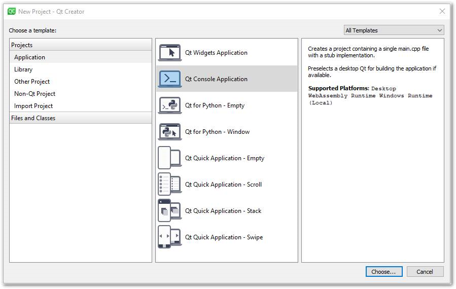

## **บทนำ**

Qt เป็นกรอบงานพัฒนาแอปพลิเคชันแบบครอสแพลตฟอร์มที่ใช้ภาษา C++ ซึ่งได้รับการใช้งานอย่างกว้างขวางเพื่อพัฒนาแอปพลิเคชันบนเดสก์ท็อป, มือถือ, และระบบฝังตัวต่าง ๆ Aspose.Slides for C++ สามารถผสานรวมกับ Qt เพื่อสร้างและจัดการเอกสาร PowerPoint ในแอปพลิเคชัน Qt ของคุณได้

## **การใช้ Aspose.Slides for C++ ใน Qt Creator**

เพื่อใช้ Aspose.Slides for C++ ในแอปพลิเคชัน Qt ของคุณ ดาวน์โหลดเวอร์ชันล่าสุดของ API จากส่วน [downloads](https://downloads.aspose.com/slides/th/cpp) หลังจากดาวน์โหลด API แล้ว คุณสามารถผสานรวมไลบรารี C++ ภายใน Qt Creator หรือ Visual Studio ได้

เพื่อผสานรวมและใช้ไลบรารี Aspose.Slides for C++ ภายในแอปพลิเคชันคอนโซล Qt ที่พัฒนาใน Qt Creator โปรดทำตามขั้นตอนต่อไปนี้:

- เปิด Qt Creator และสร้าง *Qt Console Application* ใหม่

- เลือกตัวเลือก QMake จากรายการดรอปดาวน์ *Build System*

- เลือกคิทที่เหมาะสมและจบวิซาร์ด
- คัดลอกโฟลเดอร์ aspose-slides-cpp-21.02 จากแพ็คเกจที่แตกไฟล์ของ Aspose.Slides for C++ ไปยังโฟลเดอร์รากของโครงการ

- เพื่อเพิ่มเส้นทางไปยังโฟลเดอร์ lib และ include ให้คลิกขวาที่โครงการในแถบด้านซ้ายและเลือก *Add Library*

- เลือกตัวเลือก External Library แล้วเรียกดูเส้นทางไปยังโฟลเดอร์ lib ทีละโฟลเดอร์

- เสร็จแล้ว ไฟล์โครงการ .pro ของคุณจะมีรายการต่อไปนี้:

- สร้างแอปพลิเคชันและคุณก็เสร็จสิ้นการผสานรวมแล้ว  

{}

หมายเหตุ: ดู [โครงการสาธิตเต็ม](https://github.com/aspose-slides/Aspose.Slides-for-C/tree/master/QtDemos/QtCreator/Qt_AsposeSlides_QMake) เพื่อข้อมูลเพิ่มเติม

{}

## **การใช้ Aspose.Slides for C++ ในแอปพลิเคชัน Qt ภายใน Visual Studio**

เพื่อพัฒนาแอปพลิเคชัน Qt ด้วย Visual Studio คุณต้องติดตั้ง [Qt Visual Studio Tools](https://marketplace.visualstudio.com/items?itemName=TheQtCompany.QtVisualStudioTools-19123) เมื่อทำการติดตั้งแล้ว ดาวน์โหลดเวอร์ชันล่าสุดของ API จากส่วน [downloads](https://downloads.aspose.com/slides/th/cpp) และทำตามขั้นตอนต่อไปนี้:

- เปิด Microsoft Visual Studio และสร้าง *Qt Console Application* ใหม่

- เลือกคิทที่เหมาะสมและจบวิซาร์ด
- เพื่อผสานรวมและใช้ไลบรารี Aspose.Slides for C++ ให้คลิกขวาที่โครงการและเลือก *Manage NuGet Packages...*

- ค้นหาและติดตั้งแพ็กเกจ *Aspose.Slides.Cpp* ที่ต้องการ

- สร้างโครงการและคุณก็เสร็จสิ้นการผสานรวมแล้ว  

{}

หมายเหตุ: ดู [โครงการสาธิตเต็ม](https://github.com/aspose-slides/Aspose.Slides-for-C/tree/master/QtDemos/Visual%20Studio/Qt_AsposeSlides_VS) เพื่อข้อมูลเพิ่มเติม

{}