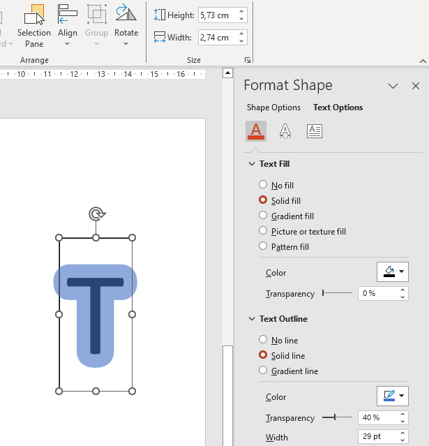

## **บทนำ**

PowerPoint มีคุณสมบัติปากกา (ink) ที่ช่วยให้คุณวาดเส้นแบบอิสระได้ ปากกาสามารถใช้เพื่อเน้นวัตถุอื่น ๆ แสดงการเชื่อมต่อและกระบวนการ และดึงความสนใจไปยังรายการเฉพาะบนสไลด์

Aspose.Slides มีประเภทที่จำเป็นสำหรับทำงานกับวัตถุปากกา ตัวอย่างเช่น อินเทอร์เฟซ [IInk](https://reference.aspose.com/slides/th/java/com.aspose.slides/iink/) แสดงวัตถุปากกาบนสไลด์

## **ความแตกต่างระหว่างวัตถุปกติและวัตถุปากกา**

วัตถุบนสไลด์ PowerPoint มักจะแทนด้วยวัตถุรูปร่าง (shape) ในรูปแบบที่ง่ายที่สุด รูปร่างเป็นคอนเทนเนอร์ที่กำหนดพื้นที่ของวัตถุเอง (กรอบ) พร้อมคุณสมบัติเช่น ขนาดคอนเทนเนอร์ รูปร่าง และพื้นหลัง ดูข้อมูลเพิ่มเติมที่ [Shape Layout Format](https://docs.aspose.com/slides/th/java/shape-manipulations/#access-layout-formats-for-shape)

อย่างไรก็ตาม เมื่อ PowerPoint จัดการวัตถุปากกา จะละเลยคุณสมบัติต่าง ๆ ของกรอบวัตถุ (คอนเทนเนอร์) ยกเว้นขนาด ขนาดของพื้นที่คอนเทนเนอร์จะกำหนดโดยเมธอดมาตมาตรฐาน [IShape.getWidth](https://reference.aspose.com/slides/th/java/com.aspose.slides/ishape/#getWidth--) และ [IShape.getHeight](https://reference.aspose.com/slides/th/java/com.aspose.slides/ishape/#getHeight--) :


## **รอยปากกา**

รอยปากกาเป็นองค์ประกอบพื้นฐานที่ใช้บันทึกลำดับการเคลื่อนที่ของปากกาเมื่อผู้ใช้เขียนปากกาดิจิทัล รอยปากกาเก็บลำดับของจุดที่เชื่อมต่อกัน

รูปแบบการเข้ารหัสที่ง่ายที่สุดระบุพิกัด X และ Y ของแต่ละจุดตัวอย่าง เมื่อจุดที่เชื่อมต่อทั้งหมดถูกเรนเดอร์ จะได้ภาพเช่นนี้:


## **คุณสมบัติของแปรงสำหรับการวาด**

แปรงใช้ในการวาดเส้นที่เชื่อมต่อจุดของรอยปากกา แปรงมีสีและขนาดของตัวเอง ซึ่งแสดงโดยเมธอด [IInkBrush.getColor](https://reference.aspose.com/slides/th/java/com.aspose.slides/iinkbrush/#getColor--) และ [IInkBrush.getSize](https://reference.aspose.com/slides/th/java/com.aspose.slides/iinkbrush/#getSize--).

### **ตั้งค่าสีแปรงปากกา**

โค้ด Java นี้แสดงวิธีตั้งค่าสีของแปรงปากกา:

```java
import com.aspose.slides.*;
import java.awt.Color;

Presentation presentation = new Presentation("pres.pptx");
try {
    ISlide slide = presentation.getSlides().get_Item(0);
    IInk ink = (IInk) slide.getShapes().get_Item(0);
    IInkBrush brush = ink.getTraces()[0].getBrush();
    brush.setColor(Color.RED);
} finally {
    presentation.dispose();
}
```

### **ตั้งค่าขนาดแปรงปากกา**

โค้ด Java นี้แสดงวิธีตั้งค่าขนาดของแปรงปากกา:

```java
import com.aspose.slides.*;
import java.awt.Dimension;

Presentation presentation = new Presentation("pres.pptx");
try {
    ISlide slide = presentation.getSlides().get_Item(0);
    IInk ink = (IInk) slide.getShapes().get_Item(0);
    IInkBrush brush = ink.getTraces()[0].getBrush();
    Dimension brushSize = new Dimension(5, 10);
    brush.setSize(brushSize);
} finally {
    presentation.dispose();
}
```

โดยทั่วไป ความกว้างและความสูงของแปรงไม่ตรงกัน ดังนั้น PowerPoint จะไม่แสดงขนาดของแปรง (ส่วนข้อมูลที่เกี่ยวข้องจะแสดงเป็นสีเทา) เมื่อความกว้างและความสูงของแปรงตรงกัน PowerPoint จะแสดงขนาดดังนี้:


เพื่อความชัดเจน เราจะเพิ่มความสูงของวัตถุปากกาและตรวจสอบมิติที่สำคัญ:


คอนเทนเนอร์ (กรอบ) ไม่คำนึงถึงขนาดของแปรง—มันสมมติว่าความหนาของเส้นเป็นศูนย์เสมอ (ดูภาพก่อนหน้า)

ดังนั้น เพื่อกำหนดพื้นที่ที่มองเห็นได้ของวัตถุปากกาโดยรวม จำเป็นต้องคำนึงถึงขนาดของแปรงในรอยปากกา ที่นี่ วัตถุเป้าหมาย (รอยปากข้อความที่เขียนด้วยมือ) ถูกสเกลให้ตรงกับขนาดของคอนเทนเนอร์ (กรอบ) เมื่อขนาดของคอนเทนเนอร์เปลี่ยนแปลง ขนาดของแปรงจะคงที่ และในทางกลับกัน


PowerPoint ใช้พฤติกรรมคล้ายกันสำหรับวัตถุข้อความ:



## **การควบคุมการแสดงผลปากกาในการส่งออกและการเรนเดอร์**

Aspose.Slides มีอินเทอร์เฟซ [IInkOptions](https://reference.aspose.com/slides/th/java/com.aspose.slides/iinkoptions/) เพื่อควบคุมว่าวัตถุปากกาจะแสดงอย่างไรในผลลัพธ์ที่ส่งออกหรือเรนเดอร์ คุณสามารถใช้คุณสมบัติของมันเพื่อซ่อนปากกาอย่างสมบูรณ์หรือเปลี่ยนวิธีการตีความการทำงานของมาสก์แปรงปากกา

ตัวเลือกปากกาพร้อมใช้งานผ่านตัวเลือกการส่งออกหรือการเรนเดอร์สำหรับหลายประเภทของผลลัพธ์:

| ผลลัพธ์ | คุณสมบัติตัวเลือกปากกา |
| --- | --- |
| PDF | [`PdfOptions.getInkOptions`](https://reference.aspose.com/slides/th/java/com.aspose.slides/pdfoptions/#getInkOptions--) |
| HTML | [`HtmlOptions.getInkOptions`](https://reference.aspose.com/slides/th/java/com.aspose.slides/htmloptions/#getInkOptions--) |
| SVG | [`SVGOptions.getInkOptions`](https://reference.aspose.com/slides/th/java/com.aspose.slides/svgoptions/#getInkOptions--) |
| TIFF | [`TiffOptions.getInkOptions`](https://reference.aspose.com/slides/th/java/com.aspose.slides/tiffoptions/#getInkOptions--) |
| Slide image | [`RenderingOptions.getInkOptions`](https://reference.aspose.com/slides/th/java/com.aspose.slides/renderingoptions/#getInkOptions--) |

เมธอด [IInkOptions](https://reference.aspose.com/slides/th/java/com.aspose.slides/iinkoptions/) ต่อไปนี้เปิดเผยการตั้งค่าสองอย่างเดียวกัน:

- [IInkOptions.getHideInk](https://reference.aspose.com/slides/th/java/com.aspose.slides/iinkoptions/#getHideInk--) กำหนดว่าจะรวมวัตถุปากกาไว้ในผลลัพธ์หรือไม่ ค่าเริ่มต้นคือ `false`
- [IInkOptions.getInterpretMaskOpAsOpacity](https://reference.aspose.com/slides/th/java/com.aspose.slides/iinkoptions/#getInterpretMaskOpAsOpacity--) กำหนดว่าการทำงานมาสก์จะถูกตีความเป็นความทึบเมื่อเรนเดอร์แปรงปากกา ค่าเริ่มต้นคือ `true`; เรียก [IInkOptions.setInterpretMaskOpAsOpacity](https://reference.aspose.com/slides/th/java/com.aspose.slides/iinkoptions/#setInterpretMaskOpAsOpacity-boolean-) ด้วย `false` เพื่อใช้การทำงาน ROP แทน

### **ซ่อนวัตถุปากกาในผลลัพธ์ PDF**

โดยค่าเริ่มต้น วัตถุปากกาจะยังคงมองเห็นได้ระหว่างการส่งออก เพื่อสร้างผลลัพธ์ที่สะอาดโดยไม่มีหมายเหตุเขียนมือหรือเนื้อหาปากกาอื่น ๆ ให้เรียก [IInkOptions.setHideInk](https://reference.aspose.com/slides/th/java/com.aspose.slides/iinkoptions/#setHideInk-boolean-) ด้วย `true`

ตัวอย่าง Java ด้านล่างส่งออกการนำเสนอเป็น PDF โดยซ่อนวัตถุปากกาทั้งหมด:

```java
import com.aspose.slides.*;

Presentation presentation = new Presentation("presentation.pptx");
try {
    PdfOptions pdfOptions = new PdfOptions();
    pdfOptions.getInkOptions().setHideInk(true);

    presentation.save("presentation_without_ink.pdf", SaveFormat.Pdf, pdfOptions);
} finally {
    presentation.dispose();
}
```

### **ซ่อนวัตถุปากกาเมื่อเรนเดอร์สไลด์เป็นภาพ**

เพื่อซ่อนวัตถุปากกาเมื่อเรนเดอร์สไลด์เป็นภาพบิตแมพ ให้กำหนดค่า [RenderingOptions.getInkOptions](https://reference.aspose.com/slides/th/java/com.aspose.slides/renderingoptions/#getInkOptions--) แล้วส่งผ่านตัวเลือกการเรนเดอร์ไปยัง [ISlide.getImage](https://reference.aspose.com/slides/th/java/com.aspose.slides/islide/#getImage-com.aspose.slides.IRenderingOptions-)

ตัวอย่าง Java ด้านล่างเรนเดอร์สไลด์แรกเป็นภาพ PNG โดยไม่มีวัตถุปากกา:

```java
import com.aspose.slides.*;

Presentation presentation = new Presentation("presentation.pptx");
try {
    RenderingOptions renderingOptions = new RenderingOptions();
    renderingOptions.getInkOptions().setHideInk(true);

    ISlide slide = presentation.getSlides().get_Item(0);
    IImage image = slide.getImage(renderingOptions);
    try {
        image.save("slide_without_ink.png", ImageFormat.Png);
    } finally {
        image.dispose();
    }
} finally {
    presentation.dispose();
}
```

### **ควบคุมการเรนเดอร์มาสก์ปากกา**

การตั้งค่า [IInkOptions.getInterpretMaskOpAsOpacity](https://reference.aspose.com/slides/th/java/com.aspose.slides/iinkoptions/#getInterpretMaskOpAsOpacity--) ควบคุมว่าการทำงานมาสก์จะถูกตีความอย่างไรเมื่อเรนเดอร์แปรงปากกา ค่าเริ่มต้นคือ `true` ซึ่งใช้ความทึบ เพื่อใช้การทำงาน ROP แทน ให้เรียก [IInkOptions.setInterpretMaskOpAsOpacity](https://reference.aspose.com/slides/th/java/com.aspose.slides/iinkoptions/#setInterpretMaskOpAsOpacity-boolean-) ด้วย `false`

ตัวอย่าง Java ด้านล่างส่งออกสไลด์เป็น SVG และใช้การเรนเดอร์แบบ ROP สำหรับการทำงานมาสก์ปากกา:

```java
import com.aspose.slides.*;
import java.io.FileOutputStream;
import java.io.IOException;

Presentation presentation = new Presentation("presentation.pptx");
try {
    SVGOptions svgOptions = new SVGOptions();
    svgOptions.getInkOptions().setInterpretMaskOpAsOpacity(false);

    FileOutputStream stream = new FileOutputStream("slide.svg");
    ISlide slide = presentation.getSlides().get_Item(0);
    slide.writeAsSvg(stream, svgOptions);
} finally {
    presentation.dispose();
}
```

การตั้งค่าเดียวกันสามารถใช้ผ่าน [TiffOptions.getInkOptions](https://reference.aspose.com/slides/th/java/com.aspose.slides/tiffoptions/#getInkOptions--) เมื่อส่งออกการนำเสนอหรือเรนเดอร์สไลด์เป็น TIFF

### **เลือกว่าจะซ่อนหรือรักษาปากกา**

เมื่อคุณต้องการเวอร์ชันที่สะอาดของการนำเสนอที่มีหมายเหตุสำหรับการกระจายโดยไม่มีเครื่องหมายการตรวจสอบ ให้เรียก [IInkOptions.setHideInk](https://reference.aspose.com/slides/th/java/com.aspose.slides/iinkoptions/#setHideInk-boolean-) ด้วย `true` ในระหว่างการส่งออก

ให้ [IInkOptions.getHideInk](https://reference.aspose.com/slides/th/java/com.aspose.slides/iinkoptions/#getHideInk--) มีค่าเริ่มต้นเป็น `false` เมื่อหมายเหตุปากกาเป็นส่วนหนึ่งของเนื้อหาที่ต้องการ เช่น ความคิดเห็นการตรวจสอบ โน้ตเขียนมือ ไฮไลท์ หรือการวาดที่ควรมองเห็นในผลลัพธ์ที่ส่งออก ซึ่งช่วยให้แอปพลิเคชันสร้างผลลัพธ์การตรวจสอบและผลลัพธ์สุดท้ายที่แยกจากกันจากการนำเสนอเดียวโดยไม่ต้องแก้ไขวัตถุปากกาในแหล่งข้อมูล

## **คำถามที่พบบ่อย**

**ฉันสามารถเปลี่ยนสีหรือขนาดของเส้นปากกาที่มีอยู่ได้หรือไม่?**

ได้. เรียกรอยจาก [IInk.getTraces](https://reference.aspose.com/slides/th/java/com.aspose.slides/iink/#getTraces--) จากนั้นเปลี่ยน [IInkTrace.getBrush](https://reference.aspose.com/slides/th/java/com.aspose.slides/iinktrace/#getBrush--). เรียก [IInkBrush.setColor](https://reference.aspose.com/slides/th/java/com.aspose.slides/iinkbrush/#setColor-java.awt.Color-) หรือ [IInkBrush.setSize](https://reference.aspose.com/slides/th/java/com.aspose.slides/iinkbrush/#setSize-java.awt.geom.Dimension2D-) เพื่อเปลี่ยนแปรง

**การซ่อนปากกาจะเปลี่ยนแปลงการนำเสนอแหล่งต้นฉบับหรือไม่?**

ไม่. การเรียก [IInkOptions.setHideInk](https://reference.aspose.com/slides/th/java/com.aspose.slides/iinkoptions/#setHideInk-boolean-) มีผลเฉพาะต่อผลลัพธ์ที่เรนเดอร์หรือส่งออก; มันไม่ได้ลบหรือแก้ไขวัตถุปากกาในการนำเสนอแหล่งต้นฉบับ

**รูปแบบการส่งออกใดบ้างที่สนับสนุนตัวเลือกปากกา?**

คุณสามารถกำหนดค่าตัวเลือกปากกาได้สำหรับ PDF, HTML, SVG, TIFF และภาพสไลด์แบบบิตแมพผ่านตัวเลือกการส่งออกหรือการเรนเดอร์ที่เกี่ยวข้องที่แสดงข้างต้น

**อ่านเพิ่ม**

* เพื่ออ่านเกี่ยวกับรูปร่างโดยทั่วไป ให้ดูส่วน [PowerPoint Shapes](https://docs.aspose.com/slides/th/java/powerpoint-shapes/)
* สำหรับข้อมูลเพิ่มเติมเกี่ยวกับค่าที่มีประสิทธิภาพ ดู [Shape Effective Properties](https://docs.aspose.com/slides/th/java/shape-effective-properties/#get-effective-font-height-value)
* สำหรับรายละเอียดการส่งออก PDF ดู [Convert PPT and PPTX to PDF](https://docs.aspose.com/slides/th/java/convert-powerpoint-to-pdf/)
* สำหรับรายละเอียดการส่งออก HTML ดู [Convert PowerPoint Presentations to HTML](https://docs.aspose.com/slides/th/java/convert-powerpoint-to-html/)
* สำหรับรายละเอียดการส่งออก SVG ดู [Render Presentation Slides as SVG Images](https://docs.aspose.com/slides/th/java/render-a-slide-as-an-svg-image/)
* สำหรับรายละเอียดการส่งออก TIFF ดู [Convert PowerPoint Presentations to TIFF](https://docs.aspose.com/slides/th/java/convert-powerpoint-to-tiff/)
* สำหรับรายละเอียดการเรนเดอร์สไลด์เป็นภาพ ดู [Convert Presentation Slides to Images](https://docs.aspose.com/slides/th/java/convert-slide/)