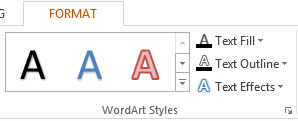

## **ภาพรวม**

WordArt effects ให้คุณเพิ่มข้อความสไตล์และสวยงามลงในงานนำเสนอ PowerPoint ของคุณ ด้วย Aspose.Slides ผู้พัฒนาสามารถสร้าง ปรับแต่ง และจัดการ WordArt ผ่านโปรแกรมได้เช่นเดียวกับใน Microsoft PowerPoint — โดยไม่ต้องติดตั้ง Office บทความนี้ให้ภาพรวมของการทำงานกับ WordArt รวมถึงวิธีการใช้การแปลงข้อความ, สไตล์การเติมสี, เส้นขอบ, เงา และตัวเลือกการจัดรูปแบบอื่น ๆ เพื่อทำให้เนื้อหาในงานนำเสนอของคุณแสดงออกได้ชัดเจนและน่าสนใจขึ้น WordArt ทำให้คุณถือว่าข้อความเป็นออบเจกต์กราฟิก ซึ่งประกอบด้วยเอฟเฟกต์หรือการแก้ไขพิเศษที่นำไปใช้กับข้อความเพื่อทำให้ดูโดดเด่นหรือสังเกตได้ง่ายขึ้น

## **การสร้างเทมเพลต WordArt แบบง่ายและนำไปใช้กับข้อความ**

**Using Aspose.Slides** 

แรกเริ่มเราจะสร้างข้อความง่าย ๆ ด้วยโค้ด Java นี้: 

``` java
import com.aspose.slides.*;

Presentation pres = new Presentation();
try {
    ISlide slide = pres.getSlides().get_Item(0);
    IAutoShape autoShape = slide.getShapes().addAutoShape(ShapeType.Rectangle, 200, 200, 400, 200);
    ITextFrame textFrame = autoShape.getTextFrame();

    Portion portion = (Portion)textFrame.getParagraphs().get_Item(0).getPortions().get_Item(0);
    portion.setText("Aspose.Slides");
} finally {
    if (pres != null) pres.dispose();
}
```
ต่อมาเราตั้งค่าความสูงของฟอนต์ข้อความให้ใหญ่ขึ้นเพื่อทำให้เอฟเฟกต์ชัดเจนขึ้นด้วยโค้ดนี้:

``` java 
import com.aspose.slides.*;

Presentation pres = new Presentation();
try {
    ISlide slide = pres.getSlides().get_Item(0);
    IAutoShape autoShape = slide.getShapes().addAutoShape(ShapeType.Rectangle, 200, 200, 400, 200);
    ITextFrame textFrame = autoShape.getTextFrame();
    Portion portion = (Portion)textFrame.getParagraphs().get_Item(0).getPortions().get_Item(0);
    portion.setText("Aspose.Slides");

    FontData fontData = new FontData("Arial Black");
    portion.getPortionFormat().setLatinFont(fontData);
    portion.getPortionFormat().setFontHeight(36);
} finally {
    if (pres != null) pres.dispose();
}
```

**Using Microsoft PowerPoint**

ไปที่เมนู WordArt effects ใน Microsoft PowerPoint:



จากเมนูด้านขวา คุณสามารถเลือกเอฟเฟกต์ WordArt ที่กำหนดไว้ล่วงหน้าได้ จากเมนูด้านซ้าย คุณสามารถกำหนดค่าต่าง ๆ สำหรับ WordArt ใหม่ได้  

ต่อไปนี้คือพารามิเตอร์หรือ 옵션ที่มีให้เลือกบางส่วน:


**Using Aspose.Slides**

ที่นี่เรานำสีรูปแบบ [SmallGrid](https://reference.aspose.com/slides/th/java/com.aspose.slides/PatternStyle#SmallGrid) ไปใช้กับข้อความและเพิ่มเส้นขอบข้อความสีดำความกว้าง 1 ด้วยโค้ดนี้:

``` java 
import com.aspose.slides.*;
import java.awt.Color;

Presentation pres = new Presentation();
try {
    ISlide slide = pres.getSlides().get_Item(0);
    IAutoShape autoShape = slide.getShapes().addAutoShape(ShapeType.Rectangle, 200, 200, 400, 200);
    ITextFrame textFrame = autoShape.getTextFrame();
    Portion portion = (Portion)textFrame.getParagraphs().get_Item(0).getPortions().get_Item(0);
    portion.setText("Aspose.Slides");

    portion.getPortionFormat().getFillFormat().setFillType(FillType.Pattern);
    portion.getPortionFormat().getFillFormat().getPatternFormat().getForeColor().setColor(Color.ORANGE);
    portion.getPortionFormat().getFillFormat().getPatternFormat().getBackColor().setColor(Color.WHITE);
    portion.getPortionFormat().getFillFormat().getPatternFormat().setPatternStyle(PatternStyle.SmallGrid);

    portion.getPortionFormat().getLineFormat().getFillFormat().setFillType(FillType.Solid);
    portion.getPortionFormat().getLineFormat().getFillFormat().getSolidFillColor().setColor(Color.BLACK);
} finally {
    if (pres != null) pres.dispose();
}
```

ผลลัพธ์ของข้อความ:


## **การใช้เอฟเฟกต์ WordArt อื่น ๆ**

**Using Microsoft PowerPoint**

จากส่วนติดต่อของโปรแกรม คุณสามารถใช้เอฟเฟกต์เหล่านี้กับข้อความ, กลุ่มข้อความ, รูปร่าง หรือองค์ประกอบที่คล้ายกันได้:


ตัวอย่างเช่น เอฟเฟกต์ Shadow, Reflection และ Glow สามารถใช้กับข้อความ; เอฟเฟกต์ 3D Format และ 3D Rotation สามารถใช้กับกลุ่มข้อความ; คุณสมบัติ Soft Edges สามารถใช้กับ Shape Object (แม้ไม่มีการตั้งค่า 3D Format ก็ตาม)

### **การใช้ Shadow Effects**

ที่นี่เราตั้งค่าคุณสมบัติเกี่ยวกับข้อความเท่านั้น เราใช้เอฟเฟกต์เงากับข้อความโดยใช้โค้ด Java นี้:

``` java
import com.aspose.slides.*;
import java.awt.Color;

Presentation pres = new Presentation();
try {
    ISlide slide = pres.getSlides().get_Item(0);
    IAutoShape autoShape = slide.getShapes().addAutoShape(ShapeType.Rectangle, 200, 200, 400, 200);
    ITextFrame textFrame = autoShape.getTextFrame();
    Portion portion = (Portion)textFrame.getParagraphs().get_Item(0).getPortions().get_Item(0);
    portion.setText("Aspose.Slides");

    portion.getPortionFormat().getEffectFormat().enableOuterShadowEffect();
    portion.getPortionFormat().getEffectFormat().getOuterShadowEffect().getShadowColor().setColor(Color.BLACK);
    portion.getPortionFormat().getEffectFormat().getOuterShadowEffect().setScaleHorizontal(100);
    portion.getPortionFormat().getEffectFormat().getOuterShadowEffect().setScaleVertical(65);
    portion.getPortionFormat().getEffectFormat().getOuterShadowEffect().setBlurRadius(4.73);
    portion.getPortionFormat().getEffectFormat().getOuterShadowEffect().setDirection(230);
    portion.getPortionFormat().getEffectFormat().getOuterShadowEffect().setDistance(2);
    portion.getPortionFormat().getEffectFormat().getOuterShadowEffect().setSkewHorizontal(30);
    portion.getPortionFormat().getEffectFormat().getOuterShadowEffect().setSkewVertical(0);
    portion.getPortionFormat().getEffectFormat().getOuterShadowEffect().getShadowColor().getColorTransform().add(ColorTransformOperation.SetAlpha, 0.32f);
} finally {
    if (pres != null) pres.dispose();
}
```

Aspose.Slides API รองรับเงา 3 ประเภท: OuterShadow, InnerShadow, และ PresetShadow  

ด้วย PresetShadow คุณสามารถใช้เงาสำหรับข้อความ (โดยใช้ค่าที่กำหนดไว้ล่วงหน้า)  

**Using Microsoft PowerPoint**

ใน PowerPoint คุณสามารถใช้เงาแบบเดียวได้ ตัวอย่างเช่น:


**Using Aspose.Slides**

Aspose.Slides จริง ๆ แล้วอนุญาตให้ใช้เงาสองประเภทพร้อมกัน: InnerShadow และ PresetShadow  

**Notes:**

- เมื่อใช้ OuterShadow และ PresetShadow ร่วมกัน จะมีเพียงเอฟเฟกต์ OuterShadow เท่านั้นที่ถูกนำไปใช้  
- หากใช้ OuterShadow และ InnerShadow พร้อมกัน เอฟเฟกต์ที่ได้หรือที่นำไปใช้จะขึ้นอยู่กับรุ่นของ PowerPoint ตัวอย่างเช่น ใน PowerPoint 2013 เอฟเฟกต์จะเพิ่มเป็นสองเท่า แต่ใน PowerPoint 2007 จะใช้เอฟเฟกต์ OuterShadow เท่านั้น  

### **การใช้ Display กับข้อความ**

เราจะเพิ่ม Display ให้กับข้อความด้วยตัวอย่างโค้ด Java นี้:

``` java
import com.aspose.slides.*;

Presentation pres = new Presentation();
try {
    ISlide slide = pres.getSlides().get_Item(0);
    IAutoShape autoShape = slide.getShapes().addAutoShape(ShapeType.Rectangle, 200, 200, 400, 200);
    ITextFrame textFrame = autoShape.getTextFrame();
    Portion portion = (Portion)textFrame.getParagraphs().get_Item(0).getPortions().get_Item(0);
    portion.setText("Aspose.Slides");

    portion.getPortionFormat().getEffectFormat().enableReflectionEffect();
    portion.getPortionFormat().getEffectFormat().getReflectionEffect().setBlurRadius(0.5);
    portion.getPortionFormat().getEffectFormat().getReflectionEffect().setDistance(4.72);
    portion.getPortionFormat().getEffectFormat().getReflectionEffect().setStartPosAlpha(0f);
    portion.getPortionFormat().getEffectFormat().getReflectionEffect().setEndPosAlpha(60f);
    portion.getPortionFormat().getEffectFormat().getReflectionEffect().setDirection(90);
    portion.getPortionFormat().getEffectFormat().getReflectionEffect().setScaleHorizontal(100);
    portion.getPortionFormat().getEffectFormat().getReflectionEffect().setScaleVertical(-100);
    portion.getPortionFormat().getEffectFormat().getReflectionEffect().setStartReflectionOpacity(60f);
    portion.getPortionFormat().getEffectFormat().getReflectionEffect().setEndReflectionOpacity(0.9f);
    portion.getPortionFormat().getEffectFormat().getReflectionEffect().setRectangleAlign(RectangleAlignment.BottomLeft);   
} finally {
    if (pres != null) pres.dispose();
}
```

### **การใช้ Glow Effect กับข้อความ**

เรานำเอฟเฟกต์ Glow ไปใช้กับข้อความเพื่อทำให้ข้อความสว่างหรือเด่นขึ้นโดยใช้โค้ดนี้:

``` java
import com.aspose.slides.*;

Presentation pres = new Presentation();
try {
    ISlide slide = pres.getSlides().get_Item(0);
    IAutoShape autoShape = slide.getShapes().addAutoShape(ShapeType.Rectangle, 200, 200, 400, 200);
    ITextFrame textFrame = autoShape.getTextFrame();
    Portion portion = (Portion)textFrame.getParagraphs().get_Item(0).getPortions().get_Item(0);
    portion.setText("Aspose.Slides");

    portion.getPortionFormat().getEffectFormat().enableGlowEffect();
    portion.getPortionFormat().getEffectFormat().getGlowEffect().getColor().setR((byte)255);
    portion.getPortionFormat().getEffectFormat().getGlowEffect().getColor().getColorTransform().add(ColorTransformOperation.SetAlpha, 0.54f);
    portion.getPortionFormat().getEffectFormat().getGlowEffect().setRadius(7);
} finally {
    if (pres != null) pres.dispose();
}
```

ผลลัพธ์ของการดำเนินการ:


{} 
คุณสามารถเปลี่ยนพารามิเตอร์สำหรับ Shadow, Display, และ Glow ได้ คุณสมบัติของเอฟเฟกต์จะถูกตั้งค่าแยกกันบนแต่ละส่วนของข้อความ  
{} 

### **การใช้ Transformations ใน WordArt**

เราใช้คุณสมบัติ Transform (ที่มีอยู่ในบล็อกข้อความทั้งหมด) ด้วยโค้ดนี้:
``` java 
import com.aspose.slides.*;

Presentation pres = new Presentation();
try {
    ISlide slide = pres.getSlides().get_Item(0);
    IAutoShape autoShape = slide.getShapes().addAutoShape(ShapeType.Rectangle, 200, 200, 400, 200);
    ITextFrame textFrame = autoShape.getTextFrame();
    textFrame.setText("Aspose.Slides");

    textFrame.getTextFrameFormat().setTransform(TextShapeType.ArchUpPour);
} finally {
    if (pres != null) pres.dispose();
}
```

ผลลัพธ์:


{} 
ทั้ง Microsoft PowerPoint และ Aspose.Slides for Java มีประเภทการแปลงที่กำหนดล่วงหน้าจำนวนหนึ่ง  
{} 

**Using PowerPoint**

เพื่อเข้าถึงประเภทการแปลงที่กำหนดล่วงหน้า ให้ไปที่: **Format** -> **TextEffect** -> **Transform**

**Using Aspose.Slides**

เพื่อเลือกประเภทการแปลง ใช้ enum `TextShapeType`  

### **การใช้ 3D effects กับข้อความและรูปร่าง**

เราตั้งค่า 3D effect ให้กับรูปร่างข้อความด้วยโค้ดตัวอย่างนี้:

``` java
import com.aspose.slides.*;
import java.awt.Color;

Presentation pres = new Presentation();
try {
    ISlide slide = pres.getSlides().get_Item(0);
    IAutoShape autoShape = slide.getShapes().addAutoShape(ShapeType.Rectangle, 200, 200, 400, 200);
    autoShape.getTextFrame().setText("Aspose.Slides");

    autoShape.getThreeDFormat().getBevelBottom().setBevelType(BevelPresetType.Circle);
    autoShape.getThreeDFormat().getBevelBottom().setHeight(10.5);
    autoShape.getThreeDFormat().getBevelBottom().setWidth(10.5);

    autoShape.getThreeDFormat().getBevelTop().setBevelType(BevelPresetType.Circle);
    autoShape.getThreeDFormat().getBevelTop().setHeight(12.5);
    autoShape.getThreeDFormat().getBevelTop().setWidth(11);

    autoShape.getThreeDFormat().getExtrusionColor().setColor(Color.ORANGE);
    autoShape.getThreeDFormat().setExtrusionHeight(6);

    autoShape.getThreeDFormat().getContourColor().setColor(Color.RED);
    autoShape.getThreeDFormat().setContourWidth(1.5);

    autoShape.getThreeDFormat().setDepth(3);

    autoShape.getThreeDFormat().setMaterial(MaterialPresetType.Plastic);

    autoShape.getThreeDFormat().getLightRig().setDirection(LightingDirection.Top);
    autoShape.getThreeDFormat().getLightRig().setLightType(LightRigPresetType.Balanced);
    autoShape.getThreeDFormat().getLightRig().setRotation(0, 0, 40);

    autoShape.getThreeDFormat().getCamera().setCameraType(CameraPresetType.PerspectiveContrastingRightFacing);
} finally {
    if (pres != null) pres.dispose();
}
```

ข้อความและรูปร่างที่ได้:


เรานำ 3D effect ไปใช้กับข้อความด้วยโค้ด Java นี้:

``` java
import com.aspose.slides.*;
import java.awt.Color;

Presentation pres = new Presentation();
try {
    ISlide slide = pres.getSlides().get_Item(0);
    IAutoShape autoShape = slide.getShapes().addAutoShape(ShapeType.Rectangle, 200, 200, 400, 200);
    ITextFrame textFrame = autoShape.getTextFrame();
    textFrame.setText("Aspose.Slides");

    textFrame.getTextFrameFormat().getThreeDFormat().getBevelBottom().setBevelType(BevelPresetType.Circle);
    textFrame.getTextFrameFormat().getThreeDFormat().getBevelBottom().setHeight(3.5);
    textFrame.getTextFrameFormat().getThreeDFormat().getBevelBottom().setWidth(3.5);

    textFrame.getTextFrameFormat().getThreeDFormat().getBevelTop().setBevelType(BevelPresetType.Circle);
    textFrame.getTextFrameFormat().getThreeDFormat().getBevelTop().setHeight(4);
    textFrame.getTextFrameFormat().getThreeDFormat().getBevelTop().setWidth(4);

    textFrame.getTextFrameFormat().getThreeDFormat().getExtrusionColor().setColor(Color.ORANGE);
    textFrame.getTextFrameFormat().getThreeDFormat().setExtrusionHeight(6);

    textFrame.getTextFrameFormat().getThreeDFormat().getContourColor().setColor(Color.RED);
    textFrame.getTextFrameFormat().getThreeDFormat().setContourWidth(1.5);

    textFrame.getTextFrameFormat().getThreeDFormat().setDepth(3);

    textFrame.getTextFrameFormat().getThreeDFormat().setMaterial(MaterialPresetType.Plastic);

    textFrame.getTextFrameFormat().getThreeDFormat().getLightRig().setDirection(LightingDirection.Top);
    textFrame.getTextFrameFormat().getThreeDFormat().getLightRig().setLightType(LightRigPresetType.Balanced);
    textFrame.getTextFrameFormat().getThreeDFormat().getLightRig().setRotation(0, 0, 40);

    textFrame.getTextFrameFormat().getThreeDFormat().getCamera().setCameraType(CameraPresetType.PerspectiveContrastingRightFacing);
} finally {
    if (pres != null) pres.dispose();
}
```

ผลลัพธ์ของการดำเนินการ:


{} 
การใช้งาน 3D effects กับข้อความหรือรูปร่างและการโต้ตอบระหว่างเอฟเฟกต์ต่าง ๆ มีพื้นฐานมาจากกฎบางอย่าง  

ลองนึกภาพฉากสำหรับข้อความและรูปร่างที่บรรจุข้อความนั้น 3D effect ประกอบด้วยการแสดงออบเจกต์ 3D และฉากที่ออบเจกต์ถูกวาง  

- เมื่อฉากถูกตั้งค่าสำหรับทั้งรูปและข้อความ ฉากของรูปจะมีลำดับความสำคัญสูงกว่า — ฉากของข้อความจะถูกละเว้น  
- เมื่อรูปไม่มีฉากของตัวเองแต่มีการแสดง 3D จะใช้ฉากของข้อความ  
- หากรูปไม่มีเอฟเฟกต์ 3D ดั้งเดิมเลย รูปร่างจะอยู่ในระดับแบนและเอฟเฟกต์ 3D จะถูกนำไปใช้เฉพาะกับข้อความเท่านั้น  

คำอธิบายเหล่านี้เชื่อมโยงกับเมธอด `ThreeDFormat.getLightRig()` และ `ThreeDFormat.getCamera()`  
{} 

## **การนำ Outer Shadow Effects ไปใช้กับข้อความ**
Aspose.Slides for Java มีคลาส [**IOuterShadow**](https://reference.aspose.com/slides/th/java/com.aspose.slides/ioutershadow/) และ [**IInnerShadow**](https://reference.aspose.com/slides/th/java/com.aspose.slides/iinnershadow/) ที่อนุญาตให้คุณนำเอฟเฟกต์เงาไปใช้กับข้อความที่อยู่ใน [TextFrame](https://reference.aspose.com/slides/th/java/com.aspose.slides/textframe/) ทำตามขั้นตอนต่อไปนี้:

1. สร้างอินสแตนซ์ของคลาส [Presentation](https://reference.aspose.com/slides/th/java/com.aspose.slides/presentation)  
2. ดึงอ้างอิงของสไลด์โดยใช้ดัชนีของมัน  
3. เพิ่ม AutoShape ประเภท Rectangle ลงในสไลด์  
4. เข้าถึง TextFrame ที่เชื่อมโยงกับ AutoShape  
5. ตั้งค่า FillType ของ AutoShape เป็น NoFill  
6. สร้างอินสแตนซ์ของคลาส OuterShadow  
7. ตั้งค่า BlurRadius ของเงา  
8. ตั้งค่า Direction ของเงา  
9. ตั้งค่า Distance ของเงา  
10. ตั้งค่า RectanglelAlign เป็น TopLeft  
11. ตั้งค่า PresetColor ของเงาเป็น Black  
12. บันทึกการนำเสนอเป็นไฟล์ [PPTX](https://docs.fileformat.com/presentation/pptx/)  

โค้ดตัวอย่างใน Java — การนำขั้นตอนข้างต้นมาปฏิบัติ แสดงวิธีการนำเอฟเฟกต์ Outer Shadow ไปใช้กับข้อความ:

```java
import com.aspose.slides.*;

Presentation pres = new Presentation();
try {
    // รับอ้างอิงของสไลด์
    ISlide sld = pres.getSlides().get_Item(0);

    // เพิ่ม AutoShape ประเภท Rectangle
    IAutoShape ashp = sld.getShapes().addAutoShape(ShapeType.Rectangle, 150, 75, 150, 50);

    // เพิ่ม TextFrame ไปยัง Rectangle
    ashp.addTextFrame("Aspose TextBox");

    // ปิดการเติมสีของรูปร่างในกรณีที่ต้องการเงาของข้อความ
    ashp.getFillFormat().setFillType(FillType.NoFill);

    // เพิ่มเงานอกและตั้งค่าพารามิเตอร์ที่จำเป็นทั้งหมด
    ashp.getEffectFormat().enableOuterShadowEffect();
    IOuterShadow shadow = ashp.getEffectFormat().getOuterShadowEffect();
    shadow.setBlurRadius(4.0);
    shadow.setDirection(45);
    shadow.setDistance(3);
    shadow.setRectangleAlign(RectangleAlignment.TopLeft);
    shadow.getShadowColor().setPresetColor(PresetColor.Black);

    // บันทึกการนำเสนอลงดิสก์
    pres.save("pres_out.pptx", SaveFormat.Pptx);
} finally {
    if (pres != null) pres.dispose();
}
```

## **การนำ Inner Shadow Effect ไปใช้กับรูปร่าง**
ทำตามขั้นตอนต่อไปนี้:

1. สร้างอินสแตนซ์ของคลาส [Presentation](https://reference.aspose.com/slides/th/java/com.aspose.slides/presentation)  
2. ดึงอ้างอิงของสไลด์  
3. เพิ่ม AutoShape ประเภท Rectangle  
4. เปิดใช้ InnerShadowEffect  
5. ตั้งค่าพารามิเตอร์ทั้งหมดที่จำเป็น  
6. ตั้งค่า ColorType เป็น Scheme  
7. กำหนด Scheme Color  
8. บันทึกการนำเสนอเป็นไฟล์ [PPTX](https://docs.fileformat.com/presentation/pptx/)  

โค้ดตัวอย่าง (ตามขั้นตอนข้างต้น) แสดงวิธีการนำเอฟเฟกต์ Inner Shadow ไปใช้กับข้อความในรูปร่างด้วย Java:

```java
import com.aspose.slides.*;

Presentation pres = new Presentation();
try {
    // รับอ้างอิงของสไลด์
    ISlide slide = pres.getSlides().get_Item(0);

    // เพิ่ม AutoShape ชนิด Rectangle
    IAutoShape ashp = slide.getShapes().addAutoShape(ShapeType.Rectangle, 150, 75, 400, 300);
    ashp.getFillFormat().setFillType(FillType.NoFill);

    // เพิ่ม TextFrame ไปยัง Rectangle
    ashp.addTextFrame("Aspose TextBox");
    IPortion port = ashp.getTextFrame().getParagraphs().get_Item(0).getPortions().get_Item(0);
    IPortionFormat pf = port.getPortionFormat();
    pf.setFontHeight(50);

    // เปิดใช้งาน InnerShadowEffect
    IEffectFormat ef = pf.getEffectFormat();
    ef.enableInnerShadowEffect();

    // ตั้งค่าพารามิเตอร์ที่จำเป็นทั้งหมด
    ef.getInnerShadowEffect().setBlurRadius(8.0);
    ef.getInnerShadowEffect().setDirection(90.0F);
    ef.getInnerShadowEffect().setDistance(6.0);
    ef.getInnerShadowEffect().getShadowColor().setB((byte)189);

    // ตั้งค่า ColorType เป็น Scheme
    ef.getInnerShadowEffect().getShadowColor().setColorType(ColorType.Scheme);

    // ตั้งค่า Scheme Color
    ef.getInnerShadowEffect().getShadowColor().setSchemeColor(SchemeColor.Accent1);

    // บันทึกการนำเสนอ
    pres.save("WordArt_out.pptx", SaveFormat.Pptx);
} finally {
    if (pres != null) pres.dispose();
}
```

## **FAQ**

### สามารถใช้ WordArt effects กับฟอนต์หรือสคริปต์ที่ต่างกัน (เช่น Arabic, Chinese) ได้หรือไม่?

ได้, Aspose.Slides รองรับ Unicode และทำงานร่วมกับฟอนต์และสคริปต์หลักทั้งหมด เอฟเฟกต์ WordArt เช่นเงา, เติมสี, และเส้นขอบสามารถใช้ได้โดยไม่คำนึงถึงภาษา แม้ว่าความพร้อมใช้งานของฟอนต์และการแสดงผลอาจขึ้นกับฟอนต์บนระบบ

### สามารถนำ WordArt effects ไปใช้กับองค์ประกอบของ slide master ได้หรือไม่?

ได้, คุณสามารถนำ WordArt effects ไปใช้กับรูปร่างบน master slide รวมถึง placeholder สำหรับหัวเรื่อง, ฟุตเตอร์, หรือข้อความพื้นหลัง การเปลี่ยนแปลงบนเลเอาต์แม่จะสะท้อนให้กับสไลด์ทั้งหมดที่อ้างอิง

### WordArt effects มีผลต่อขนาดไฟล์ของการนำเสนอหรือไม่?

มีผลเล็กน้อย เอฟเฟกต์ WordArt เช่นเงา, glow, และ gradient fill อาจทำให้ขนาดไฟล์เพิ่มขึ้นบ้างเนื่องจากเมตาดาท่าการจัดรูปแบบที่เพิ่มเข้ามา แต่ส่วนต่างมักไม่เป็นที่สังเกต

### สามารถดูตัวอย่างผลลัพธ์ของ WordArt effects ได้โดยไม่ต้องบันทึกการนำเสนอหรือไม่?

ได้, คุณสามารถเรนเดอร์สไลด์ที่มี WordArt เป็นภาพ (เช่น PNG, JPEG) โดยใช้เมธอด `getImage` จากอินเตอร์เฟส [IShape](https://reference.aspose.com/slides/th/java/com.aspose.slides/ishape/) หรือ [ISlide](https://reference.aspose.com/slides/th/java/com.aspose.slides/islide/) นั่นทำให้คุณสามารถดูตัวอย่างผลลัพธ์ในหน่วยความจำหรือบนหน้าจอก่อนบันทึกหรือส่งออกการนำเสนอเต็มรูปแบบ