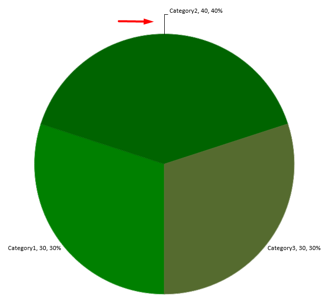

## **บทนำ**

ป้ายข้อมูลจะแสดงข้อมูลเกี่ยวกับชุดข้อมูลของแผนภูมิและจุดข้อมูลแต่ละจุด ช่วยให้ผู้อ่านระบุค่าต่าง ๆ และเข้าใจแผนภูมิได้ดีขึ้น บทความนี้อธิบายวิธีการจัดรูปแบบค่า การแสดงเปอร์เซ็นต์ การอ่านข้อความป้าย การควบคุมป้ายที่อยู่นอกค่าขีดสูงสุดของแกน การปรับการเว้นระยะป้ายแกนหมวดหมู่ และการกำหนดตำแหน่งป้ายบนแผนภูมิกระจาย

## **ตั้งค่าความแม่นยำของข้อมูลในป้ายข้อมูลของแผนภูมิ**

ใช้ [setNumberFormatOfValues](https://reference.aspose.com/slides/th/java/com.aspose.slides/ichartseries/#setNumberFormatOfValues-java.lang.String-) เพื่อจัดรูปแบบค่าชุดข้อมูล ตัวอย่างนี้สร้างแผนภูมิเส้นพร้อมข้อมูลเริ่มต้น แสดงตารางข้อมูลของแผนภูมิ และเปิดใช้ป้ายค่าภายใต้ชุดข้อมูลแรก รูปแบบ `#,##0.00` จะใส่เครื่องหมายคั่นหลักพันและแสดงถึงทศนิยมสองตำแหน่งโดยไม่เปลี่ยนค่าต้นฉบับ

```java
import com.aspose.slides.*;

Presentation presentation = new Presentation();
try {
    ISlide slide = presentation.getSlides().get_Item(0);

    IChart chart = slide.getShapes().addChart(ChartType.Line, 50, 50, 450, 300);
    chart.setDataTable(true);

    IChartSeries series = chart.getChartData().getSeries().get_Item(0);
    series.setNumberFormatOfValues("#,##0.00");
    series.getLabels().getDefaultDataLabelFormat().setShowValue(true);

    presentation.save("PrecisionOfDatalabels_out.pptx", SaveFormat.Pptx);
} finally {
    presentation.dispose();
}
```

## **แสดงเปอร์เซ็นต์เป็นป้าย**

สำหรับแผนภูมิแท่งซ้อน ต้องคำนวณค่าต่าง ๆ เป็นเปอร์เซ็นต์ของผลรวมประเภทนั้นแล้วกำหนดข้อความให้กับเฟรมข้อความที่คืนจาก [getTextFrameForOverriding](https://reference.aspose.com/slides/th/java/com.aspose.slides/ioverridabletext/#getTextFrameForOverriding--) ตัวอย่างนี้ใช้ข้อมูลแผนภูมิเบื้องต้นและแสดงเปอร์เซ็นต์ด้วยสองตำแหน่งทศนิยมในแบบอักษรขนาด 8pt ประเภทที่ผลรวมเป็นศูนย์จะถูกข้ามเพื่อหลีกเลี่ยงการหารด้วยศูนย์ หากข้อมูลแผนภูมิมีการเปลี่ยนแปลงให้คำนวณข้อความป้ายแบบกำหนดใหม่

```java
import com.aspose.slides.*;
import java.util.Locale;

Presentation presentation = new Presentation();
try {
    ISlide slide = presentation.getSlides().get_Item(0);

    IChart chart = slide.getShapes().addChart(ChartType.StackedColumn, 20, 20, 400, 400);

    double[] categoryTotals = new double[chart.getChartData().getCategories().size()];
    for (int k = 0; k < chart.getChartData().getCategories().size(); k++) {
        for (int i = 0; i < chart.getChartData().getSeries().size(); i++) {
            IChartSeries series = chart.getChartData().getSeries().get_Item(i);
            Number pointValue = (Number) series.getDataPoints().get_Item(k).getValue().getData();
            categoryTotals[k] += pointValue.doubleValue();
        }
    }

    for (int x = 0; x < chart.getChartData().getSeries().size(); x++) {
        IChartSeries series = chart.getChartData().getSeries().get_Item(x);
        series.getLabels().getDefaultDataLabelFormat().setShowLegendKey(false);

        for (int j = 0; j < series.getDataPoints().size(); j++) {
            IDataLabel label = series.getDataPoints().get_Item(j).getLabel();
            if (categoryTotals[j] == 0) {
                continue;
            }

            Number pointValue = (Number) series.getDataPoints().get_Item(j).getValue().getData();
            double dataPointPercent = (pointValue.doubleValue() / categoryTotals[j]) * 100;

            IPortion portion = new Portion();
            portion.setText(String.format(Locale.US, "%.2f %%", dataPointPercent));
            portion.getPortionFormat().setFontHeight(8f);

            label.getTextFrameForOverriding().setText("");
            IParagraph paragraph = label.getTextFrameForOverriding().getParagraphs().get_Item(0);
            paragraph.getPortions().add(portion);

            label.getDataLabelFormat().setShowValue(true);
            label.getDataLabelFormat().setShowSeriesName(false);
            label.getDataLabelFormat().setShowPercentage(false);
            label.getDataLabelFormat().setShowLegendKey(false);
            label.getDataLabelFormat().setShowCategoryName(false);
            label.getDataLabelFormat().setShowBubbleSize(false);
        }
    }

    presentation.save("DisplayPercentageAsLabels_out.pptx", SaveFormat.Pptx);
} finally {
    presentation.dispose();
}
```

## **ตั้งค่าสัญลักษณ์เปอร์เซ็นต์กับป้ายข้อมูลของแผนภูมิ**

เมื่อค่าถูกจัดเก็บเป็นเศษส่วน ให้ใช้ [setNumberFormat](https://reference.aspose.com/slides/th/java/com.aspose.slides/idatalabelformat/#setNumberFormat-java.lang.String-) เพื่อแสดงเปอร์เซ็นต์ ส่งค่า `false` ไปยัง [setNumberFormatLinkedToSource](https://reference.aspose.com/slides/th/java/com.aspose.slides/idatalabelformat/#setNumberFormatLinkedToSource-boolean-) เพื่อให้รูปแบบป้ายทำงานอิสระจากเซลล์ต้นทาง

ตัวอย่างนี้สร้างแผนภูมิแท่งซ้อน 100% ที่มีชุดสีแดงและสีน้ำเงินในสี่ประเภท แต่ละคู่ค่ารวมกันเป็น 1 รูปแบบป้าย `0.0%` จะแสดง 0.30 เป็น 30.0% ในขณะที่แกนแนวตั้งใช้ทศนิยมสองตำแหน่ง ทั้งสองชุดใช้ข้อความป้ายสีขาวขนาด 10pt

```java
import com.aspose.slides.*;
import java.awt.Color;

Presentation presentation = new Presentation();
try {
    ISlide slide = presentation.getSlides().get_Item(0);

    IChart chart = slide.getShapes().addChart(ChartType.PercentsStackedColumn, 20, 20, 500, 400);

    chart.getAxes().getVerticalAxis().setNumberFormatLinkedToSource(false);
    chart.getAxes().getVerticalAxis().setNumberFormat("0.00%");

    chart.getChartData().getSeries().clear();
    chart.getChartData().getCategories().clear();

    IChartDataWorkbook workbook = chart.getChartData().getChartDataWorkbook();
    int worksheetIndex = 0;
    for (int i = 0; i < 4; i++) {
        IChartDataCell categoryCell = workbook.getCell(worksheetIndex, i + 1, 0, "Category " + (i + 1));
        chart.getChartData().getCategories().add(categoryCell);
    }

    String[] seriesNames = { "Reds", "Blues" };
    Color[] seriesColors = { Color.RED, Color.BLUE };
    double[][] values = { { 0.30, 0.50, 0.80, 0.65 }, { 0.70, 0.50, 0.20, 0.35 } };

    for (int i = 0; i < seriesNames.length; i++) {
        IChartDataCell seriesCell = workbook.getCell(worksheetIndex, 0, i + 1, seriesNames[i]);
        IChartSeries series = chart.getChartData().getSeries().add(seriesCell, chart.getType());
        for (int j = 0; j < 4; j++) {
            IChartDataCell valueCell = workbook.getCell(worksheetIndex, j + 1, i + 1, values[i][j]);
            series.getDataPoints().addDataPointForBarSeries(valueCell);
        }

        series.getFormat().getFill().setFillType(FillType.Solid);
        series.getFormat().getFill().getSolidFillColor().setColor(seriesColors[i]);

        IDataLabelFormat labelFormat = series.getLabels().getDefaultDataLabelFormat();
        labelFormat.setShowValue(true);
        labelFormat.setNumberFormatLinkedToSource(false);
        labelFormat.setNumberFormat("0.0%");
        labelFormat.getTextFormat().getPortionFormat().setFontHeight(10);
        labelFormat.getTextFormat().getPortionFormat().getFillFormat().setFillType(FillType.Solid);
        labelFormat.getTextFormat().getPortionFormat().getFillFormat().getSolidFillColor().setColor(Color.WHITE);
    }

    presentation.save("SetDataLabelsPercentageSign_out.pptx", SaveFormat.Pptx);
} finally {
    presentation.dispose();
}
```

## **อ่านข้อความจริงของป้ายข้อมูล**

ใช้ [getActualLabelText](https://reference.aspose.com/slides/th/java/com.aspose.slides/idatalabel/#getActualLabelText--) เพื่อดึงข้อความที่สร้างจากการตั้งค่าของป้ายข้อมูล ซึ่งมีประโยชน์เมื่อดึงป้ายไปใช้ในรายงาน ค้นหาข้อมูลในงานนำเสนอ หรือทดสอบความถูกต้องของแผนภูมิที่สร้างขึ้น ในตัวอย่างด้านล่าง รูปแบบป้ายข้อมูลเริ่มต้น [data label format](https://reference.aspose.com/slides/th/java/com.aspose.slides/idatalabelformat/) รวมชื่อประเภท ชื่อชุดข้อมูล และค่าไว้ด้วยกัน จุดข้อมูลหนึ่งจะแสดงค่าของมันเป็นเปอร์เซ็นต์ อีกจุดหนึ่งใช้ข้อความกำหนดเองจาก [getTextFrameForOverriding](https://reference.aspose.com/slides/th/java/com.aspose.slides/ioverridabletext/#getTextFrameForOverriding--)

```java
import com.aspose.slides.*;

Presentation presentation = new Presentation();
try {
    ISlide slide = presentation.getSlides().get_Item(0);

    IChart chart = slide.getShapes().addChart(ChartType.ClusteredColumn, 20, 20, 500, 300);

    chart.getChartData().getSeries().clear();
    chart.getChartData().getCategories().clear();

    IChartDataWorkbook workbook = chart.getChartData().getChartDataWorkbook();
    IChartDataCell firstCategoryCell = workbook.getCell(0, 1, 0, "Q1");
    chart.getChartData().getCategories().add(firstCategoryCell);
    IChartDataCell secondCategoryCell = workbook.getCell(0, 2, 0, "Q2");
    chart.getChartData().getCategories().add(secondCategoryCell);

    IChartDataCell northSeriesCell = workbook.getCell(0, 0, 1, "North");
    IChartSeries north = chart.getChartData().getSeries().add(northSeriesCell, chart.getType());
    IChartDataCell northFirstValueCell = workbook.getCell(0, 1, 1, 0.25);
    north.getDataPoints().addDataPointForBarSeries(northFirstValueCell);
    IChartDataCell northSecondValueCell = workbook.getCell(0, 2, 1, 0.75);
    north.getDataPoints().addDataPointForBarSeries(northSecondValueCell);

    IChartDataCell southSeriesCell = workbook.getCell(0, 0, 2, "South");
    IChartSeries south = chart.getChartData().getSeries().add(southSeriesCell, chart.getType());
    IChartDataCell southFirstValueCell = workbook.getCell(0, 1, 2, 0.40);
    south.getDataPoints().addDataPointForBarSeries(southFirstValueCell);
    IChartDataCell southSecondValueCell = workbook.getCell(0, 2, 2, 0.60);
    south.getDataPoints().addDataPointForBarSeries(southSecondValueCell);

    for (IChartSeries series : chart.getChartData().getSeries()) {
        IDataLabelFormat format = series.getLabels().getDefaultDataLabelFormat();
        format.setShowCategoryName(true);
        format.setShowSeriesName(true);
        format.setShowValue(true);
    }

    north.getLabels().get_Item(1).getDataLabelFormat().setNumberFormatLinkedToSource(false);
    north.getLabels().get_Item(1).getDataLabelFormat().setNumberFormat("0%");
    south.getLabels().get_Item(0).getTextFrameForOverriding().setText("Reviewed");

    for (IChartSeries series : chart.getChartData().getSeries()) {
        for (IChartDataPoint point : series.getDataPoints()) {
            IDataLabel label = point.getLabel();
            if (!label.isVisible()) {
                continue;
            }

            System.out.println("Value: " + point.getValue().getData() + "; label: " + label.getActualLabelText());
        }
    }
} finally {
    presentation.dispose();
}
```

ค่าที่จัดเก็บในจุดข้อมูลยังคงเป็น `0.75` แม้ว่าป้ายจะแสดงเป็น `75%` พร้อมกับชื่อประเภทและชุดข้อมูล ข้อความกำหนดเองจะแทนที่ข้อความป้ายที่สร้างขึ้น [getActualLabelText](https://reference.aspose.com/slides/th/java/com.aspose.slides/idatalabel/#getActualLabelText--) จะส่งกลับสตริงของป้ายในทั้งสองกรณี ให้ตรวจสอบ [isVisible](https://reference.aspose.com/slides/th/java/com.aspose.slides/idatalabel/#isVisible--) แยกต่างหากตามที่แสดงด้านบน หากต้องการดึงเฉพาะป้ายที่มองเห็นได้

## **ควบคุมป้ายข้อมูลให้อยู่เหนือค่าขีดสูงสุดของแกน**

เมื่อกำหนดขอบเขตแกนด้วยตนเอง บางจุดข้อมูลอาจเกินค่าขีดสูงสุด การใช้ [setShowDataLabelsOverMaximum](https://reference.aspose.com/slides/th/java/com.aspose.slides/ichart/#setShowDataLabelsOverMaximum-boolean-) จะควบคุมว่าจะแสดงป้ายข้อมูลเหล่านั้นหรือไม่ การตั้งค่านี้เปลี่ยนการมองเห็นของป้ายเท่านั้น ไม่ได้เปลี่ยนขอบเขตแกนหรือค่าข้อมูลพื้นฐาน

ตัวอย่างต่อไปนี้สร้างแผนภูมิคอลัมน์แบบกลุ่ม 2D ที่มีค่า 60 และ 120 โดยส่งค่า `false` ไปยัง [setAutomaticMaxValue](https://reference.aspose.com/slides/th/java/com.aspose.slides/iaxis/#setAutomaticMaxValue-boolean-) และตั้งค่าขีดสูงสุดเป็น 100 ด้วย [setMaxValue](https://reference.aspose.com/slides/th/java/com.aspose.slides/iaxis/#setMaxValue-double-) บนแกนแนวตั้ง สไลด์แรกเปิดให้แสดงป้ายที่เกินขีดสูงสุด; อีกสไลด์หนึ่งทำการปิดการแสดงผล ทั้งสองสไลด์บันทึกเป็น `DataLabelsOverMaximum.pptx`

เปิดใช้ป้ายค่าโดยใช้ [setShowValue](https://reference.aspose.com/slides/th/java/com.aspose.slides/idatalabelformat/#setShowValue-boolean-) การตั้งค่าระดับแผนภูมิไม่ทำให้ค่าถูกแสดงโดยอัตโนมัติ และไม่บังคับให้ป้ายที่ถูกปิดการแสดงค่านั้นแสดงออก ตัวอย่างนี้เปิดใช้ค่าให้กับทั้งชุดข้อมูลและใช้ [setPosition](https://reference.aspose.com/slides/th/java/com.aspose.slides/idatalabelformat/#setPosition-int-) เพื่อวางป้ายที่ปลายนอกของแต่ละคอลัมน์

```java
import com.aspose.slides.*;

Presentation presentation = new Presentation();
try {
    ISlide slide = presentation.getSlides().get_Item(0);

    IChart chart = slide.getShapes().addChart(ChartType.ClusteredColumn, 50, 50, 600, 400);
    chart.setLegend(false);

    chart.getChartData().getSeries().clear();
    chart.getChartData().getCategories().clear();

    IChartDataWorkbook workbook = chart.getChartData().getChartDataWorkbook();

    IChartDataCell firstCategory = workbook.getCell(0, 1, 0, "Within range");
    IChartDataCell secondCategory = workbook.getCell(0, 2, 0, "Above maximum");

    chart.getChartData().getCategories().add(firstCategory);
    chart.getChartData().getCategories().add(secondCategory);

    IChartDataCell seriesName = workbook.getCell(0, 0, 1, "Values");
    IChartSeries series = chart.getChartData().getSeries().add(seriesName, chart.getType());

    IChartDataCell firstValue = workbook.getCell(0, 1, 1, 60);
    IChartDataCell secondValue = workbook.getCell(0, 2, 1, 120);

    series.getDataPoints().addDataPointForBarSeries(firstValue);
    series.getDataPoints().addDataPointForBarSeries(secondValue);

    series.getLabels().getDefaultDataLabelFormat().setShowValue(true);
    series.getLabels().getDefaultDataLabelFormat().setPosition(LegendDataLabelPosition.OutsideEnd);

    chart.getAxes().getVerticalAxis().setAutomaticMaxValue(false);
    chart.getAxes().getVerticalAxis().setMaxValue(100);
    chart.setShowDataLabelsOverMaximum(true);

    ISlide secondSlide = presentation.getSlides().addClone(slide);
    IChart secondChart = (IChart) secondSlide.getShapes().get_Item(0);
    secondChart.setShowDataLabelsOverMaximum(false);

    presentation.save("DataLabelsOverMaximum.pptx", SaveFormat.Pptx);
} finally {
    presentation.dispose();
}
```

ภาพต่อไปนี้แสดงสไลด์ที่บันทึกแล้วโดย Microsoft PowerPoint เมื่อใช้ `true` ป้าย **120** จะมองเห็นที่ขอบบน; เมื่อใช้ `false` ป้ายจะถูกซ่อน ป้าย **60** ยังคงมองเห็นได้ ขีดสูงสุดของแกนคงที่ที่ **100** และจุดข้อมูลที่สองยังคงเป็น **120** ในทุกกรณี

| setShowDataLabelsOverMaximum(true) | setShowDataLabelsOverMaximum(false) |
| --- | --- |
|  |  |

{}
ตัวอย่างนี้ใช้แผนภูมิคอลัมน์ 2D ที่มีแกนค่าตัวเลข แผนภูมิที่ไม่มีแกนค่า เช่น แผนภูมิกระจายและโดนัท จะไม่มีขีดสูงสุดของแกนให้จำกัดแบบนี้
{}

## **ตั้งค่าระยะห่างของป้ายจากแกน**

ใช้ [setLabelOffset](https://reference.aspose.com/slides/th/java/com.aspose.slides/iaxis/#setLabelOffset-int-) เพื่อควบคุมระยะห่างระหว่างป้ายแกนหมวดหมู่และแกนเอง ค่าเป็นเปอร์เซ็นต์ของขนาดฟอนต์สูงสุดของป้ายแกน ตัวอย่างนี้สร้างแผนภูมิคอลัมน์แบบกลุ่มและตั้งค่า offset ของป้ายแกนนอนเป็น 500 การตั้งค่านี้มีผลต่อป้ายแกนหมวดหมู่ ไม่ได้ส่งผลต่อป้ายที่แนบกับจุดข้อมูลแต่ละจุด

```java
import com.aspose.slides.*;

Presentation presentation = new Presentation();
try {
    ISlide slide = presentation.getSlides().get_Item(0);

    IChart chart = slide.getShapes().addChart(ChartType.ClusteredColumn, 20, 20, 500, 300);
    chart.getAxes().getHorizontalAxis().setLabelOffset(500);

    presentation.save("SetCategoryAxisLabelDistance_out.pptx", SaveFormat.Pptx);
} finally {
    presentation.dispose();
}
```

## **ปรับตำแหน่งป้าย**

บนแผนภูมิกระจาย ปรับตำแหน่งป้ายข้อมูลเพื่อเพิ่มช่องว่างและให้มีพื้นที่สำหรับเส้นนำข้อมูล

ตัวอย่างนี้แสดงค่าของจุดข้อมูลแรก วางป้ายนอกส่วนของสไลซ์ และปรับ offset แนวนอนและแนวตั้งโดยใช้ [setX](https://reference.aspose.com/slides/th/java/com.aspose.slides/ilayoutable/#setX-float-) และ [setY](https://reference.aspose.com/slides/th/java/com.aspose.slides/ilayoutable/#setY-float-) Offset เหล่านี้อิงตามความกว้างและความสูงของแผนภูมิ

```java
import com.aspose.slides.*;

Presentation presentation = new Presentation();
try {
    ISlide slide = presentation.getSlides().get_Item(0);
    
    IChart chart = slide.getShapes().addChart(ChartType.Pie, 50, 50, 200, 200);
    IChartSeriesCollection series = chart.getChartData().getSeries();

    IDataLabel label = series.get_Item(0).getLabels().get_Item(0);
    label.getDataLabelFormat().setShowValue(true);
    label.getDataLabelFormat().setPosition(LegendDataLabelPosition.OutsideEnd);
    label.setX(0.71f);
    label.setY(0.04f);

    presentation.save("presentation.pptx", SaveFormat.Pptx);
} finally {
    presentation.dispose();
}
```



## **FAQ**

**ฉันจะป้องกันไม่ให้ป้ายข้อมูลทับซ้อนกันในแผนภูมิที่หนาแน่นได้อย่างไร?**

ผสานการวางป้ายอัตโนมัติ, เส้นนำข้อมูล, และลดขนาดฟอนต์ หากจำเป็นให้ซ่อนบางฟิลด์ (เช่น หมวดหมู่) หรือแสดงป้ายเฉพาะค่าขอบเขตหรือจุดสำคัญเท่านั้น

**ฉันจะปิดการแสดงป้ายเฉพาะค่าศูนย์, ค่าลบ, หรือค่าที่ว่างเปล่าได้อย่างไร?**

กรองจุดข้อมูลก่อนเปิดป้ายและปิดการแสดงผลสำหรับค่าที่เป็น 0, ค่าติดลบ, หรือค่าที่หายไปตามกฎที่กำหนด

**ฉันจะทำให้สไตล์ป้ายคงที่เมื่อส่งออกเป็น PDF/รูปภาพได้อย่างไร?**

กำหนดฟอนต์และขนาดอย่างชัดเจนและตรวจสอบว่าฟอนต์นั้นมีอยู่ในสภาพแวดล้อมการเรนเดอร์เพื่อหลีกเลี่ยงการเปลี่ยนฟอนต์อัตโนมัติ