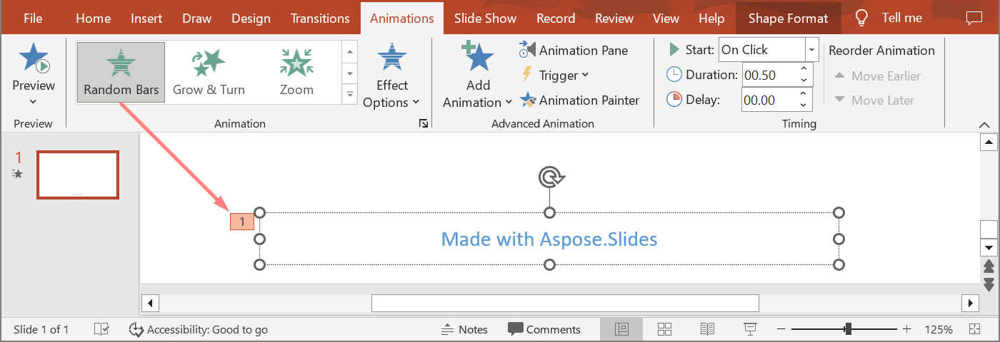

## **บทนำ**

การเคลื่อนไหวเป็นเอฟเฟกต์ภาพที่สามารถนำไปใช้กับข้อความ รูปภาพ รูปร่าง หรือ [แผนภูมิ](https://docs.aspose.com/slides/th/java/animated-charts/). พวกมันทำให้การนำเสนอกลับมามีชีวิตชีวาหรือส่วนประกอบของมัน

## **ทำไมต้องใช้การเคลื่อนไหวในการนำเสนอ?**

* ควบคุมการไหลของข้อมูล
* เน้นจุดสำคัญ
* เพิ่มความสนใจหรือการมีส่วนร่วมของผู้ชม
* ทำให้เนื้อหาง่ายต่อการอ่านหรือทำความเข้าใจหรือประมวลผล
* ดึงความสนใจของผู้อ่านหรือผู้ชมไปยังส่วนที่สำคัญในการนำเสนอ

PowerPoint มีตัวเลือกและเครื่องมือหลายอย่างสำหรับการเคลื่อนไหวและเอฟเฟกต์การเคลื่อนไหวในหมวด **entrance**, **exit**, **emphasis**, และ **motion paths**

## **การเคลื่อนไหวใน Aspose.Slides**

* Aspose.Slides มีคลาสและประเภทที่คุณต้องการเพื่อทำงานกับการเคลื่อนไหวภายใต้เนมสเปซ `Aspose.Slides.Animation`
* Aspose.Slides มีเอฟเฟกต์การเคลื่อนไหวกว่า **150** ชนิดภายใต้ enumeration [EffectType](https://reference.aspose.com/slides/th/java/com.aspose.slides/effecttype) เอฟเฟกต์เหล่านี้โดยพื้นฐานแล้วเหมือนหรือตรงกับเอฟเฟกต์ที่ใช้ใน PowerPoint

## **ใช้การเคลื่อนไหวกับ TextBox**

Aspose.Slides สำหรับ Java ช่วยให้คุณสามารถเพิ่มการเคลื่อนไหวให้กับข้อความในรูปร่างได้

1. สร้างอินสแตนซ์ของคลาส [Presentation](https://reference.aspose.com/slides/th/java/com.aspose.slides/Presentation)
2. รับอ้างอิงสไลด์ผ่านดัชนีของมัน
3. เพิ่ม `rectangle` [IAutoShape](https://reference.aspose.com/slides/th/java/com.aspose.slides/iautoshape)
4. เพิ่มข้อความไปที่ [IAutoShape.TextFrame](https://reference.aspose.com/slides/th/java/com.aspose.slides/IAutoShape#addTextFrame-java.lang.String-)
5. รับลำดับหลักของเอฟเฟกต์
6. เพิ่มเอฟเฟกต์การเคลื่อนไหวให้กับ [IAutoShape](https://reference.aspose.com/slides/th/java/com.aspose.slides/iautoshape)
7. ตั้งค่าคุณสมบัติ `TextAnimation.BuildType` ให้เป็นค่าจาก enumeration `BuildType`
8. เขียนการนำเสนอไปยังดิสก์เป็นไฟล์ PPTX

โค้ด Java นี้แสดงวิธีการเพิ่มเอฟเฟกต์ `Fade` ให้กับ AutoShape และตั้งค่าการเคลื่อนไหวของข้อความเป็นค่า *By 1st Level Paragraphs*:

```java
import com.aspose.slides.*;

// สร้างอินสแตนซ์ของคลาส Presentation ที่เป็นตัวแทนของไฟล์การนำเสนอ.
Presentation pres = new Presentation();
try {
    ISlide sld = pres.getSlides().get_Item(0);

    // เพิ่ม AutoShape ใหม่พร้อมข้อความ
    IAutoShape autoShape = sld.getShapes().addAutoShape(ShapeType.Rectangle, 20, 20, 150, 100);

    ITextFrame textFrame = autoShape.getTextFrame();
    textFrame.setText("First paragraph \nSecond paragraph \n Third paragraph");

    // ดึงลำดับหลักของสไลด์.
    ISequence sequence = sld.getTimeline().getMainSequence();

    // เพิ่มเอฟเฟกต์การเคลื่อนไหว Fade ให้กับรูปร่าง
    IEffect effect = sequence.addEffect(autoShape, EffectType.Fade, EffectSubtype.None, EffectTriggerType.OnClick);

    // ทำให้ข้อความของรูปร่างเคลื่อนไหวตามย่อหน้าแบบระดับที่ 1
    effect.getTextAnimation().setBuildType(BuildType.ByLevelParagraphs1);

    // บันทึกไฟล์ PPTX ไปยังดิสก์
    pres.save("AnimText_out.pptx", SaveFormat.Pptx);
} finally {
    if (pres != null) pres.dispose();
}
```

{} 
นอกจากการเพิ่มการเคลื่อนไหวให้กับข้อความแล้ว คุณยังสามารถเพิ่มการเคลื่อนไหวให้กับ [Paragraph](https://reference.aspose.com/slides/th/java/com.aspose.slides/iparagraph) เดี่ยวได้ ดูที่ [**Animated Text**](/slides/th/java/animated-text/).
{} 

## **ใช้การเคลื่อนไหวกับ PictureFrame**

1. สร้างอินสแตนซ์ของคลาส [Presentation](https://reference.aspose.com/slides/th/java/com.aspose.slides/Presentation)
2. รับอ้างอิงสไลด์ผ่านดัชนีของมัน
3. เพิ่มหรือรับ [PictureFrame](https://reference.aspose.com/slides/th/java/com.aspose.slides/pictureframe) บนสไลด์
4. รับลำดับหลักของเอฟเฟกต์
5. เพิ่มเอฟเฟกต์การเคลื่อนไหวให้กับ [PictureFrame](https://reference.aspose.com/slides/th/java/com.aspose.slides/pictureframe)
6. เขียนการนำเสนอไปยังดิสก์เป็นไฟล์ PPTX

โค้ด Java นี้แสดงวิธีการเพิ่มเอฟเฟกต์ `Fly` ให้กับ picture frame:

```java
import com.aspose.slides.*;

// สร้างอินสแตนซ์ของคลาส Presentation ที่เป็นตัวแทนของไฟล์การนำเสนอ.
Presentation pres = new Presentation();
try {
    // โหลดภาพที่จะเพิ่มในคอลเลกชันภาพของการนำเสนอ
    IPPImage picture;
    IImage image = Images.fromFile("aspose-logo.jpg");
    try {
        picture = pres.getImages().addImage(image);
    } finally {
        if (image != null) image.dispose();
    }

    // เพิ่มกรอบรูปภาพลงในสไลด์
    IPictureFrame picFrame = pres.getSlides().get_Item(0).getShapes().addPictureFrame(ShapeType.Rectangle, 50, 50, 100, 100, picture);

    // ดึงลำดับหลักของสไลด์.
    ISequence sequence = pres.getSlides().get_Item(0).getTimeline().getMainSequence();

    // เพิ่มเอฟเฟกต์การเคลื่อนไหว Fly จากซ้ายให้กับกรอบรูปภาพ
    IEffect effect = sequence.addEffect(picFrame, EffectType.Fly, EffectSubtype.Left, EffectTriggerType.OnClick);

    // บันทึกไฟล์ PPTX ไปยังดิสก์
    pres.save("AnimImage_out.pptx", SaveFormat.Pptx);
} finally {
    if (pres != null) pres.dispose();
}
```

## **ใช้การเคลื่อนไหวกับ Shape**

1. สร้างอินสแตนซ์ของคลาส [Presentation](https://reference.aspose.com/slides/th/java/com.aspose.slides/Presentation)
2. รับอ้างอิงสไลด์ผ่านดัชนีของมัน
3. เพิ่ม `rectangle` [IAutoShape](https://reference.aspose.com/slides/th/java/com.aspose.slides/iautoshape)
4. เพิ่ม `Bevel` [IAutoShape] (เมื่อวัตถุนี้ถูกคลิก การเคลื่อนไหวจะเล่น)
5. สร้างลำดับของเอฟเฟกต์บนรูปร่าง bevel
6. สร้าง `UserPath` แบบกำหนดเอง
7. เพิ่มคำสั่งสำหรับการเคลื่อนที่ไปยัง `UserPath`
8. เขียนการนำเสนอไปยังดิสก์เป็นไฟล์ PPTX

โค้ด Java นี้แสดงวิธีการเพิ่มเอฟเฟกต์ `PathFootball` (path football) ให้กับรูปร่าง:

```java
import com.aspose.slides.*;
import java.awt.geom.Point2D;

// สร้างอินสแตนซ์ของคลาส Presentation ที่เป็นตัวแทนของไฟล์ PPTX.
Presentation pres = new Presentation();
try {
    ISlide sld = pres.getSlides().get_Item(0);

    // สร้างเอฟเฟกต์ PathFootball สำหรับรูปทรงที่มีอยู่จากศูนย์.
    IAutoShape ashp = sld.getShapes().addAutoShape(ShapeType.Rectangle, 150, 150, 250, 25);
    ashp.addTextFrame("Animated TextBox");

    // เพิ่มเอฟเฟกต์การเคลื่อนไหว PathFootBall
    pres.getSlides().get_Item(0).getTimeline().getMainSequence().addEffect(ashp, EffectType.PathFootball,
            EffectSubtype.None, EffectTriggerType.AfterPrevious);

    // สร้างสิ่งที่คล้ายกับ "ปุ่ม".
    IShape shapeTrigger = pres.getSlides().get_Item(0).getShapes().addAutoShape(ShapeType.Bevel, 10, 10, 20, 20);

    // สร้างลำดับของเอฟเฟกต์สำหรับปุ่มนี้.
    ISequence seqInter = pres.getSlides().get_Item(0).getTimeline().getInteractiveSequences().add(shapeTrigger);

     // สร้างเส้นทางผู้ใช้แบบกำหนดเอง. วัตถุของเราจะเคลื่อนที่เฉพาะหลังจากคลิกปุ่มเท่านั้น.
    IEffect fxUserPath = seqInter.addEffect(ashp, EffectType.PathUser, EffectSubtype.None, EffectTriggerType.OnClick);

     // เพิ่มคำสั่งการเคลื่อนที่เนื่องจากเส้นทางที่สร้างยังว่างเปล่า.
    IMotionEffect motionBhv = ((IMotionEffect)fxUserPath.getBehaviors().get_Item(0));

    Point2D.Float[] pts = new Point2D.Float[1];
    pts[0] = new Point2D.Float(0.076f, 0.59f);
    motionBhv.getPath().add(MotionCommandPathType.LineTo, pts, MotionPathPointsType.Auto, true);
    pts[0] = new Point2D.Float(-0.076f, -0.59f);
    motionBhv.getPath().add(MotionCommandPathType.LineTo, pts, MotionPathPointsType.Auto, false);
    motionBhv.getPath().add(MotionCommandPathType.End, null, MotionPathPointsType.Auto, false);

     // เขียนไฟล์ PPTX ไปยังดิสก์
    pres.save("AnimExample_out.pptx", SaveFormat.Pptx);
} finally {
    if (pres != null) pres.dispose();
}
```

## **รับเอฟเฟกต์การเคลื่อนไหวที่ใช้กับ Shape**

ตัวอย่างต่อไปนี้แสดงวิธีการใช้เมธอด `getEffectsByShape` จากอินเทอร์เฟซ [ISequence](https://reference.aspose.com/slides/th/java/com.aspose.slides/isequence/) เพื่อรับเอฟเฟกต์การเคลื่อนไหวทั้งหมดที่ใช้กับรูปทรง

**ตัวอย่าง 1: รับเอฟเฟกต์การเคลื่อนไหวที่ใช้กับรูปทรงบนสไลด์ปกติ**

ก่อนหน้านี้ คุณได้เรียนรู้วิธีการเพิ่มเอฟเฟกต์การเคลื่อนไหวให้กับรูปทรงในงานนำเสนอ PowerPoint ตัวอย่างโค้ดต่อไปนี้แสดงวิธีการรับเอฟเฟกต์ที่ใช้กับรูปทรกแรกบนสไลด์ปกติแรกในงานนำเสนอ `AnimExample_out.pptx`.

```java
import com.aspose.slides.*;

Presentation presentation = new Presentation("AnimExample_out.pptx");
try {
    ISlide firstSlide = presentation.getSlides().get_Item(0);

    // ดึงลำดับการเคลื่อนไหวหลักของสไลด์.
    ISequence sequence = firstSlide.getTimeline().getMainSequence();

    // ดึงรูปทรงแรกบนสไลด์แรก.
    IShape shape = firstSlide.getShapes().get_Item(0);

    // ดึงเอฟเฟกต์การเคลื่อนไหวที่ใช้กับรูปทรง.
    IEffect[] shapeEffects = sequence.getEffectsByShape(shape);

    if (shapeEffects.length > 0)
        System.out.println("The shape " + shape.getName() + " has " + shapeEffects.length + " animation effects.");
} finally {
    if (presentation != null) presentation.dispose();
}
```

**ตัวอย่าง 2: รับเอฟเฟ็กต์การเคลื่อนไหวทั้งหมดรวมถึงที่สืบทอดจาก placeholder**

หากรูปทรงบนสไลด์ปกติมี placeholder ที่อยู่บนสไลด์เลย์เอาต์และ/หรือสไลด์มาสเตอร์ และได้เพิ่มเอฟเฟกต์การเคลื่อนไหวให้กับ placeholder เหล่านั้น แล้วเอฟเฟกต์ทั้งหมดของรูปทรงจะถูกเล่นระหว่างการแสดงสไลด์รวมถึงที่สืบทอดมาจาก placeholder  

สมมติเรามีไฟล์ PowerPoint `sample.pptx` ที่มีสไลด์หนึ่งซึ่งมีเพียงรูปทรงส่วนต่อท้ายที่มีข้อความ "Made with Aspose.Slides" และได้ใช้เอฟเฟกต์ **Random Bars** กับรูปทรงนั้น  



สมมติว่าเอฟเฟกต์ **Split** ถูกใช้กับ placeholder ส่วนต่อท้ายบนสไลด์ **layout**  


และสุดท้ายเอฟเฟกต์ **Fly In** ถูกใช้กับ placeholder ส่วนต่อท้ายบนสไลด์ **master**  


โค้ดตัวอย่างต่อไปนี้แสดงวิธีการใช้เมธอด `getBasePlaceholder` จากอินเทอร์เฟซ [IShape](https://reference.aspose.com/slides/th/java/com.aspose.slides/ishape/) เพื่อเข้าถึง placeholder ของรูปทรงและรับเอฟเฟกต์การเคลื่อนไหวที่ใช้กับรูปทรงส่วนต่อท้าย รวมถึงที่สืบทอดจาก placeholder ที่อยู่บนสไลด์เลย์เอาต์และมาสเตอร์

```java
import com.aspose.slides.*;

Presentation presentation = new Presentation("sample.pptx");

ISlide slide = presentation.getSlides().get_Item(0);

// Get animation effects of the shape on the normal slide.
IShape shape = slide.getShapes().get_Item(0);
IEffect[] shapeEffects = slide.getTimeline().getMainSequence().getEffectsByShape(shape);

// Get animation effects of the placeholder on the layout slide.
IShape layoutShape = shape.getBasePlaceholder();
IEffect[] layoutShapeEffects = slide.getLayoutSlide().getTimeline().getMainSequence().getEffectsByShape(layoutShape);

// Get animation effects of the placeholder on the master slide.
IShape masterShape = layoutShape.getBasePlaceholder();
IEffect[] masterShapeEffects = slide.getLayoutSlide().getMasterSlide().getTimeline().getMainSequence().getEffectsByShape(masterShape);

System.out.println("Main sequence of shape effects:");
for (IEffect[] effects : new IEffect[][] { masterShapeEffects, layoutShapeEffects, shapeEffects }) {
    for (IEffect effect : effects) {
        String typeName = EffectType.getName(EffectType.class, effect.getType());
        String subtypeName = EffectSubtype.getName(EffectSubtype.class, effect.getSubtype());

        System.out.println(typeName + " " + subtypeName);
    }
}

presentation.dispose();
```
```java
import com.aspose.slides.*;

static void printEffects(IEffect[] effects)
{
    for (IEffect effect : effects)
    {
        String typeName = EffectType.getName(EffectType.class, effect.getType());
        String subtypeName = EffectSubtype.getName(EffectSubtype.class, effect.getSubtype());

        System.out.println(typeName + " " + subtypeName);
    }
}
```
Output:
```text
Main sequence of shape effects:
Fly Bottom
Split VerticalIn
RandomBars Horizontal
```

## **เปลี่ยนคุณสมบัติการตั้งเวลาเอฟเฟกต์การเคลื่อนไหว**

Aspose.Slides สำหรับ Java ให้คุณเปลี่ยนคุณสมบัติ Timing ของเอฟเฟกต์การเคลื่อนไหว  

นี่คือแผง Animation Timing ใน Microsoft PowerPoint:


เหล่านี้คือความตรงกันระหว่าง PowerPoint Timing และคุณสมบัติ [Effect.Timing](https://reference.aspose.com/slides/th/java/com.aspose.slides/IEffect#getTiming--) :

- รายการดรอปดาวน์ **Start** ของ PowerPoint Timing ตรงกับคุณสมบัติ [Effect.Timing.TriggerType](https://reference.aspose.com/slides/th/java/com.aspose.slides/ITiming#getTriggerType--)
- **Duration** ของ PowerPoint Timing ตรงกับคุณสมบัติ [Effect.Timing.Duration](https://reference.aspose.com/slides/th/java/com.aspose.slides/ITiming#getDuration--) ระยะเวลาของการเคลื่อนไหว (วินาที) คือเวลาทั้งหมดที่การเคลื่อนไหวใช้เพื่อทำครบหนึ่งรอบ
- **Delay** ของ PowerPoint Timing ตรงกับคุณสมบัติ [Effect.Timing.TriggerDelayTime](https://reference.aspose.com/slides/th/java/com.aspose.slides/ITiming#getTriggerDelayTime--)

วิธีการเปลี่ยนคุณสมบัติการตั้งเวลาเอฟเฟกต์:

1. [Apply](#apply-animation-to-shape) หรือรับเอฟเฟกต์การเคลื่อนไหว
2. ตั้งค่าตัวใหม่สำหรับคุณสมบัติ [Effect.Timing](https://reference.aspose.com/slides/th/java/com.aspose.slides/IEffect#getTiming--) ที่คุณต้องการ
3. บันทึกไฟล์ PPTX ที่แก้ไขแล้ว

โค้ด Java นี้แสดงการทำงาน:

```java
import com.aspose.slides.*;

// สร้างอินสแตนซ์ของคลาส Presentation ที่เป็นตัวแทนของไฟล์การนำเสนอ.
Presentation pres = new Presentation("AnimExample_out.pptx");
try {
    // ดึงลำดับหลักของสไลด์.
    ISequence sequence = pres.getSlides().get_Item(0).getTimeline().getMainSequence();

    // ดึงเอฟเฟกต์แรกของลำดับหลัก.
    IEffect effect = sequence.get_Item(0);

    // เปลี่ยน TriggerType ของเอฟเฟ็กต์ให้เริ่มเมื่อคลิก
    effect.getTiming().setTriggerType(EffectTriggerType.OnClick);

    // เปลี่ยนระยะเวลาของเอฟเฟ็กต์
    effect.getTiming().setDuration(3f);

    // เปลี่ยนค่า TriggerDelayTime ของเอฟเฟ็กต์
    effect.getTiming().setTriggerDelayTime(0.5f);

    // บันทึกไฟล์ PPTX ไปยังดิสก์
    pres.save("AnimExample_changed.pptx", SaveFormat.Pptx);
} finally {
    if (pres != null) pres.dispose();
}
```

## **เสียงของเอฟเฟกต์การเคลื่อนไหว**

Aspose.Slides มีคุณสมบัติเหล่านี้เพื่อให้คุณทำงานกับเสียงในเอฟเฟกต์การเคลื่อนไหว: 

- [setSound(IAudio value)](https://reference.aspose.com/slides/th/java/com.aspose.slides/effect/#setSound-com.aspose.slides.IAudio-) 
- [setStopPreviousSound(boolean value)](https://reference.aspose.com/slides/th/java/com.aspose.slides/effect/#setStopPreviousSound-boolean-) 

### **เพิ่มเสียงให้กับเอฟเฟกต์การเคลื่อนไหว**

โค้ด Java นี้แสดงวิธีการเพิ่มเสียงให้กับเอฟเฟกต์การเคลื่อนไหวและหยุดเสียงเมื่อเอฟเฟกต์ถัดไปเริ่มต้น:

```java
import com.aspose.slides.*;
import java.nio.file.Files;
import java.nio.file.Paths;

Presentation pres = new Presentation("AnimExample_out.pptx");
try {
    // เพิ่มไฟล์เสียงไปยังคอลเลกชันเสียงของการนำเสนอ
    IAudio effectSound = pres.getAudios().addAudio(Files.readAllBytes(Paths.get("sampleaudio.wav")));

    ISlide firstSlide = pres.getSlides().get_Item(0);

    // ดึงลำดับหลักของสไลด์.
    ISequence sequence = firstSlide.getTimeline().getMainSequence();

    // ดึงเอฟเฟกต์แรกของลำดับหลัก
    IEffect firstEffect = sequence.get_Item(0);

    // ตรวจสอบว่าเอฟเฟ็กต์ไม่มีเสียง
    if (!firstEffect.getStopPreviousSound() && firstEffect.getSound() == null)
    {
        // เพิ่มเสียงให้กับเอฟเฟกต์แรก
        firstEffect.setSound(effectSound);
    }

    // ดึงลำดับเชิงโต้ตอบแรกของสไลด์.
    ISequence interactiveSequence = firstSlide.getTimeline().getInteractiveSequences().get_Item(0);

    // ตั้งค่าสถานะ "หยุดเสียงก่อนหน้า" ของเอฟเฟกต์
    interactiveSequence.get_Item(0).setStopPreviousSound(true);

    // เขียนไฟล์ PPTX ไปยังดิสก์
    pres.save("AnimExample_Sound_out.pptx", SaveFormat.Pptx);
} finally {
    if (pres != null) pres.dispose();
}
```

### **ดึงออกเสียงจากเอฟเฟกต์การเคลื่อนไหว**

1. สร้างอินสแตนซ์ของคลาส [Presentation](https://reference.aspose.com/slides/th/java/com.aspose.slides/presentation/)
2. รับอ้างอิงสไลด์ผ่านดัชนีของมัน
3. รับลำดับหลักของเอฟเฟกต์
4. ดึง [setSound(IAudio value)](https://reference.aspose.com/slides/th/java/com.aspose.slides/effect/#setSound-com.aspose.slides.IAudio-) ที่ฝังอยู่ในแต่ละเอฟเฟกต์การเคลื่อนไหว

โค้ด Java นี้แสดงวิธีการดึงเสียงที่ฝังอยู่ในเอฟเฟกต์การเคลื่อนไหว:

```java
import com.aspose.slides.*;

// สร้างอินสแตนซ์ของคลาส Presentation ที่เป็นตัวแทนของไฟล์การนำเสนอ.
Presentation presentation = new Presentation("EffectSound.pptx");
try {
    ISlide slide = presentation.getSlides().get_Item(0);

    // ดึงลำดับหลักของสไลด์.
    ISequence sequence = slide.getTimeline().getMainSequence();

    for (IEffect effect : sequence)
    {
        if (effect.getSound() == null)
            continue;

        // ดึงเสียงเอฟเฟกต์เป็นอาร์เรย์ของไบต์
        byte[] audio = effect.getSound().getBinaryData();
    }
} finally {
    if (presentation != null) presentation.dispose();
}
```

## **หลังการเคลื่อนไหว**

Aspose.Slides สำหรับ Java ให้คุณเปลี่ยนคุณสมบัติ After animation ของเอฟเฟกต์การเคลื่อนไหว  

นี่คือแผงเอฟเฟกต์การเคลื่อนไหวและเมนูขยายใน Microsoft PowerPoint:


รายการดรอปดาวน์ **After animation** ของ PowerPoint Effect ตรงกับคุณสมบัติเหล่านี้:

- คุณสมบัติ [setAfterAnimationType(int value)](https://reference.aspose.com/slides/th/java/com.aspose.slides/ieffect/#setAfterAnimationType-int-) ที่อธิบายประเภท After animation :
  * **More Colors** ของ PowerPoint ตรงกับประเภท [AfterAnimationType.Color](https://reference.aspose.com/slides/th/java/com.aspose.slides/afteranimationtype/#Color)
  * รายการ **Don't Dim** ของ PowerPoint ตรงกับประเภท [AfterAnimationType.DoNotDim](https://reference.aspose.com/slides/th/java/com.aspose.slides/afteranimationtype/#DoNotDim) (ประเภท After animation เริ่มต้น)
  * รายการ **Hide After Animation** ของ PowerPoint ตรงกับประเภท [AfterAnimationType.HideAfterAnimation](https://reference.aspose.com/slides/th/java/com.aspose.slides/afteranimationtype/#HideAfterAnimation)
  * รายการ **Hide on Next Mouse Click** ของ PowerPoint ตรงกับประเภท [AfterAnimationType.HideOnNextMouseClick](https://reference.aspose.com/slides/th/java/com.aspose.slides/afteranimationtype/#HideOnNextMouseClick)
- คุณสมบัติ [setAfterAnimationColor(IColorFormat value)](https://reference.aspose.com/slides/th/java/com.aspose.slides/ieffect/#setAfterAnimationColor-com.aspose.slides.IColorFormat-) ที่กำหนดรูปแบบสี After animation. คุณสมบัตินี้ทำงานร่วมกับประเภท [AfterAnimationType.Color](https://reference.aspose.com/slides/th/java/com.aspose.slides/afteranimationtype/#Color) หากคุณเปลี่ยนประเภทเป็นอื่น สี After animation จะถูกล้างออก

โค้ด Java นี้แสดงวิธีการเปลี่ยนเอฟเฟกต์หลังการเคลื่อนไหว:

```java
import com.aspose.slides.*;
import java.awt.Color;

// สร้างอินสแตนซ์ของคลาส Presentation ที่เป็นตัวแทนของไฟล์การนำเสนอ
Presentation pres = new Presentation("AnimImage_out.pptx");
try {
    ISlide firstSlide = pres.getSlides().get_Item(0);

    // ดึงเอฟเฟ็กต์แรกของลำดับหลัก
    IEffect firstEffect = firstSlide.getTimeline().getMainSequence().get_Item(0);

    // เปลี่ยนประเภท After animation เป็น Color
    firstEffect.setAfterAnimationType(AfterAnimationType.Color);

    // ตั้งค่าสี After animation dim
    firstEffect.getAfterAnimationColor().setColor(Color.BLUE);

    // บันทึกไฟล์ PPTX ไปยังดิสก์
    pres.save("AnimImage_AfterAnimation.pptx", SaveFormat.Pptx);
} finally {
    if (pres != null) pres.dispose();
}
```

## **เคลื่อนไหวข้อความ**

Aspose.Slides มีคุณสมบัติเหล่านี้เพื่อให้คุณทำงานกับบล็อก *Animate text* ของเอฟเฟกต์การเคลื่อนไหว:

- [setAnimateTextType(int value)](https://reference.aspose.com/slides/th/java/com.aspose.slides/ieffect/#setAnimateTextType-int-) which describes an animate text type of the effect. The shape text can be animated:
  - **All at once** ([AnimateTextType.AllAtOnce](https://reference.aspose.com/slides/th/java/com.aspose.slides/animatetexttype/#AllAtOnce) type)
  - **By word** ([AnimateTextType.ByWord](https://reference.aspose.com/slides/th/java/com.aspose.slides/animatetexttype/#ByWord) type)
  - **By letter** ([AnimateTextType.ByLetter](https://reference.aspose.com/slides/th/java/com.aspose.slides/animatetexttype/#ByLetter) type)
- [setDelayBetweenTextParts(float value)](https://reference.aspose.com/slides/th/java/com.aspose.slides/ieffect/#setDelayBetweenTextParts-float-) กำหนดการหน่วงเวลาระหว่างส่วนของข้อความที่เคลื่อนไหว (คำหรืออักษร) ค่าเป็นบวกระบุเปอร์เซ็นต์ของระยะเวลาเอฟเฟกต์ ค่าเป็นลบระบุหน่วงเวลาจำนวนวินาที

วิธีการเปลี่ยนคุณสมบัติ Effect Animate text:

1. [Apply](#apply-animation-to-shape) หรือรับเอฟเฟกต์การเคลื่อนไหว
2. ตั้งค่าคุณสมบัติ [setBuildType(int value)](https://reference.aspose.com/slides/th/java/com.aspose.slides/itextanimation/#setBuildType-int-) ให้เป็นค่า [BuildType.AsOneObject](https://reference.aspose.com/slides/th/java/com.aspose.slides/buildtype/#AsOneObject) เพื่อปิดโหมดการเคลื่อนไหว *By Paragraphs*
3. ตั้งค่าตัวใหม่สำหรับคุณสมบัติ [setAnimateTextType(int value)](https://reference.aspose.com/slides/th/java/com.aspose.slides/ieffect/#setAnimateTextType-int-) และ [setDelayBetweenTextParts(float value)](https://reference.aspose.com/slides/th/java/com.aspose.slides/ieffect/#setDelayBetweenTextParts-float-)
4. บันทึกไฟล์ PPTX ที่แก้ไขแล้ว

โค้ด Java นี้แสดงการทำงาน:

```java
import com.aspose.slides.*;

// สร้างอินสแตนซ์ของคลาส Presentation ที่เป็นตัวแทนของไฟล์การนำเสนอ.
Presentation pres = new Presentation("AnimText_out.pptx");
try {
    ISlide firstSlide = pres.getSlides().get_Item(0);

    // ดึงเอฟเฟกต์แรกของลำดับหลัก
    IEffect firstEffect = firstSlide.getTimeline().getMainSequence().get_Item(0);

    // เปลี่ยนประเภทการเคลื่อนไหวข้อความของเอฟเฟกต์เป็น "As One Object"
    firstEffect.getTextAnimation().setBuildType(BuildType.AsOneObject);

    // เปลี่ยนประเภท Animate text ของเอฟเฟกต์เป็น "By word"
    firstEffect.setAnimateTextType(AnimateTextType.ByWord);

    // ตั้งค่าหน่วงเวลาระหว่างคำเป็น 20% ของระยะเวลาเอฟเฟกต์
    firstEffect.setDelayBetweenTextParts(20f);

    // บันทึกไฟล์ PPTX ไปยังดิสก์
    pres.save("AnimTextBox_AnimateText.pptx", SaveFormat.Pptx);
} finally {
    if (pres != null) pres.dispose();
}
```

## **คำถามที่พบบ่อย**

### **ทำอย่างไรจึงจะทำให้การเคลื่อนไหวคงอยู่เมื่อตีพิมพ์งานนำเสนอบนเว็บ?**

[Export to HTML5](/slides/th/java/export-to-html5/) และเปิดใช้งาน [options](https://reference.aspose.com/slides/th/java/com.aspose.slides/html5options/) ที่รับผิดชอบต่อการเคลื่อนไหวของ [shape](https://reference.aspose.com/slides/th/java/com.aspose.slides/html5options/#setAnimateShapes-boolean-) และ [transition](https://reference.aspose.com/slides/th/java/com.aspose.slides/html5options/#setAnimateTransitions-boolean-) การเคลื่อนไหว HTML ธรรมดาไม่สามารถเล่นการเคลื่อนไหวสไลด์ได้ แต่ HTML5 สามารถทำได้

### **การเปลี่ยนลำดับ z-order (ลำดับชั้น) ของรูปร่างมีผลต่อการเคลื่อนไหวอย่างไร?**

การเคลื่อนไหวและลำดับการวาดเป็นอิสระกัน: เอฟเฟกต์ควบคุมการตั้งเวลาและประเภทของการปรากฏ/หายไป ในขณะที่ [z-order](https://reference.aspose.com/slides/th/java/com.aspose.slides/shape/#getZOrderPosition--) กำหนดว่าอะไรอยู่เหนืออะไร ผลลัพธ์ที่มองเห็นได้กำหนดโดยการรวมกันของทั้งสอง (นี่เป็นพฤติกรรมทั่วไปของ PowerPoint; โมเดล effects-and-shapes ของ Aspose.Slides ทำตามตรรกะเดียวกัน)

### **มีข้อจำกัดใดเมื่อแปลงการเคลื่อนไหวเป็นวิดีโอสำหรับเอฟเฟกต์บางอย่างหรือไม่?**

โดยทั่วไปแล้ว [การเคลื่อนไหวได้รับการสนับสนุน](/slides/th/java/convert-powerpoint-to-video/), แต่ในบางกรณีหายากหรือเอฟเฟกต์เฉพาะอาจถูกเรนเดอร์แตกต่างออกไป ควรทดสอบกับเอฟเฟกต์ที่คุณใช้และเวอร์ชันของไลบรารี