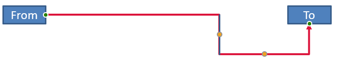

## **ภาพรวม**

คอนเนคเตอร์เป็นเส้นที่สามารถเชื่อมต่ออยู่กับสองรูปร่างเมื่อรูปร่างใดรูปร่างหนึ่งเคลื่อนที่ ปลายของคอนเนคเตอร์เชื่อมต่อกับจุดเชื่อมต่อ ซึ่งแสดงด้วยจุดสีเขียวใน PowerPoint คอนเนคเตอร์แบบหักโค้งและโค้งบางประเภทยังเปิดเผยจุดปรับค่า ซึ่งแสดงด้วยจุดสีส้ม เพื่อควบคุมตำแหน่งของส่วนต่าง ๆ ของคอนเนคเตอร์

Aspose.Slides แสดงคอนเนคเตอร์ผ่านอินเทอร์เฟซ [IConnector](https://reference.aspose.com/slides/th/java/com.aspose.slides/iconnector/) คุณสามารถสร้างคอนเนคเตอร์, เชื่อมต่อปลายของมันกับรูปร่าง, เลือกจุดเชื่อมต่อ, ทำการเปลี่ยนเส้นทาง, และแก้ไขรูปทรงของคอนเนคเตอร์ที่มีจุดปรับค่าได้

## **ประเภทคอนเนคเตอร์**

คลาส [ShapeType](https://reference.aspose.com/slides/th/java/com.aspose.slides/shapetype/) มีชุดคอนเนคเตอร์แบบตรง, หักโค้ง, และโค้ง ตารางต่อไปนี้แสดงรูปทรงคอนเนคเตอร์ที่มีอยู่และจำนวนจุดปรับค่าที่กำหนดโดยแต่ละพรีเซ็ต

| คอนเนคเตอร์ | รูปภาพ | จำนวนจุดปรับค่า |
|---|---|---|
| `ShapeType.Line` |  | 0 |
| `ShapeType.StraightConnector1` |  | 0 |
| `ShapeType.BentConnector2` |  | 0 |
| `ShapeType.BentConnector3` |  | 1 |
| `ShapeType.BentConnector4` |  | 2 |
| `ShapeType.BentConnector5` |  | 3 |
| `ShapeType.CurvedConnector2` |  | 0 |
| `ShapeType.CurvedConnector3` |  | 1 |
| `ShapeType.CurvedConnector4` |  | 2 |
| `ShapeType.CurvedConnector5` |  | 3 |

จำนวนและความหมายของจุดปรับค่าเป็นส่วนหนึ่งของพรีเซ็ตคอนเนคเตอร์ที่เลือก อย่าสมมติว่าประเภทคอนเนคเตอร์สองประเภทที่แตกต่างกันจะเปิดเผยโครงสร้างคอลเลกชันเดียวกัน

## **เชื่อมต่อสองรูปร่าง**

ใช้ [IShapeCollection.addConnector](https://reference.aspose.com/slides/th/java/com.aspose.slides/ishapecollection/#addConnector-int-float-float-float-float-) เพื่อเพิ่มคอนเนคเตอร์ และใช้ [IConnector.setStartShapeConnectedTo](https://reference.aspose.com/slides/th/java/com.aspose.slides/iconnector/#setStartShapeConnectedTo-com.aspose.slides.IShape-) และ [IConnector.setEndShapeConnectedTo](https://reference.aspose.com/slides/th/java/com.aspose.slides/iconnector/#setEndShapeConnectedTo-com.aspose.slides.IShape-) เพื่อเชื่อมต่อปลายของมัน หลังจากปลายทั้งสองเชื่อมต่อแล้ว, [IConnector.reroute](https://reference.aspose.com/slides/th/java/com.aspose.slides/iconnector/#reroute--) จะเลือกเส้นทางสั้นระหว่างรูปร่าง

ตัวอย่างต่อไปนี้เชื่อมต่อรูปวงรีและสี่เหลี่ยมด้วยคอนเนคเตอร์แบบหักโค้ง:

```java
import com.aspose.slides.*;

Presentation presentation = new Presentation();
try {
    ISlide slide = presentation.getSlides().get_Item(0);

    IAutoShape ellipse = slide.getShapes().addAutoShape(ShapeType.Ellipse, 40, 80, 120, 80);
    IAutoShape rectangle = slide.getShapes().addAutoShape(ShapeType.Rectangle, 320, 240, 140, 80);
    IConnector connector = slide.getShapes().addConnector(ShapeType.BentConnector2, 0, 0, 10, 10);

    connector.setStartShapeConnectedTo(ellipse);
    connector.setEndShapeConnectedTo(rectangle);
    connector.reroute();

    presentation.save("connected-shapes.pptx", SaveFormat.Pptx);
} finally {
    presentation.dispose();
}
```

{}
การเรียก `reroute` อาจเปลี่ยนค่า [setStartShapeConnectionSiteIndex](https://reference.aspose.com/slides/th/java/com.aspose.slides/iconnector/#setStartShapeConnectionSiteIndex-long-) และ [setEndShapeConnectionSiteIndex](https://reference.aspose.com/slides/th/java/com.aspose.slides/iconnector/#setEndShapeConnectionSiteIndex-long-) ให้กำหนดจุดเชื่อมต่อเฉพาะหลังจากทำการเปลี่ยนเส้นทางหากจุดเหล่านั้นต้องคงที่
{}

## **เลือกจุดเชื่อมต่อ**

รูปร่างที่สามารถเชื่อมต่อได้แต่ละรูปจะรายงานจำนวนจุดผ่าน [IShape.getConnectionSiteCount](https://reference.aspose.com/slides/th/java/com.aspose.slides/ishape/#getConnectionSiteCount--) ตรวจสอบดัชนีจุดเริ่มต้นที่ต้องการ (เป็นเลขศูนย์ฐาน) ก่อนกำหนดให้กับปลายคอนเนคเตอร์; จำนวนจุดจะแตกต่างตามรูปทรงของรูปร่าง

ตัวอย่างนี้เชื่อมต่อคอนเนคเตอร์กับจุดเฉพาะบนวงรีเมื่อจุดนั้นมีอยู่:

```java
import com.aspose.slides.*;

Presentation presentation = new Presentation();
try {
    ISlide slide = presentation.getSlides().get_Item(0);

    IAutoShape ellipse = slide.getShapes().addAutoShape(ShapeType.Ellipse, 40, 80, 120, 80);
    IAutoShape rectangle = slide.getShapes().addAutoShape(ShapeType.Rectangle, 320, 240, 140, 80);
    IConnector connector = slide.getShapes().addConnector(ShapeType.BentConnector3, 0, 0, 10, 10);

    connector.setStartShapeConnectedTo(ellipse);
    connector.setEndShapeConnectedTo(rectangle);

    long preferredSiteIndex = 2;
    if (preferredSiteIndex < ellipse.getConnectionSiteCount()) {
        connector.setStartShapeConnectionSiteIndex(preferredSiteIndex);
    } else {
        System.out.println("The ellipse has only " + ellipse.getConnectionSiteCount() + " connection sites.");
    }

    presentation.save("specific-connection-site.pptx", SaveFormat.Pptx);
} finally {
    presentation.dispose();
}
```

## **ปรับจุดคอนเนคเตอร์**

คอนเนคเตอร์ที่มีจุดปรับค่าเปิดเผยผ่าน [IGeometryShape.getAdjustments](https://reference.aspose.com/slides/th/java/com.aspose.slides/igeometryshape/#getAdjustments--) ตรวจสอบทุก [IAdjustValue](https://reference.aspose.com/slides/th/java/com.aspose.slides/iadjustvalue/) และตรวจสอบค่าของ [getType](https://reference.aspose.com/slides/th/java/com.aspose.slides/iadjustvalue/#getType--) ก่อนเปลี่ยนค่าโดยใช้ [setRawValue](https://reference.aspose.com/slides/th/java/com.aspose.slides/iadjustvalue/#setRawValue-long-) กฎทั่วไปสำหรับการระบุการปรับรูปแบบพรีเซ็ตอธิบายไว้ใน [Shape Manipulation](/slides/th/java/shape-manipulations/)

จำนวน, ลำดับ, ความหมาย, และช่วงค่าที่ถูกต้องของการปรับของคอนเนคเตอร์ขึ้นอยู่กับพรีเซ็ตคอนเนคเตอร์ ประเภทการปรับเป็นแบบอ่านอย่างเดียว, ส่วนค่าการปรับสามารถเขียนได้ วิธีอ่านอย่างเดียว [getName](https://reference.aspose.com/slides/th/java/com.aspose.slides/iadjustvalue/#getName--) ให้ข้อมูลระบุตัวเพิ่มเติมเมื่อคอนเนคเตอร์มีการปรับมากกว่าหนึ่งรายการที่มีประเภทเชิงความหมายเดียวกัน

### **เส้นทางรอบอุปสรรค**

ในเลย์เอาต์ต่อไปนี้ คอนเนคเตอร์ `BentConnector5` ระหว่างสองรูปร่างผ่านรูปร่างที่สาม:


โค้ดนี้สร้างคอนเนคเตอร์ที่ถูกกีดขวาง:

```java
import com.aspose.slides.*;
import java.awt.Color;

Presentation presentation = new Presentation();
try {
    ISlide slide = presentation.getSlides().get_Item(0);

    slide.getShapes().addAutoShape(ShapeType.Rectangle, 300, 150, 150, 75);
    IAutoShape sourceShape = slide.getShapes().addAutoShape(ShapeType.Rectangle, 500, 400, 100, 50);
    IAutoShape targetShape = slide.getShapes().addAutoShape(ShapeType.Rectangle, 100, 100, 70, 30);
    IConnector connector = slide.getShapes().addConnector(ShapeType.BentConnector5, 20, 20, 400, 300);

    connector.getLineFormat().setEndArrowheadStyle(LineArrowheadStyle.Triangle);
    connector.getLineFormat().getFillFormat().setFillType(FillType.Solid);
    connector.getLineFormat().getFillFormat().getSolidFillColor().setColor(Color.BLACK);
    connector.setStartShapeConnectedTo(sourceShape);
    connector.setEndShapeConnectedTo(targetShape);
    connector.setStartShapeConnectionSiteIndex(2);

    presentation.save("connector-obstruction.pptx", SaveFormat.Pptx);
} finally {
    presentation.dispose();
}
```

การย้ายการหักแนวตั้งเปลี่ยนเส้นทางให้คอนเนคเตอร์เลี่ยงอุปสรรค:


แทนที่จะสมมติว่าดัชนีคอลเลกชัน `1` แสดงการหักแนวตั้งเสมอ ตัวอย่างนี้ค้นหา `ConnectorBendPositionY` และเปลี่ยนค่าเฉพาะเมื่อประเภทเชิงความหมายที่คาดหวังปรากฏ:

```java
import com.aspose.slides.*;
import java.awt.Color;

Presentation presentation = new Presentation();
try {
    ISlide slide = presentation.getSlides().get_Item(0);

    slide.getShapes().addAutoShape(ShapeType.Rectangle, 300, 150, 150, 75);
    IAutoShape sourceShape = slide.getShapes().addAutoShape(ShapeType.Rectangle, 500, 400, 100, 50);
    IAutoShape targetShape = slide.getShapes().addAutoShape(ShapeType.Rectangle, 100, 100, 70, 30);
    IConnector connector = slide.getShapes().addConnector(ShapeType.BentConnector5, 20, 20, 400, 300);

    connector.getLineFormat().setEndArrowheadStyle(LineArrowheadStyle.Triangle);
    connector.getLineFormat().getFillFormat().setFillType(FillType.Solid);
    connector.getLineFormat().getFillFormat().getSolidFillColor().setColor(Color.BLACK);
    connector.setStartShapeConnectedTo(sourceShape);
    connector.setEndShapeConnectedTo(targetShape);
    connector.setStartShapeConnectionSiteIndex(2);

    IAdjustValue verticalBend = null;
    for (int adjustmentIndex = 0; adjustmentIndex < connector.getAdjustments().size(); adjustmentIndex++) {
        IAdjustValue adjustment = connector.getAdjustments().get_Item(adjustmentIndex);
        System.out.println(adjustment.getName() + ": " + adjustment.getType() + ", raw value = " + adjustment.getRawValue());
        if (adjustment.getType() == ShapeAdjustmentType.ConnectorBendPositionY) {
            verticalBend = adjustment;
            break;
        }
    }

    if (verticalBend == null) {
        System.out.println("The connector does not expose a vertical bend adjustment.");
    } else {
        verticalBend.setRawValue(60000);
        presentation.save("connector-obstruction-fixed.pptx", SaveFormat.Pptx);
    }
} finally {
    presentation.dispose();
}
```

คอนเนคเตอร์ `BentConnector5` มีการปรับ `ConnectorBendPositionX` สองรายการและ `ConnectorBendPositionY` หนึ่งรายการ หากประเภทที่ต้องการปรากฏมากกว่าหนึ่งครั้ง ให้ตรวจสอบ `getName` และรูปทรงที่รู้จักของพรีเซ็ตก่อนเลือกหนึ่งรายการ หากการปรับรายงานเป็น `ShapeAdjustmentType.Custom` ให้นับความหมายและช่วงเป็นของพรีเซ็ตนั้นและไม่เปลี่ยนจนกว่าจะทราบสัญญานั้น

## **เชื่อมโยงค่าการปรับกับรูปทรงคอนเนคเตอร์**

สำหรับคอนเนคเตอร์แบบหักโค้ง ค่าการปรับสามารถใช้ประมาณตำแหน่งของส่วนแต่ละส่วน การคำนวณเหล่านี้เป็นเฉพาะพรีเซ็ตคอนเนคเตอร์:

- `BentConnector4` ปกติจะเปิดเผยการปรับ `ConnectorBendPositionX` หนึ่งรายการและ `ConnectorBendPositionY` หนึ่งรายการ
- สำหรับตำแหน่งการหักนี้ การหารค่าที่คืนจาก `getRawValue` ด้วย `100000f` จะให้ส่วนของความกว้างหรือความสูงของกรอบคอนเนคเตอร์ที่ใช้ในตัวอย่างด้านล่าง
- กรอบคอนเนคเตอร์อาจถูกหมุนหรือกลับด้าน ดังนั้นพิกัดของกรอบต้องแปลงก่อนที่จะเปรียบเทียบกับพิกัดของสไลด์

ตัวอย่างต่อไปนี้ใช้ `getType` เพื่อระบุการปรับค่าแรก เรียกดัชนีคอลเลกชันไม่ใช่ตัวระบุที่พกพาได้

### **คอนเนคเตอร์ที่ไม่ได้หมุน**

เลย์เอาต์เริ่มต้นมีรูปข้อความสองรูปเชื่อมต่อด้วย `BentConnector4`:


ตัวอย่างนี้ตรวจสอบคอนเนคเตอร์และดึงการปรับการหักแนวนอนและแนวตั้ง:

```java
import com.aspose.slides.*;
import java.awt.Color;

Presentation presentation = new Presentation();
try {
    ISlide slide = presentation.getSlides().get_Item(0);

    IAutoShape sourceShape = slide.getShapes().addAutoShape(ShapeType.Rectangle, 100, 100, 60, 25);
    sourceShape.getTextFrame().setText("From");
    IAutoShape targetShape = slide.getShapes().addAutoShape(ShapeType.Rectangle, 500, 100, 60, 25);
    targetShape.getTextFrame().setText("To");
    IConnector connector = slide.getShapes().addConnector(ShapeType.BentConnector4, 20, 20, 400, 300);

    connector.getLineFormat().setEndArrowheadStyle(LineArrowheadStyle.Triangle);
    connector.getLineFormat().getFillFormat().setFillType(FillType.Solid);
    connector.getLineFormat().getFillFormat().getSolidFillColor().setColor(Color.RED);
    connector.getLineFormat().setWidth(3);
    connector.setStartShapeConnectedTo(sourceShape);
    connector.setStartShapeConnectionSiteIndex(3);
    connector.setEndShapeConnectedTo(targetShape);
    connector.setEndShapeConnectionSiteIndex(2);

    for (int adjustmentIndex = 0; adjustmentIndex < connector.getAdjustments().size(); adjustmentIndex++) {
        IAdjustValue adjustment = connector.getAdjustments().get_Item(adjustmentIndex);
        System.out.println(adjustment.getName() + ": " + adjustment.getType() + ", raw value = " + adjustment.getRawValue());
    }
} finally {
    presentation.dispose();
}
```

เพื่อเปลี่ยนการหักทั้งสองให้ค้นหาประเภทที่คาดหวังแต่ละอย่างและแก้ไขค่าเฉพาะหลังจากพบทั้งสอง:

```java
import com.aspose.slides.*;

Presentation presentation = new Presentation();
try {
    ISlide slide = presentation.getSlides().get_Item(0);

    IAutoShape sourceShape = slide.getShapes().addAutoShape(ShapeType.Rectangle, 100, 100, 60, 25);
    IAutoShape targetShape = slide.getShapes().addAutoShape(ShapeType.Rectangle, 500, 100, 60, 25);
    IConnector connector = slide.getShapes().addConnector(ShapeType.BentConnector4, 20, 20, 400, 300);
    connector.setStartShapeConnectedTo(sourceShape);
    connector.setStartShapeConnectionSiteIndex(3);
    connector.setEndShapeConnectedTo(targetShape);
    connector.setEndShapeConnectionSiteIndex(2);

    IAdjustValue horizontalBend = null;
    IAdjustValue verticalBend = null;
    for (int adjustmentIndex = 0; adjustmentIndex < connector.getAdjustments().size(); adjustmentIndex++) {
        IAdjustValue adjustment = connector.getAdjustments().get_Item(adjustmentIndex);
        if (adjustment.getType() == ShapeAdjustmentType.ConnectorBendPositionX) {
            horizontalBend = adjustment;
        } else if (adjustment.getType() == ShapeAdjustmentType.ConnectorBendPositionY) {
            verticalBend = adjustment;
        }
    }

    if (horizontalBend == null || verticalBend == null) {
        System.out.println("The connector does not expose the expected bend adjustments.");
    } else {
        horizontalBend.setRawValue(horizontalBend.getRawValue() + 20000);
        verticalBend.setRawValue(verticalBend.getRawValue() + 200000);
        presentation.save("connector-adjusted.pptx", SaveFormat.Pptx);
    }
} finally {
    presentation.dispose();
}
```

ผลลัพธ์คือตัวคอนเนคเตอร์ที่ส่วนแนวนอนและแนวตั้งเคลื่อนที่:


เมื่อทราบประเภทเชิงความหมายแล้ว ค่าต่าง ๆ สามารถแปลงเป็นพิกัดของกรอบคอนเนคเตอร์ ตัวอย่างนี้วาดสี่เหลี่ยมแถบบางเหนือส่วนแนวตั้งที่ควบคุมโดยการหักทั้งสอง:

```java
import com.aspose.slides.*;

Presentation presentation = new Presentation();
try {
    ISlide slide = presentation.getSlides().get_Item(0);

    IAutoShape sourceShape = slide.getShapes().addAutoShape(ShapeType.Rectangle, 100, 100, 60, 25);
    IAutoShape targetShape = slide.getShapes().addAutoShape(ShapeType.Rectangle, 500, 100, 60, 25);
    IConnector connector = slide.getShapes().addConnector(ShapeType.BentConnector4, 20, 20, 400, 300);
    connector.setStartShapeConnectedTo(sourceShape);
    connector.setStartShapeConnectionSiteIndex(3);
    connector.setEndShapeConnectedTo(targetShape);
    connector.setEndShapeConnectionSiteIndex(2);

    IAdjustValue horizontalBend = null;
    IAdjustValue verticalBend = null;
    for (int adjustmentIndex = 0; adjustmentIndex < connector.getAdjustments().size(); adjustmentIndex++) {
        IAdjustValue adjustment = connector.getAdjustments().get_Item(adjustmentIndex);
        if (adjustment.getType() == ShapeAdjustmentType.ConnectorBendPositionX) {
            horizontalBend = adjustment;
        } else if (adjustment.getType() == ShapeAdjustmentType.ConnectorBendPositionY) {
            verticalBend = adjustment;
        }
    }

    if (horizontalBend == null || verticalBend == null) {
        System.out.println("The connector does not expose the expected bend adjustments.");
    } else {
        float x = connector.getX() + connector.getWidth() * horizontalBend.getRawValue() / 100000f;
        float y = connector.getY();
        float height = connector.getHeight() * verticalBend.getRawValue() / 100000f;
        slide.getShapes().addAutoShape(ShapeType.Rectangle, x, y, 1, height);
        presentation.save("connector-segment-guide.pptx", SaveFormat.Pptx);
    }
} finally {
    presentation.dispose();
}
```

รูปแบบแนวทางแสดงส่วนที่คำนวณได้:



### **คอนเนคเตอร์ที่หมุนหรือกลับด้าน**

เมื่อรูปทรงคอนเนคเตอร์เดียวกันถูกจัดวางในแนวตั้ง ค่าของ [IShape.getFrame](https://reference.aspose.com/slides/th/java/com.aspose.slides/ishape/#getFrame--), [ShapeFrame.getFlipH](https://reference.aspose.com/slides/th/java/com.aspose.slides/shapeframe/#getFlipH--), และ [ShapeFrame.getFlipV](https://reference.aspose.com/slides/th/java/com.aspose.slides/shapeframe/#getFlipV--) มีผลต่อการแปลงจากพิกัดกรอบคอนเนคเตอร์เป็นพิกัดสไลด์

ตัวอย่างนี้สร้างและปรับคอนเนคเตอร์ที่จัดวางในแนวตั้ง:

```java
import com.aspose.slides.*;
import java.awt.Color;

Presentation presentation = new Presentation();
try {
    ISlide slide = presentation.getSlides().get_Item(0);

    IAutoShape sourceShape = slide.getShapes().addAutoShape(ShapeType.Rectangle, 100, 100, 60, 25);
    sourceShape.getTextFrame().setText("From");
    IAutoShape targetShape = slide.getShapes().addAutoShape(ShapeType.Rectangle, 100, 400, 60, 25);
    targetShape.getTextFrame().setText("To 1");
    IConnector connector = slide.getShapes().addConnector(ShapeType.BentConnector4, 20, 20, 400, 300);

    connector.getLineFormat().setEndArrowheadStyle(LineArrowheadStyle.Triangle);
    connector.getLineFormat().getFillFormat().setFillType(FillType.Solid);
    connector.getLineFormat().getFillFormat().getSolidFillColor().setColor(new Color(102, 205, 170));
    connector.getLineFormat().setWidth(3);
    connector.setStartShapeConnectedTo(sourceShape);
    connector.setStartShapeConnectionSiteIndex(2);
    connector.setEndShapeConnectedTo(targetShape);
    connector.setEndShapeConnectionSiteIndex(3);

    for (int adjustmentIndex = 0; adjustmentIndex < connector.getAdjustments().size(); adjustmentIndex++) {
        IAdjustValue adjustment = connector.getAdjustments().get_Item(adjustmentIndex);
        if (adjustment.getType() == ShapeAdjustmentType.ConnectorBendPositionX) {
            adjustment.setRawValue(adjustment.getRawValue() + 20000);
        } else if (adjustment.getType() == ShapeAdjustmentType.ConnectorBendPositionY) {
            adjustment.setRawValue(adjustment.getRawValue() + 200000);
        }
    }

    presentation.save("vertical-connector-adjusted.pptx", SaveFormat.Pptx);
} finally {
    presentation.dispose();
}
```

คอนเนคเตอร์ที่ปรับแล้วปรากฏเป็นแนวตั้งระหว่างรูปร่าง:


สำหรับมุมการหมุนใด ๆ `alpha` ให้หมุนจุดกรอบคอนเนคเตอร์ `(x, y)` รอบศูนย์กลางกรอบ `(x0, y0)`:

`X = (x - x0) * cos(alpha) - (y - y0) * sin(alpha) + x0`

`Y = (x - x0) * sin(alpha) + (y - y0) * cos(alpha) + y0`

โค้ดต่อไปนี้จัดการกับการวางแนว 90° ที่ใช้ในตัวอย่างและวาดแนวทางสีแดงเหนือส่วนคอนเนคเตอร์ที่สอดคล้องกัน:

```java
import com.aspose.slides.*;
import java.awt.Color;

Presentation presentation = new Presentation();
try {
    ISlide slide = presentation.getSlides().get_Item(0);

    IAutoShape sourceShape = slide.getShapes().addAutoShape(ShapeType.Rectangle, 100, 100, 60, 25);
    IAutoShape targetShape = slide.getShapes().addAutoShape(ShapeType.Rectangle, 100, 400, 60, 25);
    IConnector connector = slide.getShapes().addConnector(ShapeType.BentConnector4, 20, 20, 400, 300);
    connector.setStartShapeConnectedTo(sourceShape);
    connector.setStartShapeConnectionSiteIndex(2);
    connector.setEndShapeConnectedTo(targetShape);
    connector.setEndShapeConnectionSiteIndex(3);

    IAdjustValue horizontalBend = null;
    IAdjustValue verticalBend = null;
    for (int adjustmentIndex = 0; adjustmentIndex < connector.getAdjustments().size(); adjustmentIndex++) {
        IAdjustValue adjustment = connector.getAdjustments().get_Item(adjustmentIndex);
        if (adjustment.getType() == ShapeAdjustmentType.ConnectorBendPositionX) {
            horizontalBend = adjustment;
        } else if (adjustment.getType() == ShapeAdjustmentType.ConnectorBendPositionY) {
            verticalBend = adjustment;
        }
    }

    if (horizontalBend == null || verticalBend == null) {
        System.out.println("The connector does not expose the expected bend adjustments.");
    } else {
        horizontalBend.setRawValue(horizontalBend.getRawValue() + 20000);
        verticalBend.setRawValue(verticalBend.getRawValue() + 200000);

        float x = connector.getX();
        float y = connector.getY();
        if (connector.getFrame().getFlipH() == NullableBool.True) {
            x += connector.getWidth();
        }
        if (connector.getFrame().getFlipV() == NullableBool.True) {
            y += connector.getHeight();
        }

        x += connector.getWidth() * horizontalBend.getRawValue() / 100000f;
        float rotatedX = connector.getFrame().getCenterX() - y + connector.getFrame().getCenterY();
        float rotatedY = x - connector.getFrame().getCenterX() + connector.getFrame().getCenterY();
        float segmentWidth = connector.getHeight() * verticalBend.getRawValue() / 100000f;
        IAutoShape guide = slide.getShapes().addAutoShape(ShapeType.Rectangle, rotatedX, rotatedY, segmentWidth, 1);
        guide.getLineFormat().getFillFormat().setFillType(FillType.Solid);
        guide.getLineFormat().getFillFormat().getSolidFillColor().setColor(Color.RED);

        presentation.save("rotated-connector-segment-guide.pptx", SaveFormat.Pptx);
    }
} finally {
    presentation.dispose();
}
```

แนวทางสีแดงแสดงส่วนที่คำนวณหลังจากการแปลงพิกัด:


สูตรเหล่านี้อธิบายพรีเซ็ตที่ใช้ในตัวอย่าง ไม่ใช่โมเดลคอนเนคเตอร์สากล ตรวจสอบประเภทการปรับ, การวางกรอบ, และช่วงค่าก่อนนำการคำนวณเดียวกันไปใช้กับพรีเซ็ตอื่น

## **ค้นหามุมทิศทางของคอนเนคเตอร์**

ทิศทางของคอนเนคเตอร์ตรงสามารถคำนวณจากความกว้างและความสูงโดยคำนึงถึงการกลับด้านแนวนอนและแนวตั้ง ตัวอย่างต่อไปนี้รายงานมุมตามเข็มนาฬิกาจากแกนแนวนอนบวกในพิกัดสไลด์:

```java
import com.aspose.slides.*;

Presentation presentation = new Presentation();
try {
    ISlide slide = presentation.getSlides().get_Item(0);
    IConnector connector = slide.getShapes().addConnector(ShapeType.StraightConnector1, 100, 100, 200, 100);

    boolean flipH = connector.getFrame().getFlipH() == NullableBool.True;
    boolean flipV = connector.getFrame().getFlipV() == NullableBool.True;
    float deltaX = connector.getWidth() * (flipH ? -1 : 1);
    float deltaY = connector.getHeight() * (flipV ? -1 : 1);
    double angle = Math.atan2(deltaY, deltaX) * 180.0 / Math.PI;

    if (angle < 0) {
        angle += 360;
    }

    System.out.printf("Connector direction: %.2f degrees%n", angle);
} finally {
    presentation.dispose();
}
```

## **คำถามที่พบบ่อย**

**ฉันจะตรวจสอบได้อย่างไรว่าคอนเนคเตอร์สามารถเชื่อมต่อกับรูปร่างได้หรือไม่?**

ตรวจสอบค่าของ [getConnectionSiteCount](https://reference.aspose.com/slides/th/java/com.aspose.slides/ishape/#getConnectionSiteCount--) ของรูปร่าง จำนวนบวกหมายความว่ารูปร่างเปิดเผยจุดเชื่อมต่อ ตรวจสอบดัชนีจุดที่เลือกก่อนกำหนดให้กับปลายคอนเนคเตอร์ใดก็ได้

**ฉันสามารถระบุการปรับของคอนเนคเตอร์โดยดัชนีของคอลเลกชันได้หรือไม่?**

ดัชนีจะมีความหมายเฉพาะกับพรีเซ็ตคอนเนคเตอร์และโครงสร้างคอลเลกชันที่รู้จัก ตรวจสอบ [IAdjustValue.getType](https://reference.aspose.com/slides/th/java/com.aspose.slides/iadjustvalue/#getType--) ก่อนแก้ไขค่า และใช้ [IAdjustValue.getName](https://reference.aspose.com/slides/th/java/com.aspose.slides/iadjustvalue/#getName--) เป็นข้อมูลเพิ่มเติมเมื่อประเภทเชิงความหมายเดียวกันปรากฏหลายครั้ง

**จะเกิดอะไรขึ้นเมื่อรูปร่างที่เชื่อมต่อถูกลบ?**

ปลายคอนเนคเตอร์ที่เกี่ยวข้องจะถูกถอดการเชื่อมต่อ คอนเนคเตอร์จะคงอยู่บนสไลด์และสามารถลบ, วางเป็นเส้นอิสระ, หรือเชื่อมต่อกับรูปร่างอื่นต่อไปได้

**การเชื่อมต่อคอนเนคเตอร์จะคงไว้เมื่อสไลด์ถูกคัดลอกหรือไม่?**

โดยทั่วไปการเชื่อมต่อจะคงอยู่เมื่อรูปร่างที่เชื่อมต่อถูกคัดลอกพร้อมกับสไลด์ หากคอนเนคเตอร์ถูกคัดลอกโดยไม่มีรูปร่างเป้าหมายหนึ่งตัว ปลายที่ได้รับผลกระทบจะต้องเชื่อมต่อใหม่อีกครั้ง