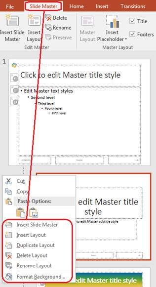

## **ภาพรวม**

**slide master** กำหนดการตั้งค่าออกแบบที่ใช้ร่วมกันสำหรับกลุ่มสไลด์หนึ่ง ๆ ซึ่งอาจรวมถึงรูปทรงที่ใช้บ่อย, โลโก้, พื้นหลัง, รูปแบบข้อความ, การตั้งค่าธีม, และการตั้งค่าส่วนท้าย ใน PowerPoint การแก้ไข slide master เป็นวิธีปกติที่ทำให้การนำเสนอมีความสอดคล้องโดยไม่ต้องทำรูปแบบเดียวกันซ้ำบนแต่ละสไลด์

Aspose.Slides for Java รองรับโมเดลเดียวกัน การนำเสนออาจมี slide master หนึ่งหรือหลาย master slide, และแต่ละ master slide สามารถมี layout slide หลายอัน สไลด์ปกติส่วนใหญ่จะไม่อ้างอิงไปที่ master slide โดยตรง แต่จะใช้ layout slide ซึ่ง layout slide นั้นเป็นส่วนของ master slide

ลำดับชั้นคือ:

1. **Slide master** – กำหนดการออกแบบและธีมที่ใช้ร่วมกัน
1. **Layout slide** – กำหนดการจัดวางตัวแปรและรูปแบบระดับเลเอาท์
1. **Normal slide** – มีเนื้อหาการนำเสนอจริงและใช้ layout slide หนึ่งอัน


ใน Aspose.Slides, slide master แสดงด้วยอินเทอร์เฟซ [IMasterSlide](https://reference.aspose.com/slides/th/java/com.aspose.slides/imasterslide/) โหมดทั้งหมดของ master slide ในการนำเสนอสามารถเข้าถึงได้ผ่านคอลเลกชัน [Presentation.getMasters](https://reference.aspose.com/slides/th/java/com.aspose.slides/presentation/#getMasters--) ซึ่ง implements [IMasterSlideCollection](https://reference.aspose.com/slides/th/java/com.aspose.slides/imasterslidecollection/).

{}

เมื่อคุณสมบัติเช่นเดียวกันถูกกำหนดไว้ที่หลายระดับ ระดับที่เจาะจงมากกว่าจะเหนือกว่า ตัวอย่างเช่น หาก master slide และ layout slide ทั้งสองกำหนดพื้นหลัง สไลด์ที่อ้างอิง layout นั้นจะใช้พื้นหลังของ layout สำหรับข้อมูลเพิ่มเติมเกี่ยวกับ layout slide ดูที่ [Apply or Change Slide Layouts](/slides/th/java/slide-layout/).

{}

## **เข้าถึง Slide Masters**

ใน PowerPoint คุณสามารถเปิดมุมมอง Slide Master จาก **View** > **Slide Master**.


ใน Aspose.Slides ให้ใช้คอลเลกชัน `getMasters()` เพื่อเข้าถึง master slide:

```java
Presentation presentation = new Presentation("presentation.pptx");
try {
    IMasterSlide firstMasterSlide = presentation.getMasters().get_Item(0);
    int masterSlideCount = presentation.getMasters().size();
    int firstMasterLayoutSlideCount = firstMasterSlide.getLayoutSlides().size();

    System.out.println("Master slides: " + masterSlideCount);
    System.out.println("Layouts in the first master: " + firstMasterLayoutSlideCount);
} finally {
    presentation.dispose();
}
```

คุณยังสามารถรับ master slide ที่ใช้โดยสไลด์ปกติผ่าน layout ของมันได้:

```java
Presentation presentation = new Presentation("presentation.pptx");
try {
    ISlide slide = presentation.getSlides().get_Item(0);
    ILayoutSlide layoutSlide = slide.getLayoutSlide();
    IMasterSlide masterSlide = layoutSlide.getMasterSlide();
    String masterSlideName = masterSlide.getName();

    System.out.println(masterSlideName);
} finally {
    presentation.dispose();
}
```

## **สิ่งที่ Slide Master มีอยู่**

master slide เป็นวัตถุคล้ายสไลด์ มัน implements [IBaseSlide](https://reference.aspose.com/slides/th/java/com.aspose.slides/ibaseslide/) ดังนั้นจึงเปิดเผยคุณสมบัติสไลด์หลายอย่างที่ใช้โดยสไลด์ปกติและ layout slide สมาชิกเฉพาะของ master จะระบุในหน้า API ของ [IMasterSlide](https://reference.aspose.com/slides/th/java/com.aspose.slides/imasterslide/).

สมาชิกของ master slide ที่มักใช้ได้แก่:

| สมาชิก | วัตถุประสงค์ |
| --- | --- |
| `getBackground()` | ตั้งค่าพื้นหลังสไลด์ระดับมาสเตอร์ |
| `getShapes()` | เก็บรูปร่างที่วางบนมาสเตอร์ เช่น โลโก้, กรอบรูปภาพ, และข้อความที่ใช้ร่วมกัน |
| `getLayoutSlides()` | เก็บสไลด์เลเอาท์ที่เป็นส่วนของมาสเตอร์ |
| `getThemeManager()` | ให้การเข้าถึง API ธีมของมาสเตอร์ |
| `getHeaderFooterManager()` | ควบคุมส่วนหัว, ส่วนล่าง, วันที่, และหมายเลขสไลด์สำหรับมาสเตอร์และเลเอาท์ที่เป็นลูกของมัน |
| `getDependingSlides()` | คืนค่าสไลด์ปกติที่พึ่งพามาสเตอร์ผ่านเลเอาท์ของพวกมัน |

## **เพิ่มรูปภาพลงใน Slide Master**

เมื่อคุณเพิ่มรูปภาพลงใน master slide รูปภาพนั้นจะแสดงบนสไลด์ที่ใช้เลเอาท์จากมาสเตอร์นั้น ซึ่งเป็นประโยชน์สำหรับโลโก้, ลายน้ำ, แถบบินตกแต่ง, และองค์ประกอบภาพที่ต้องทำซ้ำ

ตัวอย่างต่อไปนี้เพิ่มโลโก้ลงใน master slide ตัวแรก:

```java
Presentation presentation = new Presentation("presentation.pptx");
try {
    IMasterSlide masterSlide = presentation.getMasters().get_Item(0);
    IImage logo = Images.fromFile("logo.png");

    try {
        IPPImage logoImage = presentation.getImages().addImage(logo);

        masterSlide.getShapes().addPictureFrame(
                ShapeType.Rectangle,
                20,
                20,
                80,
                80,
                logoImage);
    } finally {
        logo.dispose();
    }

    presentation.save("presentation-with-logo.pptx", SaveFormat.Pptx);
} finally {
    presentation.dispose();
}
```

สำหรับข้อมูลเพิ่มเติมเกี่ยวกับกรอบรูปภาพ ดูที่ [Picture Frame](/slides/th/java/picture-frame/).

## **ทำงานกับ Placeholders**

Placeholders มักกำหนดบน layout slide โดยที่ master slide ให้รูปแบบและธีมที่ใช้ร่วมกันซึ่งเลเอาท์สืบทอดมา, ส่วนแต่ละเลเอาท์จะตัดสินใจว่าจะมี placeholder ไหนและวางไว้ที่ไหน

ใน PowerPoint คำสั่ง placeholder มีในมุมมอง Slide Master.


เพื่อเพิ่ม placeholder ใหม่ด้วย Aspose.Slides ให้ทำงานกับ layout slide ที่เป็นส่วนของ master:

```java
Presentation presentation = new Presentation("presentation.pptx");
try {
    IMasterSlide masterSlide = presentation.getMasters().get_Item(0);
    ILayoutSlide blankLayoutSlide = masterSlide.getLayoutSlides().getByType(SlideLayoutType.Blank);

    if (blankLayoutSlide == null) {
        blankLayoutSlide = masterSlide.getLayoutSlides().add(SlideLayoutType.Blank, "Blank");
    }

    blankLayoutSlide.getPlaceholderManager().addTextPlaceholder(60, 120, 600, 80);

    presentation.getSlides().addEmptySlide(blankLayoutSlide);
    presentation.save("presentation-with-placeholder.pptx", SaveFormat.Pptx);
} finally {
    presentation.dispose();
}
```

คุณยังสามารถจัดรูปแบบ placeholder รูปร่างที่มีอยู่แล้วบน master slide ตัวอย่างต่อไปนี้ค้นหา placeholder ของหัวเรื่องและใช้การเติมสีไลเนียร์กราเดียนท์:

```java
Presentation presentation = new Presentation("presentation.pptx");
try {
    IMasterSlide masterSlide = presentation.getMasters().get_Item(0);
    IAutoShape titlePlaceholder = null;

    for (IShape shape : masterSlide.getShapes()) {
        if (shape instanceof IAutoShape) {
            IAutoShape autoShape = (IAutoShape) shape;

            if (autoShape.getPlaceholder() != null &&
                    autoShape.getPlaceholder().getType() == PlaceholderType.Title) {
                titlePlaceholder = autoShape;
                break;
            }
        }
    }

    if (titlePlaceholder != null) {
        Color redGradientColor = new Color(255, 0, 0);
        Color purpleGradientColor = new Color(128, 0, 128);

        titlePlaceholder.getFillFormat().setFillType(FillType.Gradient);
        titlePlaceholder.getFillFormat().getGradientFormat().setGradientShape(GradientShape.Linear);
        titlePlaceholder.getFillFormat().getGradientFormat().getGradientStops().add(0.0f, redGradientColor);
        titlePlaceholder.getFillFormat().getGradientFormat().getGradientStops().add(255.0f, purpleGradientColor);
    }

    presentation.save("presentation-title-style.pptx", SaveFormat.Pptx);
} finally {
    presentation.dispose();
}
```


สำหรับตัวเลือกการจัดรูปแบบ placeholder และข้อความเพิ่มเติม ดูที่ [Set Prompt Text in Placeholder](/slides/th/java/manage-placeholder/) และ [Text Formatting](/slides/th/java/text-formatting/).

## **เปลี่ยนพื้นหลัง Slide Master**

พื้นหลังของมาสเตอร์จะถูกสืบทอดโดยเลเอาท์และสไลด์ที่ไม่ได้เขียนทับ ตัวอย่างต่อไปนี้ตั้งค่าสีพื้นหลังแบบเริ่มต้นสำหรับ master slide ตัวแรก:

```java
Presentation presentation = new Presentation("presentation.pptx");
try {
    IMasterSlide masterSlide = presentation.getMasters().get_Item(0);
    Color masterBackgroundColor = Color.GREEN;

    masterSlide.getBackground().setType(BackgroundType.OwnBackground);
    masterSlide.getBackground().getFillFormat().setFillType(FillType.Solid);
    masterSlide.getBackground().getFillFormat().getSolidFillColor().setColor(masterBackgroundColor);

    presentation.save("presentation-master-background.pptx", SaveFormat.Pptx);
} finally {
    presentation.dispose();
}
```

หัวข้อที่เกี่ยวข้อง ดูที่ [Presentation Background](/slides/th/java/presentation-background/) และ [Presentation Theme](/slides/th/java/presentation-theme/).

## **คัดลอก Slide Master ไปยังการนำเสนออื่น**

ใช้ [IMasterSlideCollection.addClone](https://reference.aspose.com/slides/th/java/com.aspose.slides/imasterslidecollection/#addClone-com.aspose.slides.IMasterSlide-) เพื่อคัดลอก master slide ไปยังการนำเสนออื่น หลังจากคัดลอกแล้ว master ใหม่นี้สามารถนำไปใช้โดยเลเอาท์และสไลด์ในเป้าหมายได้

```java
Presentation sourcePresentation = new Presentation("source.pptx");
Presentation destinationPresentation = new Presentation("destination.pptx");
try {
    IMasterSlide sourceMasterSlide = sourcePresentation.getMasters().get_Item(0);
    IMasterSlide clonedMasterSlide = destinationPresentation.getMasters().addClone(sourceMasterSlide);

    destinationPresentation.save("destination-with-master.pptx", SaveFormat.Pptx);
} finally {
    sourcePresentation.dispose();
    destinationPresentation.dispose();
}
```

ถ้าต้องการคัดลอกสไลด์ปกติกับ master ของมันด้วย ให้ดูที่ [Clone Slides](/slides/th/java/clone-slides/).

## **เพิ่มหลาย Slide Masters**

การนำเสนอสามารถมีหลาย master slide ซึ่งเหมาะเมื่อต้องการแบรนด์, โครงสร้างหน้า, หรือการตั้งค่าธีมที่แตกต่างกันในแต่ละส่วน



ตัวอย่างต่อไปนี้คัดลอก master เริ่มต้น, ให้พื้นหลังที่ต่างกัน, สร้าง layout ใต้ master ที่คัดลอก, และเพิ่มสไลด์ใหม่ที่อิงจาก layout นั้น:

```java
Presentation presentation = new Presentation("presentation.pptx");
try {
    IMasterSlide defaultMasterSlide = presentation.getMasters().get_Item(0);
    IMasterSlide sectionMasterSlide = presentation.getMasters().addClone(defaultMasterSlide);
    Color sectionMasterBackgroundColor = Color.LIGHT_GRAY;

    sectionMasterSlide.getBackground().setType(BackgroundType.OwnBackground);
    sectionMasterSlide.getBackground().getFillFormat().setFillType(FillType.Solid);
    sectionMasterSlide.getBackground().getFillFormat().getSolidFillColor().setColor(sectionMasterBackgroundColor);

    ILayoutSlide sourceBlankLayout = defaultMasterSlide.getLayoutSlides().getByType(SlideLayoutType.Blank);
    if (sourceBlankLayout == null) {
        sourceBlankLayout = defaultMasterSlide.getLayoutSlides().get_Item(0);
    }

    ILayoutSlide sectionBlankLayout = sectionMasterSlide.getLayoutSlides().addClone(sourceBlankLayout);

    presentation.getSlides().addEmptySlide(sectionBlankLayout);
    presentation.save("presentation-with-multiple-masters.pptx", SaveFormat.Pptx);
} finally {
    presentation.dispose();
}
```

## **เปรียบเทียบ Slide Masters**

สามารถเปรียบเทียบ master slide ด้วยเมธอด `equals` ที่สืบทอดจาก [IBaseSlide](https://reference.aspose.com/slides/th/java/com.aspose.slides/ibaseslide/) การเปรียบเทียบตรวจสอบโครงสร้างและเนื้อหาคงที่ เช่น รูปร่าง, ข้อความ, การจัดรูปแบบ, แอนิเมชัน, และการตั้งค่าสไลด์อื่น ๆ ไม่รวมถึงตัวระบุที่เป็นเอกลักษณ์ เช่น slide ID หรือค่าตัวแปร placeholder แบบไดนามิก เช่น วันที่ปัจจุบัน

```java
Presentation firstPresentation = new Presentation("first.pptx");
Presentation secondPresentation = new Presentation("second.pptx");
try {
    int firstPresentationMasterCount = firstPresentation.getMasters().size();
    int secondPresentationMasterCount = secondPresentation.getMasters().size();

    for (int firstMasterIndex = 0; firstMasterIndex < firstPresentationMasterCount; firstMasterIndex++) {
        for (int secondMasterIndex = 0; secondMasterIndex < secondPresentationMasterCount; secondMasterIndex++) {
            IMasterSlide firstMasterSlide = firstPresentation.getMasters().get_Item(firstMasterIndex);
            IMasterSlide secondMasterSlide = secondPresentation.getMasters().get_Item(secondMasterIndex);
            boolean areMasterSlidesEqual = firstMasterSlide.equals(secondMasterSlide);

            if (areMasterSlidesEqual) {
                System.out.printf(
                        "first.pptx master #%d equals second.pptx master #%d%n",
                        firstMasterIndex,
                        secondMasterIndex);
            }
        }
    }
} finally {
    firstPresentation.dispose();
    secondPresentation.dispose();
}
```

สำหรับข้อมูลเพิ่มเติม ดูที่ [Compare Presentation Slides](/slides/th/java/compare-slides/).

## **ตั้งค่า Slide Master View เป็นมุมมองเริ่มต้น**

ใช้เมธอด `setLastView` บน [ViewProperties](https://reference.aspose.com/slides/th/java/com.aspose.slides/viewproperties/) เพื่อกำหนดมุมมองที่ PowerPoint เปิดครั้งแรก ตัวอย่างต่อไปนี้เปิดการนำเสนอในมุมมอง Slide Master:

```java
Presentation presentation = new Presentation("presentation.pptx");
try {
    presentation.getViewProperties().setLastView(ViewType.SlideMasterView);
    presentation.save("presentation-master-view.pptx", SaveFormat.Pptx);
} finally {
    presentation.dispose();
}
```

สำหรับการตั้งค่ามุมมองเพิ่มเติม ดูที่ [Save Presentation](/slides/th/java/save-presentation/).

## **ลบ Master Slides ที่ไม่ได้ใช้**

บางครั้งการนำเสนออาจมี master slide ที่ไม่ถูกสไลด์ปกติใด ๆ ใช้ การลบ master ที่ไม่ได้ใช้สามารถลดขนาดไฟล์และทำให้การบำรุงรักษาเทมเพลตง่ายขึ้น

ใช้ `removeUnused` เพื่อลบ master ที่ไม่ได้ใช้จากคอลเลกชัน `getMasters()`:

```java
Presentation presentation = new Presentation("presentation.pptx");
try {
    presentation.getMasters().removeUnused(true);
    presentation.save("presentation-clean.pptx", SaveFormat.Pptx);
} finally {
    presentation.dispose();
}
```

คุณยังสามารถใช้เมธอด low‑code [Compress.removeUnusedMasterSlides](https://reference.aspose.com/slides/th/java/com.aspose.slides/compress/#removeUnusedMasterSlides-com.aspose.slides.Presentation-) :

```java
Presentation presentation = new Presentation("presentation.pptx");
try {
    Compress.removeUnusedMasterSlides(presentation);
    presentation.save("presentation-clean.pptx", SaveFormat.Pptx);
} finally {
    presentation.dispose();
}
```

## **FAQ**

**ความแตกต่างระหว่าง slide master กับ layout slide คืออะไร?**

slide master กำหนดการตั้งค่าออกแบบที่ใช้ร่วมกัน เช่น ธีม, พื้นหลัง, รูปทรงที่ใช้บ่อย, และรูปแบบข้อความ ส่วน layout slide เป็นส่วนของ master slide และกำหนดการจัดวางเฉพาะของ placeholders สไลด์ปกติใช้ layout slide ดังนั้นจึงสืบทอดจากทั้ง layout และ master

**การนำเสนอหนึ่งสามารถมีหลาย slide master ได้หรือไม่?**

ได้ การนำเสนอสามารถมีหลาย slide master ใช้หลาย master เมื่อแต่ละส่วนต้องการระบบภาพหรือแบรนด์ที่แตกต่างกัน

**ควรเพิ่ม placeholders บน master slide หรือ layout slide?**

ในส่วนใหญ่ ควรเพิ่ม placeholders บน layout slide ใส่องค์ประกอบภาพและการจัดรูปแบบที่ใช้ร่วมกันบน master slide แล้วใส่ placeholders ของเนื้อหาบน layout ที่สไลด์ปกติจะใช้

**สามารถลบ master slide ที่ยังถูกใช้ได้หรือไม่?**

ไม่ได้ master slide ที่มีสไลด์ขึ้นอยู่ไม่สามารถลบได้โดยตรง ควรย้ายสไลด์เหล่านั้นไปยัง layout ภายใต้ master อื่น หรือใช้วิธีทำความสะอาด master ที่ไม่ได้ใช้เพื่อลบเฉพาะ master ที่ไม่มีการอ้างอิง.