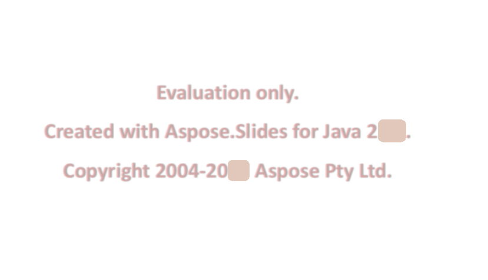

## **การประเมิน Aspose.Slides**

คุณสามารถดาวน์โหลด Aspose.Slides เพื่อการประเมินได้อย่างง่ายดาย การดาวน์โหลดเพื่อการประเมินนั้นเหมือนกับการดาวน์โหลดที่ซื้อแล้ว รุ่นประเมินจะกลายเป็นเวอร์ชันที่ได้สิทธิ์ใช้งานเมื่อคุณเพิ่มโค้ดไม่กี่บรรทัดเพื่อใช้ใบอนุญาต

รุ่นประเมินของ Aspose.Slides (โดยไม่ได้ระบุใบอนุญาต) ให้ฟังก์ชันการทำงานเต็มรูปแบบของผลิตภัณฑ์ แต่จะใส่น้ำกระดาษประเมินที่ด้านบนของเอกสารเมื่อเปิดหรือบันทึก และจำกัดการดึงข้อความจากสไลด์เป็นหนึ่งสไลด์เท่านั้น

{} 
หากคุณต้องการทดสอบ Aspose.Slides โดยไม่มีข้อจำกัดของรุ่นประเมิน คุณสามารถขอใบอนุญาตชั่วคราวระยะเวลา 30 วันได้ โปรดดูที่[วิธีขอรับใบอนุญาตชั่วคราว?](https://purchase.aspose.com/temporary-license)
{}

## **คำถามที่พบบ่อย**

### ฉันสามารถทดสอบพรีเซนเทชันหลายไฟล์พร้อมกันในหลายเธรดได้หรือไม่ในโหมดการประเมิน?

ใช่ คุณสามารถประมวลผลเอกสารต่าง ๆ พร้อมกันได้; คุณไม่ควรแชร์อ็อบเจกต์พรีเซนเทชันเดียวกัน[ข้ามเธรด](/slides/th/java/multithreading/) โหมดการประเมินไม่ได้ส่งผลต่อสิ่งนี้

### ฉันต้องติดตั้ง Microsoft PowerPoint เพื่อประเมินไลบรารีบนเซิร์ฟเวอร์หรือใน CI หรือไม่?

ไม่ Aspose.Slides เป็นเอนจินแบบสแตนด์อโลนและไม่ต้องการติดตั้ง PowerPoint ไม่ว่าจะเป็นการประเมินหรือการใช้งานจริง

### ฉันสามารถทดสอบการแปลง PPT/PPTX เป็น PDF และภาพได้เต็มที่ในโหมดการประเมินหรือไม่?

ใช่ [ตัวแปลง](/slides/th/java/convert-presentation/) ทำงาน; ผลลัพธ์จะรวมน้ำกระดาษประเมิน

### ฉันสามารถใช้ใบอนุญาตชั่วคราวสำหรับการทดสอบโหลดโดยไม่มีน้ำกระดาษได้หรือไม่?

ใช่ ใบอนุญาตชั่วคราวระยะเวลา 30 วันจะลบข้อจำกัดของโหมดการประเมินและอนุญาตให้ทดสอบโดยไม่มีน้ำกระดาษ