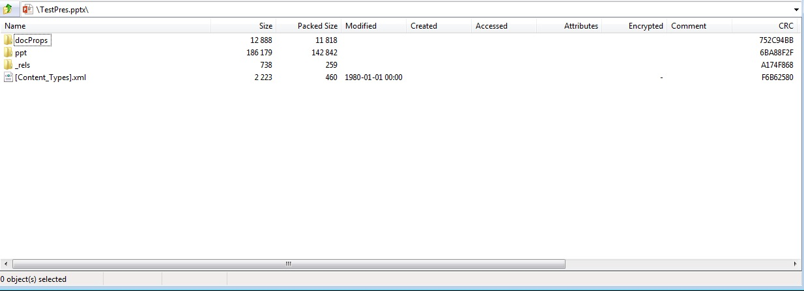

{} 

PresentationML คือชื่อของตระกูลรูปแบบที่ใช้ XML สำหรับเอกสารการนำเสนอ Office OpenXML (OOXML) เป็นรูปแบบที่ใช้ XML ที่นำมาใช้ในแอปพลิเคชัน Microsoft Office 2007 Office OpenXML เป็นรูปแบบคอนเทนเนอร์สำหรับหลายภาษามาร์กอัปที่ใช้ XML พิเศษ PresentationML คือภาษามาร์กอัปที่ Microsoft Office PowerPoint 2007 ใช้จัดเก็บเอกสาร

{} 

## **PresentationML ใน Aspose.Slides for Java**
เอกสาร OOXML PresentationML จะมาในรูปไฟล์ PPTX ซึ่งเป็นแพ็กเกจ XML ที่บีบอัดตามสเปก [OOXML ECMA-376](https://www.ecma-international.org/publications-and-standards/standards/ecma-376/) Aspose.Slides for Java รองรับการสร้าง อ่าน แก้ไข และเขียนเอกสาร PresentationML อย่างครบถ้วน นอกจากนี้ Aspose.Slides for Java ยังสามารถส่งออกเอกสาร PresentationML ไปยังรูปแบบเอกสารที่ใช้กันอย่างแพร่หลาย เช่น PDF ได้ สิ่งนี้เป็นไปได้เพราะ Aspose.Slides for Java ถูกออกแบบมาเพื่อจัดการเอกสารการนำเสนอและ PresentationML ถือเป็นการเก็บข้อมูลการนำเสนอภายในเป็นแพ็กเกจ XML ที่บีบอัด

**เอกสาร PPTX ที่สร้างโดย Aspose.Slides for Java และเปิดด้วย Microsoft PowerPoint** 


**ดูไฟล์ PPTX เดียวกันที่สร้างโดย Aspose.Slides for Java ในรูปแบบ ZIP** 




## **PresentationML เป็นโอเพ่น ทำไมต้องใช้ Aspose.Slides for Java?**
เนื่องจาก PresentationML ใช้ XML จึงสามารถสร้างแอปพลิเคชันเพื่อประมวลผลและสร้างเอกสาร PresentationML ด้วยคลาส XML ได้โดยไม่ต้องพึ่งพาไลบรารีของบริษัทภายนอกอย่าง Aspose.Slides for Java อย่างไรก็ตาม มีข้อได้เปรียบหลายประการของการใช้ Aspose.Slides for Java แทนคลาส XML เมื่อทำงานกับเอกสาร PresentationML

สเปก OOXML มีหลายพันหน้า ดังนั้นเพื่อจัดการเอกสาร PresentationML อย่างถูกต้อง คุณต้องใช้เวลาและความพยายามมากในการทำความเข้าใจรูปแบบนั้น ตรงกันข้ามกับ Aspose.Slides for Java คุณเพียงแค่ใช้คลาสและเมธอดหรือพร็อพเพอร์ตี้ต่าง ๆ เพื่อทำการดำเนินการที่ดูซับซ้อนหากทำด้วยคลาส XML

คุณสมบัติบางอย่างที่ Aspose.Slides มีให้ไม่สามารถใช้ได้เมื่อต้องทำงานกับเอกสาร PresentationML ผ่านคลาส XML:

- ส่งออกไฟล์ PPT ไปเป็นรูปแบบ PDF
- เรนเดอร์สไลด์เป็นรูปภาพในรูปแบบใดก็ได้ที่ Java Framework รองรับ
- คัดลอกมาสเตอร์จากการนำเสนอแหล่งที่มาด้วยฟีเจอร์การโคลนอัตโนมัติ
- ใช้การปกป้องกับรูปร่าง

ด้านล่างเป็นตัวอย่างเอกสาร PresentationML ที่มีสไลด์เดียวซึ่งมีกล่องข้อความที่มีข้อความ “Hello World” หากต้องการอ่านข้อความด้วยคลาส XML คุณต้องเขียนโปรแกรมเพื่อแยกข้อความง่าย ๆ นี้จากชิ้นส่วนต่อไปนี้ Aspose.Slides จะทำให้คุณได้โดยอัตโนมัติ

**XML**

``` xml
<?xml version="1.0" encoding="UTF-8" standalone="yes"?>
<p:sld xmlns:a="http://schemas.openxmlformats.org/drawingml/2006/main" xmlns:r="http://schemas.openxmlformats.org/officeDocument/2006/relationships" xmlns:p="http://schemas.openxmlformats.org/presentationml/2006/main">
  <p:cSld>
    <p:spTree>
      <p:nvGrpSpPr>
        <p:cNvPr id="1" name=""/>
        <p:cNvGrpSpPr/>
        <p:nvPr/>
      </p:nvGrpSpPr>
      <p:grpSpPr>
        <a:xfrm>
          <a:off x="0" y="0"/>
          <a:ext cx="0" cy="0"/>
          <a:chOff x="0" y="0"/>
          <a:chExt cx="0" cy="0"/>
        </a:xfrm></p:grpSpPr><p:sp>
          <p:nvSpPr><p:cNvPr id="4" name="TextBox 3"/>
          <p:cNvSpPr txBox="1"/>
            <p:nvPr/>
          </p:nvSpPr>
          <p:spPr>
            <a:xfrm>
              <a:off x="2819400" y="2590800"/>
              <a:ext cx="1297086" cy="369332"/>
            </a:xfrm>
            <a:prstGeom prst="rect">
              <a:avLst/>
            </a:prstGeom>
            <a:noFill/>
          </p:spPr>
          <p:txBody>
            <a:bodyPr wrap="none" rtlCol="0">
              <a:spAutoFit/>
            </a:bodyPr>
            <a:lstStyle/>
            <a:p>
              <a:r>
                <a:rPr lang="en-US"/>
                <a:t>Hello World
                </a:t>
              </a:r>
              <a:endParaRPr lang="en-US"/>
            </a:p>
          </p:txBody>
        </p:sp>
    </p:spTree>
  </p:cSld>
  <p:clrMapOvr>
    <a:masterClrMapping/>
  </p:clrMapOvr>
</p:sld>
```