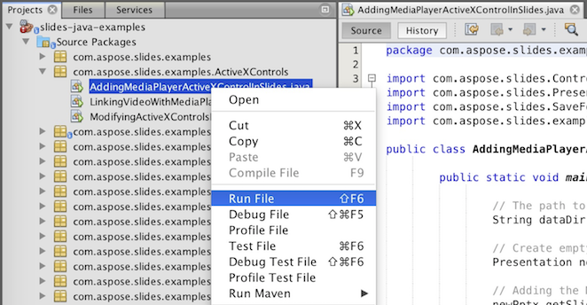

## **ดาวน์โหลด Aspose.Slides จาก GitHub**
ตัวอย่างทั้งหมดของ Aspose.Slides สำหรับ Java ถูกเก็บไว้บน [Github](https://github.com/aspose-slides/Aspose.Slides-for-Java). คุณสามารถโคลนรีโพสิตอรีโดยใช้ไคลเอ็นต์ Github ที่คุณชื่นชอบ หรือดาวน์โหลดไฟล์ ZIP จาก [ที่นี่](https://codeload.github.com/aspose-slides/Aspose.Slides-for-Java/zip/master).

แตกไฟล์ ZIP ไปยังโฟลเดอร์ใดก็ได้บนคอมพิวเตอร์ของคุณ ตัวอย่างทั้งหมดอยู่ในโฟลเดอร์ **Examples**.


## **นำเข้าตัวอย่างเข้าสู่ IDE**
โปรเจกต์นี้ใช้ระบบสร้างแบบ Maven IDE สมัยใหม่ใดก็สามารถเปิดหรืออิมพอร์ตโปรเจกต์และการพึ่งพาได้อย่างง่ายดาย ด้านล่างนี้เราจะแสดงวิธีใช้ IDE ยอดนิยมเพื่อสร้างและรันตัวอย่าง

### **IntelliJ IDEA**
คลิกเมนู **File** แล้วเลือก **Open** เรียกดูไปยังโฟลเดอร์โปรเจกต์และเลือกไฟล์ **pom.xml**.


โปรเจกต์จะถูกเปิดและดาวน์โหลดการพึ่งพาโดยอัตโนมัติ จากแท็บ Project เรียกดูตัวอย่างในโฟลเดอร์ **src/main/java** หากต้องการรันตัวอย่าง ให้คลิกขวาที่ไฟล์และเลือก "Run .." ตัวอย่างจะทำงานและผลลัพธ์จะแสดงในหน้าต่างคอนโซลในตัว.


### **Eclipse**
คลิกเมนู **File** แล้วเลือก **Import** เลือก **Maven** - Existing Maven Projects.


เรียกดูไปยังโฟลเดอร์ที่คุณโคลนหรือดาวน์โหลดจาก GitHub แล้วเลือกไฟล์ **pom.xml** โปรเจกต์จะถูกเปิดและดาวน์โหลดการพึ่งพาโดยอัตโนมัติ จากแท็บ Package Explorer เรียกดูตัวอย่างในโฟลเดอร์ **src/main/java** หากต้องการรันตัวอย่าง ให้คลิกขวาที่ไฟล์และเลือก **Run As** - **Java Application** ตัวอย่างจะทำงานและผลลัพธ์จะแสดงในหน้าต่างคอนโซลในตัว.


### **NetBeans**
คลิกเมนู **File** แล้วเลือก **Open Project** เรียกดูไปยังโฟลเดอร์ที่คุณโคลนหรือดาวน์โหลดจาก GitHub ไอคอนของโฟลเดอร์ **Examples** จะแสดงว่าเป็นโปรเจกต์ Maven เลือก Examples แล้วเปิดมัน.


โปรเจกต์จะถูกเปิดและดาวน์โหลดการพึ่งพาโดยอัตโนมัติ จากแท็บ Projects เรียกดูตัวอย่างใน **source packages** หากต้องการรันตัวอย่าง ให้คลิกขวาที่ไฟล์และเลือก **Run File** ตัวอย่างจะทำงานและผลลัพธ์จะแสดงในหน้าต่างคอนโซลในตัว.



## **เพิ่มไลบรารี Aspose.Slides ไปยัง Maven Local Repository**
เมื่อคุณอิมพอร์ตโปรเจกต์ **Aspose.Slides Examples** ไปยัง IDE Maven จะดาวน์โหลดไฟล์ JAR ของ aspose.slides โดยอัตโนมัติจาก [Aspose Maven Repository](https://releases.aspose.com/java/repo/com/aspose/). หากคุณไม่มีการเชื่อมต่ออินเทอร์เน็ต คุณสามารถเพิ่มไฟล์ JAR ในรีพอสิตอรีแบบโลคัลของคุณด้วยตนเอง.

### **mvn install**
ดาวน์โหลด [aspose.slides](https://releases.aspose.com/java/repo/com/aspose/aspose-slides/), แยกไฟล์และคัดลอก aspose.slides-version.jar ไปยังที่อื่น เช่น ไดรฟ์ C. รันคำสั่งต่อไปนี้:

```
mvn install:install-file
    - Dfile=c:\aspose.slides-version.jar
    - DgroupId=com.aspose
    - DartifactId=aspose-slides
    - Dversion={version}
    - Dpackaging=jar
```

ขณะนี้ไฟล์ JAR **aspose.slides** ถูกคัดลอกไปยัง Maven local repository ของคุณแล้ว.

### **pom.xml**
หลังการติดตั้ง เพียงประกาศพิกัด **aspose.slides** ใน pom.xml เพิ่มรีพอสิตอรีต่อไปนี้ในแท็บ repositories และ dependency ในแท็บ dependencies

``` xml
<repository>
    <id>AsposeJavaAPI</id>
    <name>Aspose Java API</name>
    <url>https://releases.aspose.com/java/repo/</url>
</repository>

<dependency>
    <groupId>com.aspose</groupId>
    <artifactId>aspose-slides</artifactId>
    <version>25.12</version>
    <classifier>jdk16</classifier>
</dependency>
```

### **เสร็จสิ้น**
ทำการ Build แล้ว ไฟล์ JAR **aspose.slides** จะสามารถเรียกใช้จาก Maven local repository ของคุณได้.

## **มีส่วนร่วม**
หากคุณต้องการเพิ่มหรือปรับปรุงตัวอย่าง เราแนะนำให้คุณมีส่วนร่วมกับโปรเจกต์ ตัวอย่างและโครงการโชว์เคสทั้งหมดในรีพอสิตอรีนี้เป็นโอเพนซอร์สและสามารถใช้ได้อย่างอิสระในแอปพลิเคชันของคุณ

เพื่อมีส่วนร่วม คุณสามารถ fork รีพอสิตอรี แก้ไขซอร์สโค้ดและส่ง Pull Request เราจะตรวจสอบการเปลี่ยนแปลงและรวมเข้ากับรีพอสิตอรีหากเป็นประโยชน์.