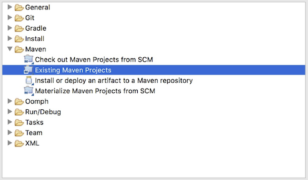

## **ดาวน์โหลด Aspose.Slides จาก GitHub**
ตัวอย่างทั้งหมดของ Aspose.Slides สำหรับ Java ถูกโฮสต์บน [Github](https://github.com/aspose-slides/Aspose.Slides-for-Java). คุณสามารถโคลนรีโพซิทอรีโดยใช้ไคลเอนต์ Github ที่คุณชอบหรือดาวน์โหลดไฟล์ ZIP จาก [ที่นี่](https://codeload.github.com/aspose-slides/Aspose.Slides-for-Java/zip/master).

แยกเนื้อหาของไฟล์ ZIP ไปยังโฟลเดอร์ใด ๆ บนคอมพิวเตอร์ของคุณ ตัวอย่างทั้งหมดอยู่ในโฟลเดอร์ **Examples**.


## **นำเข้าตัวอย่างเข้าสู่ IDE**
โครงการนี้ใช้ระบบสร้าง Maven IDE สมัยใหม่ใด ๆ สามารถเปิดหรือทำการนำเข้าโครงการและการพึ่งพาได้อย่างง่ายดาย ด้านล่างเราจะแสดงวิธีใช้ IDE ยอดนิยมเพื่อติดตั้งและเรียกใช้งานตัวอย่าง

### **IntelliJ IDEA**
คลิกที่เมนู **File** แล้วเลือก **Open**. เรียกดูไปยังโฟลเดอร์โครงการและเลือกไฟล์ **pom.xml**.


โครงการจะเปิดและดาวน์โหลดการพึ่งพาโดยอัตโนมัติ จากแท็บ Project เรียกดูตัวอย่างในโฟลเดอร์ **src/main/java**. เพื่อเรียกใช้งานตัวอย่าง ให้คลิกขวาที่ไฟล์แล้วเลือก "Run ..", ตัวอย่างจะถูกประมวลผลและผลลัพธ์จะแสดงในหน้าต่างคอนโซลที่ built in


### **Eclipse**
คลิกที่เมนู **File** แล้วเลือก **Import**. เลือก **Maven** - Existing Maven Projects.



เรียกดูไปยังโฟลเดอร์ที่คุณโคลนหรือดาวน์โหลดจาก GitHub และเลือกไฟล์ **pom.xml**. โครงการจะเปิดและดาวน์โหลดการพึ่งพาโดยอัตโนมัติ จากแท็บ Package Explorer เรียกดูตัวอย่างในโฟลเดอร์ **src/main/java**. เพื่อเรียกใช้งานตัวอย่าง ให้คลิกขวาที่ไฟล์แล้วเลือก **Run As** - **Java Application**, ตัวอย่างจะถูกประมวลผลและผลลัพธ์จะแสดงในหน้าต่างคอนโซลที่ built in


### **NetBeans**
คลิกที่เมนู **File** แล้วเลือก **Open Project**. เรียกดูไปยังโฟลเดอร์ที่คุณโคลนหรือดาวน์โหลดจาก GitHub ไอคอนของโฟลเดอร์ **Examples** จะบ่งบอกว่าเป็นโครงการ Maven เลือก **Examples** แล้วเปิด


โครงการจะเปิดและดาวน์โหลดการพึ่งพาโดยอัตโนมัติ จากแท็บ Projects เรียกดูตัวอย่างใน **source packages**. เพื่อเรียกใช้งานตัวอย่าง ให้คลิกขวาที่ไฟล์แล้วเลือก **Run File**, ตัวอย่างจะถูกประมวลผลและผลลัพธ์จะแสดงในหน้าต่างคอนโซลที่ built in


## **เพิ่มไลบรารี Aspose.Slides ลงใน Maven Local Repository**
เมื่อคุณนำเข้าโครงการ **Aspose.Slides Examples** ไปยัง IDE Maven จะดาวน์โหลดไฟล์ JAR ของ aspose.slides อัตโนมัติจาก [Aspose Maven Repository](https://releases.aspose.com/java/repo/com/aspose/). หากคุณไม่มีการเชื่อมต่ออินเทอร์เน็ต คุณสามารถเพิ่ม JAR ลงในรีโพซิทอรีในเครื่องของคุณด้วยตนเองได้

### **mvn install**
ดาวน์โหลด [aspose.slides](https://releases.aspose.com/java/repo/com/aspose/aspose-slides/), แยกไฟล์และคัดลอกไฟล์ aspose.slides-version.jar ไปยังตำแหน่งอื่น เช่น ไดรฟ์ C. รันคำสั่งต่อไปนี้:

```
mvn install:install-file
    - Dfile=c:\aspose.slides-version.jar
    - DgroupId=com.aspose
    - DartifactId=aspose-slides
    - Dversion={version}
    - Dpackaging=jar
```

ตอนนี้ไฟล์ jar **aspose.slides** ถูกคัดลอกไปยัง Maven local repository ของคุณแล้ว

### **pom.xml**
หลังจากติดตั้งแล้ว เพียงประกาศพิกัด **aspose.slides** ใน pom.xml. เพิ่มรีโพซิทอรีต่อไปนี้ในแท็บ repositories และเพิ่ม dependency ในแท็บ dependencies

``` xml
<repository>
    <id>AsposeJavaAPI</id>
    <name>Aspose Java API</name>
    <url>https://releases.aspose.com/java/repo/</url>
</repository>

<dependency>
    <groupId>com.aspose</groupId>
    <artifactId>aspose-slides</artifactId>
    <version>26.10</version>
    <classifier>jdk8</classifier>
</dependency>
```

### **เสร็จสิ้น**
ทำการ build แล้วไฟล์ jar **aspose.slides** จะสามารถถูกดึงจาก Maven local repository ของคุณได้

## **มีส่วนร่วม**
หากคุณต้องการเพิ่มหรือปรับปรุงตัวอย่าง เราอยากเชิญคุณมีส่วนร่วมกับโครงการ ตัวอย่างและโครงการโชว์เคสทั้งหมดในรีโพซิทอรีนี้เป็นโอเพ่นซอร์สและสามารถใช้งานได้อย่างอิสระในแอปพลิเคชันของคุณ

เพื่อมีส่วนร่วม คุณสามารถ fork รีโพซิทอรี แก้ไขซอร์สโค้ดและส่ง Pull Request เราจะตรวจสอบการเปลี่ยนแปลงและนำเข้าไปในรีโพซิทอรีหากเป็นประโยชน์