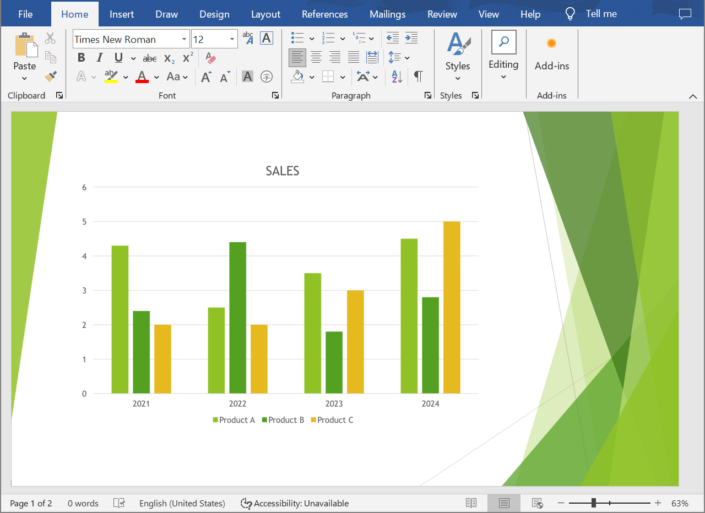

## **ภาพรวม**

บทความนี้นำเสนอวิธีแก้ไขสำหรับนักพัฒนาในการแปลงการนำเสนอ PowerPoint และ OpenDocument ไปเป็นเอกสาร Word โดยใช้ Aspose.Slides for .NET และ Aspose.Words for .NET คู่มือแบบเป็นขั้นตอนจะพาคุณผ่านทุกขั้นตอนของกระบวนการแปลง

## **แปลงการนำเสนอเป็นเอกสาร Word**

ทำตามคำแนะนำด้านล่างเพื่อแปลงการนำเสนอ PowerPoint หรือ OpenDocument เป็นเอกสาร Word:

1. สร้างอินสแตนซ์ของคลาส [Presentation](https://reference.aspose.com/slides/th/net/aspose.slides/presentation/) และโหลดไฟล์การนำเสนอ
2. สร้างอินสแตนซ์ของคลาส [Document](https://reference.aspose.com/words/net/aspose.words/document/) และ [DocumentBuilder](https://reference.aspose.com/words/net/aspose.words/documentbuilder/) เพื่อสร้างเอกสาร Word
3. ตั้งค่าขนาดหน้าของเอกสาร Word ให้ตรงกับการนำเสนอโดยใช้คุณสมบัติ [DocumentBuilder.PageSetup](https://reference.aspose.com/words/net/aspose.words/documentbuilder/pagesetup/)
4. ตั้งค่าขอบของเอกสาร Word โดยใช้คุณสมบัติ [DocumentBuilder.PageSetup](https://reference.aspose.com/words/net/aspose.words/documentbuilder/pagesetup/)
5. วนรอบผ่านสไลด์ทั้งหมดของการนำเสนอโดยใช้คุณสมบัติ [Presentation.Slides](https://reference.aspose.com/slides/th/net/aspose.slides/presentation/slides/th/)
   - สร้างภาพสไลด์โดยใช้เมธอด `GetImage` จากอินเทอร์เฟซ [ISlide](https://reference.aspose.com/slides/th/net/aspose.slides/islide/) แล้วบันทึกลงในเมมโมรีสตรีม
   - เพิ่มภาพสไลด์ลงในเอกสาร Word โดยใช้เมธอด `InsertImage` จากคลาส [DocumentBuilder](https://reference.aspose.com/words/net/aspose.words/documentbuilder/)
6. บันทึกเอกสาร Word ลงไฟล์

สมมติว่าเรามีการนำเสนอ "sample.pptx" ที่มีลักษณะดังนี้:


ตัวอย่างโค้ด C# ด้านล่างแสดงวิธีแปลงการนำเสนอ PowerPoint เป็นเอกสาร Word:

```cs
// โหลดไฟล์การนำเสนอ.
using var presentation = new Presentation("sample.pptx");

// สร้างอ็อบเจกต์ Document และ DocumentBuilder.
var document = new Document();
var builder = new DocumentBuilder(document);

// ตั้งค่าขนาดหน้าของเอกสาร Word.
var slideSize = presentation.SlideSize.Size;
builder.PageSetup.PageWidth = slideSize.Width;
builder.PageSetup.PageHeight = slideSize.Height;

// ตั้งค่าขอบของเอกสาร Word.
builder.PageSetup.LeftMargin = 0;
builder.PageSetup.RightMargin = 0;
builder.PageSetup.TopMargin = 0;
builder.PageSetup.BottomMargin = 0;

const float scaleX = 2, scaleY = 2;

// วนผ่านสไลด์ทั้งหมดของการนำเสนอ.
foreach (var slide in presentation.Slides)
{
    // สร้างภาพสไลด์และบันทึกลงในสตรีมหน่วยความจำ.
    using var image = slide.GetImage(scaleX, scaleY);
    using var imageStream = new MemoryStream();
    image.Save(imageStream, ImageFormat.Png);

    // เพิ่มภาพสไลด์ลงในเอกสาร Word.
    imageStream.Seek(0, SeekOrigin.Begin);
    builder.InsertImage(imageStream.ToArray(), builder.PageSetup.PageWidth, builder.PageSetup.PageHeight);

    builder.InsertBreak(BreakType.PageBreak);
}

// บันทึกเอกสาร Word ลงไฟล์.
document.Save("output.docx");
```

ผลลัพธ์:



{} 
ลองใช้ [**Online PPT to Word Converter**](https://products.aspose.app/slides/th/conversion/ppt-to-word) เพื่อดูว่าคุณจะได้ประโยชน์อะไรจากการแปลงการนำเสนอ PowerPoint และ OpenDocument เป็นเอกสาร Word. 
{}

## **คำถามที่พบบ่อย**

**ต้องติดตั้งคอมโพเนนต์อะไรบ้างเพื่อแปลงการนำเสนอ PowerPoint และ OpenDocument เป็นเอกสาร Word?**

คุณเพียงแค่ต้องเพิ่มแพ็กเกจ NuGet ที่เกี่ยวข้องสำหรับ [Aspose.Slides for .NET](https://www.nuget.org/packages/Aspose.Slides.NET) และ [Aspose.Words for .NET](https://www.nuget.org/packages/Aspose.Words/) ลงในโครงการ C# ของคุณ ไลบรารีทั้งสองทำงานเป็น API แยกอิสระและไม่จำเป็นต้องติดตั้ง Microsoft Office

**รูปแบบการนำเสนอ PowerPoint และ OpenDocument ทั้งหมดได้รับการสนับสนุนหรือไม่?**

Aspose.Slides for .NET [supports all presentation formats](/slides/th/net/supported-file-formats/) รวมถึง PPT, PPTX, ODP และประเภทไฟล์ทั่วไปอื่น ๆ ซึ่งทำให้คุณสามารถทำงานกับการนำเสนอที่สร้างในเวอร์ชันต่าง ๆ ของ Microsoft PowerPoint ได้