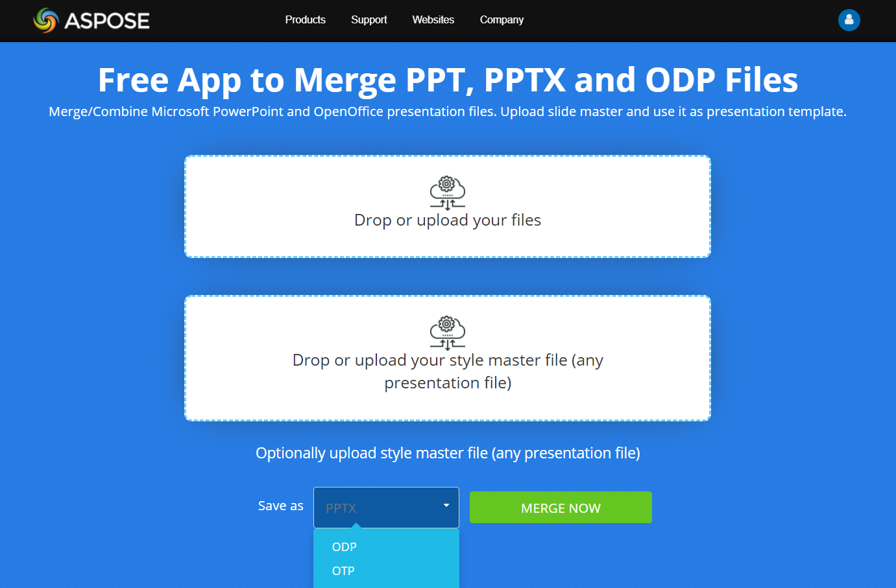

## **ภาพรวม**

Aspose.Slides ให้คุณรวมงานนำเสนอโดยการคัดลอกสไลด์จากงานนำเสนอหนึ่งไปยังอีกงานนำเสนอหนึ่ง บทความนี้อธิบายวิธีรวมงานนำเสนอทั้งหมดหรือสไลด์ที่เลือกใช้ Slide Master หรือเค้าโครงเฉพาะระหว่างการรวม วิธีจัดการงานนำเสนอที่มีขนาดสไลด์แตกต่างกัน และการเพิ่มสไลด์ที่รวมแล้วเข้าส่วนของงานนำเสนอ นอกจากนี้ยังครอบคลุมหมายเหตุเชิงปฏิบัติที่เกี่ยวข้องกับเนื้อหาที่รวมรวมถึงโน้ตพูดของผ presenter, ความคิดเห็น, ไฟล์ต้นฉบับที่มีการป้องกันด้วยรหัสผ่าน, และการใช้เธรด

## **เพิ่มประสิทธิภาพการรวมงานนำเสนอของคุณ**

ด้วย [Aspose.Slides for .NET](https://products.aspose.com/slides/th/net/), ผสานงานนำเสนอ PowerPoint อย่างไร้รอยต่อขณะคงสไตล์, เค้าโครง, และทุกองค์ประกอบไว้เหมือนเดิม แตกต่างจากเครื่องมืออื่น ๆ Aspose.Slides ผสานงานนำเสนอโดยไม่ทำให้คุณภาพเสื่อมหรือข้อมูลสูญหาย สามารถรวมงานนำเสนอทั้งหมด, สไลด์เฉพาะ, และแม้กระทั่งรูปแบบไฟล์ต่างกัน (PPT เป็น PPTX เป็นต้น)

### **คุณสมบัติการรวม**

- **การรวมงานนำเสนอเต็มรูปแบบ:** รวมสไลด์ทั้งหมดเป็นไฟล์เดียว
- **การรวมสไลด์เฉพาะ:** เลือกและรวมสไลด์ที่ต้องการ
- **การรวมข้ามรูปแบบ:** ผสานงานนำเสนอที่มีรูปแบบต่างกันโดยคงความสมบูรณ์

{}  

ต้องการเครื่องมือออนไลน์ **ฟรี** ที่รวดเร็วเพื่อ **รวมงานนำเสนอ PowerPoint**? ทดลองใช้ [**Aspose PowerPoint Merger**](https://products.aspose.app/slides/th/merger)  

- **รวมไฟล์ PowerPoint อย่างง่าย:** รวมหลายไฟล์ **PPT, PPTX, ODP** เป็นไฟล์เดียว  
- **รองรับรูปแบบต่าง ๆ:** รวม **PPT เป็น PPTX**, **PPTX เป็น ODP** และอื่น ๆ  
- **ไม่ต้องติดตั้ง:** ทำงานโดยตรงในเบราว์เซอร์ของคุณ รวดเร็วและปลอดภัย  

[](https://products.aspose.app/slides/th/merger)  

เริ่มรวมไฟล์ PowerPoint ของคุณด้วย **เครื่องมือออนไลน์ฟรีของ Aspose** วันนี้!  

{}

## **การรวมงานนำเสนอ**

เมื่อคุณ [รวมงานนำเสนอหนึ่งไปยังอีกงานนำเสนอหนึ่ง](https://products.aspose.com/slides/th/net/merger/ppt/), คุณกำลังผสานสไลด์ของพวกมันเข้าเป็นงานนำเสนอเดียวเพื่อให้ได้ไฟล์เดียว  

{}

โปรแกรมนำเสนอส่วนใหญ่ (PowerPoint หรือ OpenOffice) ขาดฟังก์ชันที่อนุญาตให้ผู้ใช้รวมงานนำเสนอแบบนี้  

[**Aspose.Slides for .NET**](https://products.aspose.com/slides/th/net/) อย่างไรก็ตามอนุญาตให้คุณรวมงานนำเสนอได้หลายวิธี คุณสามารถรวมงานนำเสนอพร้อมรูปทรง, สไตล์, ข้อความ, การจัดรูปแบบ, ความคิดเห็น, แอนิเมชัน ฯลฯ โดยไม่ต้องกังวลเรื่องการสูญเสียคุณภาพหรือข้อมูล  

**ดูเพิ่มเติม**  

[คัดลอกสไลด์](https://docs.aspose.com/slides/th/net/cloning-commenting-and-manipulating-slides/#cloning-commentingandmanipulatingslides-cloningslides)*.*  

{}

### **สิ่งที่สามารถรวมได้**

ด้วย Aspose.Slides, คุณสามารถรวม  

* งานนำเสนอทั้งหมด สไลด์ทั้งหมดจากงานนำเสนอจะรวมเป็นหนึ่งงานนำเสนอ  
* สไลด์เฉพาะ สไลด์ที่เลือกจะรวมเป็นหนึ่งงานนำเสนอ  
* งานนำเสนอในรูปแบบเดียวกัน (PPT เป็น PPT, PPTX เป็น PPTX ฯลฯ) และในรูปแบบที่แตกต่างกัน (PPT เป็น PPTX, PPTX เป็น ODP ฯลฯ) ต่อกันและกัน  

{} 

นอกจากงานนำเสนอแล้ว Aspose.Slides ยังอนุญาตให้คุณรวมไฟล์อื่น ๆ อีกด้วย:

* **รูปภาพ**, เช่น [JPG เป็น JPG](https://products.aspose.com/slides/th/net/merger/jpg-to-jpg/) หรือ [PNG เป็น PNG](https://products.aspose.com/slides/th/net/merger/png-to-png/)
* **เอกสาร**, เช่น [PDF เป็น PDF](https://products.aspose.com/slides/th/net/merger/pdf-to-pdf/) หรือ [HTML เป็น HTML](https://products.aspose.com/slides/th/net/merger/html-to-html/)
* และไฟล์ที่แตกต่างกันสองประเภท เช่น [รูปภาพเป็น PDF](https://products.aspose.com/slides/th/net/merger/image-to-pdf/) หรือ [JPG เป็น PDF](https://products.aspose.com/slides/th/net/merger/jpg-to-pdf/) หรือ [TIFF เป็น PDF](https://products.aspose.com/slides/th/net/merger/tiff-to-pdf/)  

{}

### **ตัวเลือกการรวม**

คุณสามารถตั้งค่าตัวเลือกที่กำหนดว่า  

* แต่ละสไลด์ในงานนำเสนอผลลัพธ์จะคงสไตล์เฉพาะของตน  
* หรือสไตล์เดียวจะใช้กับสไลด์ทั้งหมดในงานนำเสนอผลลัพธ์  

เพื่อรวมงานนำเสนอ Aspose.Slides ให้บริการเมธอด [AddClone](https://reference.aspose.com/slides/th/net/aspose.slides/islidecollection/methods/addclone) (จากอินเทอร์เฟซ [ISlideCollection](https://reference.aspose.com/slides/th/net/aspose.slides/islidecollection)) มีการนำไปใช้หลายรูปแบบที่กำหนดพารามิเตอร์ของกระบวนการรวมงานนำเสนอแต่ละอ็อบเจ็กต์ Presentation จะมีคอลเลกชัน [Slides](https://reference.aspose.com/slides/th/net/aspose.slides/presentation/properties/slides) ดังนั้นคุณสามารถเรียกเมธอด `AddClone` จากงานนำเสนอที่ต้องการรวมสไลด์เข้าไป  

เมธอด `AddClone` จะคืนค่าอ็อบเจ็กต์ `ISlide` ซึ่งเป็นสำเนาของสไลด์ต้นฉบับ สไลด์ในงานนำเสนอผลลัพธ์จึงเป็นสำเนาของสไลด์จากแหล่งต้นทาง ดังนั้นคุณจึงสามารถแก้ไขสไลด์ที่ได้ (เช่น ใช้สไตล์หรือการจัดรูปแบบหรือเค้าโครง) ได้โดยไม่ต้องกังวลว่างานนำเสนอแหล่งต้นทางจะได้รับผลกระทบ  

## **รวมงานนำเสนอ** 

Aspose.Slides ให้บริการเมธอด [**AddClone (ISlide)**](https://reference.aspose.com/slides/th/net/aspose.slides/islidecollection/methods/addclone) ที่ทำให้คุณสามารถรวมสไลด์โดยสไลด์ยังคงรักษาเค้าโครงและสไตล์ของตน (พารามิเตอร์เริ่มต้น)  

ตัวอย่างโค้ด C# นี้แสดงวิธีรวมงานนำเสนอ:

```c#
using Aspose.Slides;
using Aspose.Slides.Export;

using (Presentation pres1 = new Presentation("pres1.pptx"),
    pres2 = new Presentation("pres2.pptx"))
{
    foreach (ISlide slide in pres2.Slides)
    {
        pres1.Slides.AddClone(slide);
    }

    pres1.Save("combined.pptx", SaveFormat.Pptx);
}
```

## **รวมงานนำเสนอด้วย Slide Master** 

Aspose.Slides ให้บริการเมธอด [**AddClone (ISlide, IMasterSlide, Boolean)**](https://reference.aspose.com/slides/th/net/aspose.slides.islidecollection/addclone/methods/2) ที่ทำให้คุณสามารถรวมสไลด์โดยใช้แม่แบบ Slide Master ของงานนำเสนอ วิธีนี้ทำให้คุณสามารถเปลี่ยนสไตล์ของสไลด์ในงานนำเสนอผลลัพธ์ได้หากต้องการ  

โค้ด C# นี้แสดงการดำเนินการตามที่อธิบาย:

```c#
using Aspose.Slides;
using Aspose.Slides.Export;

using (Presentation pres1 = new Presentation("pres1.pptx"),
    pres2 = new Presentation("pres2.pptx"))
{
    foreach (ISlide slide in pres2.Slides)
    {
        pres1.Slides.AddClone(slide, pres2.Masters[0], allowCloneMissingLayout: true);
    }

    pres1.Save("combined.pptx", SaveFormat.Pptx);
}
```

{} 

เค้าโครงสไลด์สำหรับ Slide Master จะกำหนดโดยอัตโนมัติ หากไม่สามารถกำหนดเค้าโครงที่เหมาะสมได้, หากพารามิเตอร์ `allowCloneMissingLayout` ของเมธอด `AddClone` ตั้งเป็น `true` จะใช้เค้าโครงของสไลด์ต้นทาง มิฉะนั้นจะเกิดข้อผิดพลาด [PptxEditException](https://reference.aspose.com/slides/th/net/aspose.slides/pptxeditexception)  

{}

หากต้องการให้สไลด์ในงานนำเสนอผลลัพธ์มีเค้าโครงสไลด์ที่ต่างออกไป ให้ใช้เมธอด [AddClone (ISlide, ILayoutSlide)](https://reference.aspose.com/slides/th/net/aspose.slides.islidecollection/addclone/methods/1) แทนเมื่อทำการรวม  

## **รวมสไลด์เฉพาะจากงานนำเสนอ** 

การรวมสไลด์เฉพาะจากหลายงานนำเสนอเป็นประโยชน์ในการสร้างชุดสไลด์ที่กำหนดเอง Aspose.Slides for .NET อนุญาตให้คุณเลือกและนำเข้าสไลด์ที่ต้องการเท่านั้น API จะคงการจัดรูปแบบ, เค้าโครง, และการออกแบบของสไลด์ต้นฉบับไว้  

โค้ด C# ด้านล่างสร้างงานนำเสนอใหม่, เพิ่มสไลด์หัวเรื่องจากสองงานนำเสนออื่น, และบันทึกผลลัพธ์เป็นไฟล์:

```cs
using Aspose.Slides;
using Aspose.Slides.Export;

using (Presentation presentation = new Presentation())
using (Presentation presentation1 = new Presentation("presentation1.pptx"))
using (Presentation presentation2 = new Presentation("presentation2.pptx"))
{
    presentation.Slides.RemoveAt(0);

    ISlide slide1 = GetTitleSlide(presentation1);

    if (slide1 != null)
        presentation.Slides.AddClone(slide1);

    ISlide slide2 = GetTitleSlide(presentation2);

    if (slide2 != null)
        presentation.Slides.AddClone(slide2);

    presentation.Save("combined.pptx", SaveFormat.Pptx);
}

static ISlide GetTitleSlide(IPresentation presentation)
{
    foreach (ISlide slide in presentation.Slides)
    {
        if (slide.LayoutSlide.LayoutType == SlideLayoutType.Title)
        {
            return slide;
        }
    }
    return null;
}
```
```cs
using Aspose.Slides;

static ISlide GetTitleSlide(IPresentation presentation)
{
    foreach (ISlide slide in presentation.Slides)
    {
        if (slide.LayoutSlide.LayoutType == SlideLayoutType.Title)
        {
            return slide;
        }
    }
    return null;
}
```

## **รวมงานนำเสนอด้วยเค้าโครงสไลด์** 

โค้ด C# นี้แสดงวิธีผสานสไลด์จากงานนำเสนอพร้อมกำหนดเค้าโครงสไลด์ที่ต้องการเพื่อให้ได้งานนำเสนอผลลัพธ์เดียว:

```c#
using Aspose.Slides;
using Aspose.Slides.Export;

using (Presentation pres1 = new Presentation("pres1.pptx"),
    pres2 = new Presentation("pres2.pptx"))
{
    foreach (ISlide slide in pres2.Slides)
    {
        pres1.Slides.AddClone(slide, pres2.LayoutSlides[0]);
    }

    pres1.Save("combined.pptx", SaveFormat.Pptx);
}
```

## **รวมงานนำเสนอที่มีขนาดสไลด์ต่างกัน** 

{} 

การรวมงานนำเสนอที่มีขนาดสไลด์ต่างกันจะไม่ทำให้เกิดข้อผิดพลาด แต่สไลด์ที่รวมจะรับขนาดสไลด์ของงานนำเป้าหมายในขณะที่รูปร่างของสไลด์ยังคงตำแหน่งและขนาดเดิมไว้ ทำให้เนื้อหาอาจเลื่อนตำแหน่งหรืออยู่นอกขอบสไลด์  

{}

เพื่อรวมงานนำเสนอ 2 ฉบับที่มีขนาดสไลด์ต่างกันและคงเนื้อหาให้จัดวางอย่างเหมาะสม ให้ปรับขนาดหนึ่งในงานนำเสนอให้เท่ากับขนาดของอีกงานนำเสนอหนึ่ง  

โค้ดตัวอย่างนี้แสดงการดำเนินการดังกล่าว:

```c#
using Aspose.Slides;
using Aspose.Slides.Export;

using (Presentation pres1 = new Presentation("pres1.pptx"),
   pres2 = new Presentation("pres2.pptx"))
{
   pres2.SlideSize.SetSize(pres1.SlideSize.Size.Width, pres1.SlideSize.Size.Height, SlideSizeScaleType.EnsureFit);
 
   foreach (ISlide slide in pres2.Slides)
   {
       pres1.Slides.AddClone(slide);
   }
 
   pres1.Save("combined.pptx", SaveFormat.Pptx);
}
```

## **รวมสไลด์ไปยังส่วนของงานนำเสนอ** 

โค้ด C# นี้แสดงวิธีรวมสไลด์เฉพาะหนึ่งสไลด์เข้าสู่ส่วนในงานนำเสนอ:

```c#
using Aspose.Slides;
using Aspose.Slides.Export;

using (Presentation pres1 = new Presentation("pres1.pptx"),
    pres2 = new Presentation("pres2.pptx"))
{
    for (var index = 0; index < pres2.Slides.Count; index++)
    {
        ISlide slide = pres2.Slides[index];
        pres1.Slides.AddClone(slide, pres1.Sections[0]);
    }

    pres1.Save("combined.pptx", SaveFormat.Pptx);
}
```

สไลด์จะถูกเพิ่มที่ส่วนท้ายของเซคชันนั้น  

{}

Aspose มีแอปเว็บ **Collage** ฟรี [FREE Collage web app](https://products.aspose.app/slides/th/collage) คุณสามารถใช้บริการออนไลน์นี้เพื่อรวม [JPG เป็น JPG](https://products.aspose.app/slides/th/collage/jpg) หรือ PNG เป็น PNG, สร้าง [photo grids](https://products.aspose.app/slides/th/collage/photo-grid) ฯลฯ  

{}

## **FAQ**

### โน้ตพูดจะถูกเก็บไว้หลังการรวมหรือไม่?

ใช่ เมื่อคัดลอกสไลด์ Aspose.Slides จะคัดลอกองค์ประกอบสไลด์ทั้งหมดรวมถึงโน้ต, การจัดรูปแบบ, และแอนิเมชัน

### ความคิดเห็นและผู้เขียนของความคิดเห็นจะถูกโอนย้ายหรือไม่?

ความคิดเห็นเป็นส่วนหนึ่งของเนื้อหาสไลด์ จะถูกคัดลอกพร้อมสไลด์ ป้ายชื่อผู้เขียนความเห็นจะถูกเก็บเป็นอ็อบเจ็กต์ความคิดเห็นในงานนำเสนอผลลัพธ์

### หากงานนำเสนอแหล่งต้นทางถูกป้องกันด้วยรหัสผ่านทำอย่างไร?

ต้องเปิดด้วยรหัสผ่าน [เปิดด้วยรหัสผ่าน](/slides/th/net/password-protected-presentation/) ผ่าน [LoadOptions.Password](https://reference.aspose.com/slides/th/net/aspose.slides/loadoptions/password/) หลังจากโหลดแล้วสไลด์เหล่านั้นสามารถคัดลอกไปยังไฟล์เป้าหมายที่ไม่ป้องกัน (หรือไฟล์ที่ป้องกันเช่นกัน) ได้อย่างปลอดภัย

### การดำเนินการรวมปลอดภัยต่อเธรดแค่ไหน?

ห้ามใช้อินสแตนซ์ [Presentation](https://reference.aspose.com/slides/th/net/aspose.slides/presentation/) เดียวกันจากหลายเธรด ([หลายเธรด](/slides/th/net/multithreading/)) คำแนะนำที่แนะนำคือ “หนึ่งเอกสาร — หนึ่งเธรด”; สามารถประมวลผลไฟล์ต่าง ๆ ร่วมกันในเธรดแยกได้อย่างอิสระ