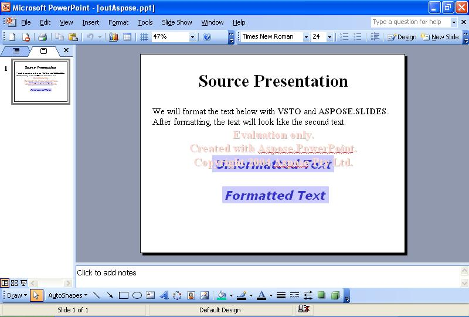

{} 

บางครั้งคุณอาจต้องจัดรูปแบบข้อความบนสไลด์โดยโปรแกรม บทความนี้แสดงวิธีอ่านงานนำเสนอแบบตัวอย่างที่มีข้อความบนสไลด์แรกโดยใช้ [VSTO](/slides/th/net/format-text-using-vsto-and-aspose-slides-and-net/) และ [Aspose.Slides for .NET](/slides/th/net/format-text-using-vsto-and-aspose-slides-and-net/) โค้ดจะจัดรูปแบบข้อความในกล่องข้อความที่สามบนสไลด์ให้เหมือนกับข้อความในกล่องข้อความสุดท้าย

{} 
## **การจัดรูปแบบข้อความ**
ทั้งวิธีของ VSTO และ Aspose.Slides จะทำตามขั้นตอนต่อไปนี้:

1. เปิดงานนำเสนอต้นฉบับ.
1. เข้าถึงสไลด์แรก.
1. เข้าถึงกล่องข้อความที่สาม.
1. เปลี่ยนการจัดรูปแบบของข้อความในกล่องข้อความที่สาม.
1. บันทึกงานนำเสนอลงดิสก์.

ภาพหน้าจอต่อไปนี้แสดงสไลด์ตัวอย่างก่อนและหลังการทำงานของโค้ด VSTO และ Aspose.Slides for .NET

**งานนำเสนออินพุต** 


### **ตัวอย่างโค้ด VSTO**
โค้ดด้านล่างแสดงวิธีจัดรูปแบบข้อความบนสไลด์โดยใช้ VSTO.

**ข้อความที่จัดรูปแบบใหม่ด้วย VSTO** 


```c#
//หมายเหตุ: PowerPoint เป็นเนมส페ซที่ได้กำหนดไว้ข้างต้นดังนี้
//using PowerPoint = Microsoft.Office.Interop.PowerPoint;
PowerPoint.Presentation pres = null;

//Open the presentation
pres = Globals.ThisAddIn.Application.Presentations.Open("c:\\source.ppt",
	Microsoft.Office.Core.MsoTriState.msoFalse,
	Microsoft.Office.Core.MsoTriState.msoFalse,
	Microsoft.Office.Core.MsoTriState.msoTrue);

//Access the first slide
PowerPoint.Slide slide = pres.Slides[1];

//Access the third shape
PowerPoint.Shape shp = slide.Shapes[3];

//Change its text's font to Verdana and height to 32
PowerPoint.TextRange txtRange = shp.TextFrame.TextRange;
txtRange.Font.Name = "Verdana";
txtRange.Font.Size = 32;

//Bolden it
txtRange.Font.Bold = Microsoft.Office.Core.MsoTriState.msoCTrue;

//Italicize it
txtRange.Font.Italic = Microsoft.Office.Core.MsoTriState.msoCTrue;

//Change text color
txtRange.Font.Color.RGB = 0x00CC3333;

//Change shape background color
shp.Fill.ForeColor.RGB = 0x00FFCCCC;

//Reposition it horizontally
shp.Left -= 70;

//Write the output to disk
pres.SaveAs("c:\\outVSTO.ppt",
	PowerPoint.PpSaveAsFileType.ppSaveAsPresentation,
	Microsoft.Office.Core.MsoTriState.msoFalse);
```


### **ตัวอย่าง Aspose.Slides for .NET**
เพื่อจัดรูปแบบข้อความด้วย Aspose.Slides ให้เพิ่มฟอนต์ก่อนจัดรูปแบบข้อความ.

**งานนำเสนอผลลัพธ์ที่สร้างด้วย Aspose.Slides** 




```c#
using System.Drawing;
using Aspose.Slides;
using Aspose.Slides.Export;

 //เปิดงานนำเสนอ
Presentation pres = new Presentation("source.ppt");

//เข้าถึงสไลด์แรก
ISlide slide = pres.Slides[0];

//เข้าถึงรูปร่างที่สาม
IShape shp = slide.Shapes[2];

//เปลี่ยนฟอนต์ของข้อความเป็น Verdana และขนาดเป็น 32
ITextFrame tf = ((IAutoShape)shp).TextFrame;
IParagraph para = tf.Paragraphs[0];
IPortion port = para.Portions[0];
port.PortionFormat.LatinFont = new FontData("Verdana");

port.PortionFormat.FontHeight = 32;

//ทำตัวหนา
port.PortionFormat.FontBold = NullableBool.True;

//ทำตัวเป็นอิตาลิก
port.PortionFormat.FontItalic = NullableBool.True;

//เปลี่ยนสีข้อความ
//ตั้งค่าสีฟอนต์
port.PortionFormat.FillFormat.FillType = FillType.Solid;
port.PortionFormat.FillFormat.SolidFillColor.Color = Color.FromArgb(0x33, 0x33, 0xCC);

//เปลี่ยนสีพื้นหลังของรูปร่าง
shp.FillFormat.FillType = FillType.Solid;
shp.FillFormat.SolidFillColor.Color = Color.FromArgb(0xCC, 0xCC, 0xFF);

//เขียนผลลัพธ์ลงดิสก์
pres.Save("outAspose.ppt", SaveFormat.Ppt);
```