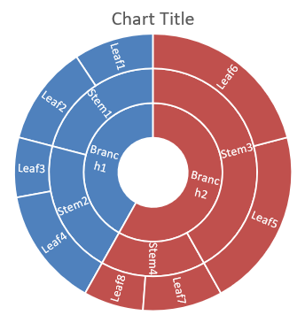

## **ภาพรวม**

บทความนี้ให้คำแนะนำอย่างละเอียดเกี่ยวกับวิธีการสร้างและปรับแต่งแผนภูมิด้วย Aspose.Slides for .NET คุณจะได้เรียนรู้วิธีการเพิ่มแผนภูมิเข้าไปในสไลด์โดยโปรแกรม, เติมข้อมูลเข้าไป, และกำหนดรูปแบบต่าง ๆ ให้ตรงตามความต้องการออกแบบของคุณ ตัวอย่างโค้ดที่ละเอียดในบทความจะแสดงขั้นตอนแต่ละขั้นตอน ตั้งแต่การเริ่มต้น Presentation และอ็อบเจ็กต์แผนภูมิ ไปจนถึงการกำหนด Series, Axis, และ Legend ด้วยการทำตามคำแนะนำนี้ คุณจะเข้าใจวิธีการรวมการสร้างแผนภูมิแบบไดนามิกเข้าสู่แอปพลิเคชัน .NET ของคุณ ทำให้การสร้างงานนำเสนอที่ใช้ข้อมูลเป็นศูนย์กลางเป็นเรื่องง่ายขึ้น

## **สร้างแผนภูมิ**

แผนภูมิช่วยให้ผู้ใช้มองเห็นข้อมูลได้อย่างรวดเร็วและค้นพบข้อสรุปที่อาจไม่ชัดเจนจากตารางหรือสเปรดชีต

**ทำไมต้องสร้างแผนภูมิ?**

ด้วยแผนภูมิคุณสามารถ:

* สรุปข้อมูลจำนวนมากลงในสไลด์เดียวของงานนำเสนอ
* เปิดเผยรูปแบบและแนวโน้มของข้อมูล
* สรุปทิศทางและโมเมนตัมของข้อมูลตามเวลา หรือหน่วยการวัดที่กำหนด
* ตรวจจับข้อมูลที่อยู่นอกค่าปกติ ความผิดพลาด หรือข้อมูลที่ไม่มีเหตุผล
* สื่อสารหรือแสดงข้อมูลที่ซับซ้อน

ใน PowerPoint คุณสามารถสร้างแผนภูมิได้ผ่านเมนู *Insert* ซึ่งมีเทมเพลตสำหรับออกแบบแผนภูมิต่าง ๆ ด้วย Aspose.Slides คุณสามารถสร้างแผนภูมิปกติ (อิงจากประเภทแผนภูมิที่นิยม) และแผนภูมิแบบกำหนดเองได้

{} 
ใช้ enumeration [ChartType](https://reference.aspose.com/slides/th/net/aspose.slides.charts/charttype/) ภายใต้ namespace [Aspose.Slides.Charts](https://reference.aspose.com/slides/th/net/aspose.slides.charts/) ค่าต่าง ๆ ใน enumeration นี้สอดคล้องกับประเภทแผนภูมิแต่ละแบบ
{} 

### **สร้างแผนภูมิคอลัมน์แบบกลุ่ม**

ส่วนนี้อธิบายวิธีสร้างแผนภูมิคอลัมน์แบบกลุ่มด้วย Aspose.Slides for .NET คุณจะได้เรียนรู้การเริ่มต้น Presentation, เพิ่มแผนภูมิ, และปรับแต่งส่วนต่าง ๆ เช่น ชื่อเรื่อง, ข้อมูล, Series, Category, และสไตล์ ทำตามขั้นตอนด้านล่างเพื่อดูว่าการสร้างแผนภูมิคอลัมน์แบบกลุ่มมาตรฐานเกิดขึ้นอย่างไร:

1. สร้างอินสแตนซ์ของคลาส [Presentation](https://reference.aspose.com/slides/th/net/aspose.slides/presentation)
1. ดึงอ้างอิงสไลด์โดยใช้ดัชนีของมัน
1. เพิ่มแผนภูมิพร้อมข้อมูลบางส่วนและระบุประเภท `ChartType.ClusteredColumn`
1. เพิ่มชื่อเรื่องให้กับแผนภูมิ
1. เข้าถึง worksheet ของข้อมูลแผนภูมิ
1. ลบ Series และ Category เริ่มต้นทั้งหมด
1. เพิ่ม Series และ Category ใหม่
1. เพิ่มข้อมูลใหม่ให้กับ Series ของแผนภูมิ
1. ตั้งค่าสีเติมให้กับ Series ของแผนภูมิ
1. เพิ่มป้ายชื่อให้กับ Series ของแผนภูมิ
1. บันทึก Presentation ที่แก้ไขเป็นไฟล์ PPTX

โค้ด C# นี้แสดงวิธีสร้างแผนภูมิคอลัมน์แบบกลุ่ม:

```c#
using System.Drawing;
using Aspose.Slides;
using Aspose.Slides.Charts;
using Aspose.Slides.Export;

// สร้างอินสแตนซ์ของคลาส Presentation.
using (Presentation presentation = new Presentation())
{
    // เข้าถึงสไลด์แรก.
    ISlide slide = presentation.Slides[0];

    // เพิ่มแผนภูมิคอลัมน์แบบกลุ่มพร้อมข้อมูลค่าเริ่มต้น.
    IChart chart = slide.Shapes.AddChart(ChartType.ClusteredColumn, 20, 20, 500, 300);

    // ตั้งค่าชื่อเรื่องของแผนภูมิ.
    chart.ChartTitle.AddTextFrameForOverriding("Sample Title");
    chart.ChartTitle.TextFrameForOverriding.TextFrameFormat.CenterText = NullableBool.True;
    chart.ChartTitle.Height = 20;
    chart.HasTitle = true;

    // ตั้งค่าตำแหน่งดัชนีของชีตข้อมูลแผนภูมิ.
    int worksheetIndex = 0;

    // ดึง workbook ของข้อมูลแผนภูมิ.
    IChartDataWorkbook workbook = chart.ChartData.ChartDataWorkbook;

    // ลบ Series และ Category ที่สร้างโดยอัตโนมัติ.
    chart.ChartData.Series.Clear();
    chart.ChartData.Categories.Clear();

    // เพิ่ม Series ใหม่.
    chart.ChartData.Series.Add(workbook.GetCell(worksheetIndex, 0, 1, "Series 1"), chart.Type);
    chart.ChartData.Series.Add(workbook.GetCell(worksheetIndex, 0, 2, "Series 2"), chart.Type);

    // เพิ่ม Category ใหม่.
    chart.ChartData.Categories.Add(workbook.GetCell(worksheetIndex, 1, 0, "Category 1"));
    chart.ChartData.Categories.Add(workbook.GetCell(worksheetIndex, 2, 0, "Category 2"));
    chart.ChartData.Categories.Add(workbook.GetCell(worksheetIndex, 3, 0, "Category 3"));

    // ดึง Series แผนภูมุตัวแรก.
    IChartSeries series = chart.ChartData.Series[0];

    // เติมข้อมูลให้ Series.
    series.DataPoints.AddDataPointForBarSeries(workbook.GetCell(worksheetIndex, 1, 1, 20));
    series.DataPoints.AddDataPointForBarSeries(workbook.GetCell(worksheetIndex, 2, 1, 50));
    series.DataPoints.AddDataPointForBarSeries(workbook.GetCell(worksheetIndex, 3, 1, 30));

    // ตั้งค่าสีเติมให้กับ Series.
    series.Format.Fill.FillType = FillType.Solid;
    series.Format.Fill.SolidFillColor.Color = Color.Red;

    // ดึง Series แผนภูมิที่สอง.
    series = chart.ChartData.Series[1];

    // เติมข้อมูลให้ Series.
    series.DataPoints.AddDataPointForBarSeries(workbook.GetCell(worksheetIndex, 1, 2, 30));
    series.DataPoints.AddDataPointForBarSeries(workbook.GetCell(worksheetIndex, 2, 2, 10));
    series.DataPoints.AddDataPointForBarSeries(workbook.GetCell(worksheetIndex, 3, 2, 60));

    // ตั้งค่าสีเติมให้กับ Series.
    series.Format.Fill.FillType = FillType.Solid;
    series.Format.Fill.SolidFillColor.Color = Color.Green;

    // ตั้งค่า label แรกให้แสดงชื่อ Category.
    IDataLabel label = series.DataPoints[0].Label;
    label.DataLabelFormat.ShowCategoryName = true;

    label = series.DataPoints[1].Label;
    label.DataLabelFormat.ShowSeriesName = true;

    // ตั้งค่า Series ให้แสดงค่าใน label ที่สาม.
    label = series.DataPoints[2].Label;
    label.DataLabelFormat.ShowValue = true;
    label.DataLabelFormat.ShowSeriesName = true;
    label.DataLabelFormat.Separator = "/";

    // บันทึกงานนำเสนอลงดิสก์เป็นไฟล์ PPTX.
    presentation.Save("AsposeChart_out.pptx", SaveFormat.Pptx);
}
```

ผลลัพธ์:


### **สร้างแผนภูมิกระจาย (Scatter)**

แผนภูมิกระจาย (หรือ Scatter Plot, X‑Y Graph) มักใช้เพื่อตรวจสอบรูปแบบหรือแสดงความสัมพันธ์ระหว่างสองตัวแปร

ใช้แผนภูมิกระจายเมื่อ:

* คุณมีข้อมูลตัวเลขที่จับคู่กัน
* มีสองตัวแปรที่สัมพันธ์กันดี
* ต้องการตรวจสอบว่าตัวแปรสองตัวเกี่ยวข้องกันหรือไม่
* มีตัวแปรอิสระหนึ่งค่าที่มีหลายค่าตัวแปรตาม

โค้ด C# นี้แสดงวิธีสร้างแผนภูมิกระจายพร้อมชุด marker ที่แตกต่างกัน:

```c#
using Aspose.Slides;
using Aspose.Slides.Charts;
using Aspose.Slides.Export;

// สร้างอินสแตนซ์ของคลาส Presentation.
using (Presentation presentation = new Presentation())
{
    // เข้าถึงสไลด์แรก.
    ISlide slide = presentation.Slides[0];

    // สร้างแผนภูมิกระจายเริ่มต้น.
    IChart chart = slide.Shapes.AddChart(ChartType.ScatterWithSmoothLines, 20, 20, 500, 300);

    // ตั้งค่าตำแหน่งดัชนีของชีตข้อมูลแผนภูมิ.
    int worksheetIndex = 0;

    // ดึง workbook ของข้อมูลแผนภูมิ.
    IChartDataWorkbook workbook = chart.ChartData.ChartDataWorkbook;

    // ลบ Series เริ่มต้น.
    chart.ChartData.Series.Clear();

    // เพิ่ม Series ใหม่.
    chart.ChartData.Series.Add(workbook.GetCell(worksheetIndex, 1, 1, "Series 1"), chart.Type);
    chart.ChartData.Series.Add(workbook.GetCell(worksheetIndex, 1, 3, "Series 2"), chart.Type);

    // ดึง Series แผนภูมุตัวแรก.
    IChartSeries series = chart.ChartData.Series[0];

    // เพิ่มจุดใหม่ (1:3) ให้กับ Series.
    series.DataPoints.AddDataPointForScatterSeries(workbook.GetCell(worksheetIndex, 2, 1, 1), workbook.GetCell(worksheetIndex, 2, 2, 3));

    // เพิ่มจุดใหม่ (2:10).
    series.DataPoints.AddDataPointForScatterSeries(workbook.GetCell(worksheetIndex, 3, 1, 2), workbook.GetCell(worksheetIndex, 3, 2, 10));

    // เปลี่ยนประเภทของ Series.
    series.Type = ChartType.ScatterWithStraightLinesAndMarkers;

    // เปลี่ยน Marker ของ Series แผนภูมิ.
    series.Marker.Size = 10;
    series.Marker.Symbol = MarkerStyleType.Star;

    // ดึง Series แผนภูมิที่สอง.
    series = chart.ChartData.Series[1];

    // เพิ่มจุดใหม่ (5:2) ให้กับ Series ของแผนภูมิ.
    series.DataPoints.AddDataPointForScatterSeries(workbook.GetCell(worksheetIndex, 2, 3, 5), workbook.GetCell(worksheetIndex, 2, 4, 2));

    // เพิ่มจุดใหม่ (3:1).
    series.DataPoints.AddDataPointForScatterSeries(workbook.GetCell(worksheetIndex, 3, 3, 3), workbook.GetCell(worksheetIndex, 3, 4, 1));

    // เพิ่มจุดใหม่ (2:2).
    series.DataPoints.AddDataPointForScatterSeries(workbook.GetCell(worksheetIndex, 4, 3, 2), workbook.GetCell(worksheetIndex, 4, 4, 2));

    // เพิ่มจุดใหม่ (5:1).
    series.DataPoints.AddDataPointForScatterSeries(workbook.GetCell(worksheetIndex, 5, 3, 5), workbook.GetCell(worksheetIndex, 5, 4, 1));

    // เปลี่ยน Marker ของ Series แผนภูมิ.
    series.Marker.Size = 10;
    series.Marker.Symbol = MarkerStyleType.Circle;

    // บันทึกงานนำเสนอลงดิสก์เป็นไฟล์ PPTX.
    presentation.Save("AsposeChart_out.pptx", SaveFormat.Pptx);
}
```

ผลลัพธ์:


### **สร้างแผนภูมิวงกลม (Pie)**

แผนภูมิวงกลมเหมาะสำหรับแสดงความสัมพันธ์ส่วนต่อส่วนทั้งหมดของข้อมูล โดยเฉพาะเมื่อข้อมูลมีป้ายประเภทพร้อมค่าตัวเลข อย่างไรก็ตาม หากข้อมูลมีหลายส่วนหรือหลายป้าย ควรพิจารณาใช้แผนภูมิจำนวนแทน

1. สร้างอินสแตนซ์ของคลาส [Presentation](https://reference.aspose.com/slides/th/net/aspose.slides/presentation)
1. ดึงอ้างอิงสไลด์โดยใช้ดัชนีของมัน
1. เพิ่มแผนภูมิด้วยข้อมูลเริ่มต้นและระบุประเภท `ChartType.Pie`
1. เข้าถึง workbook ของข้อมูลแผนภูมิ ([IChartDataWorkbook](https://reference.aspose.com/slides/th/net/aspose.slides.charts/ichartdataworkbook/))
1. ลบ Series และ Category เริ่มต้นทั้งหมด
1. เพิ่ม Series และ Category ใหม่
1. เพิ่มข้อมูลใหม่ให้กับ Series ของแผนภูมิ
1. เพิ่มจุดใหม่ให้กับแผนภูมิและตั้งค่าสีที่กำหนดเองให้กับส่วนของแผนภูมิวงกลม
1. ตั้งค่าป้ายชื่อให้กับ Series
1. เปิดใช้งานเส้นเชื่อม (leader lines) สำหรับป้ายชื่อ Series
1. ตั้งค่ามุมการหมุนของแผนภูมิวงกลม
1. บันทึก Presentation ที่แก้ไขเป็นไฟล์ PPTX

โค้ด C# นี้แสดงวิธีสร้างแผนภูมิวงกลม:

```c#
using System.Drawing;
using Aspose.Slides;
using Aspose.Slides.Charts;
using Aspose.Slides.Export;

// สร้างอินสแตนซ์ของคลาส Presentation.
using (Presentation presentation = new Presentation())
{
    // เข้าถึงสไลด์แรก.
    ISlide slide = presentation.Slides[0];

    // เพิ่มแผนภูมิกับข้อมูลค่าเริ่มต้น.
    IChart chart = slide.Shapes.AddChart(ChartType.Pie, 20, 20, 500, 300);

    // ตั้งค่าชื่อเรื่องของแผนภูมิ.
    chart.ChartTitle.AddTextFrameForOverriding("Sample Title");
    chart.ChartTitle.TextFrameForOverriding.TextFrameFormat.CenterText = NullableBool.True;
    chart.ChartTitle.Height = 20;
    chart.HasTitle = true;

    // ตั้งค่า Series แรกให้แสดงค่าตัวเลข.
    chart.ChartData.Series[0].Labels.DefaultDataLabelFormat.ShowValue = true;

    // ตั้งค่าตำแหน่งดัชนีของชีตข้อมูลแผนภูมิ.
    int worksheetIndex = 0;

    // ดึง workbook ของข้อมูลแผนภูมิ.
    IChartDataWorkbook workbook = chart.ChartData.ChartDataWorkbook;

    // ลบ Series และ Category ที่สร้างโดยอัตโนมัติ.
    chart.ChartData.Series.Clear();
    chart.ChartData.Categories.Clear();

    // เพิ่ม Category ใหม่.
    chart.ChartData.Categories.Add(workbook.GetCell(0, 1, 0, "1st Qtr"));
    chart.ChartData.Categories.Add(workbook.GetCell(0, 2, 0, "2nd Qtr"));
    chart.ChartData.Categories.Add(workbook.GetCell(0, 3, 0, "3rd Qtr"));

    // เพิ่ม Series ใหม่.
    IChartSeries series = chart.ChartData.Series.Add(workbook.GetCell(0, 0, 1, "Series 1"), chart.Type);

    // เติมข้อมูลให้ Series.
    series.DataPoints.AddDataPointForPieSeries(workbook.GetCell(worksheetIndex, 1, 1, 20));
    series.DataPoints.AddDataPointForPieSeries(workbook.GetCell(worksheetIndex, 2, 1, 50));
    series.DataPoints.AddDataPointForPieSeries(workbook.GetCell(worksheetIndex, 3, 1, 30));

    // ตั้งค่าสีของส่วน (sector).
    chart.ChartData.SeriesGroups[0].IsColorVaried = true;

    IChartDataPoint point = series.DataPoints[0];
    point.Format.Fill.FillType = FillType.Solid;
    point.Format.Fill.SolidFillColor.Color = Color.Cyan;

    // ตั้งค่าเส้นขอบของส่วน.
    point.Format.Line.FillFormat.FillType = FillType.Solid;
    point.Format.Line.FillFormat.SolidFillColor.Color = Color.Gray;
    point.Format.Line.Width = 3.0;
    point.Format.Line.Style = LineStyle.ThinThick;
    point.Format.Line.DashStyle = LineDashStyle.LargeDash;

    IChartDataPoint point1 = series.DataPoints[1];
    point1.Format.Fill.FillType = FillType.Solid;
    point1.Format.Fill.SolidFillColor.Color = Color.Brown;

    // ตั้งค่าเส้นขอบของส่วน.
    point1.Format.Line.FillFormat.FillType = FillType.Solid;
    point1.Format.Line.FillFormat.SolidFillColor.Color = Color.Blue;
    point1.Format.Line.Width = 3.0;
    point1.Format.Line.Style = LineStyle.Single;
    point1.Format.Line.DashStyle = LineDashStyle.LargeDashDot;

    IChartDataPoint point2 = series.DataPoints[2];
    point2.Format.Fill.FillType = FillType.Solid;
    point2.Format.Fill.SolidFillColor.Color = Color.Coral;

    // ตั้งค่าเส้นขอบของส่วน.
    point2.Format.Line.FillFormat.FillType = FillType.Solid;
    point2.Format.Line.FillFormat.SolidFillColor.Color = Color.Red;
    point2.Format.Line.Width = 2.0;
    point2.Format.Line.Style = LineStyle.ThinThin;
    point2.Format.Line.DashStyle = LineDashStyle.LargeDashDotDot;

    // สร้างป้ายกำกับกำหนดเองสำหรับแต่ละ Category ใน Series ใหม่.
    IDataLabel label1 = series.DataPoints[0].Label;

    label1.DataLabelFormat.ShowValue = true;

    IDataLabel label2 = series.DataPoints[1].Label;
    label2.DataLabelFormat.ShowValue = true;
    label2.DataLabelFormat.ShowLegendKey = true;
    label2.DataLabelFormat.ShowPercentage = true;

    IDataLabel label3 = series.DataPoints[2].Label;
    label3.DataLabelFormat.ShowSeriesName = true;
    label3.DataLabelFormat.ShowPercentage = true;

    // ตั้งค่า Series ให้แสดงเส้นนำไปยังป้าย (leader lines) ของแผนภูมิ.
    series.Labels.DefaultDataLabelFormat.ShowLeaderLines = true;

    // ตั้งค่ามุมการหมุนของส่วนของแผนภูมิพาย.
    chart.ChartData.SeriesGroups[0].FirstSliceAngle = 180;

    // บันทึกงานนำเสนอลงดิสก์เป็นไฟล์ PPTX.
    presentation.Save("PieChart_out.pptx", SaveFormat.Pptx);
}
```

ผลลัพธ์:


### **สร้างแผนภูมิเส้น (Line)**

แผนภูมิเส้นเหมาะสำหรับแสดงการเปลี่ยนแปลงของค่าเมื่อเวลาผ่านไป ด้วยแผนภูมิเส้นคุณสามารถเปรียบเทียบข้อมูลจำนวนมากในคราวเดียว, ติดตามการเปลี่ยนแปลงและแนวโน้มตามเวลา, ไฮไลท์ความแปลกประหลาดใน Series ฯลฯ

1. สร้างอินสแตนซ์ของคลาส [Presentation](https://reference.aspose.com/slides/th/net/aspose.slides/presentation)
1. ดึงอ้างอิงสไลด์โดยใช้ดัชนีของมัน
1. เพิ่มแผนภูมิด้วยข้อมูลเริ่มต้นและระบุประเภท `ChartType.Line`
1. เข้าถึง workbook ของข้อมูลแผนภูมิ ([IChartDataWorkbook](https://reference.aspose.com/slides/th/net/aspose.slides.charts/ichartdataworkbook/))
1. ลบ Series และ Category เริ่มต้นทั้งหมด
1. เพิ่ม Series และ Category ใหม่
1. เพิ่มข้อมูลใหม่ให้กับ Series ของแผนภูมิ
1. บันทึก Presentation ที่แก้ไขเป็นไฟล์ PPTX

โค้ด C# นี้แสดงวิธีสร้างแผนภูมิเส้น:

```c#
using Aspose.Slides;
using Aspose.Slides.Charts;
using Aspose.Slides.Export;

using (Presentation presentation = new Presentation())
{
    IChart lineChart = presentation.Slides[0].Shapes.AddChart(ChartType.Line, 20, 20, 500, 300);

    presentation.Save("lineChart.pptx", SaveFormat.Pptx);
}
```

โดยค่าเริ่มต้น จุดบนแผนภูมิเส้นจะถูกเชื่อมต่อด้วยเส้นตรงต่อเนื่อง หากต้องการให้เชื่อมด้วยเส้นประ สามารถระบุประเภท dash ที่ต้องการได้ดังนี้:

```c#
using Aspose.Slides;
using Aspose.Slides.Charts;

using (Presentation presentation = new Presentation())
{
    IChart lineChart = presentation.Slides[0].Shapes.AddChart(ChartType.Line, 20, 20, 500, 300);

    foreach (IChartSeries series in lineChart.ChartData.Series)
    {
        series.Format.Line.DashStyle = LineDashStyle.Dash;
    }
}
```

ผลลัพธ์:


### **สร้างแผนภูมิต้นไม้ (Tree Map)**

แผนภูมิต้นไม้เหมาะสำหรับข้อมูลการขายเมื่อคุณต้องการแสดงขนาดสัมพัทธ์ของประเภทข้อมูลและดึงความสนใจไปยังรายการที่มีส่วนร่วมสูงในแต่ละประเภท

1. สร้างอินสแตนซ์ของคลาส [Presentation](https://reference.aspose.com/slides/th/net/aspose.slides/presentation)
1. ดึงอ้างอิงสไลด์โดยใช้ดัชนีของมัน
1. เพิ่มแผนภูมิด้วยข้อมูลเริ่มต้นและระบุประเภท `ChartType.Treemap`
1. เข้าถึง workbook ของข้อมูลแผนภูมิ ([IChartDataWorkbook](https://reference.aspose.com/slides/th/net/aspose.slides.charts/ichartdataworkbook/))
1. ลบ Series และ Category เริ่มต้นทั้งหมด
1. เพิ่ม Series และ Category ใหม่
1. เพิ่มข้อมูลใหม่ให้กับ Series ของแผนภูมิ
1. บันทึก Presentation ที่แก้ไขเป็นไฟล์ PPTX

โค้ด C# นี้แสดงวิธีสร้างแผนภูมิต้นไม้:

```c#
using Aspose.Slides;
using Aspose.Slides.Charts;
using Aspose.Slides.Export;

using (Presentation presentation = new Presentation())
{
    IChart chart = presentation.Slides[0].Shapes.AddChart(ChartType.Treemap, 20, 20, 500, 300);
    chart.ChartData.Categories.Clear();
    chart.ChartData.Series.Clear();

    IChartDataWorkbook workbook = chart.ChartData.ChartDataWorkbook;
    workbook.Clear(0);

    // สาขา 1
    IChartCategory leaf = chart.ChartData.Categories.Add(workbook.GetCell(0, "C1", "Leaf1"));
    leaf.GroupingLevels.SetGroupingItem(1, "Stem1");
    leaf.GroupingLevels.SetGroupingItem(2, "Branch1");

    chart.ChartData.Categories.Add(workbook.GetCell(0, "C2", "Leaf2"));

    leaf = chart.ChartData.Categories.Add(workbook.GetCell(0, "C3", "Leaf3"));
    leaf.GroupingLevels.SetGroupingItem(1, "Stem2");

    chart.ChartData.Categories.Add(workbook.GetCell(0, "C4", "Leaf4"));

    // สาขา 2
    leaf = chart.ChartData.Categories.Add(workbook.GetCell(0, "C5", "Leaf5"));
    leaf.GroupingLevels.SetGroupingItem(1, "Stem3");
    leaf.GroupingLevels.SetGroupingItem(2, "Branch2");

    chart.ChartData.Categories.Add(workbook.GetCell(0, "C6", "Leaf6"));

    leaf = chart.ChartData.Categories.Add(workbook.GetCell(0, "C7", "Leaf7"));
    leaf.GroupingLevels.SetGroupingItem(1, "Stem4");

    chart.ChartData.Categories.Add(workbook.GetCell(0, "C8", "Leaf8"));

    IChartSeries series = chart.ChartData.Series.Add(ChartType.Treemap);
    series.Labels.DefaultDataLabelFormat.ShowCategoryName = true;
    series.DataPoints.AddDataPointForTreemapSeries(workbook.GetCell(0, "D1", 4));
    series.DataPoints.AddDataPointForTreemapSeries(workbook.GetCell(0, "D2", 5));
    series.DataPoints.AddDataPointForTreemapSeries(workbook.GetCell(0, "D3", 3));
    series.DataPoints.AddDataPointForTreemapSeries(workbook.GetCell(0, "D4", 6));
    series.DataPoints.AddDataPointForTreemapSeries(workbook.GetCell(0, "D5", 9));
    series.DataPoints.AddDataPointForTreemapSeries(workbook.GetCell(0, "D6", 9));
    series.DataPoints.AddDataPointForTreemapSeries(workbook.GetCell(0, "D7", 4));
    series.DataPoints.AddDataPointForTreemapSeries(workbook.GetCell(0, "D8", 3));

    series.ParentLabelLayout = ParentLabelLayoutType.Overlapping;

    presentation.Save("Treemap.pptx", SaveFormat.Pptx);
}
```

ผลลัพธ์:


### **สร้างแผนภูมหุ้น (Stock)**

แผนภูมหุ้นใช้แสดงข้อมูลการเงินเช่น ราคาเปิด, สูง, ต่ำ, ปิด เพื่อวิเคราะห์แนวโน้มตลาดและความผันผวน ให้ข้อมูลที่สำคัญสำหรับนักลงทุนและนักวิเคราะห์ในการตัดสินใจ

1. สร้างอินสแตนซ์ของคลาส [Presentation](https://reference.aspose.com/slides/th/net/aspose.slides/presentation)
1. ดึงอ้างอิงสไลด์โดยใช้ดัชนีของมัน
1. เพิ่มแผนภูมิด้วยข้อมูลเริ่มต้นและระบุประเภท `ChartType.OpenHighLowClose`
1. เข้าถึง workbook ของข้อมูลแผนภูมิ ([IChartDataWorkbook](https://reference.aspose.com/slides/th/net/aspose.slides.charts/ichartdataworkbook/))
1. ลบ Series และ Category เริ่มต้นทั้งหมด
1. เพิ่ม Series และ Category ใหม่
1. เพิ่มข้อมูลใหม่ให้กับ Series ของแผนภูมิ
1. ระบุรูปแบบ HiLowLines
1. บันทึก Presentation ที่แก้ไขเป็นไฟล์ PPTX

โค้ด C# นี้แสดงวิธีสร้างแผนภูมหุ้น:

```c#
using Aspose.Slides;
using Aspose.Slides.Charts;
using Aspose.Slides.Export;

using (Presentation presentation = new Presentation())
{
    IChart chart = presentation.Slides[0].Shapes.AddChart(ChartType.OpenHighLowClose, 20, 20, 500, 300, false);

    IChartDataWorkbook workbook = chart.ChartData.ChartDataWorkbook;

    chart.ChartData.Categories.Add(workbook.GetCell(0, 1, 0, "A"));
    chart.ChartData.Categories.Add(workbook.GetCell(0, 2, 0, "B"));
    chart.ChartData.Categories.Add(workbook.GetCell(0, 3, 0, "C"));

    chart.ChartData.Series.Add(workbook.GetCell(0, 0, 1, "Open"), chart.Type);
    chart.ChartData.Series.Add(workbook.GetCell(0, 0, 2, "High"), chart.Type);
    chart.ChartData.Series.Add(workbook.GetCell(0, 0, 3, "Low"), chart.Type);
    chart.ChartData.Series.Add(workbook.GetCell(0, 0, 4, "Close"), chart.Type);

    IChartSeries series = chart.ChartData.Series[0];
    series.DataPoints.AddDataPointForStockSeries(workbook.GetCell(0, 1, 1, 72));
    series.DataPoints.AddDataPointForStockSeries(workbook.GetCell(0, 2, 1, 25));
    series.DataPoints.AddDataPointForStockSeries(workbook.GetCell(0, 3, 1, 38));

    series = chart.ChartData.Series[1];
    series.DataPoints.AddDataPointForStockSeries(workbook.GetCell(0, 1, 2, 172));
    series.DataPoints.AddDataPointForStockSeries(workbook.GetCell(0, 2, 2, 57));
    series.DataPoints.AddDataPointForStockSeries(workbook.GetCell(0, 3, 2, 57));

    series = chart.ChartData.Series[2];
    series.DataPoints.AddDataPointForStockSeries(workbook.GetCell(0, 1, 3, 12));
    series.DataPoints.AddDataPointForStockSeries(workbook.GetCell(0, 2, 3, 12));
    series.DataPoints.AddDataPointForStockSeries(workbook.GetCell(0, 3, 3, 13));

    series = chart.ChartData.Series[3];
    series.DataPoints.AddDataPointForStockSeries(workbook.GetCell(0, 1, 4, 25));
    series.DataPoints.AddDataPointForStockSeries(workbook.GetCell(0, 2, 4, 38));
    series.DataPoints.AddDataPointForStockSeries(workbook.GetCell(0, 3, 4, 50));

    chart.ChartData.SeriesGroups[0].UpDownBars.HasUpDownBars = true;
    chart.ChartData.SeriesGroups[0].HiLowLinesFormat.Line.FillFormat.FillType = FillType.Solid;

    foreach (IChartSeries ser in chart.ChartData.Series)
    {
        ser.Format.Line.FillFormat.FillType = FillType.NoFill;
    }

    chart.Axes.VerticalAxis.MinorGridLinesFormat.Line.FillFormat.FillType = FillType.NoFill;

    presentation.Save("Stock-chart.pptx", SaveFormat.Pptx);
}
```

ผลลัพธ์:


### **สร้างแผนภูมิกล่องและหนวด (Box and Whisker)**

แผนภูมิกล่องและหนวดใช้แสดงการกระจายของข้อมูลโดยสรุปค่าทางสถิติหลัก เช่น มัธยฐาน, ควอร์ไทล์, และค่าผิดปกติ เหมาะสำหรับการวิเคราะห์ข้อมูลเชิงสำรวจและการศึกษาเชิงสถิติ

1. สร้างอินสแตนซ์ของคลาส [Presentation](https://reference.aspose.com/slides/th/net/aspose.slides/presentation)
1. ดึงอ้างอิงสไลด์โดยใช้ดัชนีของมัน
1. เพิ่มแผนภูมิด้วยข้อมูลเริ่มต้นและระบุประเภท `ChartType.BoxAndWhisker`
1. เข้าถึง workbook ของข้อมูลแผนภูมิ ([IChartDataWorkbook](https://reference.aspose.com/slides/th/net/aspose.slides.charts/ichartdataworkbook/))
1. ลบ Series และ Category เริ่มต้นทั้งหมด
1. เพิ่ม Series และ Category ใหม่
1. เพิ่มข้อมูลใหม่ให้กับ Series ของแผนภูมิ
1. บันทึก Presentation ที่แก้ไขเป็นไฟล์ PPTX

โค้ด C# นี้แสดงวิธีสร้างแผนภูมิกล่องและหนวด:

```c#
using Aspose.Slides;
using Aspose.Slides.Charts;
using Aspose.Slides.Export;

using (Presentation presentation = new Presentation())
{
    IChart chart = presentation.Slides[0].Shapes.AddChart(ChartType.BoxAndWhisker, 20, 20, 500, 300);
    chart.ChartData.Categories.Clear();
    chart.ChartData.Series.Clear();

    IChartDataWorkbook workbook = chart.ChartData.ChartDataWorkbook;
    workbook.Clear(0);

    chart.ChartData.Categories.Add(workbook.GetCell(0, "A1", "Category 1"));
    chart.ChartData.Categories.Add(workbook.GetCell(0, "A2", "Category 2"));
    chart.ChartData.Categories.Add(workbook.GetCell(0, "A3", "Category 3"));
    chart.ChartData.Categories.Add(workbook.GetCell(0, "A4", "Category 4"));
    chart.ChartData.Categories.Add(workbook.GetCell(0, "A5", "Category 5"));
    chart.ChartData.Categories.Add(workbook.GetCell(0, "A6", "Category 6"));

    IChartSeries series = chart.ChartData.Series.Add(ChartType.BoxAndWhisker);

    series.QuartileMethod = QuartileMethodType.Exclusive;
    series.ShowMeanLine = true;
    series.ShowMeanMarkers = true;
    series.ShowInnerPoints = true;
    series.ShowOutlierPoints = true;

    series.DataPoints.AddDataPointForBoxAndWhiskerSeries(workbook.GetCell(0, "B1", 15));
    series.DataPoints.AddDataPointForBoxAndWhiskerSeries(workbook.GetCell(0, "B2", 41));
    series.DataPoints.AddDataPointForBoxAndWhiskerSeries(workbook.GetCell(0, "B3", 16));
    series.DataPoints.AddDataPointForBoxAndWhiskerSeries(workbook.GetCell(0, "B4", 10));
    series.DataPoints.AddDataPointForBoxAndWhiskerSeries(workbook.GetCell(0, "B5", 23));
    series.DataPoints.AddDataPointForBoxAndWhiskerSeries(workbook.GetCell(0, "B6", 16));

    presentation.Save("BoxAndWhisker.pptx", SaveFormat.Pptx);
}
```

### **สร้างแผนภูมกรวย (Funnel)**

แผนภูมกรวยใช้แสดงกระบวนการที่มีหลายขั้นตอนโดยปริมาณข้อมูลจะลดลงเมื่อเคลื่อนจากขั้นตอนแรกไปยังขั้นตอนต่อไป มีประโยชน์ในการวิเคราะห์อัตราการแปลง, ค้นหาข้อบกพร่อง, และติดตามประสิทธิภาพของกระบวนการขายหรือการตลาด

1. สร้างอินสแตนซ์ของคลาส [Presentation](https://reference.aspose.com/slides/th/net/aspose.slides/presentation)
1. ดึงอ้างอิงสไลด์โดยใช้ดัชนีของมัน
1. เพิ่มแผนภูมิด้วยข้อมูลเริ่มต้นและระบุประเภท `ChartType.Funnel`
1. บันทึก Presentation ที่แก้ไขเป็นไฟล์ PPTX

โค้ด C# นี้แสดงวิธีสร้างแผนภูมกรวย:

```c#
using Aspose.Slides;
using Aspose.Slides.Charts;
using Aspose.Slides.Export;

using (Presentation presentation = new Presentation("test.pptx"))
{
    IChart chart = presentation.Slides[0].Shapes.AddChart(ChartType.Funnel, 50, 50, 500, 400);
    chart.ChartData.Categories.Clear();
    chart.ChartData.Series.Clear();

    IChartDataWorkbook workbook = chart.ChartData.ChartDataWorkbook;
    workbook.Clear(0);

    chart.ChartData.Categories.Add(workbook.GetCell(0, "A1", "Category 1"));
    chart.ChartData.Categories.Add(workbook.GetCell(0, "A2", "Category 2"));
    chart.ChartData.Categories.Add(workbook.GetCell(0, "A3", "Category 3"));
    chart.ChartData.Categories.Add(workbook.GetCell(0, "A4", "Category 4"));
    chart.ChartData.Categories.Add(workbook.GetCell(0, "A5", "Category 5"));
    chart.ChartData.Categories.Add(workbook.GetCell(0, "A6", "Category 6"));

    IChartSeries series = chart.ChartData.Series.Add(ChartType.Funnel);

    series.DataPoints.AddDataPointForFunnelSeries(workbook.GetCell(0, "B1", 50));
    series.DataPoints.AddDataPointForFunnelSeries(workbook.GetCell(0, "B2", 100));
    series.DataPoints.AddDataPointForFunnelSeries(workbook.GetCell(0, "B3", 200));
    series.DataPoints.AddDataPointForFunnelSeries(workbook.GetCell(0, "B4", 300));
    series.DataPoints.AddDataPointForFunnelSeries(workbook.GetCell(0, "B5", 400));
    series.DataPoints.AddDataPointForFunnelSeries(workbook.GetCell(0, "B6", 500));

    presentation.Save("Funnel.pptx", SaveFormat.Pptx);
}
```

ผลลัพธ์:


### **สร้างแผนภูมาดวงอาทิตย์ (Sunburst)**

แผนภูมิดวงอาทิตย์ใช้แสดงข้อมูลเชิงลำดับชั้นโดยแสดงระดับต่าง ๆ เป็นวงกลมรอบศูนย์ ช่วยให้มองเห็นความสัมพันธ์ส่วนต่อส่วนทั้งหมดและเหมาะสำหรับแสดงหมวดหมู่ย่อยหลายระดับในรูปแบบที่กระชับ

1. สร้างอินสแตนซ์ของคลาส [Presentation](https://reference.aspose.com/slides/th/net/aspose.slides/presentation)
1. ดึงอ้างอิงสไลด์โดยใช้ดัชนีของมัน
1. เพิ่มแผนภูมิด้วยข้อมูลเริ่มต้นและระบุประเภท `ChartType.Sunburst`
1. บันทึก Presentation ที่แก้ไขเป็นไฟล์ PPTX

โค้ด C# นี้แสดงวิธีสร้างแผนภูมิดวงอาทิตย์:

```c#
using Aspose.Slides;
using Aspose.Slides.Charts;
using Aspose.Slides.Export;

using (Presentation presentation = new Presentation())
{
    IChart chart = presentation.Slides[0].Shapes.AddChart(ChartType.Sunburst, 20, 20, 500, 300);
    chart.ChartData.Categories.Clear();
    chart.ChartData.Series.Clear();

    IChartDataWorkbook workbook = chart.ChartData.ChartDataWorkbook;
    workbook.Clear(0);

    // สาขา 1
    IChartCategory leaf = chart.ChartData.Categories.Add(workbook.GetCell(0, "C1", "Leaf1"));
    leaf.GroupingLevels.SetGroupingItem(1, "Stem1");
    leaf.GroupingLevels.SetGroupingItem(2, "Branch1");

    chart.ChartData.Categories.Add(workbook.GetCell(0, "C2", "Leaf2"));

    leaf = chart.ChartData.Categories.Add(workbook.GetCell(0, "C3", "Leaf3"));
    leaf.GroupingLevels.SetGroupingItem(1, "Stem2");

    chart.ChartData.Categories.Add(workbook.GetCell(0, "C4", "Leaf4"));

    // สาขา 2
    leaf = chart.ChartData.Categories.Add(workbook.GetCell(0, "C5", "Leaf5"));
    leaf.GroupingLevels.SetGroupingItem(1, "Stem3");
    leaf.GroupingLevels.SetGroupingItem(2, "Branch2");

    chart.ChartData.Categories.Add(workbook.GetCell(0, "C6", "Leaf6"));

    leaf = chart.ChartData.Categories.Add(workbook.GetCell(0, "C7", "Leaf7"));
    leaf.GroupingLevels.SetGroupingItem(1, "Stem4");

    chart.ChartData.Categories.Add(workbook.GetCell(0, "C8", "Leaf8"));

    IChartSeries series = chart.ChartData.Series.Add(ChartType.Sunburst);
    series.Labels.DefaultDataLabelFormat.ShowCategoryName = true;
    series.DataPoints.AddDataPointForSunburstSeries(workbook.GetCell(0, "D1", 4));
    series.DataPoints.AddDataPointForSunburstSeries(workbook.GetCell(0, "D2", 5));
    series.DataPoints.AddDataPointForSunburstSeries(workbook.GetCell(0, "D3", 3));
    series.DataPoints.AddDataPointForSunburstSeries(workbook.GetCell(0, "D4", 6));
    series.DataPoints.AddDataPointForSunburstSeries(workbook.GetCell(0, "D5", 9));
    series.DataPoints.AddDataPointForSunburstSeries(workbook.GetCell(0, "D6", 9));
    series.DataPoints.AddDataPointForSunburstSeries(workbook.GetCell(0, "D7", 4));
    series.DataPoints.AddDataPointForSunburstSeries(workbook.GetCell(0, "D8", 3));

    presentation.Save("Sunburst.pptx", SaveFormat.Pptx);
}
```

ผลลัพธ์:



### **สร้างแผนภูมิฮิสโตแกรม (Histogram)**

แผนภูมฮิสโตแกรมใช้แสดงการกระจายของข้อมูลตัวเลขโดยจัดกลุ่มค่าเป็นช่วงหรือบิ้น ช่วยระบุรูปแบบความถี่, การเบี่ยงเบน, การกระจาย, และการตรวจจับค่าผิดปกติในข้อมูล

1. สร้างอินสแตนซ์ของคลาส [Presentation](https://reference.aspose.com/slides/th/net/aspose.slides/presentation)
1. ดึงอ้างอิงสไลด์โดยใช้ดัชนีของมัน
1. เพิ่มแผนภูมิด้วยข้อมูลบางส่วนและระบุประเภท `ChartType.Histogram`
1. เข้าถึง workbook ของข้อมูลแผนภูมิ ([IChartDataWorkbook](https://reference.aspose.com/slides/th/net/aspose.slides.charts/ichartdataworkbook/))
1. ลบ Series และ Category เริ่มต้นทั้งหมด
1. เพิ่ม Series และ Category ใหม่
1. บันทึก Presentation ที่แก้ไขเป็นไฟล์ PPTX

โค้ด C# นี้แสดงวิธีสร้างแผนภูมฮิสโตแกรม:

```c#
using Aspose.Slides;
using Aspose.Slides.Charts;
using Aspose.Slides.Export;

using (Presentation presentation = new Presentation())
{
    IChart chart = presentation.Slides[0].Shapes.AddChart(ChartType.Histogram, 20, 20, 500, 300);
    chart.ChartData.Categories.Clear();
    chart.ChartData.Series.Clear();

    IChartDataWorkbook workbook = chart.ChartData.ChartDataWorkbook;
    workbook.Clear(0);

    IChartSeries series = chart.ChartData.Series.Add(ChartType.Histogram);
    series.DataPoints.AddDataPointForHistogramSeries(workbook.GetCell(0, "A1", 15));
    series.DataPoints.AddDataPointForHistogramSeries(workbook.GetCell(0, "A2", -41));
    series.DataPoints.AddDataPointForHistogramSeries(workbook.GetCell(0, "A3", 16));
    series.DataPoints.AddDataPointForHistogramSeries(workbook.GetCell(0, "A4", 10));
    series.DataPoints.AddDataPointForHistogramSeries(workbook.GetCell(0, "A5", -23));
    series.DataPoints.AddDataPointForHistogramSeries(workbook.GetCell(0, "A6", 16));

    chart.Axes.HorizontalAxis.AggregationType = AxisAggregationType.Automatic;

    presentation.Save("Histogram.pptx", SaveFormat.Pptx);
}
```

ผลลัพธ์:


### **สร้างแผนภูมาราเดอร์ (Radar)**

แผนภูมราเดอร์ใช้แสดงข้อมูลหลายตัวแปรในรูปแบบสองมิติ ทำให้เปรียบเทียบหลายตัวแปรพร้อมกันได้ง่าย เหมาะสำหรับการระบุรูปแบบ, จุดแข็ง, จุดอ่อนของเมตริกหลาย ๆ ตัว

1. สร้างอินสแตนซ์ของคลาส [Presentation](https://reference.aspose.com/slides/th/net/aspose.slides/presentation)
1. ดึงอ้างอิงสไลด์โดยใช้ดัชนีของมัน
1. เพิ่มแผนภูมิด้วยข้อมูลบางส่วนและระบุประเภท `ChartType.Radar`
1. บันทึก Presentation ที่แก้ไขเป็นไฟล์ PPTX

โค้ด C# นี้แสดงวิธีสร้างแผนภูมราเดอร์:

```c#
using Aspose.Slides;
using Aspose.Slides.Charts;
using Aspose.Slides.Export;

using (Presentation presentation = new Presentation())
{
    presentation.Slides[0].Shapes.AddChart(ChartType.Radar, 20, 20, 500, 300);
    presentation.Save("Radar-chart.pptx", SaveFormat.Pptx);
}
```

ผลลัพธ์:


### **สร้างแผนภูมิหลายประเภท (Multi-Category)**

แผนภูมิหลายประเภทใช้แสดงข้อมูลที่มีการจัดกลุ่มหลายมิติพร้อมกัน ช่วยให้เปรียบเทียบค่าในหลายมิติได้ในคราวเดียว เหมาะสำหรับการวิเคราะห์แนวโน้มและความสัมพันธ์ในชุดข้อมูลที่ซับซ้อนหลายชั้น

1. สร้างอินสแตนซ์ของคลาส [Presentation](https://reference.aspose.com/slides/th/net/aspose.slides/presentation)
1. ดึงอ้างอิงสไลด์โดยใช้ดัชนีของมัน
1. เพิ่มแผนภูมิด้วยข้อมูลเริ่มต้นและระบุประเภท `ChartType.ClusteredColumn`
1. เข้าถึง workbook ของข้อมูลแผนภูมิ ([IChartDataWorkbook](https://reference.aspose.com/slides/th/net/aspose.slides.charts/ichartdataworkbook/))
1. ลบ Series และ Category เริ่มต้นทั้งหมด
1. เพิ่ม Series และ Category ใหม่
1. เพิ่มข้อมูลใหม่ให้กับ Series ของแผนภูมิ
1. บันทึก Presentation ที่แก้ไขเป็นไฟล์ PPTX

โค้ด C# นี้แสดงวิธีสร้างแผนภูมิหลายประเภท:

```c#
using Aspose.Slides;
using Aspose.Slides.Charts;
using Aspose.Slides.Export;

using (Presentation presentation = new Presentation())
{
    ISlide slide = presentation.Slides[0];

    IChart chart = presentation.Slides[0].Shapes.AddChart(ChartType.ClusteredColumn, 20, 20, 500, 300);
    chart.ChartData.Series.Clear();
    chart.ChartData.Categories.Clear();

    IChartDataWorkbook workbook = chart.ChartData.ChartDataWorkbook;
    workbook.Clear(0);

    int worksheetIndex = 0;

    IChartCategory category = chart.ChartData.Categories.Add(workbook.GetCell(0, "c2", "A"));
    category.GroupingLevels.SetGroupingItem(1, "Group1");
    category = chart.ChartData.Categories.Add(workbook.GetCell(0, "c3", "B"));

    category = chart.ChartData.Categories.Add(workbook.GetCell(0, "c4", "C"));
    category.GroupingLevels.SetGroupingItem(1, "Group2");
    category = chart.ChartData.Categories.Add(workbook.GetCell(0, "c5", "D"));

    category = chart.ChartData.Categories.Add(workbook.GetCell(0, "c6", "E"));
    category.GroupingLevels.SetGroupingItem(1, "Group3");
    category = chart.ChartData.Categories.Add(workbook.GetCell(0, "c7", "F"));

    category = chart.ChartData.Categories.Add(workbook.GetCell(0, "c8", "G"));
    category.GroupingLevels.SetGroupingItem(1, "Group4");
    category = chart.ChartData.Categories.Add(workbook.GetCell(0, "c9", "H"));

    // เพิ่ม Series.
    IChartSeries series = chart.ChartData.Series.Add(workbook.GetCell(0, "D1", "Series 1"), ChartType.ClusteredColumn);

    series.DataPoints.AddDataPointForBarSeries(workbook.GetCell(worksheetIndex, "D2", 10));
    series.DataPoints.AddDataPointForBarSeries(workbook.GetCell(worksheetIndex, "D3", 20));
    series.DataPoints.AddDataPointForBarSeries(workbook.GetCell(worksheetIndex, "D4", 30));
    series.DataPoints.AddDataPointForBarSeries(workbook.GetCell(worksheetIndex, "D5", 40));
    series.DataPoints.AddDataPointForBarSeries(workbook.GetCell(worksheetIndex, "D6", 50));
    series.DataPoints.AddDataPointForBarSeries(workbook.GetCell(worksheetIndex, "D7", 60));
    series.DataPoints.AddDataPointForBarSeries(workbook.GetCell(worksheetIndex, "D8", 70));
    series.DataPoints.AddDataPointForBarSeries(workbook.GetCell(worksheetIndex, "D9", 80));

    // บันทึกงานนำเสนอพร้อมแผนภูมิ.
    presentation.Save("AsposeChart_out.pptx", SaveFormat.Pptx);
}
```

ผลลัพธ์:


### **สร้างแผนภูมาผัง (Map)**

แผนภูมาผังใช้แสดงข้อมูลเชิงภูมิศาสตร์โดยแมปข้อมูลไปยังตำแหน่งที่เฉพาะเจาะจง เช่น ประเทศ, รัฐ หรือเมือง เหมาะสำหรับการวิเคราะห์แนวโน้มระดับภูมิภาค, ข้อมูลประชากร, หรือการกระจายเชิงพื้นที่ในรูปแบบที่ชัดเจนและดึงดูดสายตา

โค้ด C# นี้แสดงวิธีสร้างแผนภูมาผัง:

```c#
using Aspose.Slides;
using Aspose.Slides.Charts;
using Aspose.Slides.Export;

using (Presentation presentation = new Presentation())
{
    IChart chart = presentation.Slides[0].Shapes.AddChart(ChartType.Map, 20, 20, 500, 300);
    presentation.Save("mapChart.pptx", SaveFormat.Pptx);
}
```

ผลลัพธ์:


{} 
รูปภาพด้านบนแสดงการเปิด Presentation ที่บันทึกแล้วใน PowerPoint Aspose.Slides เขียนแผนภูมาผังและข้อมูลได้อย่างถูกต้อง แต่ไม่ได้วาดแผนภูมาผังเอง: เมื่อสไลด์ที่มีแผนภูมานี้ถูกแปลงเป็นภาพหรือเป็น PDF หรือ SVG พื้นที่แผนภูมาจะเป็นค่าว่าง รูปทรงอื่น ๆ ในสไลด์เดียวกันไม่มีผลกระทบ
{} 

### **สร้างแผนภูมิกาผสม (Combination)**

แผนภูมิกาผสม (หรือ Combo Chart) รวมประเภทแผนภูมิสองประเภทหรือมากกว่าไว้ในกราฟเดียว ช่วยให้คุณไฮไลท์, เปรียบเทียบ, หรือวิเคราะห์ความแตกต่างระหว่างชุดข้อมูลหลายชุดได้ง่ายขึ้น


โค้ด C# ด้านล่างแสดงวิธีสร้างแผนภูมิกาผสมตามตัวอย่างข้างบนใน PowerPoint:

```c#
using System.Drawing;
using Aspose.Slides;
using Aspose.Slides.Charts;
using Aspose.Slides.Export;

private static void CreateComboChart()
{
    using (Presentation presentation = new Presentation())
    {
        IChart chart = CreateChartWithFirstSeries(presentation.Slides[0]);

        AddSecondSeriesToChart(chart);
        AddThirdSeriesToChart(chart);

        SetPrimaryAxesFormat(chart);
        SetSecondaryAxesFormat(chart);

        presentation.Save("combo-chart.pptx", SaveFormat.Pptx);
    }
}

private static IChart CreateChartWithFirstSeries(ISlide slide)
{
    IChart chart = slide.Shapes.AddChart(ChartType.ClusteredColumn, 50, 50, 600, 400);

    // ตั้งค่าชื่อเรื่องของแผนภูมิ
    chart.HasTitle = true;
    chart.ChartTitle.AddTextFrameForOverriding("Chart Title");
    chart.ChartTitle.Overlay = false;
    IPortionFormat portionFormat = 
       chart.ChartTitle.TextFrameForOverriding.Paragraphs[0].ParagraphFormat.DefaultPortionFormat;
    portionFormat.FontBold = NullableBool.False;
    portionFormat.FontHeight = 18f;

    // ตั้งค่า Legend ของแผนภูมิ
    chart.Legend.Position = LegendPositionType.Bottom;
    chart.Legend.TextFormat.PortionFormat.FontHeight = 12f;

    // ลบ Series และ Category ที่สร้างโดยอัตโนมัติ
    chart.ChartData.Series.Clear();
    chart.ChartData.Categories.Clear();

    int worksheetIndex = 0;
    IChartDataWorkbook workbook = chart.ChartData.ChartDataWorkbook;

    // เพิ่ม Category ใหม่
    chart.ChartData.Categories.Add(workbook.GetCell(worksheetIndex, 1, 0, "Category 1"));
    chart.ChartData.Categories.Add(workbook.GetCell(worksheetIndex, 2, 0, "Category 2"));
    chart.ChartData.Categories.Add(workbook.GetCell(worksheetIndex, 3, 0, "Category 3"));
    chart.ChartData.Categories.Add(workbook.GetCell(worksheetIndex, 4, 0, "Category 4"));

    // เพิ่ม Series แรก
    IChartSeries series = chart.ChartData.Series.Add(
        workbook.GetCell(worksheetIndex, 0, 1, "Series 1"), chart.Type);

    series.ParentSeriesGroup.Overlap = -25;
    series.ParentSeriesGroup.GapWidth = 220;

    series.DataPoints.AddDataPointForBarSeries(workbook.GetCell(worksheetIndex, 1, 1, 4.3));
    series.DataPoints.AddDataPointForBarSeries(workbook.GetCell(worksheetIndex, 2, 1, 2.5));
    series.DataPoints.AddDataPointForBarSeries(workbook.GetCell(worksheetIndex, 3, 1, 3.5));
    series.DataPoints.AddDataPointForBarSeries(workbook.GetCell(worksheetIndex, 4, 1, 4.5));

    return chart;
}

private static void AddSecondSeriesToChart(IChart chart)
{
    IChartDataWorkbook workbook = chart.ChartData.ChartDataWorkbook;
    const int worksheetIndex = 0;

    IChartSeries series = chart.ChartData.Series.Add(
        workbook.GetCell(worksheetIndex, 0, 2, "Series 2"), ChartType.ClusteredColumn);

    series.ParentSeriesGroup.Overlap = -25;
    series.ParentSeriesGroup.GapWidth = 220;

    series.DataPoints.AddDataPointForBarSeries(workbook.GetCell(worksheetIndex, 1, 2, 2.4));
    series.DataPoints.AddDataPointForBarSeries(workbook.GetCell(worksheetIndex, 2, 2, 4.4));
    series.DataPoints.AddDataPointForBarSeries(workbook.GetCell(worksheetIndex, 3, 2, 1.8));
    series.DataPoints.AddDataPointForBarSeries(workbook.GetCell(worksheetIndex, 4, 2, 2.8));
}

private static void AddThirdSeriesToChart(IChart chart)
{
    IChartDataWorkbook workbook = chart.ChartData.ChartDataWorkbook;
    const int worksheetIndex = 0;

    IChartSeries series = chart.ChartData.Series.Add(
        workbook.GetCell(worksheetIndex, 0, 3, "Series 3"), ChartType.Line);

    series.DataPoints.AddDataPointForLineSeries(workbook.GetCell(worksheetIndex, 1, 3, 2.0));
    series.DataPoints.AddDataPointForLineSeries(workbook.GetCell(worksheetIndex, 2, 3, 2.0));
    series.DataPoints.AddDataPointForLineSeries(workbook.GetCell(worksheetIndex, 3, 3, 3.0));
    series.DataPoints.AddDataPointForLineSeries(workbook.GetCell(worksheetIndex, 4, 3, 5.0));

    series.PlotOnSecondAxis = true;
}

private static void SetPrimaryAxesFormat(IChart chart)
{
    // ตั้งค่าแกนแนวนอน
    IAxis horizontalAxis = chart.Axes.HorizontalAxis;
    horizontalAxis.TextFormat.PortionFormat.FontHeight = 12f;
    horizontalAxis.Format.Line.FillFormat.FillType = FillType.NoFill;

    SetAxisTitle(horizontalAxis, "X Axis");

    // ตั้งค่าแกนแนวตั้ง
    IAxis verticalAxis = chart.Axes.VerticalAxis;
    verticalAxis.TextFormat.PortionFormat.FontHeight = 12f;
    verticalAxis.Format.Line.FillFormat.FillType = FillType.NoFill;

    SetAxisTitle(verticalAxis, "Y Axis 1");

    // ตั้งค่าสีของเส้นกริดหลักแนวตั้ง
    ILineFillFormat majorGridLinesFormat = verticalAxis.MajorGridLinesFormat.Line.FillFormat;
    majorGridLinesFormat.FillType = FillType.Solid;
    majorGridLinesFormat.SolidFillColor.Color = Color.FromArgb(217, 217, 217);
}

private static void SetSecondaryAxesFormat(IChart chart)
{
    // ตั้งค่าแกนแนวนอนรอง
    IAxis secondaryHorizontalAxis = chart.Axes.SecondaryHorizontalAxis;
    secondaryHorizontalAxis.Position = AxisPositionType.Bottom;
    secondaryHorizontalAxis.CrossType = CrossesType.Maximum;
    secondaryHorizontalAxis.IsVisible = false;
    secondaryHorizontalAxis.MajorGridLinesFormat.Line.FillFormat.FillType = FillType.NoFill;
    secondaryHorizontalAxis.MinorGridLinesFormat.Line.FillFormat.FillType = FillType.NoFill;

    // ตั้งค่าแกนแนวตั้งรอง
    IAxis secondaryVerticalAxis = chart.Axes.SecondaryVerticalAxis;
    secondaryVerticalAxis.Position = AxisPositionType.Right;
    secondaryVerticalAxis.TextFormat.PortionFormat.FontHeight = 12f;
    secondaryVerticalAxis.Format.Line.FillFormat.FillType = FillType.NoFill;
    secondaryVerticalAxis.MajorGridLinesFormat.Line.FillFormat.FillType = FillType.NoFill;
    secondaryVerticalAxis.MinorGridLinesFormat.Line.FillFormat.FillType = FillType.NoFill;

    SetAxisTitle(secondaryVerticalAxis, "Y Axis 2");
}

private static void SetAxisTitle(IAxis axis, string axisTitle)
{
    axis.HasTitle = true;
    axis.Title.Overlay = false;
    IPortionFormat titlePortionFormat =
        axis.Title.AddTextFrameForOverriding(axisTitle).Paragraphs[0].ParagraphFormat.DefaultPortionFormat;
    titlePortionFormat.FontBold = NullableBool.False;
    titlePortionFormat.FontHeight = 12f;
}
```

## **อัปเดตแผนภูมิ**

Aspose.Slides for .NET ช่วยให้คุณอัปเดตแผนภูมิ PowerPoint ได้โดยการแก้ไขข้อมูลแผนภูมิ, การจัดรูปแบบ, และสไตล์ ทำให้การรักษาความทันสมัยของงานนำเสนอด้วยเนื้อหาไดนามิกเป็นเรื่องง่ายและทำให้แผนภูมอสอดคล้องกับข้อมูลและมาตรฐานการออกแบบล่าสุด

1. สร้างอินสแตนซ์ของคลาส [Presentation](https://reference.aspose.com/slides/th/net/aspose.slides/presentation) ที่เป็นตัวแทนของงานนำเสนอที่มีแผนภูมิ
1. ดึงอ้างอิงสไลด์โดยใช้ดัชนีของมัน
1. ตรวจสอบทุก Shape เพื่อหาแผนภูมิ
1. เข้าถึง worksheet ของข้อมูลแผนภูมิ
1. แก้ไข Series ของแผนภูมิโดยเปลี่ยนค่าของ Series
1. เพิ่ม Series ใหม่และเติมข้อมูลลงไป
1. บันทึก Presentation ที่แก้ไขเป็นไฟล์ PPTX

โค้ด C# นี้แสดงวิธีอัปเดตแผนภูมิ:

```c#
using Aspose.Slides;
using Aspose.Slides.Charts;
using Aspose.Slides.Export;

const string chartName = "My chart";

// สร้างอินสแตนซ์ของคลาส Presentation ซึ่งเป็นไฟล์ PPTX
using (Presentation presentation = new Presentation("ExistingChart.pptx"))
{
    // เข้าถึงสไลด์แรก
    ISlide slide = presentation.Slides[0];

    foreach (IShape shape in slide.Shapes)
    {
        if (shape is IChart chart && chart.Name == chartName)
        {
            // ตั้งค่าตำแหน่งดัชนีของชีตข้อมูลแผนภูมิ
            int worksheetIndex = 0;

            // ดึง workbook ของข้อมูลแผนภูมิ
            IChartDataWorkbook workbook = chart.ChartData.ChartDataWorkbook;

            // เปลี่ยนชื่อ Category ของแผนภูมิ
            workbook.GetCell(worksheetIndex, 1, 0, "Modified Category 1");
            workbook.GetCell(worksheetIndex, 2, 0, "Modified Category 2");

            // ดึง Series แผนภูมุตัวแรก
            IChartSeries series = chart.ChartData.Series[0];

            // อัปเดตข้อมูลของ Series
            workbook.GetCell(worksheetIndex, 0, 1, "New_Series 1"); // แก้ไขชื่อ Series
            series.DataPoints[0].Value.Data = 90;
            series.DataPoints[1].Value.Data = 123;
            series.DataPoints[2].Value.Data = 44;

            // ดึง Series แผนภูมิที่สอง
            series = chart.ChartData.Series[1];

            // อัปเดตข้อมูลของ Series
            workbook.GetCell(worksheetIndex, 0, 2, "New_Series 2"); // แก้ไขชื่อ Series
            series.DataPoints[0].Value.Data = 23;
            series.DataPoints[1].Value.Data = 67;
            series.DataPoints[2].Value.Data = 99;

            // เพิ่ม Series ใหม่
            series = chart.ChartData.Series.Add(workbook.GetCell(worksheetIndex, 0, 3, "Series 3"), chart.Type);

            // เติมข้อมูลให้ Series
            series.DataPoints.AddDataPointForBarSeries(workbook.GetCell(worksheetIndex, 1, 3, 20));
            series.DataPoints.AddDataPointForBarSeries(workbook.GetCell(worksheetIndex, 2, 3, 50));
            series.DataPoints.AddDataPointForBarSeries(workbook.GetCell(worksheetIndex, 3, 3, 30));

            chart.Type = ChartType.ClusteredCylinder;
        }
    }

    // บันทึกงานนำเสนอพร้อมแผนภูมิ
    presentation.Save("AsposeChartModified_out.pptx", SaveFormat.Pptx);
}
```

## **กำหนดช่วงข้อมูลสำหรับแผนภูมิ**

Aspose.Slides for .NET ให้ความยืดหยุ่นในการกำหนดช่วงข้อมูลเฉพาะจาก Worksheet เป็นแหล่งข้อมูลของแผนภูมิ ซึ่งหมายความว่าคุณสามารถแมปส่วนหนึ่งของ Worksheet ไปยังแผนภูมิได้โดยตรง ทำให้ควบคุมได้ว่าตารางใดบ้างที่เป็นส่วนประกอบของ Series และ Category ของแผนภูมิ ด้วยวิธีนี้คุณสามารถอัปเดตและซิงโครไนซ์แผนภูมิของคุณกับข้อมูลล่าสุดใน Worksheet ได้อย่างง่ายดาย ทำให้งานนำเสนอ PowerPoint ของคุณสะท้อนข้อมูลที่ถูกต้องและทันสมัยอยู่เสมอ

1. สร้างอินสแตนซ์ของคลาส [Presentation](https://reference.aspose.com/slides/th/net/aspose.slides/presentation) ที่เป็นตัวแทนของงานนำเสนอที่มีแผนภูมิ
1. ดึงอ้างอิงสไลด์โดยใช้ดัชนีของมัน
1. ตรวจสอบทุก Shape เพื่อหาแผนภูมิ
1. เข้าถึงข้อมูลแผนภูมิและกำหนดช่วง
1. บันทึก Presentation ที่แก้ไขเป็นไฟล์ PPTX

โค้ด C# นี้แสดงวิธีกำหนดช่วงข้อมูลสำหรับแผนภูมิ:

```c#
using Aspose.Slides;
using Aspose.Slides.Charts;
using Aspose.Slides.Export;

const string chartName = "My chart";

// สร้างอินสแตนซ์ของคลาส Presentation ซึ่งเป็นไฟล์ PPTX
using (Presentation presentation = new Presentation("ExistingChart.pptx"))
{
    // เข้าถึงสไลด์แรก.
    ISlide slide = presentation.Slides[0];

    foreach (IShape shape in slide.Shapes)
    {
        if (shape is IChart chart && chart.Name == chartName)
        {
            chart.ChartData.SetRange("Sheet1!A1:B4");
        }
    }

    presentation.Save("SetDataRange_out.pptx", SaveFormat.Pptx);
}
```

## **ใช้ Marker เริ่มต้นในแผนภูมิ**

เมื่อใช้ Marker เริ่มต้นในแผนภูมิแต่ละ Series จะได้รับสัญลักษณ์ Marker เริ่มต้นที่แตกต่างกันโดยอัตโนมัติ

โค้ด C# นี้แสดงวิธีตั้งค่า Marker ของ Series ในแผนภูมิโดยอัตโนมัติ:

```c#
using Aspose.Slides;
using Aspose.Slides.Charts;
using Aspose.Slides.Export;

using (Presentation presentation = new Presentation())
{
    ISlide slide = presentation.Slides[0];
    IChart chart = slide.Shapes.AddChart(ChartType.LineWithMarkers, 10, 10, 400, 400);

    chart.ChartData.Series.Clear();
    chart.ChartData.Categories.Clear();

    IChartDataWorkbook workbook = chart.ChartData.ChartDataWorkbook;

    IChartSeries series = chart.ChartData.Series.Add(workbook.GetCell(0, 0, 1, "Series 1"), chart.Type);

    chart.ChartData.Categories.Add(workbook.GetCell(0, 1, 0, "C1"));
    series.DataPoints.AddDataPointForLineSeries(workbook.GetCell(0, 1, 1, 24));

    chart.ChartData.Categories.Add(workbook.GetCell(0, 2, 0, "C2"));
    series.DataPoints.AddDataPointForLineSeries(workbook.GetCell(0, 2, 1, 23));

    chart.ChartData.Categories.Add(workbook.GetCell(0, 3, 0, "C3"));
    series.DataPoints.AddDataPointForLineSeries(workbook.GetCell(0, 3, 1, -10));

    chart.ChartData.Categories.Add(workbook.GetCell(0, 4, 0, "C4"));
    series.DataPoints.AddDataPointForLineSeries(workbook.GetCell(0, 4, 1, null));

    IChartSeries series2 = chart.ChartData.Series.Add(workbook.GetCell(0, 0, 2, "Series 2"), chart.Type);

    // เติมข้อมูลให้ Series.
    series2.DataPoints.AddDataPointForLineSeries(workbook.GetCell(0, 1, 2, 30));
    series2.DataPoints.AddDataPointForLineSeries(workbook.GetCell(0, 2, 2, 10));
    series2.DataPoints.AddDataPointForLineSeries(workbook.GetCell(0, 3, 2, 60));
    series2.DataPoints.AddDataPointForLineSeries(workbook.GetCell(0, 4, 2, 40));

    chart.HasLegend = true;
    chart.Legend.Overlay = false;

    presentation.Save("DefaultMarkersInChart.pptx", SaveFormat.Pptx);
}
```

## **คำถามที่พบบ่อย (FAQ)**

### แพลตฟอร์มแผนภูมิใดบ้างที่ Aspose.Slides for .NET รองรับ?

Aspose.Slides for .NET รองรับแผนภูมิหลายประเภท รวมถึง bar, line, pie, area, scatter, histogram, radar และอื่น ๆ มากมาย ความยืดหยุ่นนี้ช่วยให้คุณเลือกประเภทแผนภูมิที่เหมาะสมที่สุดสำหรับการแสดงผลข้อมูลของคุณ

### ฉันจะเพิ่มแผนภูมิใหม่ลงในสไลด์อย่างไร?

เพื่อเพิ่มแผนภูมิ คุณต้องสร้างอินสแตนซ์ของคลาส [Presentation](https://reference.aspose.com/slides/th/net/aspose.slides/presentation) เรียกสไลด์ที่ต้องการโดยใช้ดัชนี แล้วเรียกเมธอดเพิ่มแผนภูมิ พร้อมระบุประเภทแผนภูมิและข้อมูลเริ่มต้น กระบวนการนี้จะฝังแผนภูมirectly ลงในงานนำเสนอของคุณ

### ฉันจะอัปเดตข้อมูลที่แสดงในแผนภูมิได้อย่างไร?

คุณสามารถอัปเดตข้อมูลของแผนภูมิได้โดยเข้าถึง workbook ของข้อมูลแผนภูมิ ([IChartDataWorkbook](https://reference.aspose.com/slides/th/net/aspose.slides.charts/ichartdataworkbook/)) ลบ Series และ Category เริ่มต้น จากนั้นเพิ่มข้อมูลที่กำหนดเองของคุณ การทำเช่นนี้จะทำให้คุณรีเฟรชแผนภูมิให้สอดคล้องกับข้อมูลล่าสุดได้โดยอัตโนมัติ

### สามารถปรับแต่งลักษณะของแผนภูมิได้หรือไม่?

ได้, Aspose.Slides for .NET มีตัวเลือกการปรับแต่งที่ครอบคลุม คุณสามารถแก้ไขสี, ฟอนต์, ป้ายชื่อ, เลเจนด์, และองค์ประกอบการจัดรูปแบบอื่น ๆ เพื่อให้แผนภูมิตรงตามความต้องการด้านการออกแบบของคุณอย่างละเอียด