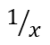

## **ภาพรวม**

PowerPoint จัดเก็บสมการเป็น Office Math Markup Language (OMML). ด้วย Aspose.Slides for .NET คุณสามารถสร้างเนื้อหาคณิตศาสตร์ประเภทเดียวกันโดยเขียนโปรแกรมได้: เศษส่วน, ราก, ฟังก์ชัน, ขีดจำกัด, N-ary operators, เมทริกซ์, อาเรย์, และบล็อกคณิตศาสตร์ที่จัดรูปแบบ

ใน PowerPoint ผู้ใช้มักเพิ่มสมการจาก **Insert > Equation**:


ผลลัพธ์คือข้อความคณิตศาสตร์ที่แก้ไขได้บนสไลด์:


Aspose.Slides สร้างข้อความคณิตศาสตร์นั้นผ่านวัตถุหลักสามประเภท:

- รูปคณิตศาสตร์ที่สร้างด้วย [AddMathShape](https://reference.aspose.com/slides/th/net/aspose.slides/ishapecollection/addmathshape/) เป็นรูปที่บรรจุสมการ
- [MathPortion](https://reference.aspose.com/slides/th/net/aspose.slides.mathtext/mathportion/) เก็บเนื้อหาคณิตศาสตร์ภายในกรอบข้อความของรูป
- [MathParagraph](https://reference.aspose.com/slides/th/net/aspose.slides.mathtext/mathparagraph/) มีหนึ่งหรือหลายวัตถุ [MathBlock](https://reference.aspose.com/slides/th/net/aspose.slides.mathtext/mathblock/)

ตัวอย่างส่วนใหญ่ด้านล่างใช้ [MathematicalText](https://reference.aspose.com/slides/th/net/aspose.slides.mathtext/mathematicaltext/) และวิธีเชิงสไลด์จาก [IMathElement](https://reference.aspose.com/slides/th/net/aspose.slides.mathtext/imathelement/) เพื่อให้โค้ดสั้นและอ่านง่าย

สำหรับสถานการณ์การส่งออก MathML ดูที่ [Export Math Equations from Presentations in .NET](/slides/th/net/exporting-math-equations/)

## **สร้างสมการ**

ตัวอย่างนี้สร้างรูปคณิตศาสตร์และเพิ่มทฤษฎีพีทาโกรัส:


```csharp
using var presentation = new Presentation();
var slide = presentation.Slides[0];

var mathShape = slide.Shapes.AddMathShape(20, 20, 700, 120);
var mathParagraph = ((MathPortion)mathShape.TextFrame.Paragraphs[0].Portions[0]).MathParagraph;

var equation = new MathematicalText("c")
    .SetSuperscript("2")
    .Join("=")
    .Join(new MathematicalText("a").SetSuperscript("2"))
    .Join("+")
    .Join(new MathematicalText("b").SetSuperscript("2"));

mathParagraph.Add(equation);

presentation.Save("pythagorean-theorem.pptx", SaveFormat.Pptx);
```

{}
`AddMathShape` creates a shape that already contains a math paragraph. Access the first `MathPortion`, get its `MathParagraph`, and add math blocks or math elements to it.
{}

## **เพิ่มเศษส่วน**

ใช้ `Divide` เพื่อสร้างเศษส่วน คุณสามารถเลือกสไตล์ของเศษส่วนได้ด้วย [MathFractionTypes](https://reference.aspose.com/slides/th/net/aspose.slides.mathtext/mathfractiontypes/)



```csharp
using var presentation = new Presentation();
var slide = presentation.Slides[0];

var mathShape = slide.Shapes.AddMathShape(20, 20, 700, 100);
var mathParagraph = ((MathPortion)mathShape.TextFrame.Paragraphs[0].Portions[0]).MathParagraph;

var fraction = new MathematicalText("1")
    .Divide("x", MathFractionTypes.Skewed);

mathParagraph.Add(new MathBlock(fraction));

presentation.Save("fraction.pptx", SaveFormat.Pptx);
```

สำหรับเศษส่วนแบบซ้อนกัน ใช้ `MathFractionTypes.Bar`:

```csharp
var stackedFraction = new MathematicalText("x + 1").Divide("y - 1", MathFractionTypes.Bar);
```

## **เพิ่มราก**

ใช้ `Radical` เพื่อสร้างรากกำลังสอง, รากกำลังสาม หรือรากอื่น ๆ องค์ประกอบปัจจุบันจะเป็นฐานและอาร์กิวเมนต์จะเป็นดีกรี


```csharp
using var presentation = new Presentation();
var slide = presentation.Slides[0];

var mathShape = slide.Shapes.AddMathShape(20, 20, 700, 100);
var mathParagraph = ((MathPortion)mathShape.TextFrame.Paragraphs[0].Portions[0]).MathParagraph;

var radical = new MathematicalText("x")
    .Radical("n");

mathParagraph.Add(new MathBlock(radical));

presentation.Save("radical.pptx", SaveFormat.Pptx);
```

## **เพิ่มฟังก์ชันและขีดจำกัด**

ใช้ `AsArgumentOfFunction` หรือ `Function` สำหรับฟังก์ชันเช่น `sin(x)`, `log(x)` หรือชื่อฟังก์ชันแบบกำหนดเอง สำหรับขีดจำกัด ให้ใส่ `lim` ลงใน [MathLimit](https://reference.aspose.com/slides/th/net/aspose.slides.mathtext/mathlimit/) หรือใช้ `SetLowerLimit`


```csharp
using var presentation = new Presentation();
var slide = presentation.Slides[0];

var mathShape = slide.Shapes.AddMathShape(20, 20, 700, 100);
var mathParagraph = ((MathPortion)mathShape.TextFrame.Paragraphs[0].Portions[0]).MathParagraph;

var limit = new MathematicalText("lim")
    .SetLowerLimit("x→∞")
    .Function("x");

mathParagraph.Add(new MathBlock(limit));

presentation.Save("functions-and-limits.pptx", SaveFormat.Pptx);
```

สำหรับชื่อฟังก์ชันแบบกำหนดเอง ให้ตั้งชื่อฟังก์ชันเป็นองค์ประกอบปัจจุบัน:

```csharp
var customFunction = new MathematicalText("f").Function("x + 1");
```

## **เพิ่ม N-ary Operators และ Integral**

ใช้ `Nary` สำหรับการบวกรวม, ยูเนียน, อินเตอร์เซกชัน และตัวดำเนินการขนาดใหญ่อื่น ๆ ใช้ `Integral` สำหรับอินtegral ทั้งสองวิธีให้คุณตั้งค่าขีดจำกัดล่างและบน


```csharp
using var presentation = new Presentation();
var slide = presentation.Slides[0];

var mathShape = slide.Shapes.AddMathShape(20, 20, 700, 120);
var mathParagraph = ((MathPortion)mathShape.TextFrame.Paragraphs[0].Portions[0]).MathParagraph;

var summationBase = new MathematicalText("x")
    .SetSuperscript("k")
    .Join(new MathematicalText("a").SetSuperscript("n-k"));

var summation = summationBase.Nary(MathNaryOperatorTypes.Summation, "k=0", "n");

mathParagraph.Add(new MathBlock(summation));

presentation.Save("nary-operators.pptx", SaveFormat.Pptx);
```

N-ary operators ใช้สำหรับตัวดำเนินการใหญ่ที่อาจมีขีดจำกัด ตัวดำเนินการง่ายเช่น `+`, `-`, และ `=` มักจะเพิ่มเป็น `MathematicalText` แล้วเชื่อมต่อเข้าในนิพจน์

สำหรับอินtegral ให้ใช้ `Integral`:

```csharp
var integralBase = new MathematicalText("x").Join(new MathematicalText("dx").ToBox());
var integral = integralBase.Integral(MathIntegralTypes.Simple, "0", "1");
```

## **เพิ่มเมทริกซ์**

ใช้ [MathMatrix](https://reference.aspose.com/slides/th/net/aspose.slides.mathtext/mathmatrix/) สำหรับแถวและคอลัมน์ เมทริกซ์โดยปกติจะไม่มีวงเล็บ ดังนั้นให้ใส่วงเล็บ, กำลังวงเหลี่ยม หรือวงโค้งเมื่อต้องการ


```csharp
using var presentation = new Presentation();
var slide = presentation.Slides[0];

var mathShape = slide.Shapes.AddMathShape(20, 20, 700, 120);
var mathParagraph = ((MathPortion)mathShape.TextFrame.Paragraphs[0].Portions[0]).MathParagraph;

var matrix = new MathMatrix(2, 3);
matrix[0, 0] = new MathematicalText("1");
matrix[0, 1] = new MathematicalText("x");
matrix[1, 0] = new MathematicalText("x");
matrix[1, 1] = new MathematicalText("2");
matrix[1, 2] = new MathematicalText("y");

mathParagraph.Add(new MathBlock(matrix));

presentation.Save("matrix.pptx", SaveFormat.Pptx);
```

## **เพิ่มอาเรย์สมการ**

ใช้ `ToMathArray` เมื่อคุณต้องการสมการที่จัดตำแหน่งหรือเรียงต่อกันเป็นแนวตั้ง


```csharp
using var presentation = new Presentation();
var slide = presentation.Slides[0];

var mathShape = slide.Shapes.AddMathShape(20, 20, 700, 140);
var mathParagraph = ((MathPortion)mathShape.TextFrame.Paragraphs[0].Portions[0]).MathParagraph;

var equationArray = new MathematicalText("x")
    .Join("y")
    .ToMathArray();

mathParagraph.Add(new MathBlock(equationArray));

presentation.Save("equation-array.pptx", SaveFormat.Pptx);
```

## **เพิ่มฟังก์ชันตรีโกณมิติ**

ใช้ `AsArgumentOfFunction` เมื่ออาร์กิวเมนต์เป็นองค์ประกอบปัจจุบันและชื่อฟังก์ชันเป็นที่ทราบ


```csharp
using var presentation = new Presentation();
var slide = presentation.Slides[0];

var mathShape = slide.Shapes.AddMathShape(20, 20, 700, 100);
var mathParagraph = ((MathPortion)mathShape.TextFrame.Paragraphs[0].Portions[0]).MathParagraph;

var cosine = new MathematicalText("2x")
    .AsArgumentOfFunction(MathFunctionsOfOneArgument.Cos);

mathParagraph.Add(new MathBlock(cosine));

presentation.Save("trigonometric-function.pptx", SaveFormat.Pptx);
```

## **เพิ่มตัวห้อยและตัวตั้ง**

ใช้ตัวช่วยสำหรับตัวห้อยและตัวตั้งเพื่อทำดัชนีและกำลัง เมื่อดัชนีต้องแสดงทางด้านซ้ายของฐาน ให้ใช้ `SetSubSuperscriptOnTheLeft`


```csharp
using var presentation = new Presentation();
var slide = presentation.Slides[0];

var mathShape = slide.Shapes.AddMathShape(20, 20, 700, 100);
var mathParagraph = ((MathPortion)mathShape.TextFrame.Paragraphs[0].Portions[0]).MathParagraph;

var scripts = new MathematicalText("Y")
    .SetSubSuperscriptOnTheLeft("1", "n");

mathParagraph.Add(new MathBlock(scripts));

presentation.Save("subscript-superscript.pptx", SaveFormat.Pptx);
```

## **เพิ่มตัวคั่น**

ใช้ `Enclose` เพื่อใส่นิพจน์ไว้ในตัวคั่น คุณยังสามารถตั้งค่าตัวอักษรคั่นสำหรับนิพจน์ที่มีหลายองค์ประกอบได้


```csharp
using var presentation = new Presentation();
var slide = presentation.Slides[0];

var mathShape = slide.Shapes.AddMathShape(20, 20, 700, 100);
var mathParagraph = ((MathPortion)mathShape.TextFrame.Paragraphs[0].Portions[0]).MathParagraph;

var delimiter = new MathematicalText("x")
    .Join("y")
    .Join("z")
    .Enclose('<', '>');
delimiter.SeparatorCharacter = '|';

mathParagraph.Add(new MathBlock(delimiter));

presentation.Save("delimiters.pptx", SaveFormat.Pptx);
```

## **เพิ่มกล่องกรอบ**

ใช้ `ToBorderBox` เมื่อสมการเองควรมีกรอบ


```csharp
using var presentation = new Presentation();
var slide = presentation.Slides[0];

var mathShape = slide.Shapes.AddMathShape(20, 20, 700, 100);
var mathParagraph = ((MathPortion)mathShape.TextFrame.Paragraphs[0].Portions[0]).MathParagraph;

var boxedEquation = new MathematicalText("a")
    .SetSuperscript("2")
    .Join("=")
    .Join(new MathematicalText("b").SetSuperscript("2"))
    .Join("+")
    .Join(new MathematicalText("c").SetSuperscript("2"))
    .ToBorderBox();

mathParagraph.Add(new MathBlock(boxedEquation));

presentation.Save("border-box.pptx", SaveFormat.Pptx);
```

## **จัดกลุ่มเทิร์ม**

ใช้ `Group` เพื่อวางอักขระจัดกลุ่มเหนือหรือใต้นิพจน์ เพิ่มขีดจำกัดเพื่อทำป้ายกำกับให้กับเทิร์มที่จัดกลุ่ม


```csharp
using var presentation = new Presentation();
var slide = presentation.Slides[0];

var mathShape = slide.Shapes.AddMathShape(20, 20, 700, 120);
var mathParagraph = ((MathPortion)mathShape.TextFrame.Paragraphs[0].Portions[0]).MathParagraph;

var grouped = new MathematicalText("x + y")
    .Group('\u23DF', MathTopBotPositions.Bottom, MathTopBotPositions.Top)
    .SetLowerLimit("any text");

mathParagraph.Add(new MathBlock(grouped));

presentation.Save("grouped-terms.pptx", SaveFormat.Pptx);
```

## **จัดรูปแบบองค์ประกอบคณิตศาสตร์**

ใช้ตัวช่วยจัดรูปแบบเฉพาะเมื่อช่วยให้สูตรชัดเจน ตัวอย่างเช่น `Overbar` จะวางเส้นขีดเหนือองค์ประกอบคณิตศาสตร์


```csharp
using var presentation = new Presentation();
var slide = presentation.Slides[0];

var mathShape = slide.Shapes.AddMathShape(20, 20, 700, 100);
var mathParagraph = ((MathPortion)mathShape.TextFrame.Paragraphs[0].Portions[0]).MathParagraph;

var overbar = new MathematicalText("ABC").Overbar();

mathParagraph.Add(new MathBlock(overbar));

presentation.Save("overbar.pptx", SaveFormat.Pptx);
```

## **อ้างอิงอย่างรวดเร็ว**

| งาน | API หลัก |
| --- | --- |
| สร้างข้อความคณิตศาสตร์ | [MathematicalText](https://reference.aspose.com/slides/th/net/aspose.slides.mathtext/mathematicaltext/) |
| รวมองค์ประกอบ | [IMathElement.Join](https://reference.aspose.com/slides/th/net/aspose.slides.mathtext/imathelement/join/) |
| สร้างเศษส่วน | [IMathElement.Divide](https://reference.aspose.com/slides/th/net/aspose.slides.mathtext/imathelement/divide/) |
| เพิ่มตัวยกกำลังหรือห้อย | [SetSuperscript](https://reference.aspose.com/slides/th/net/aspose.slides.mathtext/imathelement/setsuperscript/), [SetSubscript](https://reference.aspose.com/slides/th/net/aspose.slides.mathtext/imathelement/setsubscript/) |
| เพิ่มฟังก์ชัน | [Function](https://reference.aspose.com/slides/th/net/aspose.slides.mathtext/imathelement/function/), [AsArgumentOfFunction](https://reference.aspose.com/slides/th/net/aspose.slides.mathtext/imathelement/asargumentoffunction/) |
| เพิ่มราก | [IMathElement.Radical](https://reference.aspose.com/slides/th/net/aspose.slides.mathtext/imathelement/radical/) |
| เพิ่มขีดจำกัด | [SetLowerLimit](https://reference.aspose.com/slides/th/net/aspose.slides.mathtext/imathelement/setlowerlimit/), [SetUpperLimit](https://reference.aspose.com/slides/th/net/aspose.slides.mathtext/imathelement/setupperlimit/) |
| เพิ่มสคริปต์ด้านซ้าย | [SetSubSuperscriptOnTheLeft](https://reference.aspose.com/slides/th/net/aspose.slides.mathtext/imathelement/setsubsuperscriptontheleft/) |
| เพิ่มการบวกรวมและอินtegral | [Nary](https://reference.aspose.com/slides/th/net/aspose.slides.mathtext/imathelement/nary/), [Integral](https://reference.aspose.com/slides/th/net/aspose.slides.mathtext/imathelement/integral/) |
| เพิ่มเมทริกซ์ | [MathMatrix](https://reference.aspose.com/slides/th/net/aspose.slides.mathtext/mathmatrix/) |
| เพิ่มอาเรย์สมการ | [ToMathArray](https://reference.aspose.com/slides/th/net/aspose.slides.mathtext/imathelement/tomatharray/) |
| เพิ่มตัวคั่น | [Enclose](https://reference.aspose.com/slides/th/net/aspose.slides.mathtext/imathelement/enclose/) |
| เพิ่มเส้นขีดและกรอบ | [Overbar](https://reference.aspose.com/slides/th/net/aspose.slides.mathtext/imathelement/overbar/), [ToBorderBox](https://reference.aspose.com/slides/th/net/aspose.slides.mathtext/imathelement/toborderbox/) |
| จัดกลุ่มเทิร์ม | [Group](https://reference.aspose.com/slides/th/net/aspose.slides.mathtext/imathelement/group/) |

## **คำถามที่พบบ่อย**

**ฉันสามารถแก้ไขสมการ PowerPoint ที่มีอยู่ได้หรือไม่?**

ได้. เปิดงานนำเสนอ, ค้นหารูปที่บรรจุ `MathPortion`, ดึง `MathParagraph` ของมัน, แล้วอัปเดตบล็อกคณิตศาสตร์ในย่อหน้านั้น

**สมการถูกบันทึกเป็นคณิตศาสตร์ PowerPoint ที่แก้ไขได้หรือไม่?**

ได้. เมื่อบันทึกเป็น PPTX, Aspose.Slides จะเขียนสมการเป็นเนื้อหา Office Math ที่แก้ไขได้

**ฉันสามารถส่งออกสมการเป็น LaTeX ได้หรือไม่?**

Aspose.Slides ส่งออกสมการคณิตศาสตร์เป็น MathML. หากต้องการ LaTeX ให้ส่งออกเป็น MathML ก่อน แล้วแปลง MathML ด้วยเครื่องมือที่รองรับรูปแบบ LaTeX ที่คุณต้องการ