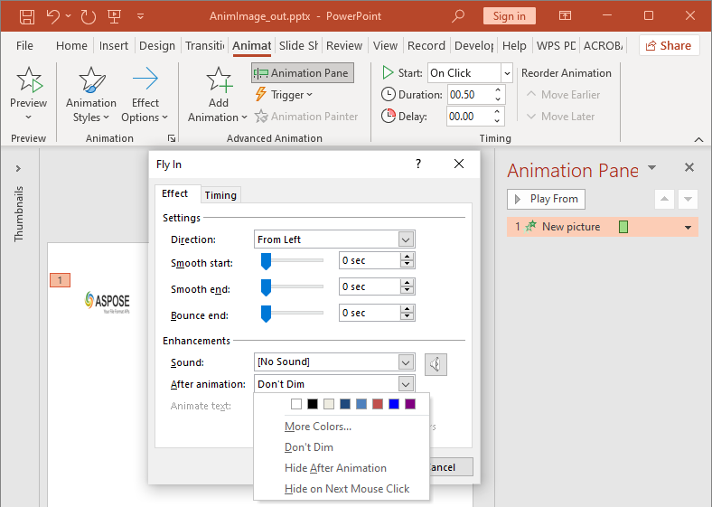

## **ภาพรวม**

Aspose.Slides for .NET จะเป็นตัวแทนการเคลื่อนไหวของสไลด์เป็นเอฟเฟกต์ในไทม์ไลน์ของสไลด์ เอฟเฟกต์จะมีรูปทรงเป้าหมาย ประเภทและชนิดย่อยของการเคลื่อนไหว ตัวกระตุ้น การตั้งค่าเวลา และคุณสมบัติเสริมเช่น เสียงหรือพฤติกรรมหลังการเคลื่อนไหว

ไทม์ไลน์ประกอบด้วยลำดับสองประเภท:

- **ลำดับหลัก** เล่นเมื่อสไลด์ก้าวหน้า
- **ลำดับเชิงโต้ตอบ** เริ่มเมื่อรูปทรงตัวกระตุ้นถูกคลิก

เนื่องจากกล่องข้อความ รูปภาพ แผนภูมิ ตาราง และวัตถุสไลด์อื่น ๆ ทำงานตาม [IShape](https://reference.aspose.com/slides/th/net/aspose.slides/ishape/) คุณจึงใช้เมธอดเดียวกัน [ISequence.AddEffect](https://reference.aspose.com/slides/th/net/aspose.slides.animation/isequence/addeffect/) สำหรับเนื้อหาสไลด์ส่วนใหญ่ เอฟเฟกต์ที่ใช้ได้จะถูกระบุไว้ใน enumeration [EffectType](https://reference.aspose.com/slides/th/net/aspose.slides.animation/effecttype/)

## **เพิ่มการเคลื่อนไหวให้รูปทรง**

เพื่อเพิ่มการเคลื่อนไหว ให้ดึงลำดับหลักของสไลด์และเรียก [ISequence.AddEffect](https://reference.aspose.com/slides/th/net/aspose.slides.animation/isequence/addeffect/) พร้อมกับรูปทรงเป้าหมาย ประเภทเอฟเฟกต์ ชนิดย่อย และตัวกระตุ้น สำหรับเอฟเฟกต์ที่เริ่มเมื่อรูปทรงอื่นถูกคลิก ให้สร้างลำดับเชิงโต้ตอบที่ตัวกระตุ้นคือรูปทรงนั้น

ตัวอย่างต่อไปนี้สร้างการเคลื่อนไหวทั้งสองประเภทและบันทึกผลลัพธ์เป็น `shape-animations.pptx`

```csharp
using Aspose.Slides;
using Aspose.Slides.Animation;
using Aspose.Slides.Export;

using var presentation = new Presentation();
var slide = presentation.Slides[0];

var targetShape = slide.Shapes.AddAutoShape(ShapeType.RoundCornerRectangle, 120, 100, 320, 80);
targetShape.TextFrame.Text = "Click to animate this shape";

var mainSequence = slide.Timeline.MainSequence;
var entranceEffect = mainSequence.AddEffect(targetShape, EffectType.Fade, EffectSubtype.None, EffectTriggerType.OnClick);
entranceEffect.Timing.Duration = 1.5f;

var triggerShape = slide.Shapes.AddAutoShape(ShapeType.Bevel, 20, 20, 100, 40);
triggerShape.TextFrame.Text = "Move";

var interactiveSequence = slide.Timeline.InteractiveSequences.Add(triggerShape);
interactiveSequence.AddEffect(targetShape, EffectType.PathFootball, EffectSubtype.None, EffectTriggerType.OnClick);

presentation.Save("shape-animations.pptx", SaveFormat.Pptx);
```

ตัวกระตุ้นกำหนดว่าเอฟเฟกต์จะเริ่มเมื่อใด:

- [EffectTriggerType.OnClick](https://reference.aspose.com/slides/th/net/aspose.slides.animation/effecttriggertype/) รอการคลิกในลำดับหลักหรือการคลิกบนรูปทรงตัวกระตุ้นในลำดับเชิงโต้ตอบ
- [EffectTriggerType.WithPrevious](https://reference.aspose.com/slides/th/net/aspose.slides.animation/effecttriggertype/) เริ่มพร้อมกับเอฟเฟกต์ก่อนหน้า
- [EffectTriggerType.AfterPrevious](https://reference.aspose.com/slides/th/net/aspose.slides.animation/effecttriggertype/) เริ่มเมื่อเอฟเฟกต์ก่อนหน้าจบลง

เพื่อทำให้รูปภาพ แผนภูมิ หรือรูปทรงประเภทอื่นเคลื่อนไหว ให้ส่งอ็อบเจ็กต์นั้นไปยัง [ISequence.AddEffect](https://reference.aspose.com/slides/th/net/aspose.slides.animation/isequence/addeffect/) แทน `targetShape` สำหรับตัวเลือกการจัดกลุ่มเฉพาะแผนภูมิ ดูที่ [Animated Charts](/slides/th/net/animated-charts/)

## **อ่านการเคลื่อนไหวของรูปทรง**

ใช้ [ISequence.GetEffectsByShape](https://reference.aspose.com/slides/th/net/aspose.slides.animation/isequence/geteffectsbyshape/) เมื่อคุณทราบรูปทรงเป้าหมาย เพื่อตรวจสอบทุกเอฟเฟกต์ให้วนลูปลำดับหลักและลำดับเชิงโต้ตอบทั้งหมด การวนลูปช่วยหลีกเลี่ยงการสมมติว่าลำดับมีเอฟเฟกต์ที่ดัชนี `0`

ตัวอย่างต่อไปนี้สร้างรูปทรงที่มีเอฟเฟกต์ในลำดับหลักและเชิงโต้ตอบ ดึงเอฟเฟกต์ที่เป้าหมายเป็นรูปทรงนั้น แล้วจึงวนลูปรวมทุกลำดับบนสไลด์

```csharp
using System;
using Aspose.Slides;
using Aspose.Slides.Animation;

using var presentation = new Presentation();
var slide = presentation.Slides[0];
var targetShape = slide.Shapes.AddAutoShape(ShapeType.Rectangle, 120, 100, 320, 80);
targetShape.TextFrame.Text = "Animated shape";

var mainSequence = slide.Timeline.MainSequence;
mainSequence.AddEffect(targetShape, EffectType.Fade, EffectSubtype.None, EffectTriggerType.OnClick);

var triggerShape = slide.Shapes.AddAutoShape(ShapeType.Bevel, 20, 20, 100, 40);
triggerShape.TextFrame.Text = "Move";

var interactiveSequence = slide.Timeline.InteractiveSequences.Add(triggerShape);
interactiveSequence.AddEffect(targetShape, EffectType.PathFootball, EffectSubtype.None, EffectTriggerType.OnClick);

var targetEffects = mainSequence.GetEffectsByShape(targetShape);
Console.WriteLine($"The main sequence contains {targetEffects.Length} effect(s) for {targetShape.Name}.");

PrintSequence("Main sequence", mainSequence);

var interactiveIndex = 1;
foreach (var sequence in slide.Timeline.InteractiveSequences)
{
    var triggerName = sequence.TriggerShape == null ? "unknown" : sequence.TriggerShape.Name;
    var sequenceLabel = $"Interactive sequence {interactiveIndex}, trigger: {triggerName}";
    PrintSequence(sequenceLabel, sequence);
    interactiveIndex++;
}

static void PrintSequence(string label, ISequence sequence)
{
    Console.WriteLine($"  {label}: {sequence.Count} effect(s)");

    foreach (var effect in sequence)
    {
        var targetName = effect.TargetShape == null ? "unknown" : effect.TargetShape.Name;
        var effectDescription = $"{effect.Type} {effect.Subtype}; target: {targetName}; trigger: {effect.Timing.TriggerType}";
        Console.WriteLine($"    {effectDescription}");
    }
}
```

หากคุณต้องการเอฟเฟกต์เฉพาะรูปทรงเดียว ให้ระบุตัวรูปทรงด้วยชื่อ ประเภท placeholder หรือคุณสมบัติคงที่อื่น ๆ แล้วเรียก [ISequence.GetEffectsByShape](https://reference.aspose.com/slides/th/net/aspose.slides.animation/isequence/geteffectsbyshape/) อย่าโดยสมมติว่า [IShapeCollection.Item](https://reference.aspose.com/slides/th/net/aspose.slides/ishapecollection/item/) ที่ดัชนี `0` คือออบเจ็กต์ที่ต้องการเสมอ

## **ทำงานกับเอฟเฟกต์ Placeholder ที่สืบทอด**

Placeholder บนสไลด์ปกติสามารถสืบทอดพฤติกรรมการเคลื่อนไหวจาก placeholder ที่สอดคล้องบนสไลด์เลย์เอาต์และมาสเตอร์ได้ [IShape.GetBasePlaceholder](https://reference.aspose.com/slides/th/net/aspose.slides/ishape/getbaseplaceholder/) คืนค่า placeholder พ่อแม่ หรือ `null` ถ้าไม่มีพ่อแม่

ในตัวอย่างงานนำเสนอต่อไปนี้ ส่วนท้าย (footer) มี **Random Bars** บนสไลด์ปกติ, **Split** บนสไลด์เลย์เอาต์, และ **Fly In** บนสไลด์มาสเตอร์


ตัวอย่างต่อไปสร้างลำดับชั้นของ placeholder เอง โดยเพิ่มเอฟเฟกต์ให้กับ placeholder ของมาสเตอร์, placeholder ของเลย์เอาต์, และ placeholder ที่สอดคล้องบนสไลด์ปกติ ทุกครั้งที่เรียก [IShape.GetBasePlaceholder](https://reference.aspose.com/slides/th/net/aspose.slides/ishape/getbaseplaceholder/) จะตรวจสอบว่าคืนค่า shape หรือไม่ก่อนใช้งาน

```csharp
using System;
using Aspose.Slides;
using Aspose.Slides.Animation;
using Aspose.Slides.Export;

using var presentation = new Presentation();
var layoutSlide = presentation.LayoutSlides.GetByType(SlideLayoutType.Blank);
var layoutPlaceholder = layoutSlide.PlaceholderManager.AddTextPlaceholder(100, 100, 400, 80);
layoutSlide.Timeline.MainSequence.AddEffect(layoutPlaceholder, EffectType.Split, EffectSubtype.VerticalIn, EffectTriggerType.OnClick);

var masterPlaceholder = layoutPlaceholder.GetBasePlaceholder();
if (masterPlaceholder != null)
{
    var masterSequence = layoutSlide.MasterSlide.Timeline.MainSequence;
    masterSequence.AddEffect(masterPlaceholder, EffectType.Fly, EffectSubtype.Bottom, EffectTriggerType.OnClick);
}

var slide = presentation.Slides.AddEmptySlide(layoutSlide);
var slidePlaceholder = FindPlaceholderWithBase(slide);

if (slidePlaceholder == null)
{
    throw new InvalidOperationException("The slide does not contain a placeholder linked to its layout slide.");
}

slide.Timeline.MainSequence.AddEffect(slidePlaceholder, EffectType.RandomBars, EffectSubtype.Horizontal, EffectTriggerType.OnClick);
PrintEffects("Normal slide", slide.Timeline.MainSequence.GetEffectsByShape(slidePlaceholder));

var baseLayoutPlaceholder = slidePlaceholder.GetBasePlaceholder();
if (baseLayoutPlaceholder != null)
{
    PrintEffects("Layout slide", layoutSlide.Timeline.MainSequence.GetEffectsByShape(baseLayoutPlaceholder));

    var baseMasterPlaceholder = baseLayoutPlaceholder.GetBasePlaceholder();
    if (baseMasterPlaceholder != null)
    {
        PrintEffects("Master slide", layoutSlide.MasterSlide.Timeline.MainSequence.GetEffectsByShape(baseMasterPlaceholder));
    }
}

presentation.Save("placeholder-animations.pptx", SaveFormat.Pptx);

static IShape FindPlaceholderWithBase(ISlide slide)
{
    foreach (var shape in slide.Shapes)
    {
        if (shape.GetBasePlaceholder() != null)
        {
            return shape;
        }
    }

    return null;
}

static void PrintEffects(string source, IEffect[] effects)
{
    Console.WriteLine($"{source}: {effects.Length} effect(s)");

    foreach (var effect in effects)
    {
        Console.WriteLine($"  {effect.Type} {effect.Subtype}");
    }
}
```

## **เปลี่ยนการตั้งค่าเวลาของการเคลื่อนไหว**

กล่องโต้ตอบ **Timing** ของ PowerPoint จะสะท้อนคุณสมบัติของ [ITiming](https://reference.aspose.com/slides/th/net/aspose.slides.animation/itiming/)


- **Start** สอดคล้องกับ [ITiming.TriggerType](https://reference.aspose.com/slides/th/net/aspose.slides.animation/itiming/triggertype/)
- **Duration** สอดคล้องกับ [ITiming.Duration](https://reference.aspose.com/slides/th/net/aspose.slides.animation/itiming/duration/) หน่วยเป็นวินาที
- **Delay** สอดคล้องกับ [ITiming.TriggerDelayTime](https://reference.aspose.com/slides/th/net/aspose.slides.animation/itiming/triggerdelaytime/) หน่วยเป็นวินาที
- **Repeat** สอดคล้องกับ [ITiming.RepeatCount](https://reference.aspose.com/slides/th/net/aspose.slides.animation/itiming/repeatcount/), [ITiming.RepeatUntilNextClick](https://reference.aspose.com/slides/th/net/aspose.slides.animation/itiming/repeatuntilnextclick/), หรือ [ITiming.RepeatUntilEndSlide](https://reference.aspose.com/slides/th/net/aspose.slides.animation/itiming/repeatuntilendslide/)
- **Rewind when done playing** สอดคล้องกับ [ITiming.Rewind](https://reference.aspose.com/slides/th/net/aspose.slides.animation/itiming/rewind/)

ตัวอย่างอิสระนี้เพิ่มเอฟเฟกต์ ปรับเวลาผ่านออบเจ็กต์ที่คืนมาจาก [ISequence.AddEffect](https://reference.aspose.com/slides/th/net/aspose.slides.animation/isequence/addeffect/) และบันทึกผลลัพธ์ การเก็บอ้างอิงถึง [IEffect](https://reference.aspose.com/slides/th/net/aspose.slides.animation/ieffect/) ที่คืนมาช่วยหลีกเลี่ยงการอ้างอิงดัชนีคอลเลกชันที่ไม่จำเป็น

```csharp
using Aspose.Slides;
using Aspose.Slides.Animation;
using Aspose.Slides.Export;

using var presentation = new Presentation();
var slide = presentation.Slides[0];
var shape = slide.Shapes.AddAutoShape(ShapeType.Rectangle, 120, 100, 320, 80);
shape.TextFrame.Text = "Timed animation";

var effect = slide.Timeline.MainSequence.AddEffect(shape, EffectType.Fade, EffectSubtype.None, EffectTriggerType.OnClick);
effect.Timing.TriggerType = EffectTriggerType.OnClick;
effect.Timing.Duration = 2.0f;
effect.Timing.TriggerDelayTime = 0.5f;
effect.Timing.RepeatUntilNextClick = false;
effect.Timing.RepeatUntilEndSlide = false;
effect.Timing.RepeatCount = 2.0f;
effect.Timing.Rewind = true;

presentation.Save("shape-animation-timing.pptx", SaveFormat.Pptx);
```

ใช้โหมดการทำซ้ำแบบใดแบบหนึ่งเท่านั้น การผสานจำนวนครั้งกับแฟล็ก “until” อาจทำให้ผลลัพธ์สับสนในตัวแสดงผลต่าง ๆ เมื่อตั้งค่าโหมดทำซ้ำ ให้ตั้งค่า [ITiming.RepeatUntilNextClick](https://reference.aspose.com/slides/th/net/aspose.slides.animation/itiming/repeatuntilnextclick/) และ [ITiming.RepeatUntilEndSlide](https://reference.aspose.com/slides/th/net/aspose.slides.animation/itiming/repeatuntilendslide/) ก่อน [ITiming.RepeatCount](https://reference.aspose.com/slides/th/net/aspose.slides.animation/itiming/repeatcount/) เนื่องจากการตั้งค่าแฟล็กใดแฟล็กหนึ่งจะเปลี่ยนโหมดทำซ้ำที่ทำงานอยู่

## **เพิ่มและสกัดเสียงการเคลื่อนไหว**

เอฟเฟกต์การเคลื่อนไหวสามารถอ้างอิงไฟล์เสียงที่ฝังไว้ผ่าน [IEffect.Sound](https://reference.aspose.com/slides/th/net/aspose.slides.animation/ieffect/sound/) [IEffect.StopPreviousSound](https://reference.aspose.com/slides/th/net/aspose.slides.animation/ieffect/stopprevioussound/) บอกให้เอฟเฟกต์หยุดเสียงที่เริ่มโดยเอฟเฟกต์ก่อนหน้า

### **เพิ่มเสียงให้กับเอฟเฟกต์**

ตัวอย่างต่อไปนี้คาดว่าไฟล์เสียงโลคัลชื่อ `animation-sound.wav` จะสร้างเอฟเฟกต์สองรายการ ฝังไฟล์นั้นเป็นเสียงของเอฟเฟกต์แรก และตั้งค่าให้เอฟเฟกต์ที่สองหยุดเสียง ใช้ออบเจ็กต์ที่คืนจาก [ISequence.AddEffect](https://reference.aspose.com/slides/th/net/aspose.slides.animation/isequence/addeffect/) ดังนั้นจึงไม่ต้องระบุดัชนีลำดับ

```csharp
using System.IO;
using Aspose.Slides;
using Aspose.Slides.Animation;
using Aspose.Slides.Export;

using var presentation = new Presentation();
var slide = presentation.Slides[0];
var firstShape = slide.Shapes.AddAutoShape(ShapeType.Rectangle, 80, 100, 240, 80);
var secondShape = slide.Shapes.AddAutoShape(ShapeType.Rectangle, 400, 100, 240, 80);
firstShape.TextFrame.Text = "Starts sound";
secondShape.TextFrame.Text = "Stops sound";

var sequence = slide.Timeline.MainSequence;
var firstEffect = sequence.AddEffect(firstShape, EffectType.Fade, EffectSubtype.None, EffectTriggerType.OnClick);
var secondEffect = sequence.AddEffect(secondShape, EffectType.Fade, EffectSubtype.None, EffectTriggerType.OnClick);

var audioData = File.ReadAllBytes("animation-sound.wav");
var effectSound = presentation.Audios.AddAudio(audioData);
firstEffect.Sound = effectSound;
secondEffect.StopPreviousSound = true;

presentation.Save("shape-animation-sound.pptx", SaveFormat.Pptx);
```

### **สกัดเสียงที่ฝังอยู่ในเอฟเฟกต์**

ตัวอย่างต่อไปนี้คาดว่าไฟล์งานนำเสนอโลคัลชื่อ `presentation-with-animation-sounds.pptx` จะสแกนทั้งลำดับหลักและเชิงโต้ตอบและเขียนเสียงเอฟเฟกต์ที่ฝังไว้ทั้งหมดไปยังไดเรกทอรี `extracted-animation-sounds` ส่วนขยายไฟล์จะเลือกจาก MIME type ของเสียงที่เปิดเผยโดย [IAudio.ContentType](https://reference.aspose.com/slides/th/net/aspose.slides/iaudio/contenttype/)

```csharp
using System;
using System.IO;
using Aspose.Slides;
using Aspose.Slides.Animation;

var inputPath = "presentation-with-animation-sounds.pptx";
var outputDirectory = "extracted-animation-sounds";

Directory.CreateDirectory(outputDirectory);

using var presentation = new Presentation(inputPath);
var soundIndex = 1;

foreach (var slide in presentation.Slides)
{
    SaveSounds(slide.Timeline.MainSequence, outputDirectory, ref soundIndex);

    foreach (var sequence in slide.Timeline.InteractiveSequences)
    {
        SaveSounds(sequence, outputDirectory, ref soundIndex);
    }
}

Console.WriteLine($"Extracted {soundIndex - 1} sound file(s) to {Path.GetFullPath(outputDirectory)}.");

static void SaveSounds(ISequence sequence, string outputDirectory, ref int soundIndex)
{
    foreach (var effect in sequence)
    {
        if (effect.Sound == null)
            continue;

        var extension = GetAudioExtension(effect.Sound.ContentType);
        var outputPath = Path.Combine(outputDirectory, $"effect-sound-{soundIndex}{extension}");
        File.WriteAllBytes(outputPath, effect.Sound.BinaryData);
        soundIndex++;
    }
}

static string GetAudioExtension(string contentType)
{
    var normalizedType = contentType == null ? string.Empty : contentType.ToLowerInvariant();

    if (normalizedType == "audio/mpeg")
        return ".mp3";

    if (normalizedType == "audio/mp4")
        return ".m4a";

    if (normalizedType == "audio/ogg")
        return ".ogg";

    if (normalizedType == "audio/wav" || normalizedType == "audio/x-wav")
        return ".wav";

    return ".bin";
}
```

สำหรับออบเจ็กต์เสียงขนาดใหญ่ ให้ใช้ [IAudio.GetStream](https://reference.aspose.com/slides/th/net/aspose.slides/iaudio/getstream/) แล้วคัดลอกสตรีมไปยังไฟล์แทนการโหลดออบเจ็กต์ทั้งหมดเข้าอาเรย์ไบต์

## **กำหนดพฤติกรรมหลังการเคลื่อนไหว**

ตัวเลือก **After animation** ควบคุมสิ่งที่เกิดขึ้นกับรูปทรงหลังจากเอฟเฟกต์เสร็จสิ้น



enumeration [AfterAnimationType](https://reference.aspose.com/slides/th/net/aspose.slides.animation/afteranimationtype/) รองรับการคงรูปทรงไว้ไม่เปลี่ยน, การเปลี่ยนสี, การซ่อนหลังการเคลื่อนไหว, หรือการซ่อนเมื่อคลิกครั้งถัดไป เมื่อชนิดเป็น [AfterAnimationType.Color](https://reference.aspose.com/slides/th/net/aspose.slides.animation/afteranimationtype/) ให้ตั้งค่า [IEffect.AfterAnimationColor](https://reference.aspose.com/slides/th/net/aspose.slides.animation/ieffect/afteranimationcolor/) ด้วย

ตัวอย่างอิสระนี้สร้างเอฟเฟกต์ ตั้งค่าพฤติกรรมหลังการเคลื่อนไหวผ่านออบเจ็กต์เอฟเฟกต์ที่คืนมา และบันทึกผลลัพธ์

```csharp
using System.Drawing;
using Aspose.Slides;
using Aspose.Slides.Animation;
using Aspose.Slides.Export;

using var presentation = new Presentation();
var slide = presentation.Slides[0];
var shape = slide.Shapes.AddAutoShape(ShapeType.Rectangle, 120, 100, 320, 80);
shape.TextFrame.Text = "Dim after animation";

var effect = slide.Timeline.MainSequence.AddEffect(shape, EffectType.Fade, EffectSubtype.None, EffectTriggerType.OnClick);
effect.AfterAnimationType = AfterAnimationType.Color;
effect.AfterAnimationColor.Color = Color.LightGray;

presentation.Save("shape-animation-after-effect.pptx", SaveFormat.Pptx);
```

การเปลี่ยนชนิดจาก [AfterAnimationType.Color](https://reference.aspose.com/slides/th/net/aspose.slides.animation/afteranimationtype/) จะล้างการตั้งค่าสีหลังการเคลื่อนไหว

## **เคลื่อนไหวข้อความ**

การเคลื่อนไหวข้อความมีการควบคุมสองส่วนที่เกี่ยวข้อง:

- [ITextAnimation.BuildType](https://reference.aspose.com/slides/th/net/aspose.slides.animation/itextanimation/buildtype/) ควบคุมว่าข้อความย่อย (paragraph) จะปรากฏพร้อมกันหรือเป็นระดับย่อย
- [IEffect.AnimateTextType](https://reference.aspose.com/slides/th/net/aspose.slides.animation/ieffect/animatetexttype/) ควบคุมว่าข้อความจะแสดงทั้งหมด, ตามคำ, หรือตามตัวอักษร [IEffect.DelayBetweenTextParts](https://reference.aspose.com/slides/th/net/aspose.slides.animation/ieffect/delaybetweentextparts/) ตั้งค่าการหน่วงระหว่างคำหรืออักษร ค่าเป็นบวกเป็นเปอร์เซ็นต์ของระยะเวลาเอฟเฟกต์; ค่าเป็นลบเป็นหน่วงเวลาเป็นวินาที

ตัวอย่างอิสระต่อไปนี้เคลื่อนไหวคำภายในกล่องข้อความ [BuildType.AsOneObject](https://reference.aspose.com/slides/th/net/aspose.slides.animation/buildtype/) ปิดการสร้างตามย่อหน้าจึงทำให้การตั้งค่าคำใช้กับกรอบข้อความทั้งหมด

```csharp
using Aspose.Slides;
using Aspose.Slides.Animation;
using Aspose.Slides.Export;

using var presentation = new Presentation();
var slide = presentation.Slides[0];
var textBox = slide.Shapes.AddAutoShape(ShapeType.Rectangle, 80, 80, 560, 100);
textBox.TextFrame.Text = "Aspose.Slides animates this sentence word by word.";

var effect = slide.Timeline.MainSequence.AddEffect(textBox, EffectType.Fade, EffectSubtype.None, EffectTriggerType.OnClick);
effect.TextAnimation.BuildType = BuildType.AsOneObject;
effect.AnimateTextType = AnimateTextType.ByWord;
effect.DelayBetweenTextParts = 20.0f;

presentation.Save("animated-text.pptx", SaveFormat.Pptx);
```

เพื่อสร้างกล่องข้อความตามย่อหน้า ให้ตั้งค่า [BuildType.ByLevelParagraphs1](https://reference.aspose.com/slides/th/net/aspose.slides.animation/buildtype/) (หรือระดับย่อหน้าอื่น) เพื่อให้เอฟเฟกต์ทำงานกับย่อหน้าเดียว ใช้ overload ของ [ISequence.AddEffect](https://reference.aspose.com/slides/th/net/aspose.slides.animation/isequence/addeffect/) ที่รับ [IParagraph](https://reference.aspose.com/slides/th/net/aspose.slides/iparagraph/) ดูที่ [Animated Text](/slides/th/net/animated-text/) สำหรับตัวอย่างระดับย่อหน้า

## **การส่งออกและบันทึกหมายเหตุความเข้ากันได้**

- การบันทึกเป็น PPT หรือ PPTX จะคงโมเดลการเคลื่อนไหวไว้ แต่การเล่นขั้นสุดท้ายขึ้นกับตัวแสดงผลของงานนำเสนอ
- PDF และรูปภาพคงที่จะไม่เล่นการเคลื่อนไหว ใช้ [HTML5 export](/slides/th/net/export-to-html5/), GIF เคลื่อนไหว, หรือ [video conversion](/slides/th/net/convert-powerpoint-to-video/) เมื่อผลลัพธ์ต้องแสดงการเคลื่อนไหว
- สำหรับ HTML5 ให้เปิดใช้งาน [Html5Options.AnimateShapes](https://reference.aspose.com/slides/th/net/aspose.slides.export/html5options/animateshapes/) และเมื่อต้องการ [Html5Options.AnimateTransitions](https://reference.aspose.com/slides/th/net/aspose.slides.export/html5options/animatetransitions/)
- การเรนเดอร์วิดีโอรองรับเอฟเฟกต์เข้า, เน้น, ออก, และเส้นทางการเคลื่อนที่หลายประเภททั่วไป แต่ไม่รองรับทุกเอฟเฟกต์ของ PowerPoint ตรวจสอบ [supported animations and effects](/slides/th/net/convert-powerpoint-to-video/#supported-animations-and-effects) ปัจจุบันและทดสอบงานนำเสนอสำคัญกับเวอร์ชัน Aspose.Slides ของคุณ
- เอฟเฟกต์ที่กำหนดเองขั้นสูงหรือเอฟเฟกต์ที่นำเข้าจากรูปแบบงานนำเสนออื่นอาจถูกเก็บไว้ในไฟล์แต่แสดงผลต่างกันใน PowerPoint, HTML5 หรือวิดีโอ ตรวจสอบผลการส่งออกแทนการพึ่งพาแค่ชื่อเอฟเฟกต์

## **FAQ**

**ทำไมการเคลื่อนไหวจึงปรากฏใน PowerPoint แต่ไม่แสดงใน PDF?**

PDF เป็นรูปแบบคงที่ ดังนั้นการเคลื่อนไหวและการเปลี่ยนสไลด์จะไม่เล่น ส่งออกเป็น HTML5, GIF เคลื่อนไหว, หรือวิดีโอเมื่อจำเป็นต้องรักษาการเคลื่อนไหว

**ทำไมเอฟเฟกต์จึงเล่นแตกต่างกันในวิดีโอ?**

การส่งออกวิดีโอเรนเดอร์การเคลื่อนไหวแทนการเก็บพฤติกรรมต้นฉบับของ PowerPoint บางเอฟเฟกต์ขั้นสูงไม่ได้รับการสนับสนุนหรือถูกประมาณค่า ตรวจสอบตารางเอฟเฟกต์ที่สนับสนุนและทดสอบงานนำเสนอจริงก่อนใช้งานจริง

**การย้ายรูปทรงไปข้างหน้า หรือหลัง จะเปลี่ยนลำดับการเคลื่อนไหวหรือไม่?**

ไม่ การจัดลำดับ z‑order ของรูปทรงควบคุมการทับซ้อน ส่วนลำดับใน timeline และตัวกระตุ้นควบคุมการเล่นการเคลื่อนไหว ปรับ timeline หากต้องการลำดับการเล่นที่ต่างออกไป