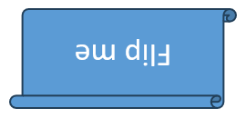

## **ภาพรวม**

Aspose.Slides for .NET แสดงรูปทรงต่าง ๆ บนสไลด์เป็น [IShapeCollection](https://reference.aspose.com/slides/th/net/aspose.slides/ishapecollection/) ที่เรียงลำดับเป็นแบบมีลำดับ. คอลเลกชันนี้เป็นทั้งที่คุณค้นหาและแก้ไขรูปทรงและเป็นแหล่งกำหนดลำดับการซ้อนกันของรูปทรง: ดัชนี `0` คือรูปทรงที่อยู่ด้านหลังสุด, ส่วนดัชนีสุดท้ายคือรูปทรงที่อยู่ด้านหน้าสุด.

บทความนี้อธิบายตามโมเดลนั้น. มันอธิบายวิธีการระบุรูปทรงอย่างเชื่อถือได้และแก้ไขจุดปรับรูปทรงที่กำหนดไว้ล่วงหน้า, แล้วแสดงวิธีการทำสำเนา, ลบ, ซ่อน, และเรียงลำดับรูปทรงใหม่. ส่วนสุดท้ายครอบคลุมการจัดรูปแบบระดับเลย์เอาต์, การส่งออกเป็น SVG, การจัดแนว, และการตั้งค่าการพลิก. ตัวอย่างแต่ละตัวเป็นอิสระ, ดังนั้นคุณสามารถใช้เพียงการดำเนินการที่ workflow ของคุณต้องการได้.

## **ระบุและค้นหารูปทรง**

ดัชนีของคอลเลกชันสะดวกขณะประมวลผลไฟล์ที่ทราบ, แต่ไม่ได้เป็นตัวระบุที่คงที่. การเพิ่ม, ลบ, หรือเรียงลำดับรูปทรงใหม่อาจทำให้ดัชนีเปลี่ยน. เลือกตัวระบุตามวิธีการสร้างและการบำรุงรักษา presentation:

- [Name](https://reference.aspose.com/slides/th/net/aspose.slides/ishape/name/) มีประโยชน์สำหรับเทมเพลตที่ควบคุมโดยนักพัฒนาและง่ายต่อการตรวจสอบใน Selection Pane ของ PowerPoint. ชื่อสามารถแก้ไขได้และไม่ได้รับประกันว่าจะเป็นค่าเฉพาะ, ดังนั้นควรกำหนดกติกาการตั้งชื่อหากโค้ดพึ่งพา.
- [AlternativeText](https://reference.aspose.com/slides/th/net/aspose.slides/ishape/alternativetext/) มีประโยชน์เมื่อคำอธิบายการเข้าถึงหรือแท็กที่ผู้เขียนกำหนดไว้แล้วระบุรูปทรง. มันมองเห็นได้โดยผู้ใช้, อาจแปลเป็นภาษาท้องถิ่นหรือเขียนใหม่เพื่อการเข้าถึง, และไม่ได้รับประกันว่าจะเป็นค่าเฉพาะ. อย่าแปลงข้อความการเข้าถึงที่มีความหมายให้เป็นคีย์ฐานข้อมูลโดยไม่ได้แจ้งให้ผู้ใช้ทราบ.
- [OfficeInteropShapeId](https://reference.aspose.com/slides/th/net/aspose.slides/ishape/officeinteropshapeid/) เป็นตัวระบุแบบอ่านอย่างเดียวที่มีค่าเฉพาะภายในสไลด์และสอดคล้องกับ Shape ID ที่ PowerPoint interop ใช้. ใช้มันเมื่อทำการบูรณาการกับ PowerPoint หรือเมื่อคุณต้องการอ้างอิงที่ไม่คลุมเครือในช่วงอายุการใช้งานของรูปทรง. รูปทรงที่ทำสำเนาหรือสร้างใหม่ถือเป็นรูปทรงที่แตกต่างและจะได้รับ ID ของตนเอง.

คุณสมบัติ [UniqueId](https://reference.aspose.com/slides/th/net/aspose.slides/ishape/uniqueid/) ที่เกี่ยวข้องมีขอบเขตระดับ presentation, แต่ตั้งใจไว้สำหรับแอดอินและสามารถกำหนดใหม่ได้. ไม่ควรถือว่าเป็นคีย์ภายนอกถาวร. หากต้องการอัตลักษณ์ระยะยาว, ให้เก็บการแมปในข้อมูลแอปพลิเคชันและตรวจสอบว่ารูปทรงที่คาดหวังยังคงมีอยู่หรือไม่.

ตัวอย่างต่อไปนี้ค้นหาโดย `Name` ด้วยการเปรียบเทียบแบบออร์ดินัลและรายงาน interop ID ที่มีขอบเขตสไลด์. เมื่อเทมเพลตไม่มีรูปทรงที่คาดหวัง, โค้ดจะรายงานผลนั้นแทนที่จะทำต่อด้วยอ็อบเจ็กต์ที่ผิด.

```csharp
using System;
using Aspose.Slides;

using var presentation = new Presentation("input.pptx");
var slide = presentation.Slides[0];

IShape? targetShape = null;
foreach (var shape in slide.Shapes)
{
    if (string.Equals(shape.Name, "RevenueChart", StringComparison.Ordinal))
    {
        targetShape = shape;
        break;
    }
}

if (targetShape is null)
{
    Console.WriteLine("The shape 'RevenueChart' was not found on slide 1.");
}
else
{
    Console.WriteLine($"Found {targetShape.Name}; interop ID: {targetShape.OfficeInteropShapeId}");
}
```

เมื่อปฏิบัติการเฉพาะรูปทรงชนิดหนึ่ง, ให้ตรวจสอบอินเทอร์เฟซก่อนใช้สมาชิกเฉพาะชนิด. ตัวอย่างนี้อัปเดตข้อความและข้อความแทนที่เฉพาะเมื่ออ็อบเจ็กต์ที่มีชื่อเป็น [IAutoShape](https://reference.aspose.com/slides/th/net/aspose.slides/iautoshape/).

```csharp
using System;
using Aspose.Slides;
using Aspose.Slides.Export;

using var presentation = new Presentation("input.pptx");
var slide = presentation.Slides[0];

IShape? candidate = null;
foreach (var shape in slide.Shapes)
{
    if (string.Equals(shape.Name, "StatusLabel", StringComparison.Ordinal))
    {
        candidate = shape;
        break;
    }
}

if (candidate is IAutoShape autoShape)
{
    autoShape.TextFrame.Text = "Approved";
    autoShape.AlternativeText = "Approval status: approved";
    presentation.Save("identified-shape.pptx", SaveFormat.Pptx);
}
else
{
    Console.WriteLine("'StatusLabel' is missing or is not an AutoShape.");
}
```

## **ระบุและแก้ไขการปรับรูปทรงที่กำหนดไว้ล่วงหน้า**

รูปทรงเรขาคณิตที่กำหนดไว้ล่วงหน้าสามารถเปิดเผยจุดปรับที่ควบคุมคุณสมบัติเช่น ขนาดมุม, อัตราส่วนของลูกศร, หรือมุมของส่วนโค้ง. เข้าถึงได้ผ่านคอลเลกชันอ่านอย่างเดียว [IGeometryShape.Adjustments](https://reference.aspose.com/slides/th/net/aspose.slides/igeometryshape/adjustments/). คอลเลกชันนั้นจัดเตรียมโดยรูปทรง, แต่ละ [IAdjustValue](https://reference.aspose.com/slides/th/net/aspose.slides/iadjustvalue/) จะมีค่าที่สามารถเปลี่ยนแปลงได้.

อย่าพึ่งพาดัชนีคอลเลกชันคงที่เท่านั้น. วนผ่านการปรับและตรวจสอบคุณสมบัติอ่านอย่างเดียว [Type](https://reference.aspose.com/slides/th/net/aspose.slides/adjustvalue/type/) ซึ่งค่าของ [ShapeAdjustmentType](https://reference.aspose.com/slides/th/net/aspose.slides/shapeadjustmenttype/) บรรยายว่าการปรับนั้นควบคุมอะไร. คุณสมบัติอ่านอย่างเดียว [Name](https://reference.aspose.com/slides/th/net/aspose.slides/adjustvalue/name/) ให้ข้อมูลการระบุตัวตนเพิ่มเติมและเป็นประโยชน์โดยเฉพาะเมื่อชุดพรีเซ็ตมีการปรับมากกว่าหนึ่งรายการที่มีชนิดความหมายเดียวกัน.

ใช้คุณสมบัติค่า (value) ที่ตรงกับความหมายของการปรับ:

| Adjustment type | Purpose | Value to change |
|---|---|---|
| `CornerSize` | ขนาดของมุมโค้ง | [RawValue](https://reference.aspose.com/slides/th/net/aspose.slides/adjustvalue/rawvalue/) |
| `ArrowTailThickness` | ความหนาของหางลูกศร | `RawValue` |
| `ArrowheadLength` | ความยาวของหัวลูกศร | `RawValue` |
| `ArrowheadWidth` | ความกว้างของหัวลูกศร | `RawValue` |
| `StartAngle` | มุมเริ่มต้นของพายหรือส่วนโค้ง | [AngleValue](https://reference.aspose.com/slides/th/net/aspose.slides/adjustvalue/anglevalue/) |
| `EndAngle` | มุมสิ้นสุดของพายหรือส่วนโค้ง | `AngleValue` |

`Type` และ `Name` ไม่สามารถกำหนดค่าได้. `RawValue` เป็นจำนวนเต็มแบบอ่าน/เขียนในหน่วยเรกโซโลยีของพรีเซ็ต, ส่วน `AngleValue` เป็นมุมในหน่วยองศาแบบอ่าน/เขียน. จำนวน, ลำดับ, ความหมาย, และช่วงค่าที่ถูกต้องของการปรับขึ้นอยู่กับ [ShapeType](https://reference.aspose.com/slides/th/net/aspose.slides/igeometryshape/shapetype/) ของพรีเซ็ต. ค่าที่ใช้ได้สำหรับพรีเซ็ตหนึ่งอาจไม่ใช้ได้หรือให้ผลที่แตกต่างสำหรับพรีเซ็ตอื่น.

เมื่อ `Type` เป็น `ShapeAdjustmentType.Custom` API จะไม่รู้ความหมายเชิงมาตรฐาน. ตรวจสอบ `Name`, ประเภทพรีเซ็ต, และค่าที่มีอยู่, และปล่อยให้การปรับคงเดิมเว้นแต่คุณรู้ความหมายและช่วงค่าที่คาดหวัง. แม้สำหรับชนิดที่รู้จัก, ควรตรวจสอบว่าชนิดเดียวกันปรากฏมากกว่าหนึ่งครั้งหรือไม่ก่อนเลือกค่า. บทความ [Connector](/slides/th/net/connector/) แสดงสถานการณ์ที่มีการปรับโค้งของคอนเนคเตอร์.

ตัวอย่างเต็มด้านล่างสร้างเวอร์ชันเริ่มต้นและเวอร์ชันแก้ไขของรูปทรงพรีเซ็ตสามแบบ. มันวนผ่านการปรับทุกรายการ, รายงาน `Name` และ `Type`, เปลี่ยนค่าที่เกี่ยวกับขนาดผ่าน `RawValue`, เปลี่ยนมุมผ่าน `AngleValue`, และบันทึกผลลัพธ์. คอลัมน์ซ้ายคงเรขาคณิตเริ่มต้น; คอลัมน์ขวาแสดงสี่เหลี่ยมมุมโค้ง, ลูกศรสี่ทิศ, และพายที่ปรับแล้ว.

```csharp
using System;
using Aspose.Slides;
using Aspose.Slides.Export;

using var presentation = new Presentation();
var slide = presentation.Slides[0];

// เพิ่มหัวข้อสำหรับคอลัมน์รูปทรงเริ่มต้นและรูปทรงที่ปรับค่า.
var defaultColumnLabel = slide.Shapes.AddAutoShape(ShapeType.Rectangle, 40, 20, 250, 30);
defaultColumnLabel.TextFrame.Text = "Default preset geometry";
var adjustedColumnLabel = slide.Shapes.AddAutoShape(ShapeType.Rectangle, 390, 20, 250, 30);
adjustedColumnLabel.TextFrame.Text = "Modified adjustment values";

slide.Shapes.AddAutoShape(ShapeType.RoundCornerRectangle, 80, 70, 160, 70);
var modifiedRoundedRectangle = slide.Shapes.AddAutoShape(ShapeType.RoundCornerRectangle, 430, 70, 160, 70);
modifiedRoundedRectangle.Name = "ModifiedRoundedRectangle";

slide.Shapes.AddAutoShape(ShapeType.QuadArrow, 80, 180, 160, 110);
var modifiedArrow = slide.Shapes.AddAutoShape(ShapeType.QuadArrow, 430, 180, 160, 110);
modifiedArrow.Name = "ModifiedQuadArrow";

slide.Shapes.AddAutoShape(ShapeType.Pie, 95, 330, 130, 130);
var modifiedPie = slide.Shapes.AddAutoShape(ShapeType.Pie, 445, 330, 130, 130);
modifiedPie.Name = "ModifiedPie";

var shapesToAdjust = new IGeometryShape[]
{
    modifiedRoundedRectangle,
    modifiedArrow,
    modifiedPie
};

foreach (var shape in shapesToAdjust)
{
    for (var adjustmentIndex = 0; adjustmentIndex < shape.Adjustments.Count; adjustmentIndex++)
    {
        var adjustment = shape.Adjustments[adjustmentIndex];
        Console.WriteLine($"{shape.Name} / {adjustment.Name}: {adjustment.Type}");

        switch (adjustment.Type)
        {
            case ShapeAdjustmentType.CornerSize:
                adjustment.RawValue = 5000;
                break;
            case ShapeAdjustmentType.ArrowTailThickness:
                adjustment.RawValue = 25000;
                break;
            case ShapeAdjustmentType.ArrowheadLength:
                adjustment.RawValue = 30000;
                break;
            case ShapeAdjustmentType.ArrowheadWidth:
                adjustment.RawValue = 40000;
                break;
            case ShapeAdjustmentType.StartAngle:
                adjustment.AngleValue = 30;
                break;
            case ShapeAdjustmentType.EndAngle:
                adjustment.AngleValue = 300;
                break;
            case ShapeAdjustmentType.Custom:
                Console.WriteLine($"Custom adjustment '{adjustment.Name}' was not changed.");
                break;
        }
    }
}

presentation.Save("preset-shape-adjustments.pptx", SaveFormat.Pptx);
```

การตรวจสอบประเภทเชิงความหมายก่อนเปลี่ยนค่าทำให้โค้ดชัดเจนเกี่ยวกับเจตนาและหลีกเลี่ยงการสันนิษฐานว่าดัชนีคอลเลกชันเดียวกันมีความหมายเดียวกันในรูปทรงพรีเซ็ตต่าง ๆ.

## **แก้ไขคอลเลกชันรูปทรง**

วิธีการเพิ่ม, ทำสำเนา, ลบ, และเรียงลำดับทำงานบนคอลเลกชันโดยทันที. หากการดำเนินการทำให้จำนวนหรือลำดับของรูปทรงเปลี่ยน, อย่าอ้างอิงดัชนีที่จับไว้ก่อนการดำเนินการนั้นต่อไป.

### **ทำสำเนารูปทรง**

[AddClone](https://reference.aspose.com/slides/th/net/aspose.slides/ishapecollection/addclone/) สร้างสำเนาอิสระและใส่ต่อท้ายคอลเลกชันเป้าหมาย. [InsertClone](https://reference.aspose.com/slides/th/net/aspose.slides/ishapecollection/insertclone/) ก็สร้างสำเนาแต่ใส่ที่ดัชนี z-order ที่ระบุ. การ overload ที่รับพิกัดจะย้ายสำเนาโดยไม่เปลี่ยนขนาด; overload ที่รับความกว้างและความสูงสามารถปรับขนาดได้เช่นกัน.

ตัวอย่างสร้างสไลด์ปลายทาง, ทำสำเนาสี่เหลี่ยมที่มีป้ายกำกับไปด้านหน้า, และใส่สำเนาที่สองที่ด้านหลัง. การเปลี่ยนแปลงใด ๆ กับสำเนาใดสำเนาหนึ่งจะไม่กระทบรูปทรงต้นฉบับ.

```csharp
using System;
using Aspose.Slides;
using Aspose.Slides.Export;

using var presentation = new Presentation();
var sourceSlide = presentation.Slides[0];
var sourceShape = sourceSlide.Shapes.AddAutoShape(ShapeType.Rectangle, 40, 40, 180, 60);
sourceShape.Name = "SourceLabel";
sourceShape.TextFrame.Text = "Source";

var blankLayout = presentation.Masters[0].LayoutSlides.GetByType(SlideLayoutType.Blank);
var destinationSlide = presentation.Slides.AddEmptySlide(blankLayout);

var frontCloneShape = destinationSlide.Shapes.AddClone(sourceShape, 80, 80);
frontCloneShape.Name = "FrontClone";
if (frontCloneShape is IAutoShape frontClone)
{
    frontClone.TextFrame.Text = "Front clone";
}
else
{
    Console.WriteLine("The front clone is not an AutoShape; its text was not changed.");
}

var backCloneShape = destinationSlide.Shapes.InsertClone(0, sourceShape, 80, 180);
backCloneShape.Name = "BackClone";
if (backCloneShape is IAutoShape backClone)
{
    backClone.TextFrame.Text = "Back clone";
}
else
{
    Console.WriteLine("The back clone is not an AutoShape; its text was not changed.");
}

presentation.Save("cloned-shapes.pptx", SaveFormat.Pptx);
```

การทำสำเนาคัดลอกเนื้อหาและการจัดรูปแบบของรูปทรง, รวมถึงชื่อและข้อความแทนที่. กำหนดตัวระบุตรรกะใหม่ให้กับสำเนาเมื่อค่าดังกล่าวต้องเป็นค่าเฉพาะ. ทรัพยากรที่ใช้โดยรูปทรงซับซ้อนถูกจัดการโดย presentation, แต่สำเนายังคงเป็นรายการคอลเลกชันใหม่ที่มีอัตลักษณ์รูปทรงใหม่.

### **ลบรูปทรง**

[Remove](https://reference.aspose.com/slides/th/net/aspose.slides/ishapecollection/remove/) ลบอ็อบเจ็กต์รูปทรงเฉพาะจากคอลเลกชันของมัน. เมื่อทำการลบหลายรายการในระหว่างการวนดัชนี, ให้เดินจากท้ายเพื่อให้ดัชนีที่เหลืออยู่ยังคงถูกต้อง.

ตัวอย่างนี้ลบรูปทรงทุกรูปที่มีชื่อที่กำหนด. มันอ่าน `slide.Shapes[i]` แทนการอ้างอิงรายการคอลเลกชันคงที่, และไม่ทำการแคสรูปทรงโดยไม่มีเหตุผล.

```csharp
using System;
using Aspose.Slides;
using Aspose.Slides.Export;

using var presentation = new Presentation();
var slide = presentation.Slides[0];

var keepShape = slide.Shapes.AddAutoShape(ShapeType.Rectangle, 40, 40, 140, 60);
keepShape.Name = "Keep";

var firstTemporaryShape = slide.Shapes.AddAutoShape(ShapeType.Ellipse, 220, 40, 80, 80);
firstTemporaryShape.Name = "Temporary";

var secondTemporaryShape = slide.Shapes.AddAutoShape(ShapeType.Triangle, 340, 40, 100, 80);
secondTemporaryShape.Name = "Temporary";

for (var i = slide.Shapes.Count - 1; i >= 0; i--)
{
    var shape = slide.Shapes[i];
    if (string.Equals(shape.Name, "Temporary", StringComparison.Ordinal))
    {
        slide.Shapes.Remove(shape);
    }
}

presentation.Save("removed-shapes.pptx", SaveFormat.Pptx);
```

หลังการลบ จำนวนรูปทรงและดัชนีของรูปทรงต่อมาจะเปลี่ยน. การอ้างอิงรูปทรงที่ไม่ได้รับผลกระทบยังคงเชื่อถือได้กว่าการบันทึกดัชนีไว้ล่วงหน้า. ควรพิจารณาคอนเนคเตอร์, แอนิเมชัน, และคุณลักษณะ presentation อื่น ๆ ที่อาจอ้างอิงอ็อบเจ็กต์ที่ถูกลบ; การลบรูปทรงที่มองเห็นได้อาจเปลี่ยนมากกว่าลักษณะการแสดงของสไลด์.

### **ซ่อนรูปทรง**

การตั้งค่า [Hidden](https://reference.aspose.com/slides/th/net/aspose.slides/ishape/hidden/) เป็น `true` ทำให้รูปทรงยังคงอยู่ในคอลเลกชันแต่ไม่ปรากฏในการแสดงสไลด์ปกติ. ดัชนี, การจัดรูปแบบ, และเนื้อหายังคงสามารถเข้าถึงได้จากโค้ด, ดังนั้นการซ่อนเหมาะสำหรับองค์ประกอบทางเลือกที่อาจต้องการคืนค่าในภายหลัง.

```csharp
using System;
using Aspose.Slides;
using Aspose.Slides.Export;

using var presentation = new Presentation();
var slide = presentation.Slides[0];

var visibleShape = slide.Shapes.AddAutoShape(ShapeType.Rectangle, 40, 40, 160, 60);
visibleShape.Name = "VisibleLabel";

var optionalShape = slide.Shapes.AddAutoShape(ShapeType.Moon, 240, 40, 100, 100);
optionalShape.Name = "OptionalDecoration";

foreach (var shape in slide.Shapes)
{
    if (string.Equals(shape.Name, "OptionalDecoration", StringComparison.Ordinal))
    {
        shape.Hidden = true;
    }
}

presentation.Save("hidden-shape.pptx", SaveFormat.Pptx);
```

การซ่อนไม่ใช่การลบหรือความปลอดภัย. อ็อบเจ็กต์ยังคงสามารถค้นพบและยกเลิกการซ่อนโดยผู้ใช้หรือโดยโค้ด, และยังคงเป็นส่วนหนึ่งของไฟล์ presentation.

### **เปลี่ยน Z-Order**

รูปทรงที่ทับซ้อนกันจะถูกวาดตามลำดับคอลเลกชัน. [Reorder](https://reference.aspose.com/slides/th/net/aspose.slides/ishapecollection/reorder/) ย้ายรูปทรงที่มีอยู่ไปยังดัชนีเป้าหมายโดยไม่ต้องทำสำเนา. ดัชนี `0` คือด้านหลัง; `Count - 1` คือด้านหน้า.

```csharp
using System.Drawing;
using Aspose.Slides;
using Aspose.Slides.Export;

using var presentation = new Presentation();
var slide = presentation.Slides[0];

var blueRectangle = slide.Shapes.AddAutoShape(ShapeType.Rectangle, 100, 100, 220, 120);
blueRectangle.Name = "BlueRectangle";
blueRectangle.FillFormat.FillType = FillType.Solid;
blueRectangle.FillFormat.SolidFillColor.Color = Color.SteelBlue;

var orangeEllipse = slide.Shapes.AddAutoShape(ShapeType.Ellipse, 180, 140, 220, 120);
orangeEllipse.Name = "OrangeEllipse";
orangeEllipse.FillFormat.FillType = FillType.Solid;
orangeEllipse.FillFormat.SolidFillColor.Color = Color.Orange;

slide.Shapes.Reorder(slide.Shapes.Count - 1, blueRectangle);
presentation.Save("reordered-shapes.pptx", SaveFormat.Pptx);
```

สี่เหลี่ยมถูกสร้างก่อนและเริ่มต้นอยู่ด้านหลังวงรี. การย้ายไปยังดัชนีสุดท้ายทำให้มันอยู่ด้านหน้า. ควรสรุป Z-Order หลังจากเพิ่มหรือทำสำเนารูปทรงที่เกี่ยวข้องทั้งหมด, เพราะการดำเนินการเหล่านั้นจะเพิ่มหรือแทรกรายการคอลเลกชันใหม่และอาจเปลี่ยนลำดับที่ตั้งใจ.

## **ตรวจสอบรูปทรงบนสไลด์เลย์เอาต์**

สไลด์ปกติ, สไลด์เลย์เอาต์, และสไลด์มาสเตอร์มีคอลเลกชันรูปทรงแยกกัน. รูปทรงในคอลเลกชันเลย์เอาต์ไม่ใช่อ็อบเจ็กต์เดียวกับรูปทรงที่มีตำแหน่งคล้ายกันบนสไลด์ปกติ. ตรวจสอบรูปทรงเลย์เอาต์เมื่อคุณต้องการเข้าใจหรือเปลี่ยนการจัดรูปแบบที่เลย์เอาต์จัดหาให้.

ตัวอย่างต่อไปนี้อ่าน [FillFormat](https://reference.aspose.com/slides/th/net/aspose.slides/ishape/fillformat/) และ [LineFormat](https://reference.aspose.com/slides/th/net/aspose.slides/ishape/lineformat/) ของแต่ละรูปทรงเลย์เอาต์โดยไม่สันนิษฐานว่าทุกรูปทรงเป็น `AutoShape`.

```csharp
using System;
using Aspose.Slides;

using var presentation = new Presentation("input.pptx");

foreach (var layoutSlide in presentation.LayoutSlides)
{
    foreach (var shape in layoutSlide.Shapes)
    {
        var fillType = shape.FillFormat.FillType;
        var lineWidth = shape.LineFormat.Width;
        Console.WriteLine($"{layoutSlide.Name} / {shape.Name}: fill={fillType}, line width={lineWidth}");
    }
}
```

การแก้ไขเลย์เอาต์อาจกระทบหลายสไลด์ที่ใช้เลย์เอาต์นั้น. ก่อนเปลี่ยนรูปทรงเลย์เอาต์, ให้กำหนดว่าสไลด์ปกติสืบทอดอ็อบเจ็กต์นั้นหรือมีการแทนที่ในระดับท้องถิ่น, และทดสอบทุกสไลด์ที่ใช้เลย์เอาต์นั้น.

## **ส่งออกรูปทรงเป็น SVG**

[WriteAsSvg](https://reference.aspose.com/slides/th/net/aspose.slides/ishape/writeassvg/) เขียนเนื้อหาที่เรนเดอร์ของรูปทรงหนึ่งไปยังสตรีม. ผลลัพธ์จะมีเพียงรูปทรงนั้น, ไม่รวมพื้นหลังสไลด์ทั้งหมดหรือรูปทรงที่อยู่ใกล้เคียง.

```csharp
using System;
using System.IO;
using Aspose.Slides;

using var presentation = new Presentation("input.pptx");
var slide = presentation.Slides[0];

if (slide.Shapes.Count == 0)
{
    Console.WriteLine("Slide 1 does not contain a shape to export.");
}
else
{
    var shape = slide.Shapes[0];
    using var svgStream = File.Create("shape.svg");
    shape.WriteAsSvg(svgStream);
}
```

ให้เปิด presentation อยู่ขณะเรนเดอร์. ผลลัพธ์ขึ้นอยู่กับการจัดรูปแบบของรูปทรงและทรัพยากรเช่น ฟอนต์และรูปภาพ. หากต้องการส่วนประกอบทั้งหมด, ควรส่งออกสไลด์ทั้งหมดแทนการส่งออกรูปทรงแต่ละอัน. ผู้เรียกต้องเป็นเจ้าของสตรีมและต้องทำการ dispose เมื่อเสร็จ.

## **จัดแนวรูปทรง**

[SlideUtil.AlignShapes](https://reference.aspose.com/slides/th/net/aspose.slides.util/slideutil/alignshapes/) มี overload ที่จัดแนวทั้งหมดหรือดัชนีคอลเลกชันที่เลือก. [ShapesAlignmentType](https://reference.aspose.com/slides/th/net/aspose.slides/shapesalignmenttype/) ระบุขอบ, เส้นศูนย์กลาง, หรือโหมดการกระจาย. ตั้งค่า `alignToSlide` เป็น `true` เพื่อใช้ขอบสไลด์; ตั้งค่าเป็น `false` เพื่อจัดแนวรูปทรงที่เลือกสัมพันธ์กัน.

ตัวอย่างนี้จัดแนวสามรูปทรงไปยังขอบบนของสไลด์. การอ้างอิงรูปทรงที่คืนค่าจะถูกแปลงเป็นดัชนีปัจจุบันทันทีก่อนทำการจัดแนว.

```csharp
using Aspose.Slides;
using Aspose.Slides.Export;
using Aspose.Slides.Util;

using var presentation = new Presentation();
var slide = presentation.Slides[0];

var firstShape = slide.Shapes.AddAutoShape(ShapeType.Rectangle, 60, 80, 120, 50);
var secondShape = slide.Shapes.AddAutoShape(ShapeType.Ellipse, 240, 160, 120, 50);
var thirdShape = slide.Shapes.AddAutoShape(ShapeType.Triangle, 420, 240, 120, 50);
firstShape.Name = "FirstAlignedShape";
secondShape.Name = "SecondAlignedShape";
thirdShape.Name = "ThirdAlignedShape";

var shapeIndexes = new[]
{
    slide.Shapes.IndexOf(firstShape),
    slide.Shapes.IndexOf(secondShape),
    slide.Shapes.IndexOf(thirdShape)
};

SlideUtil.AlignShapes(ShapesAlignmentType.AlignTop, true, slide, shapeIndexes);
presentation.Save("aligned-shapes.pptx", SaveFormat.Pptx);
```

การจัดแนวเปลี่ยนตำแหน่ง, ไม่ใช่ Z-Order. การจัดแนวสัมพันธ์มักต้องมีอย่างน้อยสองรูปทรง, ส่วนการกระจายแนวนอนหรือแนวตั้งต้องมีรูปทรงเพียงพอเพื่อกำหนดระยะห่าง. ควรคำนวณดัชนีใหม่หากคุณแก้ไขคอลเลกชันก่อนเรียกใช้เมธอด.

## **พลิกรูปทรง**

คลาส [ShapeFrame](https://reference.aspose.com/slides/th/net/aspose.slides/shapeframe/) เก็บตำแหน่ง, ขนาด, การตั้งค่าพลิกแนวนอนและแนวตั้ง, และการหมุน. ค่า `FlipH` และ `FlipV` ใช้ [NullableBool](https://reference.aspose.com/slides/th/net/aspose.slides/nullablebool/): `True` เปิดการพลิก, `False` ปิดการพลิก, และ `NotDefined` รักษาสถานะที่ไม่ได้ระบุ/ค่าเริ่มต้น.

presentation อินพุตด้านล่างมีรูปทรงหนึ่งที่ไม่ได้พลิก.


ตัวอย่างนี้เก็บค่ากรอบอื่นทั้งหมดไว้และแทนที่เฉพาะการตั้งค่าพลิกสองค่า. นี่สำคัญเพราะการกำหนด [Frame](https://reference.aspose.com/slides/th/net/aspose.slides/ishape/frame/) ใหม่จะเปลี่ยนกรอบทั้งหมด.

```csharp
using System;
using Aspose.Slides;
using Aspose.Slides.Export;

using var presentation = new Presentation("sample.pptx");
var shape = presentation.Slides[0].Shapes[0];
var frame = shape.Frame;

Console.WriteLine($"Horizontal flip before change: {frame.FlipH}");
Console.WriteLine($"Vertical flip before change: {frame.FlipV}");

shape.Frame = new ShapeFrame(
    frame.X, frame.Y, frame.Width, frame.Height,
    NullableBool.True, NullableBool.True, frame.Rotation);

presentation.Save("flipped-shape.pptx", SaveFormat.Pptx);
```

รูปทรงที่บันทึกจะถูกกระจกสะท้อนแนวนอนและแนวตั้งขณะรักษาตำแหน่ง, ขนาด, และการหมุนไว้เหมือนเดิม.



## **FAQ**

**ควรใช้ดัชนีคอลเลกชันเป็นตัวระบุรูปทรงหรือไม่?**

ใช้ได้เฉพาะสำหรับการประมวลผลระยะสั้นที่คอลเลกชันจะไม่เปลี่ยนแปลงก่อนใช้ดัชนี. ควรใช้ `Name` หรือ `AlternativeText` ที่ผ่านการตรวจสอบสำหรับเทมเพลตที่สร้างโดยผู้เขียน, หรือ `OfficeInteropShapeId` สำหรับงาน interop ระดับสไลด์.

**การซ่อนรูปทรงทำให้มันออกจาก Z-Order หรือไม่?**

ไม่. รูปทรงที่ซ่อนยังคงอยู่ในคอลเลกชันที่ดัชนีเดียวกัน. สามารถค้นหา, เรียงลำดับใหม่, แก้ไข, หรือทำให้มองเห็นได้อีกครั้ง.

**ทำไมรูปทรงที่ทำสำเนาจึงปรากฏด้านหน้าของรูปทรงอื่น?**

`AddClone` ใส่สำเนาที่ท้ายคอลเลกชัน, ซึ่งเป็นด้านหน้าของ Z-Order. ใช้ `InsertClone` เพื่อเลือกดัชนีเริ่มต้นหรือใช้ `Reorder` หลังจากเพิ่มรูปทรงทั้งหมดแล้ว.

**ฉันสามารถใช้ดัชนีคงที่เพื่อระบุการปรับพรีเซ็ตของรูปทรงได้หรือไม่?**

ได้เฉพาะเมื่อยืนยันพรีเซ็ตและโครงสร้างคอลเลกชันอย่างแน่นอน. ควรวนผ่าน `IGeometryShape.Adjustments` และตรวจสอบ `IAdjustValue.Type`; ใช้ `IAdjustValue.Name` เป็นข้อมูลเพิ่มเติมเมื่อประเภทเชิงความหมายเดียวกันปรากฏหลายครั้ง.