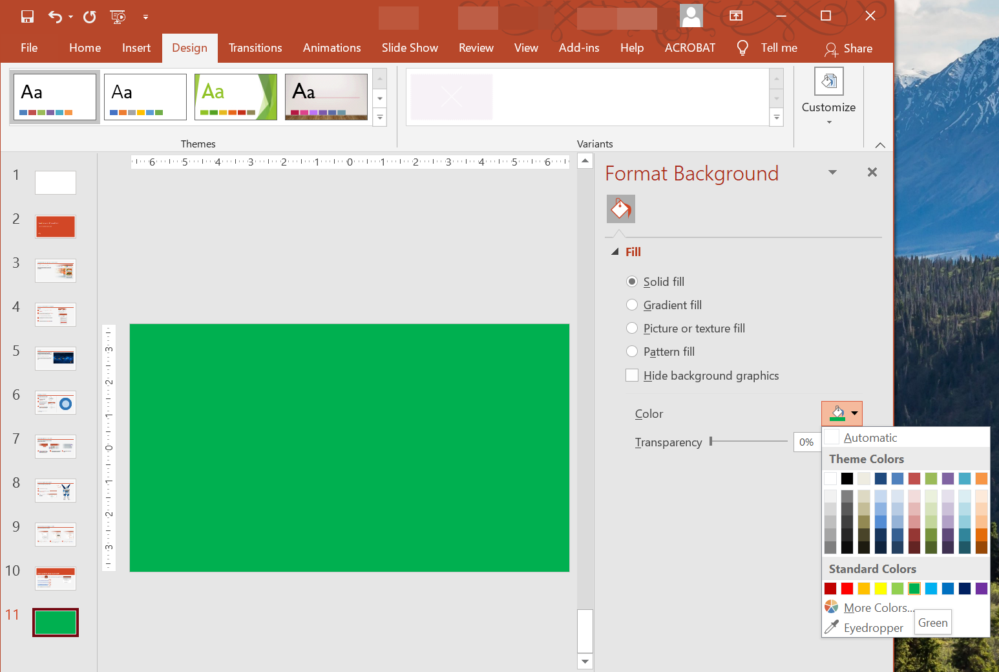

## **บทนำ**

สีทึบ, การไล่สี และภาพมักใช้เป็นพื้นหลังของสไลด์ คุณสามารถตั้งค่าพื้นหลังสำหรับ **สไลด์ปกติ** (สไลด์เดียว) หรือ **สไลด์แม่** (ใช้กับหลายสไลด์พร้อมกัน)



## **ตั้งค่าพื้นหลังสีทึบสำหรับสไลด์ปกติ**

Aspose.Slides อนุญาตให้คุณตั้งค่าสีทึบเป็นพื้นหลังสำหรับสไลด์เฉพาะในงานนำเสนอ—แม้ว่างานนำเสนอจะใช้สไลด์แม่ การเปลี่ยนแปลงจะใช้กับสไลด์ที่เลือกเท่านั้น

1. สร้างอินสแตนซ์ของคลาส [Presentation](https://reference.aspose.com/slides/th/net/aspose.slides/presentation/)
2. ตั้งค่า [BackgroundType](https://reference.aspose.com/slides/th/net/aspose.slides/backgroundtype/) ของสไลด์เป็น `OwnBackground`
3. ตั้งค่าพื้นหลังสไลด์ [FillType](https://reference.aspose.com/slides/th/net/aspose.slides/filltype/) เป็น `Solid`
4. ใช้คุณสมบัติ [SolidFillColor](https://reference.aspose.com/slides/th/net/aspose.slides/fillformat/solidfillcolor/) บน [FillFormat](https://reference.aspose.com/slides/th/net/aspose.slides/fillformat/) เพื่อระบุสีพื้นหลังทึบ
5. บันทึกงานนำเสนอที่แก้ไขแล้ว

ตัวอย่าง C# ด้านล่างแสดงวิธีตั้งค่าสีทึบสีฟ้าเป็นพื้นหลังสำหรับสไลด์ปกติ:

```cs
using System.Drawing;
using Aspose.Slides;
using Aspose.Slides.Export;

// สร้างอินสแตนซ์ของคลาส Presentation.
using (Presentation presentation = new Presentation())
{
    ISlide slide = presentation.Slides[0];

    // ตั้งค่าสีพื้นหลังของสไลด์เป็นสีฟ้า.
    slide.Background.Type = BackgroundType.OwnBackground;
    slide.Background.FillFormat.FillType = FillType.Solid;
    slide.Background.FillFormat.SolidFillColor.Color = Color.Blue;

    // บันทึกงานนำเสนอลงดิสก์.
    presentation.Save("SolidColorBackground.pptx", SaveFormat.Pptx);
}
```

## **ตั้งค่าพื้นหลังสีทึบสำหรับสไลด์แม่**

Aspose.Slides อนุญาตให้คุณตั้งค่าสีทึบเป็นพื้นหลังสำหรับสไลด์แม่ในงานนำเสนอ สไลด์แม่ทำหน้าที่เป็นแม่แบบที่ควบคุมการจัดรูปแบบของทุกสไลด์ ดังนั้นเมื่อคุณเลือกสีทึบสำหรับพื้นหลังของสไลด์แม่ มันจะนำไปใช้กับทุกสไลด์

1. สร้างอินสแตนซ์ของคลาส [Presentation](https://reference.aspose.com/slides/th/net/aspose.slides/presentation/)
2. ตั้งค่า [BackgroundType](https://reference.aspose.com/slides/th/net/aspose.slides/backgroundtype/) ของสไลด์แม่ (ผ่าน `masters`) เป็น `OwnBackground`
3. ตั้งค่าพื้นหลังสไลด์แม่ [FillType](https://reference.aspose.com/slides/th/net/aspose.slides/filltype/) เป็น `Solid`
4. ใช้ [SolidFillColor](https://reference.aspose.com/slides/th/net/aspose.slides/fillformat/solidfillcolor/) เพื่อระบุสีพื้นหลังทึบ
5. บันทึกงานนำเสนอที่แก้ไขแล้ว

ตัวอย่าง C# ด้านล่างแสดงวิธีตั้งค่าสีทึบ (สีเขียวป่า) เป็นพื้นหลังสำหรับสไลด์แม่:

```cs
using System.Drawing;
using Aspose.Slides;
using Aspose.Slides.Export;

// สร้างอินสแตนซ์ของคลาส Presentation.
using (Presentation presentation = new Presentation())
{
    IMasterSlide masterSlide = presentation.Masters[0];

    // ตั้งค่าสีพื้นหลังของสไลด์แม่เป็นสีเขียวป่า.
    masterSlide.Background.Type = BackgroundType.OwnBackground;
    masterSlide.Background.FillFormat.FillType = FillType.Solid;
    masterSlide.Background.FillFormat.SolidFillColor.Color = Color.ForestGreen;

    // บันทึกงานนำเสนอลงดิสก์.
    presentation.Save("MasterSlideBackground.pptx", SaveFormat.Pptx);
}
```

## **ตั้งค่าพื้นหลังไล่สีสำหรับสไลด์**

ไล่สีคือเอฟเฟกต์กราฟิกที่สร้างจากการเปลี่ยนสีอย่างค่อยเป็นค่อยไป เมื่อใช้เป็นพื้นหลังสไลด์ ไล่สีสามารถทำให้งานนำเสนอดูศิลป์และมืออาชีพยิ่งขึ้น Aspose.Slides อนุญาตให้คุณตั้งค่าสีไล่สีเป็นพื้นหลังสำหรับสไลด์

1. สร้างอินสแตนซ์ของคลาส [Presentation](https://reference.aspose.com/slides/th/net/aspose.slides/presentation/)
2. ตั้งค่า [BackgroundType](https://reference.aspose.com/slides/th/net/aspose.slides/backgroundtype/) ของสไลด์เป็น `OwnBackground`
3. ตั้งค่าพื้นหลังสไลด์ [FillType](https://reference.aspose.com/slides/th/net/aspose.slides/filltype/) เป็น `Gradient`
4. ใช้คุณสมบัติ [GradientFormat](https://reference.aspose.com/slides/th/net/aspose.slides/fillformat/gradientformat/) บน [FillFormat](https://reference.aspose.com/slides/th/net/aspose.slides/fillformat/) เพื่อกำหนดการตั้งค่าไล่สีตามต้องการของคุณ
5. บันทึกงานนำเสนอที่แก้ไขแล้ว

ตัวอย่าง C# ด้านล่างแสดงวิธีตั้งค่าสีไล่สีเป็นพื้นหลังสำหรับสไลด์:

```cs
using Aspose.Slides;
using Aspose.Slides.Export;

// สร้างอินสแตนซ์ของคลาส Presentation.
using (Presentation presentation = new Presentation())
{
    ISlide slide = presentation.Slides[0];

    // ใช้เอฟเฟกต์ไล่สีกับพื้นหลัง.
    slide.Background.Type = BackgroundType.OwnBackground;
    slide.Background.FillFormat.FillType = FillType.Gradient;
    slide.Background.FillFormat.GradientFormat.TileFlip = TileFlip.FlipBoth;

    // บันทึกงานนำเสนอลงดิสก์.
    presentation.Save("GradientBackground.pptx", SaveFormat.Pptx);
}
```

## **ตั้งรูปภาพเป็นพื้นหลังสไลด์**

นอกจากการเติมสีทึบและไล่สีแล้ว Aspose.Slides ยังอนุญาตให้คุณใช้ภาพเป็นพื้นหลังของสไลด์ได้

1. สร้างอินสแตนซ์ของคลาส [Presentation](https://reference.aspose.com/slides/th/net/aspose.slides/presentation/)
2. ตั้งค่า [BackgroundType](https://reference.aspose.com/slides/th/net/aspose.slides/backgroundtype/) ของสไลด์เป็น `OwnBackground`
3. ตั้งค่าพื้นหลังสไลด์ [FillType](https://reference.aspose.com/slides/th/net/aspose.slides/filltype/) เป็น `Picture`
4. โหลดภาพที่คุณต้องการใช้เป็นพื้นหลังสไลด์
5. เพิ่มภาพเข้าไปในคอลเลกชันภาพของงานนำเสนอ
6. ใช้คุณสมบัติ [PictureFillFormat](https://reference.aspose.com/slides/th/net/aspose.slides/fillformat/picturefillformat/) บน [FillFormat](https://reference.aspose.com/slides/th/net/aspose.slides/fillformat/) เพื่อกำหนดภาพเป็นพื้นหลัง
7. บันทึกงานนำเสนอที่แก้ไขแล้ว

ตัวอย่าง C# ด้านล่างแสดงวิธีตั้งรูปภาพเป็นพื้นหลังสำหรับสไลด์:

```c#
using Aspose.Slides;
using Aspose.Slides.Export;

// สร้างอินสแตนซ์ของคลาส Presentation.
using (Presentation presentation = new Presentation())
{
    ISlide slide = presentation.Slides[0];

    // ตั้งค่าคุณสมบัติภาพพื้นหลัง.
    slide.Background.Type = BackgroundType.OwnBackground;
    slide.Background.FillFormat.FillType = FillType.Picture;
    slide.Background.FillFormat.PictureFillFormat.PictureFillMode = PictureFillMode.Stretch;

    // โหลดภาพ.
    IImage image = Images.FromFile("Tulips.jpg");
    // เพิ่มภาพเข้าไปในคอลเลกชันภาพของงานนำเสนอ.
    IPPImage ppImage = presentation.Images.AddImage(image);
    image.Dispose();

    slide.Background.FillFormat.PictureFillFormat.Picture.Image = ppImage;

    // บันทึกงานนำเสนอลงดิสก์.
    presentation.Save("ImageAsBackground.pptx", SaveFormat.Pptx);
}
```

ตัวอย่างโค้ดต่อไปนี้แสดงวิธีตั้งค่าชนิดการเติมพื้นหลังเป็นภาพที่ทำซ้ำเป็นกระเบื้องและแก้ไขคุณสมบัติการทำซ้ำ:

```cs
using Aspose.Slides;
using Aspose.Slides.Export;

using (Presentation presentation = new Presentation())
{
    ISlide firstSlide = presentation.Slides[0];

    IBackground background = firstSlide.Background;

    background.Type = BackgroundType.OwnBackground;
    background.FillFormat.FillType = FillType.Picture;

    IPPImage ppImage;
    using (IImage newImage = Aspose.Slides.Images.FromFile("image.png"))
        ppImage = presentation.Images.AddImage(newImage);

    // ตั้งค่าภาพที่ใช้สำหรับการเติมพื้นหลัง.
    IPictureFillFormat backPictureFillFormat = background.FillFormat.PictureFillFormat;
    backPictureFillFormat.Picture.Image = ppImage;

    // ตั้งค่าโหมดการเติมภาพเป็นแบบกระเบื้องและปรับคุณสมบัติกระเบื้อง.
    backPictureFillFormat.PictureFillMode = PictureFillMode.Tile;
    backPictureFillFormat.TileOffsetX = 15f;
    backPictureFillFormat.TileOffsetY = 15f;
    backPictureFillFormat.TileScaleX = 46f;
    backPictureFillFormat.TileScaleY = 87f;
    backPictureFillFormat.TileAlignment = RectangleAlignment.Center;
    backPictureFillFormat.TileFlip = TileFlip.FlipY;

    presentation.Save("TileBackground.pptx", SaveFormat.Pptx);
}
```

{}
อ่านต่อ: [**รูปภาพทำซ้ำเป็นเทกเจอร์**](/slides/th/net/shape-formatting/#tile-picture-as-texture).
{}

### **ปรับความโปร่งใสของภาพพื้นหลัง**

คุณอาจต้องการปรับความโปร่งใสของภาพพื้นหลังสไลด์เพื่อให้เนื้อหาของสไลด์โดดเด่นขึ้น ตัวอย่างโค้ด C# ด้านล่างแสดงวิธีเปลี่ยนความโปร่งใสของภาพพื้นหลังสไลด์:

```cs
using Aspose.Slides;
using Aspose.Slides.Effects;
using Aspose.Slides.Export;

var transparencyValue = 30; // ตัวอย่างเช่น.

using (Presentation presentation = new Presentation("ImageAsBackground.pptx"))
{
    ISlide slide = presentation.Slides[0];

    // ดึงคอลเลกชันของการแปลงรูปภาพ.
    var imageTransform = slide.Background.FillFormat.PictureFillFormat.Picture.ImageTransform;

    // ค้นหาเอฟเฟกต์ความโปร่งใสแบบเปอร์เซ็นต์คงที่ที่มีอยู่.
    var transparencyOperation = null as IAlphaModulateFixed;
    foreach (var operation in imageTransform)
    {
        if (operation is IAlphaModulateFixed alphaModulateFixed)
        {
            transparencyOperation = alphaModulateFixed;
            break;
        }
    }

    // ตั้งค่าความโปร่งใสใหม่.
    if (transparencyOperation == null)
    {
        imageTransform.AddAlphaModulateFixedEffect(100 - transparencyValue);
    }
    else
    {
        transparencyOperation.Amount = (100 - transparencyValue);
    }

    presentation.Save("ImageBackgroundTransparency.pptx", SaveFormat.Pptx);
}
```

## **รับค่าพื้นหลังสไลด์**

Aspose.Slides มีอินเทอร์เฟซ [IBackgroundEffectiveData](https://reference.aspose.com/slides/th/net/aspose.slides/ibackgroundeffectivedata/) สำหรับการดึงค่าพื้นหลังที่มีผลจริงของสไลด์ อินเทอร์เฟซนี้เปิดเผย [FillFormat](https://reference.aspose.com/slides/th/net/aspose.slides/ibackgroundeffectivedata/fillformat/) และ [EffectFormat](https://reference.aspose.com/slides/th/net/aspose.slides/ibackgroundeffectivedata/effectformat/) ที่มีผลจริง

โดยใช้คุณสมบัติ `background` ของคลาส [BaseSlide](https://reference.aspose.com/slides/th/net/aspose.slides/baseslide/) คุณสามารถรับพื้นหลังที่มีผลของสไลด์ได้

ตัวอย่าง C# ด้านล่างแสดงวิธีรับค่าพื้นหลังที่มีผลของสไลด์:

```cs
using Aspose.Slides;

// สร้างอินสแตนซ์ของคลาส Presentation.
using (Presentation presentation = new Presentation("Sample.pptx"))
{
    ISlide slide = presentation.Slides[0];  

    // ดึงพื้นหลังที่มีผลจริง, โดยคำนึงถึงสไลด์แม่, เค้าโครงและธีม.
    IBackgroundEffectiveData effBackground = slide.Background.GetEffective();

    if (effBackground.FillFormat.FillType == FillType.Solid)
        Console.WriteLine("Fill color: " + effBackground.FillFormat.SolidFillColor);
    else
        Console.WriteLine("Fill type: " + effBackground.FillFormat.FillType);
}
```

## **FAQ**

### ฉันสามารถรีเซ็ตพื้นหลังที่กำหนดเองและคืนค่าพื้นหลังของธีม/เค้าโครงได้หรือไม่?
ใช่. ลบการเติมสีที่กำหนดเองของสไลด์และพื้นหลังจะถูกสืบทอดอีกครั้งจากสไลด์ [เค้าโครง](/slides/th/net/slide-layout/)/[แม่](/slides/th/net/slide-master/) ที่เกี่ยวข้อง (เช่น [พื้นหลังธีม](/slides/th/net/presentation-theme/))

### จะเกิดอะไรขึ้นกับพื้นหลังหากฉันเปลี่ยนธีมของงานนำเสนอในภายหลัง?
หากสไลด์มีการเติมสีของตัวเอง มันจะคงเดิมไว้ หากพื้นหลังสืบทอดมาจากสไลด์ [เค้าโครง](/slides/th/net/slide-layout/)/[แม่](/slides/th/net/slide-master/) มันจะอัปเดตเพื่อให้ตรงกับ [ธีมใหม่](/slides/th/net/presentation-theme/)