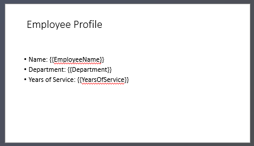

## **บทนำ**

การนำเสนอ PowerPoint เป็นวิธีที่ทรงพลังในการแสดงและสื่อสารข้อมูลโดยมักใช้ร่วมกับเวิร์กบุ๊ก Excel ซึ่ง Excel ทำหน้าที่เป็นแหล่งข้อมูลโครงสร้างที่ยอดเยี่ยมและ PowerPoint มีความสามารถในการสื่อภาพข้อมูลนั้นต่อผู้ชม

มีสถานการณ์การใช้งานจริงหลายกรณีที่การผสาน Excel กับ PowerPoint เป็นสิ่งจำเป็น เช่น การทำเมลเมิร์จ, การเติมตารางข้อมูล, การสร้างสไลด์หนึ่งสไลด์ต่อบันทึกข้อมูล (การสร้างสไลด์เป็นชุด), การสร้างสื่อการฝึกอบรม, และการรวมรายงาน Excel หลายฉบับเป็นการนำเสนอเดียว เป็นต้น

จนถึงตอนนี้ การใช้งานคุณลักษณะเหล่านี้ด้วย Aspose.Slides API จำเป็นต้องพึ่งพาโซลูชันของบุคคลที่สามเช่น Aspose.Cells แม้ว่ากระบวนการเหล่านี้จะมีความทนทาน แต่ก็อาจซับซ้อนและมีค่าใช้จ่ายสูงสำหรับผู้ใช้ที่ต้องการเพียงฟังก์ชันการบูรณาการข้อมูลพื้นฐาน

## **วิธีการทำงาน**

เพื่อทำให้การทำงานกับข้อมูล Excel ง่ายและราบรื่นยิ่งขึ้น Aspose.Slides ได้นำชั้นคลาสใหม่มาใช้สำหรับการอ่านข้อมูลจากเวิร์กบุ๊ก Excel และการนำเข้าเนื้อหาเข้าสู่การนำเสนอ ความสามารถนี้เปิดโอกาสใหม่ที่ทรงพลังสำหรับผู้ใช้ API ที่ต้องการใช้ Excel เป็นแหล่งข้อมูลภายในกระบวนการทำงานของการนำเสนอ

ฟังก์ชันใหม่ได้รับการออกแบบเพื่อการเข้าถึงข้อมูลทั่วไปและไม่ได้ถูกรวมเข้าไปใน Presentation Document Object Model (DOM) ซึ่งหมายความว่า *ไม่อนุญาตให้แก้ไขหรือบันทึกไฟล์ Excel* จุดประสงค์เพียงอย่างเดียวคือการเปิดเวิร์กบุ๊กและนำทางผ่านเนื้อหาเพื่อดึงข้อมูลเซลล์

หัวใจของความสามารถนี้คือคลาสใหม่ [ExcelDataWorkbook](https://reference.aspose.com/slides/th/net/aspose.slides.excel/exceldataworkbook/) คลาสนี้ช่วยให้คุณโหลดเวิร์กบุ๊ก Excel จากไฟล์ในเครื่องหรือสตรีม เมื่อโหลดเสร็จแล้ว จะมีเมธอด [GetCell](https://reference.aspose.com/slides/th/net/aspose.slides.excel/exceldataworkbook/getcell/) ที่มีหลายรูปแบบซ้อนกัน ซึ่งคุณสามารถใช้เพื่อดึงเซลล์ที่ระบุโดยตำแหน่ง (เช่น ดัชนีแถวและคอลัมน์หรือช่วงที่ตั้งชื่อ)

แต่ละครั้งที่เรียกใช้ [GetCell](https://reference.aspose.com/slides/th/net/aspose.slides.excel/exceldataworkbook/getcell/) จะส่งกลับอินสแตนซ์ของคลาส [ExcelDataCell](https://reference.aspose.com/slides/th/net/aspose.slides.excel/exceldatacell/) วัตถุนี้แทนเซลล์เดียวในเวิร์กบุ๊ก Excel และให้คุณเข้าถึงค่าของมันในลักษณะที่ง่ายและเข้าใจได้

#### **นำเข้าแผนภูมิ Excel**

ขั้นตอนต่อไปเพื่อขยายความสามารถคือคลาส [ExcelWorkbookImporter](https://reference.aspose.com/slides/th/net/aspose.slides.import/excelworkbookimporter/) คลาสยูทิลิตี้นี้ให้ฟังก์ชันสำหรับนำเข้าเนื้อหาจากเวิร์กบุ๊ก Excel ไปยังการนำเสนอ มันมีเมธอด [AddChartFromWorkbook](https://reference.aspose.com/slides/th/net/aspose.slides.import/excelworkbookimporter/addchartfromworkbook/) หลายรูปแบบซ้อนกัน ซึ่งช่วยให้คุณดึงแผนภูมิที่เลือกจากเวิร์กบุ๊ก Excel ที่ระบุและเพิ่มลงท้ายคอลเลกชันรูปร่างที่กำหนดที่พิกัดที่ระบุ

#### **นำเข้าตาราง Excel**

คลาส [ExcelWorkbookImporter](https://reference.aspose.com/slides/th/net/aspose.slides.import/excelworkbookimporter/) ยังมีเมธอด [AddTableFromWorkbook](https://reference.aspose.com/slides/th/net/aspose.slides.import/excelworkbookimporter/addtablefromworkbook/) หลายรูปแบบซ้อนกัน เมธอดเหล่านี้ช่วยให้คุณนำเข้าช่วงเซลล์ที่ระบุจากเวิร์กชีตที่กำหนดและเพิ่มเป็นตารางลงท้ายคอลเลกชันรูปร่างที่กำหนดที่พิกัดที่ระบุ

โดยสรุป นี่คือ API ที่เบาและเรียบง่ายสำหรับการอ่านข้อมูล Excel — สิ่งที่นักพัฒนาหลายคนต้องการโดยไม่ต้องเผชิญกับภาระของไลบรารีประมวลผลสเปรดชีตเต็มรูปแบบ

## **มาทำโค้ดกัน**

### **ตัวอย่างสถานการณ์การทำเมลเมิร์จ**

ในตัวอย่างต่อไปนี้ เราจะทำการประยุกต์สถานการณ์เมลเมิร์จอย่างง่ายโดยสร้างการนำเสนอหลายชุดจากข้อมูลที่เก็บอยู่ในเวิร์กบุ๊ก Excel

เพื่อเริ่มต้น เราต้องการสองสิ่ง:
1. เวิร์กบุ๊ก Excel ที่บรรจุข้อมูล


2. เทมเพลตการนำเสนอ PowerPoint



```csharp
// โหลดเวิร์กบุ๊ก Excel ที่มีข้อมูลพนักงาน.
ExcelDataWorkbook workbook = new ExcelDataWorkbook("TemplateData.xlsx");
int worksheetIndex = 0;

// โหลดเทมเพลตการนำเสนอ.
using Presentation templatePresentation = new Presentation("PresentationTemplate.pptx");

// วนลูปผ่านแถวของ Excel (ยกเว้นหัวตารางที่แถว 0).
for (int rowIndex = 1; rowIndex <= 4; rowIndex++)
{
    // สร้างการนำเสนอใหม่สำหรับแต่ละบันทึกพนักงาน.
    using Presentation employeePresentation = new Presentation();

    // ลบสไลด์เปล่าเริ่มต้น.
    employeePresentation.Slides.RemoveAt(0);

    // คัดลอกสไลด์เทมเพลตไปยังการนำเสนอใหม่.
    ISlide slide = employeePresentation.Slides.AddClone(templatePresentation.Slides[0]);

    // ดึงย่อหน้าจากรูปร่างเป้าหมาย (สมมติว่าใช้รูปร่างที่ตำแหน่ง 1).
    IParagraphCollection paragraphs = (slide.Shapes[1] as IAutoShape).TextFrame.Paragraphs;

    // แทนที่ตัวแปรแทนที่ด้วยข้อมูลจาก Excel.
    string employeeName = workbook.GetCell(worksheetIndex, rowIndex, 0).Value.ToString();
    IPortion namePortion = paragraphs[0].Portions[0];
    namePortion.Text = namePortion.Text.Replace("{{EmployeeName}}", employeeName);

    string department = workbook.GetCell(worksheetIndex, rowIndex, 1).Value.ToString();
    IPortion departmentPortion = paragraphs[1].Portions[0];
    departmentPortion.Text = departmentPortion.Text.Replace("{{Department}}", department);

    string yearsOfService = workbook.GetCell(worksheetIndex, rowIndex, 2).Value.ToString();
    IPortion yearsPortion = paragraphs[2].Portions[0];
    yearsPortion.Text = yearsPortion.Text.Replace("{{YearsOfService}}", yearsOfService);

    // บันทึกการนำเสนอส่วนบุคคลเป็นไฟล์แยก.
    employeePresentation.Save($"{employeeName} Report.pptx", SaveFormat.Pptx);
}
```


### **ตัวอย่างตาราง Excel**

ในตัวอย่างที่สอง เราเพียงคัดลอกข้อมูลจากตาราง Excel แล้วแสดงบนสไลด์ PowerPoint ด้วยรูปแบบที่ดูสวยงามยิ่งขึ้น

ในตัวอย่างนี้ เราใช้เวิร์กบุ๊ก Excel เหมือนจากตัวอย่างแรก ซึ่งประกอบด้วยตารางพนักงานอย่างง่าย

```csharp
// โหลดเวิร์กบุ๊ก Excel ที่มีข้อมูลพนักงาน.
ExcelDataWorkbook workbook = new ExcelDataWorkbook("TemplateData.xlsx");
int worksheetIndex = 0;

// สร้างการนำเสนอ PowerPoint ใหม่.
using Presentation presentation = new Presentation();

// เพิ่มรูปร่างตารางไปยังสไลด์แรก.
ITable table = presentation.Slides[0].Shapes.AddTable(
    50, 200,
    new double[] { 200, 200, 200 },
    new double[] { 30, 30, 30, 30, 30 }
);

// เติมข้อมูลจากเวิร์กบุ๊ก Excel ลงในตาราง PowerPoint.
for (int rowIndex = 0; rowIndex < 5; rowIndex++)
{
    for (int columnIndex = 0; columnIndex < 3; columnIndex++)
    {
        string cellValue = workbook.GetCell(worksheetIndex, rowIndex, columnIndex).Value.ToString();
        table[columnIndex, rowIndex].TextFrame.Text = cellValue;
    }
}

// บันทึกการนำเสนอที่ได้ลงไฟล์.
presentation.Save("Table.pptx", SaveFormat.Pptx);
```


### **ตัวอย่างการนำเข้าแผนภูมิ Excel**

ในตัวอย่างนี้ เรานำเข้าชาร์ตจากเวิร์กชีตแรกของเวิร์กบุ๊ก Excel ที่ใช้ในตัวอย่างก่อนหน้า ชาร์ตจะเชื่อมโยงกับเวิร์กบุ๊กภายนอกในงานนำเสนอที่ได้

ขั้นแรก เราเพิ่มแผนภูมิวงกลมลงในเวิร์กบุ๊ก Excel โดยอ้างอิงจากตารางพนักงาน


```csharp
// สร้างการนำเสนอ PowerPoint ใหม่.
using Presentation presentation = new Presentation();

// ดึงคอลเลกชันรูปร่างของสไลด์แรก.
IShapeCollection shapes = presentation.Slides[0].Shapes;

// นำเข้าแผนภูมิที่ชื่อ "Chart 1" จากชีตแรกของเวิร์กบุ๊กและเพิ่มลงในคอลเลกชันรูปร่าง.
ExcelWorkbookImporter.AddChartFromWorkbook(shapes, 10, 10, "TemplateData.xlsx", "Sheet1", "Chart 1", false);

// บันทึกการนำเสนอที่ได้ลงไฟล์.
presentation.Save("Chart.pptx", SaveFormat.Pptx);
```


### **ตัวอย่างการนำเข้าทุกแผนภูมิ Excel**

ลองนึกว่าคุณมีเวิร์กบุ๊ก Excel ที่เต็มไปด้วยแผนภูมิและต้องการนำเข้าทั้งหมดลงในงานนำเสนอ แผนภูมิแต่ละอันควรอยู่ในสไลด์ใหม่

โค้ดต่อไปนี้จะวนลูปผ่านทุกเวิร์กชีตในไฟล์ Excel แหล่งข้อมูล สกัดแผนภูมิจากแต่ละเวิร์กชีต และเพิ่มแผนภูมิแต่ละอันไปยังสไลด์แยกโดยใช้เค้าโครงสไลด์เปล่า ในงานนำเสนอที่ได้ จะฝังเฉพาะข้อมูลแผนภูมิ ไม่ได้ฝังเวิร์กบุ๊กทั้งหมด

```csharp
// โหลดเวิร์กบุ๊ก Excel ที่มีข้อมูลพนักงาน.
ExcelDataWorkbook workbook = new ExcelDataWorkbook("ExcelWithCharts.xlsx");

// สร้างการนำเสนอ PowerPoint ใหม่.
using Presentation presentation = new Presentation();

// ดึงเค้าโครงสไลด์เปล่า.
ILayoutSlide blankLayout = presentation.LayoutSlides.GetByType(SlideLayoutType.Blank);

// รับชื่อของทุกเวิร์กชีตที่อยู่ในเวิร์กบุ๊ก Excel.
IList<string> worksheetNames = workbook.GetWorksheetNames();

foreach (var name in worksheetNames)
{
    // ดึงดิกชันรีที่แมปดัชนีแผนภูมิกับชื่อแผนภูมิสำหรับเวิร์กชีต.
    IDictionary<int, string> worksheetCharts = workbook.GetChartsFromWorksheet(name);
    foreach (var chart in worksheetCharts)
    {
        // เพิ่มสไลด์ใหม่โดยใช้เค้าโครงเปล่า.
        ISlide slide = presentation.Slides.AddEmptySlide(blankLayout);

        // นำเข้าแผนภูมิที่ระบุจากเวิร์กบุ๊ก Excel ไปยังคอลเลกชันรูปร่างของสไลด์.
        ExcelWorkbookImporter.AddChartFromWorkbook(slide.Shapes, 10, 10, workbook, name, chart.Key, false);
    }
}

// บันทึกการนำเสนอที่ได้ลงไฟล์.
presentation.Save("Charts.pptx", SaveFormat.Pptx);
```

### **ตัวอย่างการนำเข้าตาราง Excel**

ในตัวอย่างนี้ เรานำเข้าตารางที่จัดรูปแบบจากเวิร์กชีต Excel ไปยังการนำเสนอ PowerPoint โดยตรง

เวิร์กชีต Excel แหล่งที่มามีตารางที่จัดรูปแบบพร้อมข้อมูลพนักงาน:


```csharp
// สร้างการนำเสนอ PowerPoint ใหม่.
using Presentation presentation = new Presentation();

// ดึงคอลเลกชันรูปร่างของสไลด์แรก.
IShapeCollection shapes = presentation.Slides[0].Shapes;

// นำเข้าตารางจากชีตแรกของเวิร์กบุ๊กและเพิ่มลงในคอลเลกชันรูปร่าง.
ExcelWorkbookImporter.AddTableFromWorkbook(shapes, 10, 10, "TemplateData.xlsx", "Sheet1", "A1:C5");

// บันทึกการนำเสนอที่ได้ลงไฟล์.
presentation.Save("FormattedTable.pptx", SaveFormat.Pptx);
```


## **สรุป**

กลไกนี้ซึ่งพร้อมใช้งานโดยตรงใน Aspose.Slides ช่วยรวมการทำงานกับข้อมูล Excel และการนำเสนอไว้ในที่เดียว ทำให้คุณสร้างสไลด์พร้อมแผนภูมิเชิงภาพและข้อมูลในรูปแบบตาราง Excel — โดยไม่มีไลบรารีเพิ่มเติมหรือการบูรณาการที่ซับซ้อน