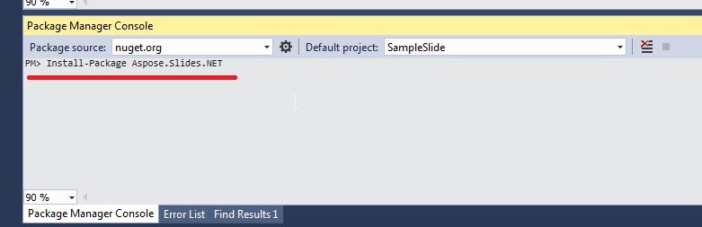

## **ภาพรวม**

บทความนี้อธิบายวิธีการติดตั้ง Aspose.Slides for .NET บน Windows และ macOS โดยมุ่งเน้นการติดตั้งผ่าน NuGetและแสดงวิธีเพิ่มไลบรารีลงในโครงการ Visual Studio ไม่ว่าจะผ่าน NuGet Package Manager หรือ Package Manager Console บน Windows นอกจากนี้ยังอธิบายวิธีอัปเดตแพ็กเกจและติดตั้งรุ่นพรีรีลีสเมื่อจำเป็น

## **Windows**
NuGet ให้เส้นทางที่ง่ายที่สุดสำหรับการดาวน์โหลดและติดตั้ง Aspose APIs สำหรับ .NET บน PC

### **วิธีที่ 1: ติดตั้งหรืออัปเดต Aspose.Slides จาก NuGet Package Manager**

1. เปิด Microsoft Visual Studio.  
2. สร้างแอปคอนโซลง่าย ๆ หรือเปิดโครงการที่มีอยู่แล้ว.  
3. ไปที่ **Tools** > **NuGet package manager**.  
4. ภายใน **Browse** ให้ค้นหา *Aspose Slides* ในช่องข้อความ.  
{}
5. คลิก **Aspose.Slides.NET** แล้วคลิก **Install**.  
   * หากต้องการอัปเดต Aspose.Slides — สมมติว่าคุณได้ติดตั้งไว้แล้ว — ให้คลิก **Update** แทน.

API ที่เลือกจะถูกดาวน์โหลดและอ้างอิงในโครงการของคุณ.

### **วิธีที่ 2: ติดตั้งหรืออัปเดต Aspose.Slides ผ่าน Package Manager Console**

นี่คือวิธีที่คุณอ้างอิง [Aspose.Slides API](https://www.nuget.org/packages/Aspose.Slides.NET/) ผ่านคอนโซลของ package manager:

1. เปิด Microsoft Visual Studio.  
2. สร้างแอปคอนโซลง่าย ๆ หรือเปิดโครงการที่มีอยู่แล้ว.  
3. ไปที่ **Tools** > **Library Package Manager** > **Package Manager Console**.  

4. เรียกใช้คำสั่งนี้: `Install-Package Aspose.Slides.NET`  

รุ่นเต็มล่าสุดจะถูกติดตั้งในแอปพลิเคชันของคุณ.

* อีกทางเลือกหนึ่ง คุณสามารถเพิ่มส่วนต่อท้าย `-prerelease` ไปยังคำสั่งเพื่อระบุว่าต้องติดตั้งรุ่นล่าสุด (รวมถึง hotfix) ด้วย

เคล็ดลับ **Installing Aspose.Slides.NET** จะปรากฏที่ด้านล่างของหน้าต่าง.  

เมื่อการดาวน์โหลดสำเร็จ คุณควรเห็นข้อความยืนยันบางอย่าง.  

หากคุณไม่คุ้นเคยกับ [Aspose EULA](https://about.aspose.com/legal/eula) คุณอาจต้องการอ่านใบอนุญาตที่อ้างถึงใน URL.  

ในแอปพลิเคชันของคุณ คุณควรเห็นว่า Aspose.Slides ได้ถูกเพิ่มและอ้างอิงเรียบร้อยแล้ว.  

ใน Package Manager Console คุณสามารถรันคำสั่ง `Update-Package Aspose.Slides.NET` เพื่อเช็คการอัปเดตของแพ็กเกจ Aspose.Slides การอัปเดต (หากพบ) จะถูกติดตั้งอัตโนมัติ คุณยังสามารถใช้ส่วนต่อท้าย `-prerelease` เพื่ออัปเดตรุ่นล่าสุดได้.

#### **ข้อควรพิจารณาเมื่อรันบนสภาพแวดล้อมเซิร์ฟเวอร์ร่วม**

เราขอแนะนำอย่างยิ่งให้คุณรันส่วนประกอบทั้งหมดของ Aspose .NET ด้วยชุดสิทธิ์ **Full Trust** เนื่องจากส่วนประกอบของ Aspose บางครั้งจำเป็นต้องเข้าถึงการตั้งค่าจดทะเบียนและไฟล์ที่อยู่ในตำแหน่งอื่นนอกเหนือจากไดเรกทอรีเสมือน — ตัวอย่างเช่น เมื่อส่วนประกอบของ Aspose ต้องอ่านแบบอักษร.  

ยิ่งไปกว่านั้น ส่วนประกอบ Aspose.NET พึ่งพาคลาสหลักของระบบ .NET — และบางคลาสเหล่านั้นก็ต้องการสิทธิ์ Full Trust สำหรับการดำเนินการในบางกรณี.  

ผู้ให้บริการอินเทอร์เน็ต (ISP) ที่โฮสต์แอปพลิเคชันหลาย ๆ แอปจากบริษัทต่าง ๆ ส่วนใหญ่บังคับใช้ระดับความปลอดภัย Medium Trust ในกรณีของ .NET 2.0 ระดับความปลอดภัยดังกล่าวอาจทำให้เกิดข้อจำกัดที่ส่งผลต่อการทำงานของ Aspose.Slides:

- **RegistryPermission** ไม่พร้อมใช้งาน ซึ่งหมายความว่าคุณไม่สามารถเข้าถึงรีจิสทรีได้ ซึ่งจำเป็นสำหรับการเรียกดูแบบอักษรที่ติดตั้งเมื่อเรนเดอร์เอกสาร.  
- **FileIOPermission** ถูกจำกัด ซึ่งหมายความว่าคุณสามารถเข้าถึงไฟล์ได้เฉพาะในลำดับชั้นของไดเรกทอรีเสมือนของแอปพลิเคชันของคุณเท่านั้น ซึ่งอาจทำให้ไม่สามารถอ่านแบบอักษรระหว่างการส่งออกได้.  

ด้วยเหตุผลข้างต้น เราขอแนะนำอย่างยิ่งให้คุณรัน Aspose.Slides ด้วยสิทธิ์ **Full Trust** หากคุณใช้ **Medium trust** คุณอาจประสบกับความไม่สอดคล้อง — ฟีเจอร์บางส่วนของไลบรารี (เช่นการเรนเดอร์) อาจไม่ทำงานเมื่อคุณดำเนินการบางอย่าง.

## **macOS**

NuGet ให้เส้นทางที่ง่ายที่สุดสำหรับการดาวน์โหลดและติดตั้ง Aspose.Slides for .NET บน macs.

**ติดตั้งข้อกำหนดเบื้องต้น**

เนมสเปซ `System.Drawing` ทำงานแตกต่างกันใน macOS ดังนั้นคุณต้องติดตั้ง mono-libgdiplus.

> ใน .NET 5 และเวอร์ชันก่อนหน้า แพ็กเกจ NuGet [System.Drawing.Common](https://www.nuget.org/packages/System.Drawing.Common/) ทำงานบน Windows, Linux และ macOS อย่างไรก็ตามมีความแตกต่างของแพลตฟอร์มบางประการ บน Linux และ macOS ฟังก์ชัน GDI+ ถูกดำเนินการโดยไลบรารี [libgdiplus)](https://www.mono-project.com/docs/gui/libgdiplus/) ไลบรารีนี้ไม่ได้ติดตั้งโดยค่าเริ่มต้นในส่วนใหญ่ของการกระจาย Linux และไม่รองรับฟังก์ชันทั้งหมดของ GDI+ บน Windows และ macOS นอกจากนี้ยังมีแพลตฟอร์มที่ libgdiplus ไม่พร้อมใช้งานเลย เพื่อใช้ประเภทจากแพ็กเกจ System.Drawing.Common บน Linux และ macOS คุณต้องติดตั้ง libgdiplus แยกต่างหาก สำหรับข้อมูลเพิ่มเติม ดูที่ [Install .NET on Linux](https://docs.microsoft.com/en-us/dotnet/core/install/linux) หรือ [Install .NET on macOS](https://docs.microsoft.com/en-us/dotnet/core/install/macos#libgdiplus).s

หากต้องการติดตั้ง mono-libgdiplus แยกต่างหากบน mac ของคุณ โปรดดู [บทความนี้](https://docs.microsoft.com/en-us/dotnet/core/install/macos#libgdiplus) จากเอกสาร .NET.

### **ติดตั้ง Aspose.Slides**

1. เปิด Visual Studio.  
2. สร้างแอปคอนโซลง่าย ๆ หรือเปิดโครงการที่มีอยู่แล้ว.  
3. ไปที่ **Project** > **Manage NuGet Packages...**  

4. พิมพ์ *Aspose.Slides* ลงในช่องข้อความ.  
5. คลิก **Aspose.Slides for .NET** แล้วคลิก **Add Package.**  
6. เพิ่มโค้ดตัวอย่างง่าย ๆ.  
   * คุณสามารถคัดลอกโค้ดจาก [หน้านี้](/slides/th/net/create-presentation/).  
7. รันแอป.  
8. เปิด *folder/bin/Debug/presentation_file_name* ของโครงการคุณ.

## **คำถามที่พบบ่อย**

**มีรุ่นฟรีหรือข้อจำกัดของการทดลองหรือไม่?**

ใช่ โดยค่าเริ่มต้น Aspose.Slides ทำงานในโหมดประเมินผลซึ่งจะใส่ลายน้ำและอาจมีข้อจำกัดอื่น ๆ หากต้องการลบข้อจำกัดเหล่านี้ คุณต้องใส่ [ใบอนุญาต](/slides/th/net/licensing/) ที่ถูกต้อง.