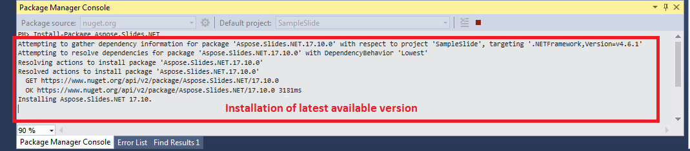
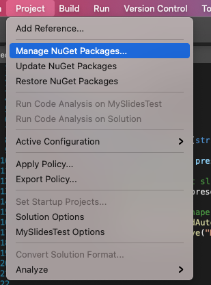

## **ภาพรวม**

บทความนี้อธิบายวิธีการติดตั้ง Aspose.Slides for .NET บน Windows, Linux และ macOS โดยมุ่งเน้นการติดตั้งผ่าน NuGet และแสดงวิธีเพิ่มไลบรารีด้วย NuGet Package Manager หรือ Package Manager Console บน Windows, ในโครงการ .NET บน Linux, และในโครงการ Visual Studio บน macOS นอกจากนี้ยังอธิบายวิธีอัปเดตแพคเกจและติดตั้ง build รุ่นก่อนออกเมื่อจำเป็น

ก่อนการติดตั้ง ให้ตรวจสอบระบบปฏิบัติการที่รองรับ, การทำงานของ .NET, และการพึ่งพาเพิ่มเติมใน [ข้อกำหนดระบบ](/slides/th/net/system-requirements/)

## **Windows**
NuGet ให้วิธีที่ง่ายที่สุดในการดาวน์โหลดและติดตั้ง Aspose API สำหรับ .NET บนพีซี

### **วิธีที่ 1: ติดตั้งหรืออัปเดต Aspose.Slides จาก NuGet Package Manager**

1. เปิด Microsoft Visual Studio  
2. สร้างแอปคอนโซลง่าย ๆ หรือเปิดโครงการที่มีอยู่  
3. ไปที่ **Tools** > **NuGet package manager**  
4. ภายใต้ **Browse** ค้นหา *Aspose Slides* ในช่องข้อความ  
{}
5. คลิก **Aspose.Slides.NET** แล้วคลิก **Install**  
   * หากต้องการอัปเดต Aspose.Slides — สมมติว่าคุณได้ติดตั้งไว้แล้ว — คลิก **Update** แทน  

API ที่เลือกจะถูกดาวน์โหลดและอ้างอิงในโครงการของคุณ

### **วิธีที่ 2: ติดตั้งหรืออัปเดต Aspose.Slides ผ่าน Package Manager Console**

นี่คือวิธีการอ้างอิง [Aspose.Slides API](https://www.nuget.org/packages/Aspose.Slides.NET/) ผ่านคอนโซลผู้จัดการแพคเกจ:

1. เปิด Microsoft Visual Studio  
2. สร้างแอปคอนโซลง่าย ๆ หรือเปิดโครงการที่มีอยู่  
3. ไปที่ **Tools** > **Library Package Manager** > **Package Manager Console**  

4. รันคำสั่งนี้: `Install-Package Aspose.Slides.NET`  

รุ่นเต็มล่าสุดจะถูกติดตั้งในแอปพลิเคชันของคุณ  

* หรือคุณสามารถเพิ่มส่วนต่อท้าย `-prerelease` เพื่อระบุให้ติดตั้งรุ่นล่าสุด (รวม hotfix) ด้วย  

คำแนะนำ **Installing Aspose.Slides.NET** จะปรากฏที่ด้านล่างของหน้าต่าง  

เมื่อการดาวน์โหลดเสร็จสิ้น คุณควรเห็นข้อความยืนยันบางอย่าง  

หากคุณไม่คุ้นเคยกับ [ข้อตกลง EULA ของ Aspose](https://about.aspose.com/legal/eula) คุณอาจต้องการอ่านใบอนุญาตที่ระบุใน URL  

ในแอปพลิเคชันของคุณ คุณควรเห็นว่า Aspose.Slides ได้ถูกเพิ่มและอ้างอิงอย่างสำเร็จ  

ใน Package Manager Console คุณสามารถรันคำสั่ง `Update-Package Aspose.Slides.NET` เพื่อเช็คการอัปเดตของแพคเกจ Aspose.Slides การอัปเดต (ถ้ามี) จะถูกติดตั้งโดยอัตโนมัติ คุณสามารถใช้ส่วนต่อท้าย `-prerelease` เพื่ออัปเดตรุ่นล่าสุดได้เช่นกัน  

#### **ข้อควรพิจารณาเมื่อทำงานบนสภาพแวดล้อมเซิร์ฟเวอร์ที่ใช้ร่วมกัน**
เราขอแนะนำอย่างยิ่งให้คุณรันคอมโพเนนต์ Aspose .NET ทั้งหมดด้วยชุดสิทธิ์ **Full Trust** เนื่องจากคอมโพเนนต์ Aspose บางครั้งต้องเข้าถึงการตั้งค่าจดหมายทะเบียนและไฟล์ในตำแหน่งที่ไม่ใช่ไดเรกทอรีเสมือน — เช่น เมื่อต้องอ่านฟอนต์  

นอกจากนี้คอมโพเนนต์ Aspose.NET พื้นฐานมาจากคลาสระบบ .NET หลัก — และบางคลาสเหล่านั้นก็ต้องการสิทธิ์ Full Trust สำหรับการทำงานในบางกรณี  

ผู้ให้บริการอินเทอร์เน็ต (ISP) ที่โฮสต์แอปพลิเคชันหลาย ๆ ตัวจากบริษัทต่าง ๆ มักบังคับใช้ระดับความปลอดภัย **Medium Trust** ในกรณี .NET 2.0 ระดับความปลอดภัยนี้อาจทำให้เกิดข้อจำกัดที่ส่งผลต่อการทำงานของ Aspose.Slides:

- **RegistryPermission** ไม่พร้อมใช้งาน หมายความว่าคุณไม่สามารถเข้าถึงรีจิสทรีได้ ซึ่งจำเป็นสำหรับการนับฟอนต์ที่ติดตั้งเมื่อเรนเดอร์เอกสาร  
- **FileIOPermission** ถูกจำกัด หมายความว่าคุณสามารถเข้าถึงไฟล์ได้เฉพาะในไดเรกทอรีเสมือนของแอปพลิเคชันของคุณเท่านั้น ซึ่งอาจทำให้ไม่สามารถอ่านฟอนต์ได้ในระหว่างการส่งออก  

ด้วยเหตุผลดังกล่าว เราแนะนำอย่างยิ่งให้คุณรัน Aspose.Slides ด้วยสิทธิ์ **Full Trust** หากคุณใช้ **Medium Trust** คุณอาจพบความไม่สอดคล้อง — ฟีเจอร์บางอย่างของไลบรารี (เช่น การเรนเดอร์) อาจไม่ทำงานเมื่อทำงานบางอย่าง  

## **Linux**

NuGet ให้วิธีที่ง่ายที่สุดในการดาวน์โหลดและติดตั้ง Aspose.Slides for .NET บน Linux ให้เพิ่มแพคเกจ [Aspose.Slides.NET](https://www.nuget.org/packages/Aspose.Slides.NET/) ไปยังโครงการ .NET ของคุณ

## **macOS**

NuGet ให้วิธีที่ง่ายที่สุดในการดาวน์โหลดและติดตั้ง Aspose.Slides for .NET บน macs

### **ติดตั้ง Aspose.Slides**

1. เปิด Visual Studio  
2. สร้างแอปคอนโซลง่าย ๆ หรือเปิดโครงการที่มีอยู่  
3. ไปที่ **Project** > **Manage NuGet Packages...**  
   
4. พิมพ์ *Aspose.Slides* ลงในช่องข้อความ  
5. คลิก **Aspose.Slides for .NET** แล้วคลิก **Add Package**  
6. เพิ่มโค้ดสั้น ๆ  
   * คุณสามารถคัดลอกรหัสจาก [หน้านี้](/slides/th/net/create-presentation/)  
7. รันแอปพลิเคชัน  
8. เปิด *folder/bin/Debug/presentation_file_name* ของโครงการคุณ  

## **FAQ**

**มีเวอร์ชันฟรีหรือข้อจำกัดของรุ่นทดลองหรือไม่?**

ใช่ โดยค่าเริ่มต้น Aspose.Slides จะทำงานในโหมดประเมินผล ซึ่งจะใส่น้ำลายน้ำและอาจมีข้อจำกัดอื่น ๆ หากต้องการลบข้อจำกัดเหล่านั้น คุณต้องใช้ [ใบอนุญาต](/slides/th/net/licensing/) ที่ถูกต้อง.