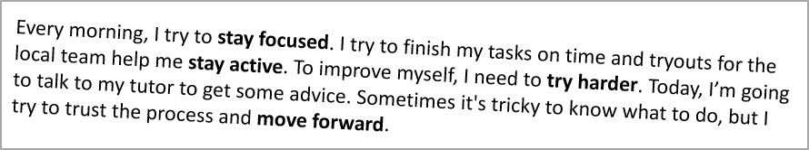

## **ภาพรวม**

บทความนี้แสดงวิธีฟอร์แมตข้อความในงานนำเสนอ PowerPoint และ OpenDocument โดยใช้ Aspose.Slides for Node.js ผ่าน Java ครอบคลุมสีพื้นหลัง ความโปร่งแสง การจัดระยะห่างระหว่างอักขระ คุณสมบัติของฟอนต์ การหมุน ระยะห่างระหว่างย่อหน้า พฤติกรรม Autofit การยึดข้อความ จุดหยุดแท็บ และการตั้งค่าภาษา

ยกเว้นจะระบุไว้เป็นอย่างอื่น ตัวอย่างทั้งหมดใช้ [sample.pptx](sample.pptx) รูปร่างแรกในสไลด์แรกเป็นกล่องข้อความและย่อหน้าแรกมีข้อความตามที่แสดงด้านล่าง ดัชนีของสไลด์และรูปร่างเริ่มจากศูนย์ ตัวอย่างที่เลือกส่วนหนาใช้ฟอร์แมตที่มีผลรวมถึงการสืบทอดฟอร์แมตหนา:


หากต้องการค้นหาและไฮไลท์ข้อความตัวอักษรหรือการจับคู่แบบ regular expression ให้ดูที่ [Search and Replace Text](/slides/th/nodejs-java/search-and-replace-text/)

## **ตั้งค่าสีพื้นหลังของข้อความ**

ใช้ [ParagraphFormat.getDefaultPortionFormat](https://reference.aspose.com/slides/th/nodejs-java/aspose.slides/paragraphformat/#getDefaultPortionFormat--) เพื่อกำหนดสีไฮไลท์เริ่มต้นสำหรับย่อหน้า หรือใช้ [BasePortionFormat.getHighlightColor](https://reference.aspose.com/slides/th/nodejs-java/aspose.slides/baseportionformat/#getHighlightColor--) สำหรับส่วนข้อความแต่ละส่วน

ตัวอย่างต่อไปนี้ตั้งค่าการไฮไลท์สีเทาอ่อนเป็นค่าเริ่มต้นสำหรับย่อหน้าแรก สีไฮไลท์ที่ระบุโดยตรงในแต่ละส่วนจะมีลำดับความสำคัญเหนือค่าเริ่มต้น:

```javascript
const aspose = { slides: require("aspose.slides.via.java") };
const java = require("java");

const presentation = new aspose.slides.Presentation("sample.pptx");
try {
    const slide = presentation.getSlides().get_Item(0);

    const autoShape = slide.getShapes().get_Item(0);
    const paragraph = autoShape.getTextFrame().getParagraphs().get_Item(0);

    // ตั้งค่าสีไฮไลท์สำหรับย่อหน้าเต็ม.
    paragraph.getParagraphFormat().getDefaultPortionFormat().getHighlightColor().setColor(java.getStaticFieldValue("java.awt.Color", "LIGHT_GRAY"));

    presentation.save("gray_paragraph.pptx", aspose.slides.SaveFormat.Pptx);
} finally {
    presentation.dispose();
}
```

ผลลัพธ์:


ตัวอย่างโค้ดต่อไปนี้แสดงวิธีตั้งค่าสีพื้นหลังสำหรับ **ส่วนข้อความที่มีฟอนต์หนา**:

```javascript
const aspose = { slides: require("aspose.slides.via.java") };
const java = require("java");

const presentation = new aspose.slides.Presentation("sample.pptx");
try {
    const slide = presentation.getSlides().get_Item(0);

    const autoShape = slide.getShapes().get_Item(0);
    const paragraph = autoShape.getTextFrame().getParagraphs().get_Item(0);
    const portions = paragraph.getPortions();
    const portionCount = portions.getCount();

    for (let portionIndex = 0; portionIndex < portionCount; portionIndex++) {
        const portion = portions.get_Item(portionIndex);
        if (portion.getPortionFormat().getEffective().getFontBold()) {
            // ตั้งค่าสีไฮไลท์สำหรับส่วนข้อความ.
            portion.getPortionFormat().getHighlightColor().setColor(java.getStaticFieldValue("java.awt.Color", "LIGHT_GRAY"));
        }
    }

    presentation.save("gray_text_portions.pptx", aspose.slides.SaveFormat.Pptx);
} finally {
    presentation.dispose();
}
```

ผลลัพธ์:


## **จัดแนวย่อหน้าของข้อความ**

ใช้ [ParagraphFormat.setAlignment](https://reference.aspose.com/slides/th/nodejs-java/aspose.slides/paragraphformat/#setAlignment-int-) เพื่อกำหนดการจัดแนวย่อหน้าในกรอบข้อความ ค่าอาจเป็นกึ่งกลาง ซ้าย ขวา หรือจัดเต็ม

ตัวอย่างโค้ดต่อไปนี้แสดงวิธีจัดแนวย่อหน้าให้ **ศูนย์กลาง**:

```javascript
const aspose = { slides: require("aspose.slides.via.java") };

const presentation = new aspose.slides.Presentation("sample.pptx");
try {
    const slide = presentation.getSlides().get_Item(0);

    const autoShape = slide.getShapes().get_Item(0);
    const paragraph = autoShape.getTextFrame().getParagraphs().get_Item(0);

    // ตั้งค่าการจัดแนวของย่อหน้าให้เป็นศูนย์กลาง.
    paragraph.getParagraphFormat().setAlignment(aspose.slides.TextAlignment.Center);

    presentation.save("aligned_paragraph.pptx", aspose.slides.SaveFormat.Pptx);
} finally {
    presentation.dispose();
}
```

ผลลัพธ์:


## **ตั้งค่าความโปร่งแสงของข้อความ**

ความโปร่งแสงของข้อความควบคุมผ่านส่วนประกอบอัลฟ่าของสีที่กำหนดให้กับ [BasePortionFormat.getFillFormat](https://reference.aspose.com/slides/th/nodejs-java/aspose.slides/baseportionformat/#getFillFormat--) ในตัวอย่างต่อไปนี้ `alpha = 50` เป็นค่าชาแนลอัลฟ่า ARGB บนสเกล 0–255 ไม่ใช่เปอร์เซ็นต์ความโปร่งแสง

ตัวอย่างโค้ดต่อไปนี้แสดงวิธีใช้ความโปร่งแสงกับ **ย่อหน้าเต็ม**:

```javascript
const aspose = { slides: require("aspose.slides.via.java") };
const java = require("java");

const alpha = 50;
const transparentBlack = java.newInstanceSync("java.awt.Color", 0, 0, 0, alpha);
const presentation = new aspose.slides.Presentation("sample.pptx");
try {
    const slide = presentation.getSlides().get_Item(0);

    const autoShape = slide.getShapes().get_Item(0);
    const paragraph = autoShape.getTextFrame().getParagraphs().get_Item(0);
    const fillFormat = paragraph.getParagraphFormat().getDefaultPortionFormat().getFillFormat();

    // ตั้งค่าสีเติมของข้อความให้เป็นสีโปร่งใส.
    fillFormat.setFillType(java.newByte(aspose.slides.FillType.Solid));
    fillFormat.getSolidFillColor().setColor(transparentBlack);

    presentation.save("transparent_paragraph.pptx", aspose.slides.SaveFormat.Pptx);
} finally {
    presentation.dispose();
}
```

ผลลัพธ์:


ตัวอย่างต่อไปนี้แสดงวิธีใช้ความโปร่งแสงกับ **ส่วนข้อความที่มีฟอนต์หนา**:

```javascript
const aspose = { slides: require("aspose.slides.via.java") };
const java = require("java");

const alpha = 50;
const transparentBlack = java.newInstanceSync("java.awt.Color", 0, 0, 0, alpha);
const presentation = new aspose.slides.Presentation("sample.pptx");
try {
    const slide = presentation.getSlides().get_Item(0);

    const autoShape = slide.getShapes().get_Item(0);
    const paragraph = autoShape.getTextFrame().getParagraphs().get_Item(0);
    const portions = paragraph.getPortions();
    const portionCount = portions.getCount();

    for (let portionIndex = 0; portionIndex < portionCount; portionIndex++) {
        const portion = portions.get_Item(portionIndex);
        if (portion.getPortionFormat().getEffective().getFontBold()) {
            const fillFormat = portion.getPortionFormat().getFillFormat();

            // ตั้งค่าความโปร่งใสของส่วนข้อความ.
            fillFormat.setFillType(java.newByte(aspose.slides.FillType.Solid));
            fillFormat.getSolidFillColor().setColor(transparentBlack);
        }
    }

    presentation.save("transparent_text_portions.pptx", aspose.slides.SaveFormat.Pptx);
} finally {
    presentation.dispose();
}
```

ผลลัพธ์:


## **ตั้งค่าการจัดระยะห่างระหว่างอักขระของข้อความ**

ใช้ [BasePortionFormat.setSpacing](https://reference.aspose.com/slides/th/nodejs-java/aspose.slides/baseportionformat/#setSpacing-float-) เพื่อเพิ่มหรือย่อระยะห่างระหว่างอักขระในกล่องข้อความ ตัวอย่างเพิ่มระยะห่าง 3 พอยต์; ค่าติดลบจะทำให้ข้อความกระชับขึ้น

โค้ด JavaScript ด้านล่างแสดงวิธีขยายระยะห่างอักขระใน **ย่อหน้าเต็ม**:

```javascript
const aspose = { slides: require("aspose.slides.via.java") };

const presentation = new aspose.slides.Presentation("sample.pptx");
try {
    const slide = presentation.getSlides().get_Item(0);

    const autoShape = slide.getShapes().get_Item(0);
    const paragraph = autoShape.getTextFrame().getParagraphs().get_Item(0);

    // หมายเหตุ: ใช้ค่าลบเพื่อลดระยะห่างระหว่างอักขระ.
    paragraph.getParagraphFormat().getDefaultPortionFormat().setSpacing(3); // เพิ่มระยะห่างอักขระ.

    presentation.save("character_spacing_in_paragraph.pptx", aspose.slides.SaveFormat.Pptx);
} finally {
    presentation.dispose();
}
```

ผลลัพธ์:


โค้ดต่อไปนี้แสดงวิธีขยายระยะห่างอักขระใน **ส่วนข้อความที่มีฟอนต์หนา**:

```javascript
const aspose = { slides: require("aspose.slides.via.java") };

const presentation = new aspose.slides.Presentation("sample.pptx");
try {
    const slide = presentation.getSlides().get_Item(0);

    const autoShape = slide.getShapes().get_Item(0);
    const paragraph = autoShape.getTextFrame().getParagraphs().get_Item(0);
    const portions = paragraph.getPortions();
    const portionCount = portions.getCount();

    for (let portionIndex = 0; portionIndex < portionCount; portionIndex++) {
        const portion = portions.get_Item(portionIndex);
        if (portion.getPortionFormat().getEffective().getFontBold()) {
            // หมายเหตุ: ใช้ค่าลบเพื่อลดระยะห่างระหว่างอักขระ.
            portion.getPortionFormat().setSpacing(3); // เพิ่มระยะห่างอักขระ.
        }
    }

    presentation.save("character_spacing_in_text_portions.pptx", aspose.slides.SaveFormat.Pptx);
} finally {
    presentation.dispose();
}
```

ผลลัพธ์:


### **ปิดการทำ Kerning สำหรับฟอนต์เฉพาะ**

ในบางกรณีข้อความที่แสดงโดย Aspose.Slides อาจดูแคบกว่าที่ PowerPoint แสดง เนื่องจาก PowerPoint บางครั้งอาจละเลยข้อมูล Kerning ของฟอนต์บางตัว แม้ว่าฟอนต์จะมีข้อมูล Kerning ที่ถูกต้องและ Kerning ถูกเปิดในการตั้งค่า PowerPoint

เพื่อให้ผลลัพธ์ที่เรนเดอร์ใกล้เคียงกับ PowerPoint มากขึ้น คุณสามารถปิด Kerning สำหรับส่วนข้อความที่ใช้ฟอนต์ที่ได้รับผลกระทบได้ ตั้งค่า [BasePortionFormat.setKerningMinimalSize](https://reference.aspose.com/slides/th/nodejs-java/aspose.slides/baseportionformat/#setKerningMinimalSize-float-) ให้มีค่ามากกว่าขนาดฟอนต์จริง ตัวอย่างนี้ต้องมีไฟล์ "presentation.pptx" ที่มีกล่องข้อความเป็นรูปร่างแรกในสไลด์แรก ตรวจสอบชื่อฟอนต์ที่มีผลรวมรวมถึงฟอนต์ที่สืบทอด และตั้งค่าเกณฑ์ 100 พอยต์สำหรับส่วนที่ใช้ Roboto ซึ่งจะปิด Kerning สำหรับส่วนที่มีขนาดฟอนต์ต่ำกว่า 100 พอยต์:

```javascript
const aspose = { slides: require("aspose.slides.via.java") };

const presentation = new aspose.slides.Presentation("presentation.pptx");
try {
    const slide = presentation.getSlides().get_Item(0);

    const autoShape = slide.getShapes().get_Item(0);
    const paragraphs = autoShape.getTextFrame().getParagraphs();
    const paragraphCount = paragraphs.getCount();
    const targetFont = "Roboto";

    for (let paragraphIndex = 0; paragraphIndex < paragraphCount; paragraphIndex++) {
        const portions = paragraphs.get_Item(paragraphIndex).getPortions();
        const portionCount = portions.getCount();

        for (let portionIndex = 0; portionIndex < portionCount; portionIndex++) {
            const portion = portions.get_Item(portionIndex);
            const portionFormat = portion.getPortionFormat().getEffective();
            const latinFont = portionFormat.getLatinFont();
            const eastAsianFont = portionFormat.getEastAsianFont();
            const complexScriptFont = portionFormat.getComplexScriptFont();

            if ((latinFont !== null && latinFont.getFontName() === targetFont) ||
                (eastAsianFont !== null && eastAsianFont.getFontName() === targetFont) ||
                (complexScriptFont !== null && complexScriptFont.getFontName() === targetFont)) {
                portion.getPortionFormat().setKerningMinimalSize(100);
            }
        }
    }

    presentation.save("output.pptx", aspose.slides.SaveFormat.Pptx);
} finally {
    presentation.dispose();
}
```

สำหรับข้อความที่อยู่ต่ำกว่าขีดจำกัดนี้ การตั้งค่าจะป้องกัน Kerning และช่วยให้การเรนเดอร์ของ Aspose.Slides สอดคล้องกับการแสดงผลของ PowerPoint สำหรับฟอนต์ที่ได้รับผลจากพฤติกรรมเฉพาะของ PowerPoint นี้

## **จัดการคุณสมบัติฟอนต์ของข้อความ**

คุณสมบัติฟอนต์สามารถตั้งค่าที่ระดับย่อหน้าได้ผ่าน [ParagraphFormat.getDefaultPortionFormat](https://reference.aspose.com/slides/th/nodejs-java/aspose.slides/paragraphformat/#getDefaultPortionFormat--) หรือบนส่วนข้อความแต่ละส่วนผ่าน [PortionFormat](https://reference.aspose.com/slides/th/nodejs-java/aspose.slides/portionformat/)

ตัวอย่างต่อไปนี้ตั้งค่าฟอนต์เริ่มต้นของย่อหน้าแรกเป็น Times New Roman ขนาด 12 จุด พร้อมหนา, เอน, และขีดเส้นใต้แบบจุด สีฟอร์แมตที่ระบุโดยตรงในแต่ละส่วนจะมีลำดับความสำคัญเหนือค่าดีฟอลต์:

```javascript
const aspose = { slides: require("aspose.slides.via.java") };
const java = require("java");

const presentation = new aspose.slides.Presentation("sample.pptx");
try {
    const slide = presentation.getSlides().get_Item(0);

    const autoShape = slide.getShapes().get_Item(0);
    const paragraph = autoShape.getTextFrame().getParagraphs().get_Item(0);
    const defaultPortionFormat = paragraph.getParagraphFormat().getDefaultPortionFormat();

    // ตั้งค่าคุณสมบัติฟอนต์สำหรับย่อหน้า.
    defaultPortionFormat.setFontHeight(12);
    defaultPortionFormat.setFontBold(java.newByte(aspose.slides.NullableBool.True));
    defaultPortionFormat.setFontItalic(java.newByte(aspose.slides.NullableBool.True));
    defaultPortionFormat.setFontUnderline(java.newByte(aspose.slides.TextUnderlineType.Dotted));
    defaultPortionFormat.setLatinFont(new aspose.slides.FontData("Times New Roman"));

    presentation.save("font_properties_for_paragraph.pptx", aspose.slides.SaveFormat.Pptx);
} finally {
    presentation.dispose();
}
```

ผลลัพธ์:


ตัวอย่างต่อไปนี้นำ Times New Roman ขนาด 13 จุด, เอน, และขีดเส้นใต้แบบจุด ไปใช้กับส่วนที่มีฟอร์แมตผลรวมเป็นหนา:

```javascript
const aspose = { slides: require("aspose.slides.via.java") };
const java = require("java");

const presentation = new aspose.slides.Presentation("sample.pptx");
try {
    const slide = presentation.getSlides().get_Item(0);

    const autoShape = slide.getShapes().get_Item(0);
    const paragraph = autoShape.getTextFrame().getParagraphs().get_Item(0);
    const portions = paragraph.getPortions();
    const portionCount = portions.getCount();

    for (let portionIndex = 0; portionIndex < portionCount; portionIndex++) {
        const portion = portions.get_Item(portionIndex);
        if (portion.getPortionFormat().getEffective().getFontBold()) {
            const portionFormat = portion.getPortionFormat();

            // ตั้งค่าคุณสมบัติฟอนต์สำหรับส่วนข้อความ.
            portionFormat.setFontHeight(13);
            portionFormat.setFontItalic(java.newByte(aspose.slides.NullableBool.True));
            portionFormat.setFontUnderline(java.newByte(aspose.slides.TextUnderlineType.Dotted));
            portionFormat.setLatinFont(new aspose.slides.FontData("Times New Roman"));
        }
    }

    presentation.save("font_properties_for_text_portions.pptx", aspose.slides.SaveFormat.Pptx);
} finally {
    presentation.dispose();
}
```

ผลลัพธ์:


## **ตั้งค่าการหมุนของข้อความ**

ใช้ [TextFrameFormat.setTextVerticalType](https://reference.aspose.com/slides/th/nodejs-java/aspose.slides/textframeformat/#setTextVerticalType-byte-) เพื่อกำหนดทิศทางข้อความที่กำหนดไว้ล่วงหน้าในรูปร่าง

โค้ดต่อไปนี้ตั้งค่าการวางแนวข้อความในรูปร่างเป็น [TextVerticalType.Vertical270](https://reference.aspose.com/slides/th/nodejs-java/aspose.slides/textverticaltype/) ซึ่งจะหมุนข้อความ **90 องศาตามเข็มนาฬิกาในทางตรงกันข้าม**:

```javascript
const aspose = { slides: require("aspose.slides.via.java") };
const java = require("java");

const presentation = new aspose.slides.Presentation("sample.pptx");
try {
    const slide = presentation.getSlides().get_Item(0);

    const autoShape = slide.getShapes().get_Item(0);
    autoShape.getTextFrame().getTextFrameFormat().setTextVerticalType(java.newByte(aspose.slides.TextVerticalType.Vertical270));

    presentation.save("text_rotation.pptx", aspose.slides.SaveFormat.Pptx);
} finally {
    presentation.dispose();
}
```

ผลลัพธ์:


## **ตั้งค่าการหมุนแบบกำหนดเองสำหรับ TextFrame**

ใช้ [TextFrameFormat.setRotationAngle](https://reference.aspose.com/slides/th/nodejs-java/aspose.slides/textframeformat/#setRotationAngle-float-) เพื่อกำหนดมุมการหมุนแบบกำหนดเองสำหรับ [TextFrame](https://reference.aspose.com/slides/th/nodejs-java/aspose.slides/textframe/)

โค้ดต่อไปนี้หมุน TextFrame ไป 3 องศาตามเข็มนาฬิกาในรูปร่าง:

```javascript
const aspose = { slides: require("aspose.slides.via.java") };

const presentation = new aspose.slides.Presentation("sample.pptx");
try {
    const slide = presentation.getSlides().get_Item(0);

    const autoShape = slide.getShapes().get_Item(0);
    autoShape.getTextFrame().getTextFrameFormat().setRotationAngle(3);

    presentation.save("custom_text_rotation.pptx", aspose.slides.SaveFormat.Pptx);
} finally {
    presentation.dispose();
}
```

ผลลัพธ์:



## **ตั้งค่าการเว้นบรรทัดของย่อหน้า**

Aspose.Slides มี [ParagraphFormat.setSpaceAfter](https://reference.aspose.com/slides/th/nodejs-java/aspose.slides/paragraphformat/#setSpaceAfter-float-), [ParagraphFormat.setSpaceBefore](https://reference.aspose.com/slides/th/nodejs-java/aspose.slides/paragraphformat/#setSpaceBefore-float-), และ [ParagraphFormat.setSpaceWithin](https://reference.aspose.com/slides/th/nodejs-java/aspose.slides/paragraphformat/#setSpaceWithin-float-) เพื่อควบคุมระยะห่างระหว่างย่อหน้า คุณสมบัติเหล่านี้ใช้ดังนี้

* ใช้ค่าบวกเพื่อระบุการเว้นบรรทัดเป็นเปอร์เซ็นต์ของความสูงบรรทัด
* ใช้ค่าลบเพื่อระบุการเว้นบรรทัดเป็นจุด

ตัวอย่างต่อไปนี้ตั้งค่าการเว้นบรรทัดภายในย่อหน้าแรกเป็น 200 % ของความสูงบรรทัด (เว้นบรรทัดสองเท่า):

```javascript
const aspose = { slides: require("aspose.slides.via.java") };

const presentation = new aspose.slides.Presentation("sample.pptx");
try {
    const slide = presentation.getSlides().get_Item(0);

    const autoShape = slide.getShapes().get_Item(0);

    const paragraph = autoShape.getTextFrame().getParagraphs().get_Item(0);
    paragraph.getParagraphFormat().setSpaceWithin(200);

    presentation.save("line_spacing.pptx", aspose.slides.SaveFormat.Pptx);
} finally {
    presentation.dispose();
}
```

ผลลัพธ์:


## **ควบคุมการตัดบรรทัด**

กฎการตัดบรรทัดของย่อหน้าเป็นประโยชน์ในบล็อกข้อความแคบและงานนำเสนอที่ผสมข้อความลาตินและเอเชียตะวันออก วิธีต่อไปนี้เป็นของ [ParagraphFormat](https://reference.aspose.com/slides/th/nodejs-java/aspose.slides/paragraphformat/) ดังนั้นจึงใช้กับย่อหน้าเต็ม

- [setLatinLineBreak](https://reference.aspose.com/slides/th/nodejs-java/aspose.slides/paragraphformat/#setLatinLineBreak-byte-) ควบคุมกฎการตัดบรรทัดของลาติน ในข้อความผสม การเปลี่ยนแปลงนี้อาจส่งผลต่อการตัดบรรทัดของข้อความเอเชียตะวันออกและเครื่องหมายวรรคตอนที่อยู่ใกล้เคียง
- [setEastAsianLineBreak](https://reference.aspose.com/slides/th/nodejs-java/aspose.slides/paragraphformat/#setEastAsianLineBreak-byte-) ควบคุมกฎการตัดบรรทัดของเอเชียตะวันออก รวมถึงข้อจำกัดของอักขระที่อยู่ต้นหรือท้ายบรรทัด

กฎเหล่านี้ไม่แทนที่ [TextFrameFormat.setWrapText](https://reference.aspose.com/slides/th/nodejs-java/aspose.slides/textframeformat/#setWrapText-byte-) ซึ่งเปิดใช้งานการตัดบรรทัดอัตโนมัติภายใน TextFrame พวกมันมีผลต่อการจัดวางเมื่อเกิดการตัดบรรทัด; ไม่ได้แทรกอักขระตัดบรรทัด การใส่บรรทัดใหม่แบบชัดเจนจะบังคับให้เกิดบรรทัดใหม่ภายในย่อหน้าโดยอิสระจากความกว้างที่มี

ตัวอย่างต่อไปนี้สร้างบล็อกข้อความแคบที่มีภาษาจีนและลาติน ตั้งค่าตัวเลือกการตัดบรรทัดทั้งสองอย่างชัดเจนและบันทึกเป็น "line_breaking.pptx" เพื่อทดลองใช้กฎใดกฎหนึ่งให้เปลี่ยนค่าที่สอดคล้องกันขณะที่ค่าที่เหลือคงที่ ตัวอย่างใช้ Arial ขนาด 24 จุดและ SimSun พร้อมความกว้างเฟรม 160 จุดและระยะขอบแนวนอนของ TextFrame เป็นศูนย์ [TextFrameFormat.setAutofitType](https://reference.aspose.com/slides/th/nodejs-java/aspose.slides/textframeformat/#setAutofitType-byte-) ถูกตั้งค่าเป็น [TextAutofitType.None](https://reference.aspose.com/slides/th/nodejs-java/aspose.slides/textautofittype/) เพื่อให้ขนาดข้อความและมิติของเฟรมคงที่:

```javascript
const aspose = { slides: require("aspose.slides.via.java") };
const java = require("java");

const presentation = new aspose.slides.Presentation();
try {
    const slide = presentation.getSlides().get_Item(0);

    const shape = slide.getShapes().addAutoShape(aspose.slides.ShapeType.Rectangle, 50, 50, 160, 300);
    shape.getFillFormat().setFillType(java.newByte(aspose.slides.FillType.NoFill));

    const textFrame = shape.getTextFrame();
    textFrame.getTextFrameFormat().setWrapText(java.newByte(aspose.slides.NullableBool.True));
    textFrame.getTextFrameFormat().setAutofitType(java.newByte(aspose.slides.TextAutofitType.None));
    textFrame.getTextFrameFormat().setMarginLeft(0);
    textFrame.getTextFrameFormat().setMarginRight(0);

    const paragraph = textFrame.getParagraphs().get_Item(0);
    paragraph.setText("中文排版测试，PowerPoint 中文演示。");

    const format = paragraph.getParagraphFormat();
    format.setAlignment(aspose.slides.TextAlignment.Left);
    format.getDefaultPortionFormat().setFontHeight(24);
    const latinFont = new aspose.slides.FontData("Arial");
    format.getDefaultPortionFormat().setLatinFont(latinFont);
    const eastAsianFont = new aspose.slides.FontData("SimSun");
    format.getDefaultPortionFormat().setEastAsianFont(eastAsianFont);
    format.getDefaultPortionFormat().getFillFormat().setFillType(java.newByte(aspose.slides.FillType.Solid));
    const textColor = java.getStaticFieldValue("java.awt.Color", "BLACK");
    format.getDefaultPortionFormat().getFillFormat().getSolidFillColor().setColor(textColor);
    format.setLatinLineBreak(java.newByte(aspose.slides.NullableBool.False));
    format.setEastAsianLineBreak(java.newByte(aspose.slides.NullableBool.True));

    presentation.save("line_breaking.pptx", aspose.slides.SaveFormat.Pptx);
} finally {
    presentation.dispose();
}
```

## **ควบคุมการใช้เครื่องหมายวรรคตอนแบบ Hanging**

[ParagraphFormat.setHangingPunctuation](https://reference.aspose.com/slides/th/nodejs-java/aspose.slides/paragraphformat/#setHangingPunctuation-byte-) อนุญาตให้เครื่องหมายวรรคตอนที่มีคุณสมบัติเหมาะสมขยายออกไปเหนือขอบขวาของบรรทัดข้อความแทนที่จะใช้บรรทัดถัดไป มันใช้กับย่อหน้าทั้งหมดและแตกต่างจากการทำ Hanging Indent

ตัวอย่างต่อไปนี้เปิดใช้ Hanging Punctuation ในเฟรมข้อความกว้าง 100 พอยท์และบันทึกเป็น "hanging_punctuation.pptx" ด้วย Arial ขนาด 24 จุดและระยะขอบแนวนอนเป็นศูนย์ จุดจุดสุดท้ายจะอยู่หลังคำว่า "sentence" และขยายออกเหนือขอบขวาของข้อความ ตั้งค่าคุณสมบัตินี้เป็น [NullableBool.False](https://reference.aspose.com/slides/th/nodejs-java/aspose.slides/nullablebool/) เพื่อเปรียบเทียบ: ในการตั้งค่านี้ จุดจุดสุดท้ายจะอยู่ในบรรทัดแยกกัน การตัดบรรทัดเปิดใช้งานและ Autofit ปิดเพื่อให้ความกว้างที่ใช้คงที่:

```javascript
const aspose = { slides: require("aspose.slides.via.java") };
const java = require("java");

const presentation = new aspose.slides.Presentation();
try {
    const slide = presentation.getSlides().get_Item(0);

    const shape = slide.getShapes().addAutoShape(aspose.slides.ShapeType.Rectangle, 50, 50, 100, 200);
    shape.getFillFormat().setFillType(java.newByte(aspose.slides.FillType.NoFill));

    const textFrame = shape.getTextFrame();
    textFrame.getTextFrameFormat().setWrapText(java.newByte(aspose.slides.NullableBool.True));
    textFrame.getTextFrameFormat().setAutofitType(java.newByte(aspose.slides.TextAutofitType.None));
    textFrame.getTextFrameFormat().setMarginLeft(0);
    textFrame.getTextFrameFormat().setMarginRight(0);

    const paragraph = textFrame.getParagraphs().get_Item(0);
    paragraph.setText("Simple text, next sentence.");

    const format = paragraph.getParagraphFormat();
    format.setAlignment(aspose.slides.TextAlignment.Left);
    format.getDefaultPortionFormat().setFontHeight(24);
    const latinFont = new aspose.slides.FontData("Arial");
    format.getDefaultPortionFormat().setLatinFont(latinFont);
    format.getDefaultPortionFormat().getFillFormat().setFillType(java.newByte(aspose.slides.FillType.Solid));
    const textColor = java.getStaticFieldValue("java.awt.Color", "BLACK");
    format.getDefaultPortionFormat().getFillFormat().getSolidFillColor().setColor(textColor);
    format.setHangingPunctuation(java.newByte(aspose.slides.NullableBool.True));

    presentation.save("hanging_punctuation.pptx", aspose.slides.SaveFormat.Pptx);
} finally {
    presentation.dispose();
}
```

ไม่ใช่เครื่องหมายวรรคตอนทุกตัวจะสามารถ Hanging ได้ ผลลัพธ์ที่มองเห็นได้ขึ้นอยู่กับการใช้ฟอนต์และการจัดวาง: การเปลี่ยนฟอนต์ ความกว้างที่ใช้ ระยะขอบ หรือการตั้งค่า Autofit อาจทำให้ความแตกต่างที่มองเห็นหายไป

## **ตั้งค่า Autofit Type สำหรับ TextFrame**

[TextFrameFormat.setAutofitType](https://reference.aspose.com/slides/th/nodejs-java/aspose.slides/textframeformat/#setAutofitType-byte-) กำหนดว่าข้อความจะทำอย่างไรเมื่อมีขนาดเกินขอบเขตของคอนเทนเนอร์ ใช้เพื่อควบคุมว่าข้อความจะหด, ล้นออก, หรือปรับขนาดรูปร่างโดยอัตโนมัติ ตัวอย่างต่อไปนี้ตั้งค่าให้รูปร่างปรับขนาดให้พอดีกับข้อความและบันทึกผลลัพธ์เป็น "autofit_type.pptx"

```javascript
const aspose = { slides: require("aspose.slides.via.java") };
const java = require("java");

const presentation = new aspose.slides.Presentation("sample.pptx");
try {
    const slide = presentation.getSlides().get_Item(0);

    const autoShape = slide.getShapes().get_Item(0);
    autoShape.getTextFrame().getTextFrameFormat().setAutofitType(java.newByte(aspose.slides.TextAutofitType.Shape));

    presentation.save("autofit_type.pptx", aspose.slides.SaveFormat.Pptx);
} finally {
    presentation.dispose();
}
```

หากต้องการนับบรรทัดหลังการตัดบรรทัดอัตโนมัติและดูว่าขนาดข้อความหรือความกว้างของรูปร่างเปลี่ยนแปลงผลลัพธ์อย่างไร ให้ดูที่ [Count Rendered Lines](/slides/th/nodejs-java/manage-paragraph/) จำนวนบรรทัดอย่างเดียวไม่ได้บ่งบอกว่าข้อความล้นคอนเทนเนอร์หรือไม่

## **ตั้งค่า Anchor ของ TextFrame**

[TextFrameFormat.setAnchoringType](https://reference.aspose.com/slides/th/nodejs-java/aspose.slides/textframeformat/#setAnchoringType-byte-) กำหนดว่าข้อความจะวางแนวตั้งอย่างไรภายในรูปร่าง เช่น อยู่ด้านบน กลาง หรือด้านล่าง ตัวอย่างต่อไปนี้ยึดข้อความไว้ที่ด้านล่างของรูปร่างแรกและบันทึกผลลัพธ์เป็น "text_anchor.pptx"

```javascript
const aspose = { slides: require("aspose.slides.via.java") };
const java = require("java");

const presentation = new aspose.slides.Presentation("sample.pptx");
try {
    const slide = presentation.getSlides().get_Item(0);

    const autoShape = slide.getShapes().get_Item(0);
    autoShape.getTextFrame().getTextFrameFormat().setAnchoringType(java.newByte(aspose.slides.TextAnchorType.Bottom));

    presentation.save("text_anchor.pptx", aspose.slides.SaveFormat.Pptx);
} finally {
    presentation.dispose();
}
```

## **ตั้งค่า Tabulation ของข้อความ**

ใช้ [ParagraphFormat.setDefaultTabSize](https://reference.aspose.com/slides/th/nodejs-java/aspose.slides/paragraphformat/#setDefaultTabSize-float-) และ [ParagraphFormat.getTabs](https://reference.aspose.com/slides/th/nodejs-java/aspose.slides/paragraphformat/#getTabs--) เพื่อกำหนดจุดหยุดแท็บในย่อหน้า ตัวอย่างต่อไปนี้ตั้งค่าช่วงแท็บเริ่มต้นเป็น 100 พอยท์และเพิ่มจุดหยุดแท็บแบบชิดซ้ายที่ 30 พอยท์ การตั้งค่าเหล่านี้ส่งผลต่อข้อความที่มีอักขระแท็บ

```javascript
const aspose = { slides: require("aspose.slides.via.java") };
const java = require("java");

const presentation = new aspose.slides.Presentation("sample.pptx");
try {
    const slide = presentation.getSlides().get_Item(0);

    const autoShape = slide.getShapes().get_Item(0);

    const paragraph = autoShape.getTextFrame().getParagraphs().get_Item(0);
    paragraph.getParagraphFormat().setDefaultTabSize(100);
    paragraph.getParagraphFormat().getTabs().add(30, java.newByte(aspose.slides.TabAlignment.Left));

    presentation.save("paragraph_tabs.pptx", aspose.slides.SaveFormat.Pptx);
} finally {
    presentation.dispose();
}
```

ผลลัพธ์:


## **ตั้งค่าภาษา Proofing**

Aspose.Slides มี [BasePortionFormat.setLanguageId](https://reference.aspose.com/slides/th/nodejs-java/aspose.slides/baseportionformat/#setLanguageId-java.lang.String-) ให้คุณกำหนดภาษาการตรวจสอบการสะกดและไวยากรณ์สำหรับส่วนข้อความ ภาษานี้จะใช้ในการตรวจสอบการสะกดและไวยากรณ์ใน PowerPoint

ตัวอย่างต่อไปนี้ต้องใช้ไฟล์ "presentation.pptx" ที่มีกล่องข้อความเป็นรูปร่างแรกของสไลด์แรกและมีอย่างน้อยหนึ่งย่อหน้า จะเปลี่ยนเนื้อหาของย่อหน้าแรกเป็น "1。" ตั้งค่า SimSun เป็นฟอนต์และกำหนดภาษาการตรวจสอบเป็นภาษาจีนตัวย่อ (`zh-CN`) จากนั้นบันทึกผลลัพธ์เป็น "proofing_language.pptx":

```javascript
const aspose = { slides: require("aspose.slides.via.java") };

const presentation = new aspose.slides.Presentation("presentation.pptx");
try {
    const slide = presentation.getSlides().get_Item(0);

    const autoShape = slide.getShapes().get_Item(0);

    const paragraph = autoShape.getTextFrame().getParagraphs().get_Item(0);
    paragraph.getPortions().clear();

    const font = new aspose.slides.FontData("SimSun");
    const textPortion = new aspose.slides.Portion();
    textPortion.getPortionFormat().setComplexScriptFont(font);
    textPortion.getPortionFormat().setEastAsianFont(font);
    textPortion.getPortionFormat().setLatinFont(font);

    // ตั้งค่า Id ของภาษาตรวจสอบ.
    textPortion.getPortionFormat().setLanguageId("zh-CN");

    textPortion.setText("1。");
    paragraph.getPortions().add(textPortion);

    presentation.save("proofing_language.pptx", aspose.slides.SaveFormat.Pptx);
} finally {
    presentation.dispose();
}
```

## **ตั้งค่าภาษาเริ่มต้น**

ใช้ [LoadOptions.setDefaultTextLanguage](https://reference.aspose.com/slides/th/nodejs-java/aspose.slides/loadoptions/#setDefaultTextLanguage-java.lang.String-) เพื่อกำหนดภาษาที่ใช้เป็นค่าเริ่มต้นสำหรับข้อความที่สร้างระหว่างการโหลดหรือการสร้างงานนำเสนอ ตัวอย่างต่อไปนี้สร้างงานนำเสนอที่มีภาษาอังกฤษสหรัฐเป็นภาษาข้อความเริ่มต้น เพิ่มกล่องข้อความและพิมพ์ `en-US` สำหรับส่วนข้อความแรก:

```javascript
const aspose = { slides: require("aspose.slides.via.java") };

const loadOptions = new aspose.slides.LoadOptions();
loadOptions.setDefaultTextLanguage("en-US");

const presentation = new aspose.slides.Presentation(loadOptions);
try {
    const slide = presentation.getSlides().get_Item(0);

    // เพิ่มรูปสี่เหลี่ยมผืนผ้าใหม่พร้อมข้อความ.
    const shape = slide.getShapes().addAutoShape(aspose.slides.ShapeType.Rectangle, 20, 20, 150, 50);
    shape.getTextFrame().setText("Sample text");

    // ตรวจสอบภาษาของส่วนข้อความแรก.
    const portion = shape.getTextFrame().getParagraphs().get_Item(0).getPortions().get_Item(0);
    console.log(portion.getPortionFormat().getLanguageId());
} finally {
    presentation.dispose();
}
```

## **ตั้งค่า Default Text Style**

เพื่อใช้การฟอร์แมตข้อความเริ่มต้นในระดับงานนำเสนอ ใช้ [Presentation.getDefaultTextStyle](https://reference.aspose.com/slides/th/nodejs-java/aspose.slides/presentation/#getDefaultTextStyle--)

ตัวอย่างต่อไปนี้ตั้งค่าแบบอักษรหนาขนาด 14 จุดเป็นค่าเริ่มต้นสำหรับย่อหน้าในระดับบนของงานนำเสนอใหม่และบันทึกเป็น "default_text_style.pptx" ข้อความสามารถสืบทอดค่าเริ่มต้นเหล่านี้ได้ เว้นแต่การฟอร์แมตที่เจาะจงจะทับซ้อน

```javascript
const aspose = { slides: require("aspose.slides.via.java") };
const java = require("java");

const presentation = new aspose.slides.Presentation();
try {
    // รับฟอร์แมตย่อหน้าระดับบน.
    const paragraphFormat = presentation.getDefaultTextStyle().getLevel(0);

    if (paragraphFormat !== null) {
        paragraphFormat.getDefaultPortionFormat().setFontHeight(14);
        paragraphFormat.getDefaultPortionFormat().setFontBold(java.newByte(aspose.slides.NullableBool.True));
    }

    presentation.save("default_text_style.pptx", aspose.slides.SaveFormat.Pptx);
} finally {
    presentation.dispose();
}
```

## **ดึงข้อความที่มีเอฟเฟกต์ All-Caps**

ใน PowerPoint การใช้เอฟเฟกต์ฟอนต์ **All Caps** ทำให้ข้อความแสดงเป็นตัวพิมพ์ใหญ่บนสไลด์ แม้ว่าจะพิมพ์เป็นตัวพิมพ์เล็กก็ตาม เมื่อดึงส่วนข้อความดังกล่าวด้วย Aspose.Slides ไลบรารีจะคืนค่าข้อความตามที่ใส่ไว้ เพื่อตรงกับข้อความที่แสดง ให้ตรวจสอบ [TextCapType](https://reference.aspose.com/slides/th/nodejs-java/aspose.slides/textcaptype/) แล้วแปลงสตริงที่คืนค่ามาเป็นตัวพิมพ์ใหญ่เมื่อค่าเป็น `All`

ตัวอย่างนี้ต้องใช้ไฟล์ "sample2.pptx" ที่มีกล่องข้อความเป็นรูปร่างแรกของสไลด์แรก ส่วนแรกของย่อหน้าแรกมีข้อความ "Hello, Aspose!" พร้อมเอฟเฟกต์ All Caps ดังที่แสดงด้านล่าง


โค้ดต่อไปนี้แสดงวิธีดึงข้อความพร้อมเอฟเฟกต์ **All Caps**:

```javascript
const aspose = { slides: require("aspose.slides.via.java") };

const presentation = new aspose.slides.Presentation("sample2.pptx");
try {
    const slide = presentation.getSlides().get_Item(0);
    
    const autoShape = slide.getShapes().get_Item(0);
    const textPortion = autoShape.getTextFrame().getParagraphs().get_Item(0).getPortions().get_Item(0);

    console.log("Original text: " + textPortion.getText());

    const textFormat = textPortion.getPortionFormat().getEffective();
    if (textFormat.getTextCapType() === aspose.slides.TextCapType.All) {
        const text = textPortion.getText().toUpperCase();
        console.log("All-Caps effect: " + text);
    }
} finally {
    presentation.dispose();
}
```

ผลลัพธ์:

```text
Original text: Hello, Aspose!
All-Caps effect: HELLO, ASPOSE!
```

## **FAQ**

**ฉันจะแก้ไขข้อความในตารางบนสไลด์อย่างไร?**

เพื่อแก้ไขข้อความในตารางบนสไลด์ ให้ใช้ [Table](https://reference.aspose.com/slides/th/nodejs-java/aspose.slides/table/). วนลูปผ่านเซลล์และอัปเดตแต่ละเซลล์ผ่าน [Cell.getTextFrame](https://reference.aspose.com/slides/th/nodejs-java/aspose.slides/cell/#getTextFrame--) แล้วจัดรูปแบบย่อหน้าผ่าน [Paragraph.getParagraphFormat](https://reference.aspose.com/slides/th/nodejs-java/aspose.slides/paragraph/#getParagraphFormat--)

**ฉันจะใส่สีไล่ระดับให้กับข้อความบนสไลด์ PowerPoint อย่างไร?**

เพื่อใส่สีไล่ระดับให้กับข้อความ ให้ใช้ [BasePortionFormat.getFillFormat](https://reference.aspose.com/slides/th/nodejs-java/aspose.slides/baseportionformat/#getFillFormat--). ตั้งค่า [FillFormat.setFillType](https://reference.aspose.com/slides/th/nodejs-java/aspose.slides/fillformat/#setFillType-byte-) ให้เป็น [FillType.Gradient](https://reference.aspose.com/slides/th/nodejs-java/aspose.slides/filltype/) แล้วกำหนดจุดไล่ระดับ, ทิศทาง, และความโปร่งแสง